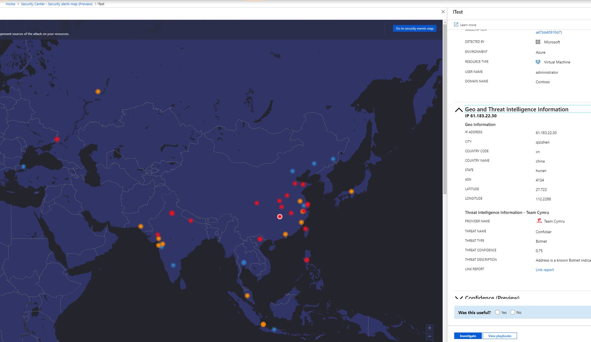
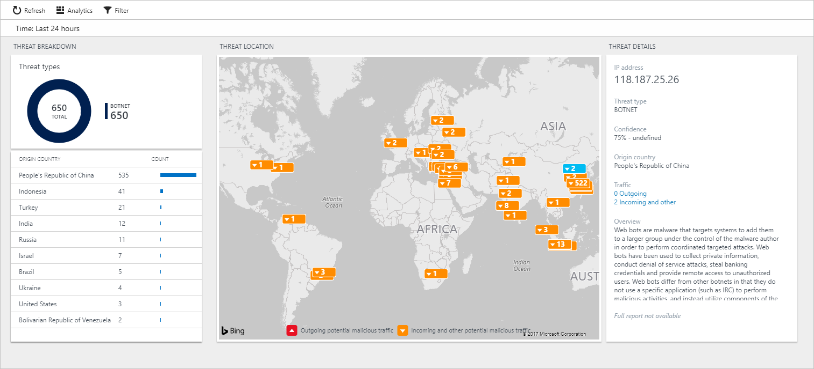
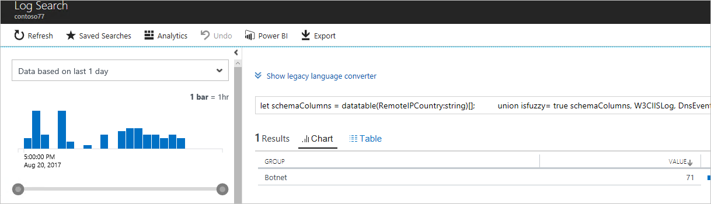
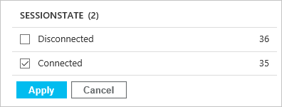

# Security alerts map and threat intelligence
This article helps you to use the Azure Security Center security alerts map and security event-based threat intelligence map to address security-related issues.

> [!NOTE]
> The Security *events* map button will be retired on July 31st, 2019. For more information and alternative services, see [Retirement of Security Center features (July 2019)](security-center-features-retirement-july2019.md#menu_securityeventsmap).

## How the security alerts map works
Security Center provides you with a map that helps you identify security threats against the environment. For example, you can identify whether a particular computer is part of a botnet, and where the threat is coming from. Computers can become nodes in a botnet when attackers illicitly install malware that secretly interacts with command and control that manage the botnet. 

To build this map, Security Center uses data that comes from multiple sources within Microsoft. Security Center uses this data to map potential threats against your environment. 

One of the steps of a [security incident response process](https://docs.microsoft.com/azure/security-center/security-center-planning-and-operations-guide#incident-response) is to identify the severity of the compromised system(s). In this phase, you should perform the following tasks:

- Determine the nature of the attack.
- Determine the point of origin of the attack.
- Determine the intent of the attack. Was the attack directed at your organization to acquire specific information, or was it random?
- Identify the systems that were compromised.
- Identify the files that were accessed and determine the sensitivity of those files.

You can use the Security alerts map in Security Center to help with these tasks.

## Access the Security alerts map
To visualize the current threats on your environment, open the Security alerts map:

1. Open the **Security Center** dashboard.
2. In the left pane, under **Threat Protection** select **Security alerts map**. The map opens.
3. To get more information about the alert and receive remediation steps, click on the Alert dot on the map and follow the instructions. 
 
The security alerts map is based on alerts. These alerts are based on activities for which network communication was associated with an IP address that was successfully resolved, whether or not the IP address is a known risky IP address (for example, a known cryptominer) or an IP address that is not recognized previously as risky. 
The map provides alerts across any subscriptions you previously selected in Azure. 

The alerts on the map are displayed according to the geographical location where they are detected as originating from, and they are color coded by severity. 
 	

## Viewing the event-based Threat intelligence dashboard
To view the Threat intelligence map based on raw security events, you can follow this procedure. This map displays only events that involve an IP address that is considered risk, for example an IP address of a known botnet.

1. Open the **Security Center** dashboard.

1. In the left pane, under **Threat Protection** select **Security alerts map**. The map opens.
2. In the top right corner, click **Go to security events map**.
3. Select the workspace for which you want to view the dashboard.
4. At the top of the map, select **View classic threat intelligence**. The **Threat intelligence** dashboard opens.

   > [!NOTE]
   > If the far-right column shows **UPGRADE PLAN**, this workspace is using the free subscription. Upgrade to Standard to use this feature. If the far-right column shows **REQUIRES UPDATE**, update [Azure Monitor logs](https://docs.microsoft.com/azure/log-analytics/log-analytics-overview) to use this feature. For more information about the pricing plan, read Azure Security Center pricing.
   >
5. If you have more than one workspace to investigate, prioritize the investigation according to the **Malicious IP** column. It shows the current number of malicious IPs in this workspace. Select the workspace that you want to use, and the **Threat intelligence** dashboard appears.

	

6. The dashboard is divided into four tiles:

	a.  **Threat types**. Summarizes the type of threats that were detected in the selected workspace.

	b.  **Origin country**. Aggregates the amount of traffic according to its source location.

	c.  **Threat location**. Helps you to identify the current locations around the globe that communicate with your environment. In the map shown, orange (incoming) and red (outgoing) arrows identify the traffic directions. If you select one of these arrows, the type of threat and the traffic direction appears.

	d.  **Threat details**. Shows more details about the threat that you selected in the map.

Regardless of which option tile you select, the dashboard that appears is based on the Log Search query. The only difference is the type of query and the result.

### Threat types
Select the **Threat types** tile to open the **Log Search** dashboard. Filter options appear on the left, and query results appear on the right.

The query result shows the threats by name. You can use the left pane to select the attribute that you want to filter. For example, to see only the threats that are currently connected to the machines, in **SESSIONSTATE**, select **Connected** > **Apply**.

For Azure VMs, only the network data that flows through the agent appears in the **Threat intelligence** dashboard. The following data types also are used by threat intelligence:

- CEF Data (Type=CommonSecurityLog)
- WireData (Type= WireData)
- IIS Logs (Type=W3CIISLog)
- Windows Firewall (Type=WindowsFirewall)
- DNS Events (Type=DnsEvents)

## See also
In this article, you learned how to use threat intelligence in Security Center to assist you in identifying suspicious activity. To learn more about Security Center, see the following articles:

* [Manage and respond to security alerts in Azure Security Center](https://docs.microsoft.com/azure/security-center/security-center-managing-and-responding-alerts). Learn how to manage alerts and respond to security incidents in Security Center.
* [Security health monitoring in Azure Security Center](security-center-monitoring.md). Learn how to monitor the health of your Azure resources.
* [Understand security alerts in Azure Security Center](https://docs.microsoft.com/azure/security-center/security-center-alerts-type). Learn about the different types of security alerts.
* [Azure Security Center troubleshooting guide](https://docs.microsoft.com/azure/security-center/security-center-troubleshooting-guide). Learn how to troubleshoot common issues in Security Center.
* [Azure Security Center FAQ](security-center-faq.md). Find answers to frequently asked questions about using the service.
* [Azure security blog](https://blogs.msdn.com/b/azuresecurity/). Find blog posts about Azure security and compliance.
