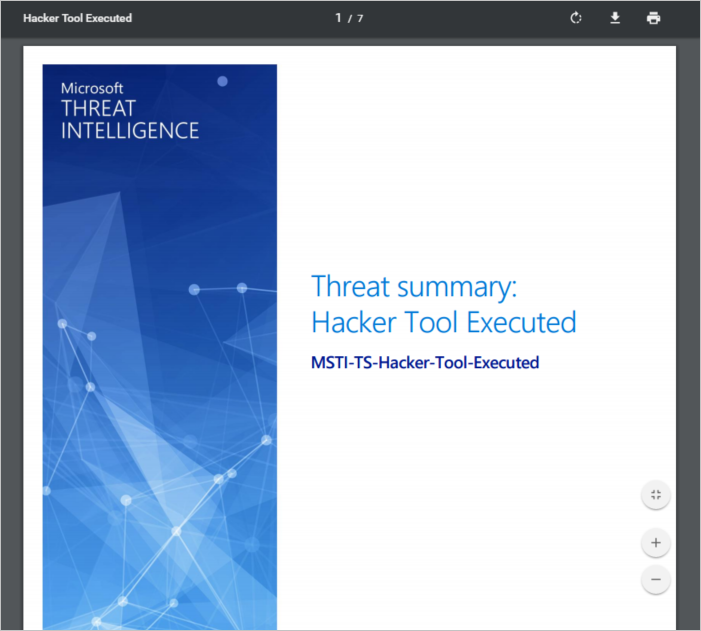

# Azure Security Center Threat Intelligence Report
This document explains how Azure Security Center Threat Intelligent Reports can help you learn more about a threat that generated a security alert.

## What is a threat intelligence report?
Security Center threat detection works by monitoring security information from your Azure resources, the network, and connected partner solutions. It analyzes this information, often correlating information from multiple sources, to identify threats. This process is part of the Security Center [detection capabilities](security-center-detection-capabilities.md).

When Security Center identifies a threat, it will trigger a [security alert](security-center-managing-and-responding-alerts.md), which contains detailed information regarding a particular event, including suggestions for remediation. To assist incident response teams investigate and remediate threats, Security Center includes a threat intelligence report that contains information about the threat that was detected, including information such as the:

* Attacker’s identity or associations (if this information is available)
* Attackers’ objectives
* Current and historical attack campaigns (if this information is available)
* Attackers’ tactics, tools and procedures
* Associated indicators of compromise (IoC) such as URLs and file hashes
* Victimology, which is the industry and geographic prevalence to assist you in determining if your Azure resources are at risk
* Mitigation and remediation information

> [!NOTE]
> The amount of information in any particular report will vary; the level of detail is based on the malware’s activity and prevalence.
>
>

Security Center has three types of threat reports, which can vary according to the attack. The reports available are:

* **Activity Group Report**: provides deep dives into attackers, their objectives and tactics.
* **Campaign Report**: focuses on details of specific attack campaigns.
* **Threat Summary Report**: covers all of the items in the previous two reports.

This type of information is very useful during the [incident response](security-center-incident-response.md) process, where there is an ongoing investigation to understand the source of the attack, the attacker’s motivations, and what to do to mitigate this issue moving forward.

## How to access the threat intelligence report?
You can review your current alerts by looking at the **Security alerts** tile. Open the Azure Portal and follow the steps below to see more details about each alert:

1. On the Security Center dashboard, you will see the **Security alerts** tile.
2. Click the tile to open the **Security alerts** blade that contains more details about the alerts and click in the security alert that you want to obtain more information about.

    
3. In this case the **Suspicious process executed** blade shows the details about the alert as shown in the figure below:

    
4. The amount of information available for each security alert will vary according to the type of alert. In the **REPORTS** field you have a link to the threat intelligence report. Click on it and another browser window will appear with PDF file.

   

From here you can download the PDF for this report and read more about the security issue that was detected and take actions based on the information provided.

## See also
In this document, you learned how Azure Security Center Threat Intelligent Reports can help during an investigation about security alerts. To learn more about Azure Security Center, see the following:

* [Azure Security Center FAQ](security-center-faq.md). Find frequently asked questions about using the service.
* [Leveraging Azure Security Center for Incident Response](security-center-incident-response.md)
* [Azure Security Center detection capabilities](security-center-detection-capabilities.md)
* [Azure Security Center planning and operations guide](security-center-planning-and-operations-guide.md). Learn how to plan and understand the design considerations to adopt Azure Security Center.
* [Managing and responding to security alerts in Azure Security Center](security-center-managing-and-responding-alerts.md). Learn how to manage and respond to security alerts.
* [Handling Security Incident in Azure Security Center](security-center-incident.md)
* [Azure Security Blog](http://blogs.msdn.com/b/azuresecurity/). Find blog posts about Azure security and compliance.
