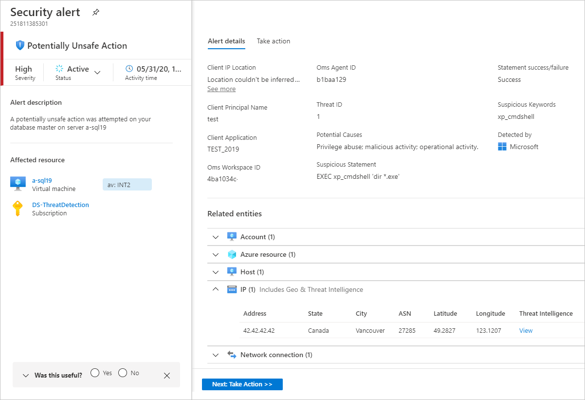
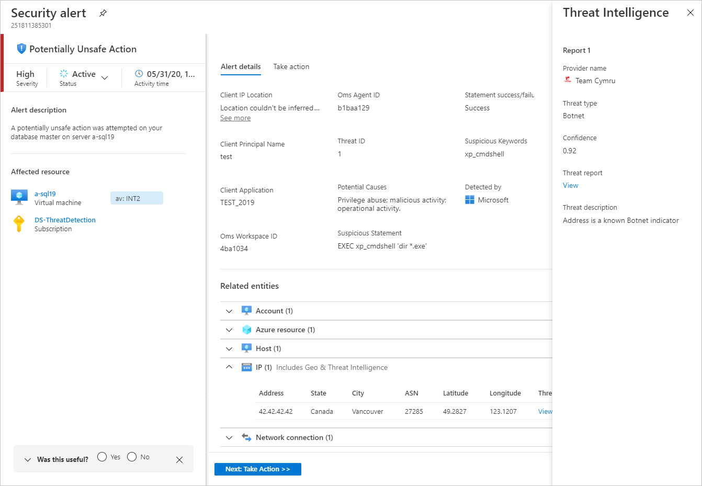

# Azure Security Center threat intelligence report

This page explains how Azure Security Center's threat intelligence reports can help you learn more about a threat that triggered a security alert.

## What is a threat intelligence report?

Security Center threat protection works by monitoring security information from your Azure resources, the network, and connected partner solutions. It analyzes this information, often correlating information from multiple sources, to identify threats. For more information, see [How Azure Security Center detects and responds to threats](security-center-alerts-overview.md#detect-threats).

When Security Center identifies a threat, it triggers a [security alert](security-center-managing-and-responding-alerts.md), which contains detailed information regarding the event, including suggestions for remediation. To help incident response teams investigate and remediate threats, Security Center provides threat intelligence reports containing information about detected threats. The report includes information such as:

* Attacker’s identity or associations (if this information is available)
* Attackers’ objectives
* Current and historical attack campaigns (if this information is available)
* Attackers’ tactics, tools, and procedures
* Associated indicators of compromise (IoC) such as URLs and file hashes
* Victimology, which is the industry and geographic prevalence to assist you in determining if your Azure resources are at risk
* Mitigation and remediation information

> [!NOTE]
> The amount of information in any particular report will vary; the level of detail is based on the malware’s activity and prevalence.

Security Center has three types of threat reports, which can vary according to the attack. The reports available are:

* **Activity Group Report**: provides deep dives into attackers, their objectives, and tactics.
* **Campaign Report**: focuses on details of specific attack campaigns.
* **Threat Summary Report**: covers all of the items in the previous two reports.

This type of information is useful during the incident response process, where there's an ongoing investigation to understand the source of the attack, the attacker’s motivations, and what to do to mitigate this issue in the future.

## How to access the threat intelligence report?

1. From Security Center's sidebar, open the **Security alerts** page.
1. Select an alert. 
    The alerts details page opens with more details about the alert. Below is the **Potentially Unsafe Action** alert details page.

    

1. The amount of information available for each security alert will vary according to the type of alert. In the **Threat Intelligence** field, select the **View** link to open the threat intelligence report pane.

    

From here you can download the PDF for this report, read more about the security issue that was detected, and take actions based on the information provided.

## Next steps

This page explained how to open threat intelligence reports to help an investigation of security alerts. To learn more about Azure Security Center, see the following pages:

* [Managing and responding to security alerts in Azure Security Center](security-center-managing-and-responding-alerts.md). Learn how to manage and respond to security alerts.
* [Handling security incidents in Azure Security Center](security-center-incident.md)