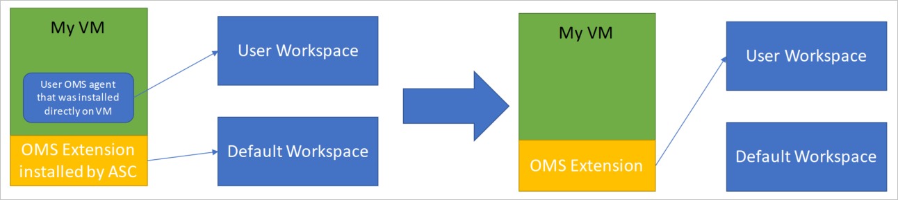

# Azure Security Center Troubleshooting Guide
This guide is for information technology (IT) professionals, information security analysts, and cloud administrators whose organizations are using Azure Security Center and need to troubleshoot Security Center related issues.

>[!NOTE] 
>Beginning in early June 2017, Security Center uses the Microsoft Monitoring Agent to collect and store data. See [Azure Security Center Platform Migration](security-center-platform-migration.md) to learn more. The information in this article represents Security Center functionality after transition to the Microsoft Monitoring Agent.
>

## Troubleshooting guide
This guide explains how to troubleshoot Security Center related issues. Most of the troubleshooting done in Security Center takes place by first looking at the [Audit Log](https://azure.microsoft.com/updates/audit-logs-in-azure-preview-portal/) records for the failed component. Through audit logs, you can determine:

* Which operations were taken place
* Who initiated the operation
* When the operation occurred
* The status of the operation
* The values of other properties that might help you research the operation

The audit log contains all write operations (PUT, POST, DELETE) performed on your resources, however it does not include read operations (GET).

## Microsoft Monitoring Agent
Security Center uses the Microsoft Monitoring Agent – this is the same agent used by the Operations Management Suite and Log Analytics service – to collect security data from your Azure virtual machines. After data collection is enabled and the agent is correctly installed in the target machine, the process below should be in execution:

* HealthService.exe

If you open the services management console (services.msc), you will also see the Microsoft Monitoring Agent service running as shown below:

To see which version of the agent you have, open **Task Manager**, in the **Processes** tab locate the **Microsoft Monitoring Agent Service**, right-click on it and click **Properties**. In the **Details** tab, look the file version as shown below:

   

## Microsoft Monitoring Agent installation scenarios
There are two installation scenarios that can produce different results when installing the Microsoft Monitoring Agent on your computer. The supported scenarios are:

* **Agent installed automatically by Security Center**: in this scenario you will be able to view the alerts in both locations, Security Center and Log search. You will receive e-mail notifications to the email address that was configured in the security policy for the subscription the resource belongs to.
.
* **Agent manually installed on a VM located in Azure**: in this scenario, if you are using agents downloaded and installed manually prior to February 2017, you will be able to view the alerts in the Security Center portal only if you filter on the subscription the workspace belongs to. In case you filter on the subscription the resource belongs to, you won’t be able to see any alerts. You will receive e-mail notifications to the email address that was configured in the security policy for the subscription the workspace belongs to.

>[!NOTE]
> To avoid the behavior explained in the second, make sure you download the latest version of the agent.
> 

## Troubleshooting monitoring agent network requirements
For agents to connect to and register with Security Center, they must have access to network resources, including the port numbers and domain URLs.

- For proxy servers, you need to ensure that the appropriate proxy server resources are configured in agent settings. Read this article for more information on [how to change the proxy settings](https://docs.microsoft.com/en-us/azure/log-analytics/log-analytics-windows-agents#configure-proxy-settings).
- For firewalls that restrict access to the Internet, you need to configure your firewall to permit access to OMS. No action is needed in agent settings.

The following table shows resources needed for communication.

| Agent Resource | Ports | Bypass HTTPS inspection |
|---|---|---|
| *.ods.opinsights.azure.com | 443 | Yes |
| *.oms.opinsights.azure.com | 443 | Yes |
| *.blob.core.windows.net | 443 | Yes |
| *.azure-automation.net | 443 | Yes |

If you encounter onboarding issues with the agent, make sure to read the article [How to troubleshoot Operations Management Suite onboarding issues](https://support.microsoft.com/en-us/help/3126513/how-to-troubleshoot-operations-management-suite-onboarding-issues).

## Troubleshooting endpoint protection not working properly

The guest agent is the parent process of everything the [Microsoft Antimalware](../security/azure-security-antimalware.md) extension does. When the guest agent process fails, the Microsoft Antimalware that runs as a child process of the guest agent may also fail.  In scenarios like that is recommended to verify the following options:

- If the target VM is a custom image and the creator of the VM never installed guest agent.
- If the target is a Linux VM instead of a Windows VM then installing the Windows version of the antimalware extension on a Linux VM will fail. The Linux guest agent has specific requirements in terms of OS version and required packages, and if those requirements are not met the VM agent will not work there either. 
- If the VM was created with an old version of guest agent. If it was, you should be aware that some old agents could not auto-update itself to the newer version and this could lead to this problem. Always use the latest version of guest agent if creating your own images.
- Some third-party administration software may disable the guest agent, or block access to certain file locations. If you have third-party installed on your VM, make sure that the agent is on the exclusion list.
- Certain firewall settings or Network Security Group (NSG) may block network traffic to and from guest agent.
- Certain Access Control List (ACL) may prevent disk access.
- Lack of disk space can block the guest agent from functioning properly. 

By default the Microsoft Antimalware User Interface is disabled, read [Enabling Microsoft Antimalware User Interface on Azure Resource Manager VMs Post Deployment](https://blogs.msdn.microsoft.com/azuresecurity/2016/03/09/enabling-microsoft-antimalware-user-interface-post-deployment/) for more information on how to enable it if you need.

## Troubleshooting problems loading the dashboard

If you experience issues loading the Security Center dashboard, ensure that the user that registers the subscription to Security Center (i.e. the first user one who opened Security Center with the subscription) and the user who would like to turn on data collection should be *Owner* or *Contributor* on the subscription. From that moment on also users with *Reader* on the subscription can see the dashboard/alerts/recommendation/policy.

## Troubleshooting platform migration

Beginning in early June 2017, Azure Security Center rolls out important changes to the way security data is collected and stored.  Read [Azure Security Center platform migration](https://docs.microsoft.com/azure/security-center/security-center-platform-migration) for more information about these changes. The sections that follow have some common known issues that could be caused during this migration, and how to fix it.

### Windows VMs that already had non-extension OMS are now reporting to 2 workspaces (multihoming)

Multihoming can happen only when Security Center identifies that a VM doesn’t have OMS extension, but there's non-extension agent install on the VM. For direct agent, the solution is to 'surface' the agent installed on the VM as an extension. Security Center will not touch existing extensions and will attempt to use existing connections to collect security data, as shown in this diagram:

Assuming that the OMS agent was originally connected to *workspace X*, you can re-install the OMS extension with configuration pointing in to *workspace X*, by following one of these methods:

* Manually disconnecting the VMs from the Security Center default workspace, and connect it to the user workspace via the [Log Analytics](https://docs.microsoft.com/azure/log-analytics/log-analytics-overview) in Azure portal.
* Re-install the extension using PowerShell script.

>[!NOTE] 
> See [Azure Security Center Platform Migration FAQ]() for more details about multihoming issues.
>

### The extension created by Security caused an unwanted version upgrade to existing agent
Security Center installs the latest version of OMS extension. If your environment is dependent on specific version, you should reevaluate the need to use an old version, since the recommendation is to use the latest version, and if upgrade is still not possible, you can disable data collection on the subscription containing the VMs, remove to OMS extension and install the correct OMS version.

The installation of the OMS extension and the creation of default workspaces is done when the customer enables the data collection in Security Center policy blade. For 'Standard' tier Security Center customers, the data collection is enabled by default and cannot be disabled unless the pricing tier is change to 'Free'. Disabling the data collection means that Security Center will no longer able be to provide security recommendations and alerts for your VMs, and therefore is not recommended. 

>[!NOTE] 
>This is a last resort solution.

## Contacting Microsoft Support
Some issues can be identified using the guidelines provided in this article, others you can also find documented at the Security Center public [Forum](https://social.msdn.microsoft.com/Forums/en-US/home?forum=AzureSecurityCenter). However if you need further troubleshooting, you can open a new support request using **Azure portal** as shown below: 

## See also
In this document, you learned how to configure security policies in Azure Security Center. To learn more about Azure Security Center, see the following:

* [Azure Security Center Planning and Operations Guide](security-center-planning-and-operations-guide.md) — Learn how to plan and understand the design considerations to adopt Azure Security Center.
* [Security health monitoring in Azure Security Center](security-center-monitoring.md) — Learn how to monitor the health of your Azure resources
* [Managing and responding to security alerts in Azure Security Center](security-center-managing-and-responding-alerts.md) — Learn how to manage and respond to security alerts
* [Monitoring partner solutions with Azure Security Center](security-center-partner-solutions.md) — Learn how to monitor the health status of your partner solutions.
* [Azure Security Center FAQ](security-center-faq.md) — Find frequently asked questions about using the service
* [Azure Security Blog](http://blogs.msdn.com/b/azuresecurity/) — Find blog posts about Azure security and compliance

