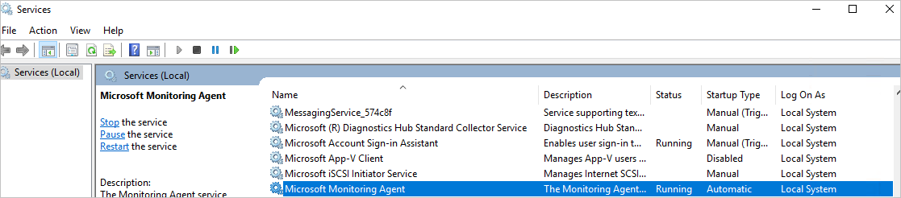

# Azure Security Center Troubleshooting Guide
This guide is for information technology (IT) professionals, information security analysts, and cloud administrators whose organizations are using Azure Security Center and need to troubleshoot Security Center related issues.

>[!NOTE]
>Beginning in early June 2017, Security Center uses the Microsoft Monitoring Agent to collect and store data. See [Azure Security Center Platform Migration](security-center-platform-migration.md) to learn more. The information in this article represents Security Center functionality after transition to the Microsoft Monitoring Agent.
>

## Troubleshooting guide
This guide explains how to troubleshoot Security Center related issues. Most of the troubleshooting done in Security Center takes place by first looking at the [Audit Log](https://azure.microsoft.com/updates/audit-logs-in-azure-preview-portal/) records for the failed component. Through audit logs, you can determine:

* Which operations were taken place
* Who initiated the operation
* When the operation occurred
* The status of the operation
* The values of other properties that might help you research the operation

The audit log contains all write operations (PUT, POST, DELETE) performed on your resources, however it does not include read operations (GET).

## Microsoft Monitoring Agent
Security Center uses the Microsoft Monitoring Agent – this is the same agent used by the Log Analytics service – to collect security data from your Azure virtual machines. After data collection is enabled and the agent is correctly installed in the target machine, the process below should be in execution:

* HealthService.exe

If you open the services management console (services.msc), you will also see the Microsoft Monitoring Agent service running as shown below:

To see which version of the agent you have, open **Task Manager**, in the **Processes** tab locate the **Microsoft Monitoring Agent Service**, right-click on it and click **Properties**. In the **Details** tab, look the file version as shown below:

## Microsoft Monitoring Agent installation scenarios
There are two installation scenarios that can produce different results when installing the Microsoft Monitoring Agent on your computer. The supported scenarios are:

* **Agent installed automatically by Security Center**: in this scenario you will be able to view the alerts in both locations, Security Center and Log search. You will receive e-mail notifications to the email address that was configured in the security policy for the subscription the resource belongs to.
.
* **Agent manually installed on a VM located in Azure**: in this scenario, if you are using agents downloaded and installed manually prior to February 2017, you will be able to view the alerts in the Security Center portal only if you filter on the subscription the workspace belongs to. In case you filter on the subscription the resource belongs to, you won’t be able to see any alerts. You will receive e-mail notifications to the email address that was configured in the security policy for the subscription the workspace belongs to.

>[!NOTE]
> To avoid the behavior explained in the second scenario, make sure you download the latest version of the agent.
>

## Monitoring agent health issues 
**Monitoring state** defines the reason Security Center is unable to successfully monitor VMs and computers initialized for automatic provisioning. The following table shows the **Monitoring state** values, descriptions, and resolution steps.

| Monitoring state | Description | Resolution steps |
|---|---|---|
| Pending agent installation | The Microsoft Monitoring Agent installation is still running.  Installation can take up to a few hours. | Wait until automatic installation is complete. |
| Power state off | The VM is stopped.  The Microsoft Monitoring Agent can only be installed on a VM that is running. | Restart the VM. |
| Missing or invalid Azure VM agent | The Microsoft Monitoring Agent is not installed yet.  For Security Center to install the extension a valid Azure VM agent is required. | Install, reinstall or upgrade the Azure VM agent on the VM. |
| VM state not ready for installation  | The Microsoft Monitoring Agent is not installed yet because the VM is not ready for installation. The VM is not ready for installation due to a problem with the VM agent or VM provisioning. | Check the status of your VM. Return to **Virtual Machines** in the portal and select the VM for status information. |
|Installation failed - general error | The Microsoft Monitoring Agent was installed but failed due to an error. | [Manually install the extension](../log-analytics/log-analytics-quick-collect-azurevm.md#enable-the-log-analytics-vm-extension) or uninstall the extension so Security Center will try to install again. |
| Installation failed -  local agent already installed | Microsoft Monitoring Agent install failed. Security Center identified a local agent (OMS or SCOM) already installed on the VM. To avoid multi-homing configuration, where the VM is reporting to two separate workspaces, the Microsoft Monitoring Agent installation stopped. | There are two ways to resolve: [manually install the extension](../log-analytics/log-analytics-quick-collect-azurevm.md#enable-the-log-analytics-vm-extension) and connect it to your desired workspace. Or, set your desired workspace as your default workspace and enable automatic provisioning of the agent.  See [enable automatic provisioning](security-center-enable-data-collection.md). |
| Agent cannot connect to workspace | Microsoft Monitoring Agent installed but failed due to network connectivity.  Check that there is  internet access or that a valid HTTP proxy has been configured for the agent. | See [monitoring agent network requirements](#troubleshooting-monitoring-agent-network-requirements). |
| Agent connected to missing or unknown workspace | Security Center identified that the Microsoft Monitoring Agent installed on the VM is connected to a workspace which it doesn’t have access to. | This can happen in two cases. The workspace was deleted and no longer exists. Reinstall the agent with the correct workspace or uninstall the agent and allow Security Center to complete its automatic provisioning installation. The second case is where the workspace is part of a subscription that Security Center does not have permissions to. Security Center requires subscriptions to allow the Microsoft Security Resource Provider to access them. To enable, register the subscription to the Microsoft Security Resource Provider. This can be done by API, PowerShell, portal or by simply filtering on the subscription in the Security Center **Overview** dashboard. See [Resource providers and types](../azure-resource-manager/resource-manager-supported-services.md#portal) for more information. |
| Agent not responsive or missing ID | Security Center is unable to retrieve security data scanned from the VM, even though the agent is installed. | The agent is not reporting any data, including heartbeat. The agent might be damaged or something is blocking traffic. Or, the agent is reporting data but is missing an Azure resource ID so it’s impossible to match the data to the Azure VM. To troubleshoot Linux, see [Troubleshooting Guide for OMS Agent for Linux](https://github.com/Microsoft/OMS-Agent-for-Linux/blob/master/docs/Troubleshooting.md#im-not-seeing-any-linux-data-in-the-oms-portal). To troubleshoot Windows, see [Troubleshooting Windows Virtual Machines](https://github.com/MicrosoftDocs/azure-docs/blob/8c53ac4371d482eda3d85819a4fb8dac09996a89/articles/log-analytics/log-analytics-azure-vm-extension.md#troubleshooting-windows-virtual-machines). |
| Agent not installed | Data collection is disabled. | Turn on data collection in the security policy or manually install the Microsoft Monitoring Agent. |

## Troubleshooting monitoring agent network requirements 
For agents to connect to and register with Security Center, they must have access to network resources, including the port numbers and domain URLs.

- For proxy servers, you need to ensure that the appropriate proxy server resources are configured in agent settings. Read this article for more information on [how to change the proxy settings](https://docs.microsoft.com/azure/log-analytics/log-analytics-windows-agents#configure-proxy-settings).
- For firewalls that restrict access to the Internet, you need to configure your firewall to permit access to Log Analytics. No action is needed in agent settings.

The following table shows resources needed for communication.

| Agent Resource | Ports | Bypass HTTPS inspection |
|---|---|---|
| *.ods.opinsights.azure.com | 443 | Yes |
| *.oms.opinsights.azure.com | 443 | Yes |
| *.blob.core.windows.net | 443 | Yes |
| *.azure-automation.net | 443 | Yes |

If you encounter onboarding issues with the agent, make sure to read the article [How to troubleshoot Operations Management Suite onboarding issues](https://support.microsoft.com/en-us/help/3126513/how-to-troubleshoot-operations-management-suite-onboarding-issues).

## Troubleshooting endpoint protection not working properly

The guest agent is the parent process of everything the [Microsoft Antimalware](../security/azure-security-antimalware.md) extension does. When the guest agent process fails, the Microsoft Antimalware that runs as a child process of the guest agent may also fail.  In scenarios like that is recommended to verify the following options:

- If the target VM is a custom image and the creator of the VM never installed guest agent.
- If the target is a Linux VM instead of a Windows VM then installing the Windows version of the antimalware extension on a Linux VM will fail. The Linux guest agent has specific requirements in terms of OS version and required packages, and if those requirements are not met the VM agent will not work there either.
- If the VM was created with an old version of guest agent. If it was, you should be aware that some old agents could not auto-update itself to the newer version and this could lead to this problem. Always use the latest version of guest agent if creating your own images.
- Some third-party administration software may disable the guest agent, or block access to certain file locations. If you have third-party installed on your VM, make sure that the agent is on the exclusion list.
- Certain firewall settings or Network Security Group (NSG) may block network traffic to and from guest agent.
- Certain Access Control List (ACL) may prevent disk access.
- Lack of disk space can block the guest agent from functioning properly.

By default the Microsoft Antimalware User Interface is disabled, read [Enabling Microsoft Antimalware User Interface on Azure Resource Manager VMs Post Deployment](https://blogs.msdn.microsoft.com/azuresecurity/2016/03/09/enabling-microsoft-antimalware-user-interface-post-deployment/) for more information on how to enable it if you need.

## Troubleshooting problems loading the dashboard

If you experience issues loading the Security Center dashboard, ensure that the user that registers the subscription to Security Center (i.e. the first user one who opened Security Center with the subscription) and the user who would like to turn on data collection should be *Owner* or *Contributor* on the subscription. From that moment on also users with *Reader* on the subscription can see the dashboard/alerts/recommendation/policy.

## Contacting Microsoft Support
Some issues can be identified using the guidelines provided in this article, others you can also find documented at the Security Center public [Forum](https://social.msdn.microsoft.com/Forums/en-US/home?forum=AzureSecurityCenter). However if you need further troubleshooting, you can open a new support request using **Azure portal** as shown below:

## See also
In this document, you learned how to configure security policies in Azure Security Center. To learn more about Azure Security Center, see the following:

* [Azure Security Center Planning and Operations Guide](security-center-planning-and-operations-guide.md) — Learn how to plan and understand the design considerations to adopt Azure Security Center.
* [Security health monitoring in Azure Security Center](security-center-monitoring.md) — Learn how to monitor the health of your Azure resources
* [Managing and responding to security alerts in Azure Security Center](security-center-managing-and-responding-alerts.md) — Learn how to manage and respond to security alerts
* [Monitoring partner solutions with Azure Security Center](security-center-partner-solutions.md) — Learn how to monitor the health status of your partner solutions.
* [Azure Security Center FAQ](security-center-faq.md) — Find frequently asked questions about using the service
* [Azure Security Blog](http://blogs.msdn.com/b/azuresecurity/) — Find blog posts about Azure security and compliance
