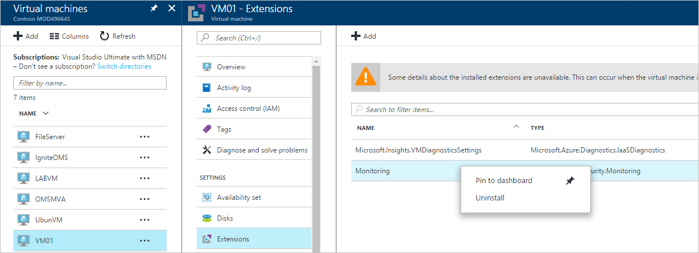

# Azure Security Center Troubleshooting Guide
This guide is for information technology (IT) professionals, information security analysts, and cloud administrators whose organizations are using Azure Security Center and need to troubleshoot Security Center related issues.

## Troubleshooting guide
This guide explains how to troubleshoot Security Center related issues. Most of the troubleshooting done in Security Center will take place by first looking at the [Audit Log](https://azure.microsoft.com/updates/audit-logs-in-azure-preview-portal/) records for the failed component. Through audit logs, you can determine:

* Which operations were taken place
* Who initiated the operation
* When the operation occurred
* The status of the operation
* The values of other properties that might help you research the operation

The audit log contains all write operations (PUT, POST, DELETE) performed on your resources, however it does not include read operations (GET).

## Troubleshooting monitoring agent installation in Windows
The Security Center monitoring agent is used to perform data collection. After data collection is enabled and the agent is correctly installed in the target machine, these processes should be in execution:

* ASMAgentLauncher.exe - Azure Monitoring Agent 
* ASMMonitoringAgent.exe - Azure Security Monitoring extension
* ASMSoftwareScanner.exe – Azure Scan Manager

The Azure Security Monitoring extension scans for various security relevant configurations and collects security logs from the virtual machine. The scan manager will be used as a patch scanner.

If the installation is successfully performed you should see an entry similar to the one below in the Audit Logs for the target VM:

You can also obtain more information about the installation process by reading the agent logs, located at *%systemdrive%\windowsazure\logs* (example: C:\WindowsAzure\Logs).

> [!NOTE]
> If the Azure Security Center Agent is misbehaving, you will need to restart the target VM since there is no command to stop and start the agent.

If you are still having problems with data collection, you can uninstall the agent by following the steps below:

1. From the **Azure Portal**, select the virtual machine that is experience data collection issues and click **Extensions**.
2. Right click in **Microsoft.Azure.Security.Monitoring** and select click **Uninstall**.

The Azure Security Monitoring extension should automatically reinstall itself within several minutes.

## Troubleshooting monitoring agent installation in Linux
When troubleshooting VM Agent installation in a Linux system you should ensure that the extension was downloaded to /var/lib/waagent/. You can run the command below to verify if it was installed:

`cat /var/log/waagent.log` 

The other log files that you can review for troubleshooting purpose are: 

* /var/log/mdsd.err
* /var/log/azure/

In a working system you should see a connection to the mdsd process on TCP 29130. This is the syslog communicating with the mdsd process. You can validate this behavior by running the command below:

`netstat -plantu | grep 29130`

## Troubleshooting endpoint protection not working properly

The guest agent is the parent process of everything the [Microsoft Antimalware](../security/azure-security-antimalware.md) extension does. When the guest agent process fails, the Microsoft Antimalware that runs as a child process of the guest agent may also fail.  In scenarios like that is recommended to verify the following options:

- If the target VM is a custom image and the creator of the VM never installed guest agent.
- If the target is a Linux VM instead of a Windows VM then installing the Windows version of the antimalware extension on a Linux VM will fail. The Linux guest agent has specific requirements in terms of OS version and required packages, and if those requirements are not met the VM agent will not work there either. 
- If the VM was created with an old version of guest agent. If it was, you should be aware that some old agents could not auto-update itself to the newer version and this could lead to this problem. Always use the latest version of guest agent if creating your own images.
- Some third-party administration software may disable the guest agent, or block access to certain file locations. If you have third-party installed on your VM, make sure that the agent is on the exclusion list.
- Certain firewall settings or Network Security Group (NSG) may block network traffic to and from guest agent.
- Certain Access Control List (ACL) may prevent disk access.
- Lack of disk space can block the guest agent from functioning properly. 

By default the Microsoft Antimalware User Interface is disabled, read [Enabling Microsoft Antimalware User Interface on Azure Resource Manager VMs Post Deployment](https://blogs.msdn.microsoft.com/azuresecurity/2016/03/09/enabling-microsoft-antimalware-user-interface-post-deployment/) for more information on how to enable it if you need.

## Troubleshooting problems loading the dashboard

If you experience issues loading the Security Center dashboard, ensure that the user that registers the subscription to Security Center (i.e. the first user one who opened Security Center with the subscription) and the user who would like to turn on data collection should be *Owner* or *Contributor* on the subscription. From that moment on also users with *Reader* on the subscription can see the dashboard/alerts/recommendation/policy.

## Contacting Microsoft Support
Some issues can be identified using the guidelines provided in this article, others you can also find documented at the Security Center public [Forum](https://social.msdn.microsoft.com/Forums/en-US/home?forum=AzureSecurityCenter). However if you need further troubleshooting, you can open a new support request using **Azure Portal** as shown below: 

## See also
In this document, you learned how to configure security policies in Azure Security Center. To learn more about Azure Security Center, see the following:

* [Azure Security Center Planning and Operations Guide](security-center-planning-and-operations-guide.md) — Learn how to plan and understand the design considerations to adopt Azure Security Center.
* [Security health monitoring in Azure Security Center](security-center-monitoring.md) — Learn how to monitor the health of your Azure resources
* [Managing and responding to security alerts in Azure Security Center](security-center-managing-and-responding-alerts.md) — Learn how to manage and respond to security alerts
* [Monitoring partner solutions with Azure Security Center](security-center-partner-solutions.md) — Learn how to monitor the health status of your partner solutions.
* [Azure Security Center FAQ](security-center-faq.md) — Find frequently asked questions about using the service
* [Azure Security Blog](http://blogs.msdn.com/b/azuresecurity/) — Find blog posts about Azure security and compliance

