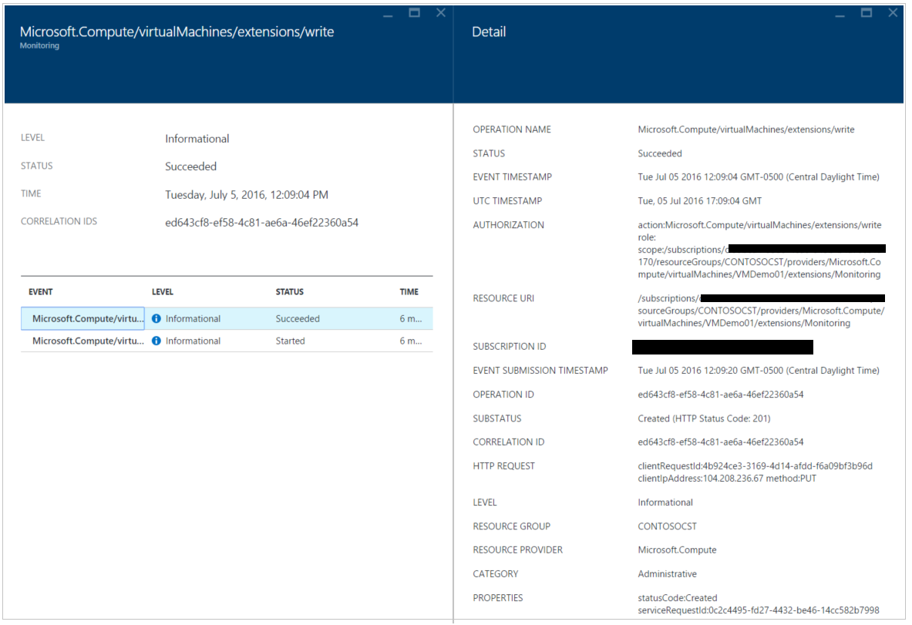

<properties
   pageTitle="Azure Security Center Troubleshooting Guide | Microsoft Azure"
   description="This document helps to troubleshoot issues in Azure Security Center."
   services="security-center"
   documentationCenter="na"
   authors="YuriDio"
   manager="swadhwa"
   editor=""/>

<tags
   ms.service="security-center"
   ms.devlang="na"
   ms.topic="hero-article"
   ms.tgt_pltfrm="na"
   ms.workload="na"
   ms.date="07/21/2016"
   ms.author="yurid"/>

# Azure Security Center Troubleshooting Guide
This guide is for information technology (IT) professionals, information security analysts and cloud administrators whose organizations are using Azure Security Center and need to troubleshoot Security Center related issues.

## Troubleshooting guide
This guide explains how to troubleshoot Security Center related issues. Most of the troubleshooting done in Security Center will take place by first looking at the [Audit Log](https://azure.microsoft.com/updates/audit-logs-in-azure-preview-portal/) records for the failed component. Through audit logs, you can determine:

- Which operations were taken place
- Who initiated the operation
- When the operation occurred
- The status of the operation
- The values of other properties that might help you research the operation

The audit log contains all write operations (PUT, POST, DELETE) performed on your resources, however it does not include read operations (GET).

## Troubleshooting monitoring agent installation in Windows

The Security Center monitoring agent is used to perform data collection. After data collection is enabled and the agent is correctly installed in the target machine, these processes should be in execution:

- ASMAgentLauncher.exe - Azure Monitoring Agent 
- ASMMonitoringAgent.exe - Azure Security Monitoring extension
- ASMSoftwareScanner.exe – Azure Scan Manager

The Azure Security Monitoring extension scans for various security relevant configuration and collects security logs from the virtual machine. The scan manager will be used as a patch scanner.

If the installation is successfully performed you should see an entry similar to the one below in the Audit Logs for the target VM:

You can also obtain more information about the installation process by reading the agent logs, located at *%systemdrive%\windowsazure\logs* (example: C:\WindowsAzure\Logs).

> [AZURE.NOTE] If the Azure Security Center Agent is misbehaving, you will need to restart the target VM since there is no command to stop and start the agent.

## Troubleshooting monitoring agent installation in Linux
When troubleshooting VM Agent installation in a Linux system you should ensure that the extension was downloaded to /var/lib/waagent/. You can run the command below to verify if it was installed:

`cat /var/log/waagent.log` 

The other log files that you can review for troubleshooting purpose are: 

- /var/log/mdsd.err
- /var/log/azure/

In a working system you should see a connection to the mdsd process on TCP 29130. This is the syslog communicating with the mdsd process. You can validate this behavior by running the command below:

`netstat -plantu | grep 29130`

## Contacting Microsoft Support

Some issues can be identified using the guidelines provided in this article, others you can also find documented at the Security Center public [Forum](https://social.msdn.microsoft.com/Forums/en-US/home?forum=AzureSecurityCenter). However if you need further troubleshooting, you can open a new support request using Azure Portal as shown below: 

## See also

In this document, you learned how to configure security policies in Azure Security Center. To learn more about Azure Security Center, see the following:

- [Azure Security Center Planning and Operations Guide](security-center-planning-and-operations-guide.md) - Learn how to plan and understand the design considerations to adopt Azure Security Center.
- [Security health monitoring in Azure Security Center](security-center-monitoring.md) – Learn how to monitor the health of your Azure resources
- [Managing and responding to security alerts in Azure Security Center](security-center-managing-and-responding-alerts.md) - Learn how to manage and respond to security alerts
- [Monitoring partner solutions with Azure Security Center](security-center-partner-solutions.md) -- Learn how to monitor the health status of your partner solutions.
- [Azure Security Center FAQ](security-center-faq.md) – Find frequently asked questions about using the service
- [Azure Security Blog](http://blogs.msdn.com/b/azuresecurity/) – Find blog posts about Azure security and compliance
