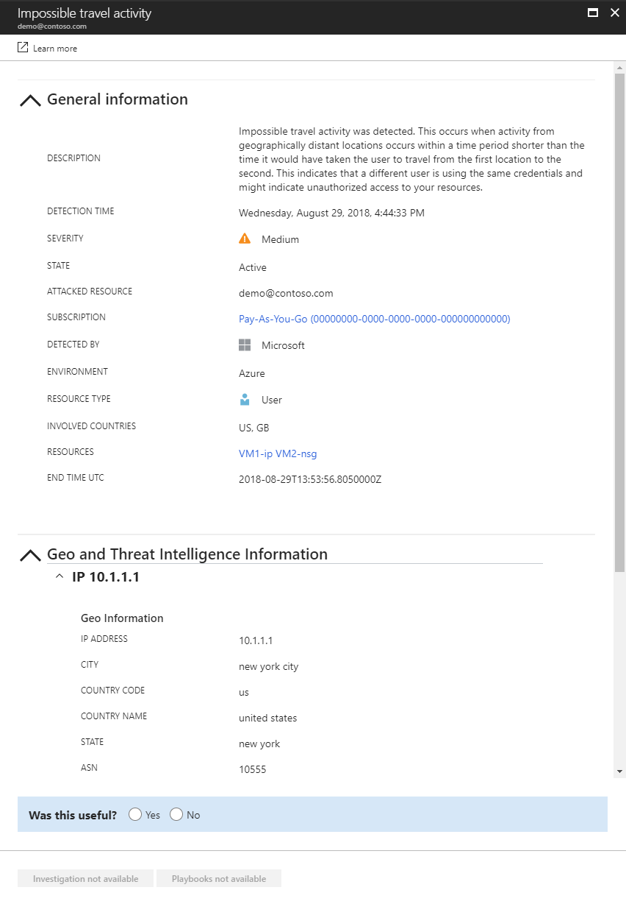
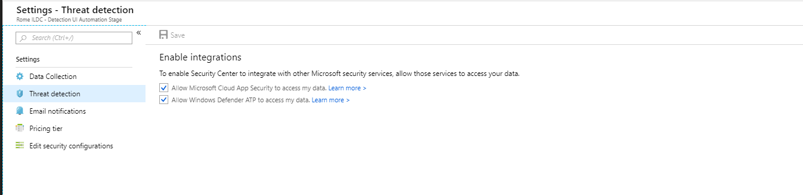

# UEBA for Azure resources and users 

Azure Security Center partners with Microsoft Cloud App Security to bring you alerts based on user and entity behavioral analytics (UEBA) for your Azure resources and users (Azure activity). These alerts detect anomalies in user behavior and are based on user and entity behavioral analytics and machine learning (ML) so that you can immediately run advanced threat detection across your subscriptions' activities. Because they are automatically enabled, the new anomaly detections provide immediate results by providing immediate detections, targeting numerous behavioral anomalies across the users and resources associated with your subscription. In addition, these alerts leverage additional data that already exists in the Microsoft Cloud App Security detection engine, to help you speed up the investigation process and contain ongoing threats. 

> [!NOTE]
> Azure Security Center, which may store a copy of security-related customer data, collected from or associated with a customer resource (e.g. virtual machine or Azure Active Directory tenant): (a) in the same Geo as that resource, except in those Geos where Microsoft has yet to deploy Azure Security Center, in which case a copy of such data will be stored in the United States; and (b) where Azure Security Center uses another Microsoft Online Service to process such data, it may store such data in accordance with the geolocation rules of that other Online Service.
>

[!INCLUDE [gdpr-intro-sentence.md](../../includes/gdpr-intro-sentence.md)]

## Prerequisites

- A valid, activated [Microsoft Cloud App Security license](https://docs.microsoft.com/cloud-app-security/getting-started-with-cloud-app-security)
- [Security Center Standard tier](https://azure.microsoft.com/pricing/details/security-center/)
 
## Threat detection alerts

Security Center supports Cloud App Security anomaly detection alerts, such as:

**Impossible travel**
-  This detection identifies two user activities (is a single or multiple sessions) originating from geographically distant locations within a time period shorter than the time it would have taken the user to travel from the first location to the second, indicating that a different user is using the same credentials. This detection leverages a machine learning algorithm that ignores obvious "false positives" contributing to the impossible travel condition, such as VPNs and locations regularly used by other users in the organization. The detection has an initial learning period of seven days during which it learns a new user’s activity pattern.

**Activity from infrequent country**
- This detection considers past activity locations to determine new and infrequent locations. The anomaly detection engine stores information about previous locations used by users in the organization. An alert is triggered when an activity occurs from a location that was not recently or never visited by any user in the organization. 

**Activity from anonymous IP addresses**
- This detection identifies that users were active from an IP address that has been identified as an anonymous proxy IP address. These proxies are used by people who want to hide their device’s IP address, and may be used for malicious intent. This detection leverages a machine learning algorithm that reduces "false positives", such as mis-tagged IP addresses that are widely used by users in the organization.
 
  

## Disabling threat detection alerts

These alerts are enabled by default, but you can disable them:

1. In the Security Center blade, select **Pricing & settings** and select the applicable subscription.
2. Click **Threat detection**.
3. Under **Enable integrations**, uncheck **Allow Microsoft Cloud App Security to access my data**, and click **Save**.

   

> [!NOTE]
> There is an initial learning period of seven days during which not all anomaly detection alerts are raised. After that, each session is compared to the activity, when users were active, IP addresses, devices, etc. detected over the past month and the risk score of these activities. These detections are part of the machine learning anomaly detection engine that profiles your environment and triggers alerts with respect to a baseline that was learned on your organization’s activity. These detections also leverage machine learning algorithms designed to profile the users and log-on pattern to reduce false positives.
>
  
## Next steps
This article showed you to work with threat detection in Azure Security Center. To learn more about Security Center, see the following:

* [Azure Security Center FAQ](security-center-faq.md)--Find frequently asked questions about using the service.
* [Security health monitoring in Azure Security Center](security-center-monitoring.md)--Learn how to monitor the health of your Azure resources.

<!--Image references-->
[1]: ./media/security-center-confidence-score/confidence-score.png
[2]: ./media/security-center-confidence-score/suspicious-confidence-score.png
