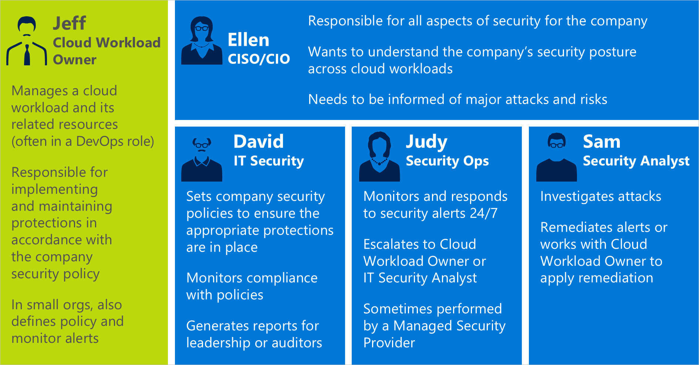

# Use Azure Security Center recommendations to enhance security
You can reduce the chances of a significant security event by configuring a security policy and then implementing the recommendations provided by Azure Security Center. This article shows you how to use security policies and recommendations in Security Center to help mitigate a security attack. 

Security Center automatically runs continuous scans to analyze the security state of your Azure resources. When Security Center identifies potential security vulnerabilities, it creates recommendations that guide you through the process of configuring the needed security controls. Security Center updates its recommendations within 24 hours, with the following exceptions:

- Operating system security configuration recommendations are updated within 48 hours
- Endpoint Protection issues recommendations are updated within 8 hours

## Scenario
This scenario shows you how to use Security Center to help reduce the chances of a security incident by monitoring Security Center recommendations and taking action. The scenario uses the fictitious company, Contoso, and roles presented in the Security Center [planning and operations guide](security-center-planning-and-operations-guide.md#security-roles-and-access-controls). In this scenario, we're focusing on the roles of the following personas:

Contoso recently migrated some of their on-premises resources to Azure. Contoso wants to protect their resources and reduce vulnerability of their resources in the cloud.

## Use Azure Security Center
David, from Contoso's IT security, has already chosen to onboard Security Center on Contoso's subscriptions to Azure Security Center to prevent and detect security vulnerabilities. 

Security Center automatically analyzes the security state of Contoso’s Azure resources and applies default security policies. When Security Center identifies potential security vulnerabilities, it creates **recommendations** based on the controls set in the security policy. 

David runs Azure Security standard tier, across all their subscriptions to get the full suite of recommendations and security features available. Jeff also onboards all their existing on-premises servers that haven't yet been migrated to the cloud so that they can take advantage of Security Center's hybrid support across their [Windows](quick-onboard-windows-computer.md) and [Linux](quick-onboard-linux-computer.md) servers.

Jeff is a cloud workload owner. Jeff is responsible for applying security controls in accordance with Contoso’s security policies. 

Jeff performs the following tasks:

- Monitor security recommendations provided by Security Center
- Evaluate security recommendations and decide if they should apply or dismiss the recommendations.
- Apply security recommendations

### Remediate threats using recommendations
As part of their daily monitoring activities, Jeff signs in to Azure and opens Security Center. 

1. Jeff selects the workload's subscriptions.

2. Jeff checks the **Secure Score** to get an overall picture of how secure the subscriptions are and sees that the score is 548.

3. Jeff has to decide which recommendations to handle first. So Jeff clicks Secure Score and starts to handle recommendations based on how much it improves his [secure score](secure-score-security-controls.md).

4. Because Jeff has lots of connected VMs and servers, Jeff decides to focus on **Compute and apps**.

5. When Jeff clicks **Compute and apps**, they see a list of recommendations and handles them according to the Secure Score impact.

6. Jeff has numerous Internet facing VMs, and because their ports are exposed, they're worried that an attacker could gain control over the servers. So Jeff chooses to use [**just-in-time VM access**](security-center-just-in-time.md).

Jeff continues to move through the high priority and medium priority recommendations, and makes decisions on implementation. For each recommendation, Jeff looks at the detailed information provided by Security Center to understand which resources are impacted, what the Secure Score impact is, what each recommendation means and remediation steps for how to mitigate each issue.

## Conclusion
Monitoring recommendations in Security Center helps you eliminate security vulnerabilities before an attack occurs. When you remediate recommendations, your Secure Score and your workloads' security posture improve. Security Center automatically discovers new resources you deploy, assesses them against your security policy and provides new recommendations for securing them.

## Next steps
Make sure you have a monitoring process in place, in which you regularly check the recommendations in Security Center so that you can make sure to keep your resources secure over time.

This scenario showed you how to use security policies and recommendations in Security Center to help mitigate a security attack.

Learn how to respond to threats with [Managing and responding to security alerts](security-center-managing-and-responding-alerts.md).
