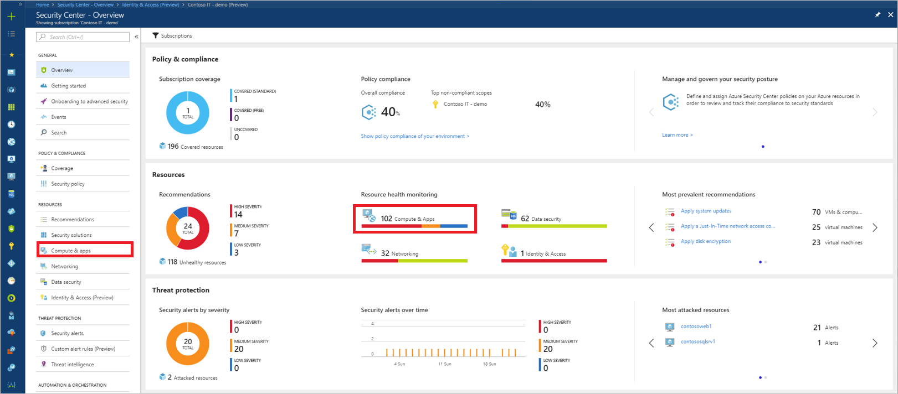
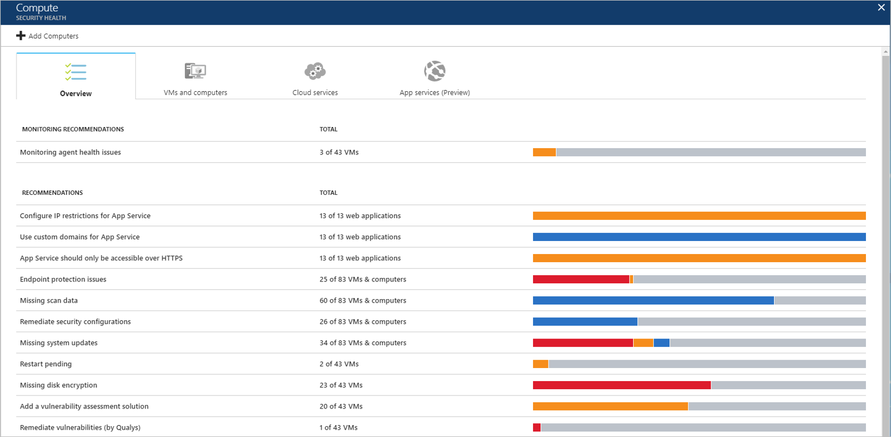
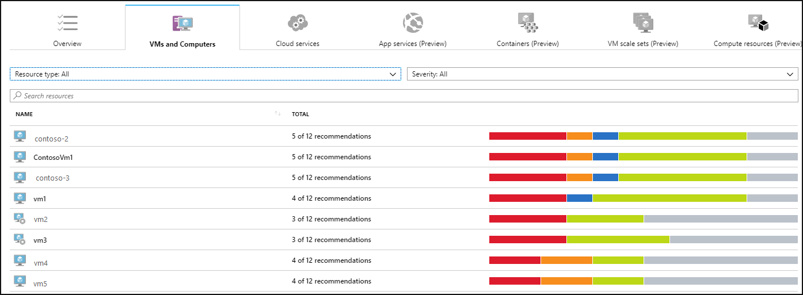
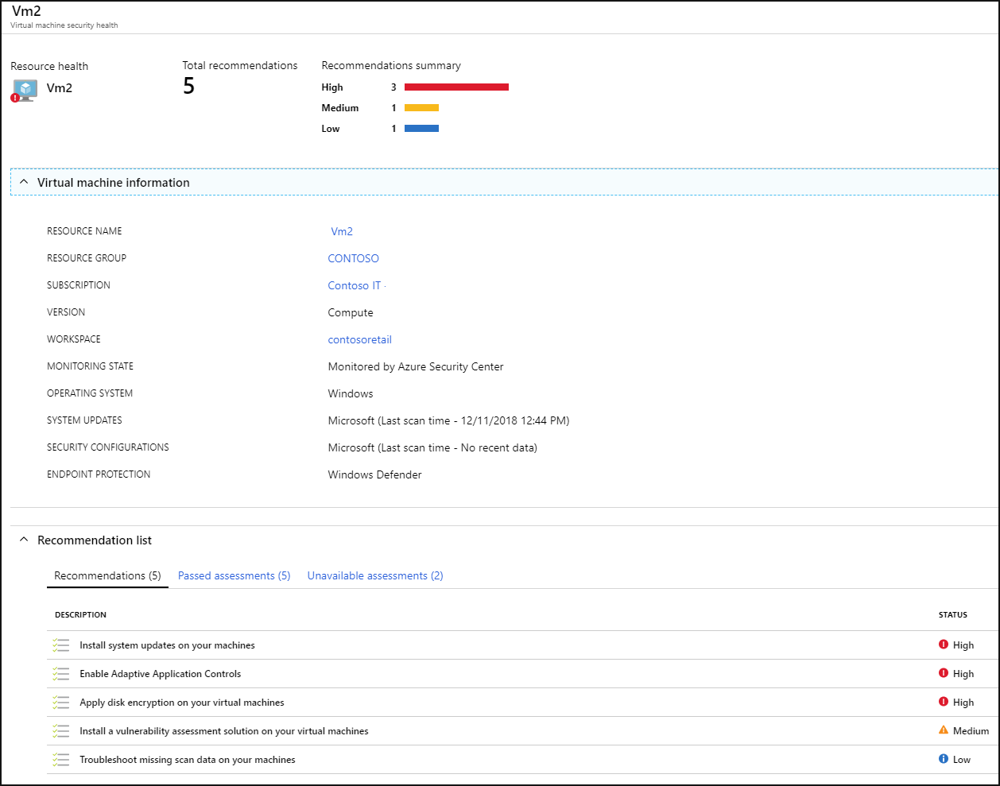
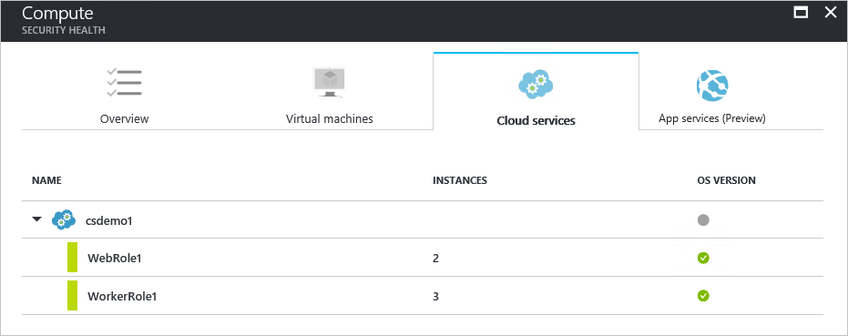
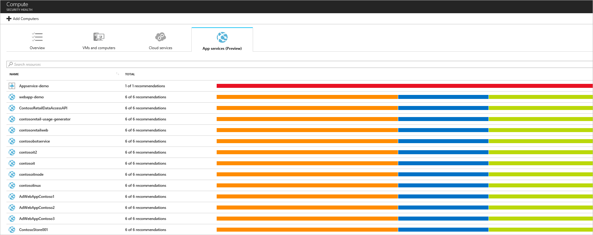
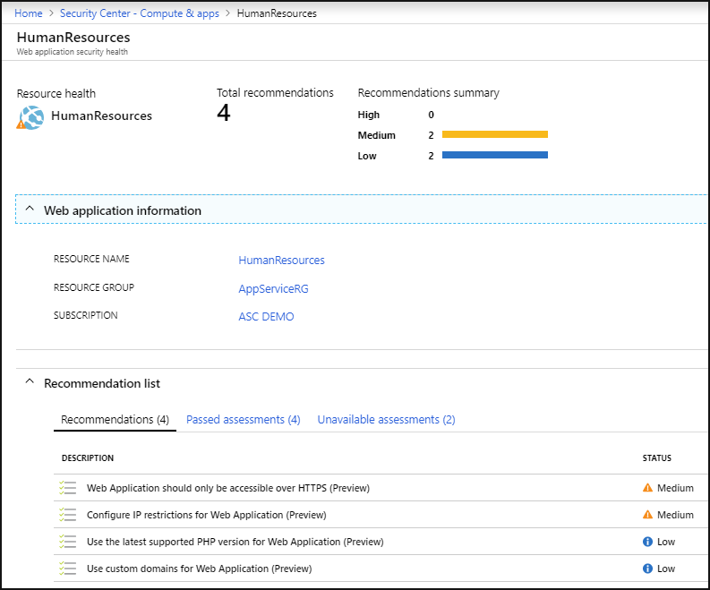
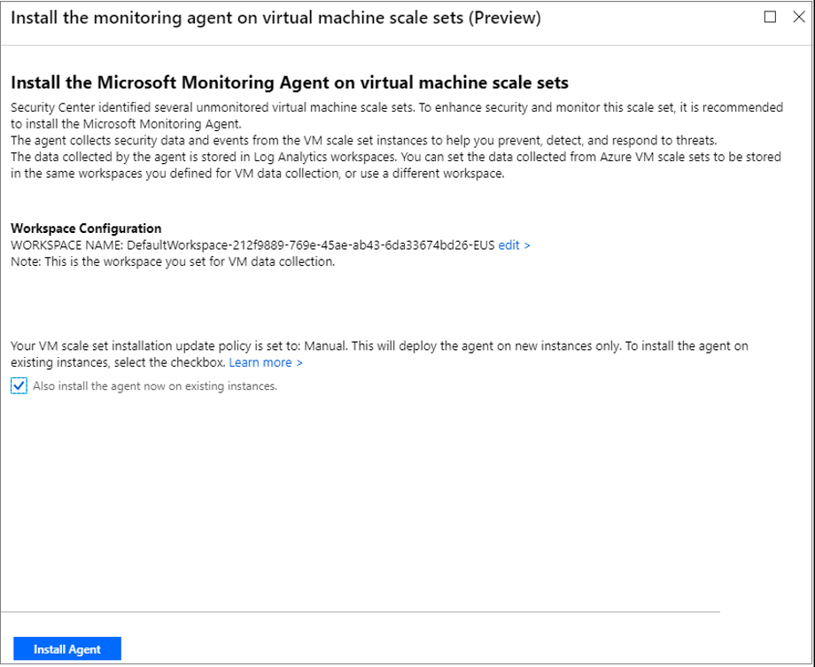

# Protecting your machines and applications in Azure Security Center
Azure Security Center analyzes the security state of your Azure resources, non-Azure servers, and virtual machines. When Security Center identifies potential security vulnerabilities, it creates recommendations that guide you through the process of configuring the needed controls. Recommendations apply to Azure resource types: virtual machines (VMs) and computers, applications, networking, SQL, and Identity and Access.

This article addresses recommendations that apply to machines and applications.

## Monitoring security health
You can monitor the security state of your resources on the **Security Center – Overview** dashboard. The **Resources** section provides the number of issues identified and the security state for each resource type.

You can view a list of all issues by selecting **Recommendations**. For more information about how to apply recommendations, see [Implementing security recommendations in Azure Security Center](security-center-recommendations.md).

For a complete list of Compute and App services recommendations, see [Recommendations](security-center-virtual-machine-protection.md#compute-and-app-recommendations).

To continue, select **Compute & apps** under **Resources** or the Security Center main menu.

## Monitor compute and app services
Under **Compute & apps**, there are the following tabs:

- **Overview**: monitoring and recommendations identified by Security Center.
- **VMs and computers**: list of your VMs, computers, and current security state of each.
- **Cloud Services**: list of your web and worker roles monitored by Security Center.
- **App services**: list of your App service environments and current security state of each.
- **Containers (Preview)**: list of your containers hosted on IaaS Linux machines and security assessment of their Docker configurations.
- **Compute resources (Preview)**: list of recommendations for your compute resources, such as Service Fabric clusters and Event hubs.

To continue, select **Compute & apps** under **Resource security hygiene**.

In each tab you can have multiple sections, and in each section, you can select an individual option to see more details about the recommended steps to address that particular issue.

### Unmonitored VMs and computers 
A VM or computer is unmonitored by Security Center if the machine is not running the Microsoft Monitoring Agent extension. A machine may have a local agent already installed, for example the OMS direct agent or the System Center Operations Manager agent. Machines with these agents are identified as unmonitored because these agents are not fully supported in Security Center. To fully benefit from all of Security Center’s capabilities, the Microsoft Monitoring Agent extension is required.

You can install the extension on the unmonitored VM or computer in addition to the already installed local agent. Configure both agents the same, connecting them to the same workspace. This enables Security Center to interact with the Microsoft Monitoring Agent extension and collect data. See [Enable the VM extension](../azure-monitor/learn/quick-collect-azurevm.md) for instructions on how to install the Microsoft Monitoring Agent extension.

See [Monitoring agent health issues](security-center-troubleshooting-guide.md#mon-agent) to learn more about the reasons Security Center is unable to successfully monitor VMs and computers initialized for automatic provisioning.

### Recommendations
This section has a set of recommendations for each VM and computer, web and worker roles, Azure App Service Web Apps, and Azure App Service Environment that Security Center monitors. The first column lists the recommendation. The second column shows the total number of resources that are affected by that recommendation. The third column shows the severity of the issue.

Each recommendation has a set of actions that you can perform after you select it. For example, if you select **Missing system updates**, the number of VMs and computers that are missing patches, and the severity of the missing update appears.

**Apply system updates** has a summary of critical updates in a graph format, one for Windows, and one for Linux. The second part has a table with the following information:

- **NAME**: Name of the missing update.
- **NO. OF VMs & COMPUTERS**: Total number of VMs and computers that are missing this update.
- **UPDATE SEVERITY**: Describes the severity of that particular recommendation:

    - **Critical**: A vulnerability exists with a meaningful resource (application, virtual machine, or network security group) and requires attention.
    - **Important**: Non-critical or additional steps are required to complete a process or eliminate a vulnerability.
    - **Moderate**: A vulnerability should be addressed but does not require immediate attention. (By default, low recommendations are not presented, but you can filter on low recommendations if you want to view them.)

- **STATE**: The current state of the recommendation:

    - **Open**: The recommendation has not been addressed yet.
    - **In Progress**: The recommendation is currently being applied to those resources, and no action is required by you.
    - **Resolved**: The recommendation was already finished. (When the issue has been resolved, the entry is dimmed).

To view the recommendation details, click the name of the missing update from the list.

> [!NOTE]
> The security recommendations here are the same as those under the **Recommendations** tile. See [Implementing security recommendations in Azure Security Center](security-center-recommendations.md) for more information about how to resolve recommendations.
>
>

### VMs and computers
The VMs and computers section gives you an overview of all VM and computer recommendations. Each column represents one set of recommendations.

There are four types of icons represented in this list:

 Non-Azure computer.

 Azure Resource Manager VM.

 Azure Classic VM.

 VMs that are identified only from the workspace that is part of the viewed subscription. This includes VMs from other subscriptions that report to the workspace in this subscription, and VMs that were installed with Operations Manager direct agent, and have no resource ID.

The icon that appears under each recommendation helps you to quickly identify the VM and computer that needs attention, and the type of recommendation. You can also use the filters to search the list by **Resource type** and by **Severity**.

To drill down into the security recommendations for each VM, click on the VM.
Here you see the security details for the VM or computer. At the bottom you can see the recommended action and the severity of each issue.

### Cloud services
For cloud services, a recommendation is created when the operating system version is out of date.

In a scenario where you do have a recommendation (which is not the case for the previous example), you need to follow the steps in the recommendation to update the operating system version. When an update is available, you will have an alert (red or orange - depends on the severity of the issue). When you select this alert in the WebRole1 (runs Windows Server with your web app automatically deployed to IIS) or WorkerRole1 (runs Windows Server with your web app automatically deployed to IIS) rows, you see more details about this recommendation.

To see a more prescriptive explanation about this recommendation, click **Update OS version** under the **DESCRIPTION** column.

### App services
You need to enable App Service in your subscription in order to view the App Service information. For instructions on how to enable this feature, see [Protect App Service with Azure Security Center](security-center-app-services.md).
[!NOTE]
> Monitoring App Service is in preview and available only on the Standard tier of Security Center.

Under **App services**, you find a list of your App service environments and the health summary based on the assessment Security Center performed.

There are three types of icons represented in this list:

 App services environment.

 Web application.

 Function application.

1. Select a web application. A summary view opens with three tabs:

   - **Recommendations**:  based on assessments performed by Security Center that failed.
   - **Passed assessments**: list of assessments performed by Security Center that passed.
   - **Unavailable assessments**: list of assessments that failed to run due to an error or the recommendation is not relevant for the specific App service

   Under **Recommendations** is a list of the recommendations for the selected web application and severity of each recommendation.

   

2. Select a recommendation to see a description of the recommendation and a list of unhealthy resources, healthy resources, and unscanned resources.

   - Under the **Passed assessments** column is a list of passed assessments.  Severity of these assessments is always green.

   - Select a passed assessment from the list for a description of the assessment, a list of unhealthy and healthy resources, and a list of unscanned resources. There is a tab for unhealthy resources but that list is always empty since the assessment passed.

     

## Virtual machine scale sets
Security Center automatically discovers whether you have scales sets and recommends that you install the Microsoft Monitoring Agent on these scale sets. 

To install the Microsoft Monitoring Agent: 

1. Select the recommendation **Install the monitoring agent on virtual machine scale set**. You get a list of unmonitored scale sets.
2. Select an unhealthy scale set. Follow the instructions to install the monitoring agent using an existing populated workspace or create a new one. Make sure to set the workspace [pricing tier](security-center-pricing.md) if it’s not set.

   

If you want to set new scale sets to automatically install the Microsoft Monitoring Agent:
1. Go to Azure Policy and click **Definitions**.
2. Search for the policy **Deploy Log Analytics agent for Windows virtual machine scale sets** and click on it.
3. Click **Assign**.
4. Set the **Scope** and **Log Analytics workspace** and click **Assign**.

If you want to set all existing scale sets to install the Microsoft Monitoring Agent, in Azure Policy, go to **Remediation** and apply the existing policy to existing scale sets.

## Compute and app recommendations
|Resource type|Secure score|Recommendation|Description|
|----|----|----|----|
|App service|20|Web Application should only be accessible over HTTPS|Limit access of Web Applications over HTTPS only.|
|App service|20|Function App should only be accessible over HTTPS|Limit access of Function Apps over HTTPS only.|
|App service|5|Diagnostics logs in App Services should be enabled|Enable logs and retain them up to a year. This enables you to recreate activity trails for investigation purposes when a security incident occurs or your network is compromised. |
|App service|10|Remote debugging should be turned off for Web Application|Turn off debugging for Web Applications if you no longer need to use it. Remote debugging requires inbound ports to be opened on a Function App.|
|App service|10|Remote debugging should be turned off for Function Application|Turn off debugging for Function App if you no longer need to use it. Remote debugging requires inbound ports to be opened on a Function App.|
|App service|10|Do not allow all ('*') resources to access your application| Do not allow set of WEBSITE_LOAD_CERTIFICATES parameter to "". Setting the parameter to ‘’ means that all certificates are loaded to your web applications personal certificate store. This can lead to abuse of the principle of least privilege as it is unlikely that the site needs access to all certificates at runtime.|
|App service|20|CORS should not allow every resource to access your Web applications|Allow only required domains to interact with your web application. Cross origin resource sharing (CORS) should not allow all domains to access your web application.|
|App service|20|CORS should not allow every resource to access your Function App| Allow only required domains to interact with your function application. Cross origin resource sharing (CORS) should not allow all domains to access your function application.|
|Compute resources (batch)|1|Metric alert rules should be configured on Batch accounts|Configure metric alert rules on Batch account and enable the metrics Pool Delete Complete Events and Pool Delete Start Events|
|Compute resources (service fabric)|10|Service Fabric clusters should only use Azure Active Directory for client authentication|Perform Client authentication only via Azure Active Directory in Service Fabric.|
|Compute resources (automation account)|5|Automation account variables should be encrypted|Enable encryption of Automation account variable assets when storing sensitive data.|
|Compute resources (search)|5|Audit enabling of diagnostic logs for Search services|Enable logs and retain them up to a year. This enables you to recreate activity trails for investigation purposes when a security incident occurs or your network is compromised. |
|Compute resources (service bus)|5|Diagnostics logs in Service Bus should be enabled|Enable logs and retain them up to a year. This enables you to recreate activity trails for investigation purposes when a security incident occurs or your network is compromised. |
|Compute resources (stream analytics)|5|Diagnostics logs in Azure Stream Analytics should be enabled|Enable logs and retain them up to a year. This enables you to recreate activity trails for investigation purposes when a security incident occurs or your network is compromised. |
|Compute resources (batch)|5|Enable diagnostic logs in Batch accounts|Enable logs and retain them up to a year. This enables you to recreate activity trails for investigation purposes when a security incident occurs or your network is compromised. |
|Compute resources (event hub)|5|Diagnostics logs in Event Hub should be enabled|Enable logs and retain them up to a year. This enables you to recreate activity trails for investigation purposes when a security incident occurs or your network is compromised. |
|Compute resources (logic apps)|5|Enable diagnostics logs in Logic Apps|Enable logs and retain them up to a year. This enables you to recreate activity trails for investigation purposes when a security incident occurs or your network is compromised. |
|Compute resources (service fabric)|15|Set the ClusterProtectionLevel property to EncryptAndSign in Service Fabric|Service Fabric provides three levels of protection (None, Sign and EncryptAndSign) for node-to-node communication using a primary cluster certificate.  Set the protection level to ensure that all node-to-node messages are encrypted and digitally signed. |
|Compute resources (service bus)|1|Remove all authorization rules except RootManageSharedAccessKey from Service Bus namespace |Service Bus clients should not use a namespace level access policy that provides access to all queues and topics in a namespace. To align with the least privilege security model, you should create access policies at the entity level for queues and topics to provide access to only the specific entity.|
|Compute resources (event hub)|1|All authorization rules except RootManageSharedAccessKey should be removed from Event Hub namespace|Event Hub clients should not use a namespace level access policy that provides access to all queues and topics in a namespace. To align with the least privilege security model, you should create access policies at the entity level for queues and topics to provide access to only the specific entity.|
|Compute resources (event hub)|5|Authorization rules on the Event Hub entity should be defined|Audit authorization rules on the Event Hub entity to grant least-privileged access.|
|Machine|50|Install monitoring agent on your machines|Install the Monitoring agent to enable data collection, updates scanning, baseline scanning, and endpoint protection on each machine.|
|Machine|50|Enable automatic provisioning and data collection for your subscriptions |Enable automatic provisioning and data collection for machines in your subscriptions to enable data collection, updates scanning, baseline scanning, and endpoint protection on each machine added to your subscriptions.|
|Machine|40|Resolve monitoring agent health issues on your machines|For full Security Center protection, resolve monitoring agent issues on your machines by following the instructions in the Troubleshooting guide| 
|Machine|40|Resolve endpoint protection health issues on your machines|For full Security Center protection, resolve monitoring agent issues on your machines by following the instructions in the Troubleshooting guide.|
|Machine|40|Troubleshoot missing scan data on your machines|Troubleshoot missing scan data on virtual machines and computers. Missing scan data on your machines results in missing security assessments such as update scanning, baseline scanning, and missing endpoint protection solution scanning.|
|Machine|40|System updates should be installed on your machines|Install missing system security and critical updates to secure your Windows and Linux virtual machines and computers
|Machine|15|Add a web application firewall| Deploy a web application firewall (WAF) solution to secure your web applications. |
|Machine|40|Update OS version for your cloud service roles|Update the operating system (OS) version for your cloud service roles to the most recent version available for your OS family.|
|Machine|35|Vulnerabilities in security configuration on your machines should be remediated|Remediate vulnerabilities in security configuration on your machines to protect them from attacks.|
|Machine|35|Remediate vulnerabilities in security configuration on your containers|Remediate vulnerabilities in security configuration on machines with Docker installed to protect them from attacks.|
|Machine|25|Enable Adaptive Application Controls|Enable application control to control which applications can run on your VMs located in Azure. This will help harden your VMs against malware. Security Center uses machine learning to analyze the applications running on each VM and helps you apply allow rules using this intelligence. This capability simplifies the process of configuring and maintaining application allow rules.|
|Machine|20|Install endpoint protection solution on your machines|Install an endpoint protection solution on your virtual machines, to protect them from threats and vulnerabilities.|
|Machine|20|Restart your machines to apply system updates|Restart your machines to apply the system updates and secure the machine from vulnerabilities.|
|Machine|15|Disk encryption should be applied on virtual machines|Encrypt your virtual machine disks using Azure Disk Encryption both for Windows and Linux virtual machines. Azure Disk Encryption (ADE) leverages the industry standard BitLocker feature of Windows and the DM-Crypt feature of Linux to provide OS and data disk encryption to help protect and safeguard your data and help meet your organizational security and compliance commitments in customer Azure key vault. When your compliance and security requirement requires you to encrypt the data end to end using your encryption keys, including encryption of the ephemeral (locally attached temporary) disk, use Azure disk encryption. Alternatively, by default, Managed Disks are encrypted at rest by default using Azure Storage Service Encryption where the encryption keys are Microsoft managed keys in Azure. If this meets your compliance and security requirements, you can leverage the default Managed disk encryption to meet your requirements.|
|Machine|30|Install a vulnerability assessment solution on your virtual machines|Install a vulnerability assessment solution on your virtual machines|
|Machine|15|Add a web application firewall| Deploy a web application firewall (WAF) solution to secure your web applications. |
|Machine|30|Vulnerabilities should be remediated by a Vulnerability Assessment solution|Virtual machines for which a vulnerability assessment 3rd party solution is deployed are being continuously assessed against application and OS vulnerabilities. Whenever such vulnerabilities are found, these are available for more information as part of the recommendation.|
|Machine|30|Install a vulnerability assessment solution on your virtual machines|Install a vulnerability assessment solution on your virtual machines|
|Machine|1|Virtual machines should be migrated to new AzureRM resources|Use  Azure Resource Manager for your virtual machines to provide security enhancements such as: stronger access control (RBAC), better auditing, Resource Manager-based deployment and governance, access to managed identities, access to key vault for secrets, Azure AD-based authentication and support for tags and resource groups for easier security management. |
|Machine|30|Vulnerabilities should be remediated by a Vulnerability Assessment solution|Virtual machines for which a vulnerability assessment 3rd party solution is deployed are being continuously assessed against application and OS vulnerabilities. Whenever such vulnerabilities are found, these are available for more information as part of the recommendation.|
|Virtual machine scale set |4|Diagnostics logs in Virtual Machine Scale Sets should be enabled|Enable logs and retain them for up to a year. This enables you to recreate activity trails for investigation purposes. This is useful when a security incident occurs, or your network is compromised.|
|Virtual machine scale set|35|Vulnerabilities in security configuration on your virtual machine scale sets should be remediated|Remediate vulnerabilities in security configuration on your virtual machine scale sets to protect them from attacks. |
|Virtual machine scale set|5|Remediate endpoint protection health failures on virtual machine scale sets|Remediate endpoint protection health failures on your virtual machine scale sets to protect them from threats and vulnerabilities. |
|Virtual machine scale set|10|Endpoint protection should be installed on virtual machines|Install an endpoint protection solution on your virtual machine scale sets, to protect them from threats and vulnerabilities. |
|Virtual machine scale set|40|System updates on virtual machine scale sets should be installed|Install missing system security and critical updates to secure your Windows and Linux virtual machine scale sets. |
 

## Next steps
To learn more about recommendations that apply to other Azure resource types, see the following:

* [Understanding Azure Security Center recommendations for virtual machines](security-center-virtual-machine-recommendations.md)
* [Monitor identity and access in Azure Security Center](security-center-identity-access.md)
* [Protecting your network in Azure Security Center](security-center-network-recommendations.md)
* [Protecting your Azure SQL service in Azure Security Center](security-center-sql-service-recommendations.md)

To learn more about Security Center, see the following:

* [Setting security policies in Azure Security Center](tutorial-security-policy.md) -- Learn how to configure security policies for your Azure subscriptions and resource groups.
* [Managing and responding to security alerts in Azure Security Center](security-center-managing-and-responding-alerts.md) -- Learn how to manage and respond to security alerts.
* [Azure Security Center FAQ](security-center-faq.md) -- Find frequently asked questions about using the service.

