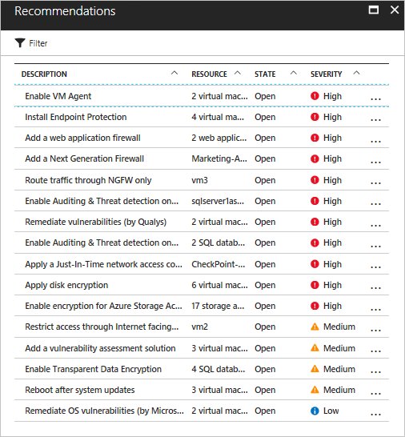
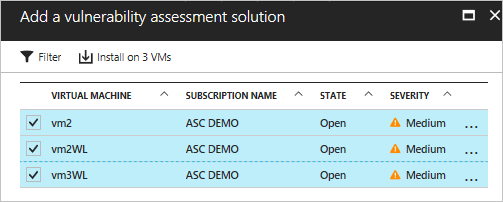
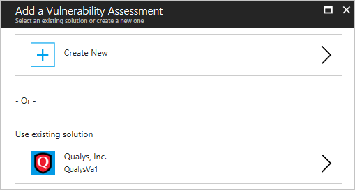
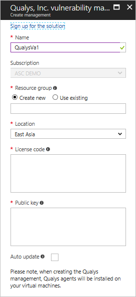
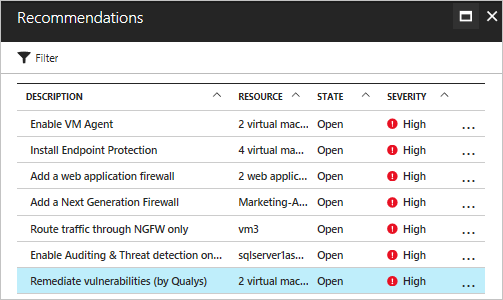
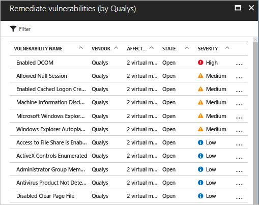
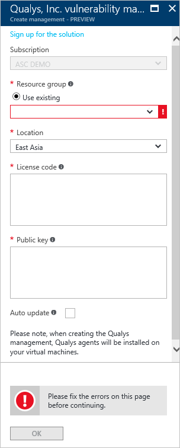

# Vulnerability assessment in Azure Security Center

The vulnerability assessment in Azure Security Center is part of the Security Center virtual machine (VM) recommendations. If Security Center doesn't find a vulnerability assessment solution installed on your VM, it recommends that you install one. A partner agent, after being deployed, starts reporting vulnerability data to the partner’s management platform. In turn, the partner's management platform provides vulnerability and health monitoring data back to Security Center. You can quickly identify vulnerable VMs on the Security Center dashboard. Switch to the partner management console directly from Security Center for additional reports and information.

Here are some important notes regarding the vulnerability assessment capability:

* Currently, vulnerability assessment is available from [Qualys](https://www.qualys.com/lp/azure) and [Rapid7](https://www.rapid7.com/products/insightvm/). 
* You can install the vulnerability assessment solution on multiple VMs. The VMs must belong to the same subscription.

> [!NOTE]
> This article  introduces the vulnerability assessment service by using an example deployment. This article is not a step-by-step guide for implementing vulnerability assessment.
>

## Implement a vulnerability assessment recommendation
When Security Center identifies one or more supported VMs that are missing a vulnerability assessment solution, it triggers a VM recommendation. The following steps show you how to access and apply this recommendation for multiple VMs that are in the same subscription:

1. On the **Security Center** dashboard, in the **Overview** section, click **Recommendations**.
2. On the **Recommendations** page, select **Add a vulnerability assessment solution**.

    
3. On the **Add a vulnerability assessment solution** page, select the VMs where you want to install the vulnerability assessment solution.

    
4. On the **Add a Vulnerability Assessment** page, click **Install on 2 VMs** (the name might vary according to the number of VMs that you selected):

    
5. You can create a new vulnerability assessment or use an existing solution. If you create a new vulnerability assessment, you can select a partner solution in the **Azure Marketplace**. Or, under **Use existing solution**, select **Qualys** or **Rapid7**.

> [!NOTE]
> You can change auto update settings. On the **Partner Solutions** page, select the partner solution, and then click **Configure**. On the **Configure security solution** page, for **Auto update**, select **ON** or **OFF**.

## Create a new vulnerability assessment solution
If you have multiple subscriptions, you can create one vulnerability assessment solution for each subscription. The main steps are the same as described in the preceding section. The only difference is that in step 4, select the **Create New** option. After you select this option, complete the following steps:

> [!NOTE]
> The following example uses Qualys. To deploy the agent from Security Center, you need a license code and public key from the vendor. To learn how to get the license code and public key, see the [Qualys documentation](https://community.qualys.com/docs/DOC-5823-deploying-qualys-cloud-agents-from-microsoft-azure-security-center) or [Rapid7 documentation](https://insightvm.help.rapid7.com/v1.1/docs/azure-security-center).

1. On the **Create a new Vulnerability Assessment** page, click the partner’s name. In this example, click **Qualys**.
2. The partner’s **vulnerability management** page opens. The options shown on this page might change depending on the partner. For this example, select **Qualys**.

    
3. For **Resource group**, select **Use existing**.
4. For **Location**, select where the solution is geographically located.
5. In the **License code** box (this is specific for Qualys), enter the license provided by the partner.
6. In the **Public key** box (this is specific for Qualys), enter the public key information provided by the partner.
7. If you want to automatically install a vulnerability assessment agent on all discovered VMs in the subscription of this Qualys solution, select the **Auto update** check box.
8. Click **OK**.

## Review the recommendation
After the vulnerability assessment solution is installed on the target VM, Security Center scans the VM to detect and identify system and application vulnerabilities.

> [!NOTE]
> It might take a couple of hours for the first scan to complete. After that, it is an hourly process.
>
>

Detected issues are shown under the **Virtual Machines Recommendations** option. The following example shows how the recommendations appear on the **Recommendations** page.

In this example, the selected recommendation shows that the detection was performed by Qualys. If you click this recommendation, a new page appears.

This list shows all vulnerabilities, in order of severity, and the number of virtual machines that are affected by each vulnerability. For this example, the vulnerability **Enabled DCOM** was selected. This page shows the recommended steps to take to address this vulnerability.

## See also

In this article, you learned how to apply vulnerability assessment recommendations in Azure Security Center. To learn more about Security Center, see the following articles:

* [Azure Security Center planning and operations guide](security-center-planning-and-operations-guide.md). Learn how to plan and understand design considerations for implementing Azure Security Center.
* [Security health monitoring in Security Center](security-center-monitoring.md). Learn how to monitor the health of your Azure resources.
* [Manage and respond to security alerts in Security Center](security-center-managing-and-responding-alerts.md). Learn how to manage and respond to security alerts.
* [Monitor partner solutions with Security Center](security-center-partner-solutions.md). Learn how to monitor the health status of your partner solutions.
* [Azure Security Center FAQs](security-center-faq.md). Get answers to frequently asked questions about using the service.
* [Azure Security blog](http://blogs.msdn.com/b/azuresecurity/). Find blog posts about Azure security and compliance.
