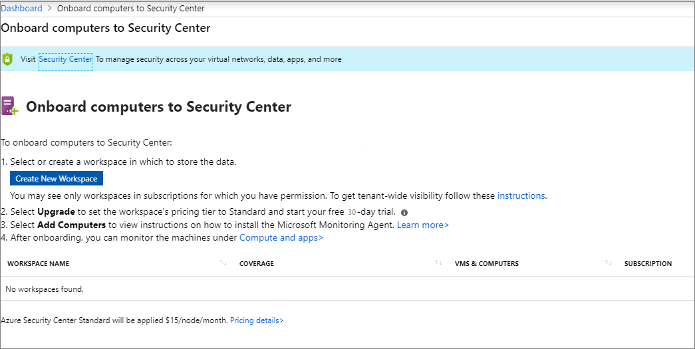

---
title: Microsoft Defender Advanced Threat Protection - Azure Security Center
description: This document introduces the integration between Azure Security Center and Microsoft Defender Advanced Threat Protection.
services: security-center
documentationcenter: na
author: memildin
manager: rkarlin
ms.service: security-center
ms.devlang: na
ms.topic: conceptual
ms.tgt_pltfrm: na
ms.workload: na
ms.date: 04/07/2020
ms.author: memildin
---
# Microsoft Defender Advanced Threat Protection with Azure Security Center

Azure Security Center is extending its Cloud Workload Protection Platforms offering by integrating with [Microsoft Defender Advanced Threat Protection](https://www.microsoft.com/microsoft-365/windows/microsoft-defender-atp) (ATP).
This change brings comprehensive Endpoint Detection and Response (EDR) capabilities. With Microsoft Defender ATP integration, you can spot abnormalities. You can also detect and respond to advanced attacks on server endpoints monitored by Azure Security Center.

## Microsoft Defender ATP features in Security Center

When you use Microsoft Defender ATP, you get:

- **Advanced post-breach detection sensors**: Microsoft Defender ATP sensors for Windows servers collect a vast array of behavioral signals.

- **Analytics-based, cloud-powered post breach detection**: Microsoft Defender ATP quickly adapts to changing threats. It uses advanced analytics and big data. Microsoft Defender ATP is amplified by the power of the Intelligent Security Graph with signals across Windows, Azure, and Office to detect unknown threats. It provides actionable alerts and enables you to respond quickly.

- **Threat intelligence**: Microsoft Defender ATP generates alerts when it identifies attacker tools, techniques, and procedures. It uses data generated by Microsoft threat hunters and security teams, augmented by intelligence provided by partners.

The following capabilities are now available in Azure Security Center:

- **Automated onboarding**: The Microsoft Defender ATP sensor is automatically enabled for Windows servers that are onboarded to Azure Security Center (with the exception of those that are running Windows Server 2019).

- **Single pane of glass**: The Azure Security Center console displays Microsoft Defender ATP alerts.

To investigate further, use Microsoft Defender ATP. Microsoft Defender ATP provides additional information such as the alert process tree and the incident graph. You can also see a detailed machine timeline that shows every behavior for a historical period of up to six months.


## Platform support

Microsoft Defender ATP in Security Center supports detection on Windows Server 2016, 2012 R2, and 2008 R2 SP1, for Azure VMs you need a Standard tier subscription and for Non-Azure VMs you need Standard tier in the workspace level only.

> [!NOTE]
> When you use Azure Security Center to monitor servers, a Microsoft Defender ATP tenant is automatically created and the Microsoft Defender ATP data is stored in Europe by default. If you need to move your data to another location, you need to contact Microsoft Support to reset the tenant. Server endpoint monitoring utilizing this integration has been disabled for Office 365 GCC customers.

## Onboarding servers to Security Center 

To onboard servers to Security Center, click **Go to Azure Security Center to onboard servers** from the Microsoft Defender ATP server onboarding.

1. In the **Onboarding** area, select or create a workspace in which to store the data. <br>
2. If you can't see all your workspaces, it may be due to a lack of permissions, make sure your workspace is set to Azure Security Standard tier. For more information, see [Upgrade to Security Center's Standard tier for enhanced security](security-center-pricing.md).
    
3. Select **Add servers** to view instructions on how to install the Log Analytics agent. 

4. After onboarding, you can monitor the machines under **Compute and apps**.

   

## Enable Microsoft Defender ATP integration

To view if Microsoft Defender ATP integration is enabled, select **Security center** > **Pricing & settings** > click on your subscription.
Here you can see the integrations currently enabled.

  

- If you've already onboarded the servers to Azure Security Center standard tier, you need take no further action. Azure Security Center will automatically onboard the servers to Microsoft Defender ATP. Onboarding might take up to 24 hours.

- If you've never onboarded the servers to Azure Security Center standard tier, onboard them to Azure Security Center as usual.

- If you've onboarded the servers through Microsoft Defender ATP:
  - Refer to the documentation for guidance on [how to offboard server machines](https://go.microsoft.com/fwlink/p/?linkid=852906).
  - Onboard these servers to Azure Security Center.

## Access to the Microsoft Defender ATP portal

Follow the instructions in [Assign user access to the portal](https://docs.microsoft.com/windows/security/threat-protection/microsoft-defender-atp/assign-portal-access).

## Set the firewall configuration

If you have a proxy or firewall that is blocking anonymous traffic, as a Microsoft Defender ATP sensor is connecting from the system context, make sure that anonymous traffic is permitted. Follow the instructions in [Enable access to Microsoft Defender ATP service URLs in the proxy server](https://docs.microsoft.com/windows/security/threat-protection/microsoft-defender-atp/configure-proxy-internet#enable-access-to-microsoft-defender-atp-service-urls-in-the-proxy-server).

## Test the feature

To generate a benign Microsoft Defender ATP test alert:

1. Create a folder 'C:\test-MDATP-test'.

1. Use Remote Desktop to access either a Windows Server 2012 R2 VM or a Windows Server 2016 VM. Open a command line window.

1. At the prompt, copy and run the following command. The Command Prompt window will close automatically.

    ```
    powershell.exe -NoExit -ExecutionPolicy Bypass -WindowStyle Hidden (New-Object System.Net.WebClient).DownloadFile('http://127.0.0.1/1.exe', 'C:\\test-MDATP-test\\invoice.exe'); Start-Process 'C:\\test-MDATP-test\\invoice.exe'
    ```

   

1. If the command is successful, you'll see a new alert on the Azure Security Center dashboard and the Microsoft Defender ATP portal. This alert might take a few minutes to appear.

1. To review the alert in Security Center, go to **Security alerts** > **Suspicious PowerShell CommandLine**.

1. From the investigation window, select the link to go to the Microsoft Defender ATP portal.

## Next steps

- [Platforms and features supported by Azure Security Center](security-center-os-coverage.md)
- [Setting security policies in Azure Security Center](tutorial-security-policy.md): Learn how to configure security policies for your Azure subscriptions and resource groups.
- [Managing security recommendations in Azure Security Center](security-center-recommendations.md): Learn how recommendations help you protect your Azure resources.
- [Security health monitoring in Azure Security Center](security-center-monitoring.md): Learn how to monitor the health of your Azure resources.