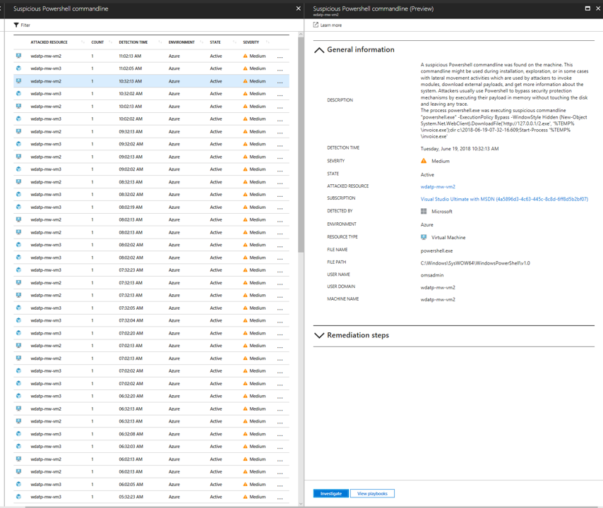
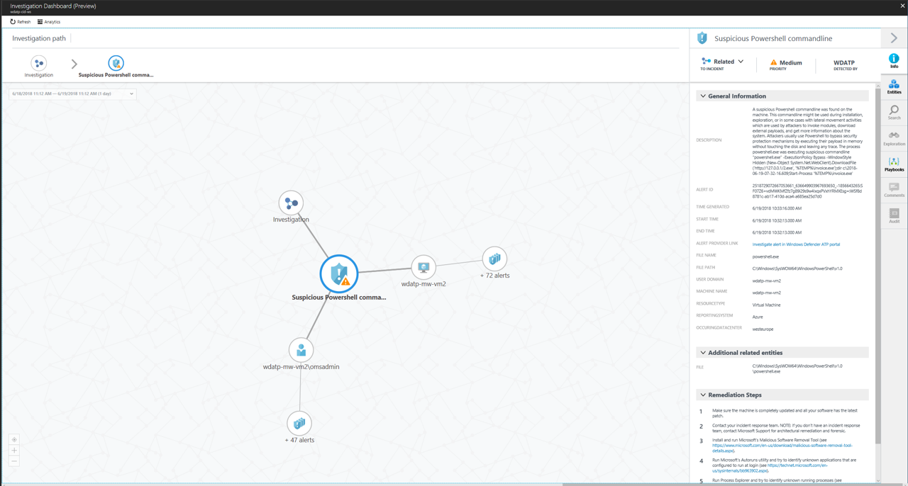
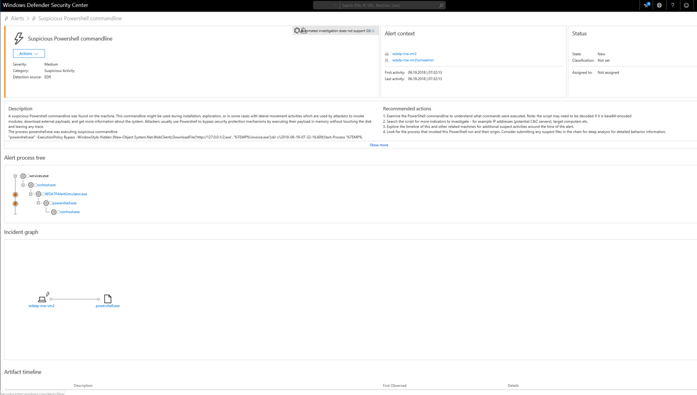
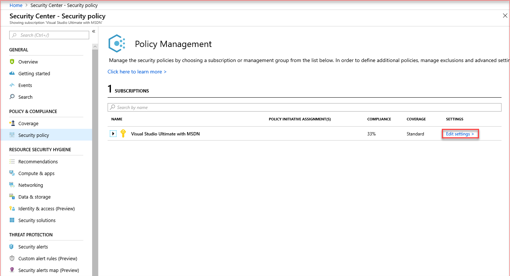
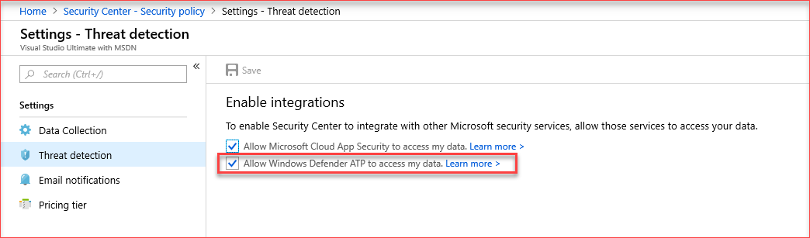
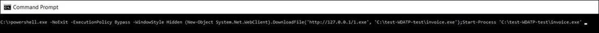

---
title: Windows Defender Advanced Threat Protection with Azure Security Center
description: This document introduces the integration between Azure Security Center and Windows Defender Advanced Threat Protection.
services: security-center
documentationcenter: na
author: barclayn
manager: MBaldwin
editor: ''

ms.service: security-center
ms.devlang: na
ms.topic: conceptual
ms.tgt_pltfrm: na
ms.workload: na
ms.date: 09/20/2018
ms.author: barclayn

---
# Windows Defender Advanced Threat Protection with Azure Security Center

Azure Security Center is extending its Cloud Workload Protection Platforms offering by integrating with [Windows Defender Advanced Threat Protection](https://www.microsoft.com/en-us/WindowsForBusiness/windows-atp) (ATP).
This change brings comprehensive Endpoint Detection and Response (EDR) capabilities. With Windows Defender ATP integration, you can spot abnormalities. You can also detect and respond to advanced attacks on server endpoints monitored by Azure Security Center.

Azure Security Center customers can now use features of Windows Defender ATP:

- **Next-generation post breach detection sensors**: Windows Defender ATP sensors for Windows servers collect a vast array of behavioral signals.

- **Analytics-based, cloud-powered post breach detection**: Windows Defender ATP quickly adapts to changing threats. It uses advanced analytics and big data. Windows Defender ATP is amplified by the power of the Intelligent Security Graph with signals across Windows, Azure, and Office to detect unknown threats. It provides actionable alerts and enables you to respond quickly.

- **Threat intelligence**: Windows Defender ATP identifies attacker tools, techniques, and procedures. When it detects these, it generates alerts. It uses data generated by Microsoft threat hunters and security teams, augmented by intelligence provided by partners.

These capabilities are now available in Azure Security Center:

- **Automated onboarding**: The Windows Defender ATP sensor is automatically enabled for Windows servers that are onboarded to Azure Security Center.

- **Single pane of glass**: The Azure Security Center console displays Windows Defender ATP alerts.

- **Detailed machine investigation**: Azure Security Center customers can access Windows Defender ATP console to perform a detailed investigation to uncover the scope of a breach.



You can [investigate the alert](security-center-investigation.md) in Azure Security Center:



You can further investigate the alert by pivoting to Windows Defender ATP. There you can see additional information such as the alert process tree and the incident graph. You can also see a detailed machine timeline that shows every behavior for a historical period of up to six months.



## Platform support

This feature supports detection on Windows Server 2012 R2 and Windows Server 2016.

Only servers in subscriptions for the standard service tier are supported.

## Onboarding instructions

To view if Windows Defender ATP integration is enabled, select **Security center** > **Security policy** > **Subscription** > **Edit settings**.

  

Here you can see the integrations currently enabled.

  

- If you've already onboarded the servers to Azure Security Center standard tier, you need take no further action. Azure Security Center will automatically onboard the servers to Windows Defender ATP. This might take up to 24 hours.

- If you've never onboarded the servers to Azure Security Center standard tier, onboard them to Azure Security Center as usual.

- If you've onboarded the servers through Windows Defender ATP:
  - Refer to the documentation for guidance on [how to offboard server machines](https://go.microsoft.com/fwlink/p/?linkid=852906).
  - Onboard these servers to Azure Security Center.

## Access to the Windows Defender ATP portal

Follow the instructions in [Assign user access to the portal](https://docs.microsoft.com/windows/security/threat-protection/windows-defender-atp/assign-portal-access-windows-defender-advanced-threat-protection).

## Set the firewall configuration

If you have a proxy or firewall that is blocking anonymous traffic, as a Windows Defender ATP sensor is connecting from the system context, make sure that anonymous traffic is permitted. Follow the instructions in [Enable access to Windows Defender ATP service URLs in the proxy server](https://docs.microsoft.com/windows/security/threat-protection/windows-defender-atp/configure-proxy-internet-windows-defender-advanced-threat-protection#enable-access-to-windows-defender-atp-service-urls-in-the-proxy-server).

## Test the feature

To generate a benign Windows Defender ATP test alert:

1. Use Remote Desktop to access either a Windows Server 2012 R2 VM or a Windows Server 2016 VM.  Open a Command Prompt window.

2. At the prompt, copy and run the following command. The Command Prompt window will close automatically.

    ```
    powershell.exe -NoExit -ExecutionPolicy Bypass -WindowStyle Hidden (New-Object System.Net.WebClient).DownloadFile('http://127.0.0.1/1.exe', 'C:\\test-WDATP-test\\invoice.exe'); Start-Process 'C:\\test-WDATP-test\\invoice.exe'
    ```

   

3. If the command is successful, you'll see a new alert on the Azure Security Center dashboard and the Windows Defender ATP portal. This alert might take a few minutes to appear.

4. To review the alert in Security Center, go to **Security Alerts** >  **Suspicious Powershell CommandLine**.

5. From the investigation window, select the link to go to the Windows Defender ATP portal.

## Next steps

- [Setting security policies in Azure Security Center](security-center-policies.md): Learn how to configure security policies for your Azure subscriptions and resource groups.
- [Managing security recommendations in Azure Security Center](security-center-recommendations.md): Learn how recommendations help you protect your Azure resources.
- [Security health monitoring in Azure Security Center](security-center-monitoring.md): Learn how to monitor the health of your Azure resources.
