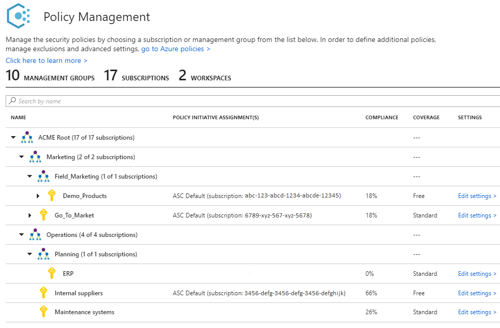
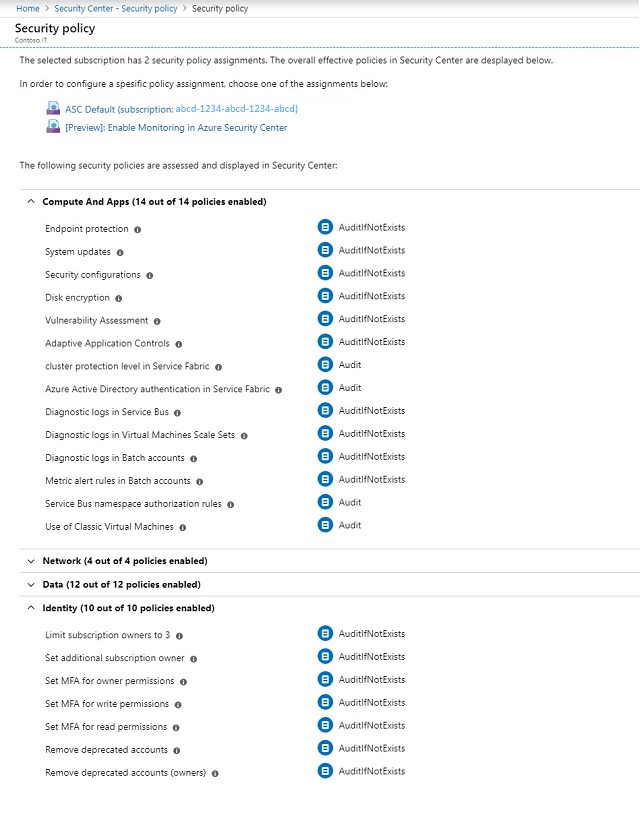
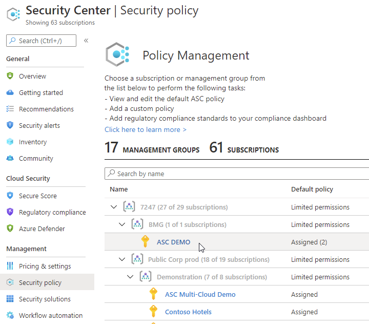
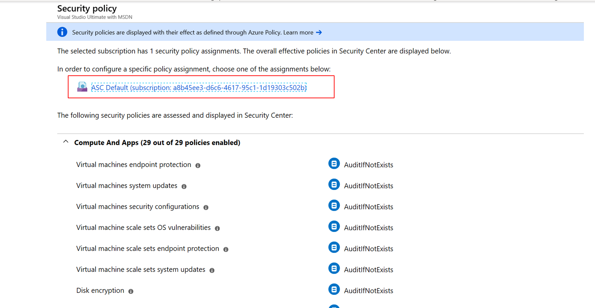
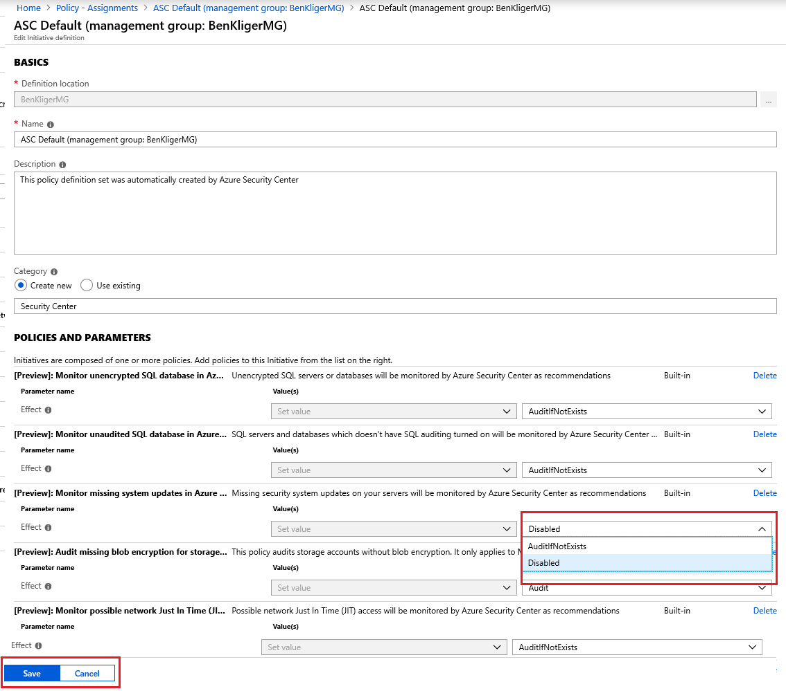

# Working with security policies

This article explains how security policies are configured, and how to view them in Security Center. Azure Security Center automatically assigns its [built-in security policies](security-center-policy-definitions.md) on each subscription that is onboarded. You can configure them in [Azure Policy](../governance/policy/overview.md), which also enables you to set policies across Management groups and across multiple subscriptions.

For instructions on how to set policies using PowerShell, see [Quickstart: Create a policy assignment to identify non-compliant resources using the Azure PowerShell module](../governance/policy/assign-policy-powershell.md).

>[!NOTE]
> Security Center started its integration with Azure Policy. Existing customers will be automatically migrated to the new built-in initiative in Azure Policy, instead of the previous security policies in Security Center. This change will not affect your resources or environment except the presence of the new initiative in Azure Policy.

## What are security policies?
A security policy defines the desired configuration of your workloads and helps ensure compliance with company or regulatory security requirements. In Azure Policy, you can define policies for your Azure subscriptions and tailor them to your type of workload or the sensitivity of your data. For example, applications that use regulated data, such as personal data or customer data, might require a higher level of security than other workloads. To set a policy across subscriptions or on Management groups, set them in [Azure Policy](../governance/policy/overview.md).

Your security policies drive the security recommendations you get in Azure Security Center. You can monitor compliance with them to help you identify potential vulnerabilities and mitigate threats. For more information about how to determine the option that is appropriate for you, see the list of [built-in security policies](security-center-policy-definitions.md).

When you enable Security Center, the security policy built-in to Security Center is reflected in Azure Policy as a built-in initiative under the category Security Center. The built-in initiative is automatically assigned to all Security Center registered subscriptions (Free or Standard tiers). The built-in initiative contains only Audit policies.

### Management groups
If your organization has many subscriptions, you may need a way to efficiently manage access, policies, and compliance for those subscriptions. Azure Management Groups provides a level of scope above subscriptions. You organize subscriptions into containers called "management groups" and apply your governance policies to the management groups. All subscriptions within a management group automatically inherit the policies applied to the management group. Each directory is given a single top-level management group called the "root" management group. This root management group is built into the hierarchy to have all management groups and subscriptions fold up to it. This root management group allows for global policies and RBAC assignments to be applied at the directory level. To set up management groups for use with Azure Security Center, follow the instructions in [Gain tenant-wide visibility for Azure Security Center](security-center-management-groups.md).

> [!NOTE]
> It’s important that you understand the hierarchy of management groups and subscriptions. See [Organize your resources with Azure Management Groups](../governance/management-groups/index.md#root-management-group-for-each-directory) to learn more about management groups, root management, and management group access.
>

## How security policies work
Security Center automatically creates a default security policy for each of your Azure subscriptions. You can edit the policies in Azure Policy to do the following things:
- Create new policy definitions.
- Assign policies across management groups and subscriptions, which can represent an entire organization or a business unit within the organization.
- Monitor policy compliance.

For more information about Azure Policy, see [Create and manage policies to enforce compliance](../governance/policy/tutorials/create-and-manage.md).

An Azure policy consists of the following components:

- A **policy** is a rule.
- An **initiative** is a collection of policies.
- An **assignment** is the application of an initiative or a policy to a specific scope (management group, subscription, or resource group).

## View security policies

To view your security policies in Security Center:

1. In the **Security Center** dashboard, select **Security policy**.

	

   In the **Policy management** screen, you can see the number of management groups, subscriptions, and workspaces as well as your management group structure.

   > [!NOTE]
   > - The Security Center dashboard may show a higher number of subscriptions under **Subscription coverage** than the number of subscriptions shown under **Policy management**. Subscription coverage shows the number of Standard, Free, and “not covered” subscriptions. The “not covered” subscriptions do not have Security Center enabled and are not displayed under **Policy management**.
   >

2. Select the subscription or management group whose policies you want to view.

   - The **Security policy** screen reflects the action taken by the policies assigned on the subscription or management group you selected.
   - At the top, use the links provided to open each policy **assignment** that applies on the subscription or management group. You can use the links to access the assignment and edit or disable the policy. For example, if you see that a particular policy assignment is effectively denying endpoint protection, you can use the link to access the policy and edit or disable it.
   - In the list of policies, you can see the effective application of the policy on your subscription or management group. This means that the settings of each policy that apply to the scope are taken into consideration and you are provided with the cumulative outcome of what action is taken by the policy. For example, if in one assignment the policy is disabled, but in another it is set to AuditIfNotExist, then the cumulative effect applies AuditIfNotExist. The more active effect always takes precedence.
   - The policies' effect can be: Append, Audit, AuditIfNotExists, Deny, DeployIfNotExists, Disabled. For more information on how effects are applied, see [Understand Policy effects](../governance/policy/concepts/effects.md).

   

> [!NOTE]
> - When you view assigned policies, you can see multiple assignments and you can see how each assignment is configured on its own.

## Edit security policies
You can edit the default security policy for each of your Azure subscriptions and management groups in [Azure Policy](../governance/policy/tutorials/create-and-manage.md). To modify a security policy, you must be an owner, contributor, or security administrator of the subscription or the containing management group.

For instructions on how to edit a security policy in Azure Policy, see and [Create and manage policies to enforce compliance](../governance/policy/tutorials/create-and-manage.md).

You can edit security policies through the Azure Policy portal, via REST API or using Windows PowerShell. The following example provides instructions for editing using REST API.

## Disable security policies
If the default security policy is generating a recommendation that is not relevant for your environment, you can stop it by disabling the policy definition that sends the recommendation.
For further information about recommendations, see [Managing security recommendations](security-center-recommendations.md).

1. In the Security Center, from the **Policy & Compliance** section, click **Security policy**.

   

2. Click the subscription or management group for which you want to disable the recommendation.

   > [!Note]
   > Remember that a management group applies its policies to its subscriptions. Therefore, if you disable a subscription's policy, and the subscription belongs to a management group that still uses the same policy, then you will continue to receive the policy recommendations. The policy will still be applied from the management level and the recommendations will still be generated.

1. Click the assigned policy.

   

1. In the **PARAMETERS** section, search for the policy that invokes the recommendation that you want to disable, and from the dropdown list, select **Disabled**

   
1. Click **Save**.
   > [!Note]
   > The disable policy changes can take up to 12 hours to take effect.

### Configure a security policy using the REST API

As part of the native integration with Azure Policy, Azure Security Center enables you to take advantage Azure Policy’s REST API to create policy assignments. The following instructions walk you through creation of policy assignments, as well as customization of existing assignments. 

Important concepts in Azure Policy: 

- A **policy definition** is a rule 

- An **initiative** is a collection of policy definitions (rules) 

- An **assignment** is an application of an initiative or a policy to a specific scope (management group, subscription, etc.) 

Security Center has a built-in initiative that includes all of its security policies. In order to assess Security Center’s policies on your Azure resources, you should create an assignment on the management group, or subscription you want to assess.  

The built-in initiative has all of Security Center’s policies enabled by default. You can choose to disable certain policies from the built-in initiative, for example you can apply all of Security Center’s policies except **web application firewall**, by changing the value of the policy’s effect parameter to **Disabled**. 

### API examples

In the following examples, replace these variables:

- **{scope}** enter the name of the management group or subscription you are applying the policy to.
- **{policyAssignmentName}** enter the [name of the relevant policy assignment](#policy-names).
- **{name}** enter your name, or the name of the administrator who approved the policy change.

This example shows you how to assign the built-in Security Center initiative on a subscription or management group
 
    PUT  
    https://management.azure.com/{scope}/providers/Microsoft.Authorization/policyAssignments/{policyAssignmentName}?api-version=2018-05-01 

    Request Body (JSON) 

    { 

      "properties":{ 

    "displayName":"Enable Monitoring in Azure Security Center", 

    "metadata":{ 

    "assignedBy":"{Name}" 

    }, 

    "policyDefinitionId":"/providers/Microsoft.Authorization/policySetDefinitions/1f3afdf9-d0c9-4c3d-847f-89da613e70a8", 

    "parameters":{}, 

    } 

    } 

This example shows you how to assign the built-in Security Center initiative on a subscription, with the following policies disabled: 

- System updates (“systemUpdatesMonitoringEffect”) 

- Security configurations ("systemConfigurationsMonitoringEffect") 

- Endpoint protection ("endpointProtectionMonitoringEffect") 

    PUT https://management.azure.com/{scope}/providers/Microsoft.Authorization/policyAssignments/{policyAssignmentName}?api-version=2018-05-01 
    
    Request Body (JSON) 
    
    { 
    
      "properties":{ 
    
    "displayName":"Enable Monitoring in Azure Security Center", 
    
    "metadata":{ 
    
    "assignedBy":"{Name}" 
    
    }, 
    
    "policyDefinitionId":"/providers/Microsoft.Authorization/policySetDefinitions/1f3afdf9-d0c9-4c3d-847f-89da613e70a8", 
    
    "parameters":{ 
    
    "systemUpdatesMonitoringEffect":{"value":"Disabled"}, 
    
    "systemConfigurationsMonitoringEffect":{"value":"Disabled"}, 
    
    "endpointProtectionMonitoringEffect":{"value":"Disabled"}, 
    
    }, 
    
     } 
    
    } 

This example shows you how to remove an assignment:

    DELETE   
    https://management.azure.com/{scope}/providers/Microsoft.Authorization/policyAssignments/{policyAssignmentName}?api-version=2018-05-01 

### Policy names reference 

|Policy name in Security Center|Policy name displayed in Azure Policy |Policy effect parameter name|
|----|----|----|
|SQL Encryption |Monitor unencrypted SQL database in Azure Security Center |sqlEncryptionMonitoringEffect| 
|SQL Auditing |Monitor unaudited SQL database in Azure Security Center |sqlAuditingMonitoringEffect|
|System updates |Monitor missing system updates in Azure Security Center |systemUpdatesMonitoringEffect|
|Storage encryption |Audit missing blob encryption for storage accounts |storageEncryptionMonitoringEffect|
|JIT Network access |Monitor possible network Just In Time (JIT) access in Azure Security Center |jitNetworkAccessMonitoringEffect |
|Adaptive application controls |Monitor possible app Whitelisting in Azure Security Center |adaptiveApplicationControlsMonitoringEffect|
|Network security groups |Monitor permissive network access in Azure Security Center |networkSecurityGroupsMonitoringEffect| 
|Security configurations |Monitor OS vulnerabilities in Azure Security Center |systemConfigurationsMonitoringEffect| 
|Endpoint protection |Monitor missing Endpoint Protection in Azure Security Center |endpointProtectionMonitoringEffect |
|Disk encryption |Monitor unencrypted VM Disks in Azure Security Center |diskEncryptionMonitoringEffect|
|Vulnerability assessment |Monitor VM Vulnerabilities in Azure Security Center |vulnerabilityAssessmentMonitoringEffect|
|Web application firewall |Monitor unprotected web application in Azure Security Center |webApplicationFirewallMonitoringEffect |
|Next generation firewall |Monitor unprotected network endpoints in Azure Security Center| |

### Who can edit security policies?
Security Center uses Role-Based Access Control (RBAC), which provides built-in roles that can be assigned to users, groups, and services in Azure. When users open Security Center, they see only information that's related to resources they have access to. Which means that users are assigned the role of owner, contributor, or reader to the subscription or resource group that a resource belongs to. In addition to these roles, there are two specific Security Center roles:

- Security reader: Have view rights to Security Center, which includes recommendations, alerts, policy, and health, but they can't make changes.
- Security admin: Have the same view rights as security reader, and they can also update the security policy and dismiss recommendations and alerts.

## Next steps
In this article, you learned how to edit security policies in Azure Policy. To learn more about Security Center, see the following articles:

* [Azure Security Center planning and operations guide](security-center-planning-and-operations-guide.md): Learn how to plan and understand the design considerations about Azure Security Center.
* [Security health monitoring in Azure Security Center](security-center-monitoring.md): Learn how to monitor the health of your Azure resources.
* [Manage and respond to security alerts in Azure Security Center](security-center-managing-and-responding-alerts.md): Learn how to manage and respond to security alerts.
* [Monitor partner solutions with Azure Security Center](security-center-partner-solutions.md): Learn how to monitor the health status of your partner solutions.
* [Gain tenant-wide visibility for Azure Security Center](security-center-management-groups.md): Learn how to set up management groups for Azure Security Center.
* [Azure Security Center FAQ](security-center-faq.md): Get answers to frequently asked questions about using the service.
* [Azure Security Blog](https://blogs.msdn.com/b/azuresecurity/): Find blog posts about Azure security and compliance.

To learn more about Azure Policy, see [What is Azure Policy?](../governance/policy/overview.md)
