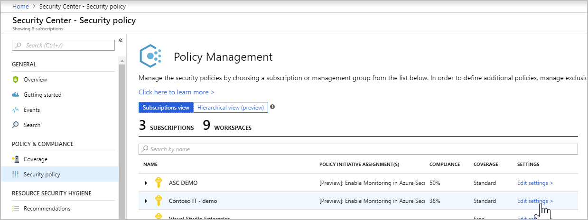

# Tutorial: Define and assess security policies
Security Center helps ensure compliance with company or regulatory security requirements by using security policies to define the desired configuration of your workloads. Once you define policies for your Azure subscriptions, and adapt them to the type of workload or the sensitivity of your data, Security Center can provide security recommendations to your compute, networking, SQL & storage, and application resources. In this tutorial, you will learn how to:

> [!div class="checklist"]
> * Configure security policy
> * Assess the security of your resources

If you don’t have an Azure subscription, create a  [free account](https://azure.microsoft.com/pricing/free-trial/) before you begin.

## Prerequisites
To step through the features covered in this tutorial, you must be on Security Center’s Standard pricing tier. You can try Security Center Standard at no cost for the first 60 days. The quickstart [Onboard your Azure subscription to Security Center Standard](security-center-get-started.md) walks you through how to upgrade to Standard.

## Configure security policy
Security Center automatically creates a default security policy for each of your Azure subscriptions. Security policies are comprised of recommendations that you can turn on or turn off according to the security requirements of that subscription. To make changes to the default security policy, you need to be an owner, contributor, or security administrator of the subscription.

1. At the Security Center main menu, select **Security policy**. Select the subscription that you want to use. Under **POLICY COMPONENTS**, select **Security policy**:

    

2. For each security configuration you want to monitor, select **On**. Security Center will continuously assess the configuration of your environment and when vulnerability exists, Security Center will generate a security recommendation. Select **Off** if the security configuration is not recommended or not relevant. For example, in a dev/test environment you might not require the same level of security as a production environment. After selecting the policies that are applicable to your environment, click **Save**.

Wait until Security Center processes these policies and generates recommendations. Some configurations, such as system updates and OS configurations can take up to 12 hours, while network security groups and encryption configurations can be assessed almost instantly. Once you see recommendations in the Security Center dashboard, you can proceed to the next step.

## Assess security of resources
1. According to the security policies that were enabled, Security Center will provide a set of security recommendations as needed. You should start by reviewing the virtual machine and computers recommendations. On the Security Center dashboard, click **Overview**, and click **Compute**.

  

  Review each recommendation by prioritizing recommendations in red (high priority). Some of these recommendations have remediation that can be implemented directly from Security Center, such as the [endpoint protection issues](https://docs.microsoft.com/azure/security-center/security-center-install-endpoint-protection). Other recommendations have only guidelines to apply the remediation, such as the missing disk encryption recommendation.

2. Once you address all relevant compute recommendations, you should move on to the next workload: networking. On the Security Center dashboard, click **Overview**, and click **Networking**.

  

  The networking recommendations page has a list of security issues for network configuration, internet facing endpoints, and network topology. Just like **Compute**, some networking recommendations will provide integrated remediation, and some others will not.

3. Once you address all relevant networking recommendations, you should move on to the next workload: storage & data. On the Security Center dashboard, click **Overview**, and click **Storage & data**.

  

  The **Data resources** page contains recommendations around enabling auditing for Azure SQL servers and databases, enabling encryption for SQL databases, and enabling encryption of your Azure storage account. If you don’t have these workloads, you will not see any recommendation. Just like **Compute**, some SQL & storage recommendations will provide integrated remediation, and some others will not.

4. Once you address all relevant SQL & storage recommendations, you should move on to the next workload: Applications. On the Security Center dashboard, click **Overview**, and click **Applications**.

  

  The **Applications** page contains recommendations for web application firewall deployment, and general guidelines for application hardening. If you don’t have virtual machine or computers with web applications running on Internet Information Service (IIS), you will not see these recommendations.

## Clean up resources
Other quickstarts and tutorials in this collection build upon this quickstart. If you plan to continue on to work with subsequent quickstarts and tutorials, continue running the Standard tier and keep automatic provisioning enabled. If you do not plan to continue or wish to return to the Free tier:

1. Return to the Security Center main menu and select **Security Policy**.
2. Select the subscription or policy that you want to return to Free. **Security policy** opens.
3. Under **POLICY COMPONENTS**, select **Pricing tier**.
4. Select **Free** to change subscription from Standard tier to Free tier.
5. Select **Save**.

If you wish to disable automatic provisioning:

1. Return to the Security Center main menu and select **Security policy**.
2. Select the subscription that you wish to disable automatic provisioning.
3. Under **Security policy – Data Collection**, select **Off** under **Onboarding** to disable automatic provisioning.
4. Select **Save**.

>[!NOTE]
> Disabling automatic provisioning does not remove the Microsoft Monitoring Agent from Azure VMs where the agent has been provisioned. Disabling automatic provisioning limits security monitoring for your resources.
>

## Next steps
In this tutorial, you learned about basic policy definition and security assessment of your workload with Security Center, such as:

> [!div class="checklist"]
> * Security policy configuration to ensure compliance with your company or regulatory security requirements
> * Security assessment for your compute, networking, SQL & storage, and application resources

Advance to the next tutorial to learn how to use Security Center to protect your resources.

> [!div class="nextstepaction"]
> [Protect your resources](tutorial-protect-resources.md)
