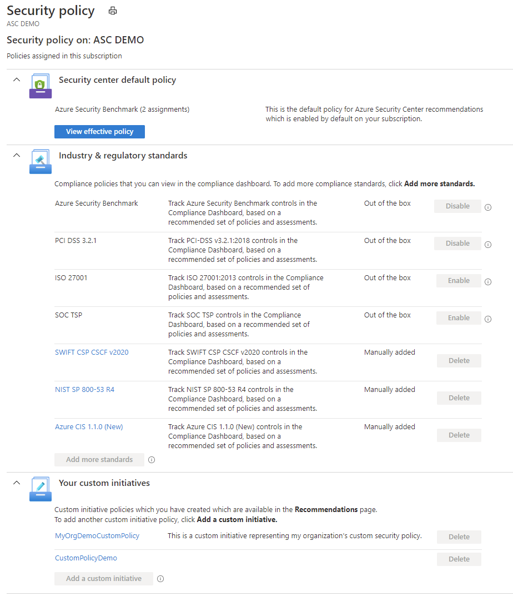
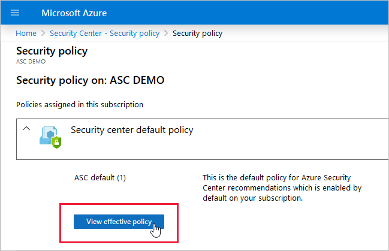

# Working with security policies

This article explains how security policies are configured, and how to view them in Security Center. 

## Introduction to security policies

A security policy defines the desired configuration of your workloads and helps ensure you're complying with the security requirements of your company or regulators.

Azure Security Center makes its security recommendations based on your chosen policies. 
Security Center policies are based on policy initiatives created in Azure Policy. You can use [Azure Policy](../governance/policy/overview.md) to manage your policies and to set policies across Management groups and across multiple subscriptions.

Security Center offers the following options for working with security policies:

* **View and edit the built-in default policy** - When you enable Security Center, a built-in initiative named 'ASC default' is automatically assigned to all Security Center registered subscriptions (Free or Standard tiers). To customize this initiative, you can enable or disable individual policies within it. See the list of [built-in security policies](security-center-policy-definitions.md) to understand the options available out-of-the-box.

* **Add your own custom policies** - If you want to customize the security initiatives applied to your subscription, you can do so within Security Center. You'll then receive recommendations if your machines don't follow the policies you create. For instructions on building and assigning custom policies, see [Using custom security policies](custom-security-policies.md).

* **Add regulatory compliance policies** - Security Center's regulatory compliance dashboard shows the status of all the assessments within your environment in the context of a particular standard or regulation (such as Azure CIS, NIST SP 800-53 R4, SWIFT CSP CSCF-v2020). For more information, see [Improve your regulatory compliance](security-center-compliance-dashboard.md).

## Managing your security policies

To view your security policies in Security Center:

1. In the **Security Center** dashboard, select **Security policy**.

	

   In the **Policy management** screen, you can see the number of management groups, subscriptions, and workspaces as well as your management group structure.

1. Select the subscription or management group whose policies you want to view.

1. The security policy page for that subscription or management group appears. It shows the available and assigned policies.

   

    > [!NOTE]
    > If there is a label "MG Inherited" alongside your default policy, it means that the policy has been assigned to a management group and inherited by the subscription you're viewing.

1. Choose from the available options on this page:

    1. To work with industry policies, select **Add more standards**. For more information, see [Update to dynamic compliance packages](update-regulatory-compliance-packages.md).

    1. To assign and manage custom initiatives, select **Add custom initiatives**. For more information, see [Using custom security policies](custom-security-policies.md).

    1. To view and edit the default policy, select **View effective policy** and proceed as described below. 

       
       
       This **Security policy** screen reflects the action taken by the policies assigned on the subscription or management group you selected.
       
       * Use the links at the top to open a policy **assignment** that applies on the subscription or management group. These links let you access the assignment and edit or disable the policy. For example, if you see that a particular policy assignment is effectively denying endpoint protection, use the link to edit or disable the policy.
       
       * In the list of policies, you can see the effective application of the policy on your subscription or management group. The settings of each policy that apply to the scope are taken into consideration and the cumulative outcome of actions taken by the policy is shown. For example, if in one assignment of the policy is disabled, but in another it's set to AuditIfNotExist, then the cumulative effect applies AuditIfNotExist. The more active effect always takes precedence.
       
       * The policies' effect can be: Append, Audit, AuditIfNotExists, Deny, DeployIfNotExists, Disabled. For more information on how effects are applied, see [Understand Policy effects](../governance/policy/concepts/effects.md).

       > [!NOTE]
       > When you view assigned policies, you can see multiple assignments and you can see how each assignment is configured on its own.

## Who can edit security policies?

You can edit security policies through the Azure Policy portal, via REST API or using Windows PowerShell.

Security Center uses Role-Based Access Control (RBAC), which provides built-in roles that can be assigned to users, groups, and services in Azure. When users open Security Center, they see only information that's related to resources they have access to. Which means that users are assigned the role of *owner*, *contributor*, or *reader* to the resource's subscription. As well as these roles, there are two specific Security Center roles:

- **Security reader**: Have view rights to Security Center, which includes recommendations, alerts, policy, and health, but they can't make changes.
- **Security admin**: Have the same view rights as *security reader*, and they can also update the security policy and dismiss recommendations and alerts.

## Disable security policies
If the default security policy is generating a recommendation that's not relevant for your environment, you can stop it by disabling the policy definition that sends the recommendation.
For more information about recommendations, see [Managing security recommendations](security-center-recommendations.md).

1. In Security Center, from the **Policy & Compliance** section, select **Security policy**.

   

2. Select the subscription or management group for which you want to disable the recommendation.

   > [!NOTE]
   > Remember that a management group applies its policies to its subscriptions. Therefore, if you disable a subscription's policy, and the subscription belongs to a management group that still uses the same policy, then you will continue to receive the policy recommendations. The policy will still be applied from the management level and the recommendations will still be generated.

1. Select **View effective policy**.

   

1. Select the assigned policy.

   

1. In the **PARAMETERS** section, search for the policy that invokes the recommendation that you want to disable, and from the dropdown list, select **Disabled**

   

1. Select **Save**.

   > [!NOTE]
   > The disable policy changes can take up to 12 hours to take effect.

## Next steps
In this article, you learned about security policies. For related information, see the following articles:

* For instructions on how to set policies using PowerShell, see [Quickstart: Create a policy assignment to identify non-compliant resources using the Azure PowerShell module](../governance/policy/assign-policy-powershell.md)

* For instructions on how to edit a security policy in Azure Policy, see [Create and manage policies to enforce compliance](../governance/policy/tutorials/create-and-manage.md).

* For instructions on how to set a policy across subscriptions or on Management groups using Azure Policy, see [What is Azure Policy?](../governance/policy/overview.md)