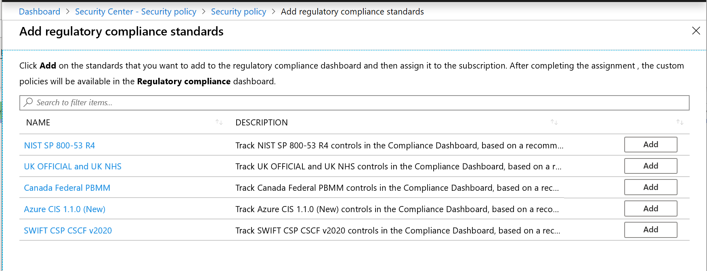
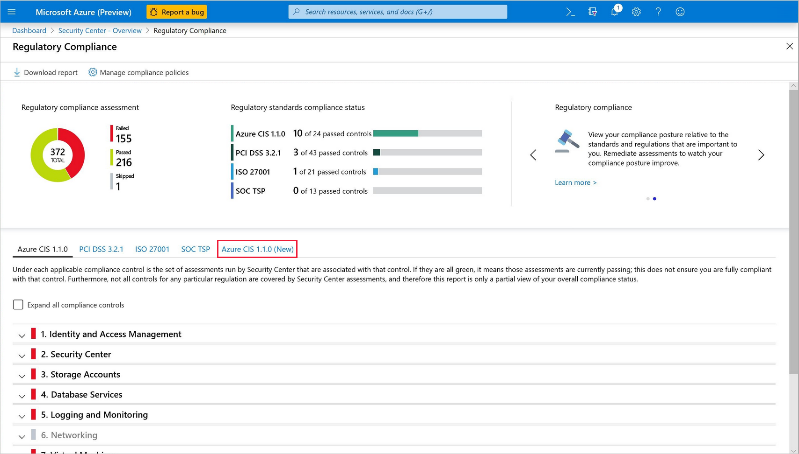

# Update to dynamic compliance packages in your Regulatory Compliance dashboard (Preview)

Azure Security Center continually compares the configuration of your resources with requirements in industry standards, regulations, and benchmarks. The **regulatory compliance dashboard** provides insights into your compliance posture based on how you're meeting specific compliance controls and requirements.

One standard for which you can track your compliance posture is [Azure CIS 1.1.0](https://www.cisecurity.org/benchmark/azure/) (more formally, the "CIS Microsoft Azure Foundations Benchmark version 1.1.0"). 

The representation of Azure CIS that initially appears in your compliance dashboard relies on a static set of rules that is included with Security Center.

With the **dynamic compliance packages (preview)** feature, Security Center automatically improves its coverage of industry standards over time. Compliance packages are essentially initiatives defined in Azure Policy. They can be assigned to your selected scope (subscription, management group, and so on). To see compliance data mapped as assessments in your dashboard, add a compliance package to your management group or subscription from within the Security Policy. Adding a compliance package effectively assigns the regulatory compliance initiative to your selected scope. In this way, you can track newly published regulatory initiatives as compliance standards in your dashboard. When Microsoft releases new content for the initiative (new policies that map to more controls in the standard), the additional content appears automatically in your dashboard.

The dynamic compliance package for the Azure CIS benchmark, **Azure CIS 1.1.0 (new)**, improves on the original *static* version by:

* Including more policies
* Automatically updating with new coverage as it's added 

Update to the new dynamic package as described below.

## Adding a dynamic compliance package

The following steps explain how to add the dynamic package for monitoring your compliance with the Azure CIS benchmark v1.1.0.   

### Update to the Azure CIS 1.1.0 (new) dynamic compliance package 

1. Open the **Security policy** page. This page shows the number of management groups, subscriptions, workspaces, and your management group structure.

1. Select the subscription or management group for which you want to manage the regulatory compliance posture. We recommend selecting the highest scope for which the standard is applicable so that compliance data is aggregated and tracked for all nested resources. 

1. In the Industry & regulatory standards (preview) section, you'll see that Azure CIS 1.1.0 can be updated for new content. Click **Update now**. 

1. Optionally, click **Add more standards** to open the **Add regulatory compliance standards** page. There, you can search manually for **Azure CIS 1.1.0 (New)** and dynamic packages for other compliance standards such as **NIST SP 800-53 R4**, **SWIFT CSP CSCF-v2020**, **UKO and UK NHS**, and **Canada PBMM**.
    
    

1. From Security Center's sidebar, select **Regulatory compliance** to open the regulatory compliance dashboard. 
    * Azure CIS 1.1.0 (New) now appears in your list of Industry & regulatory standards. 
    * The original *static* view of your Azure CIS 1.1.0 compliance will also remain alongside it. It may be automatically removed in the future.

    > [!NOTE]
    > It may take a few hours for a newly added standard to appear in the compliance dashboard.

    

## Next steps

In this article, you learned:

* How to **upgrade the standards** shown in your regulatory compliance dashboard to the new *dynamic* packages
* How to **add compliance packages** to monitor your compliance with additional standards. 

For other related material, see the following articles: 

- [Security center regulatory compliance dashboard](security-center-compliance-dashboard.md)
- [Working with security policies](tutorial-security-policy.md)
- [Managing security recommendations in Azure Security Center](security-center-recommendations.md) - Learn how to use recommendations in Azure Security Center to help protect your Azure resources.
- [Azure Security Center FAQs](security-center-faq.md) - Get answers to frequently asked questions about using Security Center.