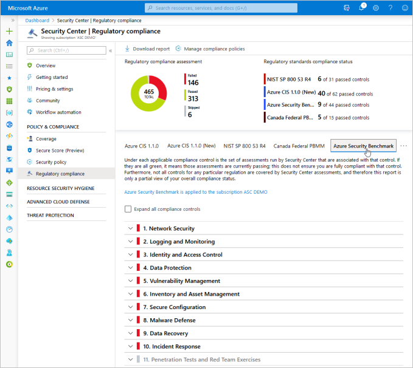

# Customizing the set of standards in your regulatory compliance dashboard

Azure Security Center continually compares the configuration of your resources with requirements in industry standards, regulations, and benchmarks. The **regulatory compliance dashboard** provides insights into your compliance posture based on how you're meeting specific compliance controls and requirements.

## Overview of compliance packages

Industry standards, regulatory standards, and benchmarks are represented in Security Center as *compliance packages*.  Each package is an initiative defined in Azure Policy. To see compliance data mapped as assessments in your dashboard, add a compliance package to your management group or subscription from within the **Security policy** page. (Learn more about Azure Policy and initiatives in [Working with security policies](tutorial-security-policy.md).)

When you've onboarded a standard or benchmark to your selected scope, it assigns the initiative to the scope and the standard appears in your regulatory compliance dashboard with all associated compliance data mapped as assessments. You can also download summary reports for any of the standards that have been onboarded.

Microsoft also tracks the regulatory standards themselves and automatically improves its coverage in some of the packages over time. When Microsoft releases new content for the initiative (new policies that map to more controls in the standard), the additional content appears automatically in your dashboard.

> [!TIP]
> One standard which improves over time as Microsoft releases new content is **Azure CIS 1.1.0 (new)** (more formally, the [CIS Microsoft Azure Foundations Benchmark version 1.1.0](https://www.cisecurity.org/benchmark/azure/)). You'll need to add this to your dashboard alongside "Azure CIS 1.1.0", the representation of Azure CIS that is configured by default in every Security Center environment. That package relies on a static set of rules. The newer package includes more policies and will automatically update over time. Update to the new dynamic package as described below.

## Available packages

You can add standards such as NIST SP 800-53 R4, SWIFT CSP CSCF-v2020, UK Official and UK NHS, Canada Federal PBMM, and Azure CIS 1.1.0 (new) - a more complete representation of Azure CIS 1.1.0. 

In addition, you can add **Azure Security Benchmark**, the Microsoft-authored, Azure-specific guidelines for security and compliance best practices based on common compliance frameworks. ([Learn more about Azure Security Benchmark](https://docs.microsoft.com/azure/security/benchmarks/introduction).)

Additional standards will be supported in the dashboard as they become available. 

## Add a regulatory standard to your dashboard

The following steps explain how to add a package to monitor your compliance with one of the supported regulatory standards.

> [!NOTE]
> Only users who are owner or policy contributor have the necessary permissions to add compliance standards. 

1. From Security Center's sidebar, select **Regulatory compliance** to open the regulatory compliance dashboard. Here you can see the compliance standards currently assigned to the currently selected subscriptions.   

1. From the top of the page, select **Manage compliance policies**. The Policy Management page appears.

1. Select the subscription or management group for which you want to manage the regulatory compliance posture. 

    > [!TIP]
    > We recommend selecting the highest scope for which the standard is applicable so that compliance data is aggregated and tracked for all nested resources. 

1. To add the standards relevant to your organization, click **Add more standards**. 

1. From the **Add regulatory compliance standards** page, you can search for packages for any of the available standards. Some of the standards available are:

    - **Azure Security Benchmark**
    - **NIST SP 800-53 R4**
    - **SWIFT CSP CSCF-v2020**
    - **UKO and UK NHS**
    - **Canada PBMM**
    
    

1. Select **Add** and enter all the necessary details for the specific initiative such as scope, parameters, and remediation.

1. From Security Center's sidebar, select **Regulatory compliance** again to go back to the regulatory compliance dashboard.
    * Your new standard appears in your list of Industry & regulatory standards. 
    * If you've added **Azure CIS 1.1.0 (New)**, the original *static* view of your Azure CIS 1.1.0 compliance will also remain alongside it. It may be automatically removed in the future.

    > [!NOTE]
    > It may take a few hours for a newly added standard to appear in the compliance dashboard.

    

## Removing a standard from your dashboard

If any of the supplied regulatory standards isn't relevant to your organization, it's a simple process to simply remove them from the UI. This lets you further customize the regulatory compliance dashboard, and focus only on the standards that are applicable to you.

To remove a standard:

1. From Security Center's menu, select **Security policy**.

1. Select the relevant subscription from which you want to remove a standard.

    > [!NOTE]
    > You can remove a standard from a subscription, but not from a management group. 

    The security policy page opens. For the selected subscription, it shows the default policy, the industry and regulatory standards, and any custom initiatives you've created.

    :::image type="content" source="./media/update-regulatory-compliance-packages/remove-standard.png" alt-text="Removing a regulatory standard from your regulatory compliance dashboard in Azure Security Center":::

1. For the standard you want to remove, select **Disable**. A confirmation window appears.

    :::image type="content" source="./media/update-regulatory-compliance-packages/remove-standard-confirm.png" alt-text="Confirm that you really want to remove the regulatory standard you selected":::

1. Select **Yes**. The standard will be removed. 

## Next steps

In this article, you learned how to **add compliance packages** to monitor your compliance with additional standards. 

For other related material, see the following articles: 

- [Azure Security Benchmark](https://docs.microsoft.com/azure/security/benchmarks/introduction)
- [Security center regulatory compliance dashboard](security-center-compliance-dashboard.md)
- [Working with security policies](tutorial-security-policy.md)