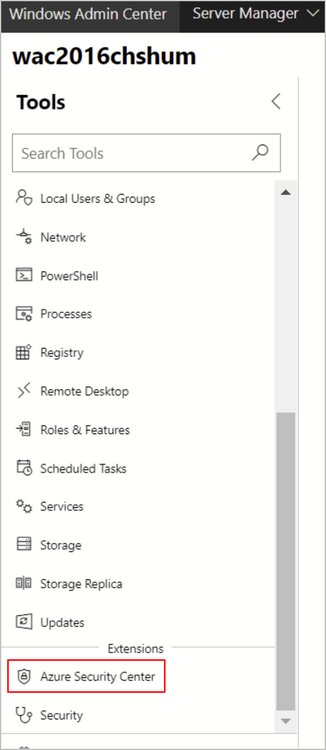
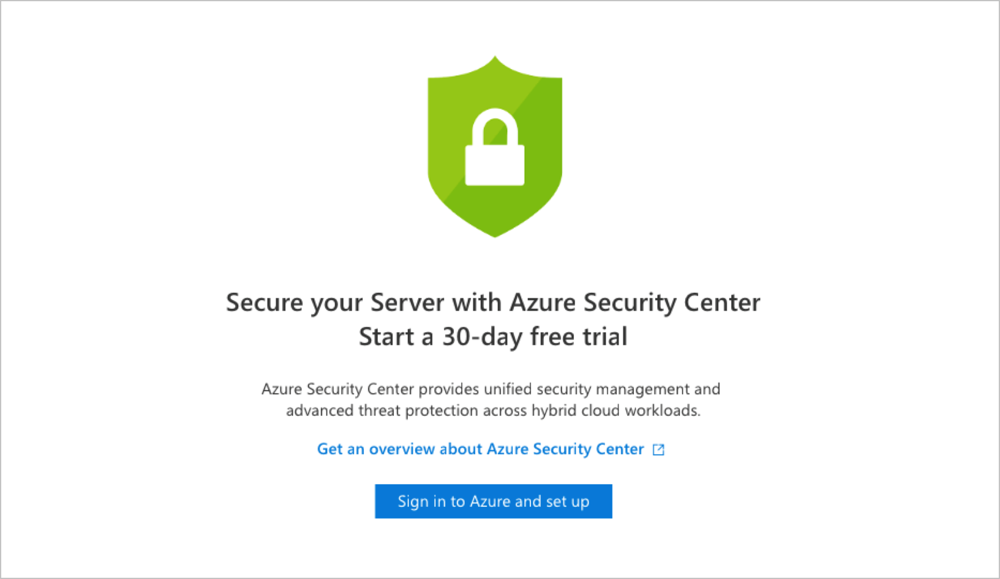
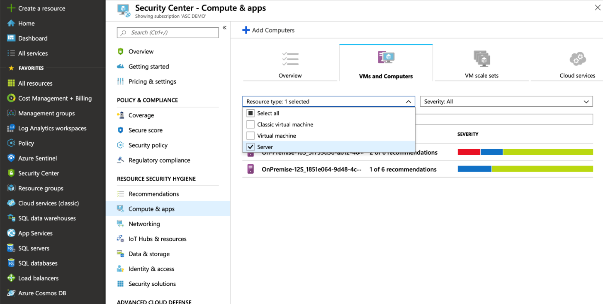
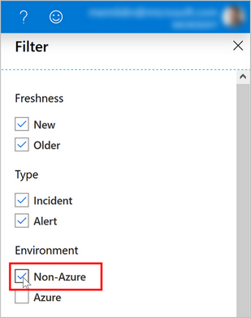
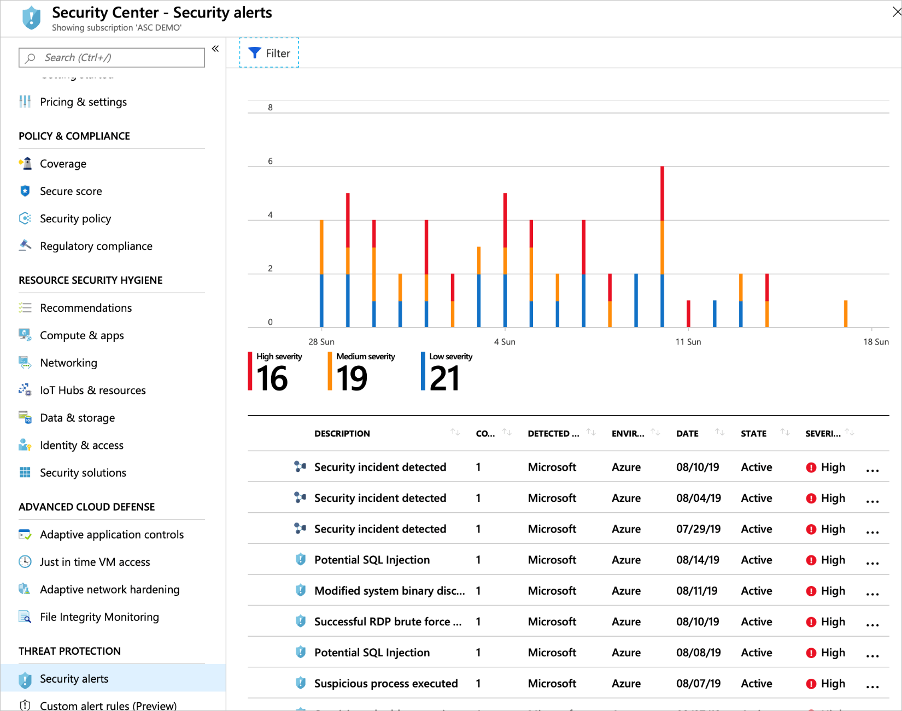

# Integrate Azure Security Center with Windows Admin Center

Windows Admin Center is a management tool for your Windows servers. It's a single location for system administrators to access the majority of the most commonly used admin tools. From within Windows Admin Center, you can directly onboard your on-prem servers into Azure Security Center. You can then view a summary of your security recommendations and alerts directly in the Windows Admin Center experience.

> [!NOTE]
> Your Azure subscription and the associated Log Analytics workspace both need to have Security Center's standard tier enabled in order to enable the Windows Admin Center integration.
> The standard tier is free for the first 30 days if you haven't previously used it on the subscription and workspace. For more information​, see [the pricing information page](security-center-pricing.md).
>

When you've successfully onboarded a server from Windows Admin Center to Azure Security Center, you can:

* View security alerts and recommendations inside the Security Center extension in Windows Admin Center
* View the security posture and retrieve additional detailed information of your Windows Admin Center managed servers in Security Center within the Azure portal (or via an API)

By combining these two tools, Security Center becomes your single pane of glass to view all your security information, whatever the resource: protecting your Windows Admin Center managed on-prem servers, your VMs, and any additional PaaS workloads.

## Onboarding Windows Admin Center managed servers into Security Center

1. From Windows Admin Center, select one of your servers, and in the **Tools** pane, select the Azure Security Center extension:

    

    > [!NOTE]
    > If the server is already onboarded to Security Center, the set-up window will not appear.

1. Click **Sign in to Azure and set up**.
    

1. Follow the instructions to connect your server to Security Center. After you've entered the necessary details and confirmed, Security Center makes the necessary configuration changes to ensure that all of the following are true:
    * An Azure Gateway is registered.
    * The server has a workspace to report to and an associated subscription.
    * Security Center's standard tier Log Analytics solution is enabled on the workspace. This solution provides Security Center's Standard tier features for *all* servers and virtual machines reporting to this workspace.
    * Security Center's standard tier pricing for Virtual Machine is enabled on the subscription.
    * The Log Analytics agent is installed on the server and configured to report to the selected workspace. If the server already reports to another workspace, it's configured to report to the newly selected workspace as well.

    > [!NOTE]
    > It may take some time after onboarding for recommendations to appear. In fact, depending on on your server activity you may not receive *any* alerts. To generate test alerts to test your alerts are working correctly, follow the instructions in [the alert validation procedure](security-center-alert-validation.md).

## Viewing security recommendations and alerts in Windows Admin Center

Once onboarded, you can view your alerts and recommendations directly in the Azure Security Center area of Windows Admin Center. Click a recommendation or an alert to view them in the Azure portal. There, you'll get additional information and learn how to remediate issues.

## Viewing security recommendations and alerts for Windows Admin Center managed servers in Security Center
From Azure Security Center:

* To view security recommendations for all your Windows Admin Center servers, open **Compute & Apps** and click the **VMs and Computers** tab. Filter the list by resource "Server" as shown here:

    

* To view security alerts for all your Windows Admin Center servers, open **Security alerts**. Click **Filter** and ensure **only** "Non-Azure" is selected:

    

    