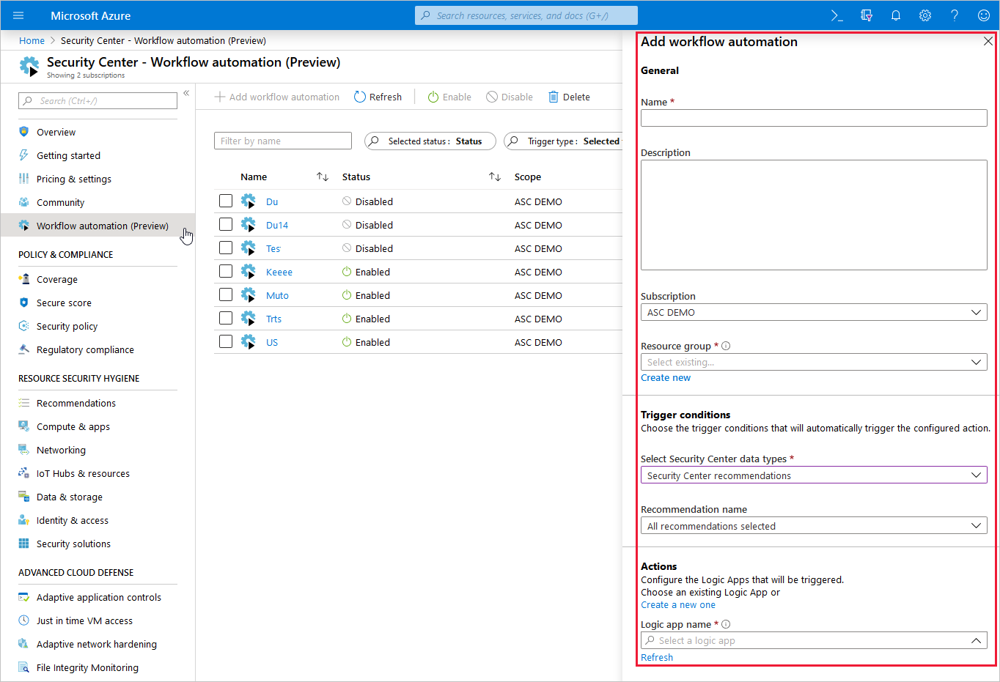
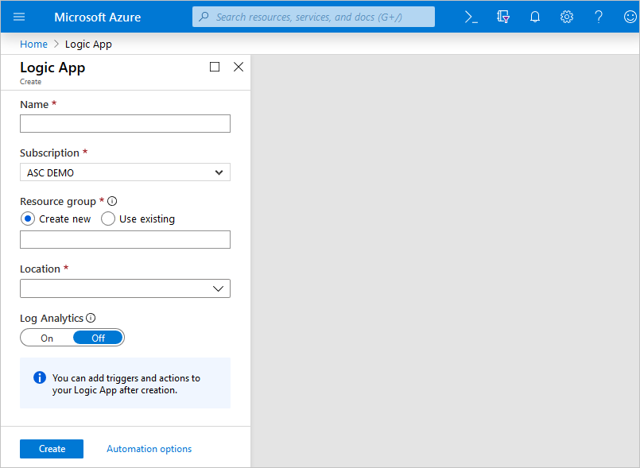
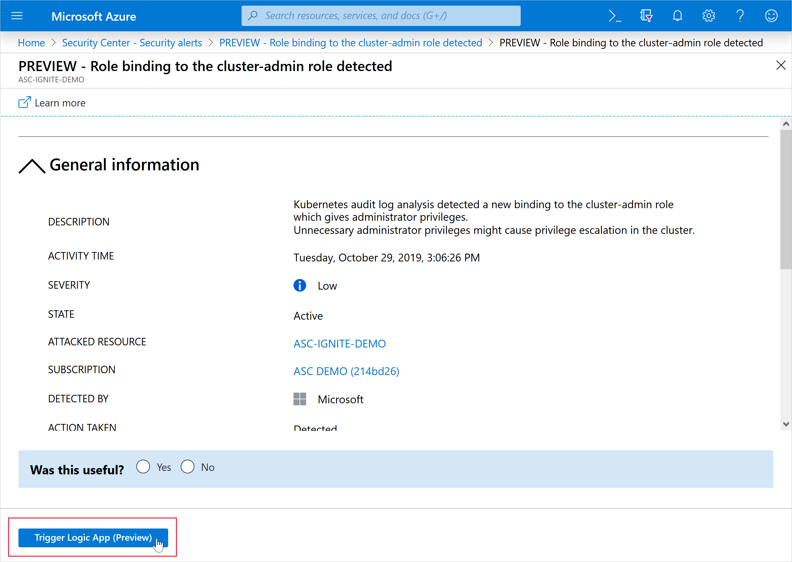

# Workflow automation

Every security program includes multiple workflows for incident response. These processes might include notifying relevant stakeholders, launching a change management process, and applying specific remediation steps. Security experts recommend that you automate as many steps of those procedures as you can. Automation reduces overhead. It can also improve your security by ensuring the process steps are done quickly, consistently, and according to your predefined requirements.

This article describes the workflow automation feature of Azure Security Center. This feature can trigger Logic Apps on security alerts and recommendations. For example, you might want Security Center to email a specific user when an alert occurs. You'll also learn how to create Logic Apps using [Azure Logic Apps](https://docs.microsoft.com/azure/logic-apps/logic-apps-overview).

> [!NOTE]
> If you previously used the Playbooks (Preview) view on the sidebar, you'll find the same features together with the expanded functionality in the new workflow automation page.

## Availability

- Release state: **Generally Available**
- Required roles and permissions:
    - **Reader** on the subscription containing the export configuration
    - **Security admin role** on the resource group (or **Owner**)
    - Must also have write permissions for the target resource
    - Also, to work with Azure Logic Apps workflows, you must have the following Logic Apps roles/permissions:

        * [Logic App Operator](https://docs.microsoft.com/azure/role-based-access-control/built-in-roles#logic-app-operator) permissions are required or Logic App read/trigger access (this role can't create or edit logic apps; only *run* existing ones)

        * [Logic App Contributor](https://docs.microsoft.com/azure/role-based-access-control/built-in-roles#logic-app-contributor) permissions are required for Logic App creation and modification

        * If you want to use Logic App connectors, you may need additional credentials to sign in to their respective services (for example, your Outlook/Teams/Slack instances)
- Clouds: 
    - ✔ Commercial clouds
    - ✔ US Gov
    - ✘ China Gov, Other Gov

## Create a Logic App and define when it should automatically run 

1. From Security Center's sidebar, select **Workflow automation**.

    

    From this page you can create new automation rules, as well as enable, disable, or delete existing ones.  
1. To define a new workflow, click **Add workflow automation**. 

    A pane appears with the options for your new automation. Here you can enter:
    1. A name and description for the automation.
    1. The triggers that will initiate this automatic workflow. For example, you might want your Logic App to run when a security alert that contains "SQL" is generated.
    1. The Logic App that will run when your trigger conditions are met. 

        

1. From the Actions section, click **Create a new one** to begin the Logic App creation process.

    You'll be taken to Azure Logic Apps.

    

1. Enter a name, resource group, and location, and click **Create**.

1. In your new Logic App, you can choose from built-in, predefined templates from the security category. Or you can define a custom flow of events to occur when this process is triggered.

    In the Logic App designer the following triggers from the Security Center connectors are supported:

    * **When an Azure Security Center Recommendation is created or triggered**
    * **When an Azure Security Center Alert is created or triggered** 
    
    > [!TIP]
    > You can customize the trigger so that it relates only to alerts with the severity levels that interest you.
    
    > [!NOTE]
    > If you are using the legacy trigger "When a response to an Azure Security Center alert is triggered", your Logic Apps will not be launched by the Workflow Automation feature. Instead, use either of the triggers mentioned above. 

    

1. After you've defined your Logic App, return to the workflow automation definition pane ("Add workflow automation"). Click **Refresh** to ensure your new Logic App is available for selection.

    

1. Select your Logic App and save the automation. Note that the Logic App dropdown only shows Logic Apps with supporting Security Center connectors mentioned above.

## Manually trigger a Logic App

You can also run Logic Apps manually when viewing a security alert or any recommendation that offers [Quick Fix remediation](https://docs.microsoft.com/azure/security-center/security-center-remediate-recommendations#quick-fix-remediation).

To manually run a Logic App, open an alert or a recommendation that supports Quick Fix remediation and click **Trigger Logic App**:

## Data types schemas

To view the raw event schemas of the security alerts or recommendations events passed to the Logic App instance, visit the [Workflow automation data types schemas](https://aka.ms/ASCAutomationSchemas). This can be useful in cases where you are not using Security Center's built-in Logic App connectors mentioned above, but instead are using Logic App's generic HTTP connector - you could use the event JSON schema to manually parse it as you see fit.

## Next steps

In this article, you learned about creating Logic Apps, automating their execution in Security Center, and running them manually. 

For other related material, see: 

- [The Microsoft Learn module on how to use workflow automation to automate a security response](https://docs.microsoft.com/learn/modules/resolve-threats-with-azure-security-center/)
- [Security recommendations in Azure Security Center](security-center-recommendations.md)
- [Security alerts in Azure Security Center](security-center-alerts-overview.md)
- [About Azure Logic Apps](https://docs.microsoft.com/azure/logic-apps/logic-apps-overview)
- [Logic Apps connectors](https://docs.microsoft.com/connectors/)
- [Workflow automation data types schemas](https://aka.ms/ASCAutomationSchemas)
