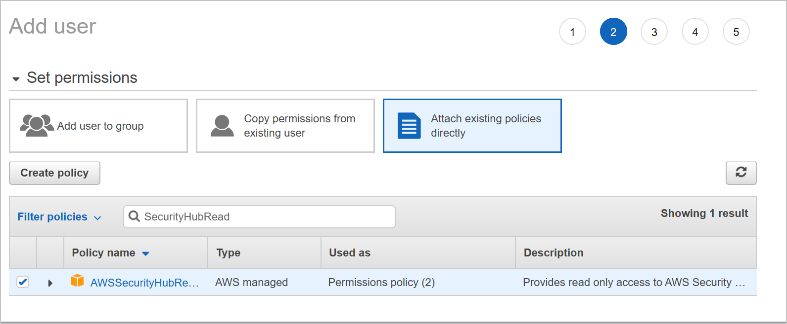

# Automatic workload protection for your AWS EC2 instances

Azure Security Center can monitor and manage the security of all of your cloud resources, including your AWS EC2 instances (in hybrid environments).

To protect and monitor an EC2 instance, Security Center needs to communicate with a Log Analytics Agent on the instance. There are two ways to deploy and configure the agent:

* Security Center can automatically deploy the agent to all of your existing AWS EC2 instances. Additionally, with the automatic provisioning feature enabled, Security Center can deploy the agent on any new EC2 instances that you create.

* Although automatic provisioning is recommended, manual installation is also available.  
To install manually, follow the relevant instructions for your OS: [Windows](https://docs.microsoft.com/azure/security-center/quick-onboard-windows-computer) or [Linux](https://docs.microsoft.com/azure/security-center/quick-onboard-linux-computer). 

## Autoprovisioning on Amazon Web Services accounts

> [!NOTE]
> Amazon's Systems Manager is required for automating tasks across your AWS resources. Ensure this is setup before configuring Security Center to monitor your EC2 instances. 
> 
> If your EC2 instances don't have the SSM Agent, follow the relevant instructions from Amazon:
>
> * [Installing and Configuring SSM Agent on Windows Instances](https://docs.aws.amazon.com/systems-manager/latest/userguide/sysman-install-ssm-win.html)
> * [Installing and Configuring SSM Agent on Amazon EC2 Linux Instances](https://docs.aws.amazon.com/systems-manager/latest/userguide/sysman-install-ssm-agent.html)

1. From your Amazon Web Services console, under **Security, Identity & Compliance**, click **IAM**.

    

1. Open the **Users** tab and click **Add user**.

1. In the Details step, enter a username for Cloud App Security, and ensure that you select **Programmatic access** for the AWS Access Type. 

1. Click **Next Permissions**.

1. Click **Attach existing policies directly** and apply the  AmazonEC2RoleforSSM and SecurityAudit policies.

    

1. Click **Next: Tags**. Optionally add tags. Adding Tags to the user doesn't affect the connection.

1. Click **Review**.

1. Review the summary and click **Create user**.

1. Save the automatically generated **Access key ID** and **Secret access key** for later.

## Next steps

In this article, you learned how to configure auto-provisioning for AWS EC2 instances. 

For other related material, see the following articles: 

- [Manual installation instructions for the Microsoft Monitoring Agent on Windows](quick-onboard-windows-computer.md)
- [Manual installation instructions for the Microsoft Monitoring Agent on Linux](quick-onboard-linux-computer.md)