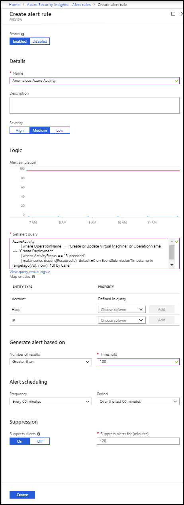

# Tutorial: Detect threats with Azure Security Insights
This tutorial helps you detect threats with Azure Security Insights.

Security insights provides interactive visualization using advanced analytics to help security analysts get a better understanding of what’s going on in the face of an attack. Investigate and pivot on any field from any data to rapidly develop threat context.

After you connected your data sources to Security Insights, you want to be notified when something suspicious happens. To enable you to do this, Security Insights lets you create advanced alert rules that generate cases that you can assign and use to deeply investigate anomalies and threats in your environment. 

## Create custom alert rules

In order to enable investigation, you first have to create alert rules based on the types of threats and anomalies that could be suspicious in your environment that you want to know about right away so you can investigate.

1. In the Azure portal under Security Insights, select **Alert rules**.

  

2. In the top menu bar, click **+Add**. Alternatively, you can take a look at the **Alert rule templates**. These can be used as a basis for your new custom rule. If you're using a template, follow the process below but edit the values rather than entering initial values. You can also use the alert templates as-is. 

  

3. In the **Create alert rule** blade, provide a descriptive name and set the **Severity** as necessary. 

4. Create the query in Log Analytics, and then paste it into the **Set alert rule** field. Here's a sample query that would alert you when an anomalous number of resources is created in Azure Activity.

        AzureActivity
        | where OperationName == "Create or Update Virtual Machine" or OperationName == "Create Deployment"
        | where ActivityStatus == "Succeeded"
        | make-series dcount(ResourceId)  default=0 on EventSubmissionTimestamp in range(ago(7d), now(), 1d) by Caller

5. Use the fields under **Entity type** to map the fields in your query to entities recognized by ASI. For each field, map the entity type, which is a field in the entity in the query you created in Log Analytics, to map to the actual column name under **Property** from the raw data. Each entity includes multiple fields, for example SID, GUID, etc. You can map the entity according to any of the fields, not just the upper level entity.

6. Define alert parameters under **Generate alert based on**. This defines the conditions that trigger the alert. 

7. Set the **Frequency** for how often the query is run - as frequently as every 5 minutes or as infrequently as once a day. 

8. Set the **Period** to control the time window for how much data the query runs on - for example, it can run every hour across 60 minutes of data.

9. You can also set the **Suppression**. Suppression is useful when you want to stop duplicate alerts from being triggered for the same incident. In this way you can stop alerts from being triggered during a specific period. This can help you avoid duplicate alerts for the same incident and allow you to suppress consecutive alerts for a period of time. For example, if the **Alert scheduling** **Frequency** is set to 60 minutes, and the **Alert scheduling Period** is set to two hours, and an incident happens, it will trigger an alert twice, once when it is first detected over the last 60 minutes, and again when it is in the first 60 minutes of the 2 hour data being sampled. We recommend that if an alert is triggered, the suppression should be for the amount of time set in the alert period. In our example, you might want to set suppression for 60 minutes, so that alerts are only triggered for events that happened during the most recent hour.

8. After you paste your query into the **Set alert rule** field, you can immediately see a simulation of the alert under **Logic alert simulation** so that you can gain understanding of how much data will be generated over a specific time interval for the alert you created. This will depend on what you set for **Frequency** and **Number of results**. If you see that on average, your alert will be triggered too frequently, you will want to set the number of results higher so that it's above your average baseline.

9. Click **Create** to initialize your alert rule. After the alert is created, you can see it in the list with all the rules by selecting **Alert rules**. You can also see the number of matches for each rule - the alerts triggered. From this list you can enable, disable, or delete each rule. You can also right click on the three dots at the end of the row for each alert to edit, disable, clone, show matches, or delete a rule. The **Alert rules** page is a gallery of all your active alert rules, including templates you enable and alert rules you create based on templates.

## Investigate cases

A case can include multiple alerts, it can include bookmarks that you create somewhere for something you want to include. It's an aggregation of all the relevant evidence for a specific investigation and can include comments so that you can indicate what you want to investigate and reasons why the case might be suspicious. A case is created based on custom alerts as well as built-in alerts. The properties related to the alerts, such as severity and status are set at the case level. 
After you let ASI know what kinds of threats you're looking for and how to find them, you can monitor threats that are detected. 

1. Select **Cases**. The **Cases** page lets you know how many alerts you have, how many are open, how many you've set to investigating and how many are closed. For each case, you can see the time it occurred, and the status of the case. Look at the severity to decide what to handle first. You can also see the entities that you earlier mapped as part of the alert.  You can filter the alerts as needed, for example by status or severity. When you look at the **Cases** tab you'll see open cases that contain alerts triggered by your alert rules. Across the top you'll see your active cases, new cases and in progress cases. You an also see an overview of all your cases by severity.

  

2. To begin an investigation, click on a specific case. In the blade that opens for the alert, you can see detailed information for the case including its severity, which entities, accounts, hosts and IP addresses were involved (based on your mapping), and information about the alert itself - when it was triggered and by how much it exceeded the thresholds you set. For each case, you have a unique ID, the severity of the case is determined according to the most severe alert included in the case. 

3. To drill down even further into the case, select **View results**. This opens the raw log file data that triggered the alerts.

4. If you're actively investigating a case, it's a good idea to set the case status to **Investigating** until you close it. You can also close the case, where closed resolved  is the status for true positive alerts while **closed dismissed**  is the status for false positive alerts. You have to give an explanation for what your reasoning is to close a case.

5. Cases can be assigned to a user. They all start unassigned and you can set as **Assign to me**.  You can go in to the cases and filter by your name to see all the cases that are assigned to you.

5. Click **Investigate** to  view the investigation map and scope of the breach with remediation steps. 

## Respond to threats

ASI gives you two primary options for responding to threats using playbooks. You can set a playbook to run automatically when an alert is triggered, or you can manually run a playbook in response to an alert.

- You can set a playbook to run automatically when an alert is triggered when you configure the playbook. 

- You can manually run a playbook from inside the alert, by clicking **View playbooks** and then selecting a playbook to run.

## Next steps
In this document, you learned how to investigate alerts with Security Insights. To learn more about Security Insights, see the following articles:

* [Azure Security blog](https://blogs.msdn.com/b/azuresecurity/) — Get the latest Azure security news and information.
