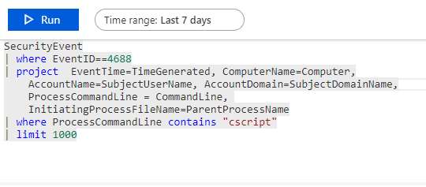
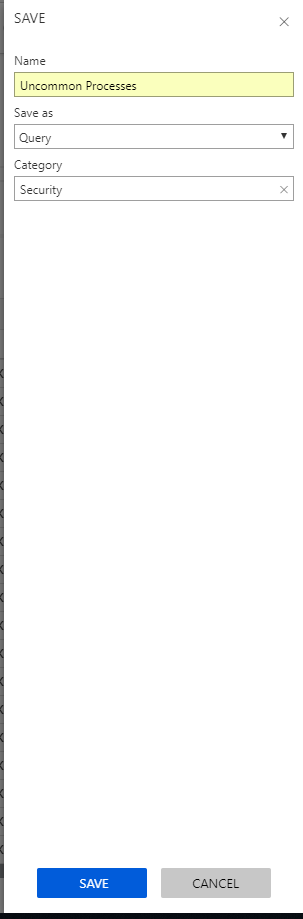

# Hunting capabilities in Security Insights

If you're an investigator who wants to be proactive about looking for security threats, Azure Security Insights powerful hunting search and query tools to hunt for security threats across your organization’s data sources. Once you have discovered which hunting query provides high value insights into possible attacks, you can also create custom detection rules based on your query and surface those insights as alerts to your security incident responders.

The Azure Security Insights powerful hunting search and query tools to hunt for security threats across your organization’s data sources. Once you have discovered which hunting query provides high value insights into possible attacks, you can also create custom detection rules based on your query and surface those insights as alerts to your security incident responders.

With Security Insights hunting, you can take advantage of the following capabilities:

-   Query examples – To get you started, a starting page provides preloaded query examples designed to get you started and get you familiar with the
    tables and the query language.

-   Powerful query language with IntelliSense - Built on top of a query language that gives you the flexibility you need to take hunting to the next level.

-   Query the stored telemetry - The telemetry data is accessible in tables for you to query. For example, you can query process creation, DNS events, and
    many other event types.

-   Links to community – Leverage the power of the greater community to find additional queries and data sources.

## Access query language documentation

Hunting in Azure Security Insights is based on Azure Log Analytics query language. For more information on the query language and supported operators, see [Query Language Reference](https://docs.loganalytics.io/docs/Language-Reference/).

## Public Hunting query GitHub repository

Check out the Hunting Queries [repository](https://github.com/Azure/Orion). Contribute and use example queries shared by our customers.

## Getting Started

To get you started, a Hunting starting page provides preloaded recommended query examples designed to get you started and get you familiar with the tables and the query language. These templates are grouped by their various techniques - the icons on the right categorize by the type of threat, such as exfiltration. You can filter the hunting templates using any of the fields. You can save any query to your favorites. You can create your own hunting query or customize an existing template.

*(Current dev version – not to be used)*

1. In Azure Security Insights, click **Hunting**.

2. Click on any of the charts or recommended queries to bring up the Log Analytics query explorer. See example below:

  

3. Click on the query to see what happens when it's run and what it's comprised of. 

4. Click **Show results** to view the log analytics page and all the raw data. 

5. Click on the row and add bookmark to add the rows to be investigated - you would do this for anything that looks suspicious. 

6. Then, go back to the main hunting page and click the **Bookmark** tab to see all the suspicious activities. 

7. Click on a bookmark and then click **Investigate** to open the investigation experience.
You can filter the bookmarks, for example, if you're investigating a campaign, you can create a tag for the campaign and then filter all the bookmarks based on the campaign.

## Sample query

A typical query starts with a table name followed by a series of operators separated by \|.

In the example above, we start with the table name SecurityEvent and add piped elements as needed.

First, we define a time filter to review only records from the previous seven days.

We then add a filter in the query to only show event ID 4688.

Next, we add a filter in the query on the CommandLine to contain only instances of cscript.exe.

Finally, we project only the columns we're interested in exploring and limit the results to 1000 and click Run query.
3. Click the green triangle and run the query. You can test them and run them and looking for anomalous behavior.

## Useful operators

The query language is very powerful and has a lot of available operators, some useful operators are listed here:

**where** - Filter a table to the subset of rows that satisfy a predicate.

**summarize** - Produce a table that aggregates the content of the input table.

**join** - Merge the rows of two tables to form a new table by matching values of the specified column(s) from each table.

**count** - Return the number of records in the input record set.

**top** - Return the first N records sorted by the specified columns.

**limit** - Return up to the specified number of rows.

**project** - Select the columns to include, rename or drop, and insert new computed columns.

**extend** - Create calculated columns and append them to the result set.

**makeset** - Return a dynamic (JSON) array of the set of distinct values that Expr takes in the group

**find** - Find rows that match a predicate across a set of tables.

## Save a query

You can create or modify a query and save it as your own query or share it with users who are in the same tenant.

1. Click the **Save query** drop-down button and select **Save**.

   

2. Enter a name for the query. Save as “Query” and choose a category and click on **Save**.

## Next steps
In this article, you learned how to run a hunting investigation with Security Insights. To learn more about Security Insights, see the following articles:

* [Azure Security Blog](https://blogs.msdn.com/b/azuresecurity/): Find blog posts about Azure security and compliance.