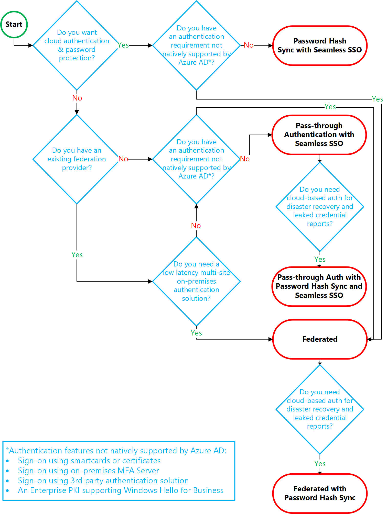
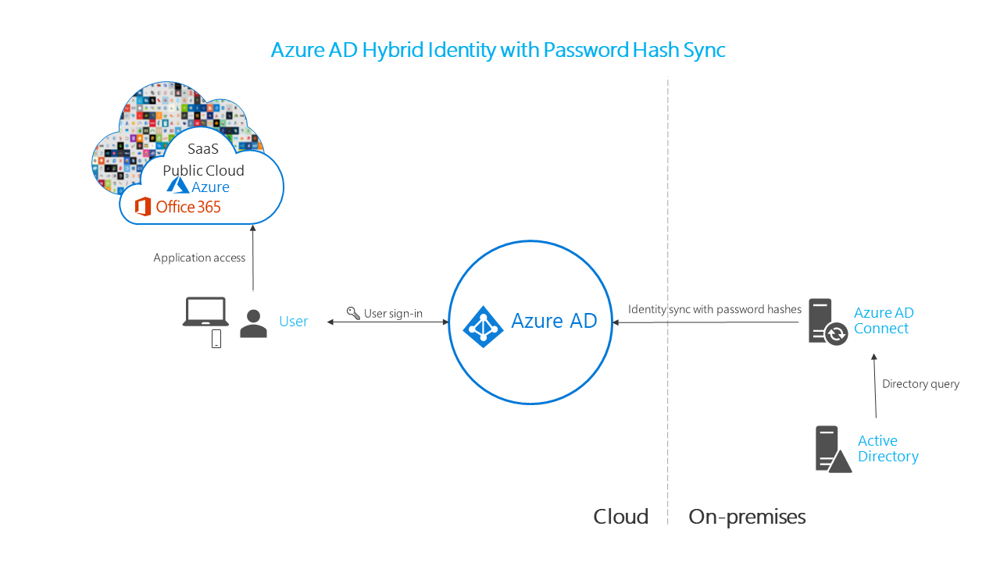
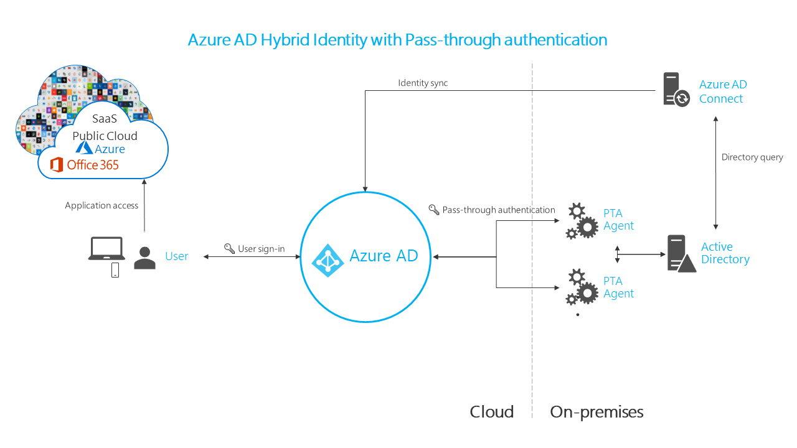
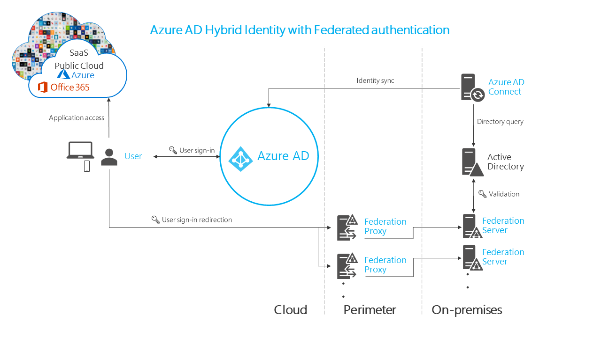

# Choosing the right authentication method for your Azure Active Directory hybrid identity solution 

This article is the first in a series of articles to help organizations implement a complete Azure AD hybrid identity solution. A complete Azure AD hybrid identity solution was outlined as the Hybrid Identity Digital Transformation Framework and covers the business outcomes, and goals organizations should focus on to make sure they've implemented a robust and secure hybrid identity solution. The first business outcome of the framework spells out the requirements for organizations to secure the authentication process when users access cloud apps. The first business goal in the authentication secured business outcome is the ability for users to sign in to cloud apps using their on-premises usernames and passwords. This sign-in process and how users authenticate makes everything in the cloud possible.

Choosing the correct authentication method is the first concern for organizations wanting to move their apps to the cloud. This decision shouldn't be taken lightly for the following reasons:

1. It is the first decision for an organization wanting to move to the cloud. 

2. The authentication method is a critical component of an organization’s presence in the cloud, controlling access to all cloud data and resources.

3. It is the foundation of all the other advanced security and user experience features in Azure AD.

4. Difficulty in changing the authentication method once implemented.

With identity as the new control plane of IT security, authentication is an organization’s access guard to the new cloud world. Organizations should make sure the identity control plane makes their security stronger and keep their cloud apps safe from intruders.

### Out of scope

Organizations that don't have an existing on-premises directory footprint aren't the focus of this article. Typically, those businesses create identities only in the cloud, which doesn’t require a hybrid identity solution. Cloud-only identities exist solely in the cloud and not associated with corresponding on-premises identities.  

## Choosing the right authentication method

With Azure AD hybrid identity solution as the new control plane, authentication is the foundation of cloud access. Choosing the correct authentication method is a crucial first decision in setting up an Azure AD hybrid identity solution. Implementing the authentication method is configured using Azure AD Connect which also provision users in the cloud. 

To choose an authentication method, you need to consider the time, existing infrastructure, complexity, and cost of implementing your choice. These factors are different for every organization and might change over time. 

Azure AD supports the following authentication methods for hybrid identity solutions:

### Cloud Authentication
When you choose this authentication method Azure AD handles the sign-in process for users. Coupled with seamless single sign-on (SSO), users can sign in to cloud apps without having to reenter their credentials. With cloud authentication you can choose from two options: 

**Password Hash Sync (PHS)** – The simplest way to enable authentication for on-premises directory objects in Azure AD. Password Hash Sync enables users to use the same username and password that they use on-premises without having to deploy any additional infrastructure. Some premium features of Azure AD, such as Identity Protection, requires Password Hash Sync regardless of which authentication method is selected.

> [!NOTE] 
> Passwords are never stored in clear text or encrypted with a reversible algorithm in Azure AD. For more information on the actual process of Password Hash Sync, see [Implement password hash synchronization with Azure AD Connect sync](https://docs.microsoft.com/en-us/azure/active-directory/connect/active-directory-aadconnectsync-implement-password-synchronization). 

**Pass-through authentication (PTA)** – Provides a simple password validation for Azure AD authentication services using a software agent running on one or more on-premises servers to validate the users directly with your on-premises Active Directory ensuring the password validation doesn't happen in the cloud. Companies with a regulatory requirement that prevents them from having their hashed passwords in the cloud and therefore can’t use Password Hash Sync would use this authentication method. For more information on the actual pass-through authentication process, see [User sign-in with Azure Active Directory Pass-through authentication](https://docs.microsoft.com/en-us/azure/active-directory/connect/active-directory-aadconnect-pass-through-authentication).

### Federated authentication
When you choose this authentication method Azure AD hands off the authentication process to a separate trusted authentication system, for example, an on-premises Active Directory Federation Services (AD FS) to validate the user’s password. The authentication system can provide additional authentication requirements, such as smartcard-based authentication or a third-party multi-factor authentication. For more information, see [Deploying Active Directory Federation Services](https://docs.microsoft.com/en-us/windows-server/identity/ad-fs/deployment/windows-server-2012-r2-ad-fs-deployment-guide).

The following section will help you decide which authentication method is right for you, using a decision tree. It will help you determine whether to deploy cloud or federated authentication for your Azure AD hybrid identity solution.

## Azure AD authentication decision tree

## Detailed considerations on authentication methods

### Cloud authentication: Password Hash Sync 

* **Effort:** Password Hash Sync requires the least effort regarding deployment, maintenance, and infrastructure for organizations who only need to enable their users to sign in to Office 365, SaaS apps, and other Azure AD-based resources. When enabled, Password Hash Sync is part of the Azure AD Connect sync process and runs every two minutes. 

* **User experience:** It is recommended that organizations deploy seamless single sign-on (SSO) with Password Hash Sync to improve the user’s sign-in experience by avoiding unnecessary prompts once they signed in.

* **Advanced scenarios:** If organizations choose to, it is possible to use insights from identities with Azure AD Identity Protection reports, such as the leaked credentials report. Windows Hello for Business is another option that has [specific requirements when you use Password Hash Sync](https://docs.microsoft.com/en-us/windows/access-protection/hello-for-business/hello-identity-verification). Organizations requiring multi-factor authentication with Password Hash Sync must use Azure AD multi-factor authentication and cannot use a third party or on-premises multi-factor authentication methods.

* **Business Continuity:** Password Hash Sync is inherently highly available as a cloud service that scales to all Microsoft datacenters. It is recommended that a second Azure AD Connect server is deployed in staging mode in a standby configuration for disaster recovery purposes.

* **Considerations:** Password Hash Sync does not immediately enforce changes in on-premises account states currently. In this situation, a user will have access to cloud apps until the user account state is synchronized to the Azure AD. If organizations want to overcome this limitation, it is recommended a new synchronization cycle is activated after administrators do bulk updates to on-premises user account states, such as disabling accounts. Account locked-out is another user account state that is synced in the next cycle. 

> [!NOTE] 
> The password expired state is not currently synced to Azure AD with the Azure AD Connect. 

Refer to [implementing Password Hash Sync](https://docs.microsoft.com/en-us/azure/active-directory/connect/active-directory-aadconnectsync-implement-password-synchronization) for deployment steps.

### Cloud authentication: Pass-through authentication  

* **Effort:** For Pass-through authentication, you need one or more (three recommended) lightweight agents installed on existing servers with access to your on-premises Active Directory Domain Services, including access to your on-premises AD domain controllers. These agents need outbound access to the Internet and have access to your domain controllers. For this reason, it is not supported to deploy the agents in a perimeter network, because it requires unconstrained network access to domain controllers. All network traffic is encrypted and limited to authentication requests. For more information on this process, see the [security deep dive](https://docs.microsoft.com/en-us/azure/active-directory/connect/active-directory-aadconnect-pass-through-authentication-security-deep-dive) on Pass-through authentication.

* **User experience:** It is recommended that organizations deploy seamless single sign-on with Pass-through authentication to improve the user’s sign-in experience by avoiding unnecessary  prompts once they signed in.

* **Advanced scenarios:** Pass-through authentication ensures authentication requests are immediately denied when an on-premises user’s account state is disabled, locked out, password expired or falls outside the user’s allowed logon hours. Organizations requiring multi-factor authentication with pass-through authentication must use Azure AD multi-factor authentication and cannot use a third party or on-premises multi-factor authentication method. Advanced features, such as the leaked credentials report of Identity Protection requires that Password Hash Sync is deployed regardless if you choose pass-through authentication.

* **Business Continuity:** It is recommended that you deploy two extra pass-through agents, besides the first agent on the Azure AD Connect server to ensure high availability of authentication requests. When you have three agents deployed, one agent can still fail when another agent is down for maintenance. Another benefit of deploying Password Hash Sync in addition to pass-through authentication, is it can act as backup authentication method when the primary authentication method is no longer available, for example when the on-premises servers are not available.

* **Considerations:** If you use Password Hash Sync as a backup authentication method for pass-through authentication and the agents cannot validate the user's credentials, then the failover to Password Hash Sync does not happen automatically. You would need to switch the sign-on method manually using Azure AD Connect. Pass-through authentication only supports cloud apps that use modern authentication and specific Exchange Online protocols like ActiveSync, POP3 and IMAP4. For example, [Microsoft Office 2013 and later supports modern authentication, but not earlier versions](https://blogs.office.com/en-us/2015/11/19/updated-office-365-modern-authentication-public-preview/) on more information of Office app support. See [frequently asked questions](https://docs.microsoft.com/en-us/azure/active-directory/connect/active-directory-aadconnect-pass-through-authentication-faq) and other considerations on pass-through authentication, including Alternate ID support.

Refer to [implementing Pass-through authentication](https://docs.microsoft.com/en-us/azure/active-directory/connect/active-directory-aadconnect-pass-through-authentication) for deployment steps.

### Federated Authentication

* **Effort:** Using a federated authentication system rely on an external system to authenticate users. Some companies want to reuse their existing federated system investment with their Azure AD hybrid identity solution. The maintenance and management of the federated system falls outside the control of Azure AD. It is up to the organization using the federated system to make sure it is deployed securely and can handle the authentication load. 

* **User experience:** The user experience of federated authentication is dependent on the implementation of the features, topology, and configuration of the federation farm. Some organizations require this flexibility to adapt and configure the access to the federation farm to suit their security requirements. For example, it is possible to configure internally connected users and devices to sign in users automatically, without prompting them for credentials, because they have already signed-in to their devices. On the other hand, if necessary, some advanced security features can make the user’s sign-in process more difficult.

* **Advanced scenarios:** Federated authentication solution is typically required when customers have an authentication requirement not natively supported by Azure AD, detailed information is [listed here](https://blogs.msdn.microsoft.com/samueld/2017/06/13/choosing-the-right-sign-in-option-to-connect-to-azure-ad-office-365/), but common requirements include:

	* Authentication requiring smartcards or certificates
	* Using on-premises MFA Server or third-party multi-factor provider.
	* Authentication using third-party authentication solution. See the [Azure AD federation compatibility list](https://docs.microsoft.com/en-us/azure/active-directory/connect/active-directory-aadconnect-federation-compatibility).
	* Users must sign in using their sAMAccountName, for example, DOMAIN\username, instead of using a User Principal Name (UPN), for example, user@domain.com
	* A Windows Hello for Business implementation dependent on an internal Enterprise Public Key Infrastructure (PKI) for certificate trust

* **Business Continuity:** Federated systems typically require a load balanced array of servers, also known as a farm, configured in an internal network and perimeter network topology to ensure high availability for authentication requests. Password Hash Sync can be deployed along with Federated authentication as backup authentication method when the primary authentication method is no longer available, for example when the on-premises servers are not available. Some large enterprise organizations require a federation solution to support multiple Internet ingress points configured with geo-DNS for low latency authentication requests.

* **Considerations:** Federated systems typically require a more significant investment in on-premises infrastructure. Most organizations choose this option if they already have an on-premises federation investment and it is a strong business requirement to use a single identity provider. Federation is more complex to operate and troubleshoot compared to cloud authentication solutions. Using user IDs with a non-routable domain that cannot be verified in Azure AD to sign in need extra configuration to implement. This requirement is known as Alternate login ID support. See [Configuring Alternate Login ID](https://docs.microsoft.com/en-us/windows-server/identity/ad-fs/operations/configuring-alternate-login-id) for limitations and requirements.

Refer to [implementing federation services](https://docs.microsoft.com/en-us/windows-server/identity/ad-fs/deployment/deploying-federation-servers) for deployment steps.

> [!NOTE] 
> When you deploy your Azure AD hybrid identity solution, you must ensure you implement one of the supported topologies of Azure AD Connect. Learn more about supported and unsupported configurations at [Topologies for Azure AD Connect](https://docs.microsoft.com/en-us/azure/active-directory/connect/active-directory-aadconnect-topologies).

## Architecture diagrams

The following diagram outlines the high-level architecture components required for each authentication method you can use with your Azure AD hybrid identity solution. It provides you with an overview to compare the differences between the solutions.

The following diagram outlines the simplicity of a Password Hash Sync solution:

The following diagram outlines the agent requirements of Pass-through authentication:

The following diagram outlines the components required for federation in your perimeter and internal network of your organization:

## Recommendations and considerations from Azure AD

Your identity system ensures your users have access to cloud apps and line-of-business apps you migrate and make available in the cloud. Authentication controls access to apps, to keep authorized users productive and bad actors out of your organization’s sensitive data. For this reason, consider the following recommendations in choosing the right authentication method for your organization. 

Use or enable Password Hash Sync no matter which authentication method you choose, for the following reasons:

1. **High availability and disaster recovery:** Pass-through authentication and federation rely on on-premises infrastructure. For pass-through authentication, this includes the server hardware and networking. It is also reliant on domain controllers to respond to authentication requests from the pass-through authentication agents. For federation, the on-premises footprint is even more, since it requires servers in your perimeter network to proxy authentication requests and the internal federation servers. To avoid single points of failures, your organization should deploy redundant servers to ensure authentication requests are always serviced if any component fails. Many components need maintenance to stay healthy, and outages are more likely when maintenance is not planned and implemented correctly. Outages can be avoided by using Password Hash Sync because Microsoft’s Azure AD cloud authentication service scales globally and is always available.

2. **On-premises outage survival:**  The consequences of an on-premises outage due to a cyber-attack or disaster can be substantial, ranging from reputational brand damage to a paralyzed organization unable to deal with the attack. In the last year, many organizations were victims of malware attacks, including targeted ransomware, that caused their on-premises servers to be down. In helping customers deal with these kinds of attacks, Microsoft noticed two categories of organizations:

   a. Organizations that previously enabled Password Hash Sync was back online in a matter of hours by changing their authentication method to use Password Hash Sync. Using access to email via Office 365, they could work to resolve issues and have access to other cloud-based workloads.

   b. Organizations that didn’t previously enable Password Hash Sync had to resort to untrusted external consumer email systems for communications and resolving issues. In those cases, it took them weeks or more to be up and running again.

3. **Identity Protection:** One of the best ways to protect users in the cloud is Azure AD Identity Protection. Microsoft continually scans the Internet for user and password lists, bad actors sell and make available on the dark web. Azure AD can use this information to verify if any of the usernames and passwords in your organization are compromised. It is therefore critical to enable Password Hash Sync regardless of what authentication method you use, whether that is federated or pass-through authentication. Leaked credentials are presented as a report and can be used to block or force a user to change their password when they try to sign in with a leaked password.

Lastly, according to [Gartner](https://info.microsoft.com/landingIAMGartnerreportregistration.html), Microsoft has the most full-featured set of Identity and Access Management functions. Microsoft fends off seven trillion cyber events per day while providing sign-on to authorized users to thousands of SaaS applications like Office 365 from virtually any device. 

## Conclusion

In this article outlines various authentication options, organizations can configure and deploy to support access to cloud apps. To meet various business, security and technical requirements, organizations can choose between Password Hash Sync, Pass-through authentication, and federation. With each authentication method, your organization can choose whether your business requirements are addressed by the effort to deploy the solution and the user experience of the sign-in process. You also need to evaluate whether your organization needs the advanced scenarios and business continuity features of each authentication method. Finally, you have to evaluate the considerations of each authentication method to see if any prevent you from implementing your choice.

## Next steps

In today’s world, threats are present 24 hours a day and come from everywhere. Implementing the correct authentication method will help mitigate your security risks and protect your identities. 

[Get started](https://docs.microsoft.com/en-us/azure/active-directory/get-started-azure-ad) with Azure AD and deploy the right authentication solution for your organization.

If you are considering migrating from federated to cloud authentication, learn more [about the changing the sign in method](https://docs.microsoft.com/en-us/azure/active-directory/connect/active-directory-aadconnect-user-signin#changing-the-user-sign-in-method). To help you plan and implement the migration, you can use [these project plans to assist you](https://github.com/Identity-Deployment-Guides/Identity-Deployment-Guides/tree/master/Authentication).
