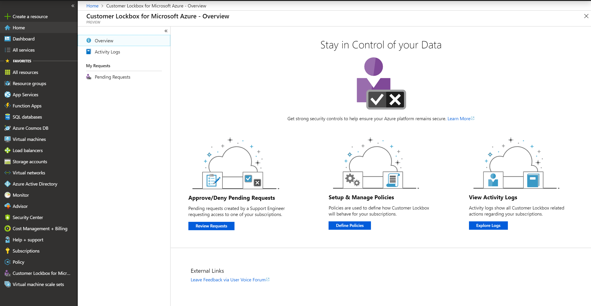
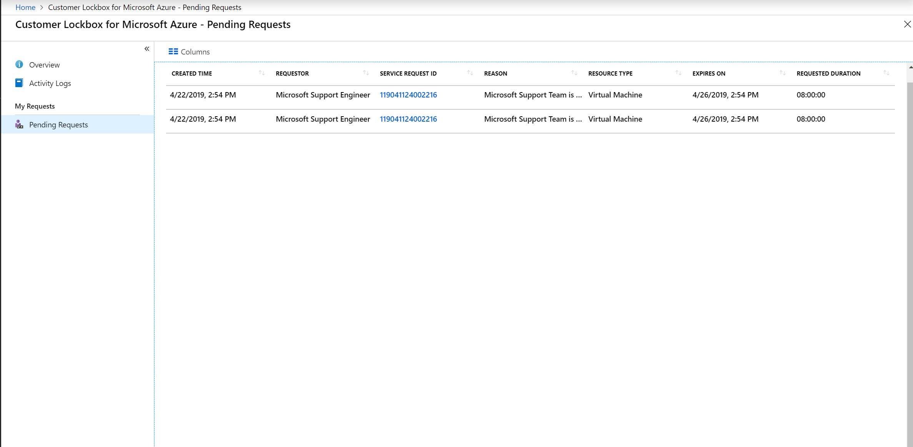
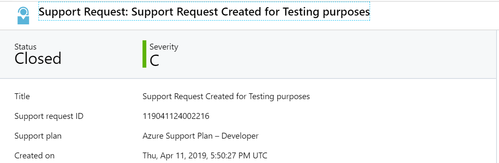
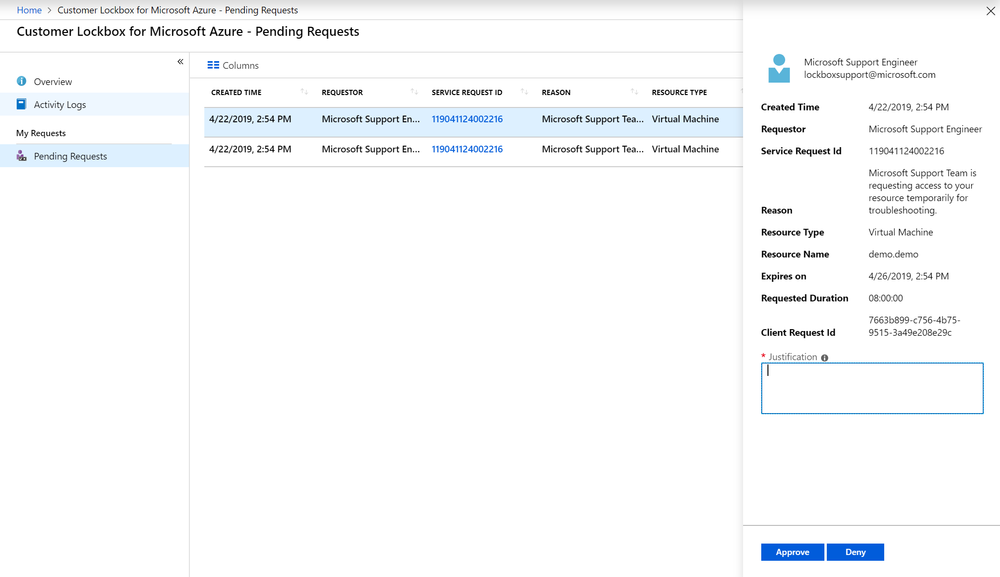

# Customer Lockbox for Microsoft Azure

> [!NOTE]
> To use this feature, your organization must have an [Azure support plan](https://azure.microsoft.com/support/plans/) with a minimal level of **Developer**.

As a cloud service provider, we understand the importance of maintaining the integrity and confidentiality of customer data. We continually invest in our policies, processes, and tools for governing when Microsoft may need to access customer data hosted in Azure. One of the key tools to provide control over these processes is Customer Lockbox for Microsoft Azure.

If a Microsoft engineer needs to access customer data during a support request, Customer Lockbox provides an interface for a customer to review this access request, and approve or reject it, as well as track historical request logs. This article covers how this workflow is initiated, tracked, and stored for later reviews and audits.

## Workflow

The following steps outline a typical workflow for a Customer Lockbox request.

1. Someone at an organization has an issue with their Azure workload.

2. After this person troubleshoots the issue, but can't fix it, they open a support ticket from the [Azure portal](https://ms.portal.azure.com/signin/index/?feature.settingsportalinstance=mpac). The ticket is assigned to an Azure Customer Support Engineer.

3. An Azure Support Engineer reviews the service request and determines the next steps to resolve the issue.

4. For most cases, support engineers can troubleshoot these issues by using tools and telemetry that do not require elevated permissions. However, in some cases, the next step is to request elevated permissions by using a Just-In-Time (JIT) access service. This request can be from the original support engineer. Or, it can be from a different engineer because the problem is escalated to the Azure DevOps team.

5. After the access request is submitted by the Azure Engineer, Just-In-Time service evaluates the request taking into account factors such as:
    - The scope of the resource
    - Whether the requester is an isolated identity or using multi-factor authentication
    - Whether the source device is locked down for security
    - Permissions levels
    
    Based on the JIT rule, this may also include an approval from Internal Microsoft Approvers. For example, the approver might be the Customer support lead or the DevOps Manager.

6. When the request requires direct access to customer data, a Customer Lockbox request is initiated. For example, remote desktop access to a customer's virtual machine.
    
    The request is now in a **Customer Notified** state, waiting for the customer's approval before granting access.

7. At the customer organization, the user who has the [Owner role](../role-based-access-control/rbac-and-directory-admin-roles.md#azure-rbac-roles) for the Azure subscription receives an email from Microsoft, to notify them about the pending access request. For Customer Lockbox requests, this person is the designated approver.
    
    Example email:
    
    

8. The email notification provides a link to the **Customer Lockbox** blade in the Azure portal. Using this link, the designated approver signs in to the Azure portal to view any pending requests that their organization has for Customer Lockbox:
    
    
    
   The request remains in the customer queue for four days. After this time, the access request automatically expires and no access is granted to Microsoft engineers.

9. To get the details of the pending request, the designated approver can select the lockbox request from **Pending Requests**:
    
    

10. The designated approver can also select the **SERVICE REQUEST ID** to view the support ticket request that was created by the original user. This information provides context for why Microsoft Support is engaged, and the history of the reported problem. For example:
    
    

11. After reviewing the request, the designated approver selects **Approve** or **Deny**:
    
    
    
    As a result of the selection:
    - **Approve**:  Access is granted to the Microsoft engineer. The access is granted for a default period of eight hours.
    - **Deny**: The elevated access request by the Microsoft engineer is rejected and no further action is taken.

For auditing purposes, the actions taken in this workflow are logged in [Customer Lockbox request logs](#auditing-logs).

## Auditing logs

Customer Lockbox logs are stored in activity logs. In the Azure portal, select **Activity Logs** to view auditing information related to Customer Lockbox requests. You can filter for specific actions, such as:
- **Deny Lockbox Request**
- **Create Lockbox Request**
- **Approve Lockbox Request**
- **Lockbox Request Expiry**

As an example:

## Supported services and scenarios

The following services and scenarios are currently in general availability for Customer Lockbox.

### Remote desktop access to virtual machines

Customer Lockbox is currently enabled for remote desktop access requests to virtual machines. The following workloads are supported:
- Platform as a service (PaaS) - version 1
- Infrastructure as a service (IaaS) - Windows and Linux (Azure Resource Manager only)
- Virtual machine scale set - Windows and Linux

> [!NOTE]
> IaaS Classic instances are not supported by Customer Lockbox. If you have workloads running on IaaS Classic instances, we recommend you migrate them from Classic to Resource Manager deployment models. For instructions, see [Platform-supported migration of IaaS resources from classic to Azure Resource Manager](../virtual-machines/windows/migration-classic-resource-manager-overview.md).

#### Detailed audit logs

For scenarios that involve direct remote desktop access to a virtual machine, you can also use the Windows Event Log. If a virtual machine agent is installed on the virtual machine, you can export these logs for analysis and alerting. This data can then be used by other monitoring solutions, such as Azure Monitor.

## Exclusions

Customer Lockbox requests aren't triggered in the following engineering support scenarios:

- A Microsoft engineer needs to do an activity that falls outside of standard operating procedures. For example, to recover or restore a service.

- A Microsoft engineer accesses the Azure platform as part of troubleshooting and inadvertently has access to customer data. For example, the Azure Network Team performs troubleshooting that results in a packet capture on a network device. However, if the customer encrypted the data while it was in transit, the engineer cannot read the data.

## Next steps

Customer Lockbox is automatically available for all customers who have an [Azure support plan](https://azure.microsoft.com/support/plans/) with a minimal level of **Developer**.

When you have an eligible support plan, no action is required by you to enable Customer Lockbox. Customer Lockbox requests are initiated by a Microsoft engineer if this action is needed to progress a support ticket that is filed from somebody in your organization.
