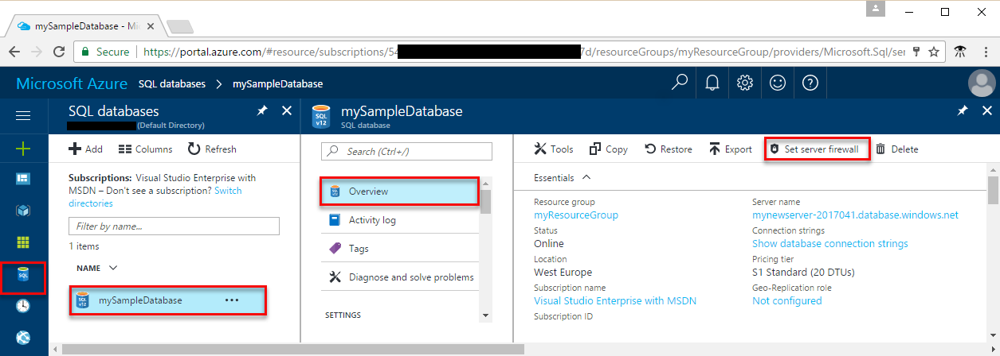

# Azure database security best practices
This article describes best practices for database security.

The best practices are based on a consensus of opinion, and they work with current Azure platform capabilities and feature sets. Opinions and technologies change over time and this article is updated on a regular basis to reflect those changes.

## Secure databases
Security is a top concern for managing databases, and it has always been a priority for [Azure SQL Database](https://docs.microsoft.com/azure/sql-database/). Your databases can be tightly secured to help satisfy most regulatory or security requirements, including HIPAA, ISO 27001/27002, and PCI DSS Level 1. A current list of security compliance certifications is available at the [Microsoft Trust Center site](https://azure.microsoft.com/support/trust-center/services/). You also can choose to place your databases in specific Azure datacenters based on regulatory requirements.

## Use firewall rules to restrict database access
Microsoft Azure SQL Database provides a relational database service for Azure and other internet-based applications. To provide access security, SQL Database controls access with:

- Firewall rules that limit connectivity by IP address.
- Authentication mechanisms that require users to prove their identity.
- Authorization mechanisms that limit users to specific actions and data.

Firewalls prevent all access to your database server until you specify which computers have permission. The firewall grants access to databases based on the originating IP address of each request.

The following figure shows where you set a server firewall in SQL Database:

The Azure SQL Database service is available only through TCP port 1433. To access a SQL database from your computer, ensure that your client computer firewall allows outgoing TCP communication on TCP port 1433. Block inbound connections on TCP port 1433 by using firewall rules, if you don’t need these connections for other applications.

As part of the connection process, connections from Azure virtual machines are redirected to an IP address and port that are unique for each worker role. The port number is in the range from 11000 to 11999. For more information about TCP ports, see [Ports beyond 1433 for ADO.NET 4.5](../sql-database/sql-database-develop-direct-route-ports-adonet-v12.md).

For more information about firewall rules in SQL Database, see [SQL Database firewall rules](../sql-database/sql-database-firewall-configure.md).

> [!Note]
> In addition to IP rules, the firewall manages virtual network rules. Virtual network rules are based on virtual network service endpoints. Virtual network rules might be preferable to IP rules in some cases. To learn more, see [Virtual network service endpoints and rules for Azure SQL Database](../sql-database/sql-database-vnet-service-endpoint-rule-overview.md).

## Enable database authentication
SQL Database supports two types of authentication, SQL Server authentication and Azure AD authentication.

### *SQL Server authentication*

Benefits include the following:

- It allows SQL Database to support environments with mixed operating systems, where all users are not authenticated by a Windows domain.
- Allows SQL Database to support older applications and partner-supplied applications that require SQL Server authentication.
- Allows users to connect from unknown or untrusted domains. An example is an application where established customers connect with assigned SQL Server logins to receive the status of their orders.
- Allows SQL Database to support web-based applications where users create their own identities.
- Allows software developers to distribute their applications by using a complex permission hierarchy based on known, preset SQL Server logins.

> [!NOTE]
> SQL Server authentication cannot use the Kerberos security protocol.

If you use SQL Server authentication, you must:

- Manage the strong credentials yourself.
- Protect the credentials in the connection string.
- (Potentially) protect the credentials passed over the network from the web server to the database. For more information, see [How to: Connect to SQL Server Using SQL Authentication in ASP.NET 2.0](/previous-versions/msp-n-p/ff648340(v=pandp.10)).

### *Azure Active Directory (AD) authentication*
Azure AD authentication is a mechanism of connecting to Azure SQL Database and [SQL Data Warehouse](../sql-data-warehouse/sql-data-warehouse-overview-what-is.md) by using identities in Azure AD. With Azure AD authentication, you can manage the identities of database users and other Microsoft services in one central location. Central ID management provides a single place to manage database users and simplifies permission management.

> [!NOTE]
> We recommend the use of Azure AD authentication over the use of SQL Server authentication.

Benefits include the following:

- It provides an alternative to SQL Server authentication.
- It helps stop the proliferation of user identities across database servers.
- It allows password rotation in a single place.
- Customers can manage database permissions by using external (Azure AD) groups.
- It can eliminate storing passwords by enabling integrated Windows authentication and other forms of authentication supported by Azure Active Directory.
- It uses contained database users to authenticate identities at the database level.
- It supports token-based authentication for applications that connect to SQL Database.
- It supports AD FS (domain federation) or native user/password authentication for a local Azure Active Directory instance without domain synchronization.
- Azure AD supports connections from SQL Server Management Studio that use Active Directory Universal Authentication, which includes Multi-Factor Authentication. Multi-Factor Authentication provides strong authentication with a range of verification options—phone call, text message, smart cards with PIN, or mobile app notification. For more information, see [SSMS support for Azure AD Multi-Factor Authentication with SQL Database and SQL Data Warehouse](../sql-database/sql-database-ssms-mfa-authentication.md).

The configuration steps include the following procedures to configure and use Azure AD authentication:

- Create and populate Azure AD.
- Optional: Associate or change the Active Directory instance that’s currently associated with your Azure subscription.
- Create an Azure Active Directory administrator for Azure SQL Database or [Azure SQL Data Warehouse](https://azure.microsoft.com/services/sql-data-warehouse/).
- Configure your client computers.
- Create contained database users in your database mapped to Azure AD identities.
- Connect to your database by using Azure AD identities.

You can find detailed information in [Use Azure Active Directory authentication for authentication with SQL Database, Managed Instance, or SQL Data Warehouse](../sql-database/sql-database-aad-authentication.md).

## Protect your data by using encryption and row-level security
[Azure SQL Database transparent data encryption](../sql-database/transparent-data-encryption-azure-sql.md) helps protect data on disk and protects against unauthorized access to hardware. It performs real-time encryption and decryption of the database, associated backups, and transaction log files at rest without requiring changes to the application. Transparent data encryption encrypts the storage of an entire database by using a symmetric key called the database encryption key.

Even when the entire storage is encrypted, it’s important to also encrypt the database itself. This is an implementation of the defense-in-depth approach for data protection. If you’re using Azure SQL Database and want to protect sensitive data (such as credit card or social security numbers), you can encrypt databases with FIPS 140-2 validated 256-bit AES encryption. This encryption meets the requirements of many industry standards (for example, HIPAA and PCI).

Files related to [buffer pool extension (BPE)](https://docs.microsoft.com/sql/database-engine/configure-windows/buffer-pool-extension) are not encrypted when you encrypt a database by using transparent data encryption. You must use file-system-level encryption tools like [BitLocker](/previous-versions/windows/it-pro/windows-server-2008-R2-and-2008/cc732774(v=ws.11)) or the [Encrypting File System (EFS)](/previous-versions/windows/it-pro/windows-server-2008-R2-and-2008/cc749610(v%3dws.10)) for BPE-related files.

Because an authorized user like a security administrator or a database administrator can access the data even if the database is encrypted with transparent data encryption, you should also follow these recommendations:

- Enable SQL Server authentication at the database level.
- Use Azure AD authentication by using [RBAC roles](../role-based-access-control/overview.md).
- Make sure that users and applications use separate accounts to authenticate. This way, you can limit the permissions granted to users and applications and reduce the risk of malicious activity.
- Implement database-level security by using fixed database roles (such as db_datareader or db_datawriter). Or you can create custom roles for your application to grant explicit permissions to selected database objects.

For other ways to secure your data, consider:

- [Cell-level encryption](/sql/relational-databases/security/encryption/encrypt-a-column-of-data) to encrypt specific columns or even cells of data with different encryption keys.
- [Always Encrypted](/sql/relational-databases/security/encryption/always-encrypted-database-engine), which allows clients to encrypt sensitive data inside client applications and never reveal the encryption keys to the Database Engine (SQL Database or SQL Server). As a result, Always Encrypted provides a separation between those who own the data (and can view it) and those who manage the data (but should have no access).
- [Row-Level Security](/sql/relational-databases/security/row-level-security), which enables customers to control access to rows in a database table based on the characteristics of the user who is executing a query. (Example characteristics are group membership and execution context.)

Organizations that are not using database-level encryption might be more susceptible to attacks that compromise data located in SQL databases.

You can learn more about SQL Database transparent data encryption by reading the article [Transparent Data Encryption with Azure SQL Database](https://msdn.microsoft.com/library/0bf7e8ff-1416-4923-9c4c-49341e208c62.aspx).

## Enable database auditing
Auditing an instance of the SQL Server Database Engine or an individual database involves tracking and logging events. For SQL Server, you can create audits that contain specifications for server-level events and specifications for database-level events. Audited events can be written to the event logs or to audit files.

There are several levels of auditing for SQL Server, depending on government or standards requirements for your installation. SQL Server auditing provides tools and processes for enabling, storing, and viewing audits on various server and database objects.

[Azure SQL Database auditing](../sql-database/sql-database-auditing.md) tracks database events and writes them to an audit log in your Azure storage account.

Auditing can help you maintain regulatory compliance, understand database activity, and find discrepancies and anomalies that might point to business concerns or security violations. Auditing facilitates adherence to compliance standards but doesn't guarantee compliance.

To learn more about database auditing and how to enable it, see [Get started with SQL database auditing](../sql-database/sql-database-auditing.md).

## Enable database threat detection
Threat protection goes beyond detection. Database threat protection includes:

- Discovering and classifying your most sensitive data so you can protect your data.
- Implementing secure configurations on your database so you can protect your database.
- Detecting and responding to potential threats as they occur so you can quickly respond and remediate.

**Best practice**: Discover, classify, and label the sensitive data in your databases.   
**Detail**: Classify the data in your SQL database by enabling [Data Discovery and Classification](../sql-database/sql-database-data-discovery-and-classification.md) in Azure SQL Database. You can monitor access to your sensitive data in the Azure dashboard or download reports.

**Best practice**: Track database vulnerabilities so you can proactively improve your database security.   
**Detail**: Use the Azure SQL Database [Vulnerability Assessment](../sql-database/sql-vulnerability-assessment.md) service, which scans for potential database vulnerabilities. The service employs a knowledge base of rules that flag security vulnerabilities and show deviations from best practices, such as misconfigurations, excessive permissions, and unprotected sensitive data.

The rules are based on Microsoft best practices and focus on the security issues that present the biggest risks to your database and its valuable data. They cover both database-level issues and server-level security issues, like server firewall settings and server-level permissions. These rules also represent many of the requirements from regulatory bodies to meet their compliance standards.

**Best practice**: Enable threat detection.  
**Detail**:  Enable Azure SQL Database [Threat Detection](../sql-database/sql-database-threat-detection.md) to get security alerts and recommendations on how to investigate and mitigate threats. You get alerts about suspicious database activities, potential vulnerabilities, and SQL injection attacks, as well as anomalous database access and query patterns.

[Advanced Threat Protection](../sql-database/sql-advanced-threat-protection.md) is a unified package for advanced SQL security capabilities. It includes the services mentioned earlier: Data Discovery and Classification, Vulnerability Assessment, and Threat Detection. It provides a single location for enabling and managing these capabilities.

Enabling these capabilities helps you:

- Meet data privacy standards and regulatory compliance requirements.
- Control access to your databases and harden their security.
- Monitor a dynamic database environment where changes are hard to track.
- Detect and respond to potential threats.

In addition, Threat Detection integrates alerts with Azure Security Center for a central view of the security state of all of your Azure resources.

## Enable Feature restrictions

The data contained in your databases can be exposed to attackers using attack vectors that leverage database errors and query execution times. Azure SQL Database provides a number of feature restriction mechanisms to protect your database. To learn more, see [SQL Database Feature Restrictions](../sql-database/sql-database-feature-restrictions.md).

## Next steps
See [Azure security best practices and patterns](security-best-practices-and-patterns.md) for more security best practices to use when you’re designing, deploying, and managing your cloud solutions by using Azure.

The following resources are available to provide more general information about Azure security and related Microsoft services:
* [Azure Security Team Blog](https://blogs.msdn.microsoft.com/azuresecurity/) - for up to date information on the latest in Azure Security
* [Microsoft Security Response Center](https://technet.microsoft.com/library/dn440717.aspx) - where Microsoft security vulnerabilities, including issues with Azure, can be reported or via email to secure@microsoft.com
