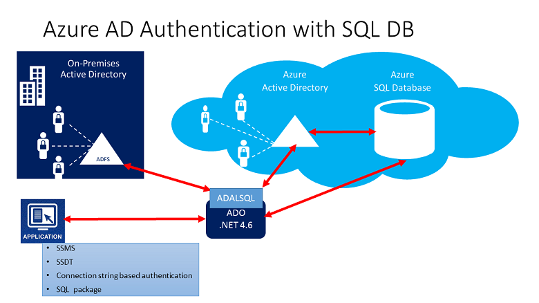
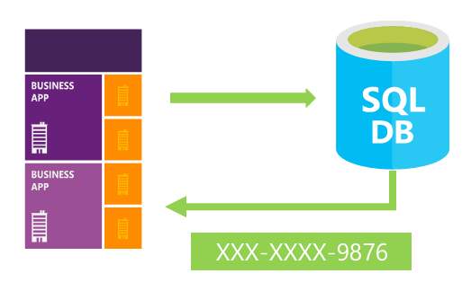

---

title: Azure database security overview| Microsoft Docs
description: This article provides an overview of the Azure database security features.
services: security
documentationcenter: na
author: UnifyCloud
manager: barbkess
editor: TomSh

ms.assetid: 
ms.service: security
ms.devlang: na
ms.topic: article
ms.tgt_pltfrm: na
ms.workload: na
ms.date: 10/30/2018
ms.author: TomSh

---

# Azure database security overview

Security is a top concern for managing databases, and it has always been a priority for Azure SQL Database. Azure SQL Database supports connection security with firewall rules and connection encryption. It supports authentication with username and password and Azure Active Directory (Azure AD) authentication, which uses identities managed by Azure Active Directory. Authorization uses role-based access control.

Azure SQL Database supports encryption by performing real-time encryption and decryption of databases, associated backups, and transaction log files at rest without requiring changes to the application.

Microsoft provides additional ways to encrypt enterprise data:

-	Cell-level encryption is available to encrypt specific columns or even cells of data with different encryption keys.
-	If you need a hardware security module or central management of your encryption key hierarchy, consider using Azure Key Vault with SQL Server in an Azure virtual machine (VM).
-	Always Encrypted (currently in preview) makes encryption transparent to applications. It also allows clients to encrypt sensitive data inside client applications without sharing the encryption keys with SQL Database.

Azure SQL Database Auditing enables enterprises to record events to an audit log in Azure Storage. SQL Database Auditing also integrates with Microsoft Power BI to facilitate drill-down reports and analyses.

Azure SQL databases can be tightly secured to satisfy most regulatory or security requirements, including HIPAA, ISO 27001/27002, and PCI DSS Level 1. A current list of security compliance certifications is available at the [Microsoft Azure Trust Center site](https://azure.microsoft.com/support/trust-center/services/).

This article walks through the basics of securing Microsoft Azure SQL databases for structured, tabular, and relational data. In particular, this article will get you started with resources for protecting data, controlling access, and proactive monitoring.

## Protection of data

SQL Database helps secure your data by providing encryption:

- For data in motion through [Transport Layer Security (TLS)](https://support.microsoft.com/kb/3135244).
- For data at rest through [transparent data encryption](https://go.microsoft.com/fwlink/?LinkId=526242).
- For data in use through [Always Encrypted](https://msdn.microsoft.com/library/mt163865.aspx).

For other ways to encrypt your data, consider:

-	[Cell-level encryption](https://msdn.microsoft.com/library/ms179331.aspx) to encrypt specific columns or even cells of data with different encryption keys.
-	[Azure Key Vault with SQL Server in an Azure VM](https://blogs.technet.com/b/kv/archive/2015/01/12/using-the-key-vault-for-sql-server-encryption.aspx), if you need a hardware security module or central management of your encryption key hierarchy.

### Encryption in motion

A common problem for all client/server applications is the need for privacy as data moves over public and private networks. If data moving over a network is not encrypted, there’s a chance that it can be captured and stolen by unauthorized users. When you're dealing with database services, make sure that data is encrypted between the database client and server. Also make sure that data is encrypted between database servers that communicate with each other and with middle-tier applications.

One problem when you administer a network is securing data that's being sent between applications across an untrusted network. You can use [TLS/SSL](https://docs.microsoft.com/windows-server/security/tls/transport-layer-security-protocol) to authenticate servers and clients, and then use it to encrypt messages between the authenticated parties.

In the authentication process, a TLS/SSL client sends a message to a TLS/SSL server. The server responds with the information that the server needs to authenticate itself. The client and server perform an additional exchange of session keys, and the authentication dialog ends. When authentication is completed, SSL-secured communication can begin between the server and the client through the symmetric encryption keys that are established during the authentication process.

All connections to Azure SQL Database require encryption (TLS/SSL) at all times while data is "in transit" to and from the database. SQL Database uses TLS/SSL to authenticate servers and clients and then use it to encrypt messages between the authenticated parties. 

In your application's connection string, you must specify parameters to encrypt the connection and not to trust the server certificate. (This is done for you if you copy your connection string out of the Azure portal.) Otherwise, the connection will not verify the identity of the server and will be susceptible to "man-in-the-middle" attacks. For the ADO.NET driver, for instance, these connection string parameters are `Encrypt=True` and `TrustServerCertificate=False`.

### Encryption at rest

You can take several precautions to help secure the database. For example, design a secure system, encrypt confidential assets, and build a firewall around the database servers. But in a scenario where the physical media (such as drives or backup tapes) are stolen, a malicious party can just restore or attach the database and browse the data.

One solution is to encrypt the sensitive data in the database and protect the keys that are used to encrypt the data with a certificate. This solution prevents anyone without the keys from using the data, but this kind of protection must be planned.

To solve this problem, SQL Server and SQL Database support [transparent data encryption](https://docs.microsoft.com/sql/relational-databases/security/encryption/transparent-data-encryption-azure-sql?view=azuresqldb-current&viewFallbackFrom=sql-server-2017). Transparent data encryption encrypts SQL Server and SQL Database data files, known as encryption data at rest.

Transparent data encryption helps protect against the threat of malicious activity. It performs real-time encryption and decryption of the database, associated backups, and transaction log files at rest without requiring changes to the application.  

Transparent data encryption encrypts the storage of an entire database by using a symmetric key called the database encryption key. In SQL Database, the database encryption key is protected by a built-in server certificate. The built-in server certificate is unique for each SQL Database server.

If a database is in a Geo-DR relationship, it's protected by a different key on each server. If two databases are connected to the same server, they share the same built-in certificate. Microsoft automatically rotates these certificates at least every 90 days. 

For more information, see [Transparent data encryption](https://docs.microsoft.com/sql/relational-databases/security/encryption/transparent-data-encryption-tde).

### Encryption in use (client)

Most data breaches involve the theft of critical data such as credit card numbers or personally identifiable information. Databases can be treasure troves of sensitive information. They can contain customers' personal data (like national identification numbers), confidential competitive information, and intellectual property. Lost or stolen data, especially customer data, can result in brand damage, competitive disadvantage, and serious fines--even lawsuits.

[Always Encrypted](https://msdn.microsoft.com/library/mt163865.aspx) is a feature designed to protect sensitive data stored in Azure SQL Database or SQL Server databases. Always Encrypted allows clients to encrypt sensitive data inside client applications and never reveal the encryption keys to the database engine (SQL Database or SQL Server).

Always Encrypted provides a separation between people who own the data (and can view it) and people who manage the data (but should have no access). It helps ensure that on-premises database administrators, cloud database operators, or other high-privileged but unauthorized users cannot access the encrypted data.

In addition, Always Encrypted makes encryption transparent to applications. An Always Encrypted-enabled driver is installed on the client computer so that it can automatically encrypt and decrypt sensitive data in the client application. The driver encrypts the data in sensitive columns before passing the data to the database engine. The driver automatically rewrites queries so that the semantics to the application are preserved. Similarly, the driver transparently decrypts data, stored in encrypted database columns, contained in query results.

## Access control

To provide security, SQL Database controls access by using:

- Firewall rules that limit connectivity by IP address.
- Authentication mechanisms that require users to prove their identity.
- Authorization mechanisms that limit users to specific actions and data.

### Database access

Data protection begins with controlling access to your data. The datacenter that hosts your data manages physical access. You can configure a firewall to manage security at the network layer. You also control access by configuring logins for authentication and defining permissions for server and database roles.

#### Firewall and firewall rules

[Azure SQL Database](https://azure.microsoft.com/services/sql-database/) provides a relational database service for Azure and other internet-based applications. To help protect your data, firewalls prevent all access to your database server until you specify which computers have permission. The firewall grants access to databases based on the originating IP address of each request. For more information, see [Overview of Azure SQL Database firewall rules](https://docs.microsoft.com/azure/sql-database/sql-database-firewall-configure).

The Azure SQL Database service is available only through TCP port 1433. To access a SQL database from your computer, ensure that your client computer firewall allows outgoing TCP communication on TCP port 1433. If inbound connections are not needed for other applications, block them on TCP port 1433.

#### Authentication

Authentication refers to how you prove your identity when connecting to the database. SQL Database supports two types of authentication:

-	**SQL Server authentication**: A single login account is created when a logical SQL instance is created, called the SQL Database Subscriber Account. This account connects by using [SQL Server authentication](https://docs.microsoft.com/azure/sql-database/sql-database-security-overview) (username and password). This account is an administrator on the logical server instance and on all user databases attached to that instance. The permissions of the subscriber account cannot be restricted. Only one of these accounts can exist.
-	**Azure Active Directory authentication**: [Azure AD authentication](https://docs.microsoft.com/azure/sql-database/sql-database-aad-authentication) is a mechanism of connecting to Azure SQL Database and Azure SQL Data Warehouse by using identities in Azure AD. You can use it to centrally manage identities of database users.

 Advantages of Azure AD authentication include:
  -	It provides an alternative to SQL Server authentication.
  -	It helps stop the proliferation of user identities across database servers and allows password rotation in a single place.
  -	You can manage database permissions by using external (Azure AD) groups.
  -	It can eliminate storing passwords by enabling integrated Windows authentication and other forms of authentication that Azure AD supports.

#### Authorization

[Authorization](https://docs.microsoft.com/azure/sql-database/sql-database-manage-logins) refers to what a user can do within an Azure SQL database. It's controlled by your user account's database [role memberships](https://msdn.microsoft.com/library/ms189121) and [object-level permissions](https://msdn.microsoft.com/library/ms191291.aspx). Authorization is the process of determining which securable resources a principal can access, and which operations are allowed for those resources.

### Application access

#### Dynamic data masking

A service representative at a call center might identify callers by several digits of their social security number or credit card number. But those data items should not be fully exposed to the service representative.

You can define a masking rule that masks all but the last four digits of a social security number or credit card number in the result set of any query.

As another example, an appropriate data mask can be defined to protect personally identifiable information. A developer can then query production environments for troubleshooting purposes without violating compliance regulations.

[SQL Database dynamic data masking](https://docs.microsoft.com/azure/sql-database/sql-database-dynamic-data-masking-get-started) limits sensitive data exposure by masking it to non-privileged users. Dynamic data masking is supported for the V12 version of Azure SQL Database.

[Dynamic data masking](https://docs.microsoft.com/sql/relational-databases/security/dynamic-data-masking) helps prevent unauthorized access to sensitive data by enabling you to designate how much of the sensitive data to reveal with minimal impact on the application layer. It’s a policy-based security feature that hides the sensitive data in the result set of a query over designated database fields, while the data in the database is not changed.

> [!Note]
> Dynamic data masking can be configured by the Azure Database admin, server admin, or security officer roles.

#### Row-Level Security

Another common security requirement for multitenant databases is [Row-Level Security](https://msdn.microsoft.com/library/dn765131.aspx). You can use this feature to control access to rows in a database table based on the characteristics of the user who's executing a query. (Example characteristics are group membership and execution context.)

The access restriction logic is located in the database tier rather than away from the data in another application tier. The database system applies the access restrictions every time that data access is attempted from any tier. This makes your security system more reliable and robust by reducing the surface area of your security system.

Row-Level Security introduces predicate-based access control. It features a flexible, centralized evaluation that can take into consideration metadata or any other criteria the administrator determines as appropriate. The predicate is used as a criterion to determine whether or not the user has the appropriate access to the data based on user attributes. You can implement label-based access control by using predicate-based access control.

## Proactive monitoring

SQL Database helps secure your data by providing *auditing* and *threat detection* capabilities.

### Auditing

[Azure SQL Database auditing](https://docs.microsoft.com/azure/sql-database/sql-database-auditing-get-started) increases your ability to gain insight into events and changes that occur within the database. Examples are updates and queries against the data.

SQL Database auditing tracks database events and writes them to an audit log in your Azure storage account. Auditing can help you maintain regulatory compliance, understand database activity, and gain insight into discrepancies and anomalies that might indicate business concerns or suspected security violations. Auditing enables and facilitates adherence to compliance standards but doesn't guarantee compliance.

You can use SQL Database auditing to:

- **Retain** an audit trail of selected events. You can define categories of database actions to be audited.
- **Report** on database activity. You can use pre-configured reports and a dashboard to get started quickly with activity and event reporting.
- **Analyze** reports. You can find suspicious events, unusual activity, and trends.

There are two auditing methods:

-	**Blob auditing**: Logs are written to Azure Blob storage. This is a newer auditing method. It provides higher performance, supports higher granularity object-level auditing, and is more cost effective.
-	**Table auditing**: Logs are written to Azure Table storage.

### Threat detection

[Advanced Threat Protection for Azure SQL Database](https://docs.microsoft.com/azure/sql-database/sql-advanced-threat-protection) detects suspicious activities that indicate potential security threats. You can use threat detection to respond to suspicious events in the database, such as SQL injections, as they occur. It provides alerts and allows the use of Azure SQL Database auditing to explore the suspicious events.

SQL Advanced Threat Protection (ATP) provides a set of advanced SQL security capabilities, including Data Discovery & Classification, Vulnerability Assessment, and Threat Detection. 

- [Data Discovery & Classification](../sql-database/sql-database-data-discovery-and-classification.md)
- [Vulnerability Assessment](../sql-database/sql-vulnerability-assessment.md)  
- [Threat Detection](../sql-database/sql-database-threat-detection.md)

[Azure Database for PostgreSQL Advanced Threat Protection](../postgresql/concepts-data-access-and-security-threat-protection.md) provides a new layer of security, which enables you to detect and respond to potential threats as they occur by providing security alerts on anomalous activities. Users receive an alert upon suspicious database activities, and potential vulnerabilities, as well as anomalous database access and queries patterns. Advanced Threat Protection for Azure Database for PostgreSQL integrates alerts with Azure Security Center. Type of alerts include:

- Access from unusual location
- Access from unusual Azure data center 
- Access from unfamiliar principal 
- Access from a potentially harmful application 
- Brute force Azure database for PostgreSQL credentials 

[Azure Database for MySQL Advanced Threat Protection](../mysql/concepts-data-access-and-security-threat-protection.md) provides protection similar to PostgreSQL Advanced Protection.  

## Centralized security management

[Azure Security Center](https://azure.microsoft.com/documentation/services/security-center/) helps you prevent, detect, and respond to threats. It provides integrated security monitoring and policy management across your Azure subscriptions. It helps detect threats that might otherwise go unnoticed, and it works with a broad ecosystem of security solutions.

[Security Center](https://docs.microsoft.com/azure/security-center/security-center-sql-database) helps you safeguard data in SQL Database by providing visibility into the security of all your servers and databases. With Security Center, you can:

- Define policies for SQL Database encryption and auditing.
- Monitor the security of SQL Database resources across all your subscriptions.
- Quickly identify and remediate security issues.
- Integrate alerts from [Azure SQL Database threat detection](https://docs.microsoft.com/azure/sql-database/sql-database-threat-detection).

Security Center supports role-based access.

## SQL Information Protection

[SQL Information Protection](../sql-database/sql-database-data-discovery-and-classification.md) automatically discovers and classifies potentially sensitive data, provides a labeling mechanism for persistently tagging sensitive data with classification attributes, and provides a detailed dashboard showing the classification state of the database.  

In addition, it calculates the result set sensitivity of SQL queries, so that queries that extract sensitive data can be explicitly audited, and the data can be protected. For more details on SQL Information Protection, see Azure SQL Database Data Discovery and Classification.

You can configure [SQL Information Protection policies](../security-center/security-center-info-protection-policy.md) in Azure Security Center.

## Azure Marketplace

The Azure Marketplace is an online applications and services marketplace that enables start-ups and independent software vendors (ISVs) to offer their solutions to Azure customers around the world.
The Azure Marketplace combines Microsoft Azure partner ecosystems into a unified platform to better serve customers and partners. You can [run a search](https://azuremarketplace.microsoft.com/marketplace/apps?search=Database%20Security&page=1) to view database security products available in the Azure Marketplace.

## Next steps

- [Secure your Azure SQL database](https://docs.microsoft.com/azure/sql-database/sql-database-security-tutorial)
- [Azure Security Center and Azure SQL Database service](https://docs.microsoft.com/azure/security-center/security-center-sql-database)
- [SQL Database threat detection](https://docs.microsoft.com/azure/sql-database/sql-database-threat-detection)
- [Improve SQL database performance](https://docs.microsoft.com/azure/sql-database/sql-database-performance-tutorial)
