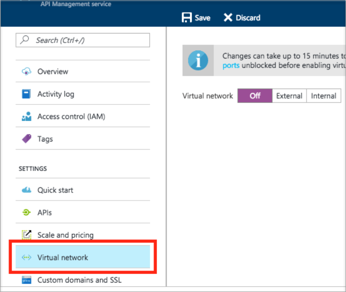

---

title: Azure DDoS Protection Best Practices & Reference Architecture | Microsoft Docs
description: Learn about how you can use logging data to gain deep insights about your application.
services: security
author: barclayn
manager: mbaldwin
editor: TomSh

ms.assetid: 
ms.service: security
ms.devlang: na
ms.topic: article
ms.tgt_pltfrm: na
ms.workload: na
ms.date: 04/16/2018
ms.author: barclayn

---
# Azure DDoS Protection: Best Practices & Reference Architecture

This document is targeted at IT decision makers and security personnel. Familiarity with Azure, networking, and security are expected.

Designing for distributed denial of service (DDoS) resiliency requires planning and designing for a variety of failure modes. This document provides best practices for designing applications in Azure for resiliency against DDoS attacks.

## Types of attacks

DDoS is a type of attack used in an effort to exhaust application resources. The goal is to affect the application’s availability and ability to handle legitimate requests. Attacks are becoming more sophisticated and larger in size and impact. DDoS attacks can be targeted at any endpoint that is publicly reachable through the Internet.

Azure provides continuous protection against DDoS attacks. This protection is integrated into the Azure platform by default and at no additional cost. In addition to the core DDoS protection provided in the platform, we also have a new offering named “[Azure DDoS Protection Standard](https://azure.microsoft.com/services/ddos-protection/)”, which provides advanced DDoS mitigation capabilities against network attacks and is automatically tuned to protect your specific Azure resources. Protection is simple to enable during the creation of new virtual networks. It can also be done after initial creation and requires no application or resource changes.

DDoS attacks can be broadly classified into three (3) different categories

### Volumetric attacks

Volumetric attacks are the most common types of DDoS attack. Volumetric attacks are brute-force assaults that target the network and transport layers. They attempt to exhaust resources such network links. These attacks commonly use multiple infected systems to flood the network layers with a substantial amount of seemingly legitimate traffic. Different network layer protocols such as Internet Control Message Protocol (ICMP), User Datagram Protocol (UDP) and Transmission Control Protocol (TCP) are used in this type of attack.

The most commonly used network layer DDoS attacks are TCP SYN flooding, ICMP echo, UDP flooding, DNS, and NTP amplification attack. This type of attack can be used not only to disrupt service, but also as a smokescreen for more nefarious and targeted network intrusion. An example of a recent volumetric attack is the [Memcached exploit](https://www.wired.com/story/github-ddos-memcached/) that impacted GitHub. This attack targeted UDP port 11211 and generated 1.35 Tb/s of attack volume.

### Protocol attacks

Protocol attacks target application protocols. They try to use up all the available resources in infrastructure devices such as firewalls, application servers & load balancers. Protocol attacks use packets that are malformed or contain protocol abnormalities. These attacks operate by sending larger numbers of open requests, servers and other communication devices answer and wait for a packet response. The target attempts to respond to the open requests eventually causing the targeted system to crash.

The most common example of a protocol-based DDoS attack is TCP SYN Flood. In this attack, a succession of TCP SYN requests is directed towards a target and can be used to overwhelm it. The goal is to make the target unresponsive. The 2016 Dyn outage, apart from being an application-layer attack also consisted of TCP SYN floods targeting port 53 of Dyn’s DNS servers.

### Resource attacks

Resource attacks target the application layer. They trigger back-end processes in an effort to overwhelm the target system. Resource attacks abuse traffic that looks normal but that carries CPU-intensive queries to the server. The volume of traffic needed to exhaust resources is comparatively lower than that of the other type of attacks. The traffic in a resource attack is indistinguishable from legitimate traffic, making it difficult to detect. The most common resource attacks are on HTTP/HTTPS and DNS services.

## Shared responsibility in the cloud

A defense in-depth strategy is required to combat the increasing types and  sophistication of attacks. Security is a shared responsibility between the customer and Microsoft. Microsoft refers to this as a [shared responsibility model](https://azure.microsoft.com/blog/microsoft-incident-response-and-shared-responsibility-for-cloud-computing/). 
The figure below shows this division of responsibility.

Azure Customers benefit from reviewing our best practices and building globally distributed applications designed and tested for failure.

## Fundamental Best Practices 

DDoS attacks are and on the rise. The following section provides prescriptive guidance to build DDoS resilient services on Azure.

### Design for security

Customers should ensure security is a priority throughout the entire lifecycle of an application, from design and implementation to deployment and operations. Applications can have bugs that allow a relatively low volume of crafted requests to use an inordinate amount of resources,  resulting in a service outage. To protect a service running on Microsoft Azure, customers should have a good understanding of their application architecture and must focus on the [5 pillars of software quality](https://docs.microsoft.com/azure/architecture/guide/pillars).
Customers should know typical traffic volumes, the connectivity model between the application and other applications, and the service endpoints exposed to the public Internet.

Additionally, ensuring an application is resilient enough to handle a denial of service targeted at the application itself is of paramount importance. Security and privacy are built right into the Azure platform, beginning with the [Security Development Lifecycle (SDL)](https://www.microsoft.com/sdl/default.aspx). The SDL addresses security at every development phase and ensures that Azure is continually updated to make it even more secure.

### Design for scalability

Scalability is the ability of a system to handle increased load. Customers must design their applications to [scale horizontally](https://docs.microsoft.com/azure/architecture/guide/design-principles/scale-out) to meet the demand of amplified load, specifically in an event of DDoS attack. If your application depends on a single instance of a service, it creates a single point of failure. Provisioning multiple instances improves both resiliency and scalability.

For [Azure App Service](../app-service/app-service-value-prop-what-is.md), select an [App Service Plan](../app-service/azure-web-sites-web-hosting-plans-in-depth-overview.md) that offers multiple instances. For Azure Cloud Services, configure each of your roles to use [multiple instances](../cloud-services/cloud-services-choose-me.md). 
For [Azure Virtual Machines (VMs)](https://docs.microsoft.com/azure/virtual-machines/virtual-machines-windows-about/?toc=%2fazure%2fvirtual-machines%2fwindows%2ftoc.json), ensure that your VM architecture includes more than one VM and that each VM is
included in an [availability set](../virtual-machines/virtual-machines-windows-manage-availability.md). We recommend using [Virtual machine Scale Sets](../virtual-machine-scale-sets/virtual-machine-scale-sets-overview.md)
for autoscaling capabilities.

### Defense in depth

The idea behind defense in depth is to manage risk with diverse defensive strategies. Layering security defenses in an application reduces the chance of a successful attack. We recommend that customers implement secure designs for their applications via the built-in capabilities of the Azure platform.

For example, the risk of attack increases with the size or surface area of the application. Surface area reduction is recommended through whitelisting to close down the exposed IP address space & listening ports that are not needed on the load balancers ([ALB](../load-balancer/load-balancer-get-started-internet-portal.md)/[App Gateway](../application-gateway/application-gateway-create-probe-porta.md)) or via [Network Security Groups (NSG).](../virtual-network/virtual-networks-nsg.md)
You can use [service tags](/virtual-network/security-overview.md) and [application security groups](/virtual-network/security-overview.md) to minimize complexity for security rule creation and configure network security as a natural extension of an application’s structure.

Customers should deploy Azure services in a [virtual network](../virtual-network/virtual-networks-overview.md) whenever possible. This allows service resources to communicate through private IP addresses. Azure service traffic from a virtual network uses public IP addresses as source IP addresses by default. Using [service endpoints](../virtual-network/virtual-network-service-endpoints-overview.md) will switch service traffic to use virtual network private addresses as the source IP addresses when accessing the Azure service from a virtual network.

We often see customer’s on-premises resources getting attacked alongside their resources in Azure. If you are connecting an on-premises environment to Azure, we recommend that you minimize exposure of on-premises resources to the public Internet. You can use the scale and advanced DDoS Protection capabilities of Azure by deploying your well-known public entities in Azure. Since these publicly accessible entities are often a target for DDoS attacks, putting them in Azure reduces the impact on your on-premises resources.

## Azure DDoS protection

Azure has two DDoS service offerings that provide protection from Network attacks (Layer 3 & 4) -DDoS basic protection and DDoS standard protection. 

### Azure DDoS basic protection 

Basic protection is integrated into the Azure by default at no additional cost. The full scale and capacity of Azure’s globally deployed network provides defense against common network layer attacks through always on traffic monitoring and real-time mitigation. DDoS Basic protection requires no user configuration or application changes. All Azure services including PaaS services like Azure DNS are protected by DDoS Basic Protection.

Azure’s basic DDoS protection consists of both software and hardware components. A software control plane decides when, where, and what type of traffic should be steered through hardware appliances that analyze and remove attack traffic. The control plane makes this decision based on an infrastructure-wide DDoS Protection *policy*, which is statically set and universally applied to all Azure customers.

For example, the DDoS Protection policy specifies at what traffic volume the protection should be *triggered* (that is, the tenant’s traffic should be routed through scrubbing appliances), and subsequently, how the scrubbing appliances should *mitigate* the attack.

Azure’s DDoS Protection Basic service is targeted at infrastructure protection and protection of the Azure platform. It mitigates traffic when it exceeds a rate that is so significant that it may impact multiple customers in a multi-tenant environment. It doesn’t provide alerting or per-customer customized policies.

### Azure DDoS standard protection

Standard protection provides enhanced DDoS mitigation features and is automatically tuned to protect your specific Azure resources in a Virtual Network. Protection is simple to enable on any new or existing Virtual Network and requires no application or resource changes. It has several advantages over the basic service including logging, alerting, and telemetry. Outlined below are the key differentiators of Azure DDoS Protection Standard service.

#### Adaptive realtime tuning

Azure DDoS Protection Basic service helps protect customers but only protects them to prevent impacting other customers. For example, if a service is provisioned for a typical volume of legitimate incoming traffic that is smaller than the *trigger rate* of the infrastructure-wide DDoS protection policy, a DDoS attack on that customer’s resources may go unnoticed. More generally, the complex nature of recent attacks (for example, multi-vector DDoS) as well as the application-specific behaviors of tenants call for per-customer, customized protection policies.
This is accomplished using two insights:

1. Automatic learning of per-customer (per-IP) layer 3/4 traffic patterns, and
2. Minimizing false positives given that Azure’s scale allows it to absorb significant amount of traffic.

#### DDoS protection telemetry, monitoring & alerting

With DDoS Protection Standard, we expose rich telemetry via [Azure Monitor](/monitoring-and-diagnostics/monitoring-overview-azure-monitor.md) during the duration of a DDoS attack. Alerting can be configured for any of the Azure Monitor metrics exposed by DDoS Protection. Logging can be integrated with Splunk (Azure Event Hubs), Azure Log Analytics, and Azure Storage for advanced analysis via the Azure Monitor Diagnostics interface.

##### DDoS mitigation policies

In the Azure portal, click **Monitor** \> **Metrics**. On the **Metrics** screen, select the resource group, resource type of Public IP Address, and your Azure public IP address. DDoS metrics will be visible under the available metrics pane.

DDoS Protection Standard applies **three autotuned mitigation policies (TCP SYN, TCP & UDP)** for each public IP of the protected resource, in the VNET that has DDoS enabled. You can view the policy thresholds by selecting the metric **‘Inbound packets to trigger DDoS mitigation’**.

The policy thresholds are autoconfigured via our machine learning based network traffic profiling. DDoS mitigation occurs for an IP address under attack only when the policy threshold is exceeded.

##### Under DDoS attack

If the public IP address is under attack, the metric ‘under DDoS attack or not’ value toggles to 1 as we perform mitigation on the attack traffic.

We recommend configuring an alert on this metric, to be notified when there’s an active DDoS mitigation performed on your public IP address.

For more information, see [Manage Azure DDoS Protection Standard using the Azure portal](../virtual-network/ddos-protection-manage-portal.md).

#### Resource attacks

Specific to resource attacks at the application layer, customers should configure Web Application Firewall (WAF ) to help secure web applications. WAF inspects inbound web traffic to block SQL injections, Cross-Site Scripting, DDoS, and other layer 7 attacks. Azure provides [WAF as a feature of Application Gateway](../application-gateway/application-gateway-web-application-firewall-overview.md) for centralized protection of your web applications from common exploits and vulnerabilities. There are varieties of WAF offerings available from Azure partners that might be more suitable for your needs via the [Azure marketplace](https://azuremarketplace.microsoft.com/marketplace/apps?search=WAF&page=1).

Even Web Application Firewalls are susceptible to volumetric & state exhaustion attacks. We strongly recommend turning on DDoS Standard protection on the WAF Virtual Network to protect from volumetric & protocol attacks. For more information, see the reference architecture section.

### Protection planning

Planning and preparation are crucial to understand how a system will perform during a DDoS attack. This planning and preparation will also help you design an incident management response plan.

Customers should ensure that DDoS Protection Standard is enabled on the virtual network of internet facing endpoints. Configuring DDoS alerts helps keep a constant watchful eye on any potential attacks on your infrastructure. Customers should monitor their applications independently. They need to understand the normal behavior of the application. Steps must be taken if  the application is not behaving as expected during a DDoS attack.

#### DDoS Attacks Orchestration

It’s a good practice to test your assumptions about how your services respond to an attack, even before it happens by conducting periodic simulations. During testing, validate that continue to function as expected and there’s no disruption to the end-user experience. Identify gaps from both a technology & process standpoint and incorporate in the DDoS response strategy. A general recommendation is to perform such tests in staging environments or during non-peak hours to minimize impact to production environment.

We have partnered with [BreakingPoint Cloud](https://www.ixiacom.com/products/breakingpoint-cloud) to build an interface where Azure customers can generate traffic against DDoS Protection enabled public endpoints for simulations. [BreakPoint Cloud](https://www.ixiacom.com/products/breakingpoint-cloud) simulation will allow you to:

- Validate how Microsoft Azure DDoS Protection protects your Azure resources from DDoS attacks

- Optimize your incident response process while under DDoS attack

- Document DDoS compliance

- Train your network security teams

Cybersecurity is a relentless battle requiring constant innovation in defense. Azure’s DDoS Standard protection is a state of the art offering tstate-of-the-artstomers with an effective solution to mitigate increasingly complex DDoS attacks.

## Components of a DDoS response strategy

In most of the cases when a DDoS attack is targeted at your Azure resources, there’s minimal intervention required from an end-user standpoint. Still, incorporating DDoS mitigation as part of the organization’s incident response strategy will ensure minimal impact to the business continuity.

### Microsoft threat intelligence

Microsoft has an extensive threat intelligence network that uses the collective knowledge of an extended security community that supports Microsoft’s online services, Microsoft partners, and relationships within the Internet security community. As a critical infrastructure provider, Microsoft receives early warnings about threats, takes threat intelligence learned from other Microsoft online services and from Microsoft’s global customer base. All of Microsoft’s threat intelligence is incorporated back into its Azure DDoS Protection products.

In addition to this, Microsoft’s Digital Crimes Unit (DCU) performs offensive strategies against botnets, a common source of command and control for DDoS attacks.

### Perform a risk evaluation of your Azure resources

it’s imperative to understand the scope of your risk from a DDoS attack on an ongoing basis. Customers should periodically ask themselves: What new publicly available Azure resources need protection? Is there single point of failures in the service? How can services be isolated to limit the impact of an attack while still making services available to valid customers? Are there virtual networks where DDoS Protection Standard should be enabled, but is not? Are my services active/active with failover across multiple regions?

### Customer DDoS response team

Creating a DDoS response team is a key step in ensuring effective and fast response to an attack. Customers must identify various contacts in your organization who will oversee both planning and execution. The DDoS Response Team should have thorough understanding of the Azure DDoS Protection Standard service and should be apt in identifying & mitigating an attack to coordinating with various internal & external customers, including Microsoft support team as needed.

Microsoft recommends incorporating DDoS Response Team planning and simulation exercises, including scale testing, as a normal part of your service availability and continuity planning. 

### During an attack

Azure DDoS Protection Standard will identify and mitigate DDoS attacks without any user intervention. To get notified when there’s an active mitigation for a protected public IP, you can [configure an alert](../virtual-network/ddos-protection-manage-portal.md) on the metric “under DDoS attack or not”. You can further review and create alerts as desired for the other DDoS metrics to understand the scale of the attack, traffic being dropped, etc.

#### When to contact Microsoft Support

- If during a DDoS attack you find that the performance of the protected resource is severely degraded, or the resource is not available.

- If you think the DDoS Protection service is not behaving as expected. DDoS Protection service will only initiate mitigation if the below criteria is met:

    - The metric value ‘Policy to trigger DDoS mitigation (TCP/TCP SYN/UDP) is lower than the traffic received on the protected Public IP resource.

- If you know, you are going to have a planned viral event that will lead to significant increase in your network traffic.

- If an actor has threatened to launch a DDoS attack against your resources.

For critical business impacting issues, create a severity-A [support ticket](https://ms.portal.azure.com/#blade/Microsoft_Azure_Support/HelpAndSupportBlade/newsupportrequest).

### Post attack steps

It’s always a good strategy to do a postmortem after an attack and readjust the DDoS response strategy as needed. Things to consider:

- Was there any disruption to the service or end-user experience due to lack of scalable architecture?

- Which applications or services suffered the most?

- How effective was the DDoS response strategy and how could it be improved further?

If you suspect you are under a DDoS attack please escalate through your normal Azure Support channels.

## DDoS protection reference architectures

DDoS Protection Standard is designed [for services that are deployed in a Virtual Network.](../virtual-network/virtual-network-for-azure-services.md) For other services, the default DDoS Basic Protection will apply. The specific
reference architectures outlined below are arranged by scenarios, with architecture patterns grouped together.

### Virtual machine (Windows/Linux) workloads

#### Application running on load balanced VMs

This reference architecture shows a set of proven practices for running multiple Windows virtual machines (VMs) in a scale set behind a load balancer, to improve availability and scalability. This architecture can be used for any stateless workload, such as a web server.

In this architecture, a workload is distributed across multiple VM instances. There is a single public IP address, and Internet traffic is distributed to the VMs using a load balancer. DDoS Protection Standard is enabled on the Virtual Network of the Azure (internet) load balancer that has the public IP associated with it.

The load balancer distributes incoming Internet requests to the VM instances. VM scale sets allow the number of VMs to be scaled in or out manually, or automatically based on predefined rules. This is important if the resource is under DDoS attack. Refer to this
[article](https://docs.microsoft.com/azure/architecture/reference-architectures/virtual-machines-windows/multi-vm), for more information on this reference architecture.

#### Applications running on Windows N-tier

There are many ways to implement an N-tier architecture. The diagram shows a typical 3-tier web application. This architecture builds on [Run load-balanced VMs for scalability and availability](https://docs.microsoft.com/azure/architecture/reference-architectures/virtual-machines-windows/multi-vm). The web and business tiers use load-balanced VMs.

In the above architecture, DDoS Protection Standard is enabled on the Virtual Network. All public IPs in the Virtual Network will get Layer3/Layer4 DDoS Protection. For Layer 7 protection, Application Gateway in WAF SKU should be deployed. Refer to 
[this](https://docs.microsoft.com/azure/architecture/reference-architectures/virtual-machines-windows/n-tier) article, for more information on this reference architecture.

#### PaaS web application

This reference architecture shows running an Azure App Service application in a single region. This architecture shows set of proven practices for a web application that uses  [Azure App Service](https://azure.microsoft.com/documentation/services/app-service/) and [Azure SQL Database](https://azure.microsoft.com/documentation/services/sql-database/).
 Standby region is set up for failover scenarios.

Traffic Manager routes incoming requests to Application Gateway in one of the regions. During normal operations, it routes requests to the Application Gateway in active region. If that region becomes unavailable, Traffic Manager fails over to the Application Gateway in Standby region.

All the traffic from Internet destined to the web application is routed to the [Application Gateway public IP  address](https://docs.microsoft.com/azure/application-gateway/application-gateway-web-app-overview) via the Traffic Manager. In this scenario, the app service (web apps) itself is not directly externally facing and is protected by Application Gateway. It is recommended to configure Application Gateway WAF SKU (prevent mode) to protect against Layer 7(HTTP/HTTPS/Web Socket) attacks. Additionally, the Web apps are configured to [accept traffic only from the Application
Gateway](https://azure.microsoft.com/blog/ip-and-domain-restrictions-for-windows-azure-web-sites/) IP address.

Refer to [this](https://docs.microsoft.com/azure/architecture/reference-architectures/app-service-web-app/multi-region) article, for more information on this reference architecture.

### Mitigation for non-web PaaS services

#### HDInsight on Azure

This reference architecture shows configuring DDoS Protection Std. for [HDInsight cluster](../hdinsight/) on Azure. You need to make sure that HDInsight cluster is linked to a virtual network and DDoS Protection is enabled on that Virtual Network.

In this architecture, the traffic destined to the HDInsight cluster from the internet is routed to the public IP associated with the HDInsight gateway load balancer. The gateway load balancer then sends the traffic to the head nodes or the worker nodes directly. Given DDoS Protection Standard is enabled on the HDInsight Virtual Network, all public IPs in the Virtual Network will get Layer3/Layer4 DDoS Protection. The above reference architecture can be combined with N-Tier/Multi-Region reference architectures.

For more details on this reference architecture, refer to [Extend Azure HDInsight using an Azure Virtual Network](https://docs.microsoft.com/azure/hdinsight/hdinsight-extend-hadoop-virtual-network?toc=%2fazure%2fvirtual-network%2ftoc.json)
documentation.

### Azure API management

This reference architecture protects the public endpoint of the [API management](../api-management/api-management-key-concepts.md) resource publishing APIs to customers external to the organization. APIM should
be deployed in an external Virtual Network to enable DDoS protection.

By configuring the external Virtual Network, API Management gateway & developer portal are accessible from the public internet via a public load balancer. In this architecture, DDoS Protection Standard is enabled on the APIM Virtual Network external Virtual Network. Traffic is routed from the internet to the public IP address of the APIM, which is protected against Layer3/Layer4 network attacks. To protect against Layer 7 HTTP/HTTPs attacks, you can configure an Application Gateway in WAF mode.

List of additional services that are deployed in a Virtual Network and can be configured for DDoS Protection Standard is maintained [here](../virtual-network/virtual-network-for-azure-services.md). DDoS Protection Standard only supports ARM resources. *Injected Application Service Environment (ASE) deployment in a VNET with a public IP is not natively supported.* For details on protecting ASE environment, refer to this section.

## Additional information

* [Azure DDoS Protection Product page](https://azure.microsoft.com/services/ddos-protection/)

* [Azure DDoS Protection Blog](https://azure.microsoft.com/blog/azure-ddos-protection-service-preview/)

* [Azure DDoS Protection documentation ](../virtual-network/ddos-protection-overview.md)
