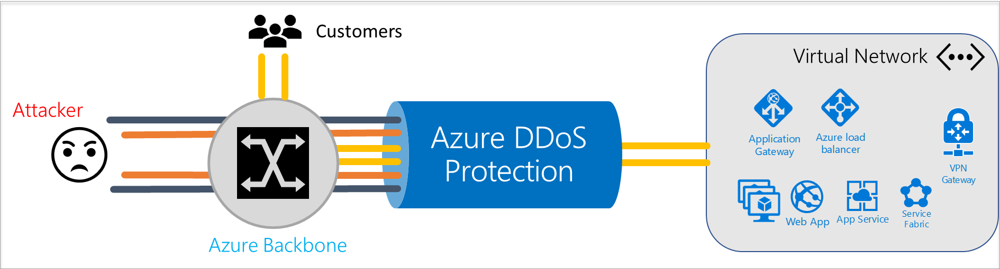
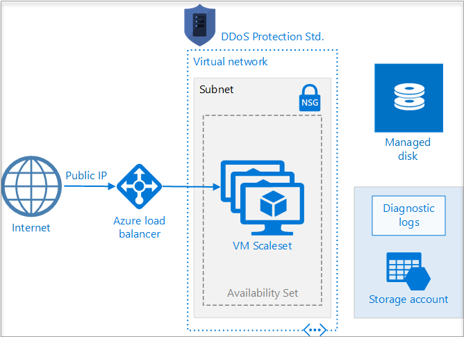
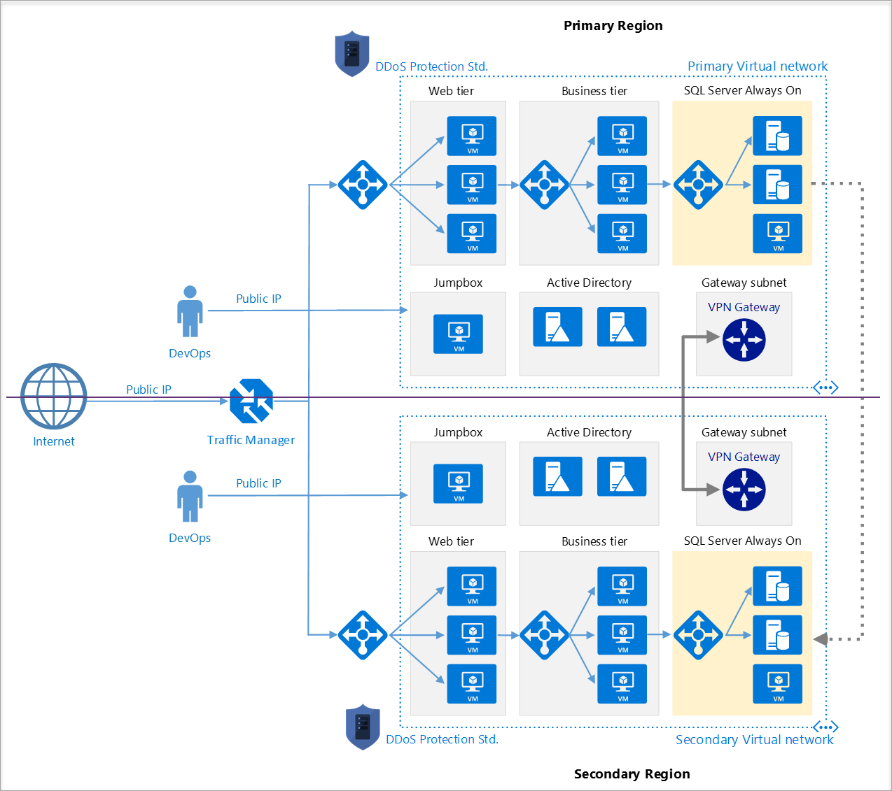
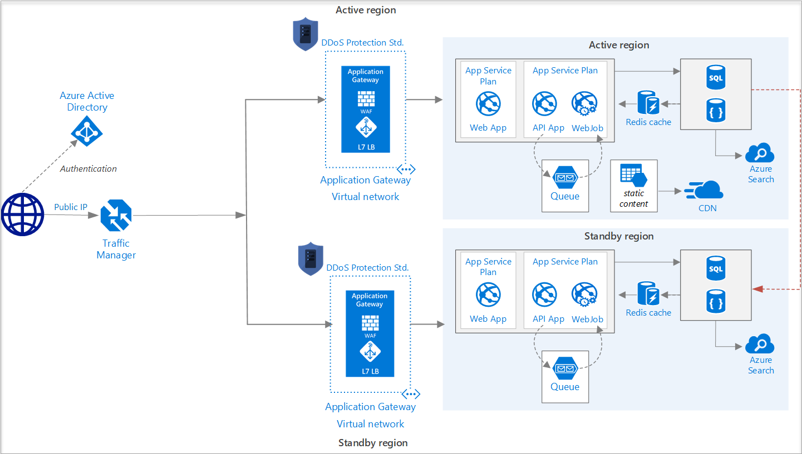

---

title: Azure DDoS Protection best practices and reference architectures | Microsoft Docs
description: Learn about how you can use logging data to gain deep insights about your application.
services: security
author: barclayn
manager: barbkess
editor: TomSh

ms.assetid: 
ms.service: security
ms.devlang: na
ms.topic: article
ms.tgt_pltfrm: na
ms.workload: na
ms.date: 06/06/2018
ms.author: barclayn

---
# Azure DDoS Protection: Best practices and reference architectures

This article is for IT decision makers and security personnel. It expects that you're familiar with Azure, networking, and security.

Designing for distributed denial of service (DDoS) resiliency requires planning and designing for a variety of failure modes. This article provides best practices for designing applications in Azure for resiliency against DDoS attacks.

## Types of attacks

DDoS is a type of attack that tries to exhaust application resources. The goal is to affect the application’s availability and its ability to handle legitimate requests. Attacks are becoming more sophisticated and larger in size and impact. DDoS attacks can be targeted at any endpoint that is publicly reachable through the internet.

Azure provides continuous protection against DDoS attacks. This protection is integrated into the Azure platform by default and at no extra cost. 

In addition to the core DDoS protection in the platform, [Azure DDoS Protection Standard](https://azure.microsoft.com/services/ddos-protection/) provides advanced DDoS mitigation capabilities against network attacks. It's automatically tuned to protect your specific Azure resources. Protection is simple to enable during the creation of new virtual networks. It can also be done after creation and requires no application or resource changes.

DDoS attacks can be classified into three categories: volumetric, protocol, and resource.

### Volumetric attacks

Volumetric attacks are the most common type of DDoS attack. Volumetric attacks are brute-force assaults that target the network and transport layers. They try to exhaust resources like network links. 

These attacks often use multiple infected systems to flood the network layers with seemingly legitimate traffic. They use network-layer protocols such as Internet Control Message Protocol (ICMP), User Datagram Protocol (UDP), and Transmission Control Protocol (TCP).

The most commonly used network-layer DDoS attacks are TCP SYN flooding, ICMP echo, UDP flooding, DNS, and NTP amplification attacks. This type of attack can be used not only to disrupt service, but also as a smokescreen for more nefarious and targeted network intrusion. An example of a recent volumetric attack is the [Memcached exploit](https://www.wired.com/story/github-ddos-memcached/) that affected GitHub. This attack targeted UDP port 11211 and generated 1.35 Tb/s of attack volume.

### Protocol attacks

Protocol attacks target application protocols. They try to use up all the available resources in infrastructure devices such as firewalls, application servers, and load balancers. Protocol attacks use packets that are malformed or contain protocol abnormalities. These attacks operate by sending large numbers of open requests that servers and other communication devices answer and wait for a packet response. The target tries to respond to the open requests, eventually causing the system to crash.

The most common example of a protocol-based DDoS attack is TCP SYN flood. In this attack, a succession of TCP SYN requests tries to overwhelm a target. The goal is to make the target unresponsive. The 2016 Dyn outage, apart from being an application-layer attack, consisted of TCP SYN floods that targeted port 53 of Dyn’s DNS servers.

### Resource attacks

Resource attacks target the application layer. They trigger back-end processes in an effort to overwhelm a system. Resource attacks abuse traffic that looks normal but that carries CPU-intensive queries to the server. The volume of traffic needed to exhaust resources is lower than that of the other type of attacks. The traffic in a resource attack is indistinguishable from legitimate traffic, making it hard to detect. The most common resource attacks are on HTTP/HTTPS and DNS services.

## Shared responsibility in the cloud

A defense-in-depth strategy helps combat the increasing variety and sophistication of attacks. Security is a shared responsibility between the customer and Microsoft. Microsoft calls this a [shared responsibility model](https://azure.microsoft.com/blog/microsoft-incident-response-and-shared-responsibility-for-cloud-computing/). 
The following figure shows this division of responsibility:

Azure customers benefit from reviewing Microsoft best practices and building globally distributed applications that are designed and tested for failure.

## Fundamental best practices

The following sections give prescriptive guidance to build DDoS-resilient services on Azure.

### Design for security

Ensure that security is a priority throughout the entire lifecycle of an application, from design and implementation to deployment and operations. Applications can have bugs that allow a relatively low volume of requests to use an inordinate amount of resources,  resulting in a service outage. 

To help protect a service running on Microsoft Azure, you should have a good understanding of your application architecture and focus on the [five pillars of software quality](https://docs.microsoft.com/azure/architecture/guide/pillars).
You should know typical traffic volumes, the connectivity model between the application and other applications, and the service endpoints that are exposed to the public internet.

Ensuring that an application is resilient enough to handle a denial of service that's targeted at the application itself is most important. Security and privacy are built into the Azure platform, beginning with the [Security Development Lifecycle (SDL)](https://www.microsoft.com/sdl/default.aspx). The SDL addresses security at every development phase and ensures that Azure is continually updated to make it even more secure.

### Design for scalability

Scalability is how well a system can handle increased load. You must design your applications to [scale horizontally](https://docs.microsoft.com/azure/architecture/guide/design-principles/scale-out) to meet the demand of an amplified load, specifically in the event of a DDoS attack. If your application depends on a single instance of a service, it creates a single point of failure. Provisioning multiple instances makes your system more resilient and more scalable.

For [Azure App Service](../app-service/app-service-value-prop-what-is.md), select an [App Service plan](../app-service/overview-hosting-plans.md) that offers multiple instances. For Azure Cloud Services, configure each of your roles to use [multiple instances](../cloud-services/cloud-services-choose-me.md). 
For [Azure Virtual Machines](https://docs.microsoft.com/azure/virtual-machines/virtual-machines-windows-about/?toc=%2fazure%2fvirtual-machines%2fwindows%2ftoc.json), ensure that your virtual machine (VM) architecture includes more than one VM and that each VM is
included in an [availability set](../virtual-machines/virtual-machines-windows-manage-availability.md). We recommend using [virtual machine scale sets](../virtual-machine-scale-sets/virtual-machine-scale-sets-overview.md)
for autoscaling capabilities.

### Defense in depth

The idea behind defense in depth is to manage risk by using diverse defensive strategies. Layering security defenses in an application reduces the chance of a successful attack. We recommend that you implement secure designs for your applications by using the built-in capabilities of the Azure platform.

For example, the risk of attack increases with the size (*surface area*) of the application. You can reduce the surface area by using whitelisting to close down the exposed IP address space and listening ports that are not needed on the load balancers ([Azure Load Balancer](../load-balancer/load-balancer-get-started-internet-portal.md) and [Azure Application Gateway](../application-gateway/application-gateway-create-probe-portal.md)). [Network security groups (NSGs)](../virtual-network/security-overview.md) are another way to reduce the attack surface.
You can use [service tags](../virtual-network/security-overview.md#service-tags) and [application security groups](../virtual-network/security-overview.md#application-security-groups) to minimize complexity for creating security rules and configuring network security, as a natural extension of an application’s structure.

You should deploy Azure services in a [virtual network](../virtual-network/virtual-networks-overview.md) whenever possible. This practice allows service resources to communicate through private IP addresses. Azure service traffic from a virtual network uses public IP addresses as source IP addresses by default. Using [service endpoints](../virtual-network/virtual-network-service-endpoints-overview.md) will switch service traffic to use virtual network private addresses as the source IP addresses when they're accessing the Azure service from a virtual network.

We often see customers' on-premises resources getting attacked along with their resources in Azure. If you're connecting an on-premises environment to Azure, we recommend that you minimize exposure of on-premises resources to the public internet. You can use the scale and advanced DDoS protection capabilities of Azure by deploying your well-known public entities in Azure. Because these publicly accessible entities are often a target for DDoS attacks, putting them in Azure reduces the impact on your on-premises resources.

## Azure offerings for DDoS protection

Azure has two DDoS service offerings that provide protection from network attacks (Layer 3 and 4): DDoS Protection Basic and DDoS Protection Standard. 

### DDoS Protection Basic

Basic protection is integrated into the Azure by default at no additional cost. The scale and capacity of the globally deployed Azure network provides defense against common network-layer attacks through always-on traffic monitoring and real-time mitigation. DDoS Protection Basic requires no user configuration or application changes. DDoS Protection Basic helps protect all Azure services, including PaaS services like Azure DNS.

Basic DDoS protection in Azure consists of both software and hardware components. A software control plane decides when, where, and what type of traffic should be steered through hardware appliances that analyze and remove attack traffic. The control plane makes this decision based on an infrastructure-wide DDoS Protection *policy*. This policy is statically set and universally applied to all Azure customers.

For example, the DDoS Protection policy specifies at what traffic volume the protection should be *triggered.* (That is, the tenant’s traffic should be routed through scrubbing appliances.) The policy then specifies how the scrubbing appliances should *mitigate* the attack.

The Azure DDoS Protection Basic service is targeted at protection of the infrastructure and protection of the Azure platform. It mitigates traffic when it exceeds a rate that is so significant that it might affect multiple customers in a multitenant environment. It doesn’t provide alerting or per-customer customized policies.

### DDoS Protection Standard

Standard protection provides enhanced DDoS mitigation features. It's automatically tuned to help protect your specific Azure resources in a virtual network. Protection is simple to enable on any new or existing virtual network, and it requires no application or resource changes. It has several advantages over the basic service, including logging, alerting, and telemetry. The following sections outline the key features of the Azure DDoS Protection Standard service.

#### Adaptive real-time tuning

The Azure DDoS Protection Basic service helps protect customers and prevent impacts to other customers. For example, if a service is provisioned for a typical volume of legitimate incoming traffic that's smaller than the *trigger rate* of the infrastructure-wide DDoS Protection policy, a DDoS attack on that customer’s resources might go unnoticed. More generally, the complexity of recent attacks (for example, multi-vector DDoS) and the application-specific behaviors of tenants call for per-customer, customized protection policies. The service accomplishes this customization by using two insights:

- Automatic learning of per-customer (per-IP) traffic patterns for Layer 3 and 4.

- Minimizing false positives, considering that the scale of Azure allows it to absorb a significant amount of traffic.

#### DDoS Protection telemetry, monitoring, and alerting

DDoS Protection Standard exposes rich telemetry via [Azure Monitor](../azure-monitor/overview.md) for the duration of a DDoS attack. You can configure alerts for any of the Azure Monitor metrics that DDoS Protection uses. You can integrate logging with Splunk (Azure Event Hubs), Azure Monitor logs, and Azure Storage for advanced analysis via the Azure Monitor Diagnostics interface.

##### DDoS mitigation policies

In the Azure portal, select **Monitor** > **Metrics**. In the **Metrics** pane, select the resource group, select a resource type of **Public IP Address**, and select your Azure public IP address. DDoS metrics are visible in the **Available metrics** pane.

DDoS Protection Standard applies three autotuned mitigation policies (TCP SYN, TCP, and UDP) for each public IP of the protected resource, in the virtual network that has DDoS enabled. You can view the policy thresholds by selecting the metric **Inbound packets to trigger DDoS mitigation**.

The policy thresholds are autoconfigured via machine learning-based network traffic profiling. DDoS mitigation occurs for an IP address under attack only when the policy threshold is exceeded.

##### Metric for an IP address under DDoS attack

If the public IP address is under attack, the value for the metric **Under DDoS attack or not** changes to 1 as DDoS Protection performs mitigation on the attack traffic.

We recommend configuring an alert on this metric. You'll then be notified when there’s an active DDoS mitigation performed on your public IP address.

For more information, see [Manage Azure DDoS Protection Standard using the Azure portal](../virtual-network/ddos-protection-manage-portal.md).

#### Web application firewall for resource attacks

Specific to resource attacks at the application layer, you should configure a web application firewall (WAF) to help secure web applications. A WAF inspects inbound web traffic to block SQL injections, cross-site scripting, DDoS, and other Layer 7 attacks. Azure provides [WAF as a feature of Application Gateway](../application-gateway/application-gateway-web-application-firewall-overview.md) for centralized protection of your web applications from common exploits and vulnerabilities. There are other WAF offerings available from Azure partners that might be more suitable for your needs via the [Azure Marketplace](https://azuremarketplace.microsoft.com/marketplace/apps?search=WAF&page=1).

Even web application firewalls are susceptible to volumetric and state exhaustion attacks. We strongly recommend enabling DDoS Protection Standard on the WAF virtual network to help protect from volumetric and protocol attacks. For more information, see the [DDoS Protection reference architectures](#ddos-protection-reference-architectures) section.

### Protection planning

Planning and preparation are crucial to understand how a system will perform during a DDoS attack. Designing an incident management response plan is part of this effort.

If you have DDoS Protection Standard, make sure that it's enabled on the virtual network of internet-facing endpoints. Configuring DDoS alerts helps you constantly watch for any potential attacks on your infrastructure. 

You should monitor your applications independently. Understand the normal behavior of an application. Prepare to act if the application is not behaving as expected during a DDoS attack.

#### Testing through simulations

It’s a good practice to test your assumptions about how your services will respond to an attack by conducting periodic simulations. During testing, validate that your services or applications continue to function as expected and there’s no disruption to the user experience. Identify gaps from both a technology and process standpoint and incorporate them in the DDoS response strategy. We recommend that you perform such tests in staging environments or during non-peak hours to minimize the impact to the production environment.

We have partnered with [BreakingPoint Cloud](https://www.ixiacom.com/products/breakingpoint-cloud) to build an interface where Azure customers can generate traffic against DDoS Protection-enabled public endpoints for simulations. You can use the [BreakingPoint Cloud](https://www.ixiacom.com/products/breakingpoint-cloud) simulation to:

- Validate how Azure DDoS Protection helps protect your Azure resources from DDoS attacks.

- Optimize your incident response process while under DDoS attack.

- Document DDoS compliance.

- Train your network security teams.

Cybersecurity requires constant innovation in defense. Azure DDoS Standard protection is a state-of-the-art offering with an effective solution to mitigate increasingly complex DDoS attacks.

## Components of a DDoS response strategy

A DDoS attack that targets Azure resources usually requires minimal intervention from a user standpoint. Still, incorporating DDoS mitigation as part of an incident response strategy helps minimize the impact to business continuity.

### Microsoft threat intelligence

Microsoft has an extensive threat intelligence network. This network uses the collective knowledge of an extended security community that supports Microsoft online services, Microsoft partners, and relationships within the internet security community. 

As a critical infrastructure provider, Microsoft receives early warnings about threats. Microsoft gathers threat intelligence from its online services and from its global customer base. Microsoft incorporates all of this threat intelligence back into the Azure DDoS Protection products.

Also, the Microsoft Digital Crimes Unit (DCU) performs offensive strategies against botnets. Botnets are a common source of command and control for DDoS attacks.

### Risk evaluation of your Azure resources

It’s imperative to understand the scope of your risk from a DDoS attack on an ongoing basis. Periodically ask yourself: 
- What new publicly available Azure resources need protection?

- Is there a single point of failure in the service? 

- How can services be isolated to limit the impact of an attack while still making services available to valid customers?

- Are there virtual networks where DDoS Protection Standard should be enabled but isn't? 

- Are my services active/active with failover across multiple regions?

### Customer DDoS response team

Creating a DDoS response team is a key step in responding to an attack quickly and effectively. Identify contacts in your organization who will oversee both planning and execution. This DDoS response team should thoroughly understand the Azure DDoS Protection Standard service. Make sure that the team can identify and mitigate an attack by coordinating with internal and external customers, including the Microsoft support team.

For your DDoS response team, we recommend that you use simulation exercises as a normal part of your service availability and continuity planning. These exercises should include scale testing.

### Alerts during an attack

Azure DDoS Protection Standard identifies and mitigates DDoS attacks without any user intervention. To get notified when there’s an active mitigation for a protected public IP, you can [configure an alert](../virtual-network/ddos-protection-manage-portal.md) on the metric **Under DDoS attack or not**. You can choose to create alerts for the other DDoS metrics to understand the scale of the attack, traffic being dropped, and other details.

#### When to contact Microsoft support

- During a DDoS attack, you find that the performance of the protected resource is severely degraded, or the resource is not available.

- You think the DDoS Protection service is not behaving as expected. 

  The DDoS Protection service starts mitigation only if the metric value **Policy to trigger DDoS mitigation (TCP/TCP SYN/UDP)** is lower than the traffic received on the protected public IP resource.

- You're planning a viral event that will significantly increase your network traffic.

- An actor has threatened to launch a DDoS attack against your resources.

- If you need to whitelist an IP or IP range from Azure DDoS Protection Standard. A common scenario is to whitelist IP if the traffic is routed from an external cloud WAF to Azure. 

For attacks that have a critical business impact, create a severity-A [support ticket](https://ms.portal.azure.com/#blade/Microsoft_Azure_Support/HelpAndSupportBlade/newsupportrequest).

### Post-attack steps

It’s always a good strategy to do a postmortem after an attack and adjust the DDoS response strategy as needed. Things to consider:

- Was there any disruption to the service or user experience due to lack of scalable architecture?

- Which applications or services suffered the most?

- How effective was the DDoS response strategy, and how can it be improved?

If you suspect you're under a DDoS attack, escalate through your normal Azure Support channels.

## DDoS Protection reference architectures

DDoS Protection Standard is designed [for services that are deployed in a virtual network](../virtual-network/virtual-network-for-azure-services.md). For other services, the default DDoS Protection Basic service applies. The following reference architectures are arranged by scenarios, with architecture patterns grouped together.

### Virtual machine (Windows/Linux) workloads

#### Application running on load-balanced VMs

This reference architecture shows a set of proven practices for running multiple Windows VMs in a scale set behind a load balancer, to improve availability and scalability. This architecture can be used for any stateless workload, such as a web server.

In this architecture, a workload is distributed across multiple VM instances. There is a single public IP address, and internet traffic is distributed to the VMs through a load balancer. DDoS Protection Standard is enabled on the virtual network of the Azure (internet) load balancer that has the public IP associated with it.

The load balancer distributes incoming internet requests to the VM instances. Virtual machine scale sets allow the number of VMs to be scaled in or out manually, or automatically based on predefined rules. This is important if the resource is under DDoS attack. For more information on this reference architecture, see
[this article](https://docs.microsoft.com/azure/architecture/reference-architectures/virtual-machines-windows/multi-vm).

#### Application running on Windows N-tier

There are many ways to implement an N-tier architecture. The following diagram shows a typical three-tier web application. This architecture builds on the article [Run load-balanced VMs for scalability and availability](https://docs.microsoft.com/azure/architecture/reference-architectures/virtual-machines-windows/multi-vm). The web and business tiers use load-balanced VMs.

In this architecture, DDoS Protection Standard is enabled on the virtual network. All public IPs in the virtual network get DDoS protection for Layer 3 and 4. For Layer 7 protection, deploy Application Gateway in the WAF SKU. For more information on this reference architecture, see 
[this article](https://docs.microsoft.com/azure/architecture/reference-architectures/virtual-machines-windows/n-tier).

#### PaaS web application

This reference architecture shows running an Azure App Service application in a single region. This architecture shows a set of proven practices for a web application that uses [Azure App Service](https://azure.microsoft.com/documentation/services/app-service/) and [Azure SQL Database](https://azure.microsoft.com/documentation/services/sql-database/).
A standby region is set up for failover scenarios.

Azure Traffic Manager routes incoming requests to Application Gateway in one of the regions. During normal operations, it routes requests to Application Gateway in the active region. If that region becomes unavailable, Traffic Manager fails over to Application Gateway in the standby region.

All traffic from the internet destined to the web application is routed to the [Application Gateway public IP address](https://docs.microsoft.com/azure/application-gateway/application-gateway-web-app-overview) via Traffic Manager. In this scenario, the app service (web app) itself is not directly externally facing and is protected by Application Gateway. 

We recommend that you configure the Application Gateway WAF SKU (prevent mode) to help protect against Layer 7 (HTTP/HTTPS/WebSocket) attacks. Additionally, web apps are configured to [accept only traffic from the Application Gateway](https://azure.microsoft.com/blog/ip-and-domain-restrictions-for-windows-azure-web-sites/) IP address.

For more information about this reference architecture, see [this article](https://docs.microsoft.com/azure/architecture/reference-architectures/app-service-web-app/multi-region).

### Mitigation for non-web PaaS services

#### HDInsight on Azure

This reference architecture shows configuring DDoS Protection Standard for an [Azure HDInsight cluster](https://docs.microsoft.com/azure/hdinsight/). Make sure that the HDInsight cluster is linked to a virtual network and that DDoS Protection is enabled on the virtual network.

In this architecture, traffic destined to the HDInsight cluster from the internet is routed to the public IP associated with the HDInsight gateway load balancer. The gateway load balancer then sends the traffic to the head nodes or the worker nodes directly. Because DDoS Protection Standard is enabled on the HDInsight virtual network, all public IPs in the virtual network get DDoS protection for Layer 3 and 4. This reference architecture can be combined with the N-Tier and multi-region reference architectures.

For more information on this reference architecture, see the [Extend Azure HDInsight using an Azure Virtual Network](https://docs.microsoft.com/azure/hdinsight/hdinsight-extend-hadoop-virtual-network?toc=%2fazure%2fvirtual-network%2ftoc.json)
documentation.

> [!NOTE]
> Azure App Service Environment for PowerApps or API management in a virtual network with a public IP are both not natively supported.

## Next steps

* [Azure DDoS Protection product page](https://azure.microsoft.com/services/ddos-protection/)

* [Azure DDoS Protection blog](https://aka.ms/ddosblog)

* [Azure DDoS Protection documentation](../virtual-network/ddos-protection-overview.md)
