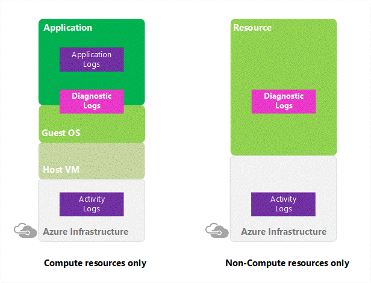
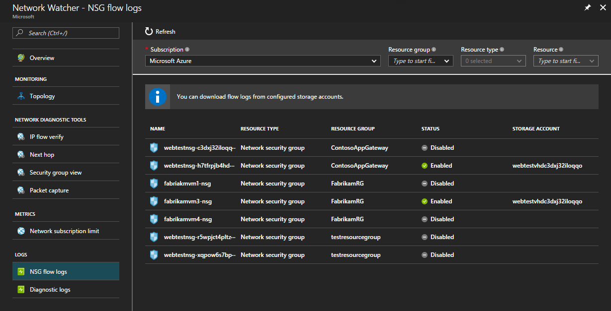
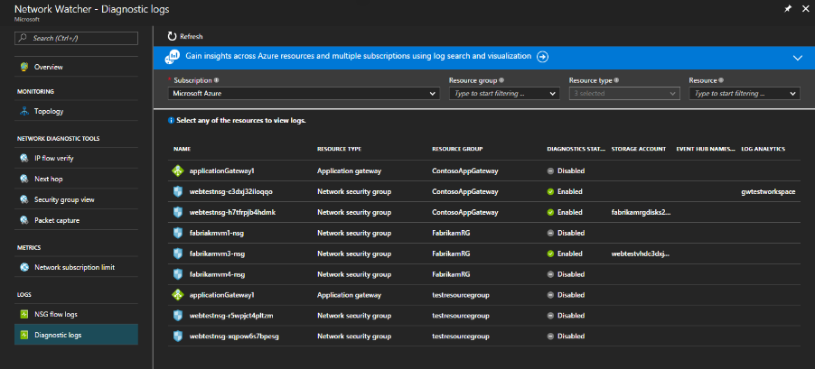
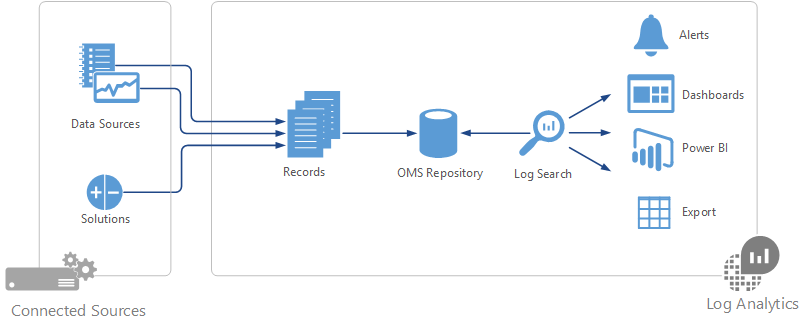
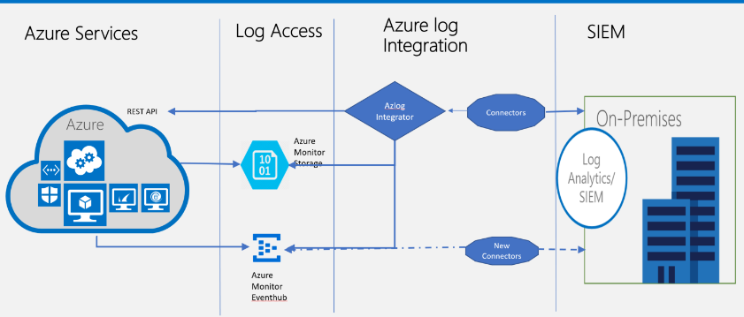

---

title: Azure Logging and Auditing | Microsoft Docs
description: Learn about how you can use logging data to gain deep insights about your application.
services: security
documentationcenter: na
author: UnifyCloud
manager: swadhwa
editor: TomSh

ms.assetid: 
ms.service: security
ms.devlang: na
ms.topic: article
ms.tgt_pltfrm: na
ms.workload: na
ms.date: 04/27/2017
ms.author: TomSh

---
# Azure Logging and Auditing
## 1.0 Introduction
### 1.1 Overview
To assist current and prospective Azure customers in understanding and using the various security-related capabilities available in and surrounding the Azure Platform, Microsoft has developed a series of white papers, security overviews, best practices, and checklists. The topics range in terms of breadth and depth and are updated periodically. This document is part of that series as summarized in the following Abstract section.
### 1.2 Azure Platform
Azure is an open and flexible cloud service platform that supports the broadest selection of operating systems, programming languages, frameworks, tools, databases,and devices.

For example, you can:
-	Run Linux containers with Docker integration.

-	Build apps with JavaScript, Python, .NET, PHP, Java,and Node.js

-	Build back-ends for iOS, Android,and Windows devices.

Azure public cloud services support the same technologies millions of developers and IT professionals already rely on and trust.

When you build on, or migrate IT assets to, a cloud provider, you are relying on that organization’s abilities to protect your applications and data with the services and the controls they provide to manage the security of your cloud-based assets.

Azure’s infrastructure is designed from the facility to applications for hosting millions of customers simultaneously, and it provides a trustworthy foundation upon which businesses can meet their security needs. In addition, Azure provides you with a wide array of configurable security options and the ability to control them so that you can customize security to meet the unique requirements of your deployments. This document will helps you meet these requirements.

### 1.3 Abstract
Auditing and logging of security-related events, and related alerts, are important components in an effective data protection strategy. Security logs and reports provide you with an electronic record of suspicious activities and help you detect patterns that may indicate attempted or successful external penetration of the network, as well as internal attacks. You can use auditing to monitor user activity, document regulatory compliance, perform forensic analysis, and more. Alerts provide immediate notification when security events occur.

Microsoft Azure services and products provide you with configurable security auditing and logging options to help you identify gaps in your security policies and mechanisms, and address those gaps to help prevent breaches. Microsoft services offer some (and in some cases, all) of the following options: centralized monitoring, logging, and analysis systems to provide continuous visibility; timely alerts; and reports to help you manage the large amount of information generated by devices and services.

Microsoft Azure log data can be exported to Security Incident and Event Management (SIEM) systems for analysis and integrates with third-party auditing solutions.

This whitepaper provides an introduction for generating, collecting, and analyzing security logs from services hosted on Azure, and it can help you gain security insights into your Azure deployments. The scope of this white paper is limited to applications and services built and deployed in Azure.

> [!Note]
> Certain recommendations contained herein may result in increased data, network, or compute resource usage, and increase your license or subscription costs.

## 2.0 Types of logs in Azure
Cloud applications are complex with many moving parts. Logs provide data to ensure that your application stays up and running in a healthy state. It also helps you to stave off potential problems or troubleshoot past ones. In addition, you can use logging data to gain deep insights about your application. That knowledge can help you to improve application performance or maintainability, or automate actions that would otherwise require manual intervention.

Azure produces extensive logging for every Azure service. These logs are categorized by these main types:
-	**Control/management logs** give visibility into the Azure Resource Manager CREATE, UPDATE, and DELETE operations. [Azure Activity Logs](https://docs.microsoft.com/azure/monitoring-and-diagnostics/monitoring-overview-activity-logs) is an example of this type of log.

-	**Data plane logs** give visibility into the events raised as part of the usage of an Azure resource. Examples of this type of log are the Windows event System, Security, and Application logs in a virtual machine and the [Diagnostics Logs](https://docs.microsoft.com/azure/monitoring-and-diagnostics/monitoring-overview-of-diagnostic-logs) configured through Azure Monitor

-	**Processed events** give information about analyzed events/alerts that have been processed on your behalf. Examples of this type are [Azure Security Center Alerts](https://docs.microsoft.com/azure/security-center/security-center-managing-and-responding-alerts) where [Azure Security Center](https://docs.microsoft.com/azure/security-center/security-center-intro) has processed and analyzed your subscription and provides concise security alerts

The following table list most important type of logs available in Azure.

| Log Category | Log Type | Usages | Integration |
| ------------ | -------- | ------ | ----------- |
|[Activity Logs](https://docs.microsoft.com/en-us/azure/monitoring-and-diagnostics/monitoring-overview-activity-logs)|Control-plane events on Azure Resource Manager resources|	Provide insight into the operations that were performed on resources in your subscription.|	Rest API & [Azure Monitor](https://docs.microsoft.com/en-us/azure/monitoring-and-diagnostics/monitoring-overview-activity-logs)|
|[Azure Diagnostic Logs](https://docs.microsoft.com/en-us/azure/monitoring-and-diagnostics/monitoring-overview-of-diagnostic-logs)|frequent data about the operation of Azure Resource Manager resources in subscription|	Provide insight into operations that your resource performed itself| Azure Monitor, [Stream](https://docs.microsoft.com/en-us/azure/monitoring-and-diagnostics/monitoring-overview-of-diagnostic-logs)|
|[AAD Reporting](https://docs.microsoft.com/en-us/azure/active-directory/active-directory-reporting-azure-portal)|Logs and Reports|User sign-in activities & System activity information about users and group management|[Graph API](https://docs.microsoft.com/en-us/azure/active-directory/develop/active-directory-graph-api-quickstart)|
|[Virtual Machine & Cloud Services](https://docs.microsoft.com/en-us/azure/cloud-services/cloud-services-dotnet-diagnostics-storage)|Windows Event log & Linux Syslog|	Captures system data and logging data on the virtual machines and transfers that data into a storage account of your choice.|	Windows using [WAD](https://docs.microsoft.com/en-us/azure/azure-diagnostics) (Windows Azure Diagnostics storage) and Linux in Azure monitor|
|[Storage Analytics](https://docs.microsoft.com/en-us/rest/api/storageservices/fileservices/storage-analytics)|Storage logging and provides metrics data for a storage account|Provides insight into trace requests, analyze usage trends, and diagnose issues with your storage account.|	REST API or the [client library](https://msdn.microsoft.com/en-us/library/azure/mt347887.aspx)|
|[NSG (Network Security Group) Flow Logs](https://docs.microsoft.com/en-us/azure/network-watcher/network-watcher-nsg-flow-logging-overview)|JSON format and shows outbound and inbound flows on a per rule basis|View information about ingress and egress IP traffic through a Network Security Group|[Network Watcher](https://docs.microsoft.com/en-us/azure/network-watcher/network-watcher-monitoring-overview)|
|[Application insight](https://docs.microsoft.com/en-us/azure/application-insights/app-insights-overview)|Logs, exceptions,and custom diagnostics|	Application Performance Management (APM) service for web developers on multiple platforms.|	REST API, [Power BI](https://powerbi.microsoft.com/en-us/documentation/powerbi-azure-and-power-bi/)|
|Process Data / Security Alert|	Azure Security Center Alert, OMS Alert|	Security information and alerts.| 	REST APIs, JSON|

### 2.1 Activity Log
The [Azure Activity Log](https://docs.microsoft.com/azure/monitoring-and-diagnostics/monitoring-overview-activity-logs), provides insight into the operations that were performed on resources in your subscription. The Activity Log was previously known as “Audit Logs” or “Operational Logs,” since it reports [control-plane events](https://driftboatdave.com/2016/10/13/azure-auditing-options-for-your-custom-reporting-needs/) for your subscriptions. Using the Activity Log, you can determine the “what, who, and when” for any write operations (PUT, POST, DELETE) taken on the resources in your subscription. You can also understand the status of the operation and other relevant properties. The Activity Log does not include read (GET) operations.

Here PUT, POST, DELETE refers to all the write operations activity log contains on the resources. For example, you can use the activity logs to find an error when troubleshooting or to monitor how a user in your organization modified a resource.

You can retrieve events from your Activity Log using the Azure portal, [CLI](https://docs.microsoft.com/azure/storage/storage-azure-cli), PowerShell cmdlets, and [Azure Monitor REST API](https://docs.microsoft.com/azure/monitoring-and-diagnostics/monitoring-rest-api-walkthrough). Activity logs have 19-day data retention period.

Integration Scenarios
-	[Create an email or webhook alert that triggers off an Activity Log event.](https://docs.microsoft.com/azure/monitoring-and-diagnostics/insights-auditlog-to-webhook-email)

-	[Stream it to an Event Hub](https://docs.microsoft.com/azure/monitoring-and-diagnostics/monitoring-stream-activity-logs-event-hubs) for ingestion by a third-party service or custom analytics solution such as PowerBI.

-	Analyze it in PowerBI using the [PowerBI content pack.](https://powerbi.microsoft.com/documentation/powerbi-content-pack-azure-audit-logs/)

-	[Save it to a Storage Account for archival or manual inspection.](https://docs.microsoft.com/azure/monitoring-and-diagnostics/monitoring-archive-activity-log) You can specify the retention time (in days) using Log Profiles.

-	Query and view it in the Azure portal.

-	Query it via PowerShell Cmdlet, CLI, or REST API.

-	Export the Activity Log with Log Profiles to [log Analytics](https://docs.microsoft.com/azure/log-analytics/log-analytics-overview).

You can use a storage account or [event hub namespace](https://docs.microsoft.com/azure/event-hubs/event-hubs-resource-manager-namespace-event-hub-enable-archive) that is not in the same subscription as the one emitting log. The user who configures the setting must have the appropriate [RBAC](https://docs.microsoft.com/azure/active-directory/role-based-access-control-configure) access to both subscriptions
### 2.2 Azure Diagnostic Logs
Azure Diagnostic Logs are emitted by a resource that provide rich, frequent data about the operation of that resource. The content of these logs varies by resource type (for example, [Windows event system logs](https://docs.microsoft.com/azure/log-analytics/log-analytics-data-sources-windows-events)are one category of Diagnostic Log for VMs and [blob, table, and queue logs](https://docs.microsoft.com/azure/storage/storage-monitor-storage-account) are categories of Diagnostic Logs for storage accounts) and differ from the Activity Log, which provides insight into the operations that were performed on resources in your subscription.

Azure Diagnostics logs offer multiple configuration options that is,Azure portal, using PowerShell, Command-line interface (CLI),and REST API.

**Integration Scenarios**
-	Save them to a [Storage Account](https://docs.microsoft.com/azure/monitoring-and-diagnostics/monitoring-archive-diagnostic-logs) for auditing or manual inspection. You can specify the retention time (in days) using the Diagnostic Settings.

-	[Stream them to Event Hubs](https://docs.microsoft.com/azure/monitoring-and-diagnostics/monitoring-stream-diagnostic-logs-to-event-hubs) for ingestion by a third-party service or custom analytics solution such as [PowerBI.](https://powerbi.microsoft.com/documentation/powerbi-azure-and-power-bi/)

-	Analyze them with [OMS Log Analytics.](https://docs.microsoft.com/azure/log-analytics/log-analytics-overview)

**Supported services, schema for Diagnostic Logs and supported log categories per resource type**

| Service | Schema & Docs | Resource Type | Category |
| ------- | ------------- | ------------- | -------- |
|Load Balancer| [Log analytics for Azure Load Balancer (Preview)](https://docs.microsoft.com/en-us/azure/load-balancer/load-balancer-monitor-log)|Microsoft.Network/loadBalancers|	LoadBalancerAlertEvent|
|||Microsoft.Network/loadBalancers|	LoadBalancerProbeHealthStatus
|Network Security Groups|[Log analytics for network security groups (NSGs)](https://docs.microsoft.com/en-us/azure/virtual-network/virtual-network-nsg-manage-log)|Microsoft.Network/networksecuritygroups|NetworkSecurityGroupEvent|
|||Microsoft.Network/networksecuritygroups|NetworkSecurityGroupRuleCounter|
|Application Gateways|[Diagnostics Logging for Application Gateway](https://docs.microsoft.com/en-us/azure/application-gateway/application-gateway-diagnostics)|Microsoft.Network/applicationGateways|ApplicationGatewayAccessLog|
|||Microsoft.Network/applicationGateways|ApplicationGatewayPerformanceLog|
|||Microsoft.Network/applicationGateways|ApplicationGatewayFirewallLog|
|Key Vault|[Azure Key Vault Logging](https://docs.microsoft.com/en-us/azure/key-vault/key-vault-logging)|Microsoft.KeyVault/vaults|AuditEvent|
|Azure Search|[Enabling and using Search Traffic Analytics](https://docs.microsoft.com/en-us/azure/search/search-traffic-analytics)|Microsoft.Search/searchServices|OperationLogs|
|Data Lake Store|[Accessing diagnostic logs for Azure Data Lake Store](https://docs.microsoft.com/en-us/azure/data-lake-store/data-lake-store-diagnostic-logs)|Microsoft.DataLakeStore/accounts|Audit|
|Data Lake Analytics|[Accessing diagnostic logs for Azure Data Lake Analytics](https://docs.microsoft.com/en-us/azure/data-lake-analytics/data-lake-analytics-diagnostic-logs)|Microsoft.DataLakeAnalytics/accounts|Audit|
|||Microsoft.DataLakeAnalytics/accounts|Requests|
|||Microsoft.DataLakeStore/accounts|Requests|
|Logic Apps|[Logic Apps B2B custom tracking schema](https://docs.microsoft.com/en-us/azure/logic-apps/logic-apps-track-integration-account-custom-tracking-schema)|Microsoft.Logic/workflows|WorkflowRuntime|
|||Microsoft.Logic/integrationAccounts|IntegrationAccountTrackingEvents|
|Azure Batch|[Azure Batch diagnostic logging](https://docs.microsoft.com/en-us/azure/batch/batch-diagnostics)|Microsoft.Batch/batchAccounts|ServiceLog|
|Azure Automation|[Log analytics for Azure Automation](https://docs.microsoft.com/en-us/azure/automation/automation-manage-send-joblogs-log-analytics)|Microsoft.Automation/automationAccounts|JobLogs|
|||Microsoft.Automation/automationAccounts|JobStreams|
|Event Hubs|[Azure Event Hubs diagnostic logs](https://docs.microsoft.com/en-us/azure/event-hubs/event-hubs-diagnostic-logs)|Microsoft.EventHub/namespaces|ArchiveLogs|
|||Microsoft.EventHub/namespaces|OperationalLogs|
|Stream Analytics|[Job diagnostic logs](https://docs.microsoft.com/en-us/azure/stream-analytics/stream-analytics-job-diagnostic-logs)|Microsoft.StreamAnalytics/streamingjobs|Execution|
|||Microsoft.StreamAnalytics/streamingjobs|Authoring|
|Service Bus|[Azure Service Bus diagnostic logs](https://docs.microsoft.com/en-us/azure/service-bus-messaging/service-bus-diagnostic-logs)|Microsoft.ServiceBus/namespaces|OperationalLogs|

### 2.3 Azure Active Directory Reporting
Azure Active Directory (Azure AD) includes security, activity, and audit reports for your directory. The [Azure Active Directory Audit Report](https://docs.microsoft.com/azure/active-directory/active-directory-reporting-guide) helps customers to identify privileged actions that occurred in their Azure Active Directory. Privileged actions include elevation changes (for example, role creation or password resets), changing policy configurations (for example password policies), or changes to directory configuration (for example, changes to domain federation settings).

The reports provide the audit record for the event name, the actor who performed the action, the target resource affected by the change, and the date and time (in UTC). Customers are able to retrieve the list of audit events for their Azure Active Directory via the [Azure portal](https://portal.azure.com/), as described in [View your Audit Logs](https://docs.microsoft.com/azure/active-directory/active-directory-reporting-azure-portal). Here's a list of the reports included:

| Security reports | Activity reports | Audit reports |
| :--------------- | :--------------- | :------------ |
|Sign-ins from unknown sources|	Application usage: summary|	Directory audit report|
|Sign-ins after multiple failures|	Application usage: detailed||
|Sign-ins from multiple geographies|	Application dashboard||
|Sign-ins from IP addresses with suspicious activity|	Account provisioning errors||
|Irregular sign-in activity|	Individual user devices||
|Sign-ins from possibly infected devices|	Individual user Activity||
|Users with anomalous sign-in activity|	Groups activity report||
||Password Reset Registration Activity Report||
||Password reset activity|||

The data of these reports can be useful to your applications, such as SIEM systems, audit, and business intelligence tools. The Azure AD reporting APIs provide programmatic access to the data through a set of REST-based APIs. You can call these [APIs](https://docs.microsoft.com/azure/active-directory/active-directory-reporting-api-getting-started) from various programming languages and tools.

Events in the Azure AD Audit report are retained for 180 days.

> [!Note]
> For more information about retention on reports, see [Azure Active Directory Report Retention Policies.](https://docs.microsoft.com/azure/active-directory/active-directory-reporting-retention)

For customers interested in storing their audit events for longer retention periods, the Reporting API can be used to regularly pull [audit events](https://docs.microsoft.com/azure/active-directory/active-directory-reporting-audit-events) into a separate data store.

### 2.4 Virtual Machine logs using Azure Diagnostics
[Azure Diagnostics](https://docs.microsoft.com/azure/azure-diagnostics) is the capability within Azure that enables the collection of diagnostic data on a deployed application. You can use the diagnostics extension from several different sources. Currently supported are [Azure Cloud Service Web and Worker Roles](https://docs.microsoft.com/azure/cloud-services/cloud-services-choose-me),

[Azure Virtual Machines](https://azure.microsoft.com/documentation/learning-paths/virtual-machines/) running Microsoft Windows and [Service Fabric](https://docs.microsoft.com/azure/service-fabric/service-fabric-overview).

You can enable Azure Diagnostic on a virtual machine using following:

-	Using Visual Studio, see [Use Visual Studio to trace Azure Virtual Machines](https://docs.microsoft.com/azure/vs-azure-tools-debug-cloud-services-virtual-machines)

-	[Set up Azure Diagnostics on an Azure Virtual Machine Remotely](https://docs.microsoft.com/azure/virtual-machines-dotnet-diagnostics)

-	[Use PowerShell to set up diagnostics on Azure Virtual Machines](https://docs.microsoft.com/azure/virtual-machines/virtual-machines-windows-ps-extensions-diagnostics?toc=%2fazure%2fvirtual-machines%2fwindows%2ftoc.json)

-	[Create a Windows Virtual machine with monitoring and diagnostics using Azure Resource Manager Template](https://docs.microsoft.com/azure/virtual-machines/virtual-machines-windows-extensions-diagnostics-template?toc=%2fazure%2fvirtual-machines%2fwindows%2ftoc.json)

### 2.5 Storage Analytics
[Azure Storage Analytics](https://docs.microsoft.com/rest/api/storageservices/fileservices/storage-analytics) performs logging and provides metrics data for a storage account. You can use this data to trace requests, analyze usage trends, and diagnose issues with your storage account. Storage Analytics logging is available for the [Blob, Queue, and Table services.](https://docs.microsoft.com/azure/storage/storage-introduction) Storage Analytics logs detailed information about successful and failed requests to a storage service.

This information can be used to monitor individual requests and to diagnose issues with a storage service. Requests are logged on a best-effort basis. Log entries are created only if there are requests made against the service endpoint. For example, if a storage account has activity in its Blob endpoint but not in its Table or Queue endpoints, only logs pertaining to the Blob service is created.

To use Storage Analytics, you must enable it individually for each service you want to monitor. You can enable it in the [Azure portal](https://portal.azure.com/); for details, see [Monitor a storage account in the Azure portal.](https://docs.microsoft.com/azure/storage/storage-monitor-storage-account) You can also enable Storage Analytics programmatically via the REST API or the client library. Use the Set Service Properties operation to enable Storage Analytics individually for each service.

The aggregated data is stored in a well-known blob (for logging) and in well-known tables (for metrics), which may be accessed using the Blob service and Table service APIs.

Storage Analytics has a 20-TB limit on the amount of stored data that is independent of the total limit for your storage account. All logs are stored in [block blobs](https://docs.microsoft.com/azure/storage/storage-analytics) in a container named $logs, which are automatically created when Storage Analytics is enabled for a storage account.

> [!Note]
> For more information on billing and data retention policies, see [Storage Analytics and Billing.](https://docs.microsoft.com/rest/api/storageservices/fileservices/storage-analytics-and-billing)
>
> [!Note]
> For more information on storage account limits, see [Azure Storage Scalability and Performance Targets.](https://docs.microsoft.com/azure/storage/storage-scalability-targets)

The following types of authenticated and anonymous requests are logged.

| Authenticated  | Anonymous|
| :------------- | :-------------|
| Successful requests | Successful requests |
|Failed requests, including timeout, throttling, network, authorization, and other errors | Requests using a Shared Access Signature (SAS), including failed and successful requests |
| Requests using a Shared Access Signature (SAS), including failed and successful requests |Time out errors for both client and server |
| 	Requests to analytics data | 	Failed GET requests with error code 304 (Not Modified) |
| Requests made by Storage Analytics itself, such as log creation or deletion, are not logged. A full list of the logged data is documented in the [Storage Analytics Logged Operations and Status Messages](https://docs.microsoft.com/rest/api/storageservices/fileservices/storage-analytics-logged-operations-and-status-messages) and [Storage Analytics Log Format](https://docs.microsoft.com/rest/api/storageservices/fileservices/storage-analytics-log-format) topics. | All other failed anonymous requests are not logged. A full list of the logged data is documented in the [Storage Analytics Logged Operations and Status Messages](https://docs.microsoft.com/rest/api/storageservices/fileservices/storage-analytics-logged-operations-and-status-messages) and [Storage Analytics Log Format](https://docs.microsoft.com/rest/api/storageservices/fileservices/storage-analytics-log-format). |

### 2.6 Azure networking logs
Network logging and monitoring in Azure is comprehensive and covers two broad categories:

-	[Network Watcher](https://docs.microsoft.com/azure/network-watcher/network-watcher-monitoring-overview#network-watcher) - Scenario-based network monitoring is provided with the features in Network Watcher. This service includes packet capture, next hop, IP flow verify, security group view, NSG flow logs. Scenario level monitoring provides an end to end view of network resources in contrast to individual network resource monitoring.

-	[Resource monitoring](https://docs.microsoft.com/azure/network-watcher/network-watcher-monitoring-overview#network-resource-level-monitoring) - Resource level monitoring comprises of four features, diagnostic logs, metrics, troubleshooting, and resource health. All these features are built at the network resource level.

Network Watcher is a regional service that enables you to monitor and diagnose conditions at a network scenario level in, to, and from Azure. Network diagnostic and visualization tools available with Network Watcher help you understand, diagnose, and gain insights to your network in Azure.

**NSG Flow logging** - Flow logs for Network Security Groups enable you to capture logs related to traffic that are allowed or denied by the security rules in the group. These flow logs are written in JSON format and show outbound and inbound flows on a per rule basis, the NIC the flow applies to, 5-tuple information about the flow (Source/Destination IP, Source/Destination Port, Protocol), and if the traffic was allowed or denied.

### 2.7 Network Security Group Flow Logging

[Network Security Group flow logs](https://docs.microsoft.com/azure/network-watcher/network-watcher-nsg-flow-logging-overview) are a feature of Network Watcher that allows you to view information about ingress and egress IP traffic through a Network Security Group. These flow logs are written in JSON format and show outbound and inbound flows on a per rule basis, the NIC the flow applies to, 5-tuple information about the flow (Source/Destination IP, Source/Destination Port, Protocol), and if the traffic was allowed or denied.

While flow logs target Network Security Groups, they are not displayed the same as the other logs. Flow logs are stored only within a storage account.

The same retention policies as seen on other logs apply to flow logs. Logs have a retention policy that can be set from 1 day to 365 days. If a retention policy is not set, the logs are maintained forever.

**Diagnostic logs**

Periodic and spontaneous events are created by network resources and logged in storage accounts, sent to an Event Hub, or Log Analytics. These logs provide insights into the health of a resource. These logs can be viewed in tools such as Power BI and Log Analytics. To learn how to view diagnostic logs, visit [Log Analytics.](https://docs.microsoft.com/azure/log-analytics/log-analytics-azure-networking-analytics)

Diagnostic logs are available for [Load Balancer](https://docs.microsoft.com/azure/load-balancer/load-balancer-monitor-log), [Network Security Groups](https://docs.microsoft.com/azure/virtual-network/virtual-network-nsg-manage-log), Routes, and [Application Gateway.](https://docs.microsoft.com/azure/application-gateway/application-gateway-diagnostics)

Network Watcher provides a diagnostic logs view. This view contains all networking resources that support diagnostic logging. From this view, you can enable and disable networking resources conveniently and quickly.

In addition to preceding logging capabilities, Network Watcher currently has the following capabilities:
- [Topology](https://docs.microsoft.com/azure/network-watcher/network-watcher-topology-overview) - Provides a network level view showing the various interconnections and associations between network resources in a resource group.

- [Variable Packet capture](https://docs.microsoft.com/azure/network-watcher/network-watcher-packet-capture-overview) - Captures packet data in and out of a virtual machine. Advanced filtering options and fine-tuned controls such as being able to set time and size limitations provide versatility.The packet data can be stored in a blob store or on the local disk in .cap format.

-	[IP flow verifies](https://docs.microsoft.com/azure/network-watcher/network-watcher-ip-flow-verify-overview) - Checks if a packet is allowed or denied based on flow information 5-tuple packet parameters (Destination IP, Source IP, Destination Port, Source Port, and Protocol). If the packet is denied by a security group, the rule and group that denied the packet is returned.

-	[Next hop](https://docs.microsoft.com/azure/network-watcher/network-watcher-next-hop-overview) - Determines the next hop for packets being routed in the Azure Network Fabric, enabling you to diagnose any misconfigured user-defined routes.

-	[Security group view](https://docs.microsoft.com/azure/network-watcher/network-watcher-security-group-view-overview) - Gets the effective and applied security rules that are applied on a VM.

-	[Virtual Network Gateway and Connection troubleshooting](https://docs.microsoft.com/azure/network-watcher/network-watcher-troubleshoot-manage-rest) - Provides the ability to troubleshoot Virtual Network Gateways and Connections.

-	[Network subscription limits](https://docs.microsoft.com/azure/network-watcher/network-watcher-monitoring-overview#network-subscription-limits) - Enables you to view network resource usage against limits.

### 2.8 Application insight

[Application Insights](https://docs.microsoft.com/azure/application-insights/app-insights-overview) is an extensible Application Performance Management (APM) service for web developers on multiple platforms. Use it to monitor your live web application. It is automatically detect performance anomalies. It includes powerful analytics tools to help you diagnose issues and to understand what users actually do with your app.

 It's designed to help you continuously improve performance and usability.

 It works for apps on a wide variety of platforms including .NET, Node.js and J2EE, hosted on-premises or in the cloud. It integrates with your devOps process, and has connection points to various development tools.

Application Insights is aimed at the development team, to help you understand how your app is performing and how it's being used. It monitors:

-	**Request rates, response times, and failure rates** - Find out which pages are most popular, at what times of day, and where your users are. See which pages perform best. If your response times and failure rates go high when there are more requests, then perhaps you have a resourcing problem.

-	**Dependency rates, response times, and failure rates** - Find out whether external services are slowing you down.

-	**Exceptions** - Analyze the aggregated statistics, or pick specific instances and drill into the stack trace and related requests. Both server and browser exceptions are reported.

-	**Page views and load performance** - reported by your users' browsers.

-	**AJAX calls** from web pages - rates, response times, and failure rates.

-	**User and session counts**.

-	**Performance counters** from your Windows or Linux server machines, such as CPU, memory, and network usage.

-	**Host diagnostics** from Docker or Azure.

-	**Diagnostic trace logs** from your app - so that you can correlate trace events with requests.

-	**Custom events and metrics** that you write yourself in the client or server code, to track business events such as items sold or games won.

**List Of Integration Scenarios and Description:**

| Integration Scenarios | Description |
| --------------------- | :---------- |
|[Application map](https://docs.microsoft.com/en-us/azure/application-insights/app-insights-app-map)|The components of your app, with key metrics and alerts.||
|[Diagnostic search for instance data](https://docs.microsoft.com/en-us/azure/application-insights/app-insights-diagnostic-search)| Search and filter events such as requests, exceptions, dependency calls, log traces, and page views.||
|[Metrics Explorer for aggregated data](https://docs.microsoft.com/en-us/azure/application-insights/app-insights-metrics-explorer)|Explore, filter, and segment aggregated data such as rates of requests, failures, and exceptions; response times, page load times.||
|[Dashboards](https://docs.microsoft.com/en-us/azure/application-insights/app-insights-dashboards#dashboards)|Mash up data from multiple resources and share with others. Great for multi-component applications, and for continuous display in the team room.||
|[Live Metrics Stream](https://docs.microsoft.com/en-us/azure/application-insights/app-insights-live-stream)|When you deploy a new build, watch these near-real-time performance indicators to make sure everything works as expected.||
|[Analytics](https://docs.microsoft.com/en-us/azure/application-insights/app-insights-analytics)|Answer tough questions about your app's performance and usage by using this powerful query language.||
|[Automatic and manual alerts](https://docs.microsoft.com/en-us/azure/application-insights/app-insights-alerts)|Automatic alerts adapt to your app's normal patterns of telemetry and trigger when there's something outside the usual pattern. You can also set alerts on particular levels of custom or standard metrics.||
|[Visual Studio](https://docs.microsoft.com/en-us/azure/application-insights/app-insights-visual-studio)|See performance data in the code. Go to code from stack traces.||
|[Power BI](https://docs.microsoft.com/en-us/azure/application-insights/app-insights-export-power-bi)|Integrate usage metrics with other business intelligence.||
|[REST API](https://dev.applicationinsights.io/)|Write code to run queries over your metrics and raw data.||
|[Continuous export](https://docs.microsoft.com/en-us/azure/application-insights/app-insights-export-telemetry)|Bulk export of raw data to storage when it arrives.||

### 2.9 Azure Security Center Alerts
[Azure Security Center](https://docs.microsoft.com/azure/security-center/security-center-intro) automatically collects, analyzes, and integrates log data from your Azure resources, the network, and connected partner solutions, like firewall and endpoint protection solutions, to detect real threats and reduce false positives. A list of prioritized security alerts is shown in Security Center along with the information you need to quickly investigate the problem and recommendations for how to remediate an attack.

Security Center threat detection works by automatically collecting security information from your Azure resources, the network, and connected partner solutions. It analyzes this information, often correlating information from multiple sources, to identify threats. Security alerts are prioritized in Security Center along with recommendations on how to remediate the threat.

Security Center employs advanced security analytics, which go far beyond signature-based approaches. Breakthroughs in large data and [machine learning](https://azure.microsoft.com/blog/machine-learning-in-azure-security-center/) technologies are applied to evaluate events across the entire cloud fabric – detecting threats that would be impossible to identify using manual approaches and predicting the evolution of attacks. These security analytics include:

-	**Integrated threat intelligence:** looks for known bad actors by applying global threat intelligence from Microsoft products and services, the Microsoft Digital Crimes Unit (DCU), the Microsoft Security Response Center (MSRC), and external feeds.

-	**Behavioral analytics:** applies known patterns to discover malicious behavior.

-	**Anomaly detection:** uses statistical profiling to build a historical baseline. It alerts on deviations from established baselines that conform to a potential attack vector.

Many security operations and incident response teams rely on a Security Information and Event Management (SIEM) solution as the starting point for triaging and investigating security alerts. With Azure log integration, customers can sync Security Center alerts and virtual machine security events, collected by Azure Diagnostics and Azure Audit Logs, with their log analytics or SIEM solution in near real time.

## 3.0 Log Analytics

Log Analytics is a service in [Operations Management Suite (OMS)](https://docs.microsoft.com/azure/operations-management-suite/operations-management-suite-overview) that helps you collect and analyze data generated by resources in your cloud and on-premises environments. It gives you real-time insights using integrated search and custom dashboards to readily analyze millions of records across all your workloads and servers regardless of their physical location.

At the center of Log Analytics is the OMS repository,which is hosted in the Azure cloud. Data is collected into the repository from connected sources by configuring data sources and adding solutions to your subscription. Data sources and solutions will each create different record types that have their own set of properties but may still be analyzed together in queries to the repository. This allows you to use the same tools and methods to work with different kinds of data collected by different sources.

Connected sources are the computers and other resources that generate data collected by Log Analytics. This can include agents installed on [Windows](https://docs.microsoft.com/azure/log-analytics/log-analytics-windows-agents) and [Linux](https://docs.microsoft.com/azure/log-analytics/log-analytics-linux-agents) computers that connect directly or agents in [a connected System Center Operations Manager management group.](https://docs.microsoft.com/azure/log-analytics/log-analytics-om-agents) Log Analytics can also collect data from [Azure storage.](https://docs.microsoft.com/azure/log-analytics/log-analytics-azure-storage)

[Data sources](https://docs.microsoft.com/azure/log-analytics/log-analytics-data-sources) are the different kinds of data collected from each connected source. This includes events and [performance data](https://docs.microsoft.com/azure/log-analytics/log-analytics-data-sources-performance-counters) from [Windows](https://docs.microsoft.com/azure/log-analytics/log-analytics-data-sources-windows-events) and Linux agents in addition to sources such as [IIS logs](https://docs.microsoft.com/azure/log-analytics/log-analytics-data-sources-iis-logs), and [custom text logs.](https://docs.microsoft.com/azure/log-analytics/log-analytics-data-sources-custom-logs) You configure each data source that you want to collect, and the configuration is automatically delivered to each connected source.

There are four different ways of [collecting logs and metrics for Azure services:](https://docs.microsoft.com/azure/log-analytics/log-analytics-azure-storage)
1.	Azure diagnostics direct to Log Analytics (Diagnostics in the following table)

2.	Azure diagnostics to Azure storage to Log Analytics (Storage in the following table)

3.	Connectors for Azure services (Connectors in the following table)

4.	Scripts to collect and then post data into Log Analytics (blanks in the following table and for services that are not listed)

| Service | Resource Type | Logs | Metrics | Solution |
| :------ | :------------ | :--- | :------ | :------- |
|Application gateways|	Microsoft.Network/ applicationGateways|	Diagnostics|Diagnostics|	[Azure Application](https://docs.microsoft.com/en-us/azure/log-analytics/log-analytics-azure-networking-analytics#azure-application-gateway-analytics-solution-in-log-analytics) [Gateway Analytics](https://docs.microsoft.com/en-us/azure/log-analytics/log-analytics-azure-networking-analytics#azure-application-gateway-analytics-solution-in-log-analytics)|
|Application insights||	 	Connector|	Connector|	[Application Insights](https://blogs.technet.microsoft.com/msoms/2016/09/26/application-insights-connector-in-oms/) [Connector (Preview)](https://blogs.technet.microsoft.com/msoms/2016/09/26/application-insights-connector-in-oms/)|
|Automation accounts|	Microsoft.Automation/ AutomationAccounts|	Diagnostics||	 	[More information](https://docs.microsoft.com/en-us/azure/automation/automation-manage-send-joblogs-log-analytics)|
|Batch accounts|	Microsoft.Batch/ batchAccounts|	Diagnostics|	Diagnostics||
|Classic cloud services||	 	Storage||	 	[More information](https://docs.microsoft.com/en-us/azure/log-analytics/log-analytics-azure-storage-iis-table)|
|Cognitive services|	Microsoft.CognitiveServices/ accounts|	 	Diagnostics|||
|Data Lake analytics|	Microsoft.DataLakeAnalytics/ accounts|	Diagnostics|||
|Data Lake store|	Microsoft.DataLakeStore/ accounts|	Diagnostics|||
|Event Hub namespace|	Microsoft.EventHub/ namespaces|	Diagnostics|	Diagnostics||
|IoT Hubs|	Microsoft.Devices/ IotHubs||	 	Diagnostics||
|Key Vault|	Microsoft.KeyVault/ vaults|	Diagnostics	 ||	[KeyVault Analytics](https://docs.microsoft.com/en-us/azure/log-analytics/log-analytics-azure-key-vault)|
|Load Balancers|	Microsoft.Network/ loadBalancers|	Diagnostics|||
|Logic Apps|	Microsoft.Logic/ workflows| 	Diagnostics|	Diagnostics||
||Microsoft.Logic/ integrationAccounts||||
|Network Security Groups|	Microsoft.Network/ networksecuritygroups|Diagnostics|| 	[Azure Network Security Group Analytics](https://docs.microsoft.com/en-us/azure/log-analytics/log-analytics-azure-networking-analytics#azure-network-security-group-analytics-solution-in-log-analytics)|
|Recovery vaults|	Microsoft.RecoveryServices/ vaults|||[Azure Recovery Services Analytics (Preview)](https://github.com/krnese/AzureDeploy/blob/master/OMS/MSOMS/Solutions/recoveryservices/)|
|Search services|	Microsoft.Search/ searchServices|	Diagnostics|	Diagnostics||
|Service Bus namespace|	Microsoft.ServiceBus/ namespaces|	Diagnostics|Diagnostics|	[Service Bus Analytics (Preview)](https://github.com/Azure/azure-quickstart-templates/tree/master/oms-servicebus-solution)|
|Service Fabric||	 	Storage||	 [Service Fabric Analytics (Preview)](https://docs.microsoft.com/en-us/azure/log-analytics/log-analytics-service-fabric)|
|SQL (v12)|	Microsoft.Sql/ servers/ databases|| 	 	Diagnostics||
||Microsoft.Sql/ servers/ elasticPools||||
|Storage|||	 	 	Script|	[Azure Storage Analytics (Preview)](https://github.com/Azure/azure-quickstart-templates/tree/master/oms-azure-storage-analytics-solution)|
|Virtual Machines|	Microsoft.Compute/ virtualMachines|	Extension|	Extension||
||||Diagnostics||
|Virtual Machines scale sets|	Microsoft.Compute/ virtualMachines 	 ||Diagnostics||
||Microsoft.Compute/ virtualMachineScaleSets/ virtualMachines||||
|Web Server farms|Microsoft.Web/ serverfarms|| 	Diagnostics
|Web Sites|	Microsoft.Web/ sites ||	 	Diagnostics|	[More information](https://github.com/Azure/azure-quickstart-templates/tree/master/101-webappazure-oms-monitoring)|
||Microsoft.Web/ sites/ slots|||||

## 4.0 Log integration with on-premises SIEM systems
[Azure log integration](https://www.microsoft.com/download/details.aspx?id=53324) enables you to integrate raw logs from your Azure resources in to your on-premises **Security Information and Event Management (SIEM) systems**.

Azure log integration collects Azure Diagnostics from your Windows (WAD) virtual machines, Azure Activity Logs, Azure Security Center alerts,and Azure Resource Provider logs. This integration provides a unified dashboard for all your assets, on-premises or in the cloud, so that you can aggregate, correlate, analyze, and alert for security events.

Azure log integration currently supports integration of Azure Activity Logs, Windows Event log from Windows virtual machine in your Azure subscription, Azure Security Center alerts, Azure Diagnostic logs and Azure Active Directory audit logs.

| Log type | Log analytics supporting JSON (Splunk, ArcSight, Qradar) |
| :------- | :-------------------------------------------------------- |
|AAD Audit logs|	yes|
|Activity Logs|	Yes|
|ASC Alerts	|Yes|
|Diagnostics Logs (resource logs)|	Yes|
|VM logs|	Yes via Forwarded events and not through JSON|

The following table explains the Log category and SIEM integration detail.

[Get started with Azure log integration](https://docs.microsoft.com/azure/security/security-azure-log-integration-get-started) - Tutorial walks you through installation of Azure log integration and integrating logs from Azure WAD storage, Azure Activity Logs, Azure Security Center alerts,and Azure Active Directory audit logs.

Integration Scenarios

-	[Partner configuration steps](https://blogs.msdn.microsoft.com/azuresecurity/2016/08/23/azure-log-siem-configuration-steps/) – This blog post shows you how to configure Azure log integration to work with partner solutions Splunk, HP ArcSight, and IBM QRadar.

-	[Azure log Integration frequently asked questions (FAQ)](https://docs.microsoft.com/azure/security/security-azure-log-integration-faq) - This FAQ answers questions about Azure log integration.

-	[Integrating Security Center alerts with Azure log Integration](https://docs.microsoft.com/azure/security-center/security-center-integrating-alerts-with-log-integration) – This document shows you how to sync Security Center alerts, along with virtual machine security events collected by Azure Diagnostics and Azure Audit Logs, with your log analytics or SIEM solution.

## Next Steps

- [Auditing and logging](https://www.microsoft.com/trustcenter/security/auditingandlogging)

Protect data by maintaining visibility and responding quickly to timely security alerts

- [Security Logging and Audit Log Collection within Azure](https://azure.microsoft.com/resources/videos/security-logging-and-audit-log-collection/)

What settings you need to enforce to make sure your Azure instances are collecting the correct Security and Audit logs.

- [Configure audit settings for a site collection](https://support.office.com/article/Configure-audit-settings-for-a-site-collection-A9920C97-38C0-44F2-8BCB-4CF1E2AE22D2?ui=&rs=&ad=US)

As a site collection administrator, one can retrieve the history of actions taken by a particular user and can also retrieve the history of actions taken during a particular date range. 

- [Search the audit log in the Office 365 Security & Compliance Center](https://support.office.com/article/Search-the-audit-log-in-the-Office-365-Security-Compliance-Center-0d4d0f35-390b-4518-800e-0c7ec95e946c?ui=&rs=&ad=US)

One can use the Office 365 Security & Compliance Center to search the unified audit log to view user and administrator activity in your Office 365 organization.

