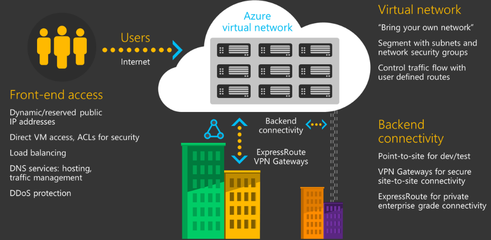
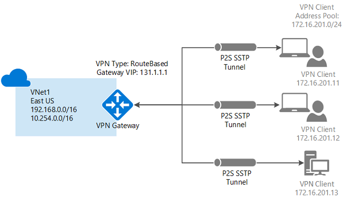
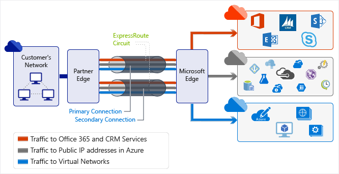
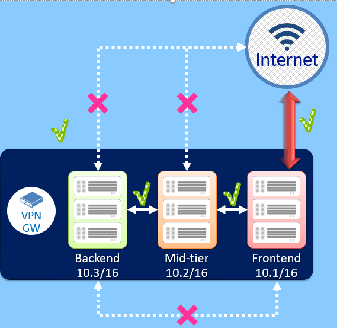
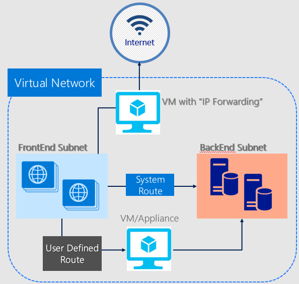
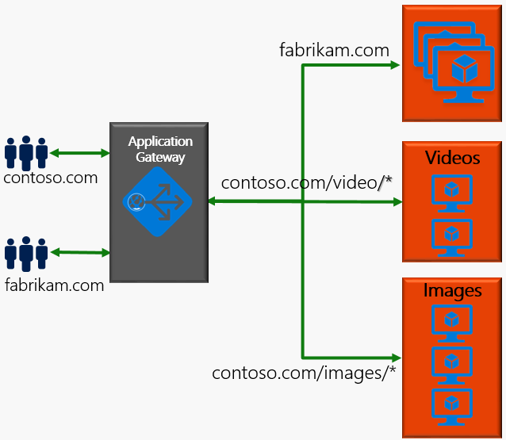
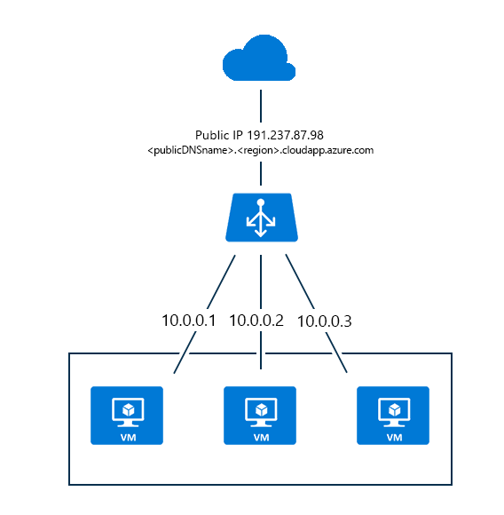

---

title: Azure Network Security | Microsoft Docs
description: Learn about cloud-based computing services that include a wide selection of compute instances & services that can scale up and down automatically to meet the needs of your application or enterprise.
services: security
documentationcenter: na
author: UnifyCloud
manager: barbkess
editor: TomSh

ms.assetid: 
ms.service: security
ms.devlang: na
ms.topic: article
ms.tgt_pltfrm: na
ms.workload: na
ms.date: 11/21/2017
ms.author: TomSh

---

# Azure network security

We know that security is job one in the cloud and how important it is that you find accurate and timely information about Azure security. One of the best reasons to use Azure for your applications and services is to take advantage of Azure’s wide array of security tools and capabilities. These tools and capabilities help make it possible to create secure solutions on the Azure platform.

Microsoft Azure provides confidentiality, integrity, and availability of customer data, while also enabling transparent accountability. To help you better understand the collection of network security controls implemented within Microsoft Azure from the customer's perspective, this article, “Azure Network Security", is written to provide a comprehensive look at the network security controls available with Microsoft Azure.

This paper is intended to inform you about the wide range of network controls that you can configure to enhance the security of the solutions you deploy in Azure. If you are interested in what Microsoft does to secure the network fabric of the Azure platform itself,  see the Azure security section in the [Microsoft Trust Center](https://microsoft.com/en-us/trustcenter/cloudservices/azure).

## Azure platform

Azure is a public cloud service platform that supports a broad selection of operating systems, programming languages, frameworks, tools, databases, and devices.  It can run Linux containers with Docker integration; build apps with JavaScript, Python, .NET, PHP, Java, and Node.js; build back-ends for iOS, Android, and Windows devices. Azure cloud services support the same technologies millions of developers and IT professionals already rely on and trust.

When you build on, or migrate IT assets to, a public cloud service provider, you are relying on that organization’s abilities to protect your applications and data with the services and the controls they provide to manage the security of your cloud-based assets.

Azure’s infrastructure is designed from the facility to applications for hosting millions of customers simultaneously, and it provides a trustworthy foundation upon which businesses can meet their security requirements. In addition, Azure provides you with an extensive collection of configurable security options and the ability to control them so that you can customize security to meet the unique requirements of your organization’s deployments.

## Abstract

Microsoft public cloud services deliver hyper-scale services and infrastructure, enterprise-grade capabilities, and many choices for hybrid connectivity. You can choose to access these services either via the Internet or with Azure ExpressRoute, which provides private network connectivity. The Microsoft Azure platform allows you to seamlessly extend your infrastructure into the cloud and build multi-tier architectures. Additionally, third parties can enable enhanced capabilities by offering security services and virtual appliances.

Azure’s network services maximize flexibility, availability, resiliency, security, and integrity by design. This white paper provides details on the networking functions of Azure and information on how customers can use Azure’s native security features to help protect their information assets.

The intended audiences for this whitepaper include:

- Technical managers, network administrators, and developers who are looking for security solutions available and supported in Azure.

-	SMEs or business process executives who want to get a high-level overview the Azure networking technologies and services that are relevant in discussions around network security in the Azure public cloud.

## Azure networking big picture
Microsoft Azure includes a robust networking infrastructure to support your application and service connectivity requirements. Network connectivity is possible between resources located in Azure, between on-premises and Azure hosted resources, and to and from the Internet and Azure.

The [Azure network infrastructure](https://docs.microsoft.com/azure/virtual-machines/windows/infrastructure-networking-guidelines) enables you to securely connect Azure resources to each other with virtual networks (VNets). A VNet is a representation of your own network in the cloud. A VNet is a logical isolation of the Azure cloud network dedicated to your subscription. You can connect VNets to your on-premises networks.

Azure supports dedicated WAN link connectivity to your on-premises network and an Azure Virtual Network with [ExpressRoute](https://docs.microsoft.com/azure/expressroute/expressroute-introduction). The link between Azure and your site uses a dedicated connection that does not go over the public Internet. If your Azure application is running in multiple datacenters, you can use [Azure Traffic Manager](https://docs.microsoft.com/azure/traffic-manager/traffic-manager-overview) to route requests from users intelligently across instances of the application. You can also route traffic to services not running in Azure if they are accessible from the Internet.

## Enterprise view of Azure networking components
Azure has many networking components that are relevant to network security discussions. 
we describe these networking components and focus on the security issues related to them.

> [!Note]
> Not all aspects of Azure networking are described – we discuss only those considered to be pivotal in planning and designing a secure network infrastructure around your services and applications you deploy in Azure.

In this paper, will be cover the following Azure networking enterprise capabilities:

-	Basic network connectivity

-	Hybrid Connectivity

-	Security Controls

-	Network Validation

### Basic network connectivity

The [Azure Virtual Network](https://docs.microsoft.com/azure/virtual-network/virtual-networks-overview)  service enables you to securely connect Azure resources to each other with virtual networks (VNet). A VNet is a representation of your own network in the cloud. A VNet is a logical isolation of the Azure network infrastructure dedicated to your subscription. You can also connect VNets to each other and to your on-premises networks using site-to-site VPNs and dedicated [WAN links](https://docs.microsoft.com/azure/expressroute/expressroute-introduction).

With the understanding that you use VMs to host servers in Azure, the question is how those VMs connect to a network. The answer is that VMs connect to an [Azure Virtual Network](https://docs.microsoft.com/azure/virtual-network/virtual-networks-overview).

Azure Virtual Networks are like the virtual networks you use on-premises with your own virtualization platform solutions, such as Microsoft Hyper-V or VMware.

#### Intra-VNet connectivity

You can connect VNets to each other, enabling resources connected to either VNet to communicate with each other across VNets. You can use either or both of the following options to connect VNets to each other:

- **Peering:** Enables resources connected to different Azure VNets within the same Azure location to communicate with each other. The bandwidth and latency across the VNet is the same as if the resources were connected to the same VNet. To learn more about peering, read [Virtual network peering](https://docs.microsoft.com/azure/virtual-network/virtual-network-peering-overview).

  

- **VNet-to-VNet connection:** Enables resources connected to different Azure VNet within the same, or different Azure locations. Unlike peering, bandwidth is limited between VNets because traffic must flow through an Azure VPN Gateway.

To learn more about connecting VNets with a VNet-to-VNet connection, read the [Configure a VNet-to-VNet connection article](https://docs.microsoft.com/azure/vpn-gateway/vpn-gateway-howto-vnet-vnet-resource-manager-portal?toc=%2fazure%2fvirtual-network%2ftoc.json).

#### Azure virtual network capabilities:

As you can see, an Azure Virtual Network provides virtual machines to connect to the network so that they can connect to other network resources in a secure fashion. However, basic connectivity is just the beginning. The following capabilities of the Azure Virtual Network service expose security characteristics of the Azure Virtual Network:

-	Isolation

-	Internet connectivity

-	Azure resource connectivity

-	VNet connectivity

-	On-premises connectivity

-	Traffic filtering

-	Routing

**Isolation**

VNets are [isolated](https://docs.microsoft.com/azure/virtual-network/virtual-networks-overview) from one another. You can create separate VNets for development, testing, and production that use the same [CIDR](https://en.wikipedia.org/wiki/Classless_Inter-Domain_Routing) address blocks. Conversely, you can create multiple VNets that use different CIDR address blocks and connect networks together. You can segment a VNet into multiple subnets.

Azure provides internal name resolution for VMs and [Cloud Services](https://azure.microsoft.com/services/cloud-services/) role instances connected to a VNet. You can optionally configure a VNet to use your own DNS servers, instead of using Azure internal name resolution.

You can implement multiple VNets within each Azure [subscription](https://docs.microsoft.com/azure/azure-glossary-cloud-terminology?toc=%2fazure%2fvirtual-network%2ftoc.json) and Azure [region](https://docs.microsoft.com/azure/azure-glossary-cloud-terminology?toc=%2fazure%2fvirtual-network%2ftoc.json). Each VNet is isolated from other VNets. For each VNet you can:

-	Specify a custom private IP address space using public and private (RFC 1918) addresses. Azure assigns resources connected to the VNet a private IP address from the address space, you assign.

-	Segment the VNet into one or more subnets and allocate a portion of the VNet address space to each subnet.

-	Use Azure-provided name resolution or specify your own DNS server for use by resources connected to a VNet. To learn more about name resolution in VNets, read the [Name resolution for VMs and Cloud Services](https://docs.microsoft.com/azure/virtual-network/virtual-networks-name-resolution-for-vms-and-role-instances).

**Internet connectivity**

All [Azure Virtual Machines (VM)](https://docs.microsoft.com/azure/virtual-machines/windows/) and Cloud Services role instances connected to a VNet have access to the Internet, by default. You can also enable inbound access to specific resources, as needed.(VM) and Cloud Services role instances connected to a VNet have access to the Internet,by default. You can also enable inbound access to specific resources, as needed.

All resources connected to a VNet have outbound connectivity to the Internet by default. The private IP address of the resource is source network address translated (SNAT) to a public IP address by the Azure infrastructure. You can change the default connectivity by implementing custom routing and traffic filtering. To learn more about outbound Internet connectivity, read the [Understanding outbound connections in Azure](https://docs.microsoft.com/azure/load-balancer/load-balancer-outbound-connections?toc=%2fazure%2fvirtual-network%2ftoc.json).

To communicate inbound to Azure resources from the Internet, or to communicate outbound to the Internet without SNAT, a resource must be assigned a public IP address. To learn more about public IP addresses, read the [Public IP addresses](https://docs.microsoft.com/azure/virtual-network/virtual-network-public-ip-address).

**Azure resource connectivity**

[Azure resources](https://docs.microsoft.com/azure/virtual-network/virtual-networks-overview) such as Cloud Services and VMs can be connected to the same VNet. The resources can connect to each other using private IP addresses, even if they are in different subnets. Azure provides default routing between subnets, VNets, and on-premises networks, so you don't have to configure and manage routes.

You can connect several Azure resources to a VNet, such as Virtual Machines (VM), Cloud Services, App Service Environments, and Virtual Machine Scale Sets. VMs connect to a subnet within a VNet through a network interface (NIC). To learn more about NICs, read the [Network interfaces](https://docs.microsoft.com/azure/virtual-network/virtual-network-network-interface).

**VNet connectivity**

[VNets](https://docs.microsoft.com/azure/virtual-network/virtual-networks-overview) can be connected to each other, enabling resources connected to any VNet to communicate with any resource on any other VNet.

You can connect VNets to each other, enabling resources connected to either VNet to communicate with each other across VNets. You can use either or both of the following options to connect VNets to each other:

- **Peering:** Enables resources connected to different Azure VNets within the same Azure location to communicate with each other. The bandwidth and latency across the VNets is the same as if the resources were connected to the same VNet.To learn more about peering, read the [Virtual network peering](https://docs.microsoft.com/azure/virtual-network/virtual-network-peering-overview).

- **VNet-to-VNet connection:** Enables resources connected to different Azure VNet within the same, or different Azure locations. Unlike peering, bandwidth is limited between VNets because traffic must flow through an Azure VPN Gateway. To learn more about connecting VNets with a VNet-to-VNet connection. To learn more, read the [Configure a VNet-to-VNet connection](https://docs.microsoft.com/azure/vpn-gateway/vpn-gateway-howto-vnet-vnet-resource-manager-portal?toc=%2fazure%2fvirtual-network%2ftoc.json) .

**On-premises connectivity**

VNets can be connected to [on-premises](https://docs.microsoft.com/azure/virtual-network/virtual-networks-overview) networks through private network connections between your network and Azure, or through a site-to-site VPN connection over the Internet.

You can connect your on-premises network to a VNet using any combination of the following options:

- **Point-to-site virtual private network (VPN):** Established between a single PC connected to your network and the VNet. This connection type is great if you're just getting started with Azure, or for developers, because it requires little or no changes to your existing network. The connection uses the SSTP protocol to provide encrypted communication over the Internet between the PC and the VNet. The latency for a point-to-site VPN is unpredictable since the traffic traverses the Internet.

- **Site-to-site VPN:** Established between your VPN device and an Azure VPN Gateway. This connection type enables any on-premises resource you authorize to access a VNet. The connection is an IPsec/IKE VPN that provides encrypted communication over the Internet between your on-premises device and the Azure VPN gateway. The latency for a site-to-site connection is unpredictable since the traffic traverses the Internet.

- **Azure ExpressRoute:** Established between your network and Azure, through an ExpressRoute partner. This connection is private. Traffic does not traverse the Internet. The latency for an ExpressRoute connection is predictable since traffic doesn't traverse the Internet. To learn more about all the previous connection options, read the [Connection topology diagrams](https://docs.microsoft.com/azure/vpn-gateway/vpn-gateway-about-vpngateways?toc=%2fazure%2fvirtual-network%2ftoc.json).

**Traffic filtering**

VM and Cloud Services role instances [network traffic](https://docs.microsoft.com/azure/virtual-network/virtual-networks-overview) can be filtered inbound and outbound by source IP address and port, destination IP address and port, and protocol.

You can filter network traffic between subnets using either or both of the following options:

- **Network security groups (NSG):** Each NSG can contain multiple inbound and outbound security rules that enable you to filter traffic by source and destination IP address, port, and protocol. You can apply an NSG to each NIC in a VM. You can also apply an NSG to the subnet a NIC, or other Azure resource, is connected to. To learn more about NSGs, read the [Network security groups](https://docs.microsoft.com/azure/virtual-network/virtual-networks-nsg).

- **Virtual Network Appliances:** A virtual network appliance is a VM running software that performs a network function, such as a firewall. View a list of available NVAs in the Azure Marketplace. NVAs are also available that provide WAN optimization and other network traffic functions. NVAs are typically used with user-defined or BGP routes. You can also use an NVA to filter traffic between VNets.

**Routing**

You can optionally override Azure's default routing by configuring your own routes, or using BGP routes through a network gateway.

Azure creates route tables that enable resources connected to any subnet in any VNet to communicate with each other, by default. You can implement either or both of the following options to override the default routes Azure creates:

- **User-defined routes:** You can create custom route tables with routes that control where traffic is routed to for each subnet. To learn more about user-defined routes, read the [User-defined routes](https://docs.microsoft.com/azure/virtual-network/virtual-networks-udr-overview).

- **BGP routes:** If you connect your VNet to your on-premises network using an Azure VPN Gateway or ExpressRoute connection, you can propagate BGP routes to your VNets.

### Hybrid internet connectivity: Connect to an on-premises network
You can connect your on-premises network to a VNet using any combination of the following options:

-	Internet connectivity

-	Point-to-site VPN (P2S VPN)

-	Site-to-Site VPN (S2S VPN)

-	ExpressRoute

#### Internet Connectivity

As its name suggests, Internet connectivity makes your workloads accessible from the Internet, by having you expose different public endpoints to workloads that live inside the virtual network. These workloads could be exposed using [Internet-facing Load Balancer](https://docs.microsoft.com/azure/load-balancer/load-balancer-internet-overview) or simply assigning a public IP address to the  VM. This way, it becomes possible for anything on the Internet to be able to reach that virtual machine, provided a host firewall, [network security groups (NSG)](https://docs.microsoft.com/azure/virtual-network/virtual-networks-nsg), and [User-Defined Routes](https://docs.microsoft.com/azure/virtual-network/virtual-networks-udr-overview) allow that to happen.

In this scenario, you could expose an application that needs to be public to the Internet and be able to connect to it from anywhere, or from specific locations depending on the configuration of your workloads.

#### Point-to-Site VPN or Site-to-Site VPN
These two falls into the same category. They both need your VNet to have a VPN Gateway and you can connect to it using either a VPN Client for your workstation as part of the [Point-to-Site configuration](https://docs.microsoft.com/azure/vpn-gateway/vpn-gateway-howto-point-to-site-resource-manager-portal) or you can configure your on-premises [VPN device](https://docs.microsoft.com/azure/vpn-gateway/vpn-gateway-about-vpn-devices) to be able to terminate a site-to-site VPN. This way, on-premises devices can connect to resources within the VNet.

A Point-to-Site (P2S) configuration lets you create a secure connection from an individual client computer to a virtual network. P2S is a VPN connection over SSTP (Secure Socket Tunneling Protocol).

Point-to-Site connections are useful when you want to connect to your VNet from a remote location, such as from home or a conference center, or when you only have a few clients that need to connect to a virtual network.

P2S connections do not require a VPN device or a public-facing IP address. You establish the VPN connection from the client computer. Therefore, P2S is not recommended way to connect to Azure in case you need a persistent connection from many on-premises devices and computers to your Azure network.

> [!Note]
> For more information about Point-to-Site connections, see the [Point-to-Site FA v Q](https://docs.microsoft.com/azure/vpn-gateway/vpn-gateway-howto-point-to-site-classic-azure-portal).

A Site-to-Site VPN gateway connection is used to connect your on-premises network to an Azure virtual network over an IPsec/IKE (IKEv1 or IKEv2) VPN tunnel.

This type of connection requires a VPN device located on-premises that has an externally facing public IP address assigned to it. This connection takes place over the Internet and allows you to “tunnel” information inside an encrypted link between your network and Azure. Site-to-site VPN is a secure, mature technology that has been deployed by enterprises of all sizes for decades. Tunnel encryption is performed using [IPsec tunnel mode](https://technet.microsoft.com/library/cc786385.aspx).

While site-to-site VPN is a trusted, reliable, and established technology, traffic within the tunnel does traverse the Internet. In addition, bandwidth is relatively constrained to a maximum of about 200 Mbps.

If you require an exceptional level of security or performance for your cross-premises connections, we recommend that you use Azure ExpressRoute for your cross-premises connectivity. ExpressRoute is a dedicated WAN link between your on-premises location or an Exchange hosting provider. Because this is a telco connection, your data doesn’t travel over the Internet and therefore is not exposed to the potential risks inherent in Internet communications.

> [!Note]
> For more information about VPN gateways, see About [VPN gateway](https://docs.microsoft.com/azure/vpn-gateway/vpn-gateway-about-vpngateways).

#### Dedicated WAN link
Microsoft Azure ExpressRoute lets you extend your on-premises networks into the Azure over a dedicated private connection facilitated by a connectivity provider.

ExpressRoute connections do not go over the public Internet. This allows ExpressRoute connections to offer more reliability, faster speeds, lower latencies, and higher security than typical connections over the Internet.

> [!Note]
> For information on how to connect your network to Microsoft using ExpressRoute, see [ExpressRoute connectivity models](https://docs.microsoft.com/azure/vpn-gateway/vpn-gateway-about-vpngateways) and [ExpressRoute technical overview](https://docs.microsoft.com/azure/expressroute/expressroute-introduction).

As with the site-to-site VPN options, ExpressRoute also allows you to connect to resources that are not necessarily in only one VNet. In fact, depending on the SKU, you can connect to 10 VNets. If you have the [premium add-on](https://docs.microsoft.com/azure/expressroute/expressroute-faqs), connections to up to 100 VNets are possible, depending on bandwidth. To learn more about what these types of connections look like, read [Connection topology diagrams](https://docs.microsoft.com/azure/vpn-gateway/vpn-gateway-about-vpngateways?toc=%2fazure%2fvirtual-network%2ftoc.json).

### Security controls
An Azure Virtual Network provides a secure, logical network that is isolated from other virtual networks and supports many security controls that you use on your on-premises networks. Customers create their own structure by using: subnets—they use their own private IP address range, configure route tables, network security groups, access control lists (ACLs), gateways, and virtual appliances to run their workloads in the cloud.

The following are security controls you can use on your Azure Virtual Networks:

-	Network Access Controls

-	User-Defined Routes

-	Network Security Appliance

-	Application Gateway

-	Azure Web Application Firewall

-	Network Availability Control

#### Network access controls
While the Azure Virtual Network (VNet) is the cornerstone of Azure networking model and provides isolation and protection, the [Network Security Groups (NSG)](https://blogs.msdn.microsoft.com/igorpag/2016/05/14/azure-network-security-groups-nsg-best-practices-and-lessons-learned/) are the main tool you use to enforce and control network traffic rules at the network level.

You can control access by permitting or denying communication between the workloads within a virtual network, from systems on customer’s networks via cross-premises connectivity, or direct Internet communication.

In the diagram, both VNets and NSGs reside in a specific layer in the Azure overall security stack, where NSGs, UDR, and network virtual appliances can be used to create security boundaries to protect the application deployments in the protected network.

NSGs use a 5-tuple to evaluate traffic (and are used in the rules you configure for the NSG):

-	[Source and destination IP address](https://support.microsoft.com/help/969029/the-functionality-for-source-ip-address-selection-in-windows-server-2008-and-in-windows-vista-differs-from-the-corresponding-functionality-in-earlier-versions-of-windows)

-	[Source and destination port](https://technet.microsoft.com/library/dd197515)

-	Protocol: [Transmission Control Protocol (TCP)](https://technet.microsoft.com/library/cc940037.aspx) or [User Datagram Protocol (UDP)](https://technet.microsoft.com/library/cc940034.aspx)

This means you can control access between a single VM and a group of VMs, or a single VM to another single VM, or between entire subnets. Again, keep in mind that this is simple stateful packet filtering, not full packet inspection. There is no protocol validation or network level IDS or IPS capability in a Network Security Group.

An NSG comes with some built-in rules that you should be aware of. These are:

-	**Allow all traffic within a specific virtual network:** All VMs on the same Azure Virtual Network can communicate with each other.

-	**Allow Azure load balancing to inbound:** This rule allows traffic from any source address to any destination address for the Azure load balancer.

-	**Deny all inbound:** This rule blocks all traffic sourcing from the Internet that you have explicitly allowed.

-	**Allow all traffic outbound to the Internet:** This rule allows VMs to initiate connections to the Internet. If you do not want these connections initiated, you need to create a rule to block those connections or enforce forced tunneling.

#### System routes and user-defined routes

When you add virtual machines (VMs) to a virtual network (VNet) in Azure, you  notice that the VMs are able to communicate with each other over the network, automatically. You do not need to specify a gateway, even though the VMs are in different subnets.

The same is true for communication from the VMs to the public Internet, and even to your on-premises network when a hybrid connection from Azure to your own datacenter is present.

This flow of communication is possible because Azure uses a series of system routes to define how IP traffic flows. System routes control the flow of communication in the following scenarios:

-	From within the same subnet.

-	From a subnet to another within a VNet.

-	From VMs to the Internet.

-	From a VNet to another VNet through a VPN gateway.

-	From a VNet to another VNet through VNet Peering ([Service Chaining](https://docs.microsoft.com/azure/virtual-network/virtual-network-peering-overview)).

-	From a VNet to your on-premises network through a VPN gateway.

Many enterprises have strict security and compliance requirements that require on-premises inspection of all network packets to enforce specific polices. Azure provides a mechanism called [forced tunneling](https://docs.microsoft.com/azure/vpn-gateway/vpn-gateway-about-forced-tunneling) that routes traffic from the VMs to on-premises by creating a custom route or by [Border Gateway Protocol (BGP)](https://docs.microsoft.com/windows-server/remote/remote-access/bgp/border-gateway-protocol-bgp) advertisements through ExpressRoute or VPN.

Forced tunneling in Azure is configured via virtual network user-defined routes (UDR). Redirecting traffic to an on-premises site is expressed as a Default Route to the Azure VPN gateway.

The following section lists the current limitation of the routing table and routes for an Azure Virtual Network:

- Each virtual network subnet has a built-in, system routing table. The system routing table has the following three groups of routes:

  -  **Local VNet routes:** Directly to the destination VMs in the same virtual network

  - **On premises routes:** To the Azure VPN gateway

  -  **Default route:** Directly to the Internet. Packets destined to the private IP addresses not covered by the previous two routes are dropped.

- With the release of user-defined routes, you can create a routing table to add a default route, and then associate the routing table to your VNet subnet to enable forced tunneling on those subnets.

- You need to set a "default site" among the cross-premises local sites connected to the virtual network.

- Forced tunneling must be associated with a VNet that has a dynamic routing VPN gateway (not a static gateway).

- ExpressRoute forced tunneling is not configured via this mechanism, but instead, is enabled by advertising a default route via the ExpressRoute BGP peering sessions.

> [!Note]
> For more information, see the [ExpressRoute Documentation](https://azure.microsoft.com/documentation/services/expressroute/) for more information.

#### Network security appliances
While Network Security Groups and User-Defined Routes can provide a certain measure of network security at the network and transport layers of the [OSI model](https://en.wikipedia.org/wiki/OSI_model), there are going to be situations where you want or need to enable security at higher levels of the networking stack. In such situations, we recommend that you deploy virtual network security appliances provided by Azure partners.

Azure network security appliances improve VNet security and network functions, and they’re available from numerous vendors via the [Azure Marketplace](https://azuremarketplace.microsoft.com). These virtual security appliances can be deployed to provide:

-	Highly available firewalls

-	Intrusion prevention

-	Intrusion detection

-	Web application firewalls (WAFs)

-	WAN optimization

-	Routing

-	Load balancing

-	VPN

-	Certificate management

-	Active Directory

-	Multifactor authentication

#### Application gateway

[Microsoft Azure Application Gateway](https://docs.microsoft.com/azure/application-gateway/application-gateway-introduction) is a dedicated virtual appliance that provides an application delivery controller (ADC) as a service.

 

Application Gateway enables you to optimize web farm performance and availability by offloading CPU intensive SSL termination to the application gateway (SSL-offloading). It also provides other layer 7 routing capabilities including:

-	Round-robin distribution of incoming traffic

-	Cookie-based session affinity

-	URL path-based routing

-	Ability to host multiple websites behind a single Application Gateway

A [web application firewall (WAF)](https://docs.microsoft.com/azure/application-gateway/application-gateway-web-application-firewall-overview) is also provided as part of the application gateway. This provides protection to web applications from common web vulnerabilities and exploits. Application Gateway can be configured as an Internet facing gateway, internal only gateway, or a combination of both.

Application Gateway WAF can be run in detection or prevention mode. A common use case is for administrators to run in detection mode to observe traffic for malicious patterns. Once potential exploits are detected, turning to prevention mode blocks suspicious incoming traffic.

 

In addition, Application Gateway WAF helps you monitor web applications against attacks using a real-time WAF log that is integrated with [Azure Monitor](https://docs.microsoft.com/azure/monitoring-and-diagnostics/monitoring-overview) and [Azure Security Center](https://azure.microsoft.com/services/security-center/) to track WAF alerts and easily monitor trends.

The JSON formatted log goes directly to the customer’s storage account. You have full control over these logs and can apply your own retention policies.

You can also ingest these logs into your own analytics system using [Azure Log Integration](https://aka.ms/AzLog). WAF logs are also integrated with [Azure Monitor logs](../log-analytics/log-analytics-overview.md) so you can use Azure Monitor logs to execute sophisticated fine-grained queries.

#### Azure web application firewall (WAF)

Web applications are increasingly targets of malicious attacks that exploit common known vulnerabilities, such as SQL injection, cross site scripting attacks, and other attacks that appear in the [OWASP top 10](https://www.owasp.org/index.php/Category:OWASP_Top_Ten_Project). Preventing such exploits in the application requires rigorous maintenance, patching, and monitoring at multiple layers of the application topology.

 

A centralized [web application firewall (WAF)](https://docs.microsoft.com/azure/application-gateway/application-gateway-web-application-firewall-overview) can protect against web attacks and simplifies security management without requiring any application changes.

A WAF solution can also react to a security threat faster by patching a known vulnerability at a central location versus securing each of individual web applications. Existing application gateways can be converted to a web application firewall enabled application gateway easily.

#### Network availability controls

There are different options to distribute network traffic using Microsoft Azure. These options work differently from each other, having a different feature set and support different scenarios. They can each be used in isolation, or combining them.

Following are the Network availability controls:

-	Azure Load Balancer

-	Application Gateway

-	Traffic Manager

**Azure Load balancer**

Delivers high availability and network performance to your applications. It is a Layer 4 (TCP, UDP) load balancer that distributes incoming traffic among healthy instances of services defined in a load-balanced set.

 

Azure Load Balancer can be configured to:

-	Load balance incoming Internet traffic to virtual machines. This configuration is known as [Internet-facing load balancing](https://docs.microsoft.com/azure/load-balancer/load-balancer-internet-overview).

-	Load balance traffic between virtual machines in a virtual network, between virtual machines in cloud services, or between on-premises computers and virtual machines in a cross-premises virtual network. This configuration is known as [internal load balancing](https://docs.microsoft.com/azure/load-balancer/load-balancer-internal-overview).

-	Forward external traffic to a specific virtual machine.

All resources in the cloud need a public IP address to be reachable from the Internet. The cloud infrastructure in Azure uses non-routable IP addresses for its resources. Azure uses network address translation (NAT) with public IP addresses to communicate to the Internet.

 **Application gateway**

 Application Gateway works at the application layer (Layer 7 in the OSI network reference stack). It acts as a reverse-proxy service, terminating the client connection and forwarding requests to back-end endpoints.

 **Traffic manager**

Microsoft Azure Traffic Manager allows you to control the distribution of user traffic for service endpoints in different datacenters. Service endpoints supported by Traffic Manager include Azure VMs, Web Apps, and cloud services. You can also use Traffic Manager with external, non-Azure endpoints.

Traffic Manager uses the Domain Name System (DNS) to direct client requests to the most appropriate endpoint based on a [traffic-routing method](https://docs.microsoft.com/azure/traffic-manager/traffic-manager-routing-methods) and the health of the endpoints. Traffic Manager provides a range of traffic-routing methods to suit different application needs, endpoint health [monitoring](https://docs.microsoft.com/azure/traffic-manager/traffic-manager-monitoring), and automatic failover. Traffic Manager is resilient to failure, including the failure of an entire Azure region.

Azure Traffic Manager enables you to control the distribution of traffic across your application endpoints. An endpoint is any Internet-facing service hosted inside or outside of Azure.

Traffic Manager provides two key benefits:

-	Distribution of traffic according to one of several [traffic-routing methods](https://docs.microsoft.com/azure/traffic-manager/traffic-manager-routing-methods).

-	[Continuous monitoring of endpoint health](https://docs.microsoft.com/azure/traffic-manager/traffic-manager-monitoring) and automatic failover when endpoints fail.

When a client attempts to connect to a service, it must first resolve the DNS name of the service to an IP address. The client then connects to that IP address to access the service. Traffic Manager uses DNS to direct clients to specific service endpoints based on the rules of the traffic-routing method. Clients connect to the selected endpoint directly. Traffic Manager is not a proxy or a gateway. Traffic Manager does not see the traffic passing between the client and the service.

### Azure network validation

Azure network validation is to ensure that the Azure network is operating as it is configured and validation can be done using the services and features available to monitor the network. With Azure Network Watcher, you can access a plethora of logging and diagnostic capabilities that empower you with insights to understand your network performance and health. These capabilities are accessible via Portal, Power Shell, CLI, Rest API and SDK.

Azure Operational Security refers to the services, controls, and features available to users for protecting their data, applications, and other assets in Microsoft Azure. Azure Operational Security is built on a framework that incorporates the knowledge gained through a various capabilities that are unique to Microsoft, including the Microsoft Security Development Lifecycle (SDL), the Microsoft Security Response Centre program, and deep awareness of the cyber security threat landscape.

-	[Azure Security Center](https://docs.microsoft.com/azure/security-center/security-center-intro)

-	[Azure Monitor](https://docs.microsoft.com/azure/monitoring-and-diagnostics/monitoring-overview)

-	[Azure Network watcher](https://docs.microsoft.com/azure/network-watcher/network-watcher-monitoring-overview)

-	[Azure Storage analytics](https://docs.microsoft.com/rest/api/storageservices/fileservices/storage-analytics)

-	Azure Resource Manager

#### Azure resource manager

The people and processes that operate Microsoft Azure are perhaps the most important security feature of the platform. This section describes features of Microsoft’s global datacenter infrastructure that help enhance and maintain security, continuity, and privacy.

The infrastructure for your application is typically made up of many components – maybe a virtual machine, storage account, and virtual network, or a web app, database, database server, and third-party services. You do not see these components as separate entities, instead you see them as related and interdependent parts of a single entity. You want to deploy, manage, and monitor them as a group. Azure Resource Manager enables you to work with the resources in your solution as a group.

You can deploy, update, or delete all the resources for your solution in a single, coordinated operation. You use a template for deployment and that template can work for different environments such as testing, staging, and production. Resource Manager provides security, auditing, and tagging features to help you manage your resources after deployment.

**The benefits of using Resource Manager**

Resource Manager provides several benefits:

-	You can deploy, manage, and monitor all the resources for your solution as a group, rather than handling these resources individually.

-	You can repeatedly deploy your solution throughout the development lifecycle and have confidence your resources are deployed in a consistent state.

-	You can manage your infrastructure through declarative templates rather than scripts.

-	You can define the dependencies between resources, so they are deployed in the correct order.

-	You can apply access control to all services in your resource group because Role-Based Access Control (RBAC) is natively integrated into the management platform.

-	You can apply tags to resources to logically organize all the resources in your subscription.

-	You can clarify your organization's billing by viewing costs for a group of resources sharing tag.

> [!Note]
> Resource Manager provides a new way to deploy and manage your solutions. If you used the earlier deployment model and want to learn about the changes, see [Understanding Resource Manager deployment and classic deployment](https://docs.microsoft.com/azure/azure-resource-manager/resource-manager-deployment-model).

## Azure network logging and monitoring

Azure offers many tools to monitor, prevent, detect, and respond to network security events. Some of the most powerful tools available to you in this area include:

-	Network Watcher

-	Network Resource Level Monitoring

-	Azure Monitor logs

### Network watcher

[Network Watcher](https://docs.microsoft.com/azure/network-watcher/network-watcher-monitoring-overview) - Scenario-based monitoring is provided with the features in Network Watcher. This service includes packet capture, next hop, IP flow verify, security group view, NSG flow logs. Scenario level monitoring provides an end to end view of network resources in contrast to individual network resource monitoring.

 

Network Watcher is a regional service that enables you to monitor and diagnose conditions at a network scenario level in, to, and from Azure. Network diagnostic and visualization tools available with Network Watcher help you understand, diagnose, and gain insights to your network in Azure.

Network Watcher currently has the following capabilities:

#### Topology

[Topology](https://docs.microsoft.com/azure/network-watcher/network-watcher-topology-overview) returns a graph of network resources in a virtual network. The graph depicts the interconnection between the resources to represent the end to end network connectivity. In the portal, Topology returns the resource objects on as per virtual network basis. The relationships are depicted by lines between the resources outside of the Network Watcher region, even if in the resource group will not be displayed. The resources returned in the portal view are a subset of the networking components that are graphed. To see the full list of networking resources, you can use [PowerShell](https://docs.microsoft.com/azure/network-watcher/network-watcher-topology-powershell) or [REST](https://docs.microsoft.com/azure/network-watcher/network-watcher-topology-rest).

As resources are returned the connection between they are modeled under two relationships.

- **Containment** - Virtual Network contains a Subnet, which contains a NIC.

- **Associated** - A NIC is associated with a VM.

#### Variable packet capture

Network Watcher [variable packet capture](https://docs.microsoft.com/azure/network-watcher/network-watcher-packet-capture-overview) allows you to create packet capture sessions to track traffic to and from a virtual machine. Packet capture helps to diagnose network anomalies both reactively and proactivity. Other uses include gathering network statistics, gaining information on network intrusions, to debug client-server communications and much more.

Packet capture is a virtual machine extension that is remotely started through Network Watcher. This capability eases the burden of running a packet capture manually on the desired virtual machine, which saves valuable time. Packet capture can be triggered through the portal, PowerShell, CLI, or REST API. One example of how packet capture can be triggered is with Virtual Machine alerts.

#### IP flow verify

[IP flows verify](https://docs.microsoft.com/azure/network-watcher/network-watcher-ip-flow-verify-overview) checks if a packet is allowed or denied to or from a virtual machine based on 5-tuple information. This information consists of direction, protocol, local IP, remote IP, local port, and remote port. If the packet is denied by a security group, the name of the rule that denied the packet is returned. While any source or destination IP can be chosen, this feature helps administrators quickly diagnose connectivity issues from or to the internet and from or to the on-premises environment.

IP flows verify targets a network interface of a virtual machine. Traffic flow is then verified based on the configured settings to or from that network interface. This capability is useful in confirming if a rule in a Network Security Group is blocking ingress or egress traffic to or from a virtual machine.

#### Next hop

Determines the [next hop](https://docs.microsoft.com/azure/network-watcher/network-watcher-next-hop-overview) for packets being routed in the Azure Network Fabric, enabling you to diagnose any misconfigured user-defined routes. Traffic from a VM is sent to a destination based on the effective routes associated with a NIC. Next hop gets the next hop type and IP address of a packet from a specific virtual machine and NIC. This helps to determine if the packet is being directed to the destination or is the traffic being black holed.

Next hop also returns the route table associated with the next hop. When querying a next hop if the route is defined as a user-defined route, that route will be returned. Otherwise Next hop returns "System Route".

#### Security group view

Gets the effective and applied security rules that are applied on a VM. Network Security groups are associated at a subnet level or at a NIC level. When associated at a subnet level, it applies to all the VM instances in the subnet. Network [Security Group view](https://docs.microsoft.com/azure/network-watcher/network-watcher-security-group-view-overview) returns all the configured NSGs and rules that are associated at a NIC and subnet level for a virtual machine providing insight into the configuration. In addition, the effective security rules are returned for each of the NICs in a VM. Using Network Security Group view, you can assess a VM for network vulnerabilities such as open ports. You can also validate if your Network Security Group is working as expected based on a [comparison between the configured and the effective security rules](https://docs.microsoft.com/azure/network-watcher/network-watcher-nsg-auditing-powershell).

#### NSG Flow logging

 Flow logs for Network Security Groups enable you to capture logs related to traffic that are allowed or denied by the security rules in the group. The flow is defined by a 5-tuple information – Source IP, Destination IP, Source Port, Destination Port, and Protocol.

[Network Security Group flow logs](https://docs.microsoft.com/azure/network-watcher/network-watcher-nsg-flow-logging-overview) are a feature of Network Watcher that allows you to view information about ingress and egress IP traffic through a Network Security Group.

#### Virtual network gateway and connection troubleshooting

Network Watcher provides many capabilities as it relates to understanding your network resources in Azure. One of these capabilities is resource troubleshooting. [Resource troubleshooting](https://docs.microsoft.com/azure/network-watcher/network-watcher-troubleshoot-manage-rest) can be called by PowerShell, CLI, or REST API. When called, Network Watcher inspects the health of a Virtual Network gateway or a Connection and returns its findings.

This section takes you through the different management tasks that are currently available for resource troubleshooting.

-	[Troubleshoot a Virtual Network gateway](https://docs.microsoft.com/azure/network-watcher/network-watcher-troubleshoot-manage-rest)

-	[Troubleshoot a Connection](https://docs.microsoft.com/azure/network-watcher/network-watcher-troubleshoot-manage-rest)

#### Network subscription limits

[Network subscription limits](https://docs.microsoft.com/azure/network-watcher/network-watcher-monitoring-overview) provide you with details of the usage of each of the network resource in a subscription in a region against the maximum number of resources available.

#### Configuring diagnostics Log

Network Watcher provides a [diagnostic logs](https://docs.microsoft.com/azure/network-watcher/network-watcher-monitoring-overview) view. This view contains all networking resources that support diagnostic logging. From this view, you can enable and disable networking resources conveniently and quickly.

### Network resource level monitoring

The following features are available for resource level monitoring:

#### Audit log

Operations performed as part of the configuration of networks are logged. These audit logs are essential to establish various compliances. These logs can be viewed in the Azure portal or retrieved using Microsoft tools such as Power BI or third-party tools. Audit logs are available through the portal, PowerShell, CLI, and Rest API.

> [!Note]
> For more information on Audit logs, see [Audit operations with Resource Manager](https://docs.microsoft.com/azure/azure-resource-manager/resource-group-audit).
Audit logs are available for operations done on all network resources.

#### Metrics

Metrics are performance measurements and counters collected over a period. Metrics are currently available for Application Gateway. Metrics can be used to trigger alerts based on threshold. Azure Application Gateway by default monitors the health of all resources in its back-end pool and automatically removes any resource considered unhealthy from the pool. Application Gateway continues to monitor the unhealthy instances and adds them back to the healthy back-end pool once they become available and respond to health probes. Application gateway sends the health probes with the same port that is defined in the back-end HTTP settings. This configuration ensures that the probe is testing the same port that customers would be using to connect to the backend.

> [!Note]
> See [Application Gateway Diagnostics](https://docs.microsoft.com/azure/application-gateway/application-gateway-probe-overview) to view how metrics can be used to create alerts.

#### Diagnostic logs

Periodic and spontaneous events are created by network resources and logged in storage accounts, sent to an Event Hub, or Azure Monitor logs. These logs provide insights into the health of a resource. These logs can be viewed in tools such as Power BI and Azure Monitor logs. To learn how to view diagnostic logs, visit [Azure Monitor logs](https://docs.microsoft.com/azure/log-analytics/log-analytics-azure-networking-analytics).

Diagnostic logs are available for [Load Balancer](https://docs.microsoft.com/azure/load-balancer/load-balancer-monitor-log), [Network Security Groups](https://docs.microsoft.com/azure/virtual-network/virtual-network-nsg-manage-log), Routes, and [Application Gateway](https://docs.microsoft.com/azure/application-gateway/application-gateway-diagnostics).

Network Watcher provides a diagnostic logs view. This view contains all networking resources that support diagnostic logging. From this view, you can enable and disable networking resources conveniently and quickly.

### Azure Monitor logs

[Azure Monitor logs](https://docs.microsoft.com/azure/log-analytics/log-analytics-overview) is a service in Azure that monitors your cloud and on-premises environments to maintain their availability and performance. It collects data generated by resources in your cloud and on-premises environments and from other monitoring tools to provide analysis across multiple sources.

Azure Monitor logs offers the following solutions for monitoring your networks:

-	Network Performance Monitor (NPM)

-	Azure Application Gateway analytics

-	Azure Network Security Group analytics

#### Network performance monitor (NPM)
The [Network Performance Monitor](https://docs.microsoft.com/azure/log-analytics/log-analytics-network-performance-monitor) management solution is a network monitoring  solution that monitors the health, availability, and reachability of networks.

It is used to monitor connectivity between:

-	public cloud and on-premises

-	data centers and user locations (branch offices)

-	subnets hosting various tiers of a multi-tiered application.

#### Azure application gateway analytics in Azure Monitor logs

The following logs are supported for Application Gateways:

-	ApplicationGatewayAccessLog

-	ApplicationGatewayPerformanceLog

-	ApplicationGatewayFirewallLog

The following metrics are supported for Application Gateways:

-	5-minute throughput

#### Azure network security group analytics in Azure Monitor logs

The following logs are supported for [network security groups](https://docs.microsoft.com/azure/virtual-network/virtual-network-nsg-manage-log):

- **NetworkSecurityGroupEvent:** Contains entries for which NSG rules are applied to VMs and instance roles based on MAC address. The status for these rules is collected every 60 seconds.

- **NetworkSecurityGroupRuleCounter:** Contains entries for how many times each NSG rule is applied to deny or allow traffic.

## Next steps
Find out more about security by reading some of our in-depth security topics:

-	[Azure Monitor logs for Network Security Groups (NSGs)](https://docs.microsoft.com/azure/virtual-network/virtual-network-nsg-manage-log)

-	[Networking innovations that drive the cloud disruption](https://azure.microsoft.com/blog/networking-innovations-that-drive-the-cloud-disruption/)

-	[SONiC: The networking switch software that powers the Microsoft Global Cloud](https://azure.microsoft.com/blog/sonic-the-networking-switch-software-that-powers-the-microsoft-global-cloud/)

-	[How Microsoft builds its fast and reliable global network](https://azure.microsoft.com/blog/how-microsoft-builds-its-fast-and-reliable-global-network/)

-	[Lighting up network innovation](https://azure.microsoft.com/blog/lighting-up-network-innovation/)
