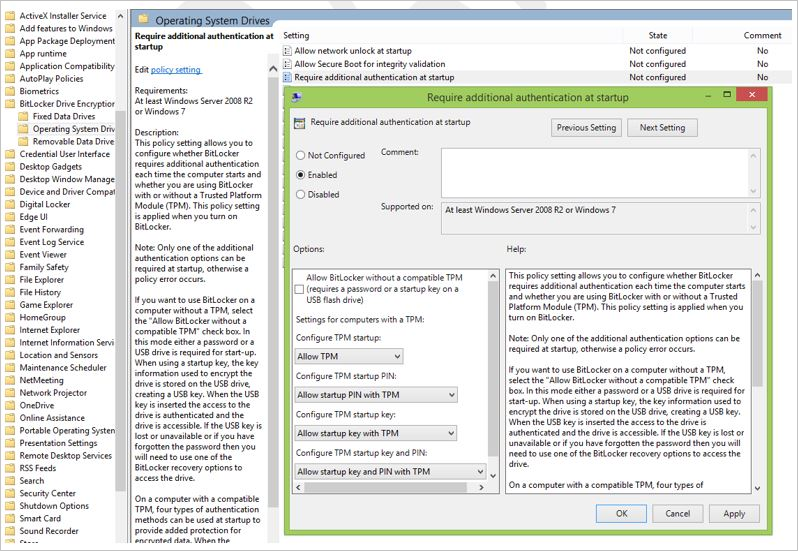
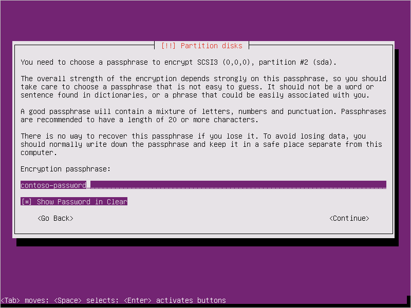

# Appendix for Azure Disk Encryption 
This article is an appendix to [Azure Disk Encryption for IaaS VMs](azure-security-disk-encryption-overview.md). Make sure you read the Azure Disk Encryption for IaaS VMs articles first to understand the context. This article describes how to prepare pre-encrypted VHDs and other tasks.

## Connect to your subscription
Before you start, review the [Prerequisites](azure-security-disk-encryption-prerequisites.md) article. After all the prerequisites have been met, connect to your subscription by running the following cmdlets:

### <a name="bkmk_ConnectPSH"></a> Connect to your subscription with PowerShell

1. Start an Azure PowerShell session, and sign in to your Azure account with the following command:

     ```powershell
     Connect-AzureRmAccount 
     ```
2. If you have multiple subscriptions and want to specify one to use, type the following to see the subscriptions for your account:
     
     ```powershell
     Get-AzureRmSubscription
     ```
3. To specify the subscription you want to use, type:
 
     ```powershell
      Select-AzureRmSubscription -SubscriptionName <Yoursubscriptionname>
     ```
4. To verify that the subscription configured is correct, type:
     
     ```powershell
     Get-AzureRmSubscription
     ```
5. If needed, connect to Azure AD with [Connect-AzureAD](/powershell/module/azuread/connect-azuread).
     
     ```powershell
     Connect-AzureAD
     ```
6. To confirm the Azure Disk Encryption cmdlets are installed, type:
     
     ```powershell
     Get-command *diskencryption*
     ```
                       
7. Review [Getting started with Azure PowerShell](/powershell/azure/get-started-azureps) and [AzureAD](/powershell/module/azuread), if needed.

### <a name="bkmk_ConnectCLI"></a> Connect to your subscription with the Azure CLI

1. Sign in to Azure with [az login](/cli/azure/authenticate-azure-cli#interactive-log-in). 
     
     ```azurecli
     az login
     ```

2. If you would like to select a tenant to sign in under, use:
    
     ```azurecli
     az login --tenant <tenant>
     ```

3. If you have multiple subscriptions and want to specify a specific one, get your subscription list with [az account list](/cli/azure/account#az-account-list) and specify with [az account set](/cli/azure/account#az-account-set).
     
     ```azurecli
     az account list
     az account set --subscription "<subscription name or ID>"
     ```

4. Verify the installed version.
     
     ```azurecli
        az --version
     ``` 

5. Review [Get started with Azure CLI 2.0](/cli/azure/get-started-with-azure-cli) if needed. 

## Sample PowerShell scripts for Azure Disk Encryption 

- **List all encrypted VMs in your subscription**

     ```azurepowershell-interactive
     $osVolEncrypted = {(Get-AzureRmVMDiskEncryptionStatus -ResourceGroupName $_.ResourceGroupName -VMName $_.Name).OsVolumeEncrypted}
     $dataVolEncrypted= {(Get-AzureRmVMDiskEncryptionStatus -ResourceGroupName $_.ResourceGroupName -VMName $_.Name).DataVolumesEncrypted}
     Get-AzureRmVm | Format-Table @{Label="MachineName"; Expression={$_.Name}}, @{Label="OsVolumeEncrypted"; Expression=$osVolEncrypted}, @{Label="DataVolumesEncrypted"; Expression=$dataVolEncrypted}
     ```

- **List all disk encryption secrets used for encrypting VMs in a key vault** 

     ```azurepowershell-interactive
     Get-AzureKeyVaultSecret -VaultName $KeyVaultName | where {$_.Tags.ContainsKey('DiskEncryptionKeyFileName')} | format-table @{Label="MachineName"; Expression={$_.Tags['MachineName']}}, @{Label="VolumeLetter"; Expression={$_.Tags['VolumeLetter']}}, @{Label="EncryptionKeyURL"; Expression={$_.Id}}
     ```

### <a name="bkmk_prereq-script"></a> Using the Azure Disk Encryption prerequisites PowerShell script
If you're already familiar with the prerequisites for Azure Disk Encryption, you can use the [Azure Disk Encryption prerequisites PowerShell script](https://raw.githubusercontent.com/Azure/azure-powershell/master/src/ResourceManager/Compute/Commands.Compute/Extension/AzureDiskEncryption/Scripts/AzureDiskEncryptionPreRequisiteSetup.ps1 ). For an example of using this PowerShell script, see the [Encrypt a VM Quickstart](quick-encrypt-vm-powershell.md). You can remove the comments from a section of the script, starting at line 211, to encrypt all disks for existing VMs in an existing resource group. 

The following table shows which parameters can be used in the PowerShell script: 


|Parameter|Description|Is Mandatory|
|------|------|------|
|$resourceGroupName| Name of the resource group to which the KeyVault belongs to.  A new resource group with this name will be created if one doesn't exist.| True|
|$keyVaultName|Name of the KeyVault in which encryption keys are to be placed. A new vault with this name will be created if one doesn't exist.| True|
|$location|Location of the KeyVault. Make sure the KeyVault and VMs to be encrypted are in the same location. Get a location list with `Get-AzureRMLocation`.|True|
|$subscriptionId|Identifier of the Azure subscription to be used.  You can get your Subscription ID with `Get-AzureRMSubscription`.|True|
|$aadAppName|Name of the Azure AD application that will be used to write secrets to KeyVault. A new application with this name will be created if one doesn't exist. If this app already exists, pass aadClientSecret parameter to the script.|False|
|$aadClientSecret|Client secret of the Azure AD application that was created earlier.|False|
|$keyEncryptionKeyName|Name of optional key encryption key in KeyVault. A new key with this name will be created if one doesn't exist.|False|


## Resource Manager templates

<!--   - [Create a key vault](https://github.com/Azure/azure-quickstart-templates/tree/master/101-key-vault-create) -->

### Encrypt or decrypt VMs without an Azure AD app


- [Enable disk encryption on existing or running IaaS Windows VMs](https://github.com/Azure/azure-quickstart-templates/tree/master/201-encrypt-running-windows-vm-without-aad)
- [Disable disk encryption on existing or running IaaS Windows VMs](https://github.com/Azure/azure-quickstart-templates/tree/master/201-decrypt-running-windows-vm-without-aad)
- [Enable disk encryption on an existing or running IaaS Linux VM](https://github.com/Azure/azure-quickstart-templates/tree/master/201-encrypt-running-linux-vm-without-aad)  
 -  [Disable encryption on a running Linux VM](https://github.com/Azure/azure-quickstart-templates/tree/master/201-decrypt-running-linux-vm-without-aad) 
    - Disabling encryption is only allowed on Data volumes for Linux VMs.  

### Encrypt or decrypt VMs with an Azure AD app (previous release) 
 
- [Enable disk encryption on existing or running IaaS Windows VMs](https://github.com/Azure/azure-quickstart-templates/tree/master/201-encrypt-running-windows-vm)

- [Enable disk encryption on an existing or running IaaS Linux VM](https://github.com/Azure/azure-quickstart-templates/tree/master/201-encrypt-running-linux-vm)    

- [Disable disk encryption on running Windows IaaS](https://github.com/Azure/azure-quickstart-templates/tree/master/201-decrypt-running-windows-vm) 

-  [Disable encryption on a running Linux VM](https://github.com/Azure/azure-quickstart-templates/tree/master/201-decrypt-running-linux-vm) 
    - Disabling encryption is only allowed on Data volumes for Linux VMs. 

- [Enable disk encryption on new IaaS Windows VM from the Marketplace](https://github.com/Azure/azure-quickstart-templates/tree/master/201-encrypt-create-new-vm-gallery-image)
    - This template creates a new encrypted Windows VM that uses the Windows Server 2012 gallery image.

- [Create a new encrypted Windows IaaS Managed Disk VM from gallery image](https://github.com/Azure/azure-quickstart-templates/tree/master/201-encrypt-create-new-vm-gallery-image-managed-disks)
    - This template creates a new encrypted  Windows VM with managed disks using the Windows Server 2012 gallery image.

- [Deployment of RHEL 7.2 with full disk encryption with managed disks](https://github.com/Azure/azure-quickstart-templates/tree/master/101-vm-full-disk-encrypted-rhel)
    - This template creates a fully encrypted RHEL 7.2 VM in Azure using managed disks. It includes an encrypted 30-GB OS drive and an encrypted 200-GB array (RAID-0) mounted at /mnt/raidencrypted. See the [FAQ](azure-security-disk-encryption-faq.md#bkmk_LinuxOSSupport) article for supported Linux server distributions. 

- [Deployment of RHEL 7.2 with full disk encryption with unmanaged disks](https://github.com/Azure/azure-quickstart-templates/tree/master/101-vm-full-disk-encrypted-rhel-unmanaged)
    - This template creates a fully encrypted RHEL 7.2 VM in Azure with an encrypted 30-GB OS drive and an encrypted 200-GB array (RAID-0) mounted at /mnt/raidencrypted. See the [FAQ](azure-security-disk-encryption-faq.md#bkmk_LinuxOSSupport) article for supported Linux server distributions. 

- [Enable disk encryption on a pre-encrypted VHD for Windows or Linux](https://github.com/Azure/azure-quickstart-templates/tree/master/201-encrypt-create-pre-encrypted-vm)

- [Create a new encrypted managed disk from a pre-encrypted VHD/storage blob](https://github.com/Azure/azure-quickstart-templates/tree/master/201-create-encrypted-managed-disk)
    - Creates a new encrypted managed disk provided a pre-encrypted VHD and its corresponding encryption settings

- [Enable disk encryption on a running Windows VM using an Azure AD client certificate thumbprint](https://github.com/Azure/azure-quickstart-templates/tree/master/201-encrypt-running-windows-vm-aad-client-cert)
    
- [Enable disk encryption on a running Linux virtual machine scale set](https://github.com/Azure/azure-quickstart-templates/tree/master/201-encrypt-running-vmss-linux)

- [Enable disk encryption on a running Windows virtual machine scale set](https://github.com/Azure/azure-quickstart-templates/tree/master/201-encrypt-running-vmss-windows)

 - [Deploy a VM Scale Set of Linux VMs with a jumpbox and enables encryption on Linux VMSS](https://github.com/Azure/azure-quickstart-templates/tree/master/201-encrypt-vmss-linux-jumpbox)

 - [Deploy a VM Scale Set of Windows VMs with a jumpbox and enables encryption on Windows VMSS](https://github.com/Azure/azure-quickstart-templates/tree/master/201-encrypt-vmss-windows-jumpbox)

- [Disable disk encryption on a running Linux virtual machine scale set](https://github.com/Azure/azure-quickstart-templates/tree/master/201-decrypt-vmss-linux)

- [Disable disk encryption on a running Windows virtual machine scale set](https://github.com/Azure/azure-quickstart-templates/tree/master/201-decrypt-vmss-windows)

## <a name="bkmk_preWin"></a> Prepare a pre-encrypted Windows VHD
The sections that follow are necessary to prepare a pre-encrypted Windows VHD for deployment as an encrypted VHD in Azure IaaS. Use the information to prepare and boot a fresh Windows VM (VHD) on Azure Site Recovery or Azure. For more information on how to prepare and upload a VHD, see [Upload a generalized VHD and use it to create new VMs in Azure](../virtual-machines/windows/upload-generalized-managed.md).

### Update group policy to allow non-TPM for OS protection
Configure the BitLocker Group Policy setting **BitLocker Drive Encryption**, which you'll find under **Local Computer Policy** > **Computer Configuration** > **Administrative Templates** > **Windows Components**. Change this setting to **Operating System Drives** > **Require additional authentication at startup** > **Allow BitLocker without a compatible TPM**, as shown in the following figure:



### Install BitLocker feature components
For Windows Server 2012 and later, use the following command:

    dism /online /Enable-Feature /all /FeatureName:BitLocker /quiet /norestart

For Windows Server 2008 R2, use the following command:

    ServerManagerCmd -install BitLockers
### Prepare the OS volume for BitLocker by using `bdehdcfg`
To compress the OS partition and prepare the machine for BitLocker, execute the [bdehdcfg](https://docs.microsoft.com/windows/security/information-protection/bitlocker/bitlocker-basic-deployment#using-bitlocker-to-encrypt-volumescommand) if needed:

    bdehdcfg -target c: shrink -quiet 


### Protect the OS volume by using BitLocker
Use the [`manage-bde`](https://technet.microsoft.com/library/ff829849.aspx) command to enable encryption on the boot volume using an external key protector. Also place the external key (.bek file) on the external drive or volume. Encryption is enabled on the system/boot volume after the next reboot.

    manage-bde -on %systemdrive% -sk [ExternalDriveOrVolume]
    reboot

> [!NOTE]
> Prepare the VM with a separate data/resource VHD for getting the external key by using BitLocker.

## <a name="bkmk_LinuxRunning"></a> Encrypting an OS drive on a running Linux VM

### Prerequisites for OS disk encryption

* The VM must be using a distribution compatible with OS disk encryption as listed in the [Azure Disk Encryption FAQ](azure-security-disk-encryption-faq.md#bkmk_LinuxOSSupport) 
* The VM must be created from the Marketplace image in Azure Resource Manager.
* Azure VM with at least 4 GB of RAM (recommended size is 7 GB).
* (For RHEL and CentOS) Disable SELinux. To disable SELinux, see "4.4.2. Disabling SELinux" in the [SELinux User's and Administrator's Guide](https://access.redhat.com/documentation/en-US/Red_Hat_Enterprise_Linux/7/html/SELinux_Users_and_Administrators_Guide/sect-Security-Enhanced_Linux-Working_with_SELinux-Changing_SELinux_Modes.html#sect-Security-Enhanced_Linux-Enabling_and_Disabling_SELinux-Disabling_SELinux) on the VM.
* After you disable SELinux, reboot the VM at least once.

### Steps
1. Create a VM by using one of the distributions specified previously.

 For CentOS 7.2, OS disk encryption is supported via a special image. To use this image, specify "7.2n" as the SKU when you create the VM:

 ```powershell
    Set-AzureRmVMSourceImage -VM $VirtualMachine -PublisherName "OpenLogic" -Offer "CentOS" -Skus "7.2n" -Version "latest"
 ```
2. Configure the VM according to your needs. If you're going to encrypt all the (OS + data) drives, the data drives need to be specified and mountable from /etc/fstab.

 > [!NOTE]
 > Use UUID=... to specify data drives in /etc/fstab instead of specifying the block device name (for example, /dev/sdb1). During encryption, the order of drives changes on the VM. If your VM relies on a specific order of block devices, it will fail to mount them after encryption.

3. Sign out of the SSH sessions.

4. To encrypt the OS, specify volumeType as **All** or **OS** when you enable encryption.

 > [!NOTE]
 > All user-space processes that are not running as `systemd` services should be killed with a `SIGKILL`. Reboot the VM. When you enable OS disk encryption on a running VM, plan on VM downtime.

5. Periodically monitor the progress of encryption by using the instructions in the [next section](#monitoring-os-encryption-progress).

6. After Get-AzureRmVmDiskEncryptionStatus shows "VMRestartPending", restart your VM either by signing in to it or by using the portal, PowerShell, or CLI.
    ```powershell
    C:\> Get-AzureRmVmDiskEncryptionStatus  -ResourceGroupName $ResourceGroupName -VMName $VMName
    -ExtensionName $ExtensionName

    OsVolumeEncrypted          : VMRestartPending
    DataVolumesEncrypted       : NotMounted
    OsVolumeEncryptionSettings : Microsoft.Azure.Management.Compute.Models.DiskEncryptionSettings
    ProgressMessage            : OS disk successfully encrypted, reboot the VM
    ```
Before you reboot, we recommend that you save [boot diagnostics](https://azure.microsoft.com/blog/boot-diagnostics-for-virtual-machines-v2/) of the VM.

## Monitoring OS encryption progress
You can monitor OS encryption progress in three ways:

* Use the `Get-AzureRmVmDiskEncryptionStatus` cmdlet and inspect the ProgressMessage field:
    ```powershell
    OsVolumeEncrypted          : EncryptionInProgress
    DataVolumesEncrypted       : NotMounted
    OsVolumeEncryptionSettings : Microsoft.Azure.Management.Compute.Models.DiskEncryptionSettings
    ProgressMessage            : OS disk encryption started
    ```
 After the VM reaches "OS disk encryption started", it takes about 40 to 50 minutes on a Premium-storage backed VM.

 Because of [issue #388](https://github.com/Azure/WALinuxAgent/issues/388) in WALinuxAgent, `OsVolumeEncrypted` and `DataVolumesEncrypted` show up as `Unknown` in some distributions. With WALinuxAgent version 2.1.5 and later, this issue is fixed automatically. If you see `Unknown` in the output, you can verify disk-encryption status by using the Azure Resource Explorer.

 Go to [Azure Resource Explorer](https://resources.azure.com/), and then expand this hierarchy in the selection panel on left:

 ~~~~
 |-- subscriptions
     |-- [Your subscription]
          |-- resourceGroups
               |-- [Your resource group]
                    |-- providers
                         |-- Microsoft.Compute
                              |-- virtualMachines
                                   |-- [Your virtual machine]
                                        |-- InstanceView
~~~~                

 In the InstanceView, scroll down to see the encryption status of your drives.

 

* Look at [boot diagnostics](https://azure.microsoft.com/blog/boot-diagnostics-for-virtual-machines-v2/). Messages from the ADE extension should be prefixed with `[AzureDiskEncryption]`.

* Sign in to the VM via SSH, and get the extension log from:

    /var/log/azure/Microsoft.Azure.Security.AzureDiskEncryptionForLinux

 We recommend that you don't sign-in to the VM while OS encryption is in progress. Copy the logs only when the other two methods have failed.

## <a name="bkmk_preLinux"></a> Prepare a pre-encrypted Linux VHD
The preparation for pre-encrypted VHDs can vary depending on the distribution. Examples on preparing [Ubuntu 16](#bkmk_Ubuntu),
[openSUSE 13.2](#bkmk_openSUSE), and [CentOS 7](#bkmk_CentOS) are available. 

### <a name="bkmk_Ubuntu"></a> Ubuntu 16
Configure encryption during the distribution installation by doing the following steps:

1. Select **Configure encrypted volumes** when you partition the disks.

 

2. Create a separate boot drive, which must not be encrypted. Encrypt your root drive.

 

3. Provide a passphrase. This is the passphrase that you uploaded to the key vault.

 

4. Finish partitioning.

 

5. When you boot the VM and are asked for a passphrase, use the passphrase you provided in step 3.

 

6. Prepare the VM for uploading into Azure using [these instructions](https://azure.microsoft.com/documentation/articles/virtual-machines-linux-create-upload-ubuntu/). Don't run the last step (deprovisioning the VM) yet.

Configure encryption to work with Azure by doing the following steps:

1. Create a file under /usr/local/sbin/azure_crypt_key.sh, with the content in the following script. Pay attention to the KeyFileName, because it's the passphrase file name used by Azure.

    ```
    #!/bin/sh
    MountPoint=/tmp-keydisk-mount
    KeyFileName=LinuxPassPhraseFileName
    echo "Trying to get the key from disks ..." >&2
    mkdir -p $MountPoint
    modprobe vfat >/dev/null 2>&1
    modprobe ntfs >/dev/null 2>&1
    sleep 2
    OPENED=0
    cd /sys/block
    for DEV in sd*; do

        echo "> Trying device: $DEV ..." >&2
        mount -t vfat -r /dev/${DEV}1 $MountPoint >/dev/null||
        mount -t ntfs -r /dev/${DEV}1 $MountPoint >/dev/null
        if [ -f $MountPoint/$KeyFileName ]; then
                cat $MountPoint/$KeyFileName
                umount $MountPoint 2>/dev/null
                OPENED=1
                break
        fi
        umount $MountPoint 2>/dev/null
    done

      if [ $OPENED -eq 0 ]; then
        echo "FAILED to find suitable passphrase file ..." >&2
        echo -n "Try to enter your password: " >&2
        read -s -r A </dev/console
        echo -n "$A"
     else
        echo "Success loading keyfile!" >&2
    fi
```

2. Change the crypt config in */etc/crypttab*. It should look like this:
 ```
    xxx_crypt uuid=xxxxxxxxxxxxxxxxxxxxx none luks,discard,keyscript=/usr/local/sbin/azure_crypt_key.sh
    ```

3. If you're editing *azure_crypt_key.sh* in Windows and you copied it to Linux, run `dos2unix /usr/local/sbin/azure_crypt_key.sh`.

4. Add executable permissions to the script:
 ```
    chmod +x /usr/local/sbin/azure_crypt_key.sh
 ```
5. Edit */etc/initramfs-tools/modules* by appending lines:
 ```
    vfat
    ntfs
    nls_cp437
    nls_utf8
    nls_iso8859-1
```
6. Run `update-initramfs -u -k all` to update the initramfs to make the `keyscript` take effect.

7. Now you can deprovision the VM.

 

8. Continue to the next step and upload your VHD into Azure.

### <a name="bkmk_openSUSE"></a>  openSUSE 13.2
To configure encryption during the distribution installation, do the following steps:
1. When you partition the disks, select **Encrypt Volume Group**, and then enter a password. This is the password that you'll upload to your key vault.

 

2. Boot the VM using your password.

 

3. Prepare the VM for uploading to Azure by following the instructions in [Prepare a SLES or openSUSE virtual machine for Azure](https://azure.microsoft.com/documentation/articles/virtual-machines-linux-suse-create-upload-vhd/#prepare-opensuse-131). Don't run the last step (deprovisioning the VM) yet.

To configure encryption to work with Azure, do the following steps:
1. Edit the /etc/dracut.conf, and add the following line:
    ```
    add_drivers+=" vfat ntfs nls_cp437 nls_iso8859-1"
    ```
2. Comment out these lines by the end of the file /usr/lib/dracut/modules.d/90crypt/module-setup.sh:
 ```
    #        inst_multiple -o \
    #        $systemdutildir/system-generators/systemd-cryptsetup-generator \
    #        $systemdutildir/systemd-cryptsetup \
    #        $systemdsystemunitdir/systemd-ask-password-console.path \
    #        $systemdsystemunitdir/systemd-ask-password-console.service \
    #        $systemdsystemunitdir/cryptsetup.target \
    #        $systemdsystemunitdir/sysinit.target.wants/cryptsetup.target \
    #        systemd-ask-password systemd-tty-ask-password-agent
    #        inst_script "$moddir"/crypt-run-generator.sh /sbin/crypt-run-generator
 ```

3. Append the following line at the beginning of the file /usr/lib/dracut/modules.d/90crypt/parse-crypt.sh:
 ```
    DRACUT_SYSTEMD=0
 ```
And change all occurrences of:
 ```
    if [ -z "$DRACUT_SYSTEMD" ]; then
 ```
to:
```
    if [ 1 ]; then
```
4. Edit /usr/lib/dracut/modules.d/90crypt/cryptroot-ask.sh and append it to “# Open LUKS device”:

    ```
    MountPoint=/tmp-keydisk-mount
    KeyFileName=LinuxPassPhraseFileName
    echo "Trying to get the key from disks ..." >&2
    mkdir -p $MountPoint >&2
    modprobe vfat >/dev/null >&2
    modprobe ntfs >/dev/null >&2
    for SFS in /dev/sd*; do
    echo "> Trying device:$SFS..." >&2
    mount ${SFS}1 $MountPoint -t vfat -r >&2 ||
    mount ${SFS}1 $MountPoint -t ntfs -r >&2
    if [ -f $MountPoint/$KeyFileName ]; then
        echo "> keyfile got..." >&2
        cp $MountPoint/$KeyFileName /tmp-keyfile >&2
        luksfile=/tmp-keyfile
        umount $MountPoint >&2
        break
    fi
    done
    ```
5. Run `/usr/sbin/dracut -f -v` to update the initrd.

6. Now you can deprovision the VM and upload your VHD into Azure.

### <a name="bkmk_CentOS"></a> CentOS 7
To configure encryption during the distribution installation, do the following steps:
1. Select **Encrypt my data** when you partition disks.

 

2. Make sure **Encrypt** is selected for root partition.

 

3. Provide a passphrase. This is the passphrase that you'll upload to your key vault.

 

4. When you boot the VM and are asked for a passphrase, use the passphrase you provided in step 3.

 

5. Prepare the VM for uploading into Azure by using the "CentOS 7.0+" instructions in [Prepare a CentOS-based virtual machine for Azure](https://azure.microsoft.com/documentation/articles/virtual-machines-linux-create-upload-centos/#centos-70). Don't run the last step (deprovisioning the VM) yet.

6. Now you can deprovision the VM and upload your VHD into Azure.

To configure encryption to work with Azure, do the following steps:

1. Edit the /etc/dracut.conf, and add the following line:
    ```
    add_drivers+=" vfat ntfs nls_cp437 nls_iso8859-1"
    ```

2. Comment out these lines by the end of the file /usr/lib/dracut/modules.d/90crypt/module-setup.sh:
```
    #        inst_multiple -o \
    #        $systemdutildir/system-generators/systemd-cryptsetup-generator \
    #        $systemdutildir/systemd-cryptsetup \
    #        $systemdsystemunitdir/systemd-ask-password-console.path \
    #        $systemdsystemunitdir/systemd-ask-password-console.service \
    #        $systemdsystemunitdir/cryptsetup.target \
    #        $systemdsystemunitdir/sysinit.target.wants/cryptsetup.target \
    #        systemd-ask-password systemd-tty-ask-password-agent
    #        inst_script "$moddir"/crypt-run-generator.sh /sbin/crypt-run-generator
```

3. Append the following line at the beginning of the file /usr/lib/dracut/modules.d/90crypt/parse-crypt.sh:
```
    DRACUT_SYSTEMD=0
```
And change all occurrences of:
```
    if [ -z "$DRACUT_SYSTEMD" ]; then
```
to
```
    if [ 1 ]; then
```
4. Edit /usr/lib/dracut/modules.d/90crypt/cryptroot-ask.sh and append the following after the “# Open LUKS device”:
    ```
    MountPoint=/tmp-keydisk-mount
    KeyFileName=LinuxPassPhraseFileName
    echo "Trying to get the key from disks ..." >&2
    mkdir -p $MountPoint >&2
    modprobe vfat >/dev/null >&2
    modprobe ntfs >/dev/null >&2
    for SFS in /dev/sd*; do
    echo "> Trying device:$SFS..." >&2
    mount ${SFS}1 $MountPoint -t vfat -r >&2 ||
    mount ${SFS}1 $MountPoint -t ntfs -r >&2
    if [ -f $MountPoint/$KeyFileName ]; then
        echo "> keyfile got..." >&2
        cp $MountPoint/$KeyFileName /tmp-keyfile >&2
        luksfile=/tmp-keyfile
        umount $MountPoint >&2
        break
    fi
    done
    ```    
5. Run the “/usr/sbin/dracut -f -v” to update the initrd.


## <a name="bkmk_UploadVHD"></a> Upload encrypted VHD to an Azure storage account
After BitLocker encryption or DM-Crypt encryption is enabled, the local encrypted VHD needs to be uploaded to your storage account.
```powershell
    Add-AzureRmVhd [-Destination] <Uri> [-LocalFilePath] <FileInfo> [[-NumberOfUploaderThreads] <Int32> ] [[-BaseImageUriToPatch] <Uri> ] [[-OverWrite]] [ <CommonParameters>]
```
## <a name="bkmk_UploadSecret"></a> Upload the secret for the pre-encrypted VM to your key vault
When encrypting using an Azure AD app (previous release), the disk-encryption secret that you obtained previously must be uploaded as a secret in your key vault. The key vault needs to have disk encryption and permissions enabled for your Azure AD client.

```powershell 
 $AadClientId = "My-AAD-Client-Id"
 $AadClientSecret = "My-AAD-Client-Secret"

 $key vault = New-AzureRmKeyVault -VaultName $KeyVaultName -ResourceGroupName $ResourceGroupName -Location $Location

 Set-AzureRmKeyVaultAccessPolicy -VaultName $KeyVaultName -ResourceGroupName $ResourceGroupName -ServicePrincipalName $AadClientId -PermissionsToKeys all -PermissionsToSecrets all
 Set-AzureRmKeyVaultAccessPolicy -VaultName $KeyVaultName -ResourceGroupName $ResourceGroupName -EnabledForDiskEncryption
``` 

### <a name="bkmk_SecretnoKEK"></a> Disk encryption secret not encrypted with a KEK
To set up the secret in your key vault, use [Set-AzureKeyVaultSecret](/powershell/module/azurerm.keyvault/set-azurekeyvaultsecret). If you have a Windows virtual machine, the bek file is encoded as a base64 string and then uploaded to your key vault using the `Set-AzureKeyVaultSecret` cmdlet. For Linux, the passphrase is encoded as a base64 string and then uploaded to the key vault. In addition, make sure that the following tags are set when you create the secret in the key vault.

```powershell

 # This is the passphrase that was provided for encryption during the distribution installation
 $passphrase = "contoso-password"

 $tags = @{"DiskEncryptionKeyEncryptionAlgorithm" = "RSA-OAEP"; "DiskEncryptionKeyFileName" = "LinuxPassPhraseFileName"}
 $secretName = [guid]::NewGuid().ToString()
 $secretValue = [Convert]::ToBase64String([System.Text.Encoding]::ASCII.GetBytes($passphrase))
 $secureSecretValue = ConvertTo-SecureString $secretValue -AsPlainText -Force

 $secret = Set-AzureKeyVaultSecret -VaultName $KeyVaultName -Name $secretName -SecretValue $secureSecretValue -tags $tags
 $secretUrl = $secret.Id
```


Use the `$secretUrl` in the next step for [attaching the OS disk without using KEK](#bkmk_URLnoKEK).

### <a name="bkmk_SecretKEK"></a> Disk encryption secret encrypted with a KEK
Before you upload the secret to the key vault, you can optionally encrypt it by using a key encryption key. Use the wrap [API](https://msdn.microsoft.com/library/azure/dn878066.aspx) to first encrypt the secret using the key encryption key. The output of this wrap operation is a base64 URL encoded string, which you can then upload as a secret by using the [`Set-AzureKeyVaultSecret`](/powershell/module/azurerm.keyvault/set-azurekeyvaultsecret) cmdlet.

```powershell
    # This is the passphrase that was provided for encryption during the distribution installation
    $passphrase = "contoso-password"

    Add-AzureKeyVaultKey -VaultName $KeyVaultName -Name "keyencryptionkey" -Destination Software
    $KeyEncryptionKey = Get-AzureKeyVaultKey -VaultName $KeyVault.OriginalVault.Name -Name "keyencryptionkey"

    $apiversion = "2015-06-01"

    ##############################
    # Get Auth URI
    ##############################

    $uri = $KeyVault.VaultUri + "/keys"
    $headers = @{}

    $response = try { Invoke-RestMethod -Method GET -Uri $uri -Headers $headers } catch { $_.Exception.Response }

    $authHeader = $response.Headers["www-authenticate"]
    $authUri = [regex]::match($authHeader, 'authorization="(.*?)"').Groups[1].Value

    Write-Host "Got Auth URI successfully"

    ##############################
    # Get Auth Token
    ##############################

    $uri = $authUri + "/oauth2/token"
    $body = "grant_type=client_credentials"
    $body += "&client_id=" + $AadClientId
    $body += "&client_secret=" + [Uri]::EscapeDataString($AadClientSecret)
    $body += "&resource=" + [Uri]::EscapeDataString("https://vault.azure.net")
    $headers = @{}

    $response = Invoke-RestMethod -Method POST -Uri $uri -Headers $headers -Body $body

    $access_token = $response.access_token

    Write-Host "Got Auth Token successfully"

    ##############################
    # Get KEK info
    ##############################

    $uri = $KeyEncryptionKey.Id + "?api-version=" + $apiversion
    $headers = @{"Authorization" = "Bearer " + $access_token}

    $response = Invoke-RestMethod -Method GET -Uri $uri -Headers $headers

    $keyid = $response.key.kid

    Write-Host "Got KEK info successfully"

    ##############################
    # Encrypt passphrase using KEK
    ##############################

    $passphraseB64 = [Convert]::ToBase64String([System.Text.Encoding]::ASCII.GetBytes($Passphrase))
    $uri = $keyid + "/encrypt?api-version=" + $apiversion
    $headers = @{"Authorization" = "Bearer " + $access_token; "Content-Type" = "application/json"}
    $bodyObj = @{"alg" = "RSA-OAEP"; "value" = $passphraseB64}
    $body = $bodyObj | ConvertTo-Json

    $response = Invoke-RestMethod -Method POST -Uri $uri -Headers $headers -Body $body

    $wrappedSecret = $response.value

    Write-Host "Encrypted passphrase successfully"

    ##############################
    # Store secret
    ##############################

    $secretName = [guid]::NewGuid().ToString()
    $uri = $KeyVault.VaultUri + "/secrets/" + $secretName + "?api-version=" + $apiversion
    $secretAttributes = @{"enabled" = $true}
    $secretTags = @{"DiskEncryptionKeyEncryptionAlgorithm" = "RSA-OAEP"; "DiskEncryptionKeyFileName" = "LinuxPassPhraseFileName"}
    $headers = @{"Authorization" = "Bearer " + $access_token; "Content-Type" = "application/json"}
    $bodyObj = @{"value" = $wrappedSecret; "attributes" = $secretAttributes; "tags" = $secretTags}
    $body = $bodyObj | ConvertTo-Json

    $response = Invoke-RestMethod -Method PUT -Uri $uri -Headers $headers -Body $body

    Write-Host "Stored secret successfully"

    $secretUrl = $response.id
```

Use `$KeyEncryptionKey` and `$secretUrl` in the next step for [attaching the OS disk using KEK](#BKMK_URLKEK).

##  <a name="bkmk_SecretURL"></a> Specify a secret URL when you attach an OS disk

###  <a name="bkmk_URLnoKEK"></a>Without using a KEK
While you're attaching the OS disk, you need to pass `$secretUrl`. The URL was generated in the "Disk-encryption secret not encrypted with a KEK" section.
```powershell
    Set-AzureRmVMOSDisk `
            -VM $VirtualMachine `
            -Name $OSDiskName `
            -SourceImageUri $VhdUri `
            -VhdUri $OSDiskUri `
            -Linux `
            -CreateOption FromImage `
            -DiskEncryptionKeyVaultId $KeyVault.ResourceId `
            -DiskEncryptionKeyUrl $SecretUrl
```
### <a name="bkmk_URLKEK"></a>Using a KEK
When you attach the OS disk, pass `$KeyEncryptionKey` and `$secretUrl`. The URL was generated in the "Disk encryption secret encrypted with a KEK" section.
```powershell
    Set-AzureRmVMOSDisk `
            -VM $VirtualMachine `
            -Name $OSDiskName `
            -SourceImageUri $CopiedTemplateBlobUri `
            -VhdUri $OSDiskUri `
            -Linux `
            -CreateOption FromImage `
            -DiskEncryptionKeyVaultId $KeyVault.ResourceId `
            -DiskEncryptionKeyUrl $SecretUrl `
            -KeyEncryptionKeyVaultId $KeyVault.ResourceId `
            -KeyEncryptionKeyURL $KeyEncryptionKey.Id
```
