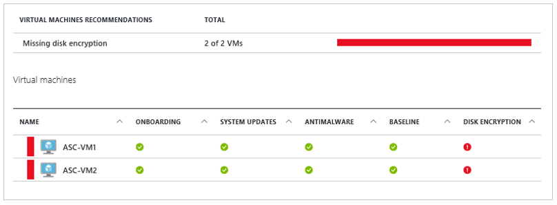
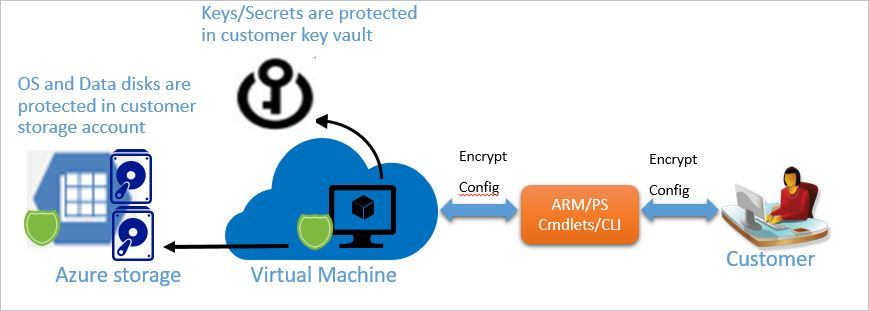

# Azure Disk Encryption overview

Azure Disk Encryption helps protect and safeguard your data to meet your organizational security and compliance commitments. It uses the [BitLocker](https://docs.microsoft.com/windows/security/information-protection/bitlocker/bitlocker-overview) feature of Windows and the [DM-Crypt](https://en.wikipedia.org/wiki/Dm-crypt) feature of Linux to provide volume encryption for the OS and data disks of Azure virtual machines (VMs). It is also integrated with [Azure Key Vault](https://azure.microsoft.com/documentation/services/key-vault/) to help you control and manage the disk encryption keys and secrets, and ensures that all data on the VM disks are encrypted at rest while in Azure storage. Azure Disk Encryption for Windows and Linux VMs is in General Availability in all Azure public regions and Azure Government regions for Standard VMs and VMs with Azure Premium Storage. 

If you use Azure Security Center, you're alerted if you have VMs that aren't encrypted. The alerts show as High Severity and the recommendation is to encrypt these VMs.

> [!NOTE]
> Certain recommendations might increase data, network, or compute resource usage and result in additional license or subscription costs.

## Encryption scenarios

With Azure Disk Encryption, you can address organizational security and compliance requirements by securing your Azure VMs at rest using industry-standard encryption technology. You can also configure VMs to boot under customer-controlled keys and policies (BYOK), and audit the usage of these keys in your key vault.

Azure Disk Encryption supports the following customer scenarios:

* Enabling and disabling encryption on new VMs created from the supported Azure Gallery images.
* Enabling and disabling encryption on existing VMs that run in Azure.
* Enabling and disabling encryption on new Windows VMs created from pre-encrypted VHD and encryption keys.
* Enabling and disabling encryption on Windows virtual machine scale sets.
* Enabling and disabling encryption on data drives for Linux virtual machine scale sets.
* Enabling and disabling encryption of managed disk VMs.
* Updating encryption settings of an existing encrypted Premium and non-Premium Storage VM.
* Backing up and restoring encrypted VMs.
* Bring your own encryption (BYOE) and bring your own key (BYOK) scenarios, in which the customers use their own encryption keys and store them in an Azure key vault.

It also supports the following scenarios for VMs when they're enabled in Microsoft Azure:

* Integration with Azure Key Vault.
* [Standard tier VMs](https://azure.microsoft.com/pricing/details/virtual-machines/) that meet the [minimum memory requirement](azure-security-disk-encryption-prerequisites.md#supported-vm-sizes). 
* Enabling encryption on Windows and Linux VMs, managed disk, and scale set VMs from the supported Azure Gallery images.
* Disabling encryption on OS and data drives for Windows VMs, scale set VMs, and managed disk VMs.
* Disabling encryption on data drives for Linux VMs, scale set VMs, and managed disk VMs.
* Enabling encryption on VMs that run the Windows Client OS.
* Enabling encryption on volumes with mount paths.
* Enabling encryption on Linux VMs that are configured with disk striping (RAID) by using mdadm.
* Enabling encryption on Linux VMs that use LVM for data disks.
* Enabling encryption on the Linux VM OS and data disks.

   > [!NOTE]
   > OS drive encryption for some Linux distributions isn't supported. For more information, see the [Azure Disk Encryption supported operating systems: Linux](azure-security-disk-encryption-prerequisites.md#linux).
   
* Enabling encryption on VMs that are configured with Windows Storage Spaces beginning in Windows Server 2016.
* Back up and restoration of encrypted VMs for both key encryption key (KEK) and non-KEK scenarios.

Azure Disk Encryption does not work for the following scenarios, features, and technology:

* Encrypting basic tier VM or VMs created through the classic VM creation method.
* Disabling encryption on an OS drive or data drive of a Linux VM when the OS drive is encrypted.
* Encrypting OS drive for Linux virtual machine scale sets.
* Encrypting Windows VMs configured with software-based RAID systems.
* Encrypting custom images on Linux VMs.
* Integration with an on-premises key management system.
* Azure Files (shared file system).
* Network File System (NFS).
* Dynamic volumes.

## Encryption features

When you enable and deploy Azure Disk Encryption for Azure VMs, you can configure the following capabilities to be enabled:

* Encrypting the OS volume to protect the boot volume at rest in your storage.
* Encrypting data volumes to protect the data volumes at rest in your storage.
* Disabling encryption on the OS and data drives for Windows VMs.
* Disabling encryption on the data drives for Linux VMs (only when the OS drive isn't encrypted).
* Safeguarding the encryption keys and secrets in your Azure Key Vault subscription.
* Reporting the encryption status of the encrypted VM.
* Removing the disk encryption configuration settings from the VM.
* Backing up and restoring the encrypted VMs by using the Azure Backup service.

Azure Disk Encryption for VMs for Windows and Linux includes:

* [The disk encryption extension for Windows](../virtual-machines/extensions/azure-disk-enc-windows.md).
* [The disk encryption extension for Linux](../virtual-machines/extensions/azure-disk-enc-linux.md).
* [The PowerShell disk encryption cmdlets](/powershell/module/az.compute/set-azvmdiskencryptionextension?view=azps-2.2.0).
* [The Azure CLI disk encryption cmdlets](/cli/azure/vm/encryption?view=azure-cli-latest).
* [The Azure Resource Manager disk encryption templates](azure-security-disk-encryption-appendix.md#resource-manager-templates).

> [!NOTE]
> There's no additional charge to encrypt VM disks with Azure Disk Encryption. Standard [Key Vault pricing](https://azure.microsoft.com/pricing/details/key-vault/) applies to the key vault that's used to store the encryption keys. 

## Encryption workflow

To enable disk encryption for Windows and Linux VMs, do the following steps:

1. Opt in to enable disk encryption via the Azure Disk Encryption Resource Manager template, PowerShell cmdlets, or the Azure CLI, and specify the encryption configuration.

   * For the customer-encrypted VHD scenario, upload the encrypted VHD to your storage account and the encryption key material to your key vault. Then, provide the encryption configuration to enable encryption on a new VM.
   * For new VMs that are created from supported gallery images, and existing VMs that already run in Azure, provide the encryption configuration to enable encryption on the VM.

1. Grant access to the Azure platform to read the encryption key material (BitLocker encryption keys for Windows systems and Passphrase for Linux) from your key vault to enable encryption on the VM.

1. Azure updates the VM service model with encryption and the key vault configuration, and sets up your encrypted VM.

   

## Decryption workflow
To disable disk encryption for VMs, complete the following high-level steps:

1. Choose to disable encryption (decryption) on a running VM in Azure and specify the decryption configuration. You can disable via the Azure Disk Encryption Resource Manager template, PowerShell cmdlets, or the Azure CLI.

   This step disables encryption of the OS or the data volume or both on the running Windows VM. As mentioned in the previous section, disabling OS disk encryption for Linux isn't supported. The decryption step is allowed only for data drives on Linux VMs as long as the OS disk isn't encrypted.

1. Azure updates the VM service model and the VM is marked as decrypted. The contents of the VM are no longer encrypted at rest.

   > [!NOTE]
   > The disable encryption operation doesn't delete your key vault and the encryption key material (BitLocker encryption keys for Windows systems or Passphrase for Linux).
   >
   > Disabling OS disk encryption for Linux isn't supported. The decryption step is allowed only for data drives on Linux VMs.
   >
   > Disabling data disk encryption for Linux isn't supported if the OS drive is encrypted.

## Encryption workflow (previous release)

The new release of Azure Disk Encryption eliminates the requirement to provide an Azure Active Directory (Azure AD) application parameter to enable VM disk encryption. With the new release, you're no longer required to provide an Azure AD credential during the enable encryption step. All new VMs must be encrypted without the Azure AD application parameters when you use the new release. VMs that were already encrypted with Azure AD application parameters are still supported and should continue to be maintained with the Azure AD syntax. To enable disk encryption for Windows and Linux VMs (previous release), do the following steps:

1. Choose an encryption scenario from the scenarios listed in the [Encryption scenarios](#encryption-scenarios) section.

1. Opt in to enable disk encryption via the Azure Disk Encryption Resource Manager template, PowerShell cmdlets, or the Azure CLI, and specify the encryption configuration.

   * For the customer-encrypted VHD scenario, upload the encrypted VHD to your storage account and the encryption key material to your key vault. Then, provide the encryption configuration to enable encryption on a new VM.
   * For new VMs that are created from the Marketplace and existing VMs that already run in Azure, provide the encryption configuration to enable encryption on the VM.

1. Grant access to the Azure platform to read the encryption key material (BitLocker encryption keys for Windows systems and Passphrase for Linux) from your key vault to enable encryption on the VM.

1. Provide the Azure AD application identity to write the encryption key material to your key vault. This step enables encryption on the VM for the scenarios mentioned in step 2.

1. Azure updates the VM service model with encryption and the key vault configuration, and sets up your encrypted VM.

## Terminology
The following table defines some of the common terms used in Azure disk encryption documentation:

| Terminology | Definition |
| --- | --- |
| Azure AD | An [Azure AD](https://azure.microsoft.com/documentation/services/active-directory/) account is used to authenticate, store, and retrieve secrets from a key vault. |
| Azure Key Vault | Key Vault is a cryptographic, key management service that's based on Federal Information Processing Standards (FIPS) validated hardware security modules. These standards help to safeguard your cryptographic keys and sensitive secrets. For more information, see the [Azure Key Vault](https://azure.microsoft.com/services/key-vault/) documentation. |
| BitLocker |[BitLocker](https://technet.microsoft.com/library/hh831713.aspx) is an industry-recognized Windows volume encryption technology that's used to enable disk encryption on Windows VMs. |
| BEK | BitLocker encryption keys (BEK) are used to encrypt the OS boot volume and data volumes. BEKs are safeguarded in a key vault as secrets. |
| Azure CLI | [The Azure CLI](/cli/azure/install-azure-cli) is optimized for managing and administering Azure resources from the command line.|
| DM-Crypt |[DM-Crypt](https://gitlab.com/cryptsetup/cryptsetup/wikis/DMCrypt) is the Linux-based, transparent disk-encryption subsystem that's used to enable disk encryption on Linux VMs. |
| Key encryption key (KEK) | The asymmetric key (RSA 2048) that you can use to protect or wrap the secret. You can provide a hardware security module (HSM)-protected key or software-protected key. For more information, see the [Azure Key Vault](https://azure.microsoft.com/services/key-vault/) documentation. |
| PowerShell cmdlets | For more information, see [Azure PowerShell cmdlets](/powershell/azure/overview). |

## Next steps

To get started, see the [Azure Disk Encryption prerequisites](azure-security-disk-encryption-prerequisites.md).

