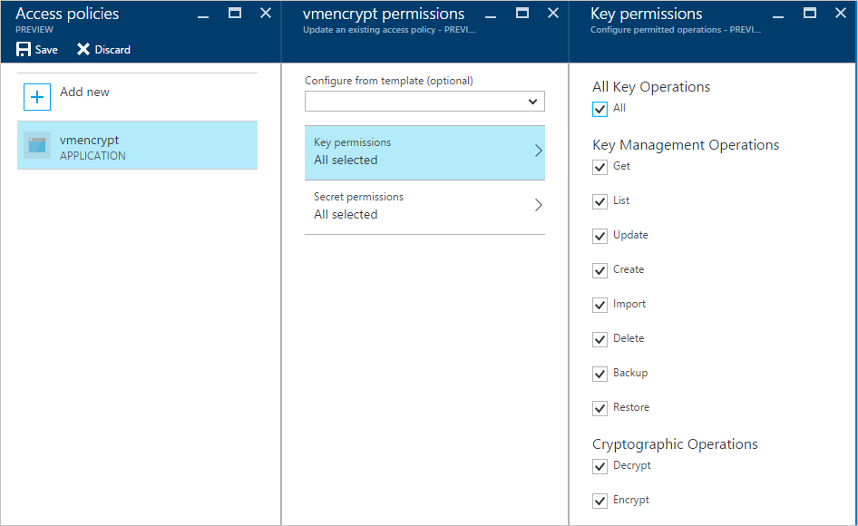
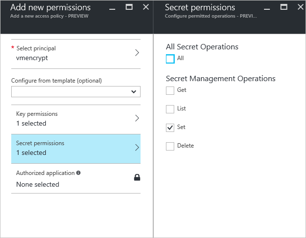

# Azure Disk Encryption prerequisites (previous release)

**The new release of Azure Disk Encryption eliminates the requirement for providing an Azure AD application parameter to enable VM disk encryption. With the new release, you are no longer required to provide Azure AD credentials during the enable encryption step. All new VMs must be encrypted without the Azure AD application parameters using the new release. To view instructions to enable VM disk encryption using the new release, see [Azure Disk Encryption prerequisites](azure-security-disk-encryption-prerequisites.md). VMs that were already encrypted with Azure AD application parameters are still supported and should continue to be maintained with the AAD syntax.**

 This article, Azure Disk Encryption Prerequisites, explains items that need to be in place before you can use Azure Disk Encryption. Along with general prerequisites, Azure Disk Encryption is integrated with [Azure Key Vault](https://docs.microsoft.com/azure/key-vault/) and it uses an Azure AD application to provide authentication in order to manage encryption keys in the key vault. You may also wish to use [Azure PowerShell](/powershell/azure/overview) or the [Azure CLI](/cli/azure/) to set up or configure Key Vault and the Azure AD application.

Before you enable Azure Disk Encryption on Azure IaaS VMs for the supported scenarios that were discussed in the [Azure Disk Encryption Overview](azure-security-disk-encryption-overview.md) article, be sure to have the prerequisites in place. 

> [!WARNING]
> - Certain recommendations might increase data, network, or compute resource usage, resulting in additional license or subscription costs. You must have a valid active Azure subscription to create resources in Azure in the supported regions.
> - If you have previously used [Azure Disk Encryption with Azure AD app](azure-security-disk-encryption-prerequisites-aad.md) to encrypt this VM, you will have to continue use this option to encrypt your VM. You can’t use [Azure Disk Encryption](azure-security-disk-encryption-prerequisites.md) on this encrypted VM as this isn’t a supported scenario, meaning switching away from AAD application for this encrypted VM isn’t supported yet. 

[!INCLUDE [updated-for-az](../../includes/updated-for-az.md)]

## Supported operating systems

### Windows

- Windows client: Windows 8 and later.
- Windows Server: Windows Server 2008 R2 and later.  
 
> [!NOTE] 
> Windows Server 2008 R2 requires the .NET Framework 4.5 to be installed for encryption; install it from Windows Update with the optional update Microsoft .NET Framework 4.5.2 for Windows Server 2008 R2 x64-based systems ([KB2901983](https://www.catalog.update.microsoft.com/Search.aspx?q=KB2901983)).  
>  
> Windows Server 2012 R2 Core and Windows Server 2016 Core requires the bdehdcfg component to be installed on the VM for encryption.

### Linux 

Azure Disk Encryption is supported on a subset of the [Azure-endorsed Linux distributions](../virtual-machines/linux/endorsed-distros.md), which is itself a subset of all Linux server possible distributions.


Linux server distributions that are not endorsed by Azure do not support Azure Disk Encryption and, of those that are endorsed, only the following distributions and versions support Azure Disk Encryption:

| Linux distribution | Version | Volume type supported for encryption|
| --- | --- |--- |
| Ubuntu | 18.04| OS and data disk |
| Ubuntu | 16.04| OS and data disk |
| Ubuntu | 14.04.5</br>[with Azure tuned kernel updated to 4.15 or later](azure-security-disk-encryption-tsg.md#bkmk_Ubuntu14) | OS and data disk |
| RHEL | 7.6 | OS and data disk (see note below) |
| RHEL | 7.5 | OS and data disk (see note below) |
| RHEL | 7.4 | OS and data disk (see note below) |
| RHEL | 7.3 | OS and data disk (see note below) |
| RHEL | 7.2 | OS and data disk (see note below) |
| RHEL | 6.8 | Data disk (see note below) |
| RHEL | 6.7 | Data disk (see note below) |
| CentOS | 7.6 | OS and data disk |
| CentOS | 7.5 | OS and data disk |
| CentOS | 7.4 | OS and data disk |
| CentOS | 7.3 | OS and data disk |
| CentOS | 7.2n | OS and data disk |
| CentOS | 6.8 | Data disk |
| openSUSE | 42.3 | Data disk |
| SLES | 12-SP4 | Data disk |
| SLES | 12-SP3 | Data disk |

> [!NOTE]
> The new ADE implementation is supported for RHEL OS and data disk for RHEL7 Pay-As-You-Go images. ADE is currently not supported for RHEL Bring-Your-Own-Subscription (BYOS) images. See [Azure Disk Encryption for Linux](azure-security-disk-encryption-linux.md) for more information.

- Azure Disk Encryption requires that your key vault and VMs reside in the same Azure region and subscription. Configuring the resources in separate regions causes a failure in enabling the Azure Disk Encryption feature.

#### Additional prerequisites for Linux IaaS VMs 

- Azure Disk Encryption requires the dm-crypt and vfat modules to be present on the system. Removing or disabling vfat from the default image will prevent the system from reading the key volume and obtaining the key needed to unlock the disks on subsequent reboots. System hardening steps that remove the vfat module from the system are not compatible with Azure Disk Encryption. 
- Before enabling encryption, the data disks to be encrypted need to be properly listed in /etc/fstab. Use a persistent block device name for this entry, as device names in the "/dev/sdX" format can't be relied upon to be associated with the same disk across reboots, particularly after encryption is applied. For more detail on this behavior, see: [Troubleshoot Linux VM device name changes](../virtual-machines/linux/troubleshoot-device-names-problems.md)
- Make sure the /etc/fstab settings are configured properly for mounting. To configure these settings, run the mount -a command or reboot the VM and trigger the remount that way. Once that is complete, check the output of the lsblk command to verify that the drive is still mounted. 
  - If the /etc/fstab file doesn't mount the drive properly before enabling encryption, Azure Disk Encryption won't be able to mount it properly.
  - The Azure Disk Encryption process will move the mount information out of /etc/fstab and into its own configuration file as part of the encryption process. Don't be alarmed to see the entry missing from /etc/fstab after data drive encryption completes.
  - Before starting encryption, be sure to stop all services and processes that could be writing to mounted data disks and disable them, so that they do not restart automatically after a reboot. These could keep files open on these partitions, preventing the encryption procedure to remount them, causing failure of the encryption. 
  - After reboot, it will take time for the Azure Disk Encryption process to mount the newly encrypted disks. They won't be immediately available after a reboot. The process needs time to start, unlock, and then mount the encrypted drives before being available for other processes to access. This process may take more than a minute after reboot depending on the system characteristics.

An example of commands that can be used to mount the data disks and create the necessary /etc/fstab entries can be found in [lines 244-248 of this script file](https://github.com/ejarvi/ade-cli-getting-started/blob/master/validate.sh#L244-L248). 

## <a name="bkmk_GPO"></a> Networking and Group Policy

**To enable the Azure Disk Encryption feature using the older AAD parameter syntax, the IaaS VMs must meet the following network endpoint configuration requirements:** 
  - To get a token to connect to your key vault, the IaaS VM must be able to connect to an Azure Active Directory endpoint, \[login.microsoftonline.com\].
  - To write the encryption keys to your key vault, the IaaS VM must be able to connect to the key vault endpoint.
  - The IaaS VM must be able to connect to an Azure storage endpoint that hosts the Azure extension repository and an Azure storage account that hosts the VHD files.
  -  If your security policy limits access from Azure VMs to the Internet, you can resolve the preceding URI and configure a specific rule to allow outbound connectivity to the IPs. For more information, see [Azure Key Vault behind a firewall](../key-vault/key-vault-access-behind-firewall.md).
  - On Windows, if TLS 1.0 has been explicitly disabled and the .NET version has not been updated to 4.6 or higher, the following registry change will enable ADE to select the more recent TLS version:
    
        [HKEY_LOCAL_MACHINE\SOFTWARE\Microsoft\.NETFramework\v4.0.30319]
        "SystemDefaultTlsVersions"=dword:00000001
        "SchUseStrongCrypto"=dword:00000001

        [HKEY_LOCAL_MACHINE\SOFTWARE\WOW6432Node\Microsoft\.NETFramework\v4.0.30319]
        "SystemDefaultTlsVersions"=dword:00000001
        "SchUseStrongCrypto"=dword:00000001` 
     

 


**Group Policy:**
 - The Azure Disk Encryption solution uses the BitLocker external key protector for Windows IaaS VMs. For domain joined VMs, don't push any group policies that enforce TPM protectors. For information about the group policy for “Allow BitLocker without a compatible TPM,” see [BitLocker Group Policy Reference](https://docs.microsoft.com/windows/security/information-protection/bitlocker/bitlocker-group-policy-settings#bkmk-unlockpol1).

-  BitLocker policy on domain joined virtual machines with custom group policy must include the following setting: [Configure user storage of BitLocker recovery information -> Allow 256-bit recovery key](https://docs.microsoft.com/windows/security/information-protection/bitlocker/bitlocker-group-policy-settings). Azure Disk Encryption will fail when custom group policy settings for BitLocker are incompatible. On machines that didn't have the correct policy setting, apply the new policy, force the new policy to update (gpupdate.exe /force), and then restarting may be required.  


## <a name="bkmk_PSH"></a> Azure PowerShell
[Azure PowerShell](/powershell/azure/overview) provides a set of cmdlets that uses the [Azure Resource Manager](../azure-resource-manager/resource-group-overview.md) model for managing your Azure resources. You can use it in your browser with [Azure Cloud Shell](../cloud-shell/overview.md), or you can install it on your local machine using the instructions below to use it in any PowerShell session. If you already have it installed locally, make sure you use the latest version of Azure PowerShell to configure Azure Disk Encryption.

### Install Azure PowerShell for use on your local machine (optional):  
1. [Install and configure Azure PowerShell](/powershell/azure/install-az-ps). 

2. Install the [Azure Active Directory PowerShell module](/powershell/azure/active-directory/install-adv2#installing-the-azure-ad-module). 

     ```powershell
     Install-Module AzureAD
     ```

3. Verify the installed versions of the modules.
      ```powershell
      Get-Module Az -ListAvailable | Select-Object -Property Name,Version,Path
      Get-Module AzureAD -ListAvailable | Select-Object -Property Name,Version,Path
      ```
4. Sign in to Azure using the [Connect-AzAccount](/powershell/module/az.accounts/connect-azaccount) cmdlet.
     
     ```powershell
     Connect-AzAccount
     # For specific instances of Azure, use the -Environment parameter.
     Connect-AzAccount –Environment (Get-AzEnvironment –Name AzureUSGovernment)
    
     <# If you have multiple subscriptions and want to specify a specific one, 
     get your subscription list with Get-AzSubscription and 
     specify it with Set-AzContext.  #>
     Get-AzSubscription
     Set-AzContext -SubscriptionId "xxxx-xxxx-xxxx-xxxx"
     ```

5.  Connect to Azure AD [Connect-AzureAD](/powershell/module/azuread/connect-azuread).
     
     ```powershell
     Connect-AzureAD
     ```

6. Review [Getting started with Azure PowerShell](/powershell/azure/get-started-azureps) and [AzureAD](/powershell/module/azuread), if needed.

## <a name="bkmk_CLI"></a> Azure CLI

The [Azure CLI 2.0](/cli/azure) is a command-line tool for managing Azure resources. The CLI is designed to flexibly query data, support long-running operations as non-blocking processes, and make scripting easy. You can use it in your browser with [Azure Cloud Shell](../cloud-shell/overview.md), or you can install it on your local machine and use it in any PowerShell session.

1. [Install Azure CLI](/cli/azure/install-azure-cli) for use on your local machine (optional):

2. Verify the installed version.
     
     ```azurecli-interactive
     az --version
     ``` 

3. Sign in to Azure using [az login](/cli/azure/authenticate-azure-cli).
     
     ```azurecli
     az login
     
     # If you would like to select a tenant, use: 
     az login --tenant "<tenant>"

     # If you have multiple subscriptions, get your subscription list with az account list and specify with az account set.
     az account list
     az account set --subscription "<subscription name or ID>"
     ```

4. Review [Get started with Azure CLI 2.0](/cli/azure/get-started-with-azure-cli) if needed. 


## Prerequisite workflow for Key Vault and the Azure AD app

If you're already familiar with the Key Vault and Azure AD prerequisites for Azure Disk Encryption, you can use the [Azure Disk Encryption prerequisites PowerShell script](https://raw.githubusercontent.com/Azure/azure-powershell/master/src/Compute/Compute/Extension/AzureDiskEncryption/Scripts/AzureDiskEncryptionPreRequisiteSetup.ps1 ). For more information on using the prerequisites script, see the [Encrypt a VM Quickstart](quick-encrypt-vm-powershell.md) and the [Azure Disk Encryption Appendix](azure-security-disk-encryption-appendix.md#bkmk_prereq-script). 

1. Create a key vault. 
2. Set up an Azure AD application and service principal.
3. Set the key vault access policy for the Azure AD app.
4. Set key vault advanced access policies.
 
## <a name="bkmk_KeyVault"></a> Create a key vault 
Azure Disk Encryption is integrated with [Azure Key Vault](https://azure.microsoft.com/documentation/services/key-vault/) to help you control and manage the disk-encryption keys and secrets in your key vault subscription. You can create a key vault or use an existing one for Azure Disk Encryption. For more information about key vaults, see [Get started with Azure Key Vault](../key-vault/key-vault-get-started.md) and [Secure your key vault](../key-vault/key-vault-secure-your-key-vault.md). You can use a Resource Manager template, Azure PowerShell, or the Azure CLI to create a key vault. 


>[!WARNING]
>In order to make sure the encryption secrets don’t cross regional boundaries, Azure Disk Encryption needs the Key Vault and the VMs to be co-located in the same region. Create and use a Key Vault that is in the same region as the VM to be encrypted. 


### <a name="bkmk_KVPSH"></a> Create a key vault with PowerShell

You can create a key vault with Azure PowerShell using the [New-AzKeyVault](/powershell/module/az.keyvault/New-azKeyVault) cmdlet. For additional cmdlets for Key Vault, see [Az.KeyVault](/powershell/module/az.keyvault/). 

1. If needed, [connect to your Azure subscription](azure-security-disk-encryption-appendix.md#bkmk_ConnectPSH). 
2. Create a new resource group, if needed, with [New-AzResourceGroup](/powershell/module/az.Resources/New-azResourceGroup).  To list data center locations, use [Get-AzLocation](/powershell/module/az.resources/get-azlocation). 
     
     ```azurepowershell-interactive
     # Get-AzLocation 
     New-AzResourceGroup –Name 'MyKeyVaultResourceGroup' –Location 'East US'
     ```

3. Create a new key vault using [New-AzKeyVault](/powershell/module/az.keyvault/New-azKeyVault)
    
      ```azurepowershell-interactive
     New-AzKeyVault -VaultName 'MySecureVault' -ResourceGroupName 'MyKeyVaultResourceGroup' -Location 'East US'
     ```

4. Note the **Vault Name**, **Resource Group Name**, **Resource ID**, **Vault URI**, and the **Object ID** that are returned for later use when you encrypt the disks. 


### <a name="bkmk_KVCLI"></a> Create a key vault with Azure CLI
You can manage your key vault with Azure CLI using the [az keyvault](/cli/azure/keyvault#commands) commands. To create a key vault, use [az keyvault create](/cli/azure/keyvault#az-keyvault-create).

1. If needed, [connect to your Azure subscription](azure-security-disk-encryption-appendix.md#bkmk_ConnectCLI).
2. Create a new resource group, if needed, with [az group create](/cli/azure/group#az-group-create). To  list locations, use [az account list-locations](/cli/azure/account#az-account-list) 
     
     ```azurecli-interactive
     # To list locations: az account list-locations --output table
     az group create -n "MyKeyVaultResourceGroup" -l "East US"
     ```

3. Create a new key vault using [az keyvault create](/cli/azure/keyvault#az-keyvault-create).
    
     ```azurecli-interactive
     az keyvault create --name "MySecureVault" --resource-group "MyKeyVaultResourceGroup" --location "East US"
     ```

4. Note the **Vault Name** (name), **Resource Group Name**, **Resource ID** (ID), **Vault URI**, and the **Object ID** that are returned for use later. 

### <a name="bkmk_KVRM"></a> Create a key vault with a Resource Manager template

You can create a key vault by using the [Resource Manager template](https://github.com/Azure/azure-quickstart-templates/tree/master/101-key-vault-create).

1. On the Azure quickstart template, click **Deploy to Azure**.
2. Select the subscription, resource group, resource group location, Key Vault name, Object ID,  legal terms, and agreement, and then click **Purchase**. 


## <a name="bkmk_ADapp"></a> Set up an Azure AD app and service principal 
When you need encryption to be enabled on a running VM in Azure, Azure Disk Encryption generates and writes the encryption keys to your key vault. Managing encryption keys in your key vault requires Azure AD authentication. Create an Azure AD application for this purpose. For authentication purposes, you can use either client secret-based authentication or [client certificate-based Azure AD authentication](../active-directory/authentication/active-directory-certificate-based-authentication-get-started.md).


### <a name="bkmk_ADappPSH"></a> Set up an Azure AD app and service principal with Azure PowerShell 
To execute the following commands, get and use the [Azure AD PowerShell module](/powershell/azure/active-directory/install-adv2). 

1. If needed, [connect to your Azure subscription](azure-security-disk-encryption-appendix.md#bkmk_ConnectPSH).
2. Use the [New-AzADApplication](/powershell/module/az.resources/new-azadapplication) PowerShell cmdlet to create an Azure AD application. MyApplicationHomePage and the MyApplicationUri can be any values you wish.

     ```azurepowershell
     $aadClientSecret = "My AAD client secret"
     $aadClientSecretSec = ConvertTo-SecureString -String $aadClientSecret -AsPlainText -Force
     $azureAdApplication = New-AzADApplication -DisplayName "My Application Display Name" -HomePage "https://MyApplicationHomePage" -IdentifierUris "https://MyApplicationUri" -Password $aadClientSecretSec
     $servicePrincipal = New-AzADServicePrincipal –ApplicationId $azureAdApplication.ApplicationId
     ```

3. The $azureAdApplication.ApplicationId is the Azure AD ClientID and the $aadClientSecret is the client secret that you will use later to enable Azure Disk Encryption. Safeguard the Azure AD client secret appropriately. Running `$azureAdApplication.ApplicationId` will show you the ApplicationID.


### <a name="bkmk_ADappCLI"></a> Set up an Azure AD app and service principal with Azure CLI

You can manage your service principals with Azure CLI using the [az ad sp](/cli/azure/ad/sp) commands. For more information, see [Create an Azure service principal](/cli/azure/create-an-azure-service-principal-azure-cli).

1. If needed, [connect to your Azure subscription](azure-security-disk-encryption-appendix.md#bkmk_ConnectCLI).
2. Create a new service principal.
     
     ```azurecli-interactive
     az ad sp create-for-rbac --name "ServicePrincipalName" --password "My-AAD-client-secret" --skip-assignment 
     ```
3.  The appId returned is the Azure AD ClientID used in other commands. It's also the SPN you'll use for az keyvault set-policy. The password is the client secret that you should use later to enable Azure Disk Encryption. Safeguard the Azure AD client secret appropriately.
 
### <a name="bkmk_ADappRM"></a> Set up an Azure AD app and service principal though the Azure portal
Use the steps from the [Use portal to create an Azure Active Directory application and service principal that can access resources](../active-directory/develop/howto-create-service-principal-portal.md) article to create an Azure AD application. Each step listed below will take you directly to the article section to complete. 

1. [Verify required permissions](../active-directory/develop/howto-create-service-principal-portal.md#required-permissions)
2. [Create an Azure Active Directory application](../active-directory/develop/howto-create-service-principal-portal.md#create-an-azure-active-directory-application) 
     - You can use any name and sign-on URL you would like when creating the application.
3. [Get the application ID and the authentication key](../active-directory/develop/howto-create-service-principal-portal.md#get-values-for-signing-in). 
     - The authentication key is the client secret and is used as the AadClientSecret for Set-AzVMDiskEncryptionExtension. 
        - The authentication key is used by the application as a credential to sign in to Azure AD. In the Azure portal, this secret is called keys, but has no relation to key vaults. Secure this secret appropriately. 
     - The application ID will be used later as the AadClientId for Set-AzVMDiskEncryptionExtension and as the ServicePrincipalName for Set-AzKeyVaultAccessPolicy. 

## <a name="bkmk_KVAP"></a> Set the key vault access policy for the Azure AD app
To write encryption secrets to a specified Key Vault, Azure Disk Encryption needs the Client ID and the Client Secret of the Azure Active Directory application that has permissions to write secrets to the Key Vault. 

> [!NOTE]
> Azure Disk Encryption requires you to configure the following access policies to your Azure AD client application: _WrapKey_ and _Set_ permissions.

### <a name="bkmk_KVAPPSH"></a> Set the key vault access policy for the Azure AD app with Azure PowerShell
Your Azure AD application needs rights to access the keys or secrets in the vault. Use the [Set-AzKeyVaultAccessPolicy](/powershell/module/az.keyvault/set-azkeyvaultaccesspolicy) cmdlet to grant permissions to the application, using the client ID (which was generated when the application was registered) as the _–ServicePrincipalName_ parameter value. To learn more, see the blog post [Azure Key Vault - Step by Step](https://blogs.technet.com/b/kv/archive/2015/06/02/azure-key-vault-step-by-step.aspx). 

1. If needed, [connect to your Azure subscription](azure-security-disk-encryption-appendix.md#bkmk_ConnectPSH).
2. Set the key vault access policy for the AD application with PowerShell.

     ```azurepowershell
     $keyVaultName = 'MySecureVault'
     $aadClientID = 'MyAadAppClientID'
     $KVRGname = 'MyKeyVaultResourceGroup'
     Set-AzKeyVaultAccessPolicy -VaultName $keyVaultName -ServicePrincipalName $aadClientID -PermissionsToKeys 'WrapKey' -PermissionsToSecrets 'Set' -ResourceGroupName $KVRGname
     ```

### <a name="bkmk_KVAPCLI"></a> Set the key vault access policy for the Azure AD app with Azure CLI
Use [az keyvault set-policy](/cli/azure/keyvault#az-keyvault-set-policy) to set the access policy. For more information, see [Manage Key Vault using CLI 2.0](../key-vault/key-vault-manage-with-cli2.md#authorizing-an-application-to-use-a-key-or-secret).

1. If needed, [connect to your Azure subscription](azure-security-disk-encryption-appendix.md#bkmk_ConnectCLI).
2. Give the service principal you created via the Azure CLI access to get secrets and wrap keys with the following command:
 
     ```azurecli-interactive
     az keyvault set-policy --name "MySecureVault" --spn "<spn created with CLI/the Azure AD ClientID>" --key-permissions wrapKey --secret-permissions set
     ```

### <a name="bkmk_KVAPRM"></a> Set the key vault access policy for the Azure AD app with the portal

1. Open the resource group with your key vault.
2. Select your key vault, go to **Access Policies**, then click **Add new**.
3. Under **Select principal**, search for the Azure AD application you created and select it. 
4. For **Key permissions**, check **Wrap Key** under **Cryptographic Operations**.
5. For **Secret permissions**, check **Set** under **Secret Management Operations**.
6. Click **OK** to save the access policy. 





## <a name="bkmk_KVper"></a> Set key vault advanced access policies
The Azure platform needs access to the encryption keys or secrets in your key vault to make them available to the VM for booting and decrypting the volumes. Enable disk encryption on the key vault or deployments will fail.  

### <a name="bkmk_KVperPSH"></a> Set key vault advanced access policies with Azure PowerShell
 Use the key vault PowerShell cmdlet [Set-AzKeyVaultAccessPolicy](/powershell/module/az.keyvault/set-azkeyvaultaccesspolicy) to enable disk encryption for the key vault.

  - **Enable Key Vault for disk encryption:** EnabledForDiskEncryption is required for Azure Disk encryption.
      
     ```azurepowershell-interactive 
     Set-AzKeyVaultAccessPolicy -VaultName 'MySecureVault' -ResourceGroupName 'MyKeyVaultResourceGroup' -EnabledForDiskEncryption
     ```

  - **Enable Key Vault for deployment, if needed:** Enables the Microsoft.Compute resource provider to retrieve secrets from this key vault when this key vault is referenced in resource creation, for example when creating a virtual machine.

     ```azurepowershell-interactive
      Set-AzKeyVaultAccessPolicy -VaultName 'MySecureVault' -ResourceGroupName 'MyKeyVaultResourceGroup' -EnabledForDeployment
     ```

  - **Enable Key Vault for template deployment, if needed:** Enables Azure Resource Manager to get secrets from this key vault when this key vault is referenced in a template deployment.

     ```azurepowershell-interactive             
     Set-AzKeyVaultAccessPolicy -VaultName 'MySecureVault' -ResourceGroupName 'MyKeyVaultResourceGroup' -EnabledForTemplateDeployment
     ```

### <a name="bkmk_KVperCLI"></a> Set key vault advanced access policies using the Azure CLI
Use [az keyvault update](/cli/azure/keyvault#az-keyvault-update) to enable disk encryption for the key vault. 

 - **Enable Key Vault for disk encryption:** Enabled-for-disk-encryption is required. 

     ```azurecli-interactive
     az keyvault update --name "MySecureVault" --resource-group "MyKeyVaultResourceGroup" --enabled-for-disk-encryption "true"
     ```  

 - **Enable Key Vault for deployment, if needed:** Allow Virtual Machines to retrieve certificates stored as secrets from the vault.
     ```azurecli-interactive
     az keyvault update --name "MySecureVault" --resource-group "MyKeyVaultResourceGroup" --enabled-for-deployment "true"
     ``` 

 - **Enable Key Vault for template deployment, if needed:** Allow Resource Manager to retrieve secrets from the vault.
     ```azurecli-interactive  
     az keyvault update --name "MySecureVault" --resource-group "MyKeyVaultResourceGroup" --enabled-for-template-deployment "true"
     ```


### <a name="bkmk_KVperrm"></a> Set key vault advanced access policies through the Azure portal

1. Select your keyvault, go to **Access Policies**, and **Click to show advanced access policies**.
2. Select the box labeled **Enable access to Azure Disk Encryption for volume encryption**.
3. Select **Enable access to Azure Virtual Machines for deployment** and/or **Enable Access to Azure Resource Manager for template deployment**, if needed. 
4. Click **Save**.


## <a name="bkmk_KEK"></a> Set up a key encryption key (optional)
If you want to use a key encryption key (KEK) for an additional layer of security for encryption keys, add a KEK to your key vault. Use the [Add-AzKeyVaultKey](/powershell/module/az.keyvault/add-azkeyvaultkey) cmdlet to create a key encryption key in the key vault. You can also import a KEK from your on-premises key management HSM. For more information, see [Key Vault Documentation](../key-vault/key-vault-hsm-protected-keys.md). When a key encryption key is specified, Azure Disk Encryption uses that key to wrap the encryption secrets before writing to Key Vault. 

* When generating keys, use an RSA key type. Azure Disk Encryption does not yet support using Elliptic Curve keys.

* Your key vault secret and KEK URLs must be versioned. Azure enforces this restriction of versioning. For valid secret and KEK URLs, see the following examples:

  * Example of a valid secret URL:
      *https://contosovault.vault.azure.net/secrets/EncryptionSecretWithKek/xxxxxxxxxxxxxxxxxxxxxxxxxxxxxxxx*
  * Example of a valid KEK URL:
      *https://contosovault.vault.azure.net/keys/diskencryptionkek/xxxxxxxxxxxxxxxxxxxxxxxxxxxxxxxx*

* Azure Disk Encryption doesn't support specifying port numbers as part of key vault secrets and KEK URLs. For examples of non-supported and supported key vault URLs, see the following examples:

  * Unacceptable key vault URL
     *https://contosovault.vault.azure.net:443/secrets/contososecret/xxxxxxxxxxxxxxxxxxxxxxxxxxxxxxxx*
  * Acceptable key vault URL:
      *https://contosovault.vault.azure.net/secrets/contososecret/xxxxxxxxxxxxxxxxxxxxxxxxxxxxxxxx*

### <a name="bkmk_KEKPSH"></a> Set up a key encryption key with Azure PowerShell 
Before using the PowerShell script, you should be familiar with the Azure Disk Encryption prerequisites to understand the steps in the script. The sample script might need changes for your environment. This script creates all Azure Disk Encryption prerequisites and encrypts an existing IaaS VM, wrapping the disk encryption key by using a key encryption key. 

 ```powershell
 # Step 1: Create a new resource group and key vault in the same location.
	 # Fill in 'MyLocation', 'MyKeyVaultResourceGroup', and 'MySecureVault' with your values.
	 # Use Get-AzLocation to get available locations and use the DisplayName.
	 # To use an existing resource group, comment out the line for New-AzResourceGroup
	 
     $Loc = 'MyLocation';
     $KVRGname = 'MyKeyVaultResourceGroup';
     $KeyVaultName = 'MySecureVault'; 
     New-AzResourceGroup –Name  $KVRGname –Location $Loc;
     New-AzKeyVault -VaultName $KeyVaultName -ResourceGroupName $KVRGname -Location $Loc;
     $KeyVault = Get-AzKeyVault -VaultName $KeyVaultName -ResourceGroupName  $KVRGname;
     $KeyVaultResourceId = (Get-AzKeyVault -VaultName $KeyVaultName -ResourceGroupName  $KVRGname).ResourceId;
     $diskEncryptionKeyVaultUrl = (Get-AzKeyVault -VaultName $KeyVaultName -ResourceGroupName  $KVRGname).VaultUri;
	 
 # Step 2: Create the AD application and service principal.
	 # Fill in 'MyAADClientSecret', "<My Application Display Name>", "<https://MyApplicationHomePage>", and "<https://MyApplicationUri>" with your values.
	 # MyApplicationHomePage and the MyApplicationUri can be any values you wish.
	 
	 $aadClientSecret =  'MyAADClientSecret';
     $aadClientSecretSec = ConvertTo-SecureString -String $aadClientSecret -AsPlainText -Force;
     $azureAdApplication = New-AzADApplication -DisplayName "<My Application Display Name>" -HomePage "<https://MyApplicationHomePage>" -IdentifierUris "<https://MyApplicationUri>" -Password $aadClientSecretSec
     $servicePrincipal = New-AzADServicePrincipal –ApplicationId $azureAdApplication.ApplicationId;
     $aadClientID = $azureAdApplication.ApplicationId;
	 
 #Step 3: Enable the vault for disk encryption and set the access policy for the Azure AD application.
	 
	 Set-AzKeyVaultAccessPolicy -VaultName $KeyVaultName -ResourceGroupName $KVRGname -EnabledForDiskEncryption;
     Set-AzKeyVaultAccessPolicy -VaultName $keyVaultName -ServicePrincipalName $aadClientID -PermissionsToKeys 'WrapKey' -PermissionsToSecrets 'Set' -ResourceGroupName  $KVRGname;
	 
 #Step 4: Create a new key in the key vault with the Add-AzKeyVaultKey cmdlet.
	 # Fill in 'MyKeyEncryptionKey' with your value.
	 
	 $keyEncryptionKeyName = 'MyKeyEncryptionKey';
     Add-AzKeyVaultKey -VaultName $KeyVaultName -Name $keyEncryptionKeyName -Destination 'Software';
     $keyEncryptionKeyUrl = (Get-AzKeyVaultKey -VaultName $KeyVaultName -Name $keyEncryptionKeyName).Key.kid;
	 
 #Step 5: Encrypt the disks of an existing IaaS VM
	 # Fill in 'MySecureVM' and 'MyVirtualMachineResourceGroup' with your values. 
	 
	 $VMName = 'MySecureVM';
      $VMRGName = 'MyVirtualMachineResourceGroup';
     Set-AzVMDiskEncryptionExtension -ResourceGroupName $VMRGName -VMName $vmName -AadClientID $aadClientID -AadClientSecret $aadClientSecret -DiskEncryptionKeyVaultUrl $diskEncryptionKeyVaultUrl -DiskEncryptionKeyVaultId $KeyVaultResourceId -KeyEncryptionKeyUrl $keyEncryptionKeyUrl -KeyEncryptionKeyVaultId $KeyVaultResourceId;
```

## <a name="bkmk_Cert"></a> Certificate-based authentication (optional)
If you would like to use certificate authentication, you can upload one to your key vault and deploy it to the client. Before using the PowerShell script, you should be familiar with the Azure Disk Encryption prerequisites to understand the steps in the script. The sample script might need changes for your environment.

     
 ```powershell

 # Fill in "MyKeyVaultResourceGroup", "MySecureVault", and 'MyLocation' ('My location' only if needed)

   $KVRGname = 'MyKeyVaultResourceGroup'
   $KeyVaultName= 'MySecureVault'

   # Create a key vault and set enabledForDiskEncryption property on it. 
   # Comment out the next three lines if you already have an existing key vault enabled for encryption. No need to set 'My location' in this case.

   $Loc = 'MyLocation'
   New-AzKeyVault -VaultName $KeyVaultName -ResourceGroupName $KVRGname -Location $Loc
   Set-AzKeyVaultAccessPolicy -VaultName $KeyVaultName -ResourceGroupName $KVRGname -EnabledForDiskEncryption

   #Setting some variables with the key vault information 
   $KeyVault = Get-AzKeyVault -VaultName $KeyVaultName -ResourceGroupName $KVRGname
   $DiskEncryptionKeyVaultUrl = $KeyVault.VaultUri
   $KeyVaultResourceId = $KeyVault.ResourceId

   # Create the Azure AD application and associate the certificate with it. 
   # Fill in "C:\certificates\mycert.pfx", "Password", "<My Application Display Name>", "<https://MyApplicationHomePage>", and "<https://MyApplicationUri>" with your values.
   # MyApplicationHomePage and the MyApplicationUri can be any values you wish

   $CertPath = "C:\certificates\mycert.pfx"
   $CertPassword = "Password"
   $Cert = New-Object System.Security.Cryptography.X509Certificates.X509Certificate2($CertPath, $CertPassword)
   $CertValue = [System.Convert]::ToBase64String($cert.GetRawCertData())

   $AzureAdApplication = New-AzADApplication -DisplayName "<My Application Display Name>" -HomePage "<https://MyApplicationHomePage>" -IdentifierUris "<https://MyApplicationUri>" -CertValue $CertValue 
   $ServicePrincipal = New-AzADServicePrincipal -ApplicationId $AzureAdApplication.ApplicationId

   $AADClientID = $AzureAdApplication.ApplicationId
   $aadClientCertThumbprint= $cert.Thumbprint

   Set-AzKeyVaultAccessPolicy -VaultName $keyVaultName -ServicePrincipalName $aadClientID -PermissionsToKeys 'WrapKey' -PermissionsToSecrets 'Set' -ResourceGroupName $KVRGname
   
   # Upload the pfx file to the key vault. 
   # Fill in "MyAADCert".  

   $KeyVaultSecretName = "MyAADCert"
   $FileContentBytes = get-content $CertPath -Encoding Byte
   $FileContentEncoded = [System.Convert]::ToBase64String($fileContentBytes)
           $JSONObject = @"
           { 
               "data" : "$filecontentencoded", 
               "dataType" : "pfx", 
               "password" : "$CertPassword" 
           } 
"@

   $JSONObjectBytes = [System.Text.Encoding]::UTF8.GetBytes($jsonObject)
   $JSONEncoded = [System.Convert]::ToBase64String($jsonObjectBytes)

   #Set the secret and set the key vault policy for -EnabledForDeployment

   $Secret = ConvertTo-SecureString -String $JSONEncoded -AsPlainText -Force
   Set-AzKeyVaultSecret -VaultName $KeyVaultName -Name $KeyVaultSecretName -SecretValue $Secret
   Set-AzKeyVaultAccessPolicy -VaultName $KeyVaultName -ResourceGroupName $KVRGname -EnabledForDeployment

   # Deploy the certificate to the VM
   # Fill in 'MySecureVM' and 'MyVirtualMachineResourceGroup' with your values.

   $VMName = 'MySecureVM'
   $VMRGName = 'MyVirtualMachineResourceGroup'
   $CertUrl = (Get-AzKeyVaultSecret -VaultName $KeyVaultName -Name $KeyVaultSecretName).Id
   $SourceVaultId = (Get-AzKeyVault -VaultName $KeyVaultName -ResourceGroupName $KVRGName).ResourceId
   $VM = Get-AzVM -ResourceGroupName $VMRGName -Name $VMName 
   $VM = Add-AzVMSecret -VM $VM -SourceVaultId $SourceVaultId -CertificateStore "My" -CertificateUrl $CertUrl
   Update-AzVM -VM $VM -ResourceGroupName $VMRGName 

   #Enable encryption on the VM using Azure AD client ID and the client certificate thumbprint

   Set-AzVMDiskEncryptionExtension -ResourceGroupName $VMRGName -VMName $VMName -AadClientID $AADClientID -AadClientCertThumbprint $AADClientCertThumbprint -DiskEncryptionKeyVaultUrl $DiskEncryptionKeyVaultUrl -DiskEncryptionKeyVaultId $KeyVaultResourceId
 ```

## <a name="bkmk_CertKEK"></a> Certificate-based authentication and a KEK (optional)

If you would like to use certificate authentication and wrap the encryption key with a KEK, you can use the below script as an example. Before using the PowerShell script, you should be familiar with  all of the previous Azure Disk Encryption prerequisites to understand the steps in the script. The sample script might need changes for your environment.

> [!IMPORTANT]
> Azure AD certificate-based authentication is currently not supported on Linux VMs.


     
 ```powershell
# Fill in 'MyKeyVaultResourceGroup', 'MySecureVault', and 'MyLocation' (if needed)

   $KVRGname = 'MyKeyVaultResourceGroup'
   $KeyVaultName= 'MySecureVault'

   # Create a key vault and set enabledForDiskEncryption property on it. 
   # Comment out the next three lines if you already have an existing key vault enabled for encryption.

   $Loc = 'MyLocation'
   New-AzKeyVault -VaultName $KeyVaultName -ResourceGroupName $KVRGname -Location $Loc
   Set-AzKeyVaultAccessPolicy -VaultName $KeyVaultName -ResourceGroupName $KVRGname -EnabledForDiskEncryption

   # Create the Azure AD application and associate the certificate with it.  
   # Fill in "C:\certificates\mycert.pfx", "Password", "<My Application Display Name>", "<https://MyApplicationHomePage>", and "<https://MyApplicationUri>" with your values.
   # MyApplicationHomePage and the MyApplicationUri can be any values you wish

   $CertPath = "C:\certificates\mycert.pfx"
   $CertPassword = "Password"
   $Cert = New-Object System.Security.Cryptography.X509Certificates.X509Certificate2($CertPath, $CertPassword)
   $CertValue = [System.Convert]::ToBase64String($cert.GetRawCertData())

   $AzureAdApplication = New-AzADApplication -DisplayName "<My Application Display Name>" -HomePage "<https://MyApplicationHomePage>" -IdentifierUris "<https://MyApplicationUri>" -CertValue $CertValue 
   $ServicePrincipal = New-AzADServicePrincipal -ApplicationId $AzureAdApplication.ApplicationId

   $AADClientID = $AzureAdApplication.ApplicationId
   $aadClientCertThumbprint= $cert.Thumbprint

   ## Give access for setting secrets and wraping keys
   Set-AzKeyVaultAccessPolicy -VaultName $keyVaultName -ServicePrincipalName $aadClientID -PermissionsToKeys 'WrapKey' -PermissionsToSecrets 'Set' -ResourceGroupName $KVRGname

   # Upload the pfx file to the key vault. 
   # Fill in "MyAADCert". 

   $KeyVaultSecretName = "MyAADCert"
   $FileContentBytes = get-content $CertPath -Encoding Byte
   $FileContentEncoded = [System.Convert]::ToBase64String($fileContentBytes)
           $JSONObject = @"
           { 
               "data" : "$filecontentencoded", 
               "dataType" : "pfx", 
               "password" : "$CertPassword" 
           } 
"@

   $JSONObjectBytes = [System.Text.Encoding]::UTF8.GetBytes($jsonObject)
   $JSONEncoded = [System.Convert]::ToBase64String($jsonObjectBytes)

   #Set the secret and set the key vault policy for deployment

   $Secret = ConvertTo-SecureString -String $JSONEncoded -AsPlainText -Force
   Set-AzKeyVaultSecret -VaultName $KeyVaultName -Name $KeyVaultSecretName -SecretValue $Secret
   Set-AzKeyVaultAccessPolicy -VaultName $KeyVaultName -ResourceGroupName $KVRGname -EnabledForDeployment

   #Setting some variables with the key vault information and generating a KEK 
   # FIll in 'KEKName'
   
   $KEKName ='KEKName'
   $KeyVault = Get-AzKeyVault -VaultName $KeyVaultName -ResourceGroupName $KVRGname
   $DiskEncryptionKeyVaultUrl = $KeyVault.VaultUri
   $KeyVaultResourceId = $KeyVault.ResourceId
   $KEK = Add-AzKeyVaultKey -VaultName $KeyVaultName -Name $KEKName -Destination "Software"
   $KeyEncryptionKeyUrl = $KEK.Key.kid


   # Deploy the certificate to the VM
   # Fill in 'MySecureVM' and 'MyVirtualMachineResourceGroup' with your values.

   $VMName = 'MySecureVM';
   $VMRGName = 'MyVirtualMachineResourceGroup';
   $CertUrl = (Get-AzKeyVaultSecret -VaultName $KeyVaultName -Name $KeyVaultSecretName).Id
   $SourceVaultId = (Get-AzKeyVault -VaultName $KeyVaultName -ResourceGroupName $KVRGName).ResourceId
   $VM = Get-AzVM -ResourceGroupName $VMRGName -Name $VMName 
   $VM = Add-AzVMSecret -VM $VM -SourceVaultId $SourceVaultId -CertificateStore "My" -CertificateUrl $CertUrl
   Update-AzVM -VM $VM -ResourceGroupName $VMRGName

   #Enable encryption on the VM using Azure AD client ID and the client certificate thumbprint

   Set-AzVMDiskEncryptionExtension -ResourceGroupName $VMRGName -VMName $VMName -AadClientID $AADClientID -AadClientCertThumbprint $AADClientCertThumbprint -DiskEncryptionKeyVaultUrl $DiskEncryptionKeyVaultUrl -DiskEncryptionKeyVaultId $KeyVaultResourceId -KeyEncryptionKeyUrl $keyEncryptionKeyUrl -KeyEncryptionKeyVaultId $KeyVaultResourceId
```

 
## Next steps
> [!div class="nextstepaction"]
> [Enable Azure Disk Encryption for Windows](azure-security-disk-encryption-windows-aad.md)

> [!div class="nextstepaction"]
> [Enable Azure Disk Encryption for Linux](azure-security-disk-encryption-linux-aad.md)
