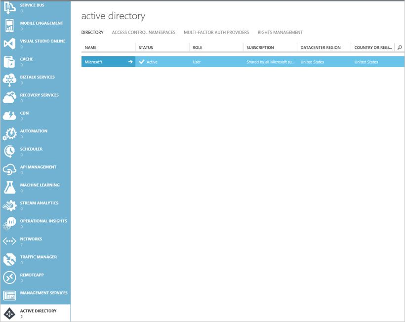
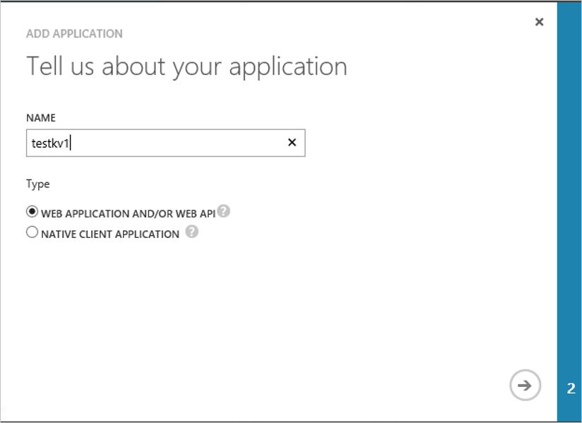
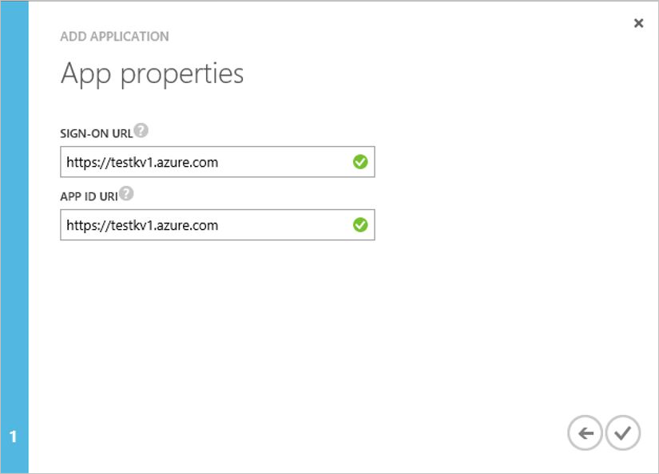
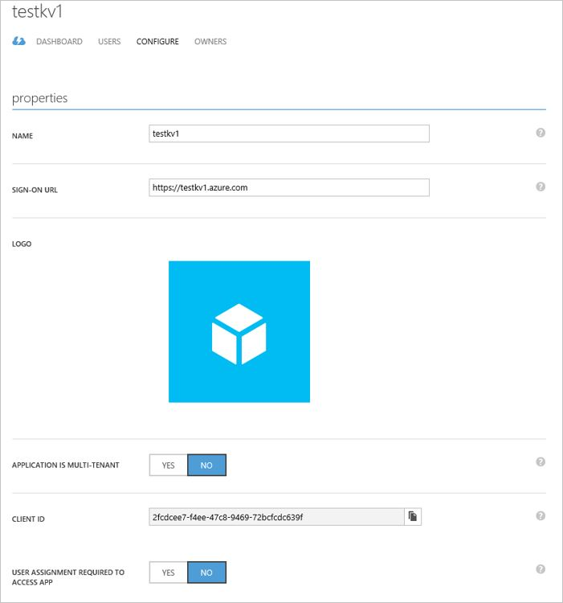
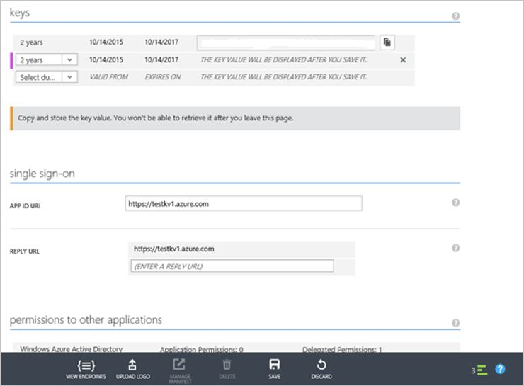
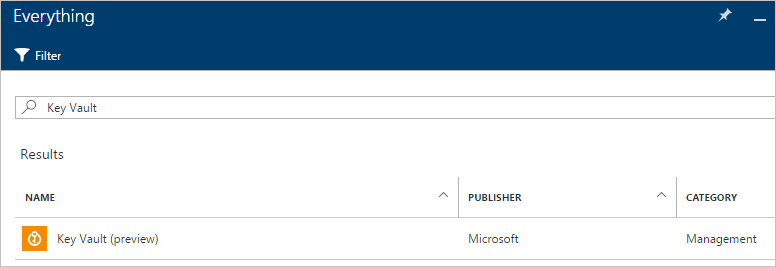
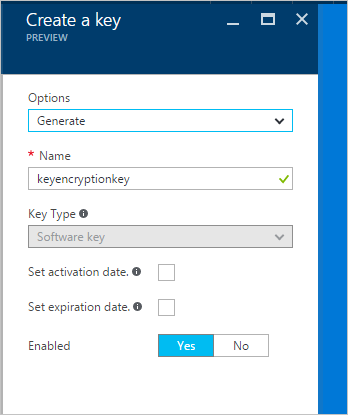

---
title: Azure Disk Encryption for Windows and Linux IaaS VMs | Microsoft Docs
description: This article provides an overview of Microsoft Azure Disk Encryption for Windows and Linux IaaS VMs.
services: security
documentationcenter: na
author: YuriDio
manager: swadhwa
editor: TomSh

ms.assetid: d3fac8bb-4829-405e-8701-fa7229fb1725
ms.service: security
ms.devlang: na
ms.topic: article
ms.tgt_pltfrm: na
ms.workload: na
ms.date: 04/07/2017
ms.author: kakhan

---
# Azure Disk Encryption for Windows and Linux IaaS VMs
Microsoft Azure is strongly committed to ensuring your data privacy, data sovereignty and enables you to control your Azure hosted data through a range of advanced technologies to encrypt, control and manage encryption keys, control & audit access of data. This provides Azure customers the flexibility to choose the solution that best meets their business needs. In this paper, we will introduce you to a new technology solution “Azure Disk Encryption for Windows and Linux IaaS VM’s” to help protect and safeguard your data to meet your organizational security and compliance commitments. The paper provides detailed guidance on how to use the Azure disk encryption features including the supported scenarios and the user experiences.

> [!NOTE]
> Certain recommendations might increase data, network, or compute resource usage, resulting in additional license or subscription costs.

## Overview
Azure Disk Encryption is a new capability that helps you encrypt your Windows and Linux IaaS virtual machine disks. Azure Disk Encryption leverages the industry standard [BitLocker](https://technet.microsoft.com/library/cc732774.aspx) feature of Windows and the [DM-Crypt](https://en.wikipedia.org/wiki/Dm-crypt) feature of Linux to provide volume encryption for the OS and the data disks. The solution is integrated with [Azure Key Vault](https://azure.microsoft.com/documentation/services/key-vault/) to help you control and manage the disk-encryption keys and secrets in your key vault subscription. The solution also ensures that all data on the virtual machine disks are encrypted at rest in your Azure storage.

Azure disk encryption for Windows and Linux IaaS VMs is now in **General Availability** in all Azure public regions and AzureGov regions for Standard  VMs and VMs with premium storage.

### Encryption scenarios
The Azure Disk Encryption solution supports the following customer scenarios:

* Enable encryption on new IaaS VMs created from pre-encrypted VHD and encryption keys
* Enable encryption on new IaaS VMs created from the Azure Gallery images
* Enable encryption on existing IaaS VMs running in Azure
* Disable encryption on Windows IaaS VMs
* Disable encryption on data drives for Linux IaaS VMs
* Enable encryption of managed disk VMs
* Update encryption settings of an existing encrypted non-premium storage VM
* Backup and restore of encrypted VMs, encrypted with key encryption key

The solution supports the following scenarios for IaaS VMs when they are enabled in Microsoft Azure:

* Integration with Azure Key Vault
* Standard tier VMs: [A, D, DS, G, GS, F, and so forth series IaaS VMs](https://azure.microsoft.com/pricing/details/virtual-machines/)
* Enable encryption on Windows and Linux IaaS VMs and managed disk VMs
* Disable encryption on OS and data drives for Windows IaaS VMs and managed disk VMs
* Disable encryption on data drives for Linux IaaS VMs and managed disk VMs
* Enable encryption on IaaS VMs running Windows Client OS
* Enable encryption on volumes with mount paths
* Enable encryption on Linux VMs configured with disk striping (RAID) using mdadm
* Enable encryption on Linux VMs using LVM for data disks
* Enable encryption on Windows VMs configured with Storage Spaces
* Update encryption settings of an existing encrypted non-premium storage VM
* All Azure Public and AzureGov regions are supported

The solution does not support the following scenarios, features, and technology:

* Basic tier IaaS VMs
* Disabling encryption on an OS drive for Linux IaaS VMs
* IaaS VMs that are created by using the classic VM creation method
* Integration with your on-premises Key Management Service
* Azure Files (shared file system), Network File System (NFS), dynamic volumes, and Windows VMs that are configured with software-based RAID systems
* Backup and restore of encrypted VMs, encrypted without key encryption key.
* Update encryption settings of an existing encrypted premium storage VM.

> [!NOTE]
> Backup and restore of encrypted VMs is supported only for VMs that are encrypted with the KEK configuration. It is not supported on VMs that are encrypted without KEK. KEK is an optional parameter that enables VM encryption. This support is coming soon.
> Update encryption settings of an existing encrypted premium storage VM are not supported. This support is coming soon.

### Encryption features
When you enable and deploy Azure Disk Encryption for Azure IaaS VMs, the following capabilities are enabled, depending on the configuration provided:

* Encryption of the OS volume to protect the boot volume at rest in your storage
* Encryption of data volumes to protect the data volumes at rest in your storage
* Disabling encryption on the OS and data drives for Windows IaaS VMs
* Disabling encryption on the data drives for Linux IaaS VMs
* Safeguarding the encryption keys and secrets in your key vault subscription
* Reporting the encryption status of the encrypted IaaS VM
* Removal of disk-encryption configuration settings from the IaaS virtual machine
* Backup and restore of encrypted VMs by using the Azure Backup service

> [!NOTE]
> Backup and restore of encrypted VMs is supported only for VMs that are encrypted with the KEK configuration. It is not supported on VMs that are encrypted without KEK. KEK is an optional parameter that enables VM encryption.

Azure Disk Encryption for IaaS VMS for Windows and Linux solution includes:

* The disk-encryption extension for Windows.
* The disk-encryption extension for Linux.
* The disk-encryption PowerShell cmdlets.
* The disk-encryption Azure command-line interface (CLI) cmdlets.
* The disk-encryption Azure Resource Manager templates.

The Azure Disk Encryption solution is supported on IaaS VMs that are running Windows or Linux OS. For more information about the supported operating systems, see the "Prerequisites" section.

> [!NOTE]
> There is no additional charge for encrypting VM disks with Azure Disk Encryption.

### Value proposition
When you apply the Azure Disk Encryption-management solution, you can satisfy the following business needs:

* IaaS VMs are secured at rest, because you can use industry-standard encryption technology to address organizational security and compliance requirements.
* IaaS VMs boot under customer-controlled keys and policies, and you can audit their usage in your key vault.

### Encryption workflow
To enable disk encryption for Windows and Linux VMs, do the following:

1. Choose an encryption scenario from among the preceding encryption scenarios.
2. Opt in to enabling disk encryption via the Azure Disk Encryption Resource Manager template, PowerShell cmdlets, or CLI command, and specify the encryption configuration.

   * For the customer-encrypted VHD scenario, upload the encrypted VHD to your storage account and the encryption key material to your key vault. Then, provide the encryption configuration to enable encryption on a new IaaS VM.
   * For new VMs that are created from the Marketplace and existing VMs that are already running in Azure, provide the encryption configuration to enable encryption on the IaaS VM.

3. Grant access to the Azure platform to read the encryption-key material (BitLocker encryption keys for Windows systems and Passphrase for Linux) from your key vault to enable encryption on the IaaS VM.

4. Provide the Azure Active Directory (Azure AD) application identity to write the encryption key material to your key vault. Doing so enables encryption on the IaaS VM for the scenarios mentioned in step 2.

5. Azure updates the VM service model with encryption and the key vault configuration, and sets up your encrypted VM.

 

### Decryption workflow
To disable disk encryption for IaaS VMs, complete the following high-level steps:

1. Choose to disable encryption (decryption) on a running IaaS VM in Azure via the Azure Disk Encryption Resource Manager template or PowerShell cmdlets, and specify the decryption configuration.

 This step disables encryption of the OS or the data volume or both on the running Windows IaaS VM. However, as mentioned in the previous section, disabling OS disk encryption for Linux is not supported. The decryption step is allowed only for data drives on Linux VMs.
2. Azure updates the VM service model, and the IaaS VM is marked decrypted. The contents of the VM are no longer encrypted at rest.

> [!NOTE]
> The disable-encryption operation does not delete your key vault and the encryption key material (BitLocker encryption keys for Windows systems or Passphrase for Linux).
 > Disabling OS disk encryption for Linux is not supported. The decryption step is allowed only for data drives on Linux VMs.

## Prerequisites
Before you enable Azure Disk Encryption on Azure IaaS VMs for the supported scenarios that were discussed in the "Overview" section, see the following prerequisites:

* You must have a valid active Azure subscription to create resources in Azure in the supported regions.
* Azure Disk Encryption is supported on the following Windows Server versions: Windows Server 2008 R2, Windows Server 2012, Windows Server 2012 R2, and Windows Server 2016.
* Azure Disk Encryption is supported on the following Windows client versions: Windows 8 client and Windows 10 client.

> [!NOTE]
> For Windows Server 2008 R2, you must have .NET Framework 4.5 installed before you enable encryption in Azure. You can install it from Windows Update by installing the optional update Microsoft .NET Framework 4.5.2 for Windows Server 2008 R2 x64-based systems ([KB2901983](https://support.microsoft.com/kb/2901983)).

* Azure Disk Encryption is supported on the following Linux server distributions and versions:

| Linux Distribution | Version | Volume Type Supported for Encryption|
| --- | --- |--- |
| Ubuntu | 16.04-DAILY-LTS | OS and Data disk |
| Ubuntu | 14.04.5-DAILY-LTS | OS and Data disk |
| Ubuntu | 12.10 | Data disk |
| Ubuntu | 12.04 | Data disk |
| RHEL | 7.3 | OS and Data disk |
| RHEL | 7.2 | OS and Data disk |
| RHEL | 6.8 | OS and Data disk |
| RHEL | 6.7 | Data disk |
| CentOS | 7.3 | OS and Data disk |
| CentOS | 7.2n | OS and Data disk |
| CentOS | 6.8 | OS and Data disk |
| CentOS | 7.1 | Data disk |
| CentOS | 7.0 | Data disk |
| CentOS | 6.7 | Data disk |
| CentOS | 6.6 | Data disk |
| CentOS | 6.5 | Data disk |
| openSUSE | 13.2 | Data disk |
| SLES | 12 SP1 | Data disk |
| SLES | 12-SP1 (Premium) | Data disk |
| SLES | HPC 12 | Data disk |
| SLES | 11-SP4 (Premium) | Data disk |
| SLES | 11 SP4 | Data disk |

* Azure Disk Encryption requires that your key vault and VMs reside in the same Azure region and subscription.

> [!NOTE]
> Configuring the resources in separate regions causes a failure in enabling the Azure Disk Encryption feature.

* To set up and configure your key vault for Azure Disk Encryption, see section **Set up and configure your key vault for Azure Disk Encryption** in the *Prerequisites* section of this article.
* To set up and configure Azure AD application in Azure Active directory for Azure Disk Encryption, see section **Set up the Azure AD application in Azure Active Directory** in the *Prerequisites* section of this article.
* To set up and configure the key vault access policy for the Azure AD application, see section **Set up the key vault access policy for the Azure AD application** in the *Prerequisites* section of this article.
* To prepare a pre-encrypted Windows VHD, see section **Prepare a pre-encrypted Windows VHD** in the *Appendix*.
* To prepare a pre-encrypted Linux VHD, see section **Prepare a pre-encrypted Linux VHD** in the *Appendix*.
* The Azure platform needs access to the encryption keys or secrets in your key vault to make them available to the virtual machine when it boots and decrypts the virtual machine OS volume. To grant permissions to Azure platform, set the **EnabledForDiskEncryption** property in the key vault. For more information, see **Set up and configure your key vault for Azure Disk Encryption** in the Appendix.
* Your key vault secret and KEK URLs must be versioned. Azure enforces this restriction of versioning. For valid secret and KEK URLs, see the following examples:

  * Example of a valid secret URL:
      *https://contosovault.vault.azure.net/secrets/BitLockerEncryptionSecretWithKek/xxxxxxxxxxxxxxxxxxxxxxxxxxxxxxxx*
  * Example of a valid KEK URL:
      *https://contosovault.vault.azure.net/keys/diskencryptionkek/xxxxxxxxxxxxxxxxxxxxxxxxxxxxxxxx*

* Azure Disk Encryption does not support specifying port numbers as part of key vault secrets and KEK URLs. For examples of non-supported and supported key vault URLs, see the following:

  * Unacceptable key vault URL
     *https://contosovault.vault.azure.net:443/secrets/contososecret/xxxxxxxxxxxxxxxxxxxxxxxxxxxxxxxx*
  * Acceptable key vault URL:
      *https://contosovault.vault.azure.net/secrets/contososecret/xxxxxxxxxxxxxxxxxxxxxxxxxxxxxxxx*

* To enable the Azure Disk Encryption feature, the IaaS VMs must meet the following network endpoint configuration requirements:
  * To get a token to connect to your key vault, the IaaS VM must be able to connect to an Azure Active Directory endpoint, \[Login.windows.net\].
  * To write the encryption keys to your key vault, the IaaS VM must be able to connect to the key vault endpoint.
  * The IaaS VM must be able to connect to an Azure storage endpoint that hosts the Azure extension repository and an Azure storage account that hosts the VHD files.

  > [!NOTE]
  > If your security policy limits access from Azure VMs to the Internet, you can resolve the preceding URI and configure a specific rule to allow outbound connectivity to the IPs.
  >
  >To configure and access Azure Key Vault behind a firewall(https://docs.microsoft.com/en-us/azure/key-vault/key-vault-access-behind-firewall)

* Use the latest version of Azure PowerShell SDK version to configure Azure Disk Encryption. Download the latest version of [Azure PowerShell release](https://github.com/Azure/azure-powershell/releases)

 > [!NOTE]
  > Azure Disk Encryption is not supported on [Azure PowerShell SDK version 1.1.0](https://github.com/Azure/azure-powershell/releases/tag/v1.1.0-January2016). If you are receiving an error related to using Azure PowerShell 1.1.0, see [Azure Disk Encryption Error Related to Azure PowerShell 1.1.0](http://blogs.msdn.com/b/azuresecurity/archive/2016/02/10/azure-disk-encryption-error-related-to-azure-powershell-1-1-0.aspx).

* To run any Azure CLI command and associate it with your Azure subscription, you must first install Azure CLI:
  * To install Azure CLI and associate it with your Azure subscription, see [How to install and configure Azure CLI](../cli-install-nodejs.md).
  * To use Azure CLI for Mac, Linux, and Windows with Azure Resource Manager, see [Azure CLI commands in Resource Manager mode](../virtual-machines/azure-cli-arm-commands.md).

* You must use -skipVmBackup parameter when using Azure disk encryption PS cmdlet Set-AzureRmVMDiskEncryptionExtension or CLI command to enable encryption on Azure Managed Disk VM.
> [!NOTE]
 > If you do not specify -skipVmBackup parameter, the enable encryption step will fail.

* The Azure Disk Encryption solution uses the BitLocker external key protector for Windows IaaS VMs. For domain joined VMs, DO NOT push any group policies that enforce TPM protectors. For information about the group policy for “Allow BitLocker without a compatible TPM,” see [BitLocker Group Policy Reference](https://technet.microsoft.com/library/ee706521).
* To create an Azure AD application, create a key vault, or set up an existing key vault and enable encryption, see the [Azure Disk Encryption prerequisite PowerShell script](https://github.com/Azure/azure-powershell/blob/dev/src/ResourceManager/Compute/Commands.Compute/Extension/AzureDiskEncryption/Scripts/AzureDiskEncryptionPreRequisiteSetup.ps1).
* To configure disk-encryption prerequisites using the Azure CLI, see [this Bash script](https://github.com/ejarvi/ade-cli-getting-started).
* To use the Azure Backup service to back up and restore encrypted VMs, when encryption is enabled with Azure Disk Encryption, encrypt your VMs by using the Azure Disk Encryption key configuration. The Backup service supports VMs that are encrypted using KEK configuration only. See [How to back up and restore encrypted virtual machines with Azure Backup  encryption](https://docs.microsoft.com/en-us/azure/backup/backup-azure-vms-encryption).

> [!NOTE]
> Backup and restore of encrypted VMs is supported only for VMs that are encrypted with the KEK configuration. It is not supported on VMs that are encrypted without KEK. KEK is an optional parameter that enables VM.

#### Set up the Azure AD application in Azure Active Directory
When you need encryption to be enabled on a running VM in Azure, Azure Disk Encryption generates and writes the encryption keys to your key vault. Managing encryption keys in your key vault requires Azure AD authentication.

For this purpose, create an Azure AD application. You can find detailed steps for registering an application in the “Get an Identity for the Application” section of the blog post [Azure Key Vault - Step by Step](http://blogs.technet.com/b/kv/archive/2015/06/02/azure-key-vault-step-by-step.aspx). This post also contains a number of helpful examples for setting up and configuring your key vault. For authentication purposes, you can use either client secret-based authentication or client certificate-based Azure AD authentication.

#### Client secret-based authentication for Azure AD
The sections that follow can help you configure a client secret-based authentication for Azure AD.

##### Create an Azure AD application by using Azure PowerShell
Use the following PowerShell cmdlet to create an Azure AD application:

    $aadClientSecret = “yourSecret”
    $azureAdApplication = New-AzureRmADApplication -DisplayName "<Your Application Display Name>" -HomePage "<https://YourApplicationHomePage>" -IdentifierUris "<https://YouApplicationUri>" -Password $aadClientSecret
    $servicePrincipal = New-AzureRmADServicePrincipal –ApplicationId $azureAdApplication.ApplicationId

> [!NOTE]
> $azureAdApplication.ApplicationId is the Azure AD ClientID and $aadClientSecret is the client secret that you should use later to enable Azure Disk Encryption. Safeguard the Azure AD client secret appropriately.

##### Setting up the Azure AD client ID and secret from the Azure classic portal
You can also set up your Azure AD client ID and secret by using the [Azure classic portal]( https://manage.windowsazure.com). To perform this task, do the following:

1. Click the **Active Directory** tab.

 

2. Click **Add Application**, and then type the application name.

 

3. Click the arrow button, and then configure the application properties.

 

4. Click the check mark in the lower left corner to finish. The application configuration page appears, and the Azure AD client ID is displayed at the bottom of the page.

 

5. Save the Azure AD client secret by clicking the **Save** button. Note the Azure AD client secret in the keys text box. Safeguard it appropriately.

 

 > [!NOTE]
 > The preceding flow is not supported on the Azure classic portal.

##### Use an existing application
To execute the following commands, obtain and use the [Azure AD PowerShell module](https://technet.microsoft.com/library/jj151815.aspx).

> [!NOTE]
> The following commands must be executed from a new PowerShell window. Do not use Azure PowerShell or the Azure Resource Manager window to execute the commands. We recommend this approach because these cmdlets are in the MSOnline module or Azure AD PowerShell.

    $clientSecret = ‘<yourAadClientSecret>’
    $aadClientID = '<Client ID of your Azure AD application>'
    connect-msolservice
    New-MsolServicePrincipalCredential -AppPrincipalId $aadClientID -Type password -Value $clientSecret

#### Certificate-based authentication for Azure AD
> [!NOTE]
> Azure AD certificate-based authentication is currently not supported on Linux VMs.

The sections that follow show how to configure a certificate-based authentication for Azure AD.

##### Create an Azure AD application
To create an Azure AD application, execute the following PowerShell cmdlets:

> [!NOTE]
> Replace the following `yourpassword` string with your secure password, and safeguard the password.

    $cert = New-Object System.Security.Cryptography.X509Certificates.X509Certificate("C:\certificates\examplecert.pfx", "yourpassword")
    $keyValue = [System.Convert]::ToBase64String($cert.GetRawCertData())
    $azureAdApplication = New-AzureRmADApplication -DisplayName "<Your Application Display Name>" -HomePage "<https://YourApplicationHomePage>" -IdentifierUris "<https://YouApplicationUri>" -KeyValue $keyValue -KeyType AsymmetricX509Cert
    $servicePrincipal = New-AzureRmADServicePrincipal –ApplicationId $azureAdApplication.ApplicationId

After you finish this step, upload a PFX file to your key vault and enable the access policy needed to deploy that certificate to a VM.

##### Use an existing Azure AD application
If you are configuring certificate-based authentication for an existing application, use the PowerShell cmdlets shown here. Be sure to execute them from a new PowerShell window.

    $certLocalPath = 'C:\certs\myaadapp.cer'
    $aadClientID = '<Client ID of your Azure AD application>'
    connect-msolservice
    $cer = New-Object System.Security.Cryptography.X509Certificates.X509Certificate
    $cer.Import($certLocalPath)
    $binCert = $cer.GetRawCertData()
    $credValue = [System.Convert]::ToBase64String($binCert);
    New-MsolServicePrincipalCredential -AppPrincipalId $aadClientID -Type asymmetric -Value $credValue -Usage verify

After you finish this step, upload a PFX file to your key vault and enable the access policy that's needed to deploy the certificate to a VM.

##### Upload a PFX file to your key vault
For a detailed explanation of this process, see [The Official Azure Key Vault Team Blog](http://blogs.technet.com/b/kv/archive/2015/07/14/vm_2d00_certificates.aspx). However, the following PowerShell cmdlets are all you need for the task. Be sure to execute them from Azure PowerShell console.

> [!NOTE]
> Replace the following `yourpassword` string with your secure password, and safeguard the password.

    $certLocalPath = 'C:\certs\myaadapp.pfx'
    $certPassword = "yourpassword"
    $resourceGroupName = ‘yourResourceGroup’
    $keyVaultName = ‘yourKeyVaultName’
    $keyVaultSecretName = ‘yourAadCertSecretName’

    $fileContentBytes = get-content $certLocalPath -Encoding Byte
    $fileContentEncoded = [System.Convert]::ToBase64String($fileContentBytes)

    $jsonObject = @"
    {
    "data": "$filecontentencoded",
    "dataType" :"pfx",
    "password": "$certPassword"
    }
    "@

    $jsonObjectBytes = [System.Text.Encoding]::UTF8.GetBytes($jsonObject)
    $jsonEncoded = [System.Convert]::ToBase64String($jsonObjectBytes)

    Switch-AzureMode -Name AzureResourceManager
    $secret = ConvertTo-SecureString -String $jsonEncoded -AsPlainText -Force
    Set-AzureKeyVaultSecret -VaultName $keyVaultName -Name $keyVaultSecretName -SecretValue $secret
    Set-AzureRmKeyVaultAccessPolicy -VaultName $keyVaultName -ResourceGroupName $resourceGroupName –EnabledForDeployment

##### Deploy a certificate in your key vault to an existing VM
After you finish uploading the PFX, deploy a certificate in the key vault to an existing VM with the following:
 ```
    $resourceGroupName = ‘yourResourceGroup’
    $keyVaultName = ‘yourKeyVaultName’
    $keyVaultSecretName = ‘yourAadCertSecretName’
    $vmName = ‘yourVMName’
    $certUrl = (Get-AzureKeyVaultSecret -VaultName $keyVaultName -Name $keyVaultSecretName).Id
    $sourceVaultId = (Get-AzureRmKeyVault -VaultName $keyVaultName -ResourceGroupName $resourceGroupName).ResourceId
    $vm = Get-AzureRmVM -ResourceGroupName $resourceGroupName -Name $vmName
    $vm = Add-AzureRmVMSecret -VM $vm -SourceVaultId $sourceVaultId -CertificateStore "My" -CertificateUrl $certUrl
    Update-AzureRmVM -VM $vm  -ResourceGroupName $resourceGroupName
 ```

#### Set up the key vault access policy for the Azure AD application
Your Azure AD application needs rights to access the keys or secrets in the vault. Use the [`Set-AzureKeyVaultAccessPolicy`](/powershell/module/azure/set-azurekeyvaultaccesspolicy?view=azuresmps-3.7.0) cmdlet to grant permissions to the application, using the client ID (which was generated when the application was registered) as the _–ServicePrincipalName_ parameter value. To learn more, see the blog post [Azure Key Vault - Step by Step](http://blogs.technet.com/b/kv/archive/2015/06/02/azure-key-vault-step-by-step.aspx). Here is an example of how to perform this task via PowerShell:

    $keyVaultName = '<yourKeyVaultName>'
    $aadClientID = '<yourAadAppClientID>'
    $rgname = '<yourResourceGroup>'
    Set-AzureRmKeyVaultAccessPolicy -VaultName $keyVaultName -ServicePrincipalName $aadClientID -PermissionsToKeys 'WrapKey' -PermissionsToSecrets 'Set' -ResourceGroupName $rgname

> [!NOTE]
> Azure Disk Encryption requires you to configure the following access policies to your Azure AD client application: _WrapKey_ and _Set_ permissions.

## Terminology
To understand some of the common terms used by this technology, use the following terminology table:

| Terminology | Definition |
| --- | --- |
| Azure AD | Azure AD is [Azure Active Directory](https://azure.microsoft.com/documentation/services/active-directory/). An Azure AD account is a prerequisite for authenticating, storing, and retrieving secrets from a key vault. |
| Azure Key Vault | Key Vault is a cryptographic, key management service that's based on Federal Information Processing Standards (FIPS)-validated hardware security modules, which help safeguard your cryptographic keys and sensitive secrets. For more information, see [Key Vault](https://azure.microsoft.com/services/key-vault/) documentation. |
| ARM | Azure Resource Manager |
| BitLocker |[BitLocker](https://technet.microsoft.com/library/hh831713.aspx) is an industry-recognized Windows volume encryption technology that's used to enable disk encryption on Windows IaaS VMs. |
| BEK | BitLocker encryption keys are used to encrypt the OS boot volume and data volumes. The BitLocker keys are safeguarded in a key vault as secrets. |
| CLI | See [Azure command-line interface](../cli-install-nodejs.md). |
| DM-Crypt |[DM-Crypt](https://en.wikipedia.org/wiki/Dm-crypt) is the Linux-based, transparent disk-encryption subsystem that's used to enable disk encryption on Linux IaaS VMs. |
| KEK | Key encryption key is the asymmetric key (RSA 2048) that you can use to protect or wrap the secret. You can provide a hardware security modules (HSM)-protected key or software-protected key. For more details, see [Azure Key Vault](https://azure.microsoft.com/services/key-vault/) documentation. |
| PS cmdlets | See [Azure PowerShell cmdlets](/powershell/azure/overview). |

### Set up and configure your key vault for Azure Disk Encryption
Azure Disk Encryption helps safeguard the disk-encryption keys and secrets in your key vault. To set up your key vault for Azure Disk Encryption, complete the steps in each of the following sections.

#### Create a key vault
To create a key vault, use one of the following options:

* ["101-Key-Vault-Create" Resource Manager template](https://github.com/Azure/azure-quickstart-templates/tree/master/101-key-vault-create)
* [Azure PowerShell key vault cmdlets](/powershell/module/azurerm.keyvault/#key_vault)
* Azure Resource Manager
* How to [Secure your key vault](https://docs.microsoft.com/en-us/azure/key-vault/key-vault-secure-your-key-vault)

> [!NOTE]
> If you have already set up a key vault for your subscription, skip to the next section.



#### Set up a key encryption key (optional)
If you want to use a KEK for an additional layer of security for the BitLocker encryption keys, add a KEK to your key vault. Use the [`Add-AzureKeyVaultKey`](/powershell/module/azurerm.keyvault/add-azurermkeyvaultkey) cmdlet to create a key encryption key in the key vault. You can also import a KEK from your on-premises key management HSM. For more details, see [Key Vault Documentation](https://azure.microsoft.com/documentation/services/key-vault/).

    Add-AzureKeyVaultKey [-VaultName] <string> [-Name] <string> -Destination <string> {HSM | Software}

You can add the KEK by going to Azure Resource Manager or by using your key vault interface.



#### Set key vault permissions
The Azure platform needs access to the encryption keys or secrets in your key vault to make them available to the VM for booting and decrypting the volumes. To grant permissions to the Azure platform, set the **EnabledForDiskEncryption** property in the key vault by using the key vault PowerShell cmdlet:

    Set-AzureRmKeyVaultAccessPolicy -VaultName <yourVaultName> -ResourceGroupName <yourResourceGroup> -EnabledForDiskEncryption

You can also set the **EnabledForDiskEncryption** property by visiting the [Azure Resource Explorer](https://resources.azure.com).

As mentioned earlier, you must set the **EnabledForDiskEncryption** property on your key vault. Otherwise, the deployment will fail.

You can set up access policies for your Azure AD application from the key vault interface, as shown here:


On the **Advanced access policies** tab, make sure that your key vault is enabled for Azure Disk Encryption:


## Disk-encryption deployment scenarios and user experiences
You can enable many disk-encryption scenarios, and the steps may vary according to the scenario. The following sections cover the scenarios in greater detail.

### Enable encryption on new IaaS VMs that are created from the Marketplace
You can enable disk encryption on new IaaS Windows VM from the Marketplace in Azure by using the  [Resource Manager template](https://github.com/Azure/azure-quickstart-templates/tree/master/201-encrypt-create-new-vm-gallery-image).

1. On the Azure quick-start template, click **Deploy to Azure**, enter the encryption configuration on the **Parameters** blade, and then click **OK**.

2. Select the subscription, resource group, resource group location, legal terms, and agreement, and then click **Create** to enable encryption on a new IaaS VM.

> [!NOTE]
> This template creates a new encrypted Windows VM that uses the Windows Server 2012 gallery image.

You can enable disk encryption on a new IaaS RedHat Linux 7.2 VM with a 200-GB RAID-0 array by using this [Resource Manager template](https://aka.ms/fde-rhel). After you deploy the template, verify the VM encryption status by using the `Get-AzureRmVmDiskEncryptionStatus` cmdlet, as described in [Encrypting OS drive on a running Linux VM](#encrypting-os-drive-on-a-running-linux-vm). When the machine returns a status of _VMRestartPending_, restart the VM.

The following table lists the Resource Manager template parameters for new VMs from the Marketplace scenario using Azure AD client ID:

| Parameter | Description |
| --- | --- |
| adminUserName | Admin user name for the virtual machine. |
| adminPassword | Admin user password for the virtual machine. |
| newStorageAccountName | Name of the storage account to store OS and data VHDs. |
| vmSize | Size of the VM. Currently, only Standard A, D, and G series are supported. |
| virtualNetworkName | Name of the VNet that the VM NIC should belong to. |
| subnetName | Name of the subnet in the VNet that the VM NIC should belong to. |
| AADClientID | Client ID of the Azure AD application that has permissions to write secrets to your key vault. |
| AADClientSecret | Client secret of the Azure AD application that has permissions to write secrets to your key vault. |
| keyVaultURL | URL of the key vault that the BitLocker key should be uploaded to. You can get it by using the cmdlet `(Get-AzureRmKeyVault -VaultName,-ResourceGroupName ).VaultURI`. |
| keyEncryptionKeyURL | URL of the key encryption key that's used to encrypt the generated BitLocker key (optional). |
| keyVaultResourceGroup | Resource group of the key vault. |
| vmName | Name of the VM that the encryption operation is to be performed on. |

> [!NOTE]
> _KeyEncryptionKeyURL_ is an optional parameter. You can bring your own KEK to further safeguard the data encryption key (Passphrase secret) in your key vault.

### Enable encryption on new IaaS VMs that are created from customer-encrypted VHD and encryption keys
In this scenario, you can enable encrypting by using the Resource Manager template, PowerShell cmdlets, or CLI commands. The following sections explain in greater detail the Resource Manager template and CLI commands.

Follow the instructions from one of these sections for preparing pre-encrypted images that can be used in Azure. After the image is created, you can use the steps in the next section to create an encrypted Azure VM.

* [Prepare a pre-encrypted Windows VHD](#preparing-a-pre-encrypted-windows-vhd)
* [Prepare a pre-encrypted Linux VHD](#preparing-a-pre-encrypted-linux-vhd)

#### Using the Resource Manager template
You can enable disk encryption on your encrypted VHD by using the [Resource Manager template](https://github.com/Azure/azure-quickstart-templates/tree/master/201-encrypt-create-pre-encrypted-vm).

1. On the Azure quick-start template, click **Deploy to Azure**, enter the encryption configuration on the **Parameters** blade, and then click **OK**.

2. Select the subscription, resource group, resource group location, legal terms, and agreement, and then click **Create** to enable encryption on the new IaaS VM.

The following table lists the Resource Manager template parameters for your encrypted VHD:

| Parameter | Description |
| --- | --- |
| newStorageAccountName | Name of the storage account to store the encrypted OS VHD. This storage account should already have been created in the same resource group and same location as the VM. |
| osVhdUri | URI of the OS VHD from the storage account. |
| osType | OS product type (Windows/Linux). |
| virtualNetworkName | Name of the VNet that the VM NIC should belong to. The name should already have been created in the same resource group and same location as the VM. |
| subnetName | Name of the subnet on the VNet that the VM NIC should belong to. |
| vmSize | Size of the VM. Currently, only Standard A, D, and G series are supported. |
| keyVaultResourceID | The ResourceID that identifies the key vault resource in Azure Resource Manager. You can get it by using the PowerShell cmdlet `(Get-AzureRmKeyVault -VaultName &lt;yourKeyVaultName&gt; -ResourceGroupName &lt;yourResourceGroupName&gt;).ResourceId`. |
| keyVaultSecretUrl | URL of the disk-encryption key that's set up in the key vault. |
| keyVaultKekUrl | URL of the key encryption key for encrypting the generated disk-encryption key. |
| vmName | Name of the IaaS VM. |

#### Using PowerShell cmdlets
You can enable disk encryption on your encrypted VHD by using the PowerShell cmdlet [`Set-AzureRmVMOSDisk`](/powershell/module/azurerm.compute/set-azurermvmosdisk).  

#### Using CLI commands
To enable disk encryption for this scenario by using CLI commands, do the following:

1. Set access policies in your key vault:

   * Set the **EnabledForDiskEncryption** flag:

    `azure keyvault set-policy --vault-name <keyVaultName> --enabled-for-disk-encryption true`
   * Set permissions to Azure AD application to write secrets to your key vault:

    `azure keyvault set-policy --vault-name <keyVaultName> --spn <aadClientID> --perms-to-keys '["wrapKey"]' --perms-to-secrets '["set"]'`

2. To enable encryption on an existing or running VM, type:

 `azure vm enable-disk-encryption --resource-group <resourceGroupName> --name <vmName> --aad-client-id <aadClientId> --aad-client-secret <aadClientSecret> --disk-encryption-key-vault-url <keyVaultURL> --disk-encryption-key-vault-id <keyVaultResourceId> --volume-type [All|OS|Data]`

3. Get encryption status:

 `azure vm show-disk-encryption-status --resource-group <resourceGroupName> --name <vmName> --json`

4. To enable encryption on a new VM from your encrypted VHD, use the following parameters with the `azure vm create` command:

 ```
   * disk-encryption-key-vault-id <disk-encryption-key-vault-id>
   * disk-encryption-key-url <disk-encryption-key-url>
   * key-encryption-key-vault-id <key-encryption-key-vault-id>
   * key-encryption-key-url <key-encryption-key-url>
 ```

### Enable encryption on existing or running IaaS Windows VM in Azure
In this scenario, you can enable encrypting by using the Resource Manager template, PowerShell cmdlets, or CLI commands. The following sections explain in greater detail how to enable it by using the Resource Manager template and CLI commands.

#### Using the Resource Manager template
You can enable disk encryption on existing or running IaaS Windows VMs in Azure by using the [Resource Manager template](https://github.com/Azure/azure-quickstart-templates/tree/master/201-encrypt-running-windows-vm).

1. On the Azure quick-start template, click **Deploy to Azure**, enter the encryption configuration on the **Parameters** blade, and then click **OK**.

2. Select the subscription, resource group, resource group location, legal terms, and agreement, and then click **Create** to enable encryption on the existing or running IaaS VM.

The following table lists the Resource Manager template parameters for existing or running VMs that use an Azure AD client ID:

| Parameter | Description |
| --- | --- |
| AADClientID | Client ID of the Azure AD application that has permissions to write secrets to the key vault. |
| AADClientSecret | Client secret of the Azure AD application that has permissions to write secrets to the key vault. |
| keyVaultName | Name of the key vault that the BitLocker key should be uploaded to. You can get it by using the cmdlet `(Get-AzureRmKeyVault -ResourceGroupName <yourResourceGroupName>). Vaultname`. |
|  keyEncryptionKeyURL | URL of the key encryption key that's used to encrypt the generated BitLocker key. This parameter is optional if you select **nokek** in the UseExistingKek drop-down list. If you select **kek** in the UseExistingKek drop-down list, you must enter the _keyEncryptionKeyURL_ value. |
| volumeType | Type of volume that the encryption operation is performed on. Valid values are _OS_, _Data_, and _All_. |
| sequenceVersion | Sequence version of the BitLocker operation. Increment this version number every time a disk-encryption operation is performed on the same VM. |
| vmName | Name of the VM that the encryption operation is to be performed on. |

> [!NOTE]
> _KeyEncryptionKeyURL_ is an optional parameter. You can bring your own KEK to further safeguard the data encryption key (BitLocker encryption secret) in the key vault.

#### Using PowerShell cmdlets
For information about enabling encryption with Azure Disk Encryption by using PowerShell cmdlets, see the blog posts [Explore Azure Disk Encryption with Azure PowerShell - Part 1](http://blogs.msdn.com/b/azuresecurity/archive/2015/11/17/explore-azure-disk-encryption-with-azure-powershell.aspx) and [Explore Azure Disk Encryption with Azure PowerShell - Part 2](http://blogs.msdn.com/b/azuresecurity/archive/2015/11/21/explore-azure-disk-encryption-with-azure-powershell-part-2.aspx).

#### Using CLI commands
To enable encryption on existing or running IaaS Windows VM in Azure using CLI commands, do the following:

1. To set access policies in the key vault:
   * Set the **EnabledForDiskEncryption** flag:

    `azure keyvault set-policy --vault-name <keyVaultName> --enabled-for-disk-encryption true`
   * Set permissions to Azure AD application to write secrets to your key vault:

    `azure keyvault set-policy --vault-name <keyVaultName> --spn <aadClientID> --perms-to-keys '["wrapKey"]' --perms-to-secrets '["set"]'`
2. To enable encryption on an existing or running VM:

 `azure vm enable-disk-encryption --resource-group <resourceGroupName> --name <vmName> --aad-client-id <aadClientId> --aad-client-secret <aadClientSecret> --disk-encryption-key-vault-url <keyVaultURL> --disk-encryption-key-vault-id <keyVaultResourceId> --volume-type [All|OS|Data]`
3. To get encryption status:

 `azure vm show-disk-encryption-status --resource-group <resourceGroupName> --name <vmName> --json`
4. To enable encryption on a new VM from your encrypted VHD, use the following parameters with the `azure vm create` command:

 ```
   * disk-encryption-key-vault-id <disk-encryption-key-vault-id>
   * disk-encryption-key-url <disk-encryption-key-url>
   * key-encryption-key-vault-id <key-encryption-key-vault-id>
   * key-encryption-key-url <key-encryption-key-url>
 ```

### Enable encryption on an existing or running IaaS Linux VM in Azure
You can enable disk encryption on an existing or running IaaS Linux VM in Azure by using the [Resource Manager template](https://github.com/Azure/azure-quickstart-templates/tree/master/201-encrypt-running-linux-vm).

1. Click **Deploy to Azure** on the Azure quick-start template, enter the encryption configuration on the **Parameters** blade, and then click **OK**.

2. Select the subscription, resource group, resource group location, legal terms, and agreement, and then click **Create** to enable encryption on the existing or running IaaS VM.

The following table lists Resource Manager template parameters for existing or running VMs that use an Azure AD client ID:

| Parameter | Description |
| --- | --- |
| AADClientID | Client ID of the Azure AD application that has permissions to write secrets to the key vault. |
| AADClientSecret | Client secret of the Azure AD application that has permissions to write secrets to your key vault. |
| keyVaultName | Name of the key vault that the BitLocker key should be uploaded to. You can get it by using the cmdlet `(Get-AzureRmKeyVault -ResourceGroupName <yourResourceGroupName>). Vaultname`. |
|  keyEncryptionKeyURL | URL of the key encryption key that's used to encrypt the generated BitLocker key. This parameter is optional if you select **nokek** in the UseExistingKek drop-down list. If you select **kek** in the UseExistingKek drop-down list, you must enter the _keyEncryptionKeyURL_ value. |
| volumeType | Type of volume that the encryption operation is performed on. Valid supported values are _OS_ or _All_ (for RHEL 7.2, CentOS 7.2, and Ubuntu 16.04), and _Data_ (for all other distributions). |
| sequenceVersion | Sequence version of the BitLocker operation. Increment this version number every time a disk-encryption operation is performed on the same VM. |
| vmName | Name of the VM that the encryption operation is to be performed on. |
| passPhrase | Type a strong passphrase as the data encryption key. |

> [!NOTE]
> _KeyEncryptionKeyURL_ is an optional parameter. You can bring your own KEK to further safeguard the data encryption key (passphrase secret) in your key vault.

#### CLI commands
You can enable disk encryption on your encrypted VHD by installing and using the [CLI command](../cli-install-nodejs.md). To enable encryption on existing or running IaaS Linux VMs in Azure by using CLI commands, do the following:

1. Set access policies in the key vault:

 * Set the **EnabledForDiskEncryption** flag:

    `azure keyvault set-policy --vault-name <keyVaultName> --enabled-for-disk-encryption true`
 * Set permissions to Azure AD application to write secrets to your key vault:

    `azure keyvault set-policy --vault-name <keyVaultName> --spn <aadClientID> --perms-to-keys '["wrapKey"]' --perms-to-secrets '["set"]'`

2. To enable encryption on an existing or running VM:

 `azure vm enable-disk-encryption --resource-group <resourceGroupName> --name <vmName> --aad-client-id <aadClientId> --aad-client-secret <aadClientSecret> --disk-encryption-key-vault-url <keyVaultURL> --disk-encryption-key-vault-id <keyVaultResourceId> --volume-type [All|OS|Data]`

3. Get encryption status:

 `azure vm show-disk-encryption-status --resource-group <resourceGroupName> --name <vmName> --json`

4. To enable encryption on a new VM from your encrypted VHD, use the following parameters with the `azure vm create` command:
 ```
   * disk-encryption-key-vault-id <disk-encryption-key-vault-id>
   * disk-encryption-key-url <disk-encryption-key-url>
   * key-encryption-key-vault-id <key-encryption-key-vault-id>
   * key-encryption-key-url <key-encryption-key-url>
 ```

### Get the encryption status of an encrypted IaaS VM
You can get the encryption status by using Azure Resource Manager, [PowerShell cmdlets](/powershell/azure/overview), or CLI commands. The following sections explain how to use the Azure classic portal and CLI commands to get the encryption status.

#### Get the encryption status of an encrypted Windows VM by using Azure Resource Manager
You can get the encryption status of the IaaS VM from Azure Resource Manager by doing the following:

1. Sign in to the [Azure classic portal](https://portal.azure.com/), and then click **Virtual machines** in the left pane to see a summary view of the virtual machines in your subscription. You can filter the virtual machines view by selecting the subscription name in the **Subscription** drop-down list.

2. At the top of the **Virtual machines** page, click **Columns**.

3. On the **Choose column** blade, select **Disk Encryption**, and then click **Update**. You should see the disk-encryption column showing the encryption state _Enabled_ or _Not Enabled_ for each VM, as shown in the following figure:

 

#### Get the encryption status of an encrypted (Windows/Linux) IaaS VM by using the disk-encryption PowerShell cmdlet
You can get the encryption status of the IaaS VM from the disk-encryption PowerShell cmdlet `Get-AzureRmVMDiskEncryptionStatus`. To get the encryption settings for your VM, enter the following:

    C:\> Get-AzureRmVmDiskEncryptionStatus  -ResourceGroupName $ResourceGroupName -VMName $VMName
    -ExtensionName $ExtensionName

    OsVolumeEncrypted          : NotEncrypted
    DataVolumesEncrypted       : Encrypted
    OsVolumeEncryptionSettings : Microsoft.Azure.Management.Compute.Models.DiskEncryptionSettings
    ProgressMessage            : https://rheltest1keyvault.vault.azure.net/secrets/bdb6bfb1-5431-4c28-af46-b18d0025ef2a/abebacb83d864a5fa729508315020f8a

You can inspect the output of _Get-AzureRmVMDiskEncryptionStatus_ for encryption key URLs.

    C:\> $status = Get-AzureRmVmDiskEncryptionStatus  -ResourceGroupName $ResourceGroupName -VMName
    e $VMName -ExtensionName $ExtensionName
    C:\> $status.OsVolumeEncryptionSettings

    DiskEncryptionKey                                                 KeyEncryptionKey                                               Enabled
    -----------------                                                 ----------------                                               -------
    Microsoft.Azure.Management.Compute.Models.KeyVaultSecretReference Microsoft.Azure.Management.Compute.Models.KeyVaultKeyReference    True


    C:\> $status.OsVolumeEncryptionSettings.DiskEncryptionKey.SecretUrl
    https://rheltest1keyvault.vault.azure.net/secrets/bdb6bfb1-5431-4c28-af46-b18d0025ef2a/abebacb83d864a5fa729508315020f8a
    C:\> $status.OsVolumeEncryptionSettings.DiskEncryptionKey

    SecretUrl                                                                                                               SourceVault
    ---------                                                                                                               -----------
    https://rheltest1keyvault.vault.azure.net/secrets/bdb6bfb1-5431-4c28-af46-b18d0025ef2a/abebacb83d864a5fa729508315020f8a Microsoft.Azure.Management....

The OSVolumeEncrypted and DataVolumesEncrypted settings values are set to _Encrypted_, which shows that both volumes are encrypted using Azure Disk Encryption. For information about enabling encryption with Azure Disk Encryption by using PowerShell cmdlets, see the blog posts [Explore Azure Disk Encryption with Azure PowerShell - Part 1](http://blogs.msdn.com/b/azuresecurity/archive/2015/11/17/explore-azure-disk-encryption-with-azure-powershell.aspx) and [Explore Azure Disk Encryption with Azure PowerShell - Part 2](http://blogs.msdn.com/b/azuresecurity/archive/2015/11/21/explore-azure-disk-encryption-with-azure-powershell-part-2.aspx).

> [!NOTE]
> On Linux VMs, it takes three to four minutes for the `Get-AzureRmVMDiskEncryptionStatus` cmdlet to report the encryption status.

#### Get the encryption status of the IaaS VM from the disk-encryption CLI command
You can get the encryption status of the IaaS VM by using the disk-encryption CLI command `azure vm show-disk-encryption-status`. To get the encryption settings for your VM, enter your Azure CLI session:

    azure vm show-disk-encryption-status --resource-group <yourResourceGroupName> --name <yourVMName> --json  

#### Disable encryption on running Windows IaaS VM
You can disable encryption on a running Windows or Linux IaaS VM via the Azure Disk Encryption Resource Manager template or PowerShell cmdlets and specify the decryption configuration.

##### Windows VM
The disable-encryption step disables encryption of the OS, the data volume, or both on the running Windows IaaS VM. You cannot disable the OS volume and leave the data volume encrypted. When the disable-encryption step is performed, the Azure classic deployment model updates the VM service model, and the Windows IaaS VM is marked decrypted. The contents of the VM are no longer encrypted at rest. The decryption does not delete your key vault and the encryption key material (BitLocker encryption keys for Windows and Passphrase for Linux).

##### Linux VM
The disable-encryption step disables encryption of the data volume on the running Linux IaaS VM.

> [!NOTE]
> Disabling encryption on the OS disk is not allowed on Linux VMs.

##### Disable encryption on an existing or running IaaS VM
You can disable disk encryption on running Windows IaaS VMs by using the [Resource Manager template](https://github.com/Azure/azure-quickstart-templates/tree/master/201-decrypt-running-windows-vm).

1. On the Azure quick-start template, click **Deploy to Azure**, enter the decryption configuration on the **Parameters** blade, and then click **OK**.

2. Select the subscription, resource group, resource group location, legal terms, and agreement, and then click **Create** to enable encryption on a new IaaS VM.

For Linux VMs, you can disable encryption by using the [Disable encryption on a running Linux VM](https://aka.ms/decrypt-linuxvm) template.

The following table lists Resource Manager template parameters for disabling encryption on a running IaaS VM:

| Parameter | Description |
| --- | --- |
| vmName | Name of the VM that the encryption operation is to be performed on.
| volumeType | Type of volume that a decryption operation is performed on. Valid values are _OS_, _Data_, and _All_. You cannot disable encryption on running Windows IaaS VM OS/boot volume without disabling encryption on the _Data_ volume. Also note that disabling encryption on the OS disk is not allowed on Linux VMs. |
| sequenceVersion | Sequence version of the BitLocker operation. Increment this version number every time a disk decryption operation is performed on the same VM. |

##### Disable encryption on an existing or running IaaS VM
To disable encryption on an existing or running IaaS VM by using the PowerShell cmdlet, see [`Disable-AzureRmVMDiskEncryption`](/powershell/module/azurerm.compute/disable-azurermvmdiskencryption). This cmdlet supports both Windows and Linux VMs. To disable encryption, it installs an extension on the virtual machine. If the _Name_ parameter is not specified, an extension with the default name _AzureDiskEncryption for Windows VMs_ is created.

On Linux VMs, the AzureDiskEncryptionForLinux extension is used.

> [!NOTE]
> This cmdlet reboots the virtual machine.

### Enable encryption on pre-encrypted IaaS VM with Azure Managed Disk
Use the Azure Managed Disk ARM template to create a encrypted VM from a pre-encrypted VHD using the ARM template located at   
[Create a new encrypted managed disk from a pre-encrypted VHD/storage blob] (https://github.com/Azure/azure-quickstart-templates/tree/master/201-create-encrypted-managed-disk)

### Enable encryption on a new Linux IaaS VM with Azure Managed Disk
Use the Azure Managed Disk ARM template to create a new encrypted Linux IaaS VM using the ARM template located at   
[Deployment of RHEL 7.2 with full disk encryption]
 (https://github.com/Azure/azure-quickstart-templates/tree/master/101-vm-full-disk-encrypted-rhel)

### Enable encryption on a new Windows IaaS VM with Azure Managed Disk
 Use the Azure Managed Disk ARM template to create a new encrypted Linux IaaS VM using the ARM template located at   
 [Create a new encrypted Windows IaaS Managed Disk VM from gallery image]
  (https://github.com/Azure/azure-quickstart-templates/tree/master/201-encrypt-create-new-vm-gallery-image-managed-disks)

  > [!NOTE]
  >You must use -skipVmBackup parameter when using Azure disk encryption PS cmdlet Set-AzureRmVMDiskEncryptionExtension or CLI command to enable encryption on Azure Managed Disk VM.
  >
  >It is advisable to backup your running VM instance before you enable encryption using the PS cmdlet Set-AzureRmVMDiskEncryptionExtension on your Linux Managed Disk VM.

### Update encryption settings of an existing encrypted non-premium VM
  Use the existing Azure disk encryption supported interfaces for running VM [PS cmdlets, CLI or ARM templates] to update the encryption settings like AAD client ID/secret, Key encryption key [KEK], BitLocker encryption key for Windows VM or Passphrase for Linux VM etc. The update encryption setting is supported only for VMs backed by non-premium storage. It is NNOT supported for VMs backed by premium storage.

## Appendix
### Connect to your subscription
Before you proceed, review the *Prerequisites* section in this article. After you ensure that all prerequisites have been met, connect to your subscription by doing the following:

1. Start an Azure PowerShell session, and sign in to your Azure account with the following command:

    `Login-AzureRmAccount`

2. If you have multiple subscriptions and want to specify one to use, type the following to see the subscriptions for your account:

    `Get-AzureRmSubscription`

3. To specify the subscription you want to use, type:

    `Select-AzureRmSubscription -SubscriptionName <Yoursubscriptionname>`

4. To verify that the subscription configured is correct, type:

    `Get-AzureRmSubscription`

5. To confirm the Azure Disk Encryption cmdlets are installed, type:

    `Get-command *diskencryption*`

6. The following output confirms the Azure Disk Encryption PowerShell installation:

```
    PS C:\Windows\System32\WindowsPowerShell\v1.0> get-command *diskencryption*
    CommandType  Name                                         Source                                                             
    Cmdlet       Get-AzureRmVMDiskEncryptionStatus            AzureRM.Compute                                                    
    Cmdlet       Disable-AzureRmVMDiskEncryption              AzureRM.Compute                                                    
    Cmdlet       Set-AzureRmVMDiskEncryptionExtension         AzureRM.Compute                                                     
```

### Prepare a pre-encrypted Windows VHD
The sections that follow are necessary to prepare a pre-encrypted Windows VHD for deployment as an encrypted VHD in Azure IaaS. Use the information to prepare and boot a fresh Windows VM (VHD) on Azure Site Recovery or Azure.

#### Update group policy to allow non-TPM for OS protection
Configure the BitLocker Group Policy setting **BitLocker Drive Encryption**, which you'll find under **Local Computer Policy** > **Computer Configuration** > **Administrative Templates** > **Windows Components**. Change this setting to **Operating System Drives** > **Require additional authentication at startup** > **Allow BitLocker without a compatible TPM**, as shown in the following figure:


#### Install BitLocker feature components
For Windows Server 2012 and later, use the following command:

    dism /online /Enable-Feature /all /FeatureName:BitLocker /quiet /norestart

For Windows Server 2008 R2, use the following command:

    ServerManagerCmd -install BitLockers

#### Prepare the OS volume for BitLocker by using `bdehdcfg`
To compress the OS partition and prepare the machine for BitLocker, execute the following command:

    bdehdcfg -target c: shrink -quiet

#### Protect the OS volume by using BitLocker
Use the [`manage-bde`](https://technet.microsoft.com/library/ff829849.aspx) command to enable encryption on the boot volume using an external key protector. Also place the external key (.bek file) on the external drive or volume. Encryption is enabled on the system/boot volume after the next reboot.

    manage-bde -on %systemdrive% -sk [ExternalDriveOrVolume]
    reboot

> [!NOTE]
> Prepare the VM with a separate data/resource VHD for getting the external key by using BitLocker.

#### Encrypting an OS drive on a running Linux VM
Encryption of an OS drive on a running Linux VM is supported on the following distributions:

* RHEL 7.2
* CentOS 7.2
* Ubuntu 16.04

##### Prerequisites for OS disk encryption

* The VM must be created from the Marketplace image in Azure Resource Manager.
* Azure VM with at least 4 GB of RAM (recommended size is 7 GB).
* (For RHEL and CentOS) Disable SELinux. To disable SELinux, see "4.4.2. Disabling SELinux" in the [SELinux User's and Administrator's Guide](https://access.redhat.com/documentation/en-US/Red_Hat_Enterprise_Linux/7/html/SELinux_Users_and_Administrators_Guide/sect-Security-Enhanced_Linux-Working_with_SELinux-Changing_SELinux_Modes.html#sect-Security-Enhanced_Linux-Enabling_and_Disabling_SELinux-Disabling_SELinux) on the VM.
* After you disable SELinux, reboot the VM at least once.

##### Steps
1. Create a VM by using one of the distributions specified previously.

 For CentOS 7.2, OS disk encryption is supported via a special image. To use this image, specify "7.2n" as the SKU when you create the VM:
 ```
    Set-AzureRmVMSourceImage -VM $VirtualMachine -PublisherName "OpenLogic" -Offer "CentOS" -Skus "7.2n" -Version "latest"
 ```
2. Configure the VM according to your needs. If you are going to encrypt all the (OS + data) drives, the data drives need to be specified and mountable from /etc/fstab.

 > [!NOTE]
 > Use UUID=... to specify data drives in /etc/fstab instead of specifying the block device name (for example, /dev/sdb1). During encryption, the order of drives changes on the VM. If your VM relies on a specific order of block devices, it will fail to mount them after encryption.

3. Sign out of the SSH sessions.

4. To encrypt the OS, specify volumeType as **All** or **OS** when you [enable encryption](#enable-encryption-on-existing-or-running-iaas-linux-vm-in-azure).

 > [!NOTE]
 > All user-space processes that are not running as `systemd` services should be killed with a `SIGKILL`. Reboot the VM. When you enable OS disk encryption on a running VM, plan on VM downtime.

5. Periodically monitor the progress of encryption by using the instructions in the [next section](#monitoring-os-encryption-progress).

6. After Get-AzureRmVmDiskEncryptionStatus shows "VMRestartPending," restart your VM either by signing in to it or by using the portal, PowerShell, or CLI.
    ```
    C:\> Get-AzureRmVmDiskEncryptionStatus  -ResourceGroupName $ResourceGroupName -VMName $VMName
    -ExtensionName $ExtensionName

    OsVolumeEncrypted          : VMRestartPending
    DataVolumesEncrypted       : NotMounted
    OsVolumeEncryptionSettings : Microsoft.Azure.Management.Compute.Models.DiskEncryptionSettings
    ProgressMessage            : OS disk successfully encrypted, reboot the VM
    ```
Before you reboot, we recommend that you save [boot diagnostics](https://azure.microsoft.com/en-us/blog/boot-diagnostics-for-virtual-machines-v2/) of the VM.

#### Monitoring OS encryption progress
You can monitor OS encryption progress in three ways:

* Use the `Get-AzureRmVmDiskEncryptionStatus` cmdlet and inspect the ProgressMessage field:
    ```
    OsVolumeEncrypted          : EncryptionInProgress
    DataVolumesEncrypted       : NotMounted
    OsVolumeEncryptionSettings : Microsoft.Azure.Management.Compute.Models.DiskEncryptionSettings
    ProgressMessage            : OS disk encryption started
    ```
 After the VM reaches "OS disk encryption started," it takes about 40 to 50 minutes on a Premium-storage backed VM.

 Because of [issue #388](https://github.com/Azure/WALinuxAgent/issues/388) in WALinuxAgent, `OsVolumeEncrypted` and `DataVolumesEncrypted` show up as `Unknown` in some distributions. With WALinuxAgent version 2.1.5 and later, this issue is fixed automatically. If you see `Unknown` in the output, you can verify disk-encryption status by using the Azure Resource Explorer.

 Go to [Azure Resource Explorer](https://resources.azure.com/), and then expand this hierarchy in the selection panel on left:

 ~~~~
 |-- subscriptions
     |-- [Your subscription]
          |-- resourceGroups
               |-- [Your resource group]
                    |-- providers
                         |-- Microsoft.Compute
                              |-- virtualMachines
                                   |-- [Your virtual machine]
                                        |-- InstanceView
~~~~                

 In the InstanceView, scroll down to see the encryption status of your drives.

 

* Look at [boot diagnostics](https://azure.microsoft.com/en-us/blog/boot-diagnostics-for-virtual-machines-v2/). Messages from the ADE extension should be prefixed with `[AzureDiskEncryption]`.

* Sign in to the VM via SSH, and get the extension log from:

    /var/log/azure/Microsoft.Azure.Security.AzureDiskEncryptionForLinux

 We recommend that you do not sign in to the VM while OS encryption is in progress. Copy the logs only when the other two methods have failed.

#### Prepare a pre-encrypted Linux VHD
##### Ubuntu 16
Configure encryption during the distribution installation by doing the following:

1. Select **Configure encrypted volumes** when you partition the disks.

 

2. Create a separate boot drive, which must not be encrypted. Encrypt your root drive.

 

3. Provide a passphrase. This is the passphrase that you upload to the key vault.

 

4. Finish partitioning.

 

5. When you boot the VM and are asked for a passphrase, use the passphrase you provided in step 3.

 

6. Prepare the VM for uploading into Azure using [these instructions](https://azure.microsoft.com/en-us/documentation/articles/virtual-machines-linux-create-upload-ubuntu/). Do not run the last step (deprovisioning the VM) yet.

Configure encryption to work with Azure by doing the following:

1. Create a file under /usr/local/sbin/azure_crypt_key.sh, with the content in the following script. Pay attention to the KeyFileName, because it is the passphrase file name used by Azure.

    ```
    #!/bin/sh
    MountPoint=/tmp-keydisk-mount
    KeyFileName=LinuxPassPhraseFileName
    echo "Trying to get the key from disks ..." >&2
    mkdir -p $MountPoint
    modprobe vfat >/dev/null 2>&1
    modprobe ntfs >/dev/null 2>&1
    sleep 2
    OPENED=0
    cd /sys/block
    for DEV in sd*; do

        echo "> Trying device: $DEV ..." >&2
        mount -t vfat -r /dev/${DEV}1 $MountPoint >/dev/null||
        mount -t ntfs -r /dev/${DEV}1 $MountPoint >/dev/null
        if [ -f $MountPoint/$KeyFileName ]; then
                cat $MountPoint/$KeyFileName
                umount $MountPoint 2>/dev/null
                OPENED=1
                break
        fi
        umount $MountPoint 2>/dev/null
    done

      if [ $OPENED -eq 0 ]; then
        echo "FAILED to find suitable passphrase file ..." >&2
        echo -n "Try to enter your password: " >&2
        read -s -r A </dev/console
        echo -n "$A"
     else
        echo "Success loading keyfile!" >&2
    fi
```

2. Change the crypt config in */etc/crypttab*. It should look like this:
 ```
    xxx_crypt uuid=xxxxxxxxxxxxxxxxxxxxx none luks,discard,keyscript=/usr/local/sbin/azure_crypt_key.sh
    ```

3. If you are editing *azure_crypt_key.sh* in Windows and you copied it to Linux, run `dos2unix /usr/local/sbin/azure_crypt_key.sh`.

4. Add executable permissions to the script:
 ```
    chmod +x /usr/local/sbin/azure_crypt_key.sh
 ```
5. Edit */etc/initramfs-tools/modules* by appending lines:
 ```
    vfat
    ntfs
    nls_cp437
    nls_utf8
    nls_iso8859-1
```
6. Run `update-initramfs -u -k all` to update the initramfs to make the `keyscript` take effect.

7. Now you can deprovision the VM.

 

8. Continue to the next step and [upload your VHD](#upload-encrypted-vhd-to-an-azure-storage-account) into Azure.

##### openSUSE 13.2
To configure encryption during the distribution installation, do the following:
1. When you partition the disks, select **Encrypt Volume Group**, and then enter a password. This is the password that you will upload to your key vault.

 

2. Boot the VM using your password.

 

3. Prepare the VM for uploading to Azure by following the instructions in [Prepare a SLES or openSUSE virtual machine for Azure](https://azure.microsoft.com/en-us/documentation/articles/virtual-machines-linux-suse-create-upload-vhd/#prepare-opensuse-131). Do not run the last step (deprovisioning the VM) yet.

To configure encryption to work with Azure, do the following:
1. Edit the /etc/dracut.conf, and add the following line:
    ```
    add_drivers+=" vfat ntfs nls_cp437 nls_iso8859-1"
    ```
2. Comment out these lines by the end of the file /usr/lib/dracut/modules.d/90crypt/module-setup.sh:
 ```
    #        inst_multiple -o \
    #        $systemdutildir/system-generators/systemd-cryptsetup-generator \
    #        $systemdutildir/systemd-cryptsetup \
    #        $systemdsystemunitdir/systemd-ask-password-console.path \
    #        $systemdsystemunitdir/systemd-ask-password-console.service \
    #        $systemdsystemunitdir/cryptsetup.target \
    #        $systemdsystemunitdir/sysinit.target.wants/cryptsetup.target \
    #        systemd-ask-password systemd-tty-ask-password-agent
    #        inst_script "$moddir"/crypt-run-generator.sh /sbin/crypt-run-generator
 ```

3. Append the following line at the beginning of the file /usr/lib/dracut/modules.d/90crypt/parse-crypt.sh:
 ```
    DRACUT_SYSTEMD=0
 ```
And change all occurrences of:
 ```
    if [ -z "$DRACUT_SYSTEMD" ]; then
 ```
to:
```
    if [ 1 ]; then
```
4. Edit /usr/lib/dracut/modules.d/90crypt/cryptroot-ask.sh and append it to “# Open LUKS device”:

    ```
    MountPoint=/tmp-keydisk-mount
    KeyFileName=LinuxPassPhraseFileName
    echo "Trying to get the key from disks ..." >&2
    mkdir -p $MountPoint >&2
    modprobe vfat >/dev/null >&2
    modprobe ntfs >/dev/null >&2
    for SFS in /dev/sd*; do
    echo "> Trying device:$SFS..." >&2
    mount ${SFS}1 $MountPoint -t vfat -r >&2 ||
    mount ${SFS}1 $MountPoint -t ntfs -r >&2
    if [ -f $MountPoint/$KeyFileName ]; then
        echo "> keyfile got..." >&2
        cp $MountPoint/$KeyFileName /tmp-keyfile >&2
        luksfile=/tmp-keyfile
        umount $MountPoint >&2
        break
    fi
    done
    ```
5. Run `/usr/sbin/dracut -f -v` to update the initrd.

6. Now you can deprovision the VM and [upload your VHD](#upload-encrypted-vhd-to-an-azure-storage-account) into Azure.

##### CentOS 7
To configure encryption during the distribution installation, do the following:
1. Select **Encrypt my data** when you partition disks.

 

2. Make sure **Encrypt** is selected for root partition.

 

3. Provide a passphrase. This is the passphrase that you will upload to your key vault.

 

4. When you boot the VM and are asked for a passphrase, use the passphrase you provided in step 3.

 

5. Prepare the VM for uploading into Azure by using the "CentOS 7.0+" instructions in [Prepare a CentOS-based virtual machine for Azure](https://azure.microsoft.com/en-us/documentation/articles/virtual-machines-linux-create-upload-centos/#centos-70). Do not run the last step (deprovisioning the VM) yet.

6. Now you can deprovision the VM and [upload your VHD](#upload-encrypted-vhd-to-an-azure-storage-account) into Azure.

To configure encryption to work with Azure, do the following:

1. Edit the /etc/dracut.conf, and add the following line:
    ```
    add_drivers+=" vfat ntfs nls_cp437 nls_iso8859-1"
    ```

2. Comment out these lines by the end of the file /usr/lib/dracut/modules.d/90crypt/module-setup.sh:
```
    #        inst_multiple -o \
    #        $systemdutildir/system-generators/systemd-cryptsetup-generator \
    #        $systemdutildir/systemd-cryptsetup \
    #        $systemdsystemunitdir/systemd-ask-password-console.path \
    #        $systemdsystemunitdir/systemd-ask-password-console.service \
    #        $systemdsystemunitdir/cryptsetup.target \
    #        $systemdsystemunitdir/sysinit.target.wants/cryptsetup.target \
    #        systemd-ask-password systemd-tty-ask-password-agent
    #        inst_script "$moddir"/crypt-run-generator.sh /sbin/crypt-run-generator
```

3. Append the following line at the beginning of the file /usr/lib/dracut/modules.d/90crypt/parse-crypt.sh:
```
    DRACUT_SYSTEMD=0
```
And change all occurrences of:
```
    if [ -z "$DRACUT_SYSTEMD" ]; then
```
to
```
    if [ 1 ]; then
```
4. Edit /usr/lib/dracut/modules.d/90crypt/cryptroot-ask.sh and append this after the “# Open LUKS device”:
    ```
    MountPoint=/tmp-keydisk-mount
    KeyFileName=LinuxPassPhraseFileName
    echo "Trying to get the key from disks ..." >&2
    mkdir -p $MountPoint >&2
    modprobe vfat >/dev/null >&2
    modprobe ntfs >/dev/null >&2
    for SFS in /dev/sd*; do
    echo "> Trying device:$SFS..." >&2
    mount ${SFS}1 $MountPoint -t vfat -r >&2 ||
    mount ${SFS}1 $MountPoint -t ntfs -r >&2
    if [ -f $MountPoint/$KeyFileName ]; then
        echo "> keyfile got..." >&2
        cp $MountPoint/$KeyFileName /tmp-keyfile >&2
        luksfile=/tmp-keyfile
        umount $MountPoint >&2
        break
    fi
    done
    ```    
5. Run the “/usr/sbin/dracut -f -v” to update the initrd.


### Upload encrypted VHD to an Azure storage account
After BitLocker encryption or DM-Crypt encryption is enabled, the local encrypted VHD needs to be uploaded to your storage account.

    Add-AzureRmVhd [-Destination] <Uri> [-LocalFilePath] <FileInfo> [[-NumberOfUploaderThreads] <Int32> ] [[-BaseImageUriToPatch] <Uri> ] [[-OverWrite]] [ <CommonParameters>]

### Upload the disk-encryption secret for the pre-encrypted VM to your key vault
The disk-encryption secret that you obtained previously must be uploaded as a secret in your key vault. The key vault needs to have disk encryption and permissions enabled for your Azure AD client.

    $AadClientId = "YourAADClientId"
    $AadClientSecret = "YourAADClientSecret"

    $key vault = New-AzureRmKeyVault -VaultName $KeyVaultName -ResourceGroupName $ResourceGroupName -Location $Location

    Set-AzureRmKeyVaultAccessPolicy -VaultName $KeyVaultName -ResourceGroupName $ResourceGroupName -ServicePrincipalName $AadClientId -PermissionsToKeys all -PermissionsToSecrets all
    Set-AzureRmKeyVaultAccessPolicy -VaultName $KeyVaultName -ResourceGroupName $ResourceGroupName -EnabledForDiskEncryption


#### Disk encryption secret not encrypted with a KEK
To set up the secret in your key vault, use [Set-AzureKeyVaultSecret](/powershell/module/azurerm.keyvault/set-azurekeyvaultsecret). If you have a Windows virtual machine, the bek file is encoded as a base64 string and then uploaded to your key vault using the `Set-AzureKeyVaultSecret` cmdlet. For Linux, the passphrase is encoded as a base64 string and then uploaded to the key vault. In addition, make sure that the following tags are set when you create the secret in the key vault.

    # This is the passphrase that was provided for encryption during the distribution installation
    $passphrase = "contoso-password"

    $tags = @{"DiskEncryptionKeyEncryptionAlgorithm" = "RSA-OAEP"; "DiskEncryptionKeyFileName" = "LinuxPassPhraseFileName"}
    $secretName = [guid]::NewGuid().ToString()
    $secretValue = [Convert]::ToBase64String([System.Text.Encoding]::ASCII.GetBytes($passphrase))
    $secureSecretValue = ConvertTo-SecureString $secretValue -AsPlainText -Force

    $secret = Set-AzureKeyVaultSecret -VaultName $KeyVaultName -Name $secretName -SecretValue $secureSecretValue -tags $tags
    $secretUrl = $secret.Id

Use the `$secretUrl` in the next step for [attaching the OS disk without using KEK](#without-using-a-kek).

#### Disk encryption secret encrypted with a KEK
Before you upload the secret to the key vault, you can optionally encrypt it by using a key encryption key. Use the wrap [API](https://msdn.microsoft.com/library/azure/dn878066.aspx) to first encrypt the secret using the key encryption key. The output of this wrap operation is a base64 URL encoded string, which you can then upload as a secret by using the [`Set-AzureKeyVaultSecret`](/powershell/module/azurerm.keyvault/set-azurekeyvaultsecret) cmdlet.

    # This is the passphrase that was provided for encryption during the distribution installation
    $passphrase = "contoso-password"

    Add-AzureKeyVaultKey -VaultName $KeyVaultName -Name "keyencryptionkey" -Destination Software
    $KeyEncryptionKey = Get-AzureKeyVaultKey -VaultName $KeyVault.OriginalVault.Name -Name "keyencryptionkey"

    $apiversion = "2015-06-01"

    ##############################
    # Get Auth URI
    ##############################

    $uri = $KeyVault.VaultUri + "/keys"
    $headers = @{}

    $response = try { Invoke-RestMethod -Method GET -Uri $uri -Headers $headers } catch { $_.Exception.Response }

    $authHeader = $response.Headers["www-authenticate"]
    $authUri = [regex]::match($authHeader, 'authorization="(.*?)"').Groups[1].Value

    Write-Host "Got Auth URI successfully"

    ##############################
    # Get Auth Token
    ##############################

    $uri = $authUri + "/oauth2/token"
    $body = "grant_type=client_credentials"
    $body += "&client_id=" + $AadClientId
    $body += "&client_secret=" + [Uri]::EscapeDataString($AadClientSecret)
    $body += "&resource=" + [Uri]::EscapeDataString("https://vault.azure.net")
    $headers = @{}

    $response = Invoke-RestMethod -Method POST -Uri $uri -Headers $headers -Body $body

    $access_token = $response.access_token

    Write-Host "Got Auth Token successfully"

    ##############################
    # Get KEK info
    ##############################

    $uri = $KeyEncryptionKey.Id + "?api-version=" + $apiversion
    $headers = @{"Authorization" = "Bearer " + $access_token}

    $response = Invoke-RestMethod -Method GET -Uri $uri -Headers $headers

    $keyid = $response.key.kid

    Write-Host "Got KEK info successfully"

    ##############################
    # Encrypt passphrase using KEK
    ##############################

    $passphraseB64 = [Convert]::ToBase64String([System.Text.Encoding]::ASCII.GetBytes($Passphrase))
    $uri = $keyid + "/encrypt?api-version=" + $apiversion
    $headers = @{"Authorization" = "Bearer " + $access_token; "Content-Type" = "application/json"}
    $bodyObj = @{"alg" = "RSA-OAEP"; "value" = $passphraseB64}
    $body = $bodyObj | ConvertTo-Json

    $response = Invoke-RestMethod -Method POST -Uri $uri -Headers $headers -Body $body

    $wrappedSecret = $response.value

    Write-Host "Encrypted passphrase successfully"

    ##############################
    # Store secret
    ##############################

    $secretName = [guid]::NewGuid().ToString()
    $uri = $KeyVault.VaultUri + "/secrets/" + $secretName + "?api-version=" + $apiversion
    $secretAttributes = @{"enabled" = $true}
    $secretTags = @{"DiskEncryptionKeyEncryptionAlgorithm" = "RSA-OAEP"; "DiskEncryptionKeyFileName" = "LinuxPassPhraseFileName"}
    $headers = @{"Authorization" = "Bearer " + $access_token; "Content-Type" = "application/json"}
    $bodyObj = @{"value" = $wrappedSecret; "attributes" = $secretAttributes; "tags" = $secretTags}
    $body = $bodyObj | ConvertTo-Json

    $response = Invoke-RestMethod -Method PUT -Uri $uri -Headers $headers -Body $body

    Write-Host "Stored secret successfully"

    $secretUrl = $response.id

Use `$KeyEncryptionKey` and `$secretUrl` in the next step for [attaching the OS disk using KEK](#using-a-kek).

### Specify a secret URL when you attach an OS disk
#### Without using a KEK
While you are attaching the OS disk, you need to pass `$secretUrl`. The URL was generated in the "Disk-encryption secret not encrypted with a KEK" section.

    Set-AzureRmVMOSDisk `
            -VM $VirtualMachine `
            -Name $OSDiskName `
            -SourceImageUri $VhdUri `
            -VhdUri $OSDiskUri `
            -Linux `
            -CreateOption FromImage `
            -DiskEncryptionKeyVaultId $KeyVault.ResourceId `
            -DiskEncryptionKeyUrl $SecretUrl

#### Using a KEK
When you attach the OS disk, pass `$KeyEncryptionKey` and `$secretUrl`. The URL was generated in the "Disk-encryption secret not encrypted with a KEK" section.

    Set-AzureRmVMOSDisk `
            -VM $VirtualMachine `
            -Name $OSDiskName `
            -SourceImageUri $CopiedTemplateBlobUri `
            -VhdUri $OSDiskUri `
            -Linux `
            -CreateOption FromImage `
            -DiskEncryptionKeyVaultId $KeyVault.ResourceId `
            -DiskEncryptionKeyUrl $SecretUrl `
            -KeyEncryptionKeyVaultId $KeyVault.ResourceId `
            -KeyEncryptionKeyURL $KeyEncryptionKey.Id

## Download this guide
You can download this guide from the [TechNet Gallery](https://gallery.technet.microsoft.com/Azure-Disk-Encryption-for-a0018eb0).

## For more information
[Explore Azure Disk Encryption with Azure PowerShell - Part 1](http://blogs.msdn.com/b/azuresecurity/archive/2015/11/16/explore-azure-disk-encryption-with-azure-powershell.aspx?wa=wsignin1.0)  
[Explore Azure Disk Encryption with Azure PowerShell - Part 2](http://blogs.msdn.com/b/azuresecurity/archive/2015/11/21/explore-azure-disk-encryption-with-azure-powershell-part-2.aspx)
