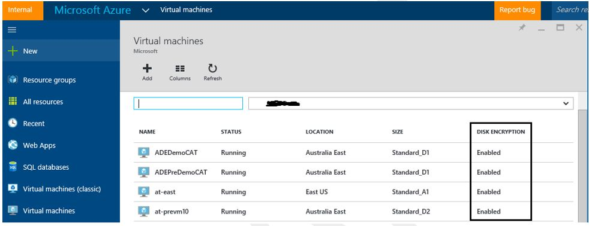

<properties
   pageTitle="Azure Disk Encryption for Windows and Linux IaaS VMs| Microsoft Azure"
   description="The paper provides an overview of Microsoft Azure Disk Encryption for for Windows and Linux IaaS VMs."
   services="security"
   documentationCenter="na"
   authors="YuriDio"
   manager="swadhwa"
   editor="TomSh"/>

<tags
   ms.service="security"
   ms.devlang="na"
   ms.topic="article"
   ms.tgt_pltfrm="na"
   ms.workload="na"
   ms.date="06/14/2016"
   ms.author="devtiw"/>

#Azure Disk Encryption for Windows and Linux IaaS VMs

Microsoft Azure is strongly committed to ensuring your data privacy, data sovereignty and enables you to control your Azure hosted data through a range of advanced technologies to encrypt, control and manage encryption keys, control & audit access of data. This provides Azure customers the flexibility to choose the solution that best meets their business needs. In this paper, we will introduce you to a new technology solution “Azure Disk Encryption for Windows and Linux IaaS VM’s” to help protect and safeguard your data to meet your organizational security and compliance commitments. The paper provides detailed guidance on how to use the Azure disk encryption features including the supported scenarios and the user experiences.

**NOTE**: Certain recommendations contained herein may result in increased data, network, or compute resource usage resulting in additional license or subscription costs.

## Overview

Azure Disk Encryption is a new capability that lets you encrypt your Windows and Linux IaaS virtual machine disks. Azure Disk Encryption leverages the industry standard [BitLocker](https://technet.microsoft.com/library/cc732774.aspx) feature of Windows and the [DM-Crypt](https://en.wikipedia.org/wiki/Dm-crypt) feature of Linux to provide volume encryption for the OS and the data disks. The solution is integrated with [Azure Key](https://azure.microsoft.com/documentation/services/key-vault/) Vault to help you control and manage the disk encryption keys and secrets in your key vault subscription, while ensuring that all data in the virtual machine disks are encrypted at rest in your Azure storage.

> [AZURE.NOTE] Azure disk encryption for Windows IaaS VMs is now in [General Availability](https://blogs.msdn.microsoft.com/azuresecurity/2016/05/20/azure-disk-encryption-for-windows-virtual-machines-reaches-general-availability/).

### Encryption Scenarios

The Azure Disk Encryption solution supports the following customer scenarios:

- Enable encryption on new IaaS VM’s created from pre-encrypted VHD and encryption keys
- Enable encryption on new IaaS VM’s created from the Azure Gallery images 
- Enable encryption on existing IaaS VM’s already running in Azure 
- Disable encryption on Windows IaaS VMs  

The solution supports the following for IaaS VMs when enabled in Microsoft Azure:

- Integration with Azure Key Vault

- Standard [A, D and G series IaaS VMs](https://azure.microsoft.com/pricing/details/virtual-machines/)

- Enable encryption on Windows and Linux IaaS VMs 

- Disable encryption on Windows IaaS VMs 

- Enable encryption on IaaS VMs running Windows Client OS 

- Enable encryption on volumes with mount paths 

- All Azure public regions are supported in public preview and Azure Australia region is supported in GA for Windows IaaS VMs

The solution does not support the following scenarios, features and technology in the release:

- Basic VMs and Standard DS (Premium Storage) series IaaS VMs

- IaaS VMs created using classic VM creation method

- Enable OS disk encryption on Linux IaaS VMs already running in Azure 

- Disable encryption on Linux IaaS VM, enabled via Azure disk encryption 

- Integration with your on-premises Key Management Service

- Windows Server 2016 Technical Preview 3 and above

- Azure Files (Azure file share), Network file system (NFS), Dynamic volumes, Software-based RAID systems 

### Encryption Features

When you enable and deploy Azure disk encryption for Azure IaaS VMs, the following capabilities are enabled, depending on the configuration provided:

- Encryption of OS volume to protect boot volume at rest in customer storage

	- Encryption of OS volume on Linux IaaS VM already running in Azure is not support currently. Encryption of OS volume for Linux IaaS VM is supported only for pre-encrypted VHD scenario
	
- Encryption of Data volume/s to protect the data volumes at rest in customer storage

- Disable encryption on Windows IaaS VMs 

- Safeguarding the encryption keys and secrets in customer Azure key vault subscription

- Reporting encryption status of the encrypted IaaS VM

- Removal of disk encryption configuration settings from the IaaS virtual machine

The Azure disk encryption for IaaS VMS for Windows and Linux solution includes the disk encryption extension for Windows, disk encryption extension for Linux, disk encryption PowerShell cmdlets, disk encryption CLI cmdlets and disk encryption Azure Resource Manager templates. The Azure disk encryption solution is supported on IaaS VMs running Windows or Linux OS. For more details on the supported Operating Systems, see prerequisites section below.

**Note: ** There is no charge for encrypting VM disks with Azure Disk Encryption.

### Value Proposition

The Azure Disk Encryption Management solution enables the following business needs in the cloud:

-   IaaS VM’s are secured at rest using industry standard encryption technology to address organizational security and compliance requirements.

-   IaaS VM’s boot under customer controlled keys and policies, and they can audit their usage in Key Vault.

### Encryption Workflow
The high level steps required to enable disk encryption for Windows and Linux VM’s are:

1. Customer choose the encryption scenario from the above 3 encryption scenarios

2. Customer opts into enabling disk encryption via the Azure disk encryption ARM template or PS cmdlets or CLI command and specifies the encryption configuration

    - For the customer encrypted VHD scenario, the customer uploads the encrypted VHD to their storage account and encryption key material to their key vault and provide the encryption configuration to enable encryption on a new IaaS VM

    - For the new VM’s created from the Azure gallery and existing VM’s already running in Azure, customer provide the encryption configuration to enable encryption on the IaaS VM

3. Customer grants access to Azure platform to read the encryption key material (BitLocker Encryption Keys for Windows systems and Passphrase for Linux) from their key vault to enable encryption on the IaaS VM

4. Customer provide Azure AD identity to write the encryption key material to their key vault to enable encryption on the IaaS VM for scenarios 2 and 3 above.

5.  Azure service management updates the VM service model with encryption and key vault configuration and provisions encrypted VM for the customer

### Decryption Workflow

The high level steps required to disable disk encryption for Windows IaaS VM’s are:

1. Customer choose to disable encryption (decryption) on a running Windows IaaS VM in Azure 
via the Azure disk encryption ARM template or PS cmdlets and specifies the decryption configuration.

2. The disable encryption step is supported only on Windows IaaS VM and is not supported on Linux IaaS VM.

3. The disable encryption step disables encryption of the OS or data volume or both on the running Windows IaaS VM.

4. Azure service management updates the VM service model and the Windows IaaS VM is marked decrypted. The contents of the VM are not encrypted at rest anymore.

5. The disable encryption does not delete the customer key vault and the encryption key material, which is BitLocker Encryption Keys for Windows and Passphrase for Linux.

## Prerequisites

The following are prerequisites to enable Azure Disk Encryption on Azure IaaS VMs for the supported scenarios called out in the overview section

- User must have a valid active Azure subscription to create resources in Azure in the regions supported

- Azure Disk Encryption is supported on the following Windows server SKU’s - Windows Server 2008 R2, Windows Server 2012, Windows Server 2012 R2. The solution is not supported on the Windows Server 2008 operating system. Windows Server 2016 Technical Preview 3 is not supported in this release.

Azure Disk Encryption is supported on the following Windows client SKU’s - Windows 8 Client and Windows 10 Client.

**Note**: For Windows Server 2008 R2, .Net framework 4.5 MUST be installed before enabling encryption in Azure. You can install it from Windows update by installing the optional update "Microsoft .NET Framework 4.5.2 for Windows Server 2008 R2 x64-based Systems ([KB2901983](https://support.microsoft.com/kb/2901983))"

- Azure Disk Encryption is supported on the following Linux server SKUs - Ubuntu, CentOS, SUSE and SUSE Linux Enterprise Server (SLES) and Red Hat Enterprise Linux.

- All resources (Ex: Key Vault, Storage account, VM, etc..) must belong to the same Azure region and subscription.

**Note** - Azure disk encryption requires that the Key Vault and the VMs reside in the same Azure region. Configuring them in separate region will cause failure in enabling Azure disk encryption feature.

- To set up and configure Azure Key Vault for Azure disk encryption usage, see section **Setting and Configuring Azure Key Vault for Azure disk encryption usage** in the *Prerequisites* section of this article.

- To set up and configure Azure AD application in Azure Active directory for Azure disk encryption usage, see section **Setup the Azure AD Application in Azure Active Directory** in the *Prerequisites* section of this article.

- To set up and configure Key Vault Access policy for the Azure AD Application, see section **Setting Key Vault Access policy for the Azure AD Application** in the *Prerequisites* section of this article.

- To prepare a pre-encrypted Windows VHD, see section **Preparing a pre-encrypted Windows VHD** in the Appendix of this article.

- To prepare a pre-encrypted  Linux VHD, see section **Preparing a pre-encrypted Linux VHD** in the Appendix of this article.

- Azure platform needs access to the encryption keys or secrets in customer Azure Key Vault in order to make them available to the VM to boot and decrypt the virtual machine OS volume. To grant permissions to Azure platform to access the Key Vault, **enabledForDiskEncryption** property must be set on the Key Vault for this requirement. Refer to section **Setting and Configuring Azure Key Vault for Azure disk encryption usage** in the Appendix of this article for more details.

- The Key Vault secret and key encryption key (KEK) URLs must be versioned. Azure service management enforces this restriction of versioning. See below examples for valid secret and KEK URL:

	- Example of valid secret URL:

		*https://contosovault.vault.azure.net/secrets/BitLockerEncryptionSecretWithKek/xxxxxxxxxxxxxxxxxxxxxxxxxxxxxxxx*

	- Example of valid KRK KEK:

		*https://contosovault.vault.azure.net/keys/diskencryptionkek/xxxxxxxxxxxxxxxxxxxxxxxxxxxxxxxx*

- Azure disk encryption does not support port numbers being specified as part of Key Vault secret and KEK URLs. See below examples for supported Key Vault URL:

 	- Unaccepted Key Vault URL

		*https://contosovault.vault.azure.net:443/secrets/contososecret/xxxxxxxxxxxxxxxxxxxxxxxxxxxxxxxx*

	- Accepted Key Vault URL:

		*https://contosovault.vault.azure.net/secrets/contososecret/xxxxxxxxxxxxxxxxxxxxxxxxxxxxxxxx*

- To enable Azure Disk Encryption feature, the IaaS VMs must meet the following network endpoint configuration requirements: 

	- The IaaS VM must be able to connect to Azure Active Directory endpoint \[Login.windows.net\] to get a token to connect to Azure key vault

	- The IaaS VM must be able to connect to Azure Key Vault endpoint to write the encryptions keys to customer key vault

	- The IaaS VM must be able to connect to Azure storage endpoint which hosts the Azure extension repository and Azure storage account which hosts the VHD files

**Note:** If your security policy limits access from Azure VMs to Internet, you can resolve the above URI to which you need connectivity and configure a specific rule to allow outbound connectivity to the IPs.

- Use the latest version of Azure PowerShell SDK version to configure Azure Disk Encryption. Download the latest version of [Azure PowerShell version 1.3.0](https://github.com/Azure/azure-powershell/releases/download/v1.3.0-March2016/azure-powershell.1.3.0.msi) and above

**Note:**Azure Disk Encryption is not supported on [Azure PowerShell SDK version 1.1.0](https://github.com/Azure/azure-powershell/releases/tag/v1.1.0-January2016). If you are receiving an error related to using Azure PowerShell 1.1.0, please see the article [Azure Disk Encryption Error Related to Azure PowerShell 1.1.0](http://blogs.msdn.com/b/azuresecurity/archive/2016/02/10/azure-disk-encryption-error-related-to-azure-powershell-1-1-0.aspx).

- To run any of the Azure CLI commands and associate it with your Azure subscription, you must first install Azure CLI version:

	- To install Azure CLI and associate it with your Azure subscription, see [How to install and configure Azure CLI](../xplat-cli-install.md)

	- Using the Azure CLI for Mac, Linux, and Windows with Azure Resource Manager, see [here](azure-cli-arm-commands.md)

- Azure disk encryption solution use BitLocker external key protector for Windows IaaS VMs. If your VMs are domain joined, do not push any group policies that enforce TPM protectors. Refer to [this article](https://technet.microsoft.com/library/ee706521) for details on the group policy for “Allow BitLocker without a compatible TPM”.

- The Azure disk encryption prerequisite PowerShell script to create Azure AD application, create new key vault or setup existing key vault and enable encryption is located [here](https://github.com/Azure/azure-powershell/blob/dev/src/ResourceManager/Compute/Commands.Compute/Extension/AzureDiskEncryption/Scripts/AzureDiskEncryptionPreRequisiteSetup.ps1).

### Setting and Configuring Azure Key Vault for Azure disk encryption usage

Azure disk encryption safeguards the disk encryption keys and secrets in your Azure Key Vault. Follow the steps on each one of the sections below to setup Key Vault for Azure disk encryption usage.

#### Create a New Key Vault
To create a new Key Vault, use one of the two options listed below:

- Use the "101-Create-KeyVault" ARM template located [here](https://github.com/Azure/azure-quickstart-templates/blob/master/101-create-key-vault/azuredeploy.json)
- Use the Azure PowerShell Key Vault cmdlets.

**Note:** If you already have a Key Vault setup for your subscription, please proceed to next section.

#### Provisioning a Key Encryption Key (optional)

If you wish to use a Key Encryption Key (KEK) for an additional layer of security to wrap the BitLocker encryption keys, you should add a KEK to your Key Vault for use in the provisioning process.  Use the [Add-AzureKeyVaultKey](https://msdn.microsoft.com/library/dn868048.aspx) cmdlet to create a new Key Encryption Key in Key Vault. For more details, see [Key Vault documentation](https://azure.microsoft.com/documentation/services/key-vault/).

    Add-AzureKeyVaultKey [-VaultName] <string> [-Name] <string> -Destination <string> {HSM | Software}

#### Set Key Vault permissions to allow the Azure platform access to the keys and secrets

The Azure platform needs access to the encryption keys or secrets in your Azure Key Vault in order to make them available to the VM to boot and decrypt the volumes. To grant permissions to the Azure platform so that it can access the Key Vault, the *enabledForDiskEncryption* property must be set on the Key Vault. You can set the enabledForDiskEncryption property on your key vault using the key vault PS cmdlet:

    Set-AzureRmKeyVaultAccessPolicy -VaultName <yourVaultName> -ResourceGroupName <yourResourceGroup> -EnabledForDiskEncryption

You must set the *enabledForDiskEncryption* property on your Key Vault as mentioned before. You can set the property by visiting https://resources.azure.com. Ensure that the properties detailed above are set correctly otherwise the deployment will fail.

#### Setup the Azure AD Application in Azure Active Directory

When encryption needs to be enabled on a running VM in Azure, Azure disk encryption generates and writes the encryption keys to your Key Vault. Managing encryption keys in Key Vault needs Azure AD authentication.

For this purpose, an Azure AD application should be created. Detailed steps for registering an application can be found here, in the section “Get an Identity for the Application” section in this [blog post](http://blogs.technet.com/b/kv/archive/2015/06/02/azure-key-vault-step-by-step.aspx).  This post also contains a number of helpful examples on provisioning and configuring your Key Vault. For authentication purposes, either client secret based authentication or client certificate-based Azure AD authentication can be used.

##### Client secret based authentication for Azure AD

The sections that follow have the necessary steps to configure a client secret based authentication for Azure AD.

##### Create a new Azure AD app using Azure PowerShell

Use the PowerShell cmdlet below to create a new Azure AD app:

    $aadClientSecret = “yourSecret”
    $azureAdApplication = New-AzureRmADApplication -DisplayName "<Your Application Display Name>" -HomePage "<https://YourApplicationHomePage>" -IdentifierUris "<https://YouApplicationUri>" -Password $aadClientSecret
    $servicePrincipal = New-AzureRmADServicePrincipal –ApplicationId $azureAdApplication.ApplicationId

**Note:** $azureAdApplication.ApplicationId is the Azure AD ClientID and $aadClientSecret  is the client Secret that you should use later to enable ADE.You should safeguard the Azure AD client secret appropriately.

##### Provisioning the Azure AD client ID and secret from the Azure Service Management Portal

Azure AD Client ID and secret can also be provisioned using the Azure Service Management Portal at https://manage.windowsazure.com, follow the steps below to perform this task:

1.Click the Active Directory tab as shown in Figure below:

2.Click Add Application and type the application name as shown below:

3.Click the arrow button and configure the app's properties as shown below:

4.Click the check mark in the lower left corner to finish. The app's configuration page appears. Notice the Azure AD Client ID is located in the bottom of the page as shown in figure below.

5.Save the Azure AD client secret by click in the Save button. Click the save button and note the secret from the keys text box, this is the Azure AD client secret. You should safeguard the Azure AD client secret appropriately.

**Note:** this flow above is not supported in the Portal.

##### Use an existing app

In order to execute the commands below you need the Azure AD PowerShell module, which can be obtained from [here](https://technet.microsoft.com/library/jj151815.aspx).

**Note:** the commands below must be executed from a new PowerShell window. Do NOT use Azure PowerShell or the Azure Resource Manager window to execute these commands. The reason for this recommendation is because these cmdlets are in the MSOnline module or Azure AD PowerShell.

    $clientSecret = ‘<yourAadClientSecret>’
    $aadClientID = '<Client ID of your AAD app>'
    connect-msolservice
    New-MsolServicePrincipalCredential -AppPrincipalId $aadClientID -Type password -Value $clientSecret

#### Certificate based authentication for Azure AD

The sections that follow have the necessary steps to configure a certificate based authentication for Azure AD.

##### Create a new Azure AD app

Execute the PowerShell cmdlets below to create a new Azure AD app:

**Note:** Replace “yourpassword” string below with your secure password and safeguard the password.

    $cert = New-Object System.Security.Cryptography.X509Certificates.X509Certificate("C:\certificates\examplecert.pfx", "yourpassword")
    $keyValue = [System.Convert]::ToBase64String($cert.GetRawCertData())
    $azureAdApplication = New-AzureRmADApplication -DisplayName "<Your Application Display Name>" -HomePage "<https://YourApplicationHomePage>" -IdentifierUris "<https://YouApplicationUri>" -KeyValue $keyValue -KeyType AsymmetricX509Cert
    $servicePrincipal = New-AzureRmADServicePrincipal –ApplicationId $azureAdApplication.ApplicationId

Once you finish this step, upload a .pfx file to Key Vault and enable the access policy needed to deploy that certificate to a VM.

##### Use an existing Azure AD app
If you are configuring certificate based authentication for an existing app, use the PowerShell cmdlets below. Make sure to execute them from a new PowerShell window.

    $certLocalPath = 'C:\certs\myaadapp.cer'
    $aadClientID = '<Client ID of your AAD app>'
    connect-msolservice
    $cer = New-Object System.Security.Cryptography.X509Certificates.X509Certificate
    $cer.Import($certLocalPath)
    $binCert = $cer.GetRawCertData()
    $credValue = [System.Convert]::ToBase64String($binCert);
    New-MsolServicePrincipalCredential -AppPrincipalId $aadClientID -Type asymmetric -Value $credValue -Usage verify

Once you finish this step, upload a .pfx file to Key Vault and enable the access policy needed to deploy that certificate to a VM.

##### Upload a PFX file to Key Vault
You can read this [blog post](http://blogs.technet.com/b/kv/archive/2015/07/14/vm_2d00_certificates.aspx) for detail explanation on how this process works. However, the PowerShell cmdlets below are all you need for this task. Make sure to execute them from Azure PowerShell console:

**Note:** Replace “yourpassword” string below with your secure password and safeguard the password.

    $certLocalPath = 'C:\certs\myaadapp.pfx'
    $certPassword = "yourpassword"
    $resourceGroupName = ‘yourResourceGroup’
    $keyVaultName = ‘yourKeyVaultName’
    $keyVaultSecretName = ‘yourAadCertSecretName’

    $fileContentBytes = get-content $certLocalPath -Encoding Byte
    $fileContentEncoded = [System.Convert]::ToBase64String($fileContentBytes)

    $jsonObject = @"
    {
    "data": "$filecontentencoded",
    "dataType" :"pfx",
    "password": "$certPassword"
    }
    "@

    $jsonObjectBytes = [System.Text.Encoding]::UTF8.GetBytes($jsonObject)
    $jsonEncoded = [System.Convert]::ToBase64String($jsonObjectBytes)

    Switch-AzureMode -Name AzureResourceManager
    $secret = ConvertTo-SecureString -String $jsonEncoded -AsPlainText -Force
    Set-AzureKeyVaultSecret -VaultName $keyVaultName -Name $keyVaultSecretName -SecretValue $secret
    Set-AzureRmKeyVaultAccessPolicy -VaultName $keyVaultName -ResourceGroupName $resourceGroupName –EnabledForDeployment

##### Deploy a certificate in Key Vault to an existing VM
After finishing uploading the PFX, use the steps below to deploy a certificate in Key Vault to an existing VM:

    $resourceGroupName = ‘yourResourceGroup’
    $keyVaultName = ‘yourKeyVaultName’
    $keyVaultSecretName = ‘yourAadCertSecretName’
    $vmName = ‘yourVMName’
    $certUrl = (Get-AzureKeyVaultSecret -VaultName $keyVaultName -Name $keyVaultSecretName).Id
    $sourceVaultId = (Get-AzureRmKeyVault -VaultName $keyVaultName -ResourceGroupName $resourceGroupName).ResourceId
    $vm = Get-AzureRmVM -ResourceGroupName $resourceGroupName -Name $vmName
    $vm = Add-AzureRmVMSecret -VM $vm -SourceVaultId $sourceVaultId -CertificateStore "My" -CertificateUrl $certUrl
    Update-AzureRmVM -VM $vm  -ResourceGroupName $resourceGroupName

#### Setting Key Vault Access policy for the Azure AD Application

Your Azure AD application needs rights to access the keys or secrets in the vault. Use the [Set-AzureKeyVaultAccessPolicy](https://msdn.microsoft.com/library/azure/dn903607.aspx) cmdlet to grant permissions to the application, using the Client Id (which was generated when the application was registered) as the –ServicePrincipalName parameter value. You can read [this blog post](http://blogs.technet.com/b/kv/archive/2015/06/02/azure-key-vault-step-by-step.aspx) for some examples on that. Below you also have an example of how to perform this task via PowerShell:

    $keyVaultName = ‘yourKeyVaultName’
    $aadClientID = '<youAadAppClientID>'
    Set-AzureRmKeyVaultAccessPolicy -VaultName $keyVaultName -ServicePrincipalName $aadClientID -PermissionsToKeys all -PermissionsToSecrets all

## Terminology

Use the terminology table as reference to understand some of the common terms used by this technology:

| Terminology           | Definition                                                                                                                                                                                                                                   |
|-----------------------|----------------------------------------------------------------------------------------------------------------------------------------------------------------------------------------------------------------------------------------------|
| Azure AD                   | Azure AD is [Azure Active Directory](https://azure.microsoft.com/documentation/services/active-directory/). Azure AD account is a pre-requisite for authenticating, storing, and retrieving secrets from the Key Vault.                                                                                                        |
| Azure Key Vault [AKV] | Azure Key Vault is a cryptographic key management service based on FIPS-validated Hardware Security Modules to safeguard your cryptographic keys and sensitive secrets securely.,Refer to [Key Vault](https://azure.microsoft.com/services/key-vault/) documentation for more details.          |
| ARM                   | Azure Resource Manager                                                                                                                                                                                                                       |
| BitLocker             | [BitLocker](https://technet.microsoft.com/library/hh831713.aspx) is an industry recognized Windows volume encryption technology used to enable disk encryption on Windows IaaS VMs                                                                                                                  |
| BEK                   | BitLocker Encryption Keys are used to encrypt the OS boot volume and data volumes. The BitLocker keys are safeguard in customer’s Azure key vault as secrets.                                                                              |
| CLI                   | [Azure Command-Line Interface](../xplat-cli-install.md)                                                                                                                                                                                                                 |
| DM-Crypt              | [DM-Crypt](https://en.wikipedia.org/wiki/Dm-crypt) is the Linux-based transparent disk encryption subsystem used to enable disk encryption on Linux IaaS VMs                                                                                                                           |
| KEK                   | Key Encryption Key is the asymmetric key (RSA 2048) used to protect or wrap the secret if desired. You can provide an HSM-protected key or software-protected key. For more details, refer to [Azure Key Vault](https://azure.microsoft.com/services/key-vault/) documentation for more details |
| PS cmdlets            | [Azure PowerShell cmdlets](powershell-install-configure.md)                                                                                                                                                                                                                                             |

## Disk Encryption deployment scenarios and user experiences

There are many scenarios that you can enable disk encryption and the steps may vary according to the scenario. The sections that follow will cover in more details these scenarios.

### Enable encryption on new IaaS VM’s created from the Azure Gallery

Disk encryption can be enabled on new IaaS Windows VM from Azure gallery in Azure using the ARM template published [here](https://github.com/Azure/azure-quickstart-templates/tree/master/201-encrypt-create-new-vm-gallery-image). Click on “Deploy to Azure” button on the Azure quickstart template, input encryption configuration in the parameters blade and click OK. Select the subscription, resource group, resource group location, legal terms and agreement and click Create button to enable encryption on a new IaaS VM.

**Note:** This template creates a new encrypted Windows VM using the Windows Server 2012 gallery image.

You can see the ARM template parameters details for new VM from Azure gallery scenario using Azure AD Client ID in the table below:

| Parameter                        | Description|
|-------------------------------|-------------------------------------------------------------------------------------------------------------------------------------------------------------------|
| adminUserName                 | Admin user name for the virtual machine                                                                                                                           |
| adminPassword                 | Admin user password for the virtual machine                                                                                                                       |
| newStorageAccountName         | Name of the storage account to store OS and data vhds                                                                                                             |
| vmSize                        | Size of the VM. Currently, only Standard A, D and G series are supported                                                                                          |
| virtualNetworkName            | Name of the VNet to which the VM NIC should belong to.                                                                                                            |
| subnetName                    | Name of the subnet in the vNet to which the VM NIC should belong to                                                                                               |
| AADClientID                   | Client ID of the Azure AD app that has permissions to write secrets to Key Vault                                                                                       |
| AADClientSecret               | Client Secret of the Azure AD app that has permissions to write secrets to Key Vault                                                                                   |
| keyVaultResourceID,ResourceID | Identify the key vault resource in ARM. You can get it using the PowerShell cmdlet: (Get-AzureRmKeyVault -VaultName,-ResourceGroupName ).ResourceId               |
| keyVaultURL                   | URL of the Key Vault to which BitLocker key should be uploaded to. You can get it using the cmdlet: (Get-AzureRmKeyVault -VaultName,-ResourceGroupName ).VaultURI |
| keyEncryptionKeyURL           | URL of the Key Encryption Key that's used to encrypt the generated BitLocker key. This is optional.                                                               |
| vmName                        | Name of the VM on which encryption operation is to be performed

**Note:** KeyEncryptionKeyURL is an optional parameter. You can bring your own KEK to further safeguard the data encryption key (Passphrase secret) in Key Vault.

### Enable encryption on new IaaS VM’s created from Customer Encrypted VHD and encryption keys

In this scenario you can enable encrypting by using the ARM template, PowerShell cmdletsor CLI commands. The sections below will explain in more details the ARM template and CLI commands.

#### Using ARM Template

Disk encryption can be enabled on customer encrypted VHD using the ARM template published [here](https://github.com/Azure/azure-quickstart-templates/tree/master/201-encrypt-create-pre-encrypted-vm). Click on “Deploy to Azure” button on the Azure quickstart template, input encryption configuration in the parameters blade and click OK. Select the subscription, resource group, resource group location, legal terms and agreement and click Create button to enable encryption on new IaaS VM.

The ARM template parameters details for customer encrypted VHD scenario are described in the table below:

| Parameter                        | Description|
|-------------------------------|-------------------------------------------------------------------------------------------------------------------------------------------------------------------|
| newStorageAccountName | Name of the storage account to store encrypted OS vhd. This storage account should have already been created in the same resource group and same location as the VM                                                     |
| osVhdUri              | URI of OS vhd from storage account                                                                                                                                                                                      |
| osType                | OS product type (Windows/Linux)                                                                                                                                                                                         |
| virtualNetworkName    | Name of the VNet to which the VM NIC should belong to. This should have been already created in the same resource group and same location as the VM                                                                     |
| subnetName            | Name of the subnet in the vNet to which the VM NIC should belong to                                                                                                                                                     |
| vmSize                | Size of the VM. Currently, only Standard A, D and G series are supported                                                                                                                                                |
| keyVaultResourceID    | ResourceID identifying the key vault resource in ARM. You can get it using the PowerShell cmdlet: (Get-AzureRmKeyVault -VaultName &lt;yourKeyVaultName&gt; -ResourceGroupName &lt;yourResourceGroupName&gt;).ResourceId |
| keyVaultSecretUrl     | ​URL of the disk encryption key provisioned in key vault                                                                                                                                                                |
| keyVaultKekUrl        | URL of the Key Encryption Key that’s to encrypt the generated disk encryption key                                                                                                                                       |
| ​vmName               | ​Name of the IaaS VM   

####Using PowerShell cmdlets

Disk encryption can be enabled on customer encrypted VHD using the PS cmdlets published [here](https://msdn.microsoft.com/library/azure/mt603746.aspx).  

####Using CLI Commands

Follow the steps below to enable disk encryption for this scenario using CLI commands:

1. Set access policies on Key Vault:
	- Set ‘EnabledForDiskEncryption’ flag: “azure keyvault set-policy --vault-name <keyVaultName> --enabled-for-disk-encryption true”
	- Set permissions to Azure AD app to write secrets to KeyVault: “azure keyvault set-policy --vault-name <keyVaultName> --spn <aadClientID> --perms-to-keys [\"all\"] --perms-to-secrets [\"all\"]”
2. To enable encryption on an existing/running VM, type:
	*azure vm enable-disk-encryption --resource-group <resourceGroupName> --name <vmName> --aad-client-id <aadClientId> --aad-client-secret <aadClientSecret> --disk-encryption-key-vault-url <keyVaultURL> --disk-encryption-key-vault-id <keyVaultResourceId>*
3. Get encryption status: *“azure vm show-disk-encryption-status --resource-group <resourceGroupName> --name <vmName> --json”*
4. To enable encryption on a new VM from customer encrypted VHD, use the below parameters with “azure vm create” command:
	- disk-encryption-key-vault-id <disk-encryption-key-vault-id>
	- disk-encryption-key-url <disk-encryption-key-url>
	- key-encryption-key-vault-id <key-encryption-key-vault-id>
	- key-encryption-key-url <key-encryption-key-url>

### Enable encryption on existing or running IaaS Windows VM in Azure

In this scenario you can enable encrypting by using the ARM template, PowerShell cmdlets or CLI commands. The sections below will explain in more details how to enable it using ARM template and CLI commands.

#### Using ARM template

Disk encryption can be enabled on existing/running IaaS Windows VM in Azure using the ARM template published [here](https://github.com/Azure/azure-quickstart-templates/tree/master/201-encrypt-running-windows-vm). Click on “Deploy to Azure” button on the Azure quickstart template, input encryption configuration in the parameters blade and click OK. Select the subscription, resource group, resource group location, legal terms and agreement and click Create button to enable encryption on existing/running IaaS VM.

The ARM template parameters details for existing/running VM scenario using Azure AD Client ID are available in the table below:

| Parameter                 | Description|
|-------------------------|---------------------------------------------------------------------------------------------------------------------------------------------------------------------------------------------------------------------------|
| ​AADClientID            | ​Client ID of the Azure AD app that has permissions to write secrets to Key Vault                                                                                                                                              |
| AADClientSecret         | ​Client Secret of the Azure AD app that has permissions to write secrets to Key Vault                                                                                                                                          |
| keyVaultName | Name of the Key Vault to which BitLocker key should be uploaded to. You can get it using the cmdlet: (Get-AzureRmKeyVault -ResourceGroupName <yourResourceGroupName>). Vaultname   |
| ​ keyEncryptionKeyURL   | URL of the Key Encryption Key that's used to encrypt the generated BitLocker key. This is optional if you select “nokek” in the UseExistingKek dropdown. If  you select “kek” in the UseExistingKek dropdown, you must input the keyEncryptionKeyURL value                                                                                                                        |
| ​volumeType             | ​Type of the volume on which encryption operation is performed. Valid values are "OS", "Data" , "All"                                                                                                                     |
| sequenceVersion         | Sequence version of the BitLocker operation. Increment this version number every time a disk encryption operation is performed on the same VM                                                                             |
| ​vmName                 | ​Name of the VM on which encryption operation is to be performed

**Note:** KeyEncryptionKeyURL is an optional parameter. You can bring your own KEK to further safeguard the data encryption key (BitLocker encryption secret) in Key Vault.

#### Using PowerShell cmdlets

Refer to the **Explore Azure disk encryption with Azure PowerShell** blog post [part 1](http://blogs.msdn.com/b/azuresecurity/archive/2015/11/17/explore-azure-disk-encryption-with-azure-powershell.aspx) and [part 2](http://blogs.msdn.com/b/azuresecurity/archive/2015/11/21/explore-azure-disk-encryption-with-azure-powershell-part-2.aspx) for details on how to enable encryption using Azure Disk Encryption using PS cmdlets.

#### Using CLI Commands

Follow the steps below to enable encryption on existing/running IaaS Windows VM in Azure using CLI commands:

1. Set access policies on Key Vault:
	- Set ‘EnabledForDiskEncryption’ flag: “azure keyvault set-policy --vault-name <keyVaultName> --enabled-for-disk-encryption true”
	- Set permissions to Azure AD app to write secrets to KeyVault: “azure keyvault set-policy --vault-name <keyVaultName> --spn <aadClientID> --perms-to-keys [\"all\"] --perms-to-secrets [\"all\"]”
2. To enable encryption on an existing/running VM, type:
	*azure vm enable-disk-encryption --resource-group <resourceGroupName> --name <vmName> --aad-client-id <aadClientId> --aad-client-secret <aadClientSecret> --disk-encryption-key-vault-url <keyVaultURL> --disk-encryption-key-vault-id <keyVaultResourceId>*
3. Get encryption status: *“azure vm show-disk-encryption-status --resource-group <resourceGroupName> --name <vmName> --json”*
4. To enable encryption on a new VM from customer encrypted VHD, use the below parameters with “azure vm create” command:
	- disk-encryption-key-vault-id <disk-encryption-key-vault-id>
	- disk-encryption-key-url <disk-encryption-key-url>
	- key-encryption-key-vault-id <key-encryption-key-vault-id>
	- key-encryption-key-url <key-encryption-key-url>

### Enable encryption on existing or running IaaS Linux VM in Azure

Disk encryption can be enabled on existing/running IaaS Linux VM in Azure using the ARM template published  [here](https://github.com/Azure/azure-quickstart-templates/tree/master/201-encrypt-running-linux-vm). Click on “Deploy to Azure” button on the Azure quickstart template, input encryption configuration in the parameters blade and click OK. Select the subscription, resource group, resource group location, legal terms and agreement and click Create button to enable encryption on existing/running IaaS VM.

The ARM template parameters details for existing/running VM scenario using Azure AD Client ID are described in the table below:

| Parameter                 | Description|
|-------------------------|---------------------------------------------------------------------------------------------------------------------------------------------------------------------------------------------------------------------------|
| ​AADClientID            | ​Client ID of the Azure AD app that has permissions to write secrets to Key Vault                                                                                                                                              |
| AADClientSecret         | ​Client Secret of the Azure AD app that has permissions to write secrets to Key Vault                                                                                                                                          |
| keyVaultName | Name of the Key Vault to which BitLocker key should be uploaded to. You can get it using the cmdlet: (Get-AzureRmKeyVault -ResourceGroupName <yourResourceGroupName>). Vaultname   |
| ​ keyEncryptionKeyURL   | URL of the Key Encryption Key that's used to encrypt the generated BitLocker key. This is optional if you select “nokek” in the UseExistingKek dropdown. If  you select “kek” in the UseExistingKek dropdown, you must input the keyEncryptionKeyURL value                                                                                                                        |
| ​volumeType             | ​Type of the volume on which encryption operation is performed. Valid supported value is "Data". Linux VM do not support enabling encryption on OS volume on running Linux VM                                                                                                                     |
| sequenceVersion         | Sequence version of the BitLocker operation. Increment this version number every time a disk encryption operation is performed on the same VM                                                                             |
| ​vmName                 | ​Name of the VM on which encryption operation is to be performed
| passPhrase              | Type a strong passphrase as the data encryption key                                                                                                                                                                       |                                                                                                                                                                                                                                                      

**Note:** KeyEncryptionKeyURL is an optional parameter. You can bring your own KEK to further safeguard the data encryption key (Passphrase secret) in Key Vault.

#### CLI Commands

Disk encryption can be enabled on customer encrypted VHD using the CLI command installed from [here](../xplat-cli-install.md). Follow the steps below to enable encryption on existing/running IaaS Linux VM in Azure using CLI commands:

1. Set access policies on Key Vault:
	- Set ‘EnabledForDiskEncryption’ flag: “azure keyvault set-policy --vault-name <keyVaultName> --enabled-for-disk-encryption true”
	- Set permissions to Azure AD app to write secrets to KeyVault: “azure keyvault set-policy --vault-name <keyVaultName> --spn <aadClientID> --perms-to-keys [\"all\"] --perms-to-secrets [\"all\"]”
2. To enable encryption on an existing/running VM, type:
	*azure vm enable-disk-encryption --resource-group <resourceGroupName> --name <vmName> --aad-client-id <aadClientId> --aad-client-secret <aadClientSecret> --disk-encryption-key-vault-url <keyVaultURL> --disk-encryption-key-vault-id <keyVaultResourceId>*
3. Get encryption status: “azure vm show-disk-encryption-status --resource-group <resourceGroupName> --name <vmName> --json”
4. To enable encryption on a new VM from customer encrypted VHD, use the below parameters with “azure vm create” command.
	- *disk-encryption-key-vault-id <disk-encryption-key-vault-id>*
	- *disk-encryption-key-url <disk-encryption-key-url>*
	- *key-encryption-key-vault-id <key-encryption-key-vault-id>*
	- *key-encryption-key-url <key-encryption-key-url>*

### Get encryption status of an encrypted IaaS VM

You can get encryption status using Azure Management portal, [PowerShell cmdlets](https://msdn.microsoft.com/library/azure/mt622700.aspx) or CLI commands. The sections below will explain how to use the Azure portal and CLI commands to get the encryption status.

#### Get encryption status of an encrypted IaaS VM using Azure Management Portal

You can get the encryption status of the IaaS VM from Azure management portal. Logon to Azure portal at https://portal.azure.com/, click on virtual machines link in the left menu to see summary view of the virtual machines in your subscription. You can filter the virtual machines view by selecting the subscription name from the subscription dropdown. Click on columns located at the top of the virtual machines page menu. Select Disk Encryption column from the choose column blade and click update. You should see the disk encryption column showing the encryption state “Enabled” or “Not Enabled” for each VM as shown in the figure below.

#### Get encryption status of an encrypted IaaS VM using disk encryption PS Cmdlet
You can get the encryption status of the IaaS VM from disk encryption PS cmdlet “Get-AzureRmVMDiskEncryptionStatus”. To get the encryption settings for your VM, type in your Azure PowerShell session:

    PS C:\Windows\System32\WindowsPowerShell\v1.0> Get-AzureRmVMDiskEncryptionStatus -ResourceGroupName <yourResourceGroupName> -VMName <yourVMName>

    OsVolumeEncrypted: True
    OsVolumeEncryptionSettings : {
      "DiskEncryptionKey": {
       SecretUrl":"https://contosovault.vault.azure.net/secrets/BitLockerEncryptionSecretWithKek/xxxxxxxxxxxxxxxxxxxxxxxxxxxxxxxx",
            "SourceVault": {
            "ReferenceUri": "/subscriptions/xxxxxxxx-xxxx-xxxx-xxxx-xxxxxxxxx/resourceGroups/xxxxxxx/providers/Mi                            crosoft.KeyVault/vaults/xxxxxxx"
                                }
                            },
                    "KeyEncryptionKey": null
                             }
    DataVolumesEncrypted: True

The OSVolumeEncrypted and DataVolumesEncrypted settings value are set to "True" showing that both the volumes are encrypted using Azure disk encryption. Refer to the **Explore Azure disk encryption with Azure PowerShell** blog post [part 1](http://blogs.msdn.com/b/azuresecurity/archive/2015/11/17/explore-azure-disk-encryption-with-azure-powershell.aspx) and [part 2](http://blogs.msdn.com/b/azuresecurity/archive/2015/11/21/explore-azure-disk-encryption-with-azure-powershell-part-2.aspx) for details on how to enable encryption using Azure Disk Encryption using PS cmdlets.

#### Get encryption status of the IaaS VM from disk encryption CLI command

You can get the encryption status of the IaaS VM from disk encryption CLI command *azure vm show-disk-encryption-status*. To get the encryption settings for your VM, type in your Azure CLI session:

    azure vm show-disk-encryption-status --resource-group <yourResourceGroupName> --name <yourVMName> --json  

#### Disable Encryption on running Windows IaaS VM

You can disable encryption on a running Windows IaaS VM via the Azure disk encryption ARM template or PS cmdlets and specifies the decryption configuration. The disable encryption step is supported only on Windows IaaS VM and is not supported on Linux IaaS VM. The disable encryption step disables encryption of the OS or data volume or both on the running Windows IaaS VM. You cannot disable the OS volume and leave the data volume encrypted. When the disable encryption step is performed, Azure service management updates the VM service model and the Windows IaaS VM is marked decrypted. The contents of the VM are not encrypted at rest anymore. The disable encryption does not delete the customer key vault and the encryption key material, which is BitLocker Encryption Keys for Windows and Passphrase for Linux. 

##### Disable encryption on existing/running IaaS Windows in Azure using ARM template

Disk encryption can be disabled on running Windows IaaS VM using the ARM template published  [here](https://github.com/Azure/azure-quickstart-templates/tree/master/201-decrypt-running-windows-vm). Click on “Deploy to Azure” button on the Azure quickstart template, input decryption configuration in the parameters blade and click OK. Select the subscription, resource group, resource group location, legal terms and agreement and click Create button to enable encryption on a new IaaS VM. 

ARM template parameters details for disabling encryption on running Windows IaaS VM:

| ​vmName         | ​Name of the VM on which encryption operation is to be performed                                                                                                                                                                       |
|-----------------|----------------------------------------------------------------------------------------------------------------------------------------------------------------------------------------------------------------------------------------|
| ​volumeType     | ​Type of the volume on which decryption operation is performed. Valid values are "OS", "Data", "All". **Note:** You cannot disable encryption on running Windows IaaS VM OS/boot volume without disabling encryption on “Data” volume. |
| sequenceVersion | Sequence version of the BitLocker operation. Increment this version number every time a disk decryption operation is performed on the same VM                                                                                          |

##### Disable encryption on existing/running IaaS Windows in Azure using PS cmdlet

To disable using the PS cmdlet, [Disable-AzureRmVMDiskEncryption](https://msdn.microsoft.com/library/azure/mt715776.aspx) cmdlet disables encryption on an infrastructure as a service (IaaS) virtual machine. This cmdlet is only supported on Windows virtual machines and not Linux virtual machines. This cmdlet installs an extension on the virtual machine to disable encryption. If the Name parameter is not specified, an extension with the default name "AzureDiskEncryption for Windows VMs" is created. 

**Note**: This cmdlet reboots the virtual machine. 

## Appendix

### Connect to your subscription

Make sure to review the *Prerequisites* section in this document before proceeding. After ensuring that all prerequisites were fulfilled, follow the steps below to connect to your subscription:

1.Start an Azure PowerShell session and sign in to your Azure account with the following command:

    Login-AzureRmAccount

2.If you have multiple subscriptions and want to specify a specific one to use, type the following to see the subscriptions for your account:

    Get-AzureRmSubscription

3.To specify the subscription you want to use, type:

    Select-AzureRmSubscription -SubscriptionName <Yoursubscriptionname>

4.To verify the subscription configured is correct, type:

    Get-AzureRmSubscription

5.To confirm the Azure Disk Encryption cmdlets are installed, type:

    Get-command *diskencryption*

6.You should see the below output confirming Azure Disk Encryption PowerShell installation:

    PS C:\Windows\System32\WindowsPowerShell\v1.0> get-command *diskencryption*
    CommandType  Name                               	 Version    Source                                                             
    Cmdlet       Get-AzureRmVMDiskEncryptionStatus       1.1.0      AzureRM.Compute                                                    
    Cmdlet       Remove-AzureRmVMDiskEncryptionExtension 1.1.0      AzureRM.Compute                                                    
    Cmdlet       Set-AzureRmVMDiskEncryptionExtension    1.1.0      AzureRM.Compute                                                     

### Preparing a pre-encrypted Windows VHD
The sections that follow are necessary in order to prepare a pre-encrypted Windows VHD for deployment as an encrypted VHD in Azure IaaS. The steps are used to prepare and boot a fresh windows VM (vhd) on Hyper-V or Azure.

#### Update group policy to allow non-TPM for OS protection
You need to configure the BitLocker Group Policy setting called BitLocker Drive Encryption, located under Local Computer Policy \Computer Configuration\Administrative Templates\Windows Components. Change this setting to: *Operating System Drives - Require additional authentication at startup - Allow BitLocker without a compatible TPM* as shown in the figure below:

#### Install BitLocker feature components
For Windows Server 2012 and above use the below command:

    dism /online /Enable-Feature /all /FeatureName:Bitlocker /quiet /norestart

For Windows Server 2008 R2 use the below command:

    ServerManagerCmd -install BitLockers

#### Prepare OS volume for BitLocker using bdehdcfg

Execute the command below to compress the OS partition and prepare the machine for BitLocker.

    bdehdcfg -target c: shrink -quiet

#### Using BitLocker to protect the OS volume
Use the [manage-bde](https://technet.microsoft.com/library/ff829849.aspx) command to enable encryption on the boot volume using an external key protector and place the external key (.bek file) on the external drive or volume. Encryption will be enabled on the system/boot volume after the next reboot.

    manage-bde -on %systemdrive% -sk [ExternalDriveOrVolume]
    reboot

**Note:** The VM needs to be prepared with a separate data/resource vhd for getting the external key using BitLocker.

#### Preparing a pre-encrypted Linux VHD

##### Ubuntu 14.

1.Create a file under /usr/local/sbin/azure_crypt_key.sh, with the content in the script below. Pay attention to the KeyFileName, because it is the passphrase file name put by Azure.

    #!/bin/sh
    MountPoint=/tmp-keydisk-mount
    KeyFileName=LinuxPassPhraseFileName
    echo "Trying to get the key from disks ..." >&2
    mkdir -p $MountPoint
    modprobe vfat >/dev/null 2>&1
    modprobe ntfs >/dev/null 2>&1
    sleep 2
    OPENED=0
    cd /sys/block
    for DEV in sd*; do
        echo "> Trying device: $DEV ..." >&2
        mount -t vfat -r /dev/${DEV}1 $MountPoint >/dev/null||
        mount -t ntfs -r /dev/${DEV}1 $MountPoint >/dev/null
        if [ -f $MountPoint/$KeyFileName ]; then
                cat $MountPoint/$KeyFileName
                umount $MountPoint 2>/dev/null
                OPENED=1
                break
        fi
        umount $MountPoint 2>/dev/null
    done

      if [ $OPENED -eq 0 ]; then
        echo "FAILED to find suitable passphrase file ..." >&2
        echo -n "Try to enter your password: " >&2
        read -s -r A </dev/console
        echo -n "$A"
     else
        echo "Success loading keyfile!" >&2
    fi

2.Change the crypt config in */etc/crypttab*. It should look like this:

    Sda5_crypt uuid=xxxxxxxxxxxxxxxxxxxxx none luks,discard,keyscript=/usr/local/sbin/azure_crypt_key.sh

3.If you are editing the *azure_crypt_key.sh* in Windows and copied it to Linux, do not forget to run *dos2unix /usr/local/sbin/azure_crypt_key.sh*.
4.Edit */etc/initramfs-tools/modules* by appending lines:

    vfat
    ntfs
    nls_cp437
    nls_utf8
    nls_iso8859-1

5.Run *update-initramfs -u -k all* to update the initramfs to make the keyscript take effect.

##### openSUSE 13.2.

1.Edit the /etc/dracut.conf add_drivers+="vfat ntfs nls_cp437 nls_iso8859-1"

2.Comment out these lines by the end of the file “/usr/lib/dracut/modules.d/90crypt/module-setup.sh”:

    #    inst_multiple -o \
    #        $systemdutildir/system-generators/systemd-cryptsetup-generator \
    #        $systemdutildir/systemd-cryptsetup \
    #        $systemdsystemunitdir/systemd-ask-password-console.path \
    #        $systemdsystemunitdir/systemd-ask-password-console.service \
    #        $systemdsystemunitdir/cryptsetup.target \
    #        $systemdsystemunitdir/sysinit.target.wants/cryptsetup.target \
    #        systemd-ask-password systemd-tty-ask-password-agent
    #        inst_script "$moddir"/crypt-run-generator.sh /sbin/crypt-run-generator

3.Append DRACUT_SYSTEMD=0 at the beginning of the file “/usr/lib/dracut/modules.d/90crypt/parse-crypt.sh” and change all “if [ -z "$DRACUT_SYSTEMD" ]; then” to “if [ 1 ]; then”

4.Edit /usr/lib/dracut/modules.d/90crypt/cryptroot-ask.sh and append this after the “# Open LUKS device”

    MountPoint=/tmp-keydisk-mount
    KeyFileName=LinuxPassPhraseFileName
    echo "Trying to get the key from disks ..." >&2
    mkdir -p $MountPoint >&2
    modprobe vfat >/dev/null >&2
    modprobe ntfs >/dev/null >&2
    for SFS in /dev/sd*; do
       echo "> Trying device:$SFS..." >&2
       mount ${SFS}1 $MountPoint -t vfat -r >&2 ||
       mount ${SFS}1 $MountPoint -t ntfs -r >&2
       if [ -f $MountPoint/$KeyFileName ]; then
          echo "> keyfile got..." >&2
          luksfile=$MountPoint/$KeyFileName
          break
       fi
    done

5.Run the “dracut –f -v” to update the initrd

##### CentOS 7
1.Edit the /etc/dracut.conf add_drivers+=" vfat ntfs nls_cp437 nls_iso8859-1"

2.Comment out these lines by the end of the file “/usr/lib/dracut/modules.d/90crypt/module-setup.sh”:

    #        inst_multiple -o \
    #        $systemdutildir/system-generators/systemd-cryptsetup-generator \
    #        $systemdutildir/systemd-cryptsetup \
    #        $systemdsystemunitdir/systemd-ask-password-console.path \
    #        $systemdsystemunitdir/systemd-ask-password-console.service \
    #        $systemdsystemunitdir/cryptsetup.target \
    #        $systemdsystemunitdir/sysinit.target.wants/cryptsetup.target \
    #        systemd-ask-password systemd-tty-ask-password-agent
    #        inst_script "$moddir"/crypt-run-generator.sh /sbin/crypt-run-generator

3.Append DRACUT_SYSTEMD=0 at the beginning of the file “/usr/lib/dracut/modules.d/90crypt/parse-crypt.sh” and change all “if [ -z "$DRACUT_SYSTEMD" ]; then” to “if [ 1 ]; then”

4.Edit /usr/lib/dracut/modules.d/90crypt/cryptroot-ask.sh and append this after the “# Open LUKS device”

    MountPoint=/tmp-keydisk-mount
    KeyFileName=LinuxPassPhraseFileName
    echo "Trying to get the key from disks ..." >&2
    mkdir -p $MountPoint >&2
    modprobe vfat >/dev/null >&2
    modprobe ntfs >/dev/null >&2
    for SFS in /dev/sd*; do
    echo "> Trying device:$SFS..." >&2
    mount ${SFS}1 $MountPoint -t vfat -r >&2 ||
    mount ${SFS}1 $MountPoint -t ntfs -r >&2
    if [ -f $MountPoint/$KeyFileName ]; then
        echo "> keyfile got..." >&2
        luksfile=$MountPoint/$KeyFileName
        break
    fi
    done

5.Run the “/usr/sbin/dracut -f -v” to update the initrd.

###Upload encrypted VHD to an Azure storage account
Once BitLocker encryption pr DM-Crypt encryption is enabled, the local encrypted VHD needs to be uploaded to your storage account.

    Add-AzureRmVhd [-Destination] <Uri> [-LocalFilePath] <FileInfo> [[-NumberOfUploaderThreads] <Int32> ] [[-BaseImageUriToPatch] <Uri> ] [[-OverWrite]] [ <CommonParameters>]

### Upload disk encryption secret for the pre-encrypted VM to Key Vault
The disk encryption secret obtained previously needs to be uploaded as a secret in Key Vault.

#### Disk encryption secret not encrypted with a KEK
Use [Set-AzureKeyVaultSecret](https://msdn.microsoft.com/library/dn868050.aspx) to provision the secret in key vault. In case of a Windows virtual machine, the bek file is encoded as a base64 string and then uploaded to key vault using the Set-AzureKeyVaultSecret cmdlet. For Linux, the passphrase is encoded as a base64 string and then uploaded to Key Vault. In addition, make sure that the following tags are set while creating the secret in key vault.

    "tags":
    {
       “DiskEncryptionKeyEncryptionAlgorithm”: “RSA-OAEP (optional)”
       "DiskEncryptionKeyFileName": "Bek file name (windows) or Passphrase filename (linux)"
    }

    param(
      [Parameter(Mandatory=$True)]
      [String]$BekFilePath = "C:\vm\nbox\2640EE52-41B3-426C-87B9-484232452CE4.BEK",
      [String]$VaultName = "DiskEncryptionTestAus",
      [String]$SecretName = "BitLockerKey"
      )

    #"EAN//ojeIQk="
    $bekFileName = split-path $BekFilePath -leaf
    echo "Bek file name = $bekFileName"

    $secretBytes = [System.IO.File]::ReadAllBytes($BekFilePath);
    $secret = [Convert]::ToBase64String($secretBytes);
    echo "Secret = $secret"

    $secureSecret = ConvertTo-SecureString $secret -AsPlainText -Force
    $tags = @{"DiskEncryptionKeyFileName" = "$bekFileName"}

    echo "Tags = $tags"
    echo "Vault = $VaultName"
    echo "Secret name = $SecretName"
    echo "Adding secret to Key vault"

    Set-AzureKeyVaultSecret -VaultName $VaultName -Name $SecretName -SecretValue $secureSecret -tags $tags

#### Disk encryption secret encrypted with a KEK

The secret can optionally be encrypted with a Key Encryption Key before uploading to Key vault. Use the wrap [API](https://msdn.microsoft.com/library/azure/dn878066.aspx) to first encrypt the secret using the Key Encryption Key. The output of this wrap operation is a base64 URL encoded string which is then uploaded as a secret using the [Set-AzureKeyVaultSecret](https://msdn.microsoft.com/library/dn868050.aspx) cmdlet.

##Download this Guide
You can download this guide from the [TechNet Gallery](https://gallery.technet.microsoft.com/Azure-Disk-Encryption-for-a0018eb0).

## For more information
[Explore Azure Disk Encryption with Azure PowerShell](http://blogs.msdn.com/b/azuresecurity/archive/2015/11/16/explore-azure-disk-encryption-with-azure-powershell.aspx?wa=wsignin1.0)

[Explore Azure Disk Encryption with Azure PowerShell - Part 2](http://blogs.msdn.com/b/azuresecurity/archive/2015/11/21/explore-azure-disk-encryption-with-azure-powershell-part-2.aspx)
