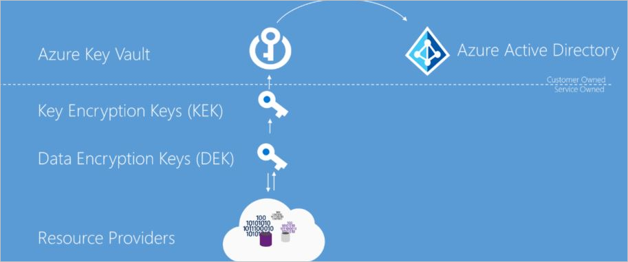
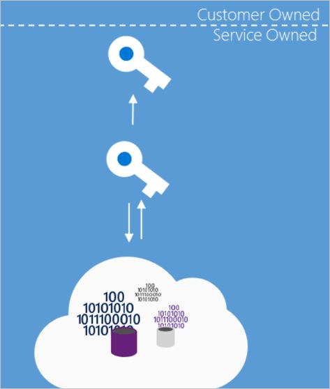

# Azure Data Encryption-at-Rest

Microsoft Azure includes tools to safeguard data according to your company’s security and compliance needs. This paper focuses on:

- How data is protected at rest across Microsoft Azure
- Discusses the various components taking part in the data protection implementation,
- Reviews pros and cons of the different key management protection approaches.

Encryption at Rest is a common security requirement. In Azure, organizations can encrypt data at rest without the risk or cost of a custom key management solution. Organizations have the option of letting Azure completely manage Encryption at Rest. Additionally, organizations have various options to closely manage encryption or encryption keys.

## What is encryption at rest?

Encryption at Rest is the encoding (encryption) of data when it is persisted. The Encryption at Rest designs in Azure use symmetric encryption to encrypt and decrypt large amounts of data quickly according to a simple conceptual model:

- A symmetric encryption key is used to encrypt data as it is written to storage.
- The same encryption key is used to decrypt that data as it is readied for use in memory.
- Data may be partitioned, and different keys may be used for each partition.
- Keys must be stored in a secure location with identity-based access control and audit policies. Data encryption keys are often encrypted with asymmetric encryption to further limit access.

In practice, key management and control scenarios, as well as scale and availability assurances, require additional constructs. Microsoft Azure Encryption at Rest concepts and components are described below.

## The purpose of encryption at rest

Encryption at rest provides data protection for stored data (at rest). Attacks against data at-rest include attempts to obtain physical access to the hardware on which the data is stored, and then compromise the contained data. In such an attack, a server’s hard drive may have been mishandled during maintenance allowing an attacker to remove the hard drive. Later the attacker would put the hard drive into a computer under their control to attempt to access the data.

Encryption at rest is designed to prevent the attacker from accessing the unencrypted data by ensuring the data is encrypted when on disk. If an attacker obtains a hard drive with encrypted data but not the encryption keys, the attacker must defeat the encryption to read the data. This attack is much more complex and resource consuming than accessing unencrypted data on a hard drive. For this reason, encryption at rest is highly recommended and is a high priority requirement for many organizations.

Encryption at rest may also be required by an organization’s need for data governance and compliance efforts. Industry and government regulations such as HIPAA, PCI and FedRAMP, lay out specific safeguards regarding data protection and encryption requirements. Encryption at rest is a mandatory measure required for compliance with some of those regulations.

In addition to satisfying compliance and regulatory requirements, encryption at rest provides defense-in-depth protection. Microsoft Azure provides a compliant platform for services, applications, and data. It also provides comprehensive facility and physical security, data access control, and auditing. However, it's important to provide additional “overlapping” security measures in case one of the other security measures fails and encryption at rest provides such a security measure

Microsoft is committed to encryption at rest options across cloud services and giving customers control of encryption keys and logs of key use. Additionally, Microsoft is working towards encrypting all customer data at rest by default.

## Azure Encryption at Rest Components

As described previously, the goal of encryption at rest is that data that is persisted on disk is encrypted with a secret encryption key. To achieve that goal secure key creation, storage, access control, and management of the encryption keys must be provided. Though details may vary, Azure services Encryption at Rest implementations can be described in terms illustrated in the following diagram.

### Azure Key Vault

The storage location of the encryption keys and access control to those keys is central to an encryption at rest model. The keys need to be highly secured but manageable by specified users and available to specific services. For Azure services, Azure Key Vault is the recommended key storage solution and provides a common management experience across services. Keys are stored and managed in key vaults, and access to a key vault can be given to users or services. Azure Key Vault supports customer creation of keys or import of customer keys for use in customer-managed encryption key scenarios.

### Azure Active Directory

Permissions to use the keys stored in Azure Key Vault, either to manage or to access them for Encryption at Rest encryption and decryption, can be given to Azure Active Directory accounts.

### Key Hierarchy

More than one encryption key is used in an encryption at rest implementation. Asymmetric encryption is useful for establishing the trust and authentication needed for key access and management. Symmetric encryption is more efficient for bulk encryption and decryption, allowing for stronger encryption and better performance. Limiting the use of a single encryption key decreases the risk that the key will be compromised and the cost of re-encryption when a key must be replaced. Azure encryptions at rest models use a key hierarchy made up of the following types of keys:

- **Data Encryption Key (DEK)** – A symmetric AES256 key used to encrypt a partition or block of data.  A single resource may have many partitions and many Data Encryption Keys. Encrypting each block of data with a different key makes crypto analysis attacks more difficult. Access to DEKs is needed by the resource provider or application instance that is encrypting and decrypting a specific block. When a DEK is replaced with a new key only the data in its associated block must be re-encrypted with the new key.
- **Key Encryption Key (KEK)** – An asymmetric encryption key used to encrypt the Data Encryption Keys. Use of a Key Encryption Key allows the data encryption keys themselves to be encrypted and controlled. The entity that has access to the KEK may be different than the entity that requires the DEK. An entity may broker access to the DEK to limit the access of each DEK to a specific partition. Since the KEK is required to decrypt the DEKs, the KEK is effectively a single point by which DEKs can be effectively deleted by deletion of the KEK.

The Data Encryption Keys, encrypted with the Key Encryption Keys are stored separately and only an entity with access to the Key Encryption Key can get any Data Encryption Keys encrypted with that key. Different models of key storage are supported. We will discuss each model in more detail later in the next section.

## Data Encryption Models

An understanding of the various encryption models and their pros and cons is essential for understanding how the various resource providers in Azure implement encryption at Rest. These definitions are shared across all resource providers in Azure to ensure common language and taxonomy.

There are three scenarios for server-side encryption:

- Server-side encryption using Service-Managed keys
  - Azure Resource Providers perform the encryption and decryption operations
  - Microsoft manages the keys
  - Full cloud functionality

- Server-side encryption using customer-managed keys in Azure Key Vault
  - Azure Resource Providers perform the encryption and decryption operations
  - Customer controls keys via Azure Key Vault
  - Full cloud functionality

- Server-side encryption using customer-managed keys on customer-controlled hardware
  - Azure Resource Providers perform the encryption and decryption operations
  - Customer controls keys on customer-controlled hardware
  - Full cloud functionality

For client-side encryption, consider the following:

- Azure services cannot see decrypted data
- Customers manage and store keys on-premises (or in other secure stores). Keys are not available to Azure services
- Reduced cloud functionality

The supported encryption models in Azure split into two main groups: “Client Encryption” and “Server-side Encryption” as mentioned previously. Independent of the encryption at rest model used, Azure services always recommend the use of a secure transport such as TLS or HTTPS. Therefore, encryption in transport should be addressed by the transport protocol and should not be a major factor in determining which encryption at rest model to use.

### Client encryption model

Client Encryption model refers to encryption that is performed outside of the Resource Provider or Azure by the service or calling application. The encryption can be performed by the service application in Azure, or by an application running in the customer data center. In either case, when leveraging this encryption model, the Azure Resource Provider receives an encrypted blob of data without the ability to decrypt the data in any way or have access to the encryption keys. In this model, the key management is done by the calling service/application and is opaque to the Azure service.

### Server-side encryption model

Server-side Encryption models refer to encryption that is performed by the Azure service. In that model, the Resource Provider performs the encrypt and decrypt operations. For example, Azure Storage may receive data in plain text operations and will perform the encryption and decryption internally. The Resource Provider might use encryption keys that are managed by Microsoft or by the customer depending on the provided configuration.

### Server-side encryption key management models

Each of the server-side encryption at rest models implies distinctive characteristics of key management. This includes where and how encryption keys are created, and stored as well as the access models and the key rotation procedures.

#### Server-side encryption using service-managed keys

For many customers, the essential requirement is to ensure that the data is encrypted whenever it is at rest. Server-side encryption using service-managed Keys enables this model by allowing customers to mark the specific resource (Storage Account, SQL DB, etc.) for encryption and leaving all key management aspects such as key issuance, rotation, and backup to Microsoft. Most Azure Services that support encryption at rest typically support this model of offloading the management of the encryption keys to Azure. The Azure resource provider creates the keys, places them in secure  storage, and retrieves them when needed. This means that the service has full access to the keys and the service has full control over the credential lifecycle management.

Server-side encryption using service-managed keys therefore quickly addresses the need to have encryption at rest with low overhead to the customer. When available a customer typically opens the Azure portal for the target subscription and resource provider and checks a box indicating, they would like the data to be encrypted. In some Resource Managers server-side encryption with service-managed keys is on by default.

Server-side encryption with Microsoft-managed keys does imply the service has full access to store and manage the keys. While some customers may want to manage the keys because they feel they gain greater security, the cost and risk associated with a custom key storage solution should be considered when evaluating this model. In many cases, an organization may determine that resource constraints or risks of an on-premises solution may be greater than the risk of cloud management of the encryption at rest keys.  However, this model might not be sufficient for organizations that have requirements to control the creation or lifecycle of the encryption keys or to have different personnel manage a service’s encryption keys than those managing the service (that is, segregation of key management from the overall management model for the service).

##### Key access

When Server-side encryption with service-managed keys is used, the key creation, storage, and service access are all managed by the service. Typically, the foundational Azure resource providers will store the Data Encryption Keys in a store that is close to the data and quickly available and accessible while the Key Encryption Keys are stored in a secure internal store.

**Advantages**

- Simple setup
- Microsoft manages key rotation, backup, and redundancy
- Customer does not have the cost associated with implementation or the risk of a custom key management scheme.

**Disadvantages**

- No customer control over the encryption keys (key specification, lifecycle, revocation, etc.)
- No ability to segregate key management from overall management model for the service

#### Server-side encryption using customer-managed keys in Azure Key Vault

For scenarios where the requirement is to encrypt the data at rest and control the encryption keys customers can use server-side encryption using customer-managed Keys in Key Vault. Some services may store only the root Key Encryption Key in Azure Key Vault and store the encrypted Data Encryption Key in an internal location closer to the data. In that scenario customers can bring their own keys to Key Vault (BYOK – Bring Your Own Key), or generate new ones, and use them to encrypt the desired resources. While the Resource Provider performs the encryption and decryption operations it uses the configured key as the root key for all encryption operations.

##### Key Access

The server-side encryption model with customer-managed keys in Azure Key Vault involves the service accessing the keys to encrypt and decrypt as needed. Encryption at rest keys are made accessible to a service through an access control policy. This policy grants the service identity access to receive the key. An Azure service running on behalf of an associated subscription can be configured with an identity in that subscription. The service can perform Azure Active Directory authentication and receive an authentication token identifying itself as that service acting on behalf of the subscription. That token can then be presented to Key Vault to obtain a key it has been given access to.

For operations using encryption keys, a service identity can be granted access to any of the following operations: decrypt, encrypt, unwrapKey, wrapKey, verify, sign, get, list, update, create, import, delete, backup, and restore.

To obtain a key for use in encrypting or decrypting data at rest the service identity that the Resource Manager service instance will run as must have UnwrapKey (to get the key for decryption) and WrapKey (to insert a key into key vault when creating a new key).

>[!NOTE]
>For more detail on Key Vault authorization see the secure your key vault page in the [Azure Key Vault documentation](https://docs.microsoft.com/azure/key-vault/key-vault-secure-your-key-vault).

**Advantages**

- Full control over the keys used – encryption keys are managed in the customer’s Key Vault under the customer’s control.
- Ability to encrypt multiple services to one master
- Can segregate key management from overall management model for the service
- Can define service and key location across regions

**Disadvantages**

- Customer has full responsibility for key access management
- Customer has full responsibility for key lifecycle management
- Additional Setup & configuration overhead

#### Server-side encryption using service-managed keys in customer-controlled hardware

Some Azure services enable the Host Your Own Key (HYOK) key management model. This management mode is useful in scenarios where there is a need to encrypt the data at rest and manage the keys in a proprietary repository outside of Microsoft’s control. In this model, the service must retrieve the key from an external site. Performance and availability guarantees are impacted, and configuration is more complex. Additionally, since the service does have access to the DEK during the encryption and decryption operations the overall security guarantees of this model are similar to when the keys are customer-managed in Azure Key Vault.  As a result, this model is not appropriate for most organizations unless they have specific key management requirements. Due to these limitations, most Azure Services do not support server-side encryption using server-managed keys in customer-controlled hardware.

##### Key Access

When server-side encryption using service-managed keys in customer-controlled hardware is used the keys are maintained on a system configured by the customer. Azure services that support this model provide a means of establishing a secure connection to a customer supplied key store.

**Advantages**

- Full control over the root key used – encryption keys are managed by a customer provided store
- Ability to encrypt multiple services to one master
- Can segregate key management from overall management model for the service
- Can define service and key location across regions

**Disadvantages**

- Full responsibility for key storage, security, performance, and availability
- Full responsibility for key access management
- Full responsibility for key lifecycle management
- Significant setup, configuration, and ongoing maintenance costs
- Increased dependency on network availability between the customer datacenter and Azure datacenters.

## Encryption at rest in Microsoft cloud services

Microsoft Cloud services are used in all three cloud models: IaaS, PaaS, SaaS. Below you have examples of how they fit on each model:

- Software services, referred to as Software as a Server or SaaS, which have application provided by the cloud such as Office 365.
- Platform services which customers leverage the cloud in their applications, using the cloud for things like storage, analytics, and service bus functionality.
- Infrastructure services, or Infrastructure as a Service (IaaS) in which customer deploys operating systems and applications that are hosted in the cloud and possibly leveraging other cloud services.

### Encryption at rest for SaaS customers

Software as a Service (SaaS) customers typically have encryption at rest enabled or available in each service. Office 365 has several options for customers to verify or enable encryption at rest. For information about Office 365 services, see [Encryption in Office 365](https://docs.microsoft.com/office365/securitycompliance/encryption).

### Encryption at rest for PaaS customers

Platform as a Service (PaaS) customer’s data typically resides in a storage service such as Blob Storage but may also be cached or stored in the application execution environment, such as a virtual machine. To see the encryption at rest options available to you, examine the table below for the storage and application platforms that you use.

### Encryption at rest for IaaS customers

Infrastructure as a Service (IaaS) customers can have a variety of services and applications in use. IaaS services can enable encryption at rest in their Azure hosted virtual machines and VHDs using Azure Disk Encryption.

#### Encrypted storage

Like PaaS, IaaS solutions can leverage other Azure services that store data encrypted at rest. In these cases, you can enable the Encryption at Rest support as provided by each consumed Azure service. The below table enumerates the major storage, services, and application platforms and the model of Encryption at Rest supported. 

#### Encrypted compute

All Managed Disks, Snapshots, and Images are encrypted using Storage Service Encryption using a service-managed key. A more complete Encryption at Rest solution ensures that the data is never persisted in unencrypted form. While processing the data on a virtual machine, data can be persisted to the Windows page file or Linux swap file, a crash dump, or to an application log. To ensure this data is encrypted at rest, IaaS applications can use Azure Disk Encryption on an Azure IaaS virtual machine (Windows or Linux) and virtual disk.

#### Custom encryption at rest

It is recommended that whenever possible, IaaS applications leverage Azure Disk Encryption and Encryption at Rest options provided by any consumed Azure services. In some cases, such as irregular encryption requirements or non-Azure based storage, a developer of an IaaS application may need to implement encryption at rest themselves. Developers of IaaS solutions can better integrate with Azure management and customer expectations by leveraging certain Azure components. Specifically, developers should use the Azure Key Vault service to provide secure key storage as well as provide their customers with consistent key management options with that of most Azure platform services. Additionally, custom solutions should use Azure-Managed Service Identities to enable service accounts to access encryption keys. For developer information on Azure Key Vault and Managed Service Identities, see their respective SDKs.

## Azure resource providers encryption model support

Microsoft Azure Services each support one or more of the encryption at rest models. For some services, however, one or more of the encryption models may not be applicable. For services that support customer-managed key scenarios, they may support only a subset of the key types that Azure Key Vault supports for key encryption keys. Additionally, services may release support for these scenarios and key types at different schedules. This section describes the encryption at rest support at the time of this writing for each of the major Azure data storage services.

### Azure disk encryption

Any customer using Azure Infrastructure as a Service (IaaS) features can achieve encryption at rest for their IaaS VMs and disks through Azure Disk Encryption. For more information on Azure Disk encryption, see the [Azure Disk Encryption documentation](https://docs.microsoft.com/azure/security/azure-security-disk-encryption).

#### Azure storage

All Azure Storage services (Blob storage, Queue storage, Table storage, and Azure Files) support server-side encryption at rest; some services additionally support customer-managed keys and client-side encryption. 

- Server-side: All Azure Storage Services enable server-side encryption by default using service-managed keys, which is transparent to the application. For more information, see [Azure Storage Service Encryption for Data at Rest](https://docs.microsoft.com/azure/storage/storage-service-encryption). Azure Blob storage and Azure Files also support RSA 2048-bit customer-managed keys in Azure Key Vault. For more information, see [Storage Service Encryption using customer-managed keys in Azure Key Vault](https://docs.microsoft.com/azure/storage/common/storage-service-encryption-customer-managed-keys).
- Client-side: Azure Blobs, Tables, and Queues support client-side encryption. When using client-side encryption, customers encrypt the data and upload the data as an encrypted blob. Key management is done by the customer. For more information, see [Client-Side Encryption and Azure Key Vault for Microsoft Azure Storage](https://docs.microsoft.com/azure/storage/storage-client-side-encryption).

#### Azure SQL Database

Azure SQL Database currently supports encryption at rest for Microsoft-managed service side and client-side encryption scenarios.

Support for server encryption is currently provided through the SQL feature called Transparent Data Encryption. Once an Azure SQL Database customer enables TDE key are automatically created and managed for them. Encryption at rest can be enabled at the database and server levels. As of June 2017, [Transparent Data Encryption (TDE)](https://msdn.microsoft.com/library/bb934049.aspx) is enabled by default on newly created databases. Azure SQL Database supports RSA 2048-bit customer-managed keys in Azure Key Vault. For more information, see [Transparent Data Encryption with Bring Your Own Key support for Azure SQL Database and Data Warehouse](https://docs.microsoft.com/sql/relational-databases/security/encryption/transparent-data-encryption-byok-azure-sql?view=azuresqldb-current).

Client-side encryption of Azure SQL Database data is supported through the [Always Encrypted](https://msdn.microsoft.com/library/mt163865.aspx) feature. Always Encrypted uses a key that created and stored by the client. Customers can store the master key in a Windows certificate store, Azure Key Vault, or a local Hardware Security Module. Using SQL Server Management Studio, SQL users choose what key they’d like to use to encrypt which column.

|                                  |                    | **Encryption Model and Key Management** |                    |
|----------------------------------|--------------------|-----------------------------------------|--------------------|
|                                  | **Server-Side Using Service-Managed Key**     | **Server-Side Using Customer-Managed Key**             | **Client-Side Using Client-Managed**      |
| **AI and Machine Learning**      |                    |                    |                    |
| Azure Search                     | Yes                | -                  | -                  |
| Azure Machine Learning Service   | Yes                | -                  | -                  |
| Azure Machine Learning Studio    | Yes                | Preview, RSA 2048-bit | -               |
| Power BI                         | Yes                | Preview, RSA 2048-bit | -                  |
| **Analytics**                    |                    |                    |                    |
| Azure Stream Analytics           | Yes                | -                  | -                  |
| Event Hubs                       | Yes                | -                  | -                  |
| Azure Analysis Services          | Yes                | -                  | -                  |
| Azure Data Catalog               | Yes                | -                  | -                  |
| HDInsight                        | Yes                | Preview for Apache Kafka, All RSA Lengths | -                  |
| Azure Data Factory               | Yes                | -                  | -                  |
| Azure Data Lake Store            | Yes                | Yes, RSA 2048-bit  | -                  |
| **Containers**                   |                    |                    |                    |
| Azure Kubernetes Service         | Yes                | -                  | -                  |
| Container Registry               | Yes                | -                  | -                  |
| **Compute**                      |                    |                    |                    |
| Virtual Machines                 | Yes                | Yes, RSA 2048-bit  | -                  |
| Virtual Machine Scale Set        | Yes                | Yes, RSA 2048-bit  | -                  |
| SAP HANA                         | Yes                | Yes, RSA 2048-bit  | -                  |
| **Databases**                    |                    |                    |                    |
| SQL Server on Virtual Machines   | Yes                | Yes, RSA 2048-bit  | Yes                |
| Azure SQL Database               | Yes                | Yes, RSA 2048-bit  | Yes                |
| Azure SQL Database for MariaDB   | Yes                | -                  | -                  |
| Azure SQL Database for MySQL     | Yes                | -                  | -                  |
| Azure SQL Database for PostgreSQL | Yes                | -                  | -                  |
| Azure SQL Data Warehouse         | Yes                | Yes, RSA 2048-bit  | Yes                |
| SQL Server Stretch Database      | Yes                | Yes, RSA 2048-bit  | Yes                |
| Table Storage                    | Yes                | -                  | Yes                |
| Azure Cosmos DB                  | Yes                | -                  | -                  |
| **DevOps**                       |                    |                    |                    |
| Azure DevOps                     | Yes                | -                  | Yes                |
| Azure Repos                      | Yes                | -                  | Yes                |
| **Identity**                     |                    |                    |                    |
| Azure Active Directory           | Yes                | -                  | -                  |
| Azure Active Directory Domain Services | Yes          | Yes, RSA 2048-bit  | -                  |
| **Integration**                  |                    |                    |                    |
| Service Bus                      | Yes                | -                  | Yes                |
| Event Grid                       | Yes                | -                  | -                  |
| API Management                   | Yes                | -                  | -                  |
| **IoT Services**                 |                    |                    |                    |
| IoT Hub                          | -                  | -                  | Yes                |
| **Management and Governance**    |                    |                    |                    |
| Azure Site Recovery              | Yes                | Yes, RSA 2048-bit  | Yes                |
| **Media**                        |                    |                    |                    |
| Media Services                   | Yes                | -                  | Yes                |
| **Storage**                      |                    |                    |                    |
| Blob Storage                     | Yes                | Yes, RSA 2048-bit  | Yes                |
| Disk Storage                     | Yes                | -                  | -                  |
| Managed Disk Storage             | Yes                | -                  | -                  |
| File Storage                     | Yes                | Yes, RSA 2048-bit  | -                  |
| Queue Storage                    | Yes                | -                  | Yes                |
| Avere vFXT                       | Yes                | -                  | -                  |
| Azure NetApp Files               | Yes                | -                  | -                  |
| Archive Storage                  | Yes                | Yes, RSA 2048-bit  | -                  |
| StorSimple                       | Yes                | Yes, RSA 2048-bit  | Yes                |
| Azure Backup                     | Yes                | -                  | Yes                |
| Data Box                         | Yes                | -                  | Yes                |

## Conclusion

Protection of customer data stored within Azure Services is of paramount importance to Microsoft. All Azure hosted services are committed to providing Encryption at Rest options. Foundational services such as Azure Storage, Azure SQL Database, and key analytics and intelligence services already provide Encryption at Rest options. Some of these services support either customer controlled keys and client-side encryption as well as service-managed keys and encryption. Microsoft Azure services are broadly enhancing Encryption at Rest availability and new options are planned for preview and general availability in the upcoming months.
