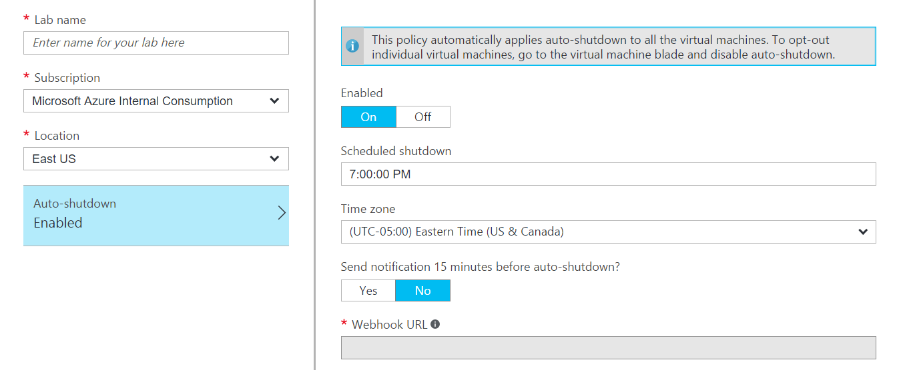
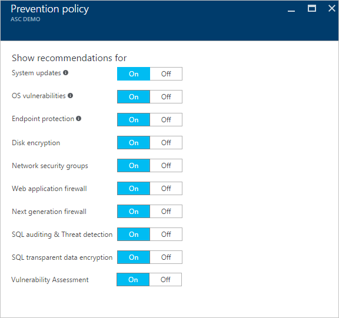
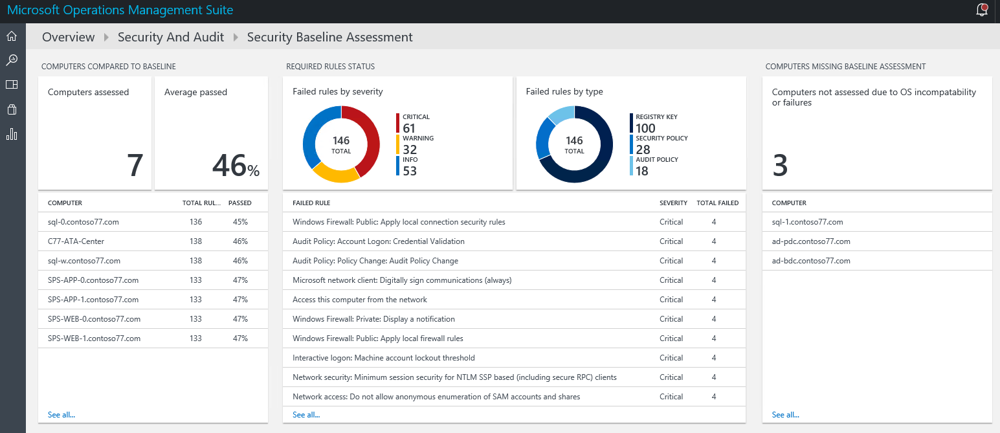

# Security best practices for IaaS workloads in Azure

As you started thinking about moving workloads to Azure infrastructure as a service (IaaS), you probably realized that some considerations are familiar. You might already have experience securing virtual environments. When you move to Azure IaaS, you can apply your expertise in securing virtual environments and use a new set of options to help secure your assets.

Let's start by saying that we should not expect to bring on-premises resources as one-to-one to Azure. The new challenges and the new options bring an opportunity to reevaluate existing deigns, tools, and processes.

Your responsibility for security is based on the type of cloud service. The following chart summarizes the balance of responsibility for both Microsoft and you:

We'll discuss some of the options available in Azure that can help you meet your organization’s security requirements. Keep in mind that security requirements can vary for different types of workloads. Not one of these best practices can by itself secure your systems. Like anything else in security, you have to choose the appropriate options and see how the solutions can complement each other by filling gaps.

## Use Privileged Access Workstations

Organizations often fall prey to cyberattacks because administrators perform actions while using accounts with elevated rights. Usually this isn’t done maliciously but because existing configuration and processes allow it. Most of these users understand the risk of these actions from a conceptual standpoint but still choose to do them.

Doing things like checking email and browsing the Internet seem innocent enough. But they might expose elevated accounts to compromise by malicious actors who can use browsing activities, specially crafted emails, or other techniques to gain access to your enterprise. We highly recommend the use of secure management workstations for conducting all Azure administration tasks, as a way of reducing exposure to accidental compromise.

Privileged Access Workstations (PAWs) provide a dedicated operating system for sensitive tasks--one that is protected from Internet attacks and threat vectors. Separating these sensitive tasks and accounts from the daily-use workstations and devices provides strong protection from phishing attacks, application and OS vulnerabilities, various impersonation attacks, and credential theft attacks such as keystroke logging, Pass-the-Hash, and Pass-the-Ticket.

The PAW approach is an extension of the well-established and recommended practice to use an individually assigned administrative account that is separate from a standard user account. A PAW provides a trustworthy workstation for those sensitive accounts.

For more information and implementation guidance, see [Privileged Access Workstations](https://technet.microsoft.com/windows-server-docs/security/securing-privileged-access/privileged-access-workstations).

## Use Multi-Factor Authentication

In the past, your network perimeter was used to control access to corporate data. In a cloud-first, mobile-first world, identity is the control plane: You use it to control access to IaaS services from any device. You also use it to get visibility and insight into where and how your data is being used. Protecting the digital identity of your Azure users is the cornerstone of protecting your subscriptions from identity theft and other cybercrimes.

One of the most beneficial steps that you can take to secure an account is to enable two-factor authentication. Two-factor authentication is a way of authenticating by using something in addition to a password. It helps mitigate the risk of access by someone who manages to get someone else’s password.

[Azure Multi-Factor Authentication](../multi-factor-authentication/multi-factor-authentication.md) helps safeguard access to data and applications while meeting user demand for a simple sign-in process. It delivers strong authentication with a range of easy verification options--phone call, text message, or mobile app notification. Users choose the method that they prefer.

The easiest way to use Multi-Factor Authentication is the Microsoft Authenticator mobile app that can be used on mobile devices running Windows, iOS, and Android. With the latest release of Windows 10 and the integration of on-premises Active Directory with Azure Active Directory (Azure AD), [Windows Hello for Business](../active-directory/active-directory-azureadjoin-passport-deployment.md) can be used for seamless single sign-on to Azure resources. In this case, the Windows 10 device is used as the second factor for authentication.

For accounts that manage your Azure subscription and for accounts that can sign in to virtual machines, using Multi-Factor Authentication gives you a much greater level of security than using only a password. Other forms of two-factor authentication might work just as well, but deploying them might be complicated if they're not already in production.

The following screenshot shows some of the options available for Azure Multi-Factor Authentication:

## Limit and constrain administrative access

Securing the accounts that can manage your Azure subscription is extremely important. The compromise of any of those accounts negates the value of all the other steps that you might take to ensure the confidentiality and integrity of your data. As recently illustrated by the [Edward Snowden](https://en.wikipedia.org/wiki/Edward_Snowden) leak of classified information, internal attacks pose a huge threat to the overall security of any organization.

Evaluate individuals for administrative rights by following criteria similar to these:

- Are they performing tasks that require administrative privileges?
- How often are the tasks performed?
- Is there a specific reason why the tasks cannot be performed by another administrator on their behalf?

Document all other known alternative approaches to granting the privilege and why each isn't acceptable.

The use of just-in-time administration prevents the unnecessary existence of accounts with elevated rights during periods when those rights are not needed. Accounts have elevated rights for a limited time so that administrators can do their jobs. Then, those rights are removed at the end of a shift or when a task is completed.

You can use [Privileged Identity Management](../active-directory/active-directory-privileged-identity-management-configure.md) to manage, monitor, and control access in your organization. It helps you remain aware of the actions that individuals take in your organization. It also brings just-in-time administration to Azure AD by introducing the concept of eligible admins. These are individuals who have accounts with the potential to be granted admin rights. These types of users can go through an activation process and be granted admin rights for a limited time.

## Use DevTest Labs

Using Azure for labs and development environments enables organizations to gain agility in testing and development by taking away the delays that hardware procurement introduces. Unfortunately, a lack of familiarity with Azure or a desire to help expedite its adoption might lead the administrator to be overly permissive with rights assignment. This risk might unintentionally expose the organization to internal attacks. Some users might be granted a lot more access than they should have.

The [Azure DevTest Labs](../devtest-lab/devtest-lab-overview.md) service uses [Azure Role-Based Access Control](../active-directory/role-based-access-control-what-is.md) (RBAC). By using RBAC, you can segregate duties within your team into roles that grant only the level of access necessary for users to do their jobs. RBAC comes with predefined roles (owner, lab user, and contributor). You can even use these roles to assign rights to external partners and greatly simplify collaboration.

Because DevTest Labs uses RBAC, it's possible to create additional, [custom roles](../devtest-lab/devtest-lab-grant-user-permissions-to-specific-lab-policies.md). DevTest Labs not only simplifies the management of permissions, it simplifies the process of getting environments provisioned. It also helps you deal with other typical challenges of teams that are working on development and test environments. It requires some preparation, but in the long term, it will make things easier for your team.

Azure DevTest Labs features include:

- Administrative control over the options available to users. The administrator can centrally manage things like allowed VM sizes, maximum number of VMs, and when VMs are started and shut down.
- Automation of lab environment creation.
- Cost tracking.
- Simplified distribution of VMs for temporary collaborative work.
- Self-service that enables users to provision their labs by using templates.
- Managing and limiting consumption.

No additional cost is associated with the usage of DevTest Labs. The creation of labs, policies, templates, and artifacts is free. You pay for only the Azure resources used in your labs, such as virtual machines, storage accounts, and virtual networks.

## Control and limit endpoint access

Hosting labs or production systems in Azure means that your systems need to be accessible from the Internet. By default, a new Windows virtual machine has the RDP port accessible from the Internet, and a Linux virtual machine has the SSH port open. Taking steps to limit exposed endpoints is necessary to minimize the risk of unauthorized access.

Technologies in Azure can help you limit the access to those administrative endpoints. In Azure, you can use [network security groups](../virtual-network/virtual-networks-nsg.md) (NSGs). When you use Azure Resource Manager for deployment, NSGs limit the access from all networks to just the management endpoints (RDP or SSH). When you think NSGs, think router ACLs. You can use them to tightly control the network communication between various segments of your Azure networks. This is similar to creating networks in perimeter networks or other isolated networks. They do not inspect the traffic, but they do help with network segmentation.

In Azure, you can configure a [site-to-site VPN](../vpn-gateway/vpn-gateway-howto-site-to-site-resource-manager-portal.md) from your on-premises network. A site-to-site VPN extends your on-premises network to the cloud. This gives you another opportunity to use NSGs, because you can also modify the NSGs to not allow access from anywhere other than the local network. You can then require that administration is done by first connecting to the Azure network via VPN.

The site-to-site VPN option might be most attractive in cases where you are hosting production systems that are closely integrated with your on-premises resources in Azure.

Alternatively, you can use the [point-to-site](../vpn-gateway/vpn-gateway-howto-point-to-site-rm-ps.md) option in situations where you want to manage systems that don't need access to on-premises resources. Those systems can be isolated in their own Azure virtual network. Administrators can VPN into the Azure hosted environment from their administrative workstation.

>[!NOTE]
>You can use either VPN option to reconfigure the ACLs on the NSGs to not allow access to management endpoints from the Internet.

Another option worth considering is a [Remote Desktop Gateway](../multi-factor-authentication/multi-factor-authentication-get-started-server-rdg.md) deployment. You can use this deployment to securely connect to Remote Desktop servers over HTTPS, while applying more detailed controls to those connections.

Features that you would have access to include:

- Administrator options to limit connections to requests from specific systems.
- Smart-card authentication or Azure Multi-Factor Authentication.
- Control over which systems someone can connect to via the gateway.
- Control over device and disk redirection.

## Use a key management solution

Secure key management is essential to protecting data in the cloud. With [Azure Key Vault](../key-vault/key-vault-whatis.md), you can securely store encryption keys and small secrets like passwords in hardware security modules (HSMs). For added assurance, you can import or generate keys in HSMs.

Microsoft processes your keys in FIPS 140-2 Level 2 validated HSMs (hardware and firmware). Monitor and audit key use with Azure logging: pipe logs into Azure or your Security Information and Event Management (SIEM) system for additional analysis and threat detection.

Anyone with an Azure subscription can create and use key vaults. Although Key Vault benefits developers and security administrators, it can be implemented and managed by an administrator who is responsible for managing Azure services in an organization.

## Encrypt virtual disks and disk storage

[Azure Disk Encryption](https://gallery.technet.microsoft.com/Azure-Disk-Encryption-for-a0018eb0) addresses the threat of data theft or exposure from unauthorized access that's achieved by moving a disk. The disk can be attached to another system as a way of bypassing other security controls. Disk encryption uses [BitLocker](https://technet.microsoft.com/library/hh831713) in Windows and DM-Crypt in Linux to encrypt operating system and data drives. Azure Disk Encryption integrates with Key Vault to control and manage the encryption keys. It's available for standard VMs and VMs with premium storage.

For more information, see [Azure Disk Encryption in Windows and Linux IaaS VMs](azure-security-disk-encryption.md).

[Azure Storage Service Encryption](../storage/storage-service-encryption.md) helps protect your data at rest. It's enabled at the storage account level. It encrypts data as it's written in our datacenters, and it's automatically decrypted as you access it. It supports the following scenarios:

- Encryption of block blobs, append blobs, and page blobs
- Encryption of archived VHDs and templates brought to Azure from on-premises
- Encryption of underlying OS and data disks for IaaS VMs that you created by using your VHDs

Before you proceed with Azure Storage Encryption, be aware of two limitations:

- It is not available on classic storage accounts.
- It encrypts only data written after encryption is enabled.

## Use a centralized security management system

Your servers need to be monitored for patching, configuration, events, and activities that might be considered security concerns. To address those concerns, you can use [Security Center](https://azure.microsoft.com/services/security-center/) and [Operations Management Suite Security and Compliance](https://azure.microsoft.com/services/security-center/). Both of these options go beyond the configuration in the operating system. They also provide monitoring of the configuration of the underlying infrastructure, like network configuration and virtual appliance use.

## Manage operating systems

In an IaaS deployment, you are still responsible for the management of the systems that you deploy, just like any other server or workstation in your environment. Patching, hardening, rights assignments, and any other activity related to the maintenance of your system are still your responsibility. For systems that are tightly integrated with your on-premises resources, you might want to use the same tools and procedures that you're using on-premises for things like antivirus, antimalware, patching, and backup.

### Harden systems
All virtual machines in Azure IaaS should be hardened so that they expose only service endpoints that are required for the applications that are installed. For Windows virtual machines, follow the recommendations that Microsoft publishes as baselines for the [Security Compliance Manager](https://technet.microsoft.com/solutionaccelerators/cc835245.aspx) solution.

Security Compliance Manager is a free tool. You can use it to quickly configure and manage your desktops, traditional datacenter, and private and public cloud by using Group Policy and System Center Configuration Manager.

Security Compliance Manager provides ready-to-deploy policies and Desired Configuration Management configuration packs that are tested. These baselines are based on [Microsoft Security Guidance](https://technet.microsoft.com/en-us/library/cc184906.aspx) recommendations and industry best practices. They help you manage configuration drift, address compliance requirements, and reduce security threats.

You can use Security Compliance Manager to import the current configuration of your computers by using two different methods. First, you can import Active Directory-based group policies. Second, you can import the configuration of a “golden master” reference machine by using the [LocalGPO tool](https://blogs.technet.microsoft.com/secguide/2016/01/21/lgpo-exe-local-group-policy-object-utility-v1-0/) to back up the local group policy. You can then import the local group policy into Security Compliance Manager.

Compare your standards to industry best practices, customize them, and create new policies and Desired Configuration Management configuration packs. Baselines have been published for all supported operating systems, including Windows 10 Anniversary Update and Windows Server 2016.

### Install and manage antimalware

For environments that are hosted separately from your production environment, you can use an antimalware extension to help protect your virtual machines and cloud services. It integrates with [Azure Security Center](../security-center/security-center-intro.md).

[Microsoft Antimalware](azure-security-antimalware.md) includes features like real-time protection, scheduled scanning, malware remediation, signature updates, engine updates, samples reporting, exclusion event collection, and [PowerShell support](https://msdn.microsoft.com/library/dn771715.aspx).

### Install the latest security updates
Some of the first workloads that customers move to Azure are labs and external-facing systems. If your Azure-hosted virtual machines host applications or services that need to be accessible to the Internet, be vigilant about patching. Patch beyond the operating system. Unpatched vulnerabilities on third-party applications can also lead to problems that can be avoided if good patch management is in place.

### Deploy and test a backup solution

Just like security updates, a backup needs to be handled the same way that you handle any other operation. This is true of systems that are part of your production environment extending to the cloud. Test and dev systems must follow backup strategies that provide restore capabilities that are similar to what users have grown accustomed to, based on their experience with on-premises environments.

Production workloads moved to Azure should integrate with existing backup solutions when possible. Or, you can use [Azure Backup](../backup/backup-azure-arm-vms.md) to help address your backup requirements.

## Monitor

[Security Center](../security-center/security-center-intro.md) provides ongoing evaluation of the security state of your Azure resources to identify potential security vulnerabilities. A list of recommendations guides you through the process of configuring needed controls.

Examples include:

- Provisioning antimalware to help identify and remove malicious software.
- Configuring network security groups and rules to control traffic to virtual machines.
- Provisioning web application firewalls to help defend against attacks that target your web applications.
- Deploying missing system updates.
- Addressing OS configurations that do not match the recommended baselines.

The following image shows some of the options that you can enable in Security Center.

[Operations Management Suite](../operations-management-suite/operations-management-suite-overview.md) is a Microsoft cloud-based IT management solution that helps you manage and protect your on-premises and cloud infrastructure. Because Operations Management Suite is implemented as a cloud-based service, it can be deployed quickly and with minimal investment in infrastructure resources.

New features are delivered automatically, saving you from ongoing maintenance and upgrade costs. Operations Management Suite also integrates with System Center Operations Manager. It has different components to help you better manage your Azure workloads, including a [Security and Compliance](../operations-management-suite/oms-security-getting-started.md) module.

You can use the security and compliance features in Operations Management Suite to view information about your resources. The information is organized into four major categories:

- **Security domains**: Further explore security records over time. Access malware assessment, update assessment, network security information, identity and access information, and computers with security events. Take advantage of quick access to the Azure Security Center dashboard.
- **Notable issues**: Quickly identify the number of active issues and the severity of these issues.
- **Detections (preview)**: Identify attack patterns by visualizing security alerts as they happen against your resources.
- **Threat intelligence**: Identify attack patterns by visualizing the total number of servers with outbound malicious IP traffic, the malicious threat type, and a map that shows where these IPs are coming from.
- **Common security queries**: See a list of the most common security queries that you can use to monitor your environment. When you click one of those queries, the **Search** blade opens and shows the results for that query.

The following screenshot shows an example of the information that Operations Management Suite can display.

## Next steps

* [Azure Security Team Blog](https://blogs.msdn.microsoft.com/azuresecurity/)
* [Microsoft Security Response Center](https://technet.microsoft.com/library/dn440717.aspx)
* [Azure security best practices and patterns](security-best-practices-and-patterns.md)
