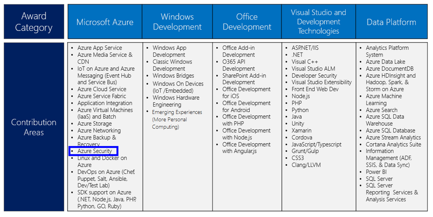

---
title: Azure Security MVP Program | Microsoft Docs
description: The article provides an overview of the Azure Security contribution area in the MVP Program.
services: security
documentationcenter: na
author: barclayn
manager: barbkess
editor: TomSh

ms.assetid: 34f4bdf0-7332-4c4a-b186-05263da700cf
ms.service: security
ms.devlang: na
ms.topic: article
ms.tgt_pltfrm: na
ms.workload: na
ms.date: 01/11/2019
ms.author: barclayn

---
# Azure Security MVP Program

Microsoft Most Valuable Professionals (MVPs) are community leaders who have demonstrated an exemplary commitment to helping others. MVPs enable others to get the most out of their experience with Microsoft technologies. They share their passion, real-world knowledge, and technical expertise with the community and with Microsoft.

Microsoft Azure now recognizes community experts with special expertise in Azure security. Microsoft MVPs can be awarded the MVP in Microsoft Azure in the Azure Security contribution area.

There is no benchmark for becoming an MVP. This is in part because it varies by technology and its life cycle. Some of the criteria includes:

- The impact of a nominee’s contributions to online forums such as Microsoft Answers, TechNet, and MSDN
- Wikis and online content
- Conferences and user groups
- Podcasts, Web sites, blogs, and social media
- Articles and books.
