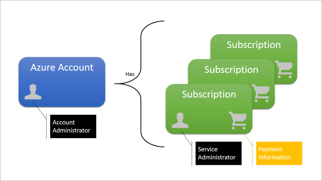
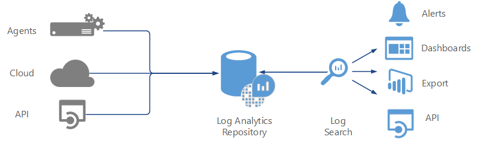

---

title: Azure security technical capabilities | Microsoft Docs
description: Learn about cloud-based computing services that include a wide selection of compute instances & services that can scale up and down automatically to meet the needs of your application or enterprise.
services: security
documentationcenter: na
author: UnifyCloud
manager: mbaldwin
editor: TomSh

ms.assetid: 
ms.service: security
ms.devlang: na
ms.topic: article
ms.tgt_pltfrm: na
ms.workload: na
ms.date: 11/01/2017
ms.author: TomSh

---
# Azure security technical capabilities

To assist current and prospective Azure customers understand and utilize the various security-related capabilities available in and surrounding the Azure Platform, Microsoft has developed a series of White Papers, Security Overviews, Best Practices, and Checklists. The topics range in terms of breadth and depth and are updated periodically. This document is part of that series as summarized in the Abstract section below. Further information on this Azure Security series can be found at (URL).

## Azure platform

[Microsoft Azure](https://azure.microsoft.com/overview/what-is-azure/) is a cloud platform comprised of infrastructure and application services, with integrated data services and advanced analytics, and developer tools and services, hosted within Microsoft’s public cloud data centers. Customers use Azure for many different capacities and scenarios, from basic compute, networking, and storage, to mobile and web app services, to full cloud scenarios like Internet of Things, and can be used with open source technologies, and deployed as hybrid cloud or hosted within a customer’s datacenter. Azure provides cloud technology as building blocks to help companies save costs, innovate quickly, and manage systems proactively. When you build on, or migrate IT assets to a cloud provider, you are relying on that organization’s abilities to protect your applications and data with the services and the controls they provide to manage the security of your cloud-based assets.

Microsoft Azure is the only cloud computing provider that offers a secure, consistent application platform and infrastructure-as-a-service for teams to work within their different cloud skillsets and levels of project complexity, with integrated data services and analytics that uncover intelligence from data wherever it exists, across both Microsoft and non-Microsoft platforms, open frameworks and tools, providing choice for integrating cloud with on-premises as well deploying Azure cloud services within on-premises datacenters. As part of the Microsoft Trusted Cloud, customers rely on Azure for industry-leading security, reliability, compliance, privacy, and the vast network of people, partners, and processes to support organizations in the cloud.

With Microsoft Azure, you can:

- Accelerate innovation with the cloud.

- Power business decisions & apps with insights.

- Build freely and deploy anywhere.

- Protect their business.

## Scope

The focal point of this whitepaper concerns security features and functionality supporting Microsoft Azure’s core components, namely [Microsoft Azure Storage](https://docs.microsoft.com/azure/storage/storage-introduction), [Microsoft Azure SQL Database](https://docs.microsoft.com/azure/sql-database/), [Microsoft Azure’s virtual machine model](https://docs.microsoft.com/azure/virtual-machines/), and the tools and infrastructure that manage it all. This white paper focus on Microsoft Azure technical capabilities available to you as customers to fulfil their role in protecting the security and privacy of their data.

The importance of understanding this shared responsibility model is essential for customers who are moving to the cloud. Cloud providers offer considerable advantages for security and compliance efforts, but these advantages do not absolve the customer from protecting their users, applications, and service offerings.

For IaaS solutions, the customer is responsible or has a shared responsibility for securing and managing the operating system, network configuration, applications, identity, clients, and data.  PaaS solutions build on IaaS deployments, the customer is still responsible or has a shared responsibility for securing and managing applications, identity, clients, and data. For SaaS solutions, Nonetheless, the customer continues to be accountable. They must ensure that data is classified correctly, and they share a responsibility to manage their users and end-point devices.

This document does not provide detailed coverage of any of the related Microsoft Azure platform components such as Azure Web Sites, Azure Active Directory, HDInsight, Media Services, and other services that are layered atop the core components. Although a minimum level of general information is provided, readers are assumed familiar with Azure basic concepts as described in other references provided by Microsoft and included in links provided in this white paper.

## Available security technical capabilities to fulfil user (Customer) responsibility - Big picture

Microsoft Azure provides services that can help customers meet the security, privacy, and compliance needs. The Following picture helps explain various Azure services available for users to build a secure and compliant application infrastructure based on industry standards.

## Manage and control identity and user access (Protect)

Azure helps you protect business and personal information by enabling you to manage user identities and credentials and control access.

### Azure Active Directory

Microsoft identity and access management solutions help IT protect access to applications and resources across the corporate datacenter and into the cloud, enabling additional levels of validation such as multi-factor authentication and conditional access policies. Monitoring suspicious activity through advanced security reporting, auditing and alerting helps mitigate potential security issues. [Azure Active Directory Premium](https://docs.microsoft.com/azure/active-directory/active-directory-editions) provides single sign-on to thousands of cloud (SaaS) apps and access to web apps you run on-premises.

Security benefits of Azure Active Directory (Azure AD) include the ability to:

- Create and manage a single identity for each user across your hybrid enterprise, keeping users, groups, and devices in sync.

- Provide single sign-on access to your applications including thousands of pre-integrated SaaS apps.

- Enable application access security by enforcing rules-based Multi-Factor Authentication for both on-premises and cloud applications.

- Provision secure remote access to on-premises web applications through Azure AD Application Proxy.

The [Azure Active Directory portal](http://aad.portal.azure.com/) is available a part of the Azure portal. From this dashboard, you can get an overview of the state of your organization, and easily dive into managing the directory, users, or application access.

The following are core Azure Identity management capabilities:

- Single sign-on

- Multi-factor authentication

- Security monitoring, alerts, and machine learning-based reports

- Consumer identity and access management

- Device registration

- Privileged identity management

- Identity protection

#### Single sign-on

[Single sign-on (SSO)](https://azure.microsoft.com/documentation/videos/overview-of-single-sign-on/) means being able to access all the applications and resources that you need to do business, by signing in only once using a single user account. Once signed in, you can access all the applications you need without being required to authenticate (for example, type a password) a second time.

Many organizations rely upon software as a service (SaaS) applications such as Office 365, Box and Salesforce for end-user productivity. Historically, IT staff needed to individually create and update user accounts in each SaaS application, and users had to remember a password for each SaaS application.

[Azure AD extends on-premises Active Directory into the cloud](https://docs.microsoft.com/azure/active-directory/active-directory-appssoaccess-whatis), enabling users to use their primary organizational account to not only sign in to their domain-joined devices and company resources, but also all the web and SaaS applications needed for their job.

Not only do users not have to manage multiple sets of usernames and passwords, application access can be automatically provisioned or de-provisioned based on organizational groups and their status as an employee. [Azure AD introduces security and access governance controls](https://docs.microsoft.com/azure/active-directory/active-directory-sso-integrate-saas-apps) that enable you to centrally manage users' access across SaaS applications.

#### Multi-factor authentication

[Azure Multi-factor Authentication (MFA)](https://docs.microsoft.com/azure/multi-factor-authentication/multi-factor-authentication) is a method of authentication that requires the use of more than one verification method and adds a critical second layer of security to user sign-ins and transactions. [MFA helps safeguard](https://docs.microsoft.com/azure/multi-factor-authentication/multi-factor-authentication-how-it-works) access to data and applications while meeting user demand for a simple sign-in process. It delivers strong authentication via a range of verification options—phone call, text message, or mobile app notification or verification code and third-party OAuth tokens.

#### Security monitoring, alerts, and machine learning-based reports

Security monitoring and alerts and machine learning-based reports that identify inconsistent access patterns can help you protect your business. You can use Azure Active Directory's access and usage reports to gain visibility into the integrity and security of your organization’s directory. With this information, a directory admin can better determine where possible security risks may lie so that they can adequately plan to mitigate those risks.

In the Azure portal or through the [Azure Active Directory portal](http://aad.portal.azure.com/), [reports](https://docs.microsoft.com/azure/active-directory/active-directory-reporting-guide) are categorized in the following ways:

- Anomaly reports – contain sign in events that we found to be anomalous. Our goal is to make you aware of such activity and enable you to be able to decide about whether an event is suspicious.

- Integrated Application reports – provide insights into how cloud applications are being used in your organization. Azure Active Directory offers integration with thousands of cloud applications.

- Error reports – indicate errors that may occur when provisioning accounts to external applications.

- User-specific reports – display device/sign in activity data for a specific user.

- Activity logs – contain a record of all audited events within the last 24 hours, last 7 days, or last 30 days, and group activity changes, and password reset and registration activity.

#### Consumer identity and access management

[Azure Active Directory B2C](https://azure.microsoft.com/services/active-directory-b2c/) is a highly available, global, identity management service for consumer-facing applications that scales to hundreds of millions of identities. It can be integrated across mobile and web platforms. Your consumers can log on to all your applications through customizable experiences by using their existing social accounts or by creating new credentials.

In the past, application developers who wanted to [sign up and sign in consumers](https://docs.microsoft.com/azure/active-directory-b2c/active-directory-b2c-overview) into their applications would have written their own code. And they would have used on-premises databases or systems to store usernames and passwords. Azure Active Directory B2C offers your organization a better way to integrate consumer identity management into applications with the help of a secure, standards-based platform, and a large set of extensible policies.

When you use Azure Active Directory B2C, your consumers can sign up for your applications by using their existing social accounts (Facebook, Google, Amazon, LinkedIn) or by creating new credentials (email address and password, or username and password).

#### Device registration

[Azure AD device registration](https://docs.microsoft.com/azure/active-directory/device-management-introduction) is the foundation for device-based [conditional access](https://docs.microsoft.com/azure/active-directory/active-directory-device-registration-on-premises-setup) scenarios. When a device is registered, Azure AD device registration provides the device with an identity that is used to authenticate the device when the user signs in. The authenticated device, and the attributes of the device, can then be used to enforce conditional access policies for applications that are hosted in the cloud and on-premises.

When combined with a [mobile device management (MDM)](https://www.microsoft.com/itshowcase/Article/Content/588/Mobile-device-management-at-Microsoft) solution such as Intune, the device attributes in Azure Active Directory are updated with additional information about the device. This allows you to create conditional access rules that enforce access from devices to meet your standards for security and compliance.

#### Privileged identity management

[Azure Active Directory (AD) Privileged Identity Management](https://docs.microsoft.com/azure/active-directory/active-directory-privileged-identity-management-configure) lets you manage, control, and monitor your privileged identities and access to resources in Azure AD as well as other Microsoft online services like Office 365 or Microsoft Intune.

Sometimes users need to carry out privileged operations in Azure or Office 365 resources, or other SaaS apps. This often means organizations have to give them permanent privileged access in Azure AD. This is a growing security risk for cloud-hosted resources because organizations can't sufficiently monitor what those users are doing with their admin privileges. Additionally, if a user account with privileged access is compromised, that one breach could impact their overall cloud security. Azure AD Privileged Identity Management helps to resolve this risk.

Azure AD Privileged Identity Management lets you:

- See which users are Azure AD admins

- Enable on-demand, "just in time" administrative access to Microsoft Online Services like Office 365 and Intune

- Get reports about administrator access history and changes in administrator assignments

- Get alerts about access to a privileged role

#### Identity protection

[Azure AD Identity Protection](https://docs.microsoft.com/azure/active-directory/active-directory-identityprotection) is a security service that provides a consolidated view into risk events and potential vulnerabilities affecting your organization’s identities. Identity Protection uses existing Azure Active Directory’s anomaly detection capabilities (available through Azure AD’s Anomalous Activity Reports), and introduces new risk event types that can detect anomalies in real-time.

## Secured resource access in Azure

Access control in Azure starts from a billing perspective. The owner of an Azure account, accessed by visiting the [Azure Account Center](https://account.windowsazure.com/subscriptions), is the Account Administrator (AA). Subscriptions are a container for billing, but they also act as a security boundary: each subscription has a Service Administrator (SA) who can add, remove, and modify Azure resources in that subscription by using the Azure portal. The default SA of a new subscription is the AA, but the AA can change the SA in the Azure Account Center.

Subscriptions also have an association with a directory. The directory defines a set of users. These can be users from the work or school that created the directory, or they can be external users (that is, Microsoft Accounts). Subscriptions are accessible by a subset of those directory users who have been assigned as either Service Administrator (SA) or Co-Administrator (CA); the only exception is that, for legacy reasons, Microsoft Accounts (formerly Windows Live ID) can be assigned as SA or CA without being present in the directory.

Security-oriented companies should focus on giving employees the exact permissions they need. Too many permissions can expose an account to attackers. Too few permissions mean that employees can't get their work done efficiently. [Azure Role-Based Access Control (RBAC)](https://docs.microsoft.com/azure/role-based-access-control/overview) helps address this problem by offering fine-grained access management for Azure.

Using RBAC, you can segregate duties within your team and grant only the amount of access to users that they need to perform their jobs. Instead of giving everybody unrestricted permissions in your Azure subscription or resources, you can allow only certain actions. For example, use RBAC to let one employee manage virtual machines in a subscription, while another can manage SQL databases within the same subscription.

## Azure data security and encryption (protect)

One of the keys to data protection in the cloud is accounting for the possible states in which your data may occur, and what controls are available for that state. For Azure data security and encryption best practices the recommendations be around the following data’s states.

- At-rest: This includes all information storage objects, containers, and types that exist statically on physical media, be it magnetic or optical disk.

- In-Transit: When data is being transferred between components, locations or programs, such as over the network, across a service bus (from on-premises to cloud and vice-versa, including hybrid connections such as ExpressRoute), or during an input/output process, it is thought of as being in-motion.

### Encryption at rest

To achieve encryption at rest, do each of the following:

Support at least one of the recommended encryption models detailed in the following table to encrypt data.

| Encryption Models |  |  |  |
| ----------------  | ----------------- | ----------------- | --------------- |
| Server Encryption | Server Encryption | Server Encryption | Client Encryption
| Server-Side Encryption using Service Managed Keys | Server-side encryption using Customer-Managed Keys in Azure Key Vault | Server-side encryption using on-prem customer managed keys |
| •	Azure Resource Providers perform the encryption and decryption operations   •	Microsoft manages the keys  •	Full cloud functionality | •	Azure Resource Providers perform the encryption and decryption operations •	Customer controls keys via Azure Key Vault •	Full cloud functionality | •	Azure Resource Providers perform the encryption and decryption operations  •	Customer controls keys On-Prem   •	Full cloud functionality| •	Azure services cannot see decrypted data  •	Customers keep keys on-premises (or in other secure stores). Keys are not available to Azure services  •	Reduced cloud functionality|

### Enabling encryption at rest

**Identify All Locations Your Stores Data**

The goal of Encryption at Rest is to encrypt all data. Doing so eliminates the possibility of missing important data or all persisted locations.Enumerate all data stored by your application. 

> [!Note] 
> Not just "application data" or "PII' but any data relating to application including account metadata (subscription mappings, contract info, PII).

Consider what stores you are using to store data. For example:

- External storage (for example, SQL Azure, Document DB, HDInsights, Data Lake, etc.)

- Temporary storage (any local cache that includes tenant data)

- In-memory cache (could be put into the page file.)

### Leverage the existing encryption at rest support in Azure

For each store you use, leverage the existing Encryption at Rest support.

- Azure Storage: See [Azure Storage Service Encryption for Data at Rest](https://docs.microsoft.com/azure/storage/storage-service-encryption),

- SQL Azure: See [Transparent Data Encryption (TDE), SQL Always Encrypted](https://msdn.microsoft.com/library/mt163865.aspx)

- VM & Local disk storage ([Azure Disk Encryption](https://docs.microsoft.com/azure/security/azure-security-disk-encryption))

For VM and Local disk storage use Azure Disk Encryption where supported:

#### IaaS

Services with IaaS VMs (Windows or Linux) should use [Azure Disk Encryption](https://microsoft.sharepoint.com/teams/AzureSecurityCompliance/Security/SitePages/Azure%20Disk%20Encryption.aspx) to encrypt volumes containing customer data.

#### PaaS v2

Services running on PaaS v2 using Service Fabric can use Azure disk encryption for Virtual Machine Scale Set [VMSS] to encrypt their PaaS v2 VMs.

#### PaaS v1

Azure Disk Encryption currently is not supported on PaaS v1. Therefore, you must use application level encryption to encrypt persisted data at rest.  This includes, but is not limited to, application data, temporary files, logs, and crash dumps.

Most services should attempt to leverage the encryption of a storage resource provider. Some services have to do explicit encryption, for example, any persisted key material (Certificates, root / master keys) must be stored in Key Vault.

If you support service-side encryption with customer-managed keys there needs to be a way for the customer to get the key to us. The supported and recommended way to do that by integrating with Azure Key Vault (AKV). In this case customers can add and manage their keys in Azure Key Vault. A customer can learn how to use AKV via [Getting Started with Key Vault](http://go.microsoft.com/fwlink/?linkid=521402).

To integrate with Azure Key Vault, you'd add code to request a key from AKV when needed for decryption.

- See [Azure Key Vault – Step by Step](https://blogs.technet.microsoft.com/kv/2015/06/02/azure-key-vault-step-by-step/) for info on how to integrate with AKV.

If you support customer managed keys, you need to provide a UX for the customer to specify which Key Vault (or Key Vault URI) to use.

As Encryption at Rest involves the encryption of host, infrastructure and tenant data, the loss of the keys due to system failure or malicious activity could mean all the encrypted data is lost. It is therefore critical that your Encryption at Rest solution has a comprehensive disaster recovery story resilient to system failures and malicious activity.

Services that implement Encryption at Rest are usually still susceptible to the encryption keys or data being left unencrypted on the host drive (for example, in the page file of the host OS.) Therefore, services must ensure the host volume for their services is encrypted. To facilitate this Compute team has enabled the deployment of Host Encryption, which uses [Bitlocker](https://technet.microsoft.com/library/dn306081.aspx) NKP and extensions to the DCM service and agent to encrypt the host volume.

Most services are implemented on standard Azure VMs. Such services should get [Host Encryption](https://docs.microsoft.com/azure/security/azure-security-disk-encryption) automatically when Compute enables it. For services running in Compute managed clusters host encryption is enabled automatically as Windows Server 2016 is rolled out.

### Encryption in-transit

Protecting data in transit should be essential part of your data protection strategy. Since data is moving back and forth from many locations, the general recommendation is that you always use SSL/TLS protocols to exchange data across different locations. In some circumstances, you may want to isolate the entire communication channel between your on-premises and cloud infrastructure by using a virtual private network (VPN).

For data moving between your on-premises infrastructure and Azure, you should consider appropriate safeguards such as HTTPS or VPN.

For organizations that need to secure access from multiple workstations located on-premises to Azure, use [Azure site-to-site VPN](https://docs.microsoft.com/azure/vpn-gateway/vpn-gateway-site-to-site-create).

For organizations that need to secure access from one workstation located on-premises to Azure, use [Point-to-Site VPN](https://docs.microsoft.com/azure/vpn-gateway/vpn-gateway-point-to-site-create).

Larger data sets can be moved over a dedicated high-speed WAN link such as [ExpressRoute](https://azure.microsoft.com/services/expressroute/). If you choose to use ExpressRoute, you can also encrypt the data at the application-level using [SSL/TLS](https://support.microsoft.com/kb/257591) or other protocols for added protection.

If you are interacting with Azure Storage through the Azure Portal, all transactions occur via HTTPS. [Storage REST API](https://msdn.microsoft.com/library/azure/dd179355.aspx) over HTTPS can also be used to interact with [Azure Storage](https://azure.microsoft.com/services/storage/) and [Azure SQL Database](https://azure.microsoft.com/services/sql-database/).

Organizations that fail to protect data in transit are more susceptible for [man-in-the-middle attacks](https://technet.microsoft.com/library/gg195821.aspx), [eavesdropping](https://technet.microsoft.com/library/gg195641.aspx), and session hijacking. These attacks can be the first step in gaining access to confidential data.

You can learn more about Azure VPN option by reading the article [Planning and design for VPN Gateway](https://docs.microsoft.com/azure/vpn-gateway/vpn-gateway-plan-design).

### Enforce file level data encryption

[Azure RMS](https://technet.microsoft.com/library/jj585026.aspx) uses encryption, identity, and authorization policies to help secure your files and email. Azure RMS works across multiple devices — phones, tablets, and PCs by protecting both within your organization and outside your organization. This capability is possible because Azure RMS adds a level of protection that remains with the data, even when it leaves your organization’s boundaries.

When you use Azure RMS to protect your files, you are using industry-standard cryptography with full support of [FIPS 140-2](http://csrc.nist.gov/groups/STM/cmvp/standards.html). When you leverage Azure RMS for data protection, you have the assurance that the protection stays with the file, even if it is copied to storage that is not under the control of IT, such as a cloud storage service. The same occurs for files shared via e-mail, the file is protected as an attachment to an email message, with instructions how to open the protected attachment.
When planning for Azure RMS adoption we recommend the following:

- Install the [RMS sharing app](https://technet.microsoft.com/library/dn339006.aspx). This app integrates with Office applications by installing an Office add-in so that users can easily protect files directly.

- Configure applications and services to support Azure RMS

- Create [custom templates](https://technet.microsoft.com/library/dn642472.aspx) that reflect your business requirements. For example: a template for top secret data that should be applied in all top secret related emails.

Organizations that are weak on [data classification](http://download.microsoft.com/download/0/A/3/0A3BE969-85C5-4DD2-83B6-366AA71D1FE3/Data-Classification-for-Cloud-Readiness.pdf) and file protection may be more susceptible to data leakage. Without proper file protection, organizations won’t be able to obtain business insights, monitor for abuse and prevent malicious access to files.

> [!Note]
> You can learn more about Azure RMS by reading the article [Getting Started with Azure Rights Management](https://technet.microsoft.com/library/jj585016.aspx).

## Secure your application (protect)
While Azure is responsible for securing the infrastructure and platform that your application runs on, it is your responsibility to secure your application itself. In other words, you need to develop, deploy, and manage your application code and content in a secure way. Without this, your application code or content can still be vulnerable to threats.

### Web application firewall (WAF)
[Web application firewall (WAF)](https://docs.microsoft.com/azure/application-gateway/application-gateway-web-application-firewall-overview) is a feature of [Application Gateway](https://docs.microsoft.com/azure/application-gateway/application-gateway-introduction) that provides centralized protection of your web applications from common exploits and vulnerabilities.

Web application firewall is based on rules from the [OWASP core rule sets](https://www.owasp.org/index.php/Category:OWASP_ModSecurity_Core_Rule_Set_Project) 3.0 or 2.2.9. Web applications are increasingly targets of malicious attacks that exploit common known vulnerabilities. Common among these exploits are SQL injection attacks, cross site scripting attacks to name a few. Preventing such attacks in application code can be challenging and may require rigorous maintenance, patching and monitoring at multiple layers of the application topology. A centralized web application firewall helps make security management much simpler and gives better assurance to application administrators against threats or intrusions. A WAF solution can also react to a security threat faster by patching a known vulnerability at a central location versus securing each of individual web applications. Existing application gateways can be converted to a web application firewall enabled application gateway easily.

Some of the common web vulnerabilities which web application firewall protects against includes:

- SQL injection protection

- Cross site scripting protection

- Common Web Attacks Protection such as command injection, HTTP request smuggling, HTTP response splitting, and remote file inclusion attack

- Protection against HTTP protocol violations

- Protection against HTTP protocol anomalies such as missing host user-agent and accept headers

- Prevention against bots, crawlers, and scanners

- Detection of common application misconfigurations (that is, Apache, IIS, etc.)

> [!Note]
> For a more detailed list of rules and their protections see the following [Core rule sets](https://docs.microsoft.com/azure/application-gateway/application-gateway-web-application-firewall-overview#core-rule-sets):

Azure also provides several easy-to-use features to help secure both inbound and outbound traffic for your app. Azure also helps customers secure their application code by providing externally provided functionality to scan your web application for vulnerabilities.

- [Setup Azure Active Directory authentication for your app](https://azure.microsoft.com/blog/azure-websites-authentication-authorization/)

- [Secure traffic to your app by enabling Transport Layer Security (TLS/SSL) - HTTPS](https://docs.microsoft.com/azure/app-service/app-service-web-tutorial-custom-ssl)

  - [Force all incoming traffic over HTTPS connection](http://microsoftazurewebsitescheatsheet.info/)

  - [Enable Strict Transport Security (HSTS)](http://microsoftazurewebsitescheatsheet.info/#enable-http-strict-transport-security-hsts)

- [Restrict access to your app by client's IP address](http://microsoftazurewebsitescheatsheet.info/#filtering-traffic-by-ip)

- [Restrict access to your app by client's behavior - request frequency and concurrency](http://microsoftazurewebsitescheatsheet.info/#dynamic-ip-restrictions)

- [Scan your web app code for vulnerabilities using Tinfoil Security Scanning](https://azure.microsoft.com/blog/web-vulnerability-scanning-for-azure-app-service-powered-by-tinfoil-security/)

- [Configure TLS mutual authentication to require client certificates to connect to your web app](https://docs.microsoft.com/azure/app-service/app-service-web-configure-tls-mutual-auth)

- [Configure a client certificate for use from your app to securely connect to external resources](https://azure.microsoft.com/blog/using-certificates-in-azure-websites-applications/)

- [Remove standard server headers to avoid tools from fingerprinting your app](https://azure.microsoft.com/blog/removing-standard-server-headers-on-windows-azure-web-sites/)

- [Securely connect your app with resources in a private network using Point-To-Site VPN](https://docs.microsoft.com/azure/app-service/web-sites-integrate-with-vnet)

- [Securely connect your app with resources in a private network using Hybrid Connections](https://docs.microsoft.com/azure/app-service/app-service-hybrid-connections)

Azure App Service uses the same Antimalware solution used by Azure Cloud Services and Virtual Machines. To learn more about this refer to our [Antimalware documentation](https://docs.microsoft.com/azure/security/azure-security-antimalware).

## Secure your network (protect)
Microsoft Azure includes a robust networking infrastructure to support your application and service connectivity requirements. Network connectivity is possible between resources located in Azure, between on-premises and Azure hosted resources, and to and from the Internet and Azure.

The [Azure network infrastructure](https://docs.microsoft.com/azure/virtual-machines/windows/infrastructure-networking-guidelines) enables you to securely connect Azure resources to each other with [virtual networks (VNets)](https://docs.microsoft.com/azure/virtual-network/virtual-networks-overview). A VNet is a representation of your own network in the cloud. A VNet is a logical isolation of the Azure cloud network dedicated to your subscription. You can connect VNets to your on-premises networks.

If you need basic network level access control (based on IP address and the TCP or UDP protocols), then you can use [Network Security Groups](https://docs.microsoft.com/azure/virtual-network/virtual-networks-nsg). A Network Security Group (NSG) is a basic stateful packet filtering firewall and it enables you to control access based on a [5-tuple](https://www.techopedia.com/definition/28190/5-tuple).

Azure networking supports the ability to customize the routing behavior for network traffic on your Azure Virtual Networks. You can do this by configuring [User-Defined Routes](https://docs.microsoft.com/azure/virtual-network/virtual-networks-udr-overview) in Azure.

[Forced tunneling](https://www.petri.com/azure-forced-tunneling) is a mechanism you can use to ensure that your services are not allowed to initiate a connection to devices on the Internet.

Azure supports dedicated WAN link connectivity to your on-premises network and an Azure Virtual Network with [ExpressRoute](https://docs.microsoft.com/azure/expressroute/expressroute-introduction). The link between Azure and your site uses a dedicated connection that does not go over the public Internet. If your Azure application is running in multiple datacenters, you can use [Azure Traffic Manager](https://docs.microsoft.com/azure/traffic-manager/traffic-manager-overview) to route requests from users intelligently across instances of the application. You can also route traffic to services not running in Azure if they are accessible from the Internet.

## Virtual machine security (protect)

[Azure Virtual Machines](https://docs.microsoft.com/azure/virtual-machines/) lets you deploy a wide range of computing solutions in an agile way. With support for Microsoft Windows, Linux, Microsoft SQL Server, Oracle, IBM, SAP, and Azure BizTalk Services, you can deploy any workload and any language on nearly any operating system.

With Azure, you can use [antimalware software](https://docs.microsoft.com/azure/security/azure-security-antimalware) from security vendors such as Microsoft, Symantec, Trend Micro, and Kaspersky to protect your virtual machines from malicious files, adware, and other threats.

Microsoft Antimalware for Azure Cloud Services and Virtual Machines is a real-time protection capability that helps identify and remove viruses, spyware, and other malicious software. Microsoft Antimalware provides configurable alerts when known malicious or unwanted software attempts to install itself or run on your Azure systems.

[Azure Backup](https://docs.microsoft.com/azure/backup/backup-introduction-to-azure-backup) is a scalable solution that protects your application data with zero capital investment and minimal operating costs. Application errors can corrupt your data, and human errors can introduce bugs into your applications. With Azure Backup, your virtual machines running Windows and Linux are protected.

[Azure Site Recovery](https://docs.microsoft.com/azure/site-recovery/site-recovery-overview) helps orchestrate replication, failover, and recovery of workloads and apps so that they are available from a secondary location if your primary location goes down.

## Ensure compliance: Cloud services due diligence checklist (protect)

Microsoft developed [the Cloud Services Due Diligence Checklist](https://aka.ms/cloudchecklist.download) to help organizations exercise due diligence as they consider a move to the cloud. It provides a structure for an organization of any size and type—private businesses and public-sector organizations, including government at all levels and nonprofits—to identify their own performance, service, data management, and governance objectives and requirements. This allows them to compare the offerings of different cloud service providers, ultimately forming the basis for a cloud service agreement.

The checklist provides a framework that aligns clause-by-clause with a new international standard for cloud service agreements, ISO/IEC 19086. This standard offers a unified set of considerations for organizations to help them make decisions about cloud adoption, and create a common ground for comparing cloud service offerings.

The checklist promotes a thoroughly vetted move to the cloud, providing structured guidance and a consistent, repeatable approach for choosing a cloud service provider.

Cloud adoption is no longer simply a technology decision. Because checklist requirements touch on every aspect of an organization, they serve to convene all key internal decision-makers—the CIO and CISO as well as legal, risk management, procurement, and compliance professionals. This increases the efficiency of the decision-making process and ground decisions in sound reasoning, thereby reducing the likelihood of unforeseen roadblocks to adoption.

In addition, the checklist:

- Exposes key discussion topics for decision-makers at the beginning of the cloud adoption process.

- Supports thorough business discussions about regulations and the organization’s own objectives for privacy, personally identifiable information (PII), and data security.

- Helps organizations identify any potential issues that could affect a cloud project.

- Provides a consistent set of questions, with the same terms, definitions, metrics, and deliverables for each provider, to simplify the process of comparing offerings from different cloud service providers.

## Azure infrastructure and application security validation (detect)

[Azure Operational Security](https://docs.microsoft.com/azure/security/azure-operational-security) refers to the services, controls, and features available to users for protecting their data, applications, and other assets in Microsoft Azure.

Azure Operational Security is built on a framework that incorporates the knowledge gained through a various capabilities that are unique to Microsoft, including the Microsoft Security Development Lifecycle (SDL), the Microsoft Security Response Centre program, and deep awareness of the cybersecurity threat landscape.

### Microsoft operations management suite(OMS)

[Microsoft Operations Management Suite (OMS)](https://docs.microsoft.com/azure/operations-management-suite/operations-management-suite-overview) is the IT management solution for the hybrid cloud. Used alone or to extend your existing System Center deployment, OMS gives you the maximum flexibility and control for cloud-based management of your infrastructure.

With OMS, you can manage any instance in any cloud, including on-premises, Azure, AWS, Windows Server, Linux, VMware, and OpenStack, at a lower cost than competitive solutions. Built for the cloud-first world, OMS offers a new approach to managing your enterprise that is the fastest, most cost-effective way to meet new business challenges and accommodate new workloads, applications and cloud environments.

### Log analytics

[Log Analytics](http://azure.microsoft.com/documentation/services/log-analytics) provides monitoring services for OMS by collecting data from managed resources into a central repository. This data could include events, performance data, or custom data provided through the API. Once collected, the data is available for alerting, analysis, and export.

This method allows you to consolidate data from a variety of sources, so you can combine data from your Azure services with your existing on-premises environment. It also clearly separates the collection of the data from the action taken on that data so that all actions are available to all kinds of data.

### Azure Security Center

[Azure Security Center](https://docs.microsoft.com/azure/security-center/security-center-intro) helps you prevent, detect, and respond to threats with increased visibility into and control over the security of your Azure resources. It provides integrated security monitoring and policy management across your Azure subscriptions, helps detect threats that might otherwise go unnoticed, and works with a broad ecosystem of security solutions.

Security Center analyzes the security state of your Azure resources to identify potential security vulnerabilities. A list of recommendations guides you through the process of configuring needed controls.

Examples include:

- Provisioning antimalware to help identify and remove malicious software

- Configuring network security groups and rules to control traffic to VMs

- Provisioning of web application firewalls to help defend against attacks that target your web applications

- Deploying missing system updates

- Addressing OS configurations that do not match the recommended baselines

Security Center automatically collects, analyzes, and integrates log data from your Azure resources, the network, and partner solutions like antimalware programs and firewalls. When threats are detected, a security alert is created. Examples include detection of:

- Compromised VMs communicating with known malicious IP addresses

- Advanced malware detected by using Windows error reporting

- Brute force attacks against VMs

- Security alerts from integrated antimalware programs and firewalls

### Azure monitor

[Azure Monitor](https://docs.microsoft.com/azure/monitoring-and-diagnostics/monitoring-overview) provides pointers to information on specific types of resources. It offers visualization, query, routing, alerting, auto scale, and automation on data both from the Azure infrastructure (Activity Log) and each individual Azure resource (Diagnostic Logs).

Cloud applications are complex with many moving parts. Monitoring provides data to ensure that your application stays up and running in a healthy state. It also helps you to stave off potential problems or troubleshoot past ones.

In addition, you can use monitoring data to gain deep insights about your application. That knowledge can help you to improve application performance or maintainability, or automate actions that would otherwise require manual intervention.

Auditing your network security is vital for detecting network vulnerabilities and ensuring compliance with your IT security and regulatory governance model. With Security Group view, you can retrieve the configured Network Security Group and security rules, as well as the effective security rules. With the list of rules applied, you can determine the ports that are open and ss network vulnerability.

### Network watcher

[Network Watcher](https://docs.microsoft.com/azure/network-watcher/network-watcher-monitoring-overview#network-watcher) is a regional service that enables you to monitor and diagnose conditions at a network level in, to, and from Azure. Network diagnostic and visualization tools available with Network Watcher help you understand, diagnose, and gain insights to your network in Azure. This service includes packet capture, next hop, IP flow verify, security group view, NSG flow logs. Scenario level monitoring provides an end to end view of network resources in contrast to individual network resource monitoring.

### Storage analytics

[Storage Analytics](https://docs.microsoft.com/rest/api/storageservices/fileservices/storage-analytics) can store metrics that include aggregated transaction statistics and capacity data about requests to a storage service. Transactions are reported at both the API operation level as well as at the storage service level, and capacity is reported at the storage service level. Metrics data can be used to analyze storage service usage, diagnose issues with requests made against the storage service, and to improve the performance of applications that use a service.

### Application Insights

[Application Insights](https://docs.microsoft.com/azure/application-insights/app-insights-overview) is an extensible Application Performance Management (APM) service for web developers on multiple platforms. Use it to monitor your live web application. It will automatically detect performance anomalies. It includes powerful analytics tools to help you diagnose issues and to understand what users do with your app. It's designed to help you continuously improve performance and usability. It works for apps on a wide variety of platforms including .NET, Node.js and J2EE, hosted on-premises or in the cloud. It integrates with your devOps process, and has connection points to a various development tools.

It monitors:

- **Request rates, response times, and failure rates** - Find out which pages are most popular, at what times of day, and where your users are. See which pages perform best. If your response times and failure rates go high when there are more requests, then perhaps you have a resourcing problem.

- **Dependency rates, response times, and failure rates** - Find out whether external services are slowing you down.

- **Exceptions** - Analyze the aggregated statistics, or pick specific instances and drill into the stack trace and related requests. Both server and browser exceptions are reported.

- **Page views and load performance** - reported by your users' browsers.

- **AJAX calls from web pages** - rates, response times, and failure rates.

- **User and session counts.**

- **Performance counters** from your Windows or Linux server machines, such as CPU, memory, and network usage.

- **Host diagnostics** from Docker or Azure.

- **Diagnostic trace logs** from your app - so that you can correlate trace events with requests.

- **Custom events and metrics** that you write yourself in the client or server code, to track business events such as items sold, or games won.

The infrastructure for your application is typically made up of many components – maybe a virtual machine, storage account, and virtual network, or a web app, database, database server, and 3rd party services. You do not see these components as separate entities, instead you see them as related and interdependent parts of a single entity. You want to deploy, manage, and monitor them as a group. [Azure Resource Manager](https://docs.microsoft.com/azure/azure-resource-manager/resource-group-overview) enables you to work with the resources in your solution as a group.

You can deploy, update, or delete all the resources for your solution in a single, coordinated operation. You use a template for deployment and that template can work for different environments such as testing, staging, and production. Resource Manager provides security, auditing, and tagging features to help you manage your resources after deployment.

**The benefits of using Resource Manager**

Resource Manager provides several benefits:

- You can deploy, manage, and monitor all the resources for your solution as a group, rather than handling these resources individually.

- You can repeatedly deploy your solution throughout the development lifecycle and have confidence your resources are deployed in a consistent state.

- You can manage your infrastructure through declarative templates rather than scripts.

- You can define the dependencies between resources, so they are deployed in the correct order.

- You can apply access control to all services in your resource group because Role-Based Access Control (RBAC) is natively integrated into the management platform.

- You can apply tags to resources to logically organize all the resources in your subscription.

- You can clarify your organization's billing by viewing costs for a group of resources sharing the same tag.

> [!Note]
> Resource Manager provides a new way to deploy and manage your solutions. If you used the earlier deployment model and want to learn about the changes, see [Understanding Resource Manager Deployment and classic deployment](https://docs.microsoft.com/azure/azure-resource-manager/resource-manager-deployment-model).

## Next steps

Find out more about security by reading some of our in-depth security topics:

- [Auditing and logging](https://www.microsoft.com/en-us/trustcenter/security/auditingandlogging)

- [Cybercrime](https://www.microsoft.com/en-us/trustcenter/security/cybercrime)

- [Design and operational security](https://www.microsoft.com/en-us/trustcenter/security/designopsecurity)

- [Encryption](https://www.microsoft.com/en-us/trustcenter/security/encryption)

- [Identity and access management](https://www.microsoft.com/en-us/trustcenter/security/identity)

- [Network security](https://www.microsoft.com/en-us/trustcenter/security/networksecurity)

- [Threat management](https://www.microsoft.com/en-us/trustcenter/security/threatmanagement)
