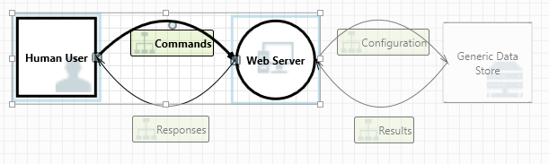

# Threat Modeling Tool feature overview

We are glad you chose to use the Threat Modeling Tool for your threat modeling needs! If you haven’t done so, visit **[Getting Started with the Threat Modeling Tool](./azure-security-threat-modeling-tool-getting-started.md)** to learn the basics.

> Our tool is updated often, so check this guide often to see our latest features and improvements.

Clicking on the "Create a New Model" button opens a blank start page, similar to the image below:

Using the threat model created by our team in the **[Getting Started](./azure-security-threat-modeling-tool-getting-started.md)** example, let’s check out all the features available in the tool today.

## Navigation

Before diving into the built-in features, let’s go over the main components found in the tool

### Menu items

The experience should be similar to other Microsoft products. Let’s begin by going through the top-level menu items:

| Label                               | Details      |
| --------------------------------------- | ------------ |
| **File** | <ul><li>Open, Save and Close Files</li><li>Sign In/Out of OneDrive accounts</li><li>Share Links (View + Edit)</li><li>View File Information</li><li>Apply New Template to Existing Models</li></ul> |
| **Edit** | Undo/redo actions, as well a copy, paste and delete |
| **View** | <ul><li>Switch between **Analysis** and **Design** views</li><li>Open closed windows (e.g.stencils, element properties and messages)</li><li>Reset layout to default settings</li></ul> |
| **Diagram** | Add/Delete diagrams and navigate through “tabs” of diagrams |
| **Reports** | Create HTML reports to share with others |
| **Help** | Guides to help you use the tool |

The icons are shortcuts for the top-level menus:

| Icon                               | Details      |
| --------------------------------------- | ------------ |
| **Open** | Opens a new file |
| **Save** | Saves current file |
| **Design** | Goes into design view, where you can create models |
| **Analyze** | Shows generated threats and their properties |
| **Add Diagram** | Adds new diagram (similar to new tabs in Excel) |
| **Delete Diagram** | Deletes current diagram |
| **Copy/Cut/Paste** | Copies/cuts/pastes elements |
| **Undo/Redo** | Undoes/redoes actions |
| **Zoom In/Zoom Out** | Zooms in and out of the diagram for a better view |
| **Feedback** | Opens the MSDN Forum |

### Canvas

The space where you drag and drop elements into. Drag and drop is the quickest and most efficient way to build models. You may also right click and select from the menu, which adds generic versions of the elements you’re using, as shown below.

#### Dropping the stencil on the canvas

#### Clicking on the stencil

### Stencils

Where you can find all stencils available to use based on the template selected. If you can’t find the right elements, try using another template, or modify one to fit your needs. Generally, you should be able to find a combination of categories like the ones below:

| Stencil Name                               | Details      |
| --------------------------------------- | ------------ |
| **Process** | Applications, Browser Plugins, Threads, Virtual Machines |
| **External Interactor** | Authentication Providers, Browsers, Users, Web Applications |
| **Data Store** | Cache, Storage, Configuration Files, Databases, Registry |
| **Data Flow** | Binary, ALPC, HTTP, HTTPS/TLS/SSL, IOCTL, IPSec, Named Pipe, RPC/DCOM, SMB, UDP |
| **Trust Line/Border Boundary** | Corporate Networks, Internet, Machine, Sandbox, User/Kernel Mode |

### Notes/Messages

| Component                               | Details      |
| --------------------------------------- | ------------ |
| **Messages** | Internal tool logic that alerts users whenever there is an error, such as no data flows between elements |
| **Notes** | Manual notes added to the file by engineering teams throughout the design and review process |

### Element properties

These vary by the elements selected. Apart from Trust Boundaries, all other elements contain 3 general selections:

| Element Property                               | Details      |
| --------------------------------------- | ------------ |
| **Name** | Useful for naming your processes, stores, interactors and flows to be easily recognized |
| **Out of Scope** | If selected, the element is taken out of the threat generation matrix (not recommended) |
| **Reason for Out of Scope** | Justification field to let users know why out of scope was selected |

Properties are changed under each element category. Click on each element to inspect the available options, or open the template to learn more. Let’s get into the features.

## Welcome screen

The welcome screen is the first thing you see when you open the app.

### Open A model

Hovering over “Open a Model” button shows you 2 hidden options: “Open From this Computer” and “Open from OneDrive.” The first opens the File Open screen, while the second takes you through the sign in process for OneDrive, allowing you to pick folders and files after a successful authentication.

### Feedback, suggestions and issues

Selecting this option will take you to the MSDN Forums for SDL Tools. It’s a great way to check out what other people are saying about the tool, including workarounds and new ideas.

## Design view

Whenever you open or create a new model, you’ll be taken to the design view.

### Adding elements

There are 2 ways to add elements on the grid:

- **Drag and Drop** – drag the desired element to the grid, then use the element properties to provide additional information.
- **Right Click** – right click anywhere on the grid and select from the dropdown menu. A generic representation of that element will appear on the screen.

### Connecting elements

There are 2 ways to connect elements in the tool:

- **Drag and Drop** – drag the desired dataflow to the grid, and connect both ends to the appropriate elements.
- **Click + Shift** – click on the first element (sending data), press and hold the Shift key, then select the second element (receiving data). Right click, and select “Connect.” If you’re using a bi-directional dataflow, the order is not as important.

### Properties

Shows all the properties that can be modified on the stencils placed in the diagram. To see the properties, just click on the stencil and the information will be populated accordingly. The example below shows before and after a "Database" stencil is dragged onto the diagram:

#### Before

#### After

### Messages

If you create a threat model and forget to connect data flows to elements, the message window notifies you to act. You can choose to ignore it or follow the instructions to fix the issue. 

### Notes

Switching tabs from Messages to Notes allows you to add notes to your diagram to capture all your thoughts

## Analysis view

Once you're done building your diagram, switch over to analysis view by going to the top menu selections and choosing the magnifying glass next to the paint palette.

### Generated threat selection

When you click on a threat, you can leverage three unique functions:

| Feature                               | Info      |
| --------------------------------------- | ------------ |
| **Read Indicator** | 
Threat is now marked as read, which can easily help you keep track of the items you already went through

 |
| **Interaction Focus** | 
Interaction in the diagram belonging to that threat is highlighted

 |
| **Threat Properties** | 
Additional information about the threat is populated in the threat properties window

 |

### Priority change

Changing the priority level of each generated threat also changes their colors to make it easy to identify high, medium and low priority threats.

### Threat properties editable fields

As seen in the image above, users can change the information generated by the tool an also add information to certain fields, such as justification. These fields are generated by the template, so if you need more information for each threat, you're encouraged to make modifications.

## Reports

Once you're done changing priorities and updating the status of each generated threat, you can save the file and/or print out a report by going to "Report" and then "Create Full Report." You'll be asked to name the report, and once you do, you should see something similar to the image below:

## Next steps

To contribute a template for the community, please go to our **[GitHub](https://github.com/Microsoft/threat-modeling-templates)** page. **[Download](https://aka.ms/tmtpreview)** the tool to get started today.
