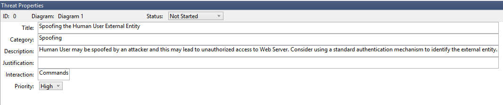
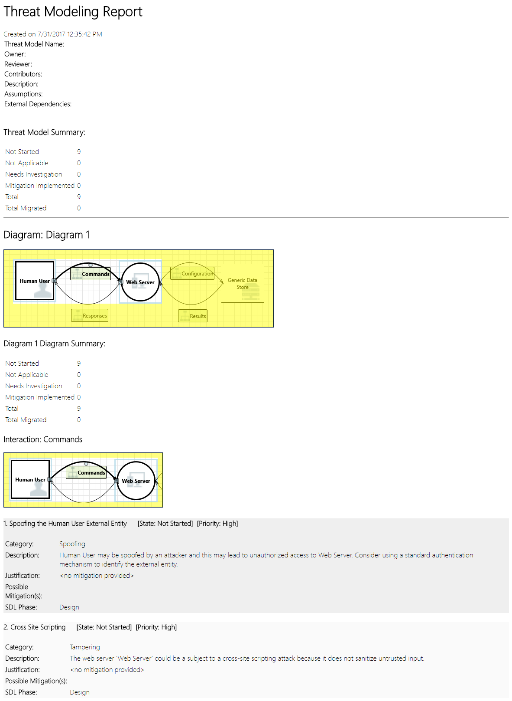

# Getting started with the Threat Modeling Tool

The Microsoft Threat Modeling Tool 2018 was released as GA in September 2018 as a free **[click-to-download](https://aka.ms/threatmodelingtool)**. The change in delivery mechanism allows us to push the latest improvements and bug fixes to customers each time they open the tool, making it easier to maintain and use.
This article takes you through the process of getting started with the Microsoft SDL threat modeling approach and shows you how to use the tool to develop great threat models as a backbone of your security process.

This article builds on existing knowledge of the SDL threat modeling approach. For a quick review, refer to **[Threat Modeling Web Applications](https://msdn.microsoft.com/library/ms978516.aspx)** and an archived version of **[Uncover Security Flaws Using the STRIDE Approach](https://docs.google.com/viewer?a=v&pid=sites&srcid=ZGVmYXVsdGRvbWFpbnxzZWN1cmVwcm9ncmFtbWluZ3xneDo0MTY1MmM0ZDI0ZjQ4ZDMy)** MSDN article published in 2006.

To quickly summarize, the approach involves creating a diagram, identifying threats, mitigating them and validating each mitigation. Here’s a diagram that highlights this process:

## Starting the threat modeling process

When you launch the Threat Modeling Tool, you'll notice a few things, as seen in the picture:

### Threat model section

| Component                                   | Details                                                                                                                                                                                                                                                                                                                                                                                                                                                                                       |
| ------------------------------------------- | --------------------------------------------------------------------------------------------------------------------------------------------------------------------------------------------------------------------------------------------------------------------------------------------------------------------------------------------------------------------------------------------------------------------------------------------------------------------------------------------- |
| **Feedback, Suggestions and Issues Button** | Takes you the **[MSDN Forum](https://social.msdn.microsoft.com/Forums/en-US/home?forum=sdlprocess)** for all things SDL. It gives you an opportunity to read through what other users are doing, along with workarounds and recommendations. If you still can’t find what you’re looking for, email tmtextsupport@microsoft.com for our support team to help you                                                                                                                            |
| **Create a Model**                          | Opens a blank canvas for you to draw your diagram. Make sure to select which template you’d like to use for your model                                                                                                                                                                                                                                                                                                                                                                       |
| **Template for New Models**                 | You must select which template to use before creating a model. Our main template is the Azure Threat Model Template, which contains Azure-specific stencils, threats and mitigations. For generic models, select the SDL TM Knowledge Base from the drop-down menu. Want to create your own template or submit a new one for all users? Check out our **[Template Repository](https://github.com/Microsoft/threat-modeling-templates)** GitHub Page to learn more                              |
| **Open a Model**                            | 
Opens previously saved threat models. The Recently Opened Models feature is great if you need to open your most recent files. When you hover over the selection, you’ll find 2 ways to open models:

<ul><li>Open From this Computer – classic way of opening a file using local storage</li><li>Open from OneDrive – teams can use folders in OneDrive to save and share all their threat models in a single location to help increase productivity and collaboration</li></ul>
 |
| **Getting Started Guide**                   | Opens the **[Microsoft Threat Modeling Tool](./azure-security-threat-modeling-tool.md)** main page                                                                                                                                                                                                                                                                                                                                                                                            |

### Template section

| Component               | Details                                                                                                                                                          |
| ----------------------- | ---------------------------------------------------------------------------------------------------------------------------------------------------------------- |
| **Create New Template** | Opens a blank template for you to build on. Unless you have extensive knowledge in building templates from scratch, we recommend you to build from existing ones |
| **Open Template**       | Opens existing templates for you to make changes to                                                                                                              |

The Threat Modeling Tool team is constantly working to improve tool functionality and experience. A few minor changes might take place over the course of the year, but all major changes require rewrites in the guide. Refer to it often to ensure you get the latest announcements.

## Building a model

In this section, we follow:

- Cristina (a developer)
- Ricardo (a program manager) and
- Ashish (a tester)

They are going through the process of developing their first threat model.

> Ricardo: Hi Cristina, I worked on the threat model diagram and wanted to make sure we got the details right. Can you help me look it over?
> Cristina: Absolutely. Let’s take a look.
> Ricardo opens the tool and shares his screen with Cristina.

> Cristina: Ok, looks straightforward, but can you walk me through it?
> Ricardo: Sure! Here is the breakdown:
> - Our human user is drawn as an outside entity—a square
> - They’re sending commands to our Web server—the circle
> - The Web server is consulting a database (two parallel lines)

What Ricardo just showed Cristina is a DFD, short for **[Data Flow Diagram](https://en.wikipedia.org/wiki/Data_flow_diagram)**. The Threat Modeling Tool allows users to specify trust boundaries, indicated by the red dotted lines, to show where different entities are in control. For example, IT administrators require an Active Directory system for authentication purposes, so the Active Directory is outside of their control.

> Cristina: Looks right to me. What about the threats?
> Ricardo: Let me show you.

## Analyzing threats

Once he clicks on the analysis view from the icon menu selection (file with magnifying glass), he is taken to a list of generated threats the Threat Modeling Tool found based on the default template, which uses the SDL approach called **[STRIDE (Spoofing, Tampering, Info Disclosure, Repudiation, Denial of Service and Elevation of Privilege)](https://en.wikipedia.org/wiki/STRIDE_(security))**. The idea is that software comes under a predictable set of threats, which can be found using these 6 categories.

This approach is like securing your house by ensuring each door and window has a locking mechanism in place before adding an alarm system or chasing after the thief.

Ricardo begins by selecting the first item on the list. Here’s what happens:

First, the interaction between the two stencils is enhanced

Second, additional information about the threat appears in the Threat Properties window

The generated threat helps him understand potential design flaws. The STRIDE categorization gives him an idea on potential attack vectors, while the additional description tells him exactly what’s wrong, along with potential ways to mitigate it. He can use editable fields to write notes in the justification details or change priority ratings depending on his organization’s bug bar.

Azure templates have additional details to help users understand not only what’s wrong, but also how to fix it by adding descriptions, examples and hyperlinks to Azure-specific documentation.

The description made him realize the importance of adding an authentication mechanism to prevent users from being spoofed, revealing the first threat to be worked on. A few minutes into the discussion with Cristina, they understood the importance of implementing access control and roles. Ricardo filled in some quick notes to make sure these were implemented.

As Ricardo went into the threats under Information Disclosure, he realized the access control plan required some read-only accounts for audit and report generation. He wondered whether this should be a new threat, but the mitigations were the same, so he noted the threat accordingly.
He also thought about information disclosure a bit more and realized that the backup tapes were going to need encryption, a job for the operations team.

Threats not applicable to the design due to existing mitigations or security guarantees can be changed to “Not Applicable” from the Status drop-down. There are three other choices: Not Started – default selection, Needs Investigation – used to follow up on items and Mitigated – once it’s fully worked on.

## Reports & sharing

Once Ricardo goes through the list with Cristina and adds important notes, mitigations/justifications, priority and status changes, he selects Reports -> Create Full Report -> Save Report, which prints out a nice report for him to go through with colleagues to ensure the proper security work is implemented.

If Ricardo wants to share the file instead, he can easily do so by saving in his organization’s OneDrive account. Once he does that, he can copy the document link and share it with his colleagues. 

## Threat modeling meetings

When Ricardo sent his threat model to his colleague using OneDrive, Ashish, the tester, was underwhelmed. Seemed like Ricardo and Cristina missed quite a few important corner cases, which could be easily compromised. His skepticism is a complement to threat models.

In this scenario, after Ashish took over the threat model, he called for two threat modeling meetings: one meeting to synchronize on the process and walk through the diagrams and then a second meeting for threat review and sign-off.

In the first meeting, Ashish spent 10 minutes walking everyone through the SDL threat modeling process. He then pulled up the threat model diagram and started explaining it in detail. Within five minutes, an important missing component had been identified.

A few minutes later, Ashish and Ricardo got into an extended discussion of how the Web server was built. It was not the ideal way for a meeting to proceed, but everyone eventually agreed that discovering the discrepancy early was going to save them time in the future.

In the second meeting, the team walked through the threats, discussed some ways to address them, and signed off on the threat model. They checked the document into source control and continued with development.

## Thinking about assets

Some readers who have threat modeled may notice that we haven't talked about assets at all. We've discovered that many software engineers understand their software better than they understand the concept of assets and what assets an attacker may be interested in.

If you're going to threat model a house, you might start by thinking about your family, irreplaceable photos or valuable artwork. Perhaps you might start by thinking about who might break in and the current security system. Or you might start by considering the physical features, like the pool or the front porch. These are analogous to thinking about assets, attackers, or software design. Any of these three approaches work.

The approach to threat modeling we've presented here is substantially simpler than what Microsoft has done in the past. We found that the software design approach works well for many teams. We hope that include yours.

## Next Steps

Send your questions, comments and concerns to tmtextsupport@microsoft.com. **[Download](https://aka.ms/threatmodelingtool)** the Threat Modeling Tool to get started.
