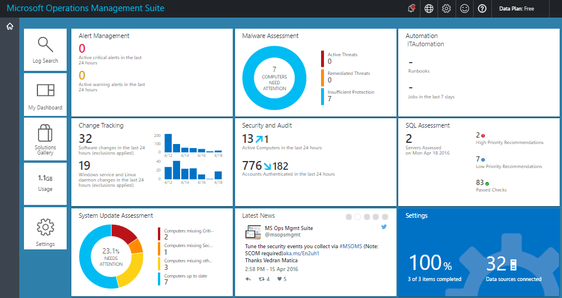
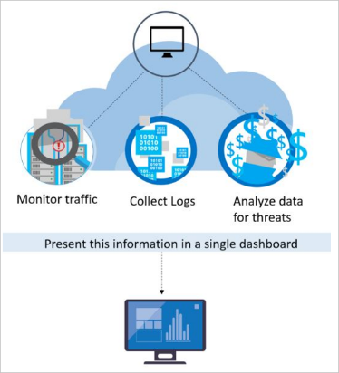
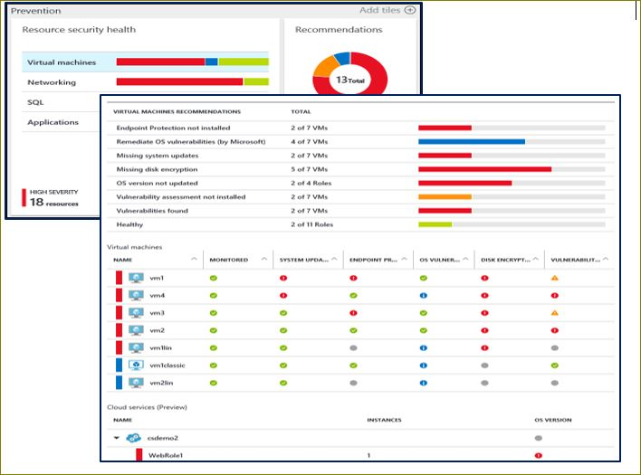

# Azure Advanced Threat Detection
## Introduction

### Overview

Microsoft has developed a series of White Papers, Security Overviews, Best Practices, and Checklists to assist Azure customers about the various security-related capabilities available in and surrounding the Azure Platform. The topics range in terms of breadth and depth and are updated periodically. This document is part of that series as summarized in the following abstract section.

### Azure Platform

Azure is an open and flexible cloud service platform that supports the broadest selection of operating systems, programming languages, frameworks, tools, databases, and devices.
It supports the following programming languages:
-	Run Linux containers with Docker integration.
-	Build apps with JavaScript, Python, .NET, PHP, Java, and Node.js
-	Build back-ends for iOS, Android, and Windows devices.

Azure public cloud services support the same technologies millions of developers and IT professionals already rely on and trust.

When you are migrating to a public cloud with an organization, that organization is responsible to protect your data and provide security and governance around the system.

Azure’s infrastructure is designed from the facility to applications for hosting millions of customers simultaneously, and it provides a trustworthy foundation upon which businesses can meet their security needs. Azure provides a wide array of options to configure and customize security to meet the requirements of your app deployments. This document helps you meet these requirements.

### Abstract

Microsoft Azure offers built in advanced threat detection functionality through services like Azure Active Directory, Azure Operations Management Suite (OMS), and Azure Security Center. This collection of security services and capabilities provides a simple and fast way to understand what is happening within your Azure deployments.

This white paper will guide you the “Microsoft Azure approaches” towards threat vulnerability diagnostic and analysing the risk associated with the malicious activities targeted against servers and other Azure resources. This helps you to identify the methods of identification and vulnerability management with optimized solutions by the Azure platform and customer-facing security services and technologies.

This white paper focuses on the technology of Azure platform and customer-facing controls, and does not attempt to address SLAs, pricing models, and DevOps practice considerations.

## Azure Active Directory Identity Protection

[Azure Active Directory Identity Protection](https://docs.microsoft.com/azure/active-directory/active-directory-identityprotection) is a feature of the [Azure AD Premium P2](https://docs.microsoft.com/azure/active-directory/active-directory-editions) edition that provides you an overview of the risk events and potential vulnerabilities affecting your organization’s identities. Microsoft has been securing cloud-based identities for over a decade, and with Azure AD Identity Protection, Microsoft is making these same protection systems available to enterprise customers. Identity Protection uses existing Azure AD’s anomaly detection capabilities available through [Azure AD’s Anomalous Activity Reports](https://docs.microsoft.com/azure/active-directory/active-directory-view-access-usage-reports#anomalous-activity-reports), and introduces new risk event types that can detect real time anomalies.

Identity Protection uses adaptive machine learning algorithms and heuristics to detect anomalies and risk events that may indicate that an identity has been compromised. Using this data, Identity Protection generates reports and alerts that enable you to investigate these risk events and take appropriate remediation or mitigation action.

But Azure Active Directory Identity Protection is more than a monitoring and reporting tool. Based on risk events, Identity Protection calculates a user risk level for each user, enabling you to configure risk-based policies to automatically protect the identities of your organization.

These risk-based policies, in addition to other [conditional access controls](https://docs.microsoft.com/azure/active-directory/active-directory-conditional-access) provided by Azure Active Directory and [EMS](https://docs.microsoft.com/azure/active-directory/active-directory-conditional-access), can automatically block or offer adaptive remediation actions that include password resets and multi-factor authentication enforcement.

### Identity Protection's capabilities

Azure Active Directory Identity Protection is more than a monitoring and reporting tool. To protect your organization's identities, you can configure risk-based policies that automatically respond to detected issues when a specified risk level has been reached. These policies, in addition to other conditional access controls provided by Azure Active Directory and EMS, can either automatically block or initiate adaptive remediation actions including password resets and multi-factor authentication enforcement.

Examples of some of the ways that Azure Identity Protection can help secure your accounts and identities include:

[Detecting risk events and risky accounts:](https://docs.microsoft.com/azure/active-directory/active-directory-identityprotection#detection)
-	Detecting six risk event types using machine learning and heuristic rules
-	Calculating user risk levels
-	Providing custom recommendations to improve overall security posture by highlighting vulnerabilities

[Investigating risk events:](https://docs.microsoft.com/azure/active-directory/active-directory-identityprotection#investigation)
-	Sending notifications for risk events
-	Investigating risk events using relevant and contextual information
-	Providing basic workflows to track investigations
-	Providing easy access to remediation actions such as password reset

[Risk-based conditional access policies:](https://docs.microsoft.com/azure/active-directory/active-directory-identityprotection#risky-sign-ins)
-	Policy to mitigate risky sign-ins by blocking sign-ins or requiring multi-factor authentication challenges.
-	Policy to block or secure risky user accounts
-	Policy to require users to register for multi-factor authentication

### Azure AD Privileged Identity Management (PIM)

With [Azure Active Directory (AD) Privileged Identity Management](https://docs.microsoft.com/azure/active-directory/active-directory-privileged-identity-management-configure),

you can manage, control, and monitor access within your organization. This includes access to resources in Azure AD and other Microsoft online services like Office 365 or Microsoft Intune.

Azure AD Privileged Identity Management helps you:

-	Get an alert and report on Azure AD administrators and "just in time" administrative access to Microsoft Online Services like Office 365 and Intune

-	Get reports about administrator access history and changes in administrator assignments

-	Get alerts about access to a privileged role

## Microsoft Operations Management Suite (OMS)

[Microsoft Operations Management Suite](https://docs.microsoft.com/azure/operations-management-suite/operations-management-suite-overview) is Microsoft's cloud-based IT management solution that helps you manage and protect your on-premises and cloud infrastructure. Since OMS is implemented as a cloud-based service, you can have it up and running quickly with minimal investment in infrastructure services. New security features are delivered automatically, saving your ongoing maintenance and upgrade costs.

In addition to providing valuable services on its own, OMS can integrate with System Center components such as [System Center Operations Manager](https://blogs.technet.microsoft.com/cbernier/2013/10/23/monitoring-windows-azure-with-system-center-operations-manager-2012-get-me-started/) to extend your existing security management investments into the cloud. System Center and OMS can work together to provide a full hybrid management experience.

### Holistic Security and Compliance Posture

The [OMS Security and Audit dashboard](https://docs.microsoft.com/azure/operations-management-suite/oms-security-getting-started) provides a comprehensive view into your organization’s IT security posture with built-in search queries for notable issues that require your attention. The Security and Audit dashboard is the home screen for everything related to security in OMS. It provides high-level insight into the security state of your computers. It also includes the ability to view all events from the past 24 hours, 7 days, or any other custom time frame.

OMS dashboards help you quickly and easily understand the overall security posture of any environment, all within the context of IT Operations, including: software update assessment, antimalware assessment, and configuration baselines. Furthermore, security log data is readily accessible to streamline the security and compliance audit processes.

The OMS Security and Audit dashboard is organized in four major categories:

-	**Security Domains:** in this area, you will be able to further explore security records over time, access malware assessment, update assessment, network security, identity and access information, computers with security events and quickly have access to Azure Security Center dashboard.

-	**Notable Issues:** this option allows you to quickly identify the number of active issues and the severity of these issues.

-	**Detections (Preview):** enables you to identify attack patterns by visualizing security alerts as they take place against your resources.

-	**Threat Intelligence:** enables you to identify attack patterns by visualizing the total number of servers with outbound malicious IP traffic, the malicious threat type, and a map that shows where these IPs are coming from.

-	**Common security queries:** this option provides you a list of the most common security queries that you can use to monitor your environment. When you click in one of those queries, it opens the Search blade with the results for that query.

### Insight and Analytics
At the center of [Log Analytics](https://docs.microsoft.com/azure/log-analytics/log-analytics-overview) is the OMS repository, which is hosted in the Azure cloud.

Data is collected into the repository from connected sources by configuring data sources and adding solutions to your subscription.

Data sources and solutions will each create different record types that have their own set of properties but may still be analyzed together in queries to the repository. This allows you to use the same tools and methods to work with different kinds of data collected by different sources.

Most of your interaction with Log Analytics is through the OMS portal, which runs in any browser and provides you with access to configuration settings and multiple tools to analyze and act on collected data. From the portal, you can use [log searches](https://docs.microsoft.com/azure/log-analytics/log-analytics-log-searches) where you construct queries to analyze collected data, [dashboards](https://docs.microsoft.com/azure/log-analytics/log-analytics-dashboards), which you can customize with graphical views of your most valuable searches, and [solutions](https://docs.microsoft.com/azure/log-analytics/log-analytics-add-solutions), which provide additional functionality and analysis tools.

Solutions add functionality to Log Analytics. They primarily run in the cloud and provide analysis of data collected in the OMS repository. They may also define new record types to be collected that can be analyzed with Log Searches or by additional user interface provided by the solution in the OMS dashboard.
The Security and Audit is an example of these types of solutions.

### Automation & Control: Alert on security configuration drifts

Azure Automation automates administrative processes with runbooks that are based on PowerShell and run in the Azure cloud. Runbooks can also be executed on a server in your local data center to manage local resources. Azure Automation provides configuration management with PowerShell DSC (Desired State Configuration).

You can create and manage DSC resources hosted in Azure and apply them to cloud and on-premises systems to define and automatically enforce their configuration or get reports on drift to help insure that security configurations remain within policy.

## Azure Security Center

Azure Security Center helps protect your Azure resources. It provides integrated security monitoring and policy management across your Azure subscriptions. Within the service, you are able to define polices not only against your Azure subscriptions, but also against [Resource Groups](https://docs.microsoft.com/azure/azure-resource-manager/resource-group-portal), so you can be more granular.

Microsoft security researchers are constantly on the lookout for threats. They have access to an expansive set of telemetry gained from Microsoft’s global presence in the cloud and on-premises. This wide-reaching and diverse collection of datasets enables Microsoft to discover new attack patterns and trends across its on-premises consumer and enterprise products, as well as its online services.

Thus, Security Center can rapidly update its detection algorithms as attackers release new and increasingly sophisticated exploits. This approach helps you keep pace with a fast-moving threat environment.

Security Center threat detection works by automatically collecting security information from your Azure resources, the network, and connected partner solutions.  It analyzes this information, correlating information from multiple sources, to identify threats.
Security alerts are prioritized in Security Center along with recommendations on how to remediate the threat.

Security Center employs advanced security analytics, which go far beyond signature-based approaches. Breakthroughs in big data and [machine learning](https://azure.microsoft.com/blog/machine-learning-in-azure-security-center/) technologies are used to evaluate events across the entire cloud fabric – detecting threats that would be impossible to identify using manual approaches and predicting the evolution of attacks. These security analytics includes the following.

### Threat Intelligence

Microsoft has an immense amount of global threat intelligence.
Telemetry flows in from multiple sources, such as Azure, Office 365, Microsoft CRM online, Microsoft Dynamics AX, outlook.com, MSN.com, the Microsoft Digital Crimes Unit (DCU), and Microsoft Security Response Center (MSRC).

Researchers also receive threat intelligence information that is shared among major cloud service providers and subscribes to threat intelligence feeds from third parties. Azure Security Center can use this information to alert you to threats from known bad actors. Some examples include:

-	**Harnessing the Power of Machine Learning -** Azure Security Center has access to a vast amount of data about cloud network activity, which can be used to detect threats targeting your Azure deployments. For example:

-	**Brute Force Detections -** Machine learning is used to create a historical pattern of remote access attempts, which allows it to detect brute force attacks against SSH, RDP, and SQL ports.

-	**Outbound DDoS and Botnet Detection** - A common objective of attacks targeting cloud resources is to use the compute power of these resources to execute other attacks.

-	**New Behavioral Analytics Servers and VMs -** Once a server or virtual machine is compromised, attackers employ a wide variety of techniques to execute malicious code on that system while avoiding detection, ensuring persistence, and obviating security controls.

-	**Azure SQL Database Threat Detection -** Threat Detection for Azure SQL Database, which identifies anomalous database activities indicating unusual and potentially harmful attempts to access or exploit databases.

### Behavioral analytics

Behavioral analytics is a technique that analyzes and compares data to a collection of known patterns. However, these patterns are not simple signatures. They are determined through complex machine learning algorithms that are applied to massive datasets.

They are also determined through careful analysis of malicious behaviors by expert analysts. Azure Security Center can use behavioral analytics to identify compromised resources based on analysis of virtual machine logs, virtual network device logs, fabric logs, crash dumps, and other sources.

In addition, there is correlation with other signals to check for supporting evidence of a widespread campaign. This correlation helps to identify events that are consistent with established indicators of compromise.

Some examples include:
-	**Suspicious process execution:** Attackers employ several techniques to execute malicious software without detection. For example, an attacker might give malware the same names as legitimate system files but place these files in an alternate location, use a name that is very like a benign file, or mask the file’s true extension. Security Center models processes behaviors and monitors process executions to detect outliers such as these.

-	**Hidden malware and exploitation attempts:** Sophisticated malware can evade traditional antimalware products by either never writing to disk or encrypting software components stored on disk. However, such malware can be detected using memory analysis, as the malware must leave traces in memory to function. When software crashes, a crash dump captures a portion of memory at the time of the crash. By analyzing the memory in the crash dump, Azure Security Center can detect techniques used to exploit vulnerabilities in software, access confidential data, and surreptitiously persist within a compromised machine without impacting the performance of your machine.

-	**Lateral movement and internal reconnaissance:** To persist in a compromised network and locate/harvest valuable data, attackers often attempt to move laterally from the compromised machine to others within the same network. Security Center monitors process and login activities to discover attempts to expand an attacker’s foothold within the network, such as remote command execution, network probing, and account enumeration.

-	**Malicious PowerShell Scripts:** PowerShell can be used by attackers to execute malicious code on target virtual machines for a various purposes. Security Center inspects PowerShell activity for evidence of suspicious activity.

-	**Outgoing attacks:** Attackers often target cloud resources with the goal of using those resources to mount additional attacks. Compromised virtual machines, for example, might be used to launch brute force attacks against other virtual machines, send SPAM, or scan open ports and other devices on the Internet. By applying machine learning to network traffic, Security Center can detect when outbound network communications exceed the norm. When SPAM, Security Center also correlates unusual email traffic with intelligence from Office 365 to determine whether the mail is likely nefarious or the result of a legitimate email campaign.

### Anomaly Detection

Azure Security Center also uses anomaly detection to identify threats. In contrast to behavioral analytics (which depends on known patterns derived from large data sets), anomaly detection is more “personalized” and focuses on baselines that are specific to your deployments. Machine learning is applied to determine normal activity for your deployments and then rules are generated to define outlier conditions that could represent a security event. Here’s an example:

-	**Inbound RDP/SSH brute force attacks:** Your deployments may have busy virtual machines with many logins each day and other virtual machines that have few or any logins. Azure Security Center can determine baseline login activity for these virtual machines and use machine learning to define around the normal login activities. If there is any discrepancy with the baseline defined for login related characteristics, then an alert may be generated. Again, machine learning determines what is significant.

### Continuous Threat Intelligence Monitoring

Azure Security Center operates with security research and data science teams throughout the world that continuously monitor for changes in the threat landscape. This includes the following initiatives:

-	**Threat intelligence monitoring:** Threat intelligence includes mechanisms, indicators, implications, and actionable advice about existing or emerging threats. This information is shared in the security community and Microsoft continuously monitors threat intelligence feeds from internal and external sources.

-	**Signal sharing:** Insights from security teams across Microsoft’s broad portfolio of cloud and on-premises services, servers, and client endpoint devices are shared and analyzed.

-	**Microsoft security specialists:** Ongoing engagement with teams across Microsoft that work in specialized security fields, like forensics and web attack detection.

-	**Detection tuning:** Algorithms are run against real customer data sets and security researchers work with customers to validate the results. True and false positives are used to refine machine learning algorithms.

These combined efforts culminate in new and improved detections, which you can benefit from instantly – there’s no action for you to take.

## Advanced Threat Detection Features - Other Azure Services

### Virtual Machine: Microsoft Antimalware

[Microsoft Antimalware](https://docs.microsoft.com/azure/security/azure-security-antimalware) for Azure is a single-agent solution for applications and tenant environments, designed to run in the background without human intervention. You can deploy protection based on the needs of your application workloads, with either basic secure-by-default or advanced custom configuration, including antimalware monitoring. Azure antimalware is a security option for Azure Virtual Machines and is automatically installed on all Azure PaaS virtual machines.

**Features of Azure to deploy and enable Microsoft Antimalware for your applications**

#### Microsoft Antimalware Core Features

-	**Real-time protection -** monitors activity in Cloud Services and on Virtual Machines to detect and block malware execution.

-	**Scheduled scanning -** periodically performs targeted scanning to detect malware, including actively running programs.

-	**Malware remediation -** automatically takes action on detected malware, such as deleting or quarantining malicious files and cleaning up malicious registry entries.

-	**Signature updates -** automatically installs the latest protection signatures (virus definitions) to ensure protection is up-to-date on a pre-determined frequency.

-	**Antimalware Engine updates -** automatically updates the Microsoft Antimalware engine.

-	**Antimalware Platform updates –** automatically updates the Microsoft Antimalware platform.

-	**Active protection -** reports telemetry metadata about detected threats and suspicious resources to Microsoft Azure to ensure rapid response to the evolving threat landscape, and enabling real-time synchronous signature delivery through the Microsoft Active Protection System (MAPS).

-	**Samples reporting -** provides and reports samples to the Microsoft Antimalware service to help refine the service and enable troubleshooting.

-	**Exclusions –** allows application and service administrators to configure certain files, processes, and drives to exclude them from protection and scanning for performance and/or other reasons.

-	**Antimalware event collection -** records the antimalware service health, suspicious activities, and remediation actions taken in the operating system event log and collects them into the customer’s Azure Storage account.

### Azure SQL Database Threat Detection

[Azure SQL Database Threat Detection](https://azure.microsoft.com/blog/azure-sql-database-threat-detection-your-built-in-security-expert/) is a new security intelligence feature built into the Azure SQL Database service. Working around the clock to learn, profile and detect anomalous database activities, Azure SQL Database Threat Detection identifies potential threats to the database.

Security officers or other designated administrators can get an immediate notification about suspicious database activities as they occur. Each notification provides details of the suspicious activity and recommends how to further investigate and mitigate the threat.

Currently, Azure SQL Database Threat Detection detects potential vulnerabilities and SQL injection attacks, and anomalous database access patterns.

Upon receiving threat detection email notification, users are able to navigate and view the relevant audit records using the deep link in the mail that opens an audit viewer and/or preconfigured auditing Excel template that shows the relevant audit records around the time of the suspicious event according to the following:
-	Audit storage for the database/server with the anomalous database activities

-	Relevant audit storage table that was used at the time of the event to write audit log

-	Audit records of the following hour since the event occurs.

-	Audit records with similar event ID at the time of the event (optional for some detectors)

SQL Database Threat Detectors use one of the following detection methodologies:

-	**Deterministic Detection –** detects suspicious patterns (rules based) in the SQL client queries that match known attacks. This methodology has high detection and low false positive, however limited coverage because it falls within the category of “atomic detections”.

-	**Behavioural Detection –** defects anomalous activity, which is abnormal behavior for the database that was not seen during the last 30 days.  An example for SQL client anomalous activity can be a spike of failed logins/queries, high volume of data being extracted, unusual canonical queries, and unfamiliar IP addresses used to access the database

### Application Gateway Web Application Firewall

[Web Application Firewall](https://docs.microsoft.com/azure/app-service-web/app-service-app-service-environment-web-application-firewall) is a feature of [Azure Application Gateway](https://docs.microsoft.com/azure/application-gateway/application-gateway-webapplicationfirewall-overview) that provides protection to web applications that use application gateway for standard [Application Delivery Control](https://kemptechnologies.com/in/application-delivery-controllers) functions. Web application firewall does this by protecting them against most of the [OWASP top 10 common web vulnerabilities](https://www.owasp.org/index.php/Top_10_2010-Main)

-	SQL injection protection

-	Cross site scripting protection

-	Common Web Attacks Protection such as command injection, HTTP request smuggling, HTTP response splitting, and remote file inclusion attack

-	Protection against HTTP protocol violations

-	Protection against HTTP protocol anomalies such as missing host user-agent and accept headers

-	Prevention against bots, crawlers, and scanners

-	Detection of common application misconfigurations (that is, Apache, IIS, etc.)

Configuring WAF at Application Gateway provides the following benefit to you:

-	Protect your web application from web vulnerabilities and attacks without modification to backend code.

-	Protect multiple web applications at the same time behind an application gateway. Application gateway supports hosting up to 20 websites behind a single gateway that could all be protected against web attacks.

-	Monitor your web application against attacks using real-time report generated by application gateway WAF logs.

-	Certain compliance controls require all internet facing end points to be protected by a WAF solution. By using application gateway with WAF enabled, you can meet these compliance requirements.

### Anomaly Detection – an API built with Azure Machine Learning

Anomaly Detection is an API built with Azure Machine Learning that is useful for detecting different types of anomalous patterns in your time series data. The API assigns an anomaly score to each data point in the time series, which can be used for generating alerts, monitoring through dashboards or connecting with your ticketing systems.

The [Anomaly Detection API](https://docs.microsoft.com/azure/machine-learning/machine-learning-apps-anomaly-detection-api) can detect the following types of anomalies on time series data:

-	**Spikes and Dips:** For example, when monitoring the number of login failures to a service or number of checkouts in an e-commerce site, unusual spikes or dips could indicate security attacks or service disruptions.

-	**Positive and negative trends:** When monitoring memory usage in computing, for instance, shrinking free memory size is indicative of a potential memory leak; when monitoring service queue length, a persistent upward trend may indicate an underlying software issue.

-	**Level changes and changes in dynamic range of values:** For example, level changes in latencies of a service after a service upgrade or lower levels of exceptions after upgrade can be interesting to monitor.

The machine learning based API enables:

-	**Flexible and robust detection:** The anomaly detection models allow users to configure sensitivity settings and detect anomalies among seasonal and non-seasonal data sets. Users can adjust the anomaly detection model to make the detection API less or more sensitive according to their needs. This would mean detecting the less or more visible anomalies in data with and without seasonal patterns.

-	**Scalable and timely detection:** The traditional way of monitoring with present thresholds set by experts' domain knowledge are costly and not scalable to millions of dynamically changing data sets. The anomaly detection models in this API are learned and models are tuned automatically from both historical and real-time data.

-	**Proactive and actionable detection:** Slow trend and level change detection can be applied for early anomaly detection. The early abnormal signals detected can be used to direct humans to investigate and act on the problem areas.  In addition, root cause analysis models and alerting tools can be developed on top of this anomaly detection API service.

The anomaly detection API is an effective and efficient solution for a wide range of scenarios like service health & KPI monitoring, IoT, performance monitoring, and network traffic monitoring. Here are some popular scenarios where this API can be useful:
- IT departments need tools to track events, error code, usage log, and performance (CPU, Memory and so on) in a timely manner.

-	Online commerce sites want to track customer activities, page views, clicks, and so on.

-	Utility companies want to track consumption of water, gas, electricity, and other resources.

-	Facility/Building management services want to monitor temperature, moisture, traffic, and so on.

-	IoT/manufacturers want to use sensor data in time series to monitor work flow, quality, and so on.

-	Service providers, such as call centers need to monitor service demand trend, incident volume, wait queue length and so on.

-	Business analytics groups want to monitor business KPIs' (such as sales volume, customer sentiments, pricing) abnormal movement in real time.

### Cloud App Security

[Cloud App Security](https://docs.microsoft.com/cloud-app-security/what-is-cloud-app-security) is a critical component of the Microsoft Cloud Security stack. It's a comprehensive solution that can help your organization as you move to take full advantage of the promise of cloud applications, but keep you in control, through improved visibility into activity. It also helps increase the protection of critical data across cloud applications.

With tools that help uncover shadow IT, assess risk, enforce policies, investigate activities, and stop threats, your organization can more safely move to the cloud while maintaining control of critical data.

<table style="width:100%">
 <tr>
   <td>Discover</td>
   <td>Uncover shadow IT with Cloud App Security. Gain visibility by discovering apps, activities, users, data, and files in your cloud environment. Discover third-party apps that are connected to your cloud.</td>
 </tr>
 <tr>
   <td>Investigate</td>
   <td>Investigate your cloud apps by using cloud forensics tools to deep-dive into risky apps, specific users, and files in your network. Find patterns in the data collected from your cloud. Generate reports to monitor your cloud.</td>

 </tr>
 <tr>
   <td>Control</td>
   <td>Mitigate risk by setting policies and alerts to achieve maximum control over network cloud traffic. Use Cloud App Security to migrate your users to safe, sanctioned cloud app alternatives.</td>

 </tr>
 <tr>
   <td>Protect</td>
   <td>Use Cloud App Security to sanction or prohibit applications, enforce data loss prevention, control permissions and sharing, and generate custom reports and alerts.</td>

 </tr>
 <tr>
   <td>Control</td>
   <td>Mitigate risk by setting policies and alerts to achieve maximum control over network cloud traffic. Use Cloud App Security to migrate your users to safe, sanctioned cloud app alternatives.</td>

 </tr>
</table>

Cloud App Security integrates visibility with your cloud by

-	Using Cloud Discovery to map and identify your cloud environment and the cloud apps your organization is using.

-	Sanctioning and prohibiting apps in your cloud.

-	Using easy-to-deploy app connectors that take advantage of provider APIs, for visibility and governance of apps that you connect to.

-	Helping you have continuous control by setting, and then continually fine-tuning, policies.

On collecting data from these sources, Cloud App Security runs sophisticated analysis on the data. It immediately alerts you to anomalous activities, and gives you deep visibility into your cloud environment. You can configure a policy in Cloud App Security and use it to protect everything in your cloud environment.

## Third-party ATD capabilities through Azure Marketplace

### Web Application Firewall

Web Application Firewall inspects inbound web traffic and blocks SQL injections, Cross-Site Scripting, malware uploads & application DDoS and other attacks targeted at your web applications. It also inspects the responses from the back-end web servers for Data Loss Prevention (DLP). The integrated access control engine enables administrators to create granular access control policies for Authentication, Authorization & Accounting (AAA), which gives organizations strong authentication and user control.

**Highlights:**
-	Detects and blocks SQL injections, Cross-Site Scripting, malware uploads, application DDoS, or any other attacks against your application.

-	Authentication and access control.

-	Scans outbound traffic to detect sensitive data and can mask or block the information from being leaked out.

-	Accelerates the delivery of web application contents, using capabilities such as caching, compression, and other traffic optimizations.

Following are example of Web Application firewalls available in Azure Market Place:

[Barracuda Web Application Firewall, Brocade Virtual Web Application Firewall (Brocade vWAF), Imperva SecureSphere & The ThreatSTOP IP Firewall.](https://azure.microsoft.com/marketplace/partners/brocade_communications/brocade-virtual-web-application-firewall-templatevtmcluster/)

## Next Steps

- [Azure Security Center detection capabilities](https://docs.microsoft.com/azure/security-center/security-center-detection-capabilities)

Azure Security Center’s advanced detection capabilities helps to identify active threats targeting your Microsoft Azure resources and provides you with the insights needed to respond quickly.

- [Azure SQL Database Threat Detection](https://azure.microsoft.com/blog/azure-sql-database-threat-detection-your-built-in-security-expert/)

Azure SQL Database Threat Detection helped address their concerns about potential threats to their database.
