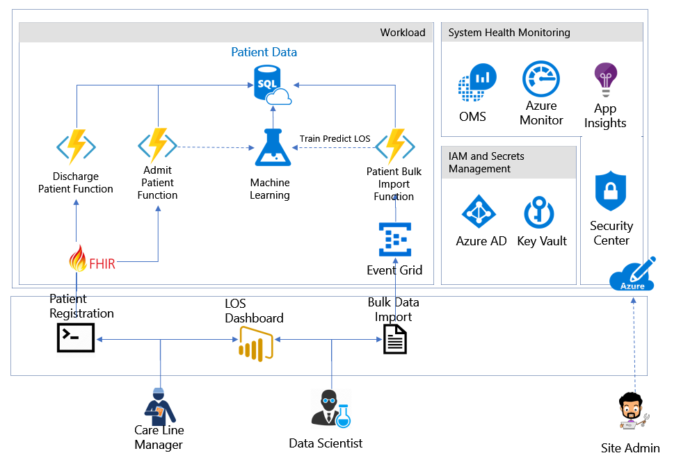

---

title: Azure Health Analytics Blueprint
description: Guidance for deploying a HIPAA/HITRUST Health Analytics Blueprint 
services: security
documentationcenter: na
author: simorjay
manager: mbaldwin
editor: tomsh

ms.assetid: 26566e0a-0a54-49f4-a91d-48e20b7cef71
ms.service: security
ms.devlang: na
ms.topic: article
ms.tgt_pltfrm: na
ms.workload: na
ms.date: 01/31/2018
ms.author: simorjay

---

# Azure Health Analytics Blueprint

## Overview


**The Azure health analytics blueprint offers a turn-key deployment of
Azure PaaS to solutions to successfully collect, store, analyze,
visualize, and interact with health data while being able to meet
compliance requirements. The blueprint helps accelerate cloud adoption
and utilization for customers with data that is regulated.**

The Azure Health Analytics Blueprint provides tools and guidance to help
deploy a more secure, HIPAA, and HITRUST ready platform-as-a-service
(PaaS) environment for ingesting, storing, analyzing, visualizing and
working with personal and non-personal medical records in a more secure,
multi-tier cloud environment deployed as an end-to-end solution. It
showcases a common reference architecture and is designed to simplify
adoption of Microsoft Azure. This provided architecture illustrates an
end-to-end solution to meet the needs of organizations seeking a
cloud-based approach to reducing the burden and cost of deployment.


The solution is designed to consume a sample data set formatted using
Fast Healthcare Interoperability Resources (FHIR), a worldwide standard
for exchanging healthcare information electronically, and store it in a
secure manner. Customers can then use Azure Machine Learning to take
advantage of powerful business intelligence tools and analytics to
review predictions made on the sample data. As an example of the kind of
analysis Azure Machine Learning can facilitate, the blueprint includes
scripts and tools for predicting the length of a patient's stay in a
hospital facility.

This blueprint is intended to serve as a foundation for customers to
adjust to their specific requirements. It is designed to be more secure
and compliant when deployed; however, customers are responsible for
configuring roles correctly and implementing any modifications. Please
note the following:

-   This blueprint provides a baseline to help customers use Microsoft
    Azure in a HITRUST, and HIPAA

-   Although the blueprint is designed to be aligned with HIPAA and HITRUST (through the Common Security Framework
    -- CSF), it should not be considered compliant until certified by an
    external auditor per HIPAA and HITRUST certification requirements.

-   Customers are responsible for conducting appropriate security and
    compliance reviews of any solution built using this foundational
    architecture.

For a quick overview of how this solution works, watch this [video](https://aka.ms/healthblueprintvideo) 
explaining and demonstrating its deployment.

## Solution components


The foundational architecture is comprised of the following components:

-   **Architectural diagram.** The diagram shows the reference
    architecture used for the blueprint and use case scenario.

-   **Deployment templates**. In this deployment, [Azure Resource
    Manager
    templates](https://docs.microsoft.com/en-us/azure/azure-resource-manager/resource-group-overview#template-deployment)
    are used to automatically deploy the components of the architecture
    into Microsoft Azure by specifying configuration parameters during
    setup.

-   **Automated deployment scripts**. These scripts help deploy the
    end-to-end solution. The scripts consist of:


-   A module installation and [global
    administrator](https://docs.microsoft.com/en-us/azure/active-directory/active-directory-assign-admin-roles-azure-portal)
    setup script is used to install and verify that required PowerShell
    modules and global administrator roles are configured correctly. 
-   An installation PowerShell script is used to deploy the end-to-end
    solution, provided via a .zip file file that contain a pre-built
    demo functions. 


-   **Threat model.** A comprehensive threat model is provided in .tm7
    format for use with the [Microsoft Threat Modeling
    Tool](https://www.microsoft.com/en-us/download/details.aspx?id=49168),
    showing the components of the solution, the data flows between them,
    and the trust boundaries. The model can help customers understand
    the points of potential risk in the system infrastructure when
    developing machine learning components or other modifications.

-   **Customer responsibility matrix.** A Microsoft Excel workbook lists
    the relevant HITRUST requirements and explains how Microsoft and the
    customer are responsible for meeting each one.

-   **Healthcare compliance review.** The solution was reviewed by
    Coalfire systems, Inc. The Health Compliance (HIPAA, and HITRIUST)
    Review and guidance for implementation provides an auditor\'s review
    of the solution, and considerations for transforming the blueprint
    to a production-ready deployment.

# Architectural diagram




## Roles


The blueprint defines two roles for administrative users (operators),
and three roles for users in hospital management and patient care. A
sixth role is defined for an auditor to evaluate compliance with HIPAA
and other regulations. Azure Role-based Access Control (RBAC) enables
precisely focused access management for each user of the solution
through built-in and custom roles. See [Get started with Role-Based
Access Control in the Azure
portal](https://docs.microsoft.com/azure/active-directory/role-based-access-control-what-is)
and [Built-in roles for Azure role-based access
control](https://docs.microsoft.com/azure/active-directory/role-based-access-built-in-roles)
for detailed information about RBAC, roles, and permissions.

### Site Administrator


The site administrator is responsible for the customer's Azure
subscription. They control the overall ecosystem, but have no access to
patient records.

-   Default role assignments:
    [Owner](https://docs.microsoft.com/azure/active-directory/role-based-access-built-in-roles#owner)

-   Custom role assignments: N/A

-   Scope: Subscription

### Database Analyst

The database analyst administers the SQL Server instance and database.
They have no access to patient records.

-   Built-in role assignments: [SQL DB
    Contributor](https://docs.microsoft.com/azure/active-directory/role-based-access-built-in-roles#sql-db-contributor),
    [SQL Server
    Contributor](https://docs.microsoft.com/azure/active-directory/role-based-access-built-in-roles#sql-server-contributor)

-   Custom role assignments: N/A

-   Scope: ResourceGroup

 ### Data Scientist


The data scientist operates the Azure Machine Learning service. They can
import, export, and manage data, and run reports. The data scientist has
access to patient data, but does not have administrative privileges.

-   Built-in role assignments: [Storage Account
    Contributor](https://docs.microsoft.com/azure/active-directory/role-based-access-built-in-roles#storage-account-contributor)

-   Custom role assignments: N/A

-   Scope: ResourceGroup

### Chief Medical Information Officer (CMIO)


The CMIO straddles the divide between informatics/technology and
healthcare professionals in a healthcare organization. Their duties
typically include using analytics to determine if resources are being
allocated appropriately within the organization.

-   Built-in role assignments: None

### Care Line Manager


The care line manager is directly involved with the care of patients.
This role requires monitoring the status of individual patients as well
as ensuring that staff is available to meet the specific care
requirements of their patients. The care line manager is responsible for
adding and updating patient records.

-   Built-in role assignments: None

-   Custom role assignments: Has privilege to run HealthcareDemo.ps1 to
    do both Patient Admission, and Discharge.

-   Scope: ResourceGroup

### Auditor


The auditor evaluates the solution for compliance. They have no direct
access to the network.

-   Built-in role assignments:
    [Reader](https://docs.microsoft.com/azure/active-directory/role-based-access-built-in-roles#reader)

-   Custom role assignments: N/A

-   Scope: Subscription

## Use case


The use case included with this blueprint illustrates how the Azure
Blueprint for Healthcare can be used to enable machine learning and
analytics on healthcare data in the cloud. Contosoclinic is a small
hospital located in the United States. The hospital network
administrators want to use Azure Machine Learning to better predict the
length of a patient's stay at the time of admittance, in order to
increase operational workload efficiency and enhance the quality of care
it can provide.

### Predicting length of stay


The use case solution uses Azure Machine Learning to predict a newly
admitted patient's length of stay by comparing the medical details taken
at patient intake to aggregated historical data from previous patients.
The blueprint includes a large set of anonymized medical records to
demonstrate the training and predictive capabilities of the solution. In
a production deployment, customers would use their own records to train
the solution for more accurate predictions reflecting the unique details
of their environment, facilities, and patients.

### Users and roles


**Site Administrator -- Alex**

*Email: Alex\_SiteAdmin*

Alex's job is to evaluate technologies that can reduce the burden of
managing an on-premise network and reduce costs for management. Alex has
been evaluating Azure for some time but has struggled to configure the
services that he needs to meet the HiTrust compliance requirements to
store Patient Data in the cloud. Alex has just selected the Azure
Blueprint for Healthcare to deploy a compliance-ready healthcare
solution, which has addressed the requirements to meet the customer
requirements for HiTrust.

**Data Scientist -- Debra**

*Email: Debra\_DataScientist*

Debra is in charge of using and creating models that analyze medical
records to provide insights into patient care. Debra uses SQL and the R
statistical programming language to create her models.

**Database Analyst -- Danny**

*Email: Danny\_DBAnalyst*

Danny is the main contact for anything regarding the Microsoft SQL
Server that stores all the patient data for Contosoclinic. Danny is an
experienced SQL Server administrator who has recently become familiar
with Azure SQL Database.

**Chief Medical Information Officer -- Caroline**

Caroline will be working with Chris the Care Line Manager, and Debra the
Data Scientist to determine what factors impact patient length of stay.
Caroline will use the predictions from the length-of-stay (LOS) solution
to determine if resources are being allocated appropriately in the
hospital network. For example, using the dashboard provided in this
solution.

**Care Line Manager -- Chris**

*Email: Chris\_CareLineManager*

As the individual directly responsible for managing patient admission,
and discharges at Contosoclinic, Chris will use the predictions
generated by the LOS solution to ensure that adequate staff are
available to provide care to patients while they are staying in the
facility.

**Auditor -- Han**

*Email: Han\_Auditor*

Han is a certified auditor who has experience auditing for ISO, SOC, and
HiTrust. He was hired to review Contosoclinc's network. Han will
interview the staff and review the Customer Responsibility Matrix
provided with the solution to ensure that the blueprint and LOS solution
can be used to store, process, and display sensitive personal data.

## Operations and security configuration


This section details the default configurations and security measures
built into the Azure Health Analytics Blueprint outlined to:

- **COLLECT** data raw sources including FHIR data source
- **STORAGE** of sensitive information
- **ANALYZE** and predict outcomes
- **VISUALIZE** outcomes, and perditions
- **IDENTITY** management of solution
- **SECURITY** enabled features


## IDENTITY 

### Azure Active Directory and role-based access control (RBAC)


**Authentication:**

-   [Azure Active Directory (Azure
    AD)](https://azure.microsoft.com/services/active-directory/) is the
    Microsoft\'s multi-tenant cloud-based directory and identity
    management service. All users for the solution were created in Azure
    Active Directory, including users accessing the SQL Database.


-   Authentication to the application is performed using Azure AD. For
    more information, see [Integrating applications with Azure Active
    Directory](https://docs.microsoft.com/en-us/azure/active-directory/develop/active-directory-integrating-applications).

-   [Azure Active Directory Identity
    Protection](https://docs.microsoft.com/en-us/azure/active-directory/active-directory-identityprotection)
    detects potential vulnerabilities affecting your organization's
    identities, configures automated responses to detected suspicious
    actions related to your organization's identities, and investigates
    suspicious incidents and takes appropriate action to resolve them.

-   [Azure Role-based Access Control
    (RBAC)](https://docs.microsoft.com/en-us/azure/active-directory/role-based-access-control-configure)
    enables precisely focused access management for Azure. Subscription
    access is limited to the subscription administrator, and Azure Key
    Vault access is limited to the site administrator. Strong passwords
    (12 characters minimum with at least one Upper/Lower letter, number,
    and special character) are required.

-   Multi-factor authentication is supported if the -enableMFA switch is
    set during deployment.

-   Passwords expire after 60 days if the -enableADDomainPasswordPolicy
    switch is set during deployment.

**Roles:**

-   The solution makes use of [built-in
    roles](https://docs.microsoft.com/en-us/azure/active-directory/role-based-access-built-in-roles)
    to manage access to resources.

-   All users are assigned specific built-in roles by default.

### Azure Key Vault

-   Data stored in Key Vault includes:

    -   Application insight key

    -   Patient Data Storage Access key

    -   Patient connection string

    -   Patient data table name

    -   Azure ML Web Service Endpoint

    -   Azure ML Service API Key

-   Advanced access policies are configured on a need basis

-   Key Vault access policies are defined with minimum required
    permissions to keys and secrets

-   All keys and secrets in Key Vault have expiration dates

-   All keys in Key Vault are protected by HSM \[Key Type = HSM
    Protected 2048-bit RSA Key\]

-   All users/identities are granted minimum required permissions using
    Role Based Access Control (RBAC)

-   Applications do not share a Key Vault unless they trust each other
    and they need access to the same secrets at runtime

-   Diagnostics logs for Key Vault are enabled with a retention period
    of at least 365 days.

-   Permitted cryptographic operations for keys are restricted to the
    ones actually required

## COLLECT 

### Azure Functions
The solution was designed to  use [Azure Functions](https://docs.microsoft.com/en-us/azure/azure-functions/) to process the sample lenght of stay data used in the analytics demo. Three capabilities in the fuctions have been created.

**1. Bulk import of customer data ephi data**

When using the demo script. .\\HealthcareDemo.ps1 with the **BulkPatientAdmission** switch as outlined in **Deploying and running the demo** it will execute the following processing pipeline:
1. **Azure Blob Storage** - Patient data .csv file sample uploaded to storage
2. **Event Grid** - Event Publishes data to Azure Function (Bulk import - blob event)
3. **Azure Function** - Performs the processing and stores the data into SQL Storage using the secure function - event(type;blob\_url)
4. **SQL DB** - The database store for Patient Data using tags for classification, and the ML process is kicked off to do the training experiment.


Additionally the azure function was designed to read and protect designated sensitve data in the sample data set using the following tags.
- dataProfile => “ePHI”
- owner => \<Site Admin UPN\>
- environment => “Pilot”
- department => “Global Ecosystem"
The tagging was applied to the sample data set where patient 'names' was identified as clear text.

**2. Admission of new patients**

When using the demo script. .\\HealthcareDemo.ps1 with the **BulkPatientadmission** switch as outlined in **Deploying and running the demo** it will execute the following processing pipeline:

**1. Azure Function** triggered and the function will request for a [bearer token](https://docs.microsoft.com/en-us/rest/api/) from Azure Active directory.

**2. Key Vault** requested for a secret that will be associated to the requested token.

**3. Azure Roles** validate the request, and permission levels to the request.

**4. Key Vault** generates a secret and conntection string to Azure SQL.

**5. Azure SQL DB** uses the connection string to securly store ePHI data.

To achive the storage of the data, a common API schema was implemented  following Fast Healthcare Interoperability Resources (FHIR, pronounced fire). The function was provided the following FHIR exchange elements:

-   [Patient schema](https://www.hl7.org/fhir/patient.html) covers the "who" information about a patient.

-   [Observation schema](https://www.hl7.org/fhir/observation.html)  covers the central element in healthcare, used to support diagnosis, monitor progress, determine baselines and patterns and even capture demographic characteristics. 

-   [Encounter schema](https://www.hl7.org/fhir/encounter.html) covers the types of encouters such as ambulatory, emergency, home health, inpatient and virtual encounters.

-   [Condition schema](https://www.hl7.org/fhir/condition.html) covers detailed information about a condition, problem, diagnosis, or other event, situation, issue, or clinical concept that has risen to a level of concern.  


### Event Grid


The solution supports Azure Event Grid, a single service for managing
routing of all events from any source to any destination, providing:

-   [Security and
    authentication](https://docs.microsoft.com/en-us/azure/event-grid/security-authentication)

-   [Role-based access
    control](https://docs.microsoft.com/en-us/azure/event-grid/security-authentication#management-access-control)
    for various management operations such as listing event
    subscriptions, creating new ones, and generating keys

-   Auditing

## STORAGE 

### SQL Database and Server 


-   [Transparent Data Encryption
    (TDE)](https://docs.microsoft.com/en-us/sql/relational-databases/security/encryption/transparent-data-encryption-azure-sql)
    provides real-time encryption and decryption of data stored in the
    Azure SQL Database, using a key stored in Azure Key Vault.

-   [SQL Vulnerability
    Assessment](https://docs.microsoft.com/azure/sql-database/sql-vulnerability-assessment)
    is an easy to configure tool that can discover, track, and remediate
    potential database vulnerabilities.

-   [SQL Database Threat
    Detection](https://docs.microsoft.com/en-us/azure/sql-database/sql-database-threat-detection)
    is enabled.

-   [SQL Database
    Auditing](https://docs.microsoft.com/en-us/azure/sql-database/sql-database-auditing)
    is enabled.

-   [SQL Database metrics and diagnostics
    logging](https://docs.microsoft.com/en-us/azure/sql-database/sql-database-metrics-diag-logging)
    is enabled.

-   [Server- and database-level firewall
    rules](https://docs.microsoft.com/en-us/azure/sql-database/sql-database-firewall-configure)
    have been tightened.

-   [Always Encrypted
    columns](https://docs.microsoft.com/en-us/azure/sql-database/sql-database-always-encrypted-azure-key-vault)
    are used to protect patient first, middle, and last names.
    Additionally, the database column encryption also uses Azure AD to
    authenticate the application to Azure SQL Database.

-   Access to SQL Database and SQL Server is configured according to the
    principle of least privilege.

-   Only required IP addresses are allowed access through the SQL
    firewall.

### Storage accounts


-   [Data in motion is transferred using TLS/SSL
    only](https://docs.microsoft.com/en-us/azure/storage/common/storage-require-secure-transfer?toc=%2Fazure%2Fstorage%2Fblobs%2Ftoc.json).

-   Anonymous access is not allowed for containers.

-   Alert rules are configured for tracking anonymous activity.

-   HTTPS is required for accessing storage account resources.

-   Authentication request data is logged and monitored.

-   Data in Blob storage is encrypted at rest.

## ANALYZE

### Machine Learning


-   [Logging is
    enabled](https://docs.microsoft.com/en-us/azure/machine-learning/studio/web-services-logging)
    for Machine Learning web services.
- using [Machine Learning](https://docs.microsoft.com/en-us/azure/machine-learning/preview/experimentation-service-configuration) workbench requires the development of experiments, that will provide the ability to provide preditions to a solution set. [Integrating the workbench](https://docs.microsoft.com/en-us/azure/machine-learning/preview/using-git-ml-project) can help streamline management of experiments.

## SECURITY

### Azure Security Center
- [Azure Security Center](https://azure.microsoft.com/services/security-center/) provides a centralized view of the security state of all your Azure resources. At a glance, you can verify that the appropriate security controls are in place and configured correctly, and you can quickly identify any resources that require attention. 

- [Azure Advisor](https://docs.microsoft.com/en-us/azure/advisor/advisor-overview) is a personalized cloud consultant that helps you follow best practices to optimize your Azure deployments. It analyzes your resource configuration and usage telemetry and then recommends solutions that can help you improve the cost effectiveness, performance, high availability, and security of your Azure resources.

### Application Insights
- [Application Insights](https://docs.microsoft.com/en-us/azure/application-insights/app-insights-overview) is an extensible Application Performance Management (APM) service for web developers on multiple platforms. Use it to monitor your live web application. It will automatically detect performance anomalies. It includes powerful analytics tools to help you diagnose issues and to understand what users actually do with your app. It's designed to help you continuously improve performance and usability.

### Azure Alerts
- [Alerts](https://docs.microsoft.com/en-us/azure/monitoring-and-diagnostics/monitoring-overview-alerts) offer a method of monitoring Azure services and allows you to configure conditions over data. Alerts also provide notifications when a alert conditions matches the monitoring data.

### Operations Management Suite (OMS)
[Operations Management Suite (also known as OMS)](https://docs.microsoft.com/en-us/azure/operations-management-suite/operations-management-suite-overview) is a collection of management services.

-   Workspace is enabled for Security Center

-   Workspace is enabled for Workload Monitoring

-   Workload Monitoring is enabled for:

    -   Identity and Access

    -   Security and Audit

    -   Azure SQL DB Analytics

    -   [Azure WebApp
        Analytics](https://docs.microsoft.com/en-us/azure/log-analytics/log-analytics-azure-web-apps-analytics)
        Solution

    -   Key Vault Analytics

    -   Change Tracking

-   [Application Insights Connector
    (Preview)](https://docs.microsoft.com/en-us/azure/log-analytics/log-analytics-app-insights-connector)
    is enabled

-   [Activity log
    analytics](https://docs.microsoft.com/en-us/azure/log-analytics/log-analytics-activity)
    is enabled


# Deployment guide

The components for deploying the solution can be downloaded from the
[Azure Health Analytics Blueprint repository on Github.](http://aka.ms/healthblueprint)  For
integration with PowerShell it is necessary to have [Git for Windows](https://git-scm.com/download/win)
installed.

- *CAUTION* The scripts adds domain users to the Azure AD tenant that you specify. We recommend creating a new Azure AD tenant to test this solution.
- *CAUTION* It is recommended you use a [clean Windows 10](https://docs.microsoft.com/en-us/azure/virtual-machines/windows/quick-create-portal) (or similar) VM to deploy the solution to ensure that the correct PowerShell modules get loaded. 


If you encounter any issues during the deployment, see [FAQ and troubleshooting](faq.md).


## Deploy the solution

You will need to copy, or [clone](https://help.github.com/articles/cloning-a-repository/) the respository. Once you have a copy of the Azure Health Analytics Blueprint automation, you can deploy the solution by using the  **deploy.ps1** PowerShell script that will deploy or manages the Azure Health Analytics Blueprint.


Once the repository has been copied, or cloned change your working directory to
    **Deployment**:
```
cd  .\\Deployment\\
```


2.  Run **deploy.ps1** with the **installModules** switch to install and verify all
    necessary modules are ready:
```
.\\deploy.ps1 -installModules
```
- It is recommended that if any errors are flagged that they be resolved prior to proceeding.

3.  Once the modules are installed, run **deploy.ps1** again to deploy
    the solution. For detailed usage instructions, see **deploy.ps1 usage**

- NOTE: The script will ask you to supply a value for the
**globalAdminPassword** parameter; enter the password for the
administrative account you are using for the **-globalAdminUsername**
parameter. The script then deploys the solution, which may take some
time.

##  deploy.ps1 usage


Deploys or manages the Azure Solution for Healthcare.

**Example 1: Installing required modules**
```
            .\deploy.ps1 -installModules
```

This command will validate or install any missing PowerShell modules
that the solution requires.

**Example 2: Deploying the solution in a test environment**
```
.\deploy.ps1 -deploymentPrefix <prefix>
             -tenantId <tenant-id>
             -tenantDomain <tenant-domain>
             -subscriptionId <subscription-id>
             -globalAdminUsername <username>
             -deploymentPassword <password>

```
This command deploys the solution and sets a single common password for all solution users, for testing purposes.

**Example 3: Uninstall the solution**
```
.\deploy.ps1 -deploymentPrefix <deployment-prefix> 
             -tenantId <tenant-id>
             -subscriptionId <subscription-id>
             -tenantDomain <tenant-domain>
             -globalAdminUsername <username>
             -clearDeployment

``` 
Uninstalls the solution, removing all resource groups, service principles, AD applications, and AD users.


## Parameters

All parameters are optional, although at least one parameter must be
present to successfully run the script.
```
-clearDeployment
```
Uninstalls the solution, removing all resource groups, service
principles, AD applications, and AD users.
```
-deploymentPassword *\<password\>*
```
If this parameter is set, all of the passwords used within the solution
will be set to the supplied value. The deploymentPassword parameter is
intended for testing purposes, and should not be used in a production
environment. If this parameter is not used, the script will generate and
display 15-character strong passwords for every role.
```
-deploymentPrefix *\<prefix\>*
```
A string of 1 to 5 alphanumeric characters that will be used to create
distinct resource group names. If you run the script multiple times, you
must choose a different prefix each time to avoid conflicts with other
resources.
```
-enableADDomainPasswordPolicy
```
Include this switch when deploying the solution to set the password
policy to 60 days at the Domain level.
```
-enableMFA
```
Include this switch when deploying the solution to enable multi-factor
authentication for solution users.
```
-installModules
```
Installs and updates all necessary PowerShell modules. Run the script
with this switch before performing the main deployment to ensure that
all necessary modules are present.
```
-globalAdminUsername *\<username\>*
```
Typically, this is the username of the user performing the deployment.
Use a valid Azure Active Directory OrgID username (example:
"alex@contosohealthcare.onmicrosoft.com") rather than a Microsoft or
corporate account name (example: "alex@contoso.com").
```
-subscriptionId *\<subscription-id\>*
```
For the subscription ID, sign in to the [Subscriptions view in the Azure
portal](https://portal.azure.com/#blade/Microsoft_Azure_Billing/SubscriptionsBlade).
The subscription you are using should be listed in the table, along with
its associated subscription ID, a GUID.
```
-tenantDomain *\<tenant-domain\>*
```
The tenant domain is the default directory name listed under your
account name in the dashboard followed by ".onmicrosoft.com" (example:
"contosohealthcare.onmicrosoft.com").
```
-tenantId *\<tenant-id\>*
```
To find the Azure tenant ID, click **Azure Active Directory** in the
dashboard sidebar, and under **Manage**, click **Properties**. The
tenant ID is a GUID in the box labeled **Directory ID**.

## Grant permissions in Azure Active Directory


1.  In the Azure portal, click **Azure Active Directory** in the
    sidebar.

2.  Click **App registrations**.

3.  Click *\<deployment-prefix\>* **Azure HIPAA LOS Sample**.

4.  Click **Required permissions**.

5.  Click **Grant Permissions** at top. You will be asked if you want to
    grant permissions for all accounts in the current directory. Click
    **Yes**.


When deployment is complete, you will find an output json file located
in .\\output called *\<deployment-prefix\>*-deploymentOutput.json. It
will list all the components installed. The demo will require this file.

## Integrate Application Insights


Use the [Microsoft Operations Management
Suite](https://docs.microsoft.com/en-us/azure/operations-management-suite/operations-management-suite-overview)
portal to integrate [Application
Insights](https://azure.microsoft.com/en-us/services/application-insights/)
into the [Log
Analytics](https://azure.microsoft.com/en-us/services/log-analytics/)
tool.

1.  In the portal, click the Settings icon at the top of the page. Click
    **Data** on the left, and then click **Application Insights**.

2.  Under **Select a subscription**, select a subscription that has
    Application Insights resources, and then under **Application Name**,
    select one or more applications.

3.  Click **Save**.


## Uninstall solution and clean up deployment resources


To uninstall the solution, run the deployment script again with the
following parameters:
```
.\deploy.ps1 -deploymentPrefix <deployment-prefix> 
             -tenantId  <tenant-id>
             -subscriptionId <subscription-id>
             -tenantDomain <tenant-domain>
             -globalAdminUsername <username>
             -clearDeployment
```

The script will ask you to supply a value for the
**globalAdminPassword** parameter; enter the password for the
administrative account you are using for the **-globalAdminUsername**
parameter. The script then removes all resource groups, service
principles, AD applications, and AD users.

## Deploying and running the demo

**NOTE** Ensure that permissions have been set correctly; see "Grant
permissions in Azure Active Directory" in the deployment documentation
for more information. The Azure Health Analytics Blueprint was
designed to provide you a sample use example. This will consist of the
following steps:

1.  Import and Train a Machine Learning experiment using the applet
    .\\HealthcareDemo.ps1. The sample data located in the
    Blueprint\\Deployment\\trainingdata directory, contains
    100,000 sample, anonymized medical records. This data
    will be imported, and secured using the sample functions, at the
    same time the data will be used to train a sample
    [R-function](https://docs.microsoft.com/en-us/azure/machine-learning/studio/r-quickstart)
    Machine Learning experiment created in [Azure Machine Learning
    Studio](https://docs.microsoft.com/en-us/azure/machine-learning/studio/what-is-ml-studio).
    The experiment was designed to predict the duration a patient would
    likely stay in the hospital based on the health conditions collected
    in the sample data.

2.  Once the Experiment in Azure Machine Learning studio is trained, the
    sample applet .\\HealthcareDemo.ps1 will be used to admit 10 new
    patients (.\\Blueprint\\Deployment\\scripts\\demoscripts\\admit) by
    the care line manager (health provider). This data will be stored
    securely, logged, and the Experiment will provide a predicted length
    of stay for each patient.

3.  The careline manager will discharge 6 of the patients as the last
    step of the demo experiment.

More information [about data
science](https://docs.microsoft.com/en-us/azure/machine-learning/studio/data-science-for-beginners-the-5-questions-data-science-answers)
and Azure Machine Learning can be found on in Azure documentation on
[Azure Machine
Learning](https://docs.microsoft.com/en-us/azure/machine-learning/studio/what-is-machine-learning).

## Import and Train a Machine Learning experiment (Database Analyst role)


After deploying the Azure Health Analytics Blueprint, the first step in
running the length-of-stay (LOS) demonstration project is for the user created by the deployment script called 'Danny, the
database analyst', to input the sample historical patient data into the
solution.

To input the data, navigate to the **\\Deployment\\scripts\\demoscripts\\** directory in PowerShell
and run the following script:
```
.\HealthcareDemo.ps1 -deploymentPrefix <deployment-prefix> -Operation Ingestion
```

*\<deployment-prefix\>* is the prefix you selected when installing
the solution.

To confirm that the data has been successfully ingested, log into the
Azure portal using the Danny\_DBAnalyst account. Click **SQL databases**
in the sidebar, and then click **patientdb**. Click **Data explorer
(preview)** to open an interface for executing SQL queries. To check the
number of rows in the PatientData table, run the following query:
```
SELECT COUNT (*)
  FROM [dbo].[PatientData]
```

It should return a result of 100,000 rows, representing several years'
worth of historical patient data. To check the integrity of the data,
run the following query:
```
 SELECT TOP 100 *
  FROM [dbo].[PatientData]
```

This displays the first 100 rows from the table. Note that the first,
middle, and last names of each patient are encrypted at rest in the
database.

## Patient admission (Care Line Manager role)


Chris, the care line manager, adds newly admitted patients to the
database by uploading their information in FHIR format. These records
are stored in ten individual .json files, one for each patient, in the
\\Deployment\\scripts\\demoscripts\\admit
directory.

To upload these records, navigate to the **\\Deployment\\scripts\\demoscripts\\** directory in PowerShell
and run the following script:
```
.\HealthcareDemo.ps1 -deploymentPrefix <deployment-prefix> -Operation BulkPatientAdmission
```
A browser window will appear asking for credentials. Log in using the
credentials for the Chris\_CareLineManager account. The PowerShell
window will show the progress of the upload. (If permissions have not
been set correctly, this step will result in an error. See "Grant
permissions in Azure Active Directory" in the deployment documentation
for more information.

To confirm the addition of the new records, log into the Azure dashboard
using the Danny\_DBAnalyst account. In the SQL query window, run the
following query:
```
SELECT COUNT (*)
  FROM [dbo].[PatientData]
```

It should report 100,010 records, 10 more than after import step.

## Option step - Patient discharge (Care Line Manager role)


Chris, the care line manager, is also responsible for keeping track of
patient discharges by uploading discharges in FHIR format. As with the
admission records, the discharge records are stored in individual .json
files, in the \\Deployment\\scripts\\demoscripts\\discharge directory.

To upload these records, navigate to the **\\Deployment\\scripts\\demoscripts\\** directory in PowerShell
and run the following script:
```
.\HealthcareDemo.ps1 -deploymentPrefix <deployment-prefix> -Operation BulkPatientDischarge
```

A browser window will appear asking for credentials. Log in using the
credentials for the Chris\_CareLineManager account. The PowerShell
window will show the progress of the upload. To confirm the discharges,
log into the Azure dashboard using the Danny\_DBAnalyst account. In the
SQL query window, run the following query:
```
SELECT TOP 20 *
  FROM [dbo].[PatientData]
  ORDER BY EId DESC
```

It should show that the 6 most recently admitted patients have all been
discharged.

## Machine learning (Data Scientist role)


Machine learning enables computers to learn from data and experiences
and to act without being explicitly programmed. The length-of-stay
solution includes two Azure Machine Learning experiments written in the
R statistical programming language that can be used to predict how long
a newly admitted patient is likely to remain in the hospital.

To work with these experiments, visit the Azure Machine Learning Studio
website at <https://uswestcentral.studio.azureml.net/> and log in using
the Debra\_DataScientist account. Click the server drop-down list in the
upper right, select **West Central US** as the region, and then ensure
that the correct resource group (the one beginning with your deployment
prefix) is selected under **Workspace**. Two experiments will display.

-   *Healthcare.Blueprint-Predicting Length of Stay in Hospitals* runs
    when the historical training data is ingested and when patients are
    discharged. It imports each patient record into a multidimensional
    space in which each column containing relevant health
    information---gender, pulse rate, body mass index, blood glucose
    level, and so forth---is plotted in its own dimension.

-   *Healthcare.Blueprint.Predictive Experiment - Predicting Length of
    Stay in Hospitals* is the predictive experiment. For each new
    patient, it plots the patient's intake statistics in the
    multidimensional space and uses a clustering model to predict a
    discharge date based on the length-of-stay figures of other patients
    that are close to it.

You can modify these experiments and create new ones to explore new
machine learning possibilities. See the [Azure Machine Learning preview
documentation](https://docs.microsoft.com/en-us/azure/machine-learning/preview/)
for more information about Machine Learning Studio and working with
experiments.

## Data visualization (Chief Medical Information Officer and Care Line Manager roles)


The solution provides a simple Microsoft PowerBI visualization of the
solution. [Microsoft
PowerBI](https://powerbi.microsoft.com/en-us/downloads/) will be
required to open the sample report located (Using PowerBi free edition will work for this demo, but will not allow for reports to be shared)
Blueprint\\Deployment\\Reports\\Healthcare-CLM,CMIO Report.pbix

> 

The PBIX file contains cached data when first opened. To connect it to
your live data source:

1.  In the Home tab of the Ribbon, click **Edit queries** on the Home
    tab of the Ribbon, and then click **Data source settings**.

> 

2.  Select the database and click **Change source**.

3.  In the **Server** text box, change the name of the server to
    *\<sql-server-name\>*.database.windows.net. You can find the SQL
    server name in the Azure dashboard. Click **OK**.

4.  Click **Edit permissions**, and then click **Edit**.

5.  In the left column, select **Database**. Enter SqlAdmin under **User
    name**, and enter the global deployment password under **Password**.
    Click **Save**.

6.  Click **OK**, and then click **Close**.

7.  In the Ribbon, click **Refresh**. Data will be loaded from the
    database.

If you receive an error saying that your IP is not allowed, you will
need to grant permission for the computer that Power BI is running on to
access the database. Log in to the Azure dashboard using the
Danny\_DBAnalyst account, click **SQL databases** in the left column,
select the correct database, and click **Set server firewall** in the
bar at top right.


If you are logged in to the Azure dashboard on the computer on which
Power BI is running, you can click **Add client IP** to automatically
grant the computer access to the database. Otherwise, enter the IP
address manually. Click **Save** and you should be able to connect to
the database by clicking **Refresh** again in Power BI.


# Disclaimer and acknowledgments
February 2017

This document is for informational purposes only. MICROSOFT AND AVYAN MAKE NO WARRANTIES, EXPRESS, IMPLIED, OR STATUTORY, AS TO THE INFORMATION IN THIS DOCUMENT. This document is provided “as-is.” Information and views expressed in this document, including URL and other Internet website references, may change without notice. Customers reading this document bear the risk of using it.
This document does not provide customers with any legal rights to any intellectual property in any Microsoft or Avyan product or solutions.
Customers may copy and use this document for internal reference purposes.

**Note**

Certain recommendations in this material may result in increased data, network, or compute resource usage in Azure, and may increase a customer’s Azure license or subscription costs.

The solution in this document is intended as a architecture and must not be used as-is for production purposes. Achieving Health compliance (such as HIPAA, or HITRUST) requires that customers consult with compliance or audit office.  

All customer names, transaction records, and any related data on this page are fictitious, created for the purpose of this architecture and provided for illustration only. No real association or connection is intended, and none should be inferred.
This solution was designed by Microsoft with development support from Avyan Consulting The work in it's entirety, or parts is available under the [MIT License](https://opensource.org/licenses/MIT).
This solution has been reviewed by Coalfire, a Microsoft auditor. The HIPAA, and HITRUST Compliance Review provides an independent, third-party review of the solution, and components that need to be addressed.

# Document authors

Frank Simorjay (Microsoft)
