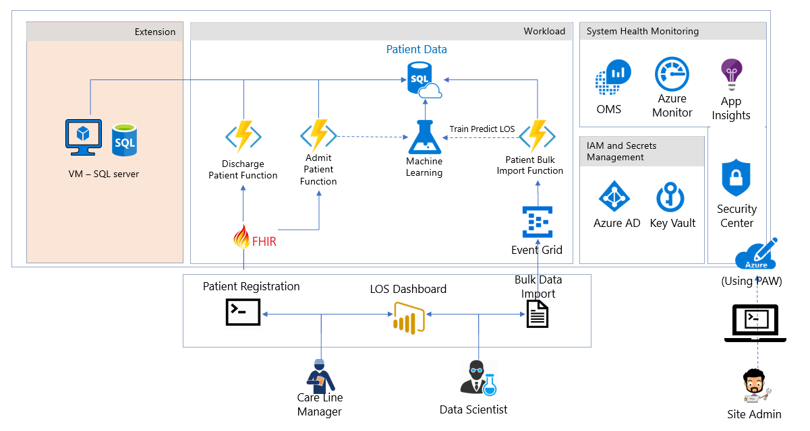
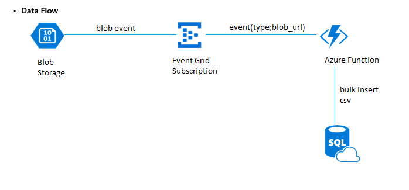
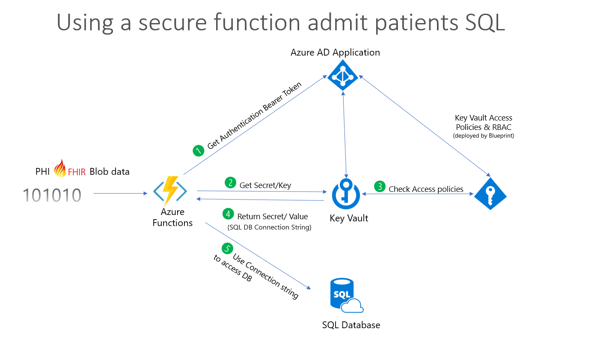

---

title: Azure Health Analytics Blueprint
description: Guidance for deploying a HIPAA/HITRUST Health Analytics Blueprint 
services: security
documentationcenter: na
author: RajeevRangappa

ms.assetid: 26566e0a-0a54-49f4-a91d-48e20b7cef71
ms.service: security
ms.topic: article
ms.date: 07/23/2018
ms.author: rarangap

---

# Azure Security and Compliance Blueprint - HIPAA/HITRUST Health Data and AI

## Overview

**The Azure Security and Compliance Blueprint - HIPAA/HITRUST Health Data and AI offers a turn-key deployment of
an Azure PaaS and IaaS solution to demonstrate how to ingest, store, 
analyze, interact, identity and Securely deploy solutions with health data while being able to meet industry
compliance requirements. The blueprint helps accelerate cloud adoption
and utilization for customers with data that is regulated.**

The Azure Security and Compliance Blueprint - HIPAA/HITRUST Health Data and AI Blueprint provides tools and guidance to help
deploy a secure,  Health Insurance Portability and Accountability Act (HIPAA), and Health Information Trust Alliance (HITRUST) ready platform-as-a-service
(PaaS) environment for ingesting, storing, analyzing, and interacting
with personal and non-personal medical records in a secure,
multi-tier cloud environment, deployed as an end-to-end solution. 

IaaS solution will demonstrate how to migrate an on-premises SQL based solution to Azure, and to implement a Privileged Access Workstation (PAW) to securely manage cloud-based services and solutions. The IaaS SQL Server database adds potential experimentation data is imported into a SQL IaaS VM, and that VM uses MSI authenticated access to interact a SQL Azure PaaS service.Both these showcases a common reference architecture and is designed to simplify
adoption of Microsoft Azure. This provided architecture illustrates a
 solution to meet the needs of organizations seeking a
cloud-based approach to reducing the burden and cost of deployment.

The solution is designed to consume a sample data set formatted using
Fast Healthcare Interoperability Resources (FHIR), a worldwide standard
for exchanging healthcare information electronically, and store it in a
secure manner. Customers can then use Azure Machine Learning Studio to take
advantage of powerful business intelligence tools and analytics to
review predictions made on the sample data. As an example of the kind of
experiment Azure Machine Learning Studio can facilitate, the blueprint includes
a sample dataset, scripts, and tools for predicting the length of a 
patient's stay in a hospital facility. 

This blueprint is intended to serve as a modular foundation for customers 
to adjust to their specific requirements, developing new Azure Machine 
learning experiments to solve both clinical and operational use case scenarios. 
It is designed to be secure and compliant when deployed; however, customers are responsible for
configuring roles correctly and implementing any modifications. Note the following:

-   This blueprint provides a baseline to help customers use Microsoft
    Azure in a HITRUST, and HIPAA environment.

-   Although the blueprint was designed to be aligned with 
HIPAA and HITRUST (through the Common Security Framework
    -- CSF), it should not be considered compliant until certified by an
    external auditor per HIPAA and HITRUST certification requirements.

-   Customers are responsible for conducting appropriate security and
    compliance reviews of any solution built using this foundational
    architecture.

## Deploying the automation

- To deploy the solution, follow the instructions provided in the [deployment guidance](https://github.com/Azure/Health-Data-and-AI-Blueprint/blob/master/deployment.md). 

- For a quick overview of how this solution works, watch this [video](https://aka.ms/healthblueprintvideo) explaining and demonstrating its deployment.

- Frequently asked question can be found in the [FAQ](https://aka.ms/healthblueprintfaq) guidance.

-   **Architectural diagram.** The diagram shows the reference
    architecture used for the blueprint and the example use case scenario.

-   [IaaS Extension](https://github.com/Azure/Health-Data-and-AI-Blueprint/blob/master/README%20IaaS.md)   This solution will demonstrate how to migrate an on-premises SQL based solution to Azure, and to implement a Privileged Access Workstation to securely manage cloud-based services and solutions. 

## Solution components

The foundational architecture is composed of the following components:

-   **[Threat model](https://aka.ms/healththreatmodel)** A comprehensive threat model is provided in tm7
    format for use with the [Microsoft Threat Modeling
    Tool](https://www.microsoft.com/en-us/download/details.aspx?id=49168),
    showing the components of the solution, the data flows between them,
    and the trust boundaries. The model can help customers understand
    the points of potential risk in the system infrastructure when
    developing Machine Learning Studio components or other modifications.

-   **[Customer implementation matrix](https://aka.ms/healthcrmblueprint)** A Microsoft Excel workbook lists
    the relevant HITRUST requirements and explains how Microsoft and the
    customer are responsible for meeting each one.

-   **[Health review.](https://aka.ms/healthreviewpaper)** The solution was reviewed by Coalfire systems, Inc. The Health Compliance (HIPAA, and HITRUST)
    Review and guidance for implementation provides an auditor\'s review
    of the solution, and considerations for transforming the blueprint
    to a production-ready deployment.

## Architectural diagram

## Roles

The blueprint defines two roles for administrative users (operators),
and three roles for users in hospital management and patient care. A
sixth role is defined for an auditor to evaluate compliance with HIPAA
and other regulations. Azure Role-based Access Control (RBAC) enables
precisely focused access management for each user of the solution
through built-in and custom roles. See [Get started with Role-Based
Access Control in the Azure portal](https://docs.microsoft.com/azure/role-based-access-control/overview)
and [Built-in roles for Azure role-based access
control](https://docs.microsoft.com/azure/role-based-access-control/built-in-roles)
for detailed information about RBAC, roles, and permissions.

### Site Administrator

The site administrator is responsible for the customer's Azure
subscription. They control the overall deployment, but have no access to
patient records.

-   Default role assignments:
    [Owner](https://docs.microsoft.com/azure/role-based-access-control/built-in-roles#owner)

-   Custom role assignments: N/A

-   Scope: Subscription

### Database Analyst

The database analyst administers the SQL Server instance and database.
They have no access to patient records.

-   Built-in role assignments: [SQL DB
    Contributor](https://docs.microsoft.com/azure/role-based-access-control/built-in-roles#sql-db-contributor),
    [SQL Server
    Contributor](https://docs.microsoft.com/azure/role-based-access-control/built-in-roles#sql-server-contributor)

-   Custom role assignments: N/A

-   Scope: ResourceGroup

### Data Scientist

The data scientist operates the Azure Machine Learning Studio. They can
import, export, and manage data, and run reports. The data scientist has
access to patient data, but does not have administrative privileges.

-   Built-in role assignments: [Storage Account
    Contributor](https://docs.microsoft.com/azure/role-based-access-control/built-in-roles#storage-account-contributor)

-   Custom role assignments: N/A

-   Scope: ResourceGroup

### Chief Medical Information Officer (CMIO)

The CMIO straddles the divide between informatics/technology and
healthcare professionals in a healthcare organization. Their duties
typically include using analytics to determine if resources are being
allocated appropriately within the organization.

-   Built-in role assignments: None

### Care Line Manager

The care line manager is directly involved with the care of patients.
This role requires monitoring the status of individual patients as well
as ensuring that staff is available to meet the specific care
requirements of their patients. The care line manager is responsible for
adding and updating patient records.

-   Built-in role assignments: None

-   Custom role assignments: Has privilege to run HealthcareDemo.ps1 to
    do both Patient Admission, and Discharge.

-   Scope: ResourceGroup

### Auditor

The auditor evaluates the solution for compliance. They have no direct
access to the network.

-   Built-in role assignments:
    [Reader](https://docs.microsoft.com/azure/role-based-access-control/built-in-roles#reader)

-   Custom role assignments: N/A

-   Scope: Subscription

## Example Use case

The example use case included with this blueprint illustrates how the 
 Blueprint can be used to enable machine learning and
analytics on health data in the cloud. Contosoclinic is a small
hospital located in the United States. The hospital network
administrators want to use Azure Machine Learning Studio to better predict the
length of a patient's stay at the time of admittance, in order to
increase operational workload efficiency, and enhance the quality of care
it can provide.

### Predicting length of stay

The example use case scenario uses Azure Machine Learning Studio to predict a newly
admitted patient's length of stay by comparing the medical details taken
at patient intake to aggregated historical data from previous patients.
The blueprint includes a large set of anonymized medical records to
demonstrate the training and predictive capabilities of the solution. In
a production deployment, customers would use their own records to train
the solution for more accurate predictions reflecting the unique details
of their environment, facilities, and patients.

### Users and roles

**Site Administrator -- Alex**

*Email: Alex\_SiteAdmin*

Alex's job is to evaluate technologies that can reduce the burden of
managing an on-premises network and reduce costs for management. Alex has
been evaluating Azure for some time but has struggled to configure the
services that he needs to meet the HiTrust compliance requirements to
store Patient Data in the cloud. Alex has selected the Azure
Health AI to deploy a compliance-ready health
solution, which has addressed the requirements to meet the customer
requirements for HiTrust.

**Data Scientist -- Debra**

*Email: Debra\_DataScientist*

Debra is in charge of using and creating models that analyze medical
records to provide insights into patient care. Debra uses SQL and the R
statistical programming language to create her models.

**Database Analyst -- Danny**

*Email: Danny\_DBAnalyst*

Danny is the main contact for anything regarding the Microsoft SQL
Server that stores all the patient data for Contosoclinic. Danny is an
experienced SQL Server administrator who has recently become familiar
with Azure SQL Database.

**Chief Medical Information Officer -- Caroline**

Caroline is working with Chris the Care Line Manager, and Debra the
Data Scientist to determine what factors impact patient length of stay.
Caroline uses the predictions from the length-of-stay (LOS) solution
to determine if resources are being allocated appropriately in the
hospital network. For example, using the dashboard provided in this
solution.

**Care Line Manager -- Chris**

*Email: Chris\_CareLineManager*

As the individual directly responsible for managing patient admission,
and discharges at Contosoclinic, Chris uses the predictions
generated by the LOS solution to ensure that adequate staff are
available to provide care to patients while they are staying in the
facility.

**Auditor -- Han**

*Email: Han\_Auditor*

Han is a certified auditor who has experience auditing for ISO, SOC, and
HiTrust. Han was hired to review Contosoclinc's network. Han can
 review the Customer Responsibility Matrix
provided with the solution to ensure that the blueprint and LOS solution
can be used to store, process, and display sensitive personal data.

## Design configuration

This section details the default configurations and security measures
built into the Blueprint outlined to:

- **INGEST** data raw sources including FHIR data source
- **STORE**  sensitive information
- **ANALYZE** and predict outcomes
- **INTERACT** with the results and predictions
- **IDENTITY** management of solution
- **SECURITY** enabled features

## IDENTITY 

### Azure Active Directory and role-based access control (RBAC)

**Authentication:**

-   [Azure Active Directory (Azure
    AD)](https://azure.microsoft.com/services/active-directory/) is the
    Microsoft\'s multi-tenant cloud-based directory and identity
    management service. All users for the solution were created in Azure
    Active Directory, including users accessing the SQL Database.

-   Authentication to the application is performed using Azure AD. For
    more information, see [Integrating applications with Azure Active
    Directory](/azure/active-directory/develop/active-directory-integrating-applications).

-   [Azure Active Directory Identity
    Protection](/azure/active-directory/active-directory-identityprotection)
    detects potential vulnerabilities affecting your organization's
    identities, configures automated responses to detected suspicious
    actions related to your organization's identities, and investigates
    suspicious incidents and takes appropriate action to resolve them.

-   [Azure Role-based Access Control
    (RBAC)](/azure/role-based-access-control/role-assignments-portal)
    enables precisely focused access management for Azure. Subscription
    access is limited to the subscription administrator, and Azure Key
    Vault access is limited to the site administrator. Strong passwords
    (12 characters minimum with at least one Upper/Lower letter, number,
    and special character) are required.

-   Multi-factor authentication is supported when the -enableMFA switch is
    enabled during deployment.

-   Passwords expire after 60 days when the -enableADDomainPasswordPolicy
    switch is enabled during deployment.

**Roles:**

-   The solution makes use of [built-in
    roles](/azure/role-based-access-control/built-in-roles)
    to manage access to resources.

-   All users are assigned specific built-in roles by default.

### Azure Key Vault

-   Data stored in Key Vault includes:

    -   Application insight key
    -   Patient Data Storage Access key
    -   Patient connection string
    -   Patient data table name
    -   Azure ML Web Service Endpoint
    -   Azure ML Service API Key

-   Advanced access policies are configured on a need basis
-   Key Vault access policies are defined with minimum required
    permissions to keys and secrets
-   All keys and secrets in Key Vault have expiration dates
-   All keys in Key Vault are protected by HSM \[Key Type = HSM
    Protected 2048-bit RSA Key\]
-   All users/identities are granted minimum required permissions using
    Role Based Access Control (RBAC)
-   Applications do not share a Key Vault unless they trust each other
    and they need access to the same secrets at runtime
-   Diagnostics logs for Key Vault are enabled with a retention period
    of at least 365 days.
-   Permitted cryptographic operations for keys are restricted to the
    ones required

## INGEST 

### Azure Functions
The solution was designed to  use [Azure Functions](/azure/azure-functions/) to process the sample length of stay data used in the analytics demo. Three capabilities in the functions have been created.

**1. Bulk import of customer data phi data**

When using the demo script. .\\HealthcareDemo.ps1 with the **BulkPatientAdmission** switch as outlined in **Deploying and running the demo** it executes the following processing pipeline:
1. **Azure Blob Storage** - Patient data .csv file sample uploaded to storage
2. **Event Grid** - Event Publishes data to Azure Function (Bulk import - blob event)
3. **Azure Function** - Performs the processing and stores the data into SQL Storage using the secure function - event(type; blob url)
4. **SQL DB** - The database store for Patient Data using tags for classification, and the ML process is kicked off to do the training experiment.

Additionally the azure function was designed to read and protect designated sensitive data in the sample data set using the following tags:
- dataProfile => “ePHI”
- owner => \<Site Admin UPN\>
- environment => “Pilot”
- department => “Global Ecosystem"
The tagging was applied to the sample data set where patient 'names' was identified as clear text.

**2. Admission of new patients**

When using the demo script. .\\HealthcareDemo.ps1 with the **BulkPatientadmission** switch as outlined in **Deploying and running the demo** it executes the following processing pipeline:

**1. Azure Function** triggered and the function requests for a [bearer token](/rest/api/) from Azure Active directory.

**2. Key Vault** requested for a secret that is associated to the requested token.

**3. Azure Roles** validate the request, and authorize access request to the Key Vault.

**4. Key Vault** returns the secret, in this case the SQL DB Connection string.

**5. Azure Function** uses the connection string to securely connect to SQL Database and continues further processing to store ePHI data.

To achieve the storage of the data, a common API schema was implemented  following Fast Healthcare Interoperability Resources (FHIR, pronounced fire). The function was provided the following FHIR exchange elements:

-   [Patient schema](https://www.hl7.org/fhir/patient.html) covers the "who" information about a patient.

-   [Observation schema](https://www.hl7.org/fhir/observation.html)  covers the central element in healthcare, used to support diagnosis, monitor progress, determine baselines and patterns and even capture demographic characteristics. 

-   [Encounter schema](https://www.hl7.org/fhir/encounter.html) covers the types of encounters such as ambulatory, emergency, home health, inpatient, and virtual encounters.

-   [Condition schema](https://www.hl7.org/fhir/condition.html) covers detailed information about a condition, problem, diagnosis, or other event, situation, issue, or clinical concept that has risen to a level of concern.  

### Event Grid

The solution supports Azure Event Grid, a single service for managing
routing of all events from any source to any destination, providing:

-   [Security and
    authentication](/azure/event-grid/security-authentication)

-   [Role-based access
    control](/azure/event-grid/security-authentication#management-access-control)
    for various management operations such as listing event
    subscriptions, creating new ones, and generating keys

-   Auditing

## STORE 

### SQL Database and Server 

-   [Transparent Data Encryption
    (TDE)](/sql/relational-databases/security/encryption/transparent-data-encryption-azure-sql)
    provides real-time encryption and decryption of data stored in the
    Azure SQL Database, using a key stored in Azure Key Vault.

-   [SQL Vulnerability
    Assessment](https://docs.microsoft.com/azure/sql-database/sql-vulnerability-assessment)
    is an easy to configure tool that can discover, track, and remediate
    potential database vulnerabilities.

-   [SQL Database Threat
    Detection](/azure/sql-database/sql-database-threat-detection)
     enabled.

-   [SQL Database
    Auditing](/azure/sql-database/sql-database-auditing)
     enabled.

-   [SQL Database metrics and diagnostic
    logging](/azure/sql-database/sql-database-metrics-diag-logging)
     enabled.

-   [Server- and database-level firewall
    rules](/azure/sql-database/sql-database-firewall-configure)
    have been tightened.

-   [Always Encrypted
    columns](/azure/sql-database/sql-database-always-encrypted-azure-key-vault)
    are used to protect patient first, middle, and last names.
    Additionally, the database column encryption also uses Azure Active Directory (AD) to
    authenticate the application to Azure SQL Database.

-   Access to SQL Database and SQL Server is configured according to the
    principle of least privilege.

-   Only required IP addresses are allowed access through the SQL
    firewall.

### Storage accounts

-   [Data in motion is transferred using TLS/SSL
    only](/azure/storage/common/storage-require-secure-transfer?toc=%2Fazure%2Fstorage%2Fblobs%2Ftoc.json).

-   Anonymous access is not allowed for containers.

-   Alert rules are configured for tracking anonymous activity.

-   HTTPS is required for accessing storage account resources.

-   Authentication request data is logged and monitored.

-   Data in Blob storage is encrypted at rest.

## ANALYZE

### Machine Learning

- [Logging is enabled](/azure/machine-learning/studio/web-services-logging)
    for Machine Learning Studio web services.
- Using [Machine Learning Studio](/azure/machine-learning/studio/what-is-ml-studio) requires the development of experiments that provide the ability to predict to a solution set.

## SECURITY

### Azure Security Center
- [Azure Security Center](https://azure.microsoft.com/services/security-center/) provides a centralized view of the security state of all your Azure resources. At a glance, you can verify that the appropriate security controls are in place and configured correctly, and you can quickly identify any resources that require attention. 

- [Azure Advisor](/azure/advisor/advisor-overview) is a personalized cloud consultant that helps you follow best practices to optimize your Azure deployments. It analyzes your resource configuration and usage telemetry and then recommends solutions that can help you improve the cost effectiveness, performance, high availability, and security of your Azure resources.

### Application Insights
- [Application Insights](/azure/application-insights/app-insights-overview) is an extensible Application Performance Management (APM) service for web developers on multiple platforms. Use it to monitor your live web application. It detects performance anomalies. It includes powerful analytics tools to help you diagnose issues and to understand what users actually do with your app. It's designed to help you continuously improve performance and usability.

### Azure Alerts
- [Alerts](/azure/azure-monitor/platform/alerts-metric) offer a method of monitoring Azure services and allow you to configure conditions over data. Alerts also provide notifications when an alert condition matches the monitoring data.

### Azure Monitor logs
[Azure Monitor logs](/azure/operations-management-suite/operations-management-suite-overview) is a collection of management services.

-   Workspace is enabled for Security Center

-   Workspace is enabled for Workload Monitoring

-   Workload Monitoring is enabled for:

    -   Identity and Access

    -   Security and Audit

    -   Azure SQL DB Analytics

    -   [Azure WebApp
        Analytics](/azure/log-analytics/log-analytics-azure-web-apps-analytics)
        Solution

    -   Key Vault Analytics

    -   Change Tracking

-   [Application Insights Connector
    (Preview)](/azure/log-analytics/log-analytics-app-insights-connector)
    is enabled

-   [Activity log
    analytics](/azure/log-analytics/log-analytics-activity)
    is enabled
