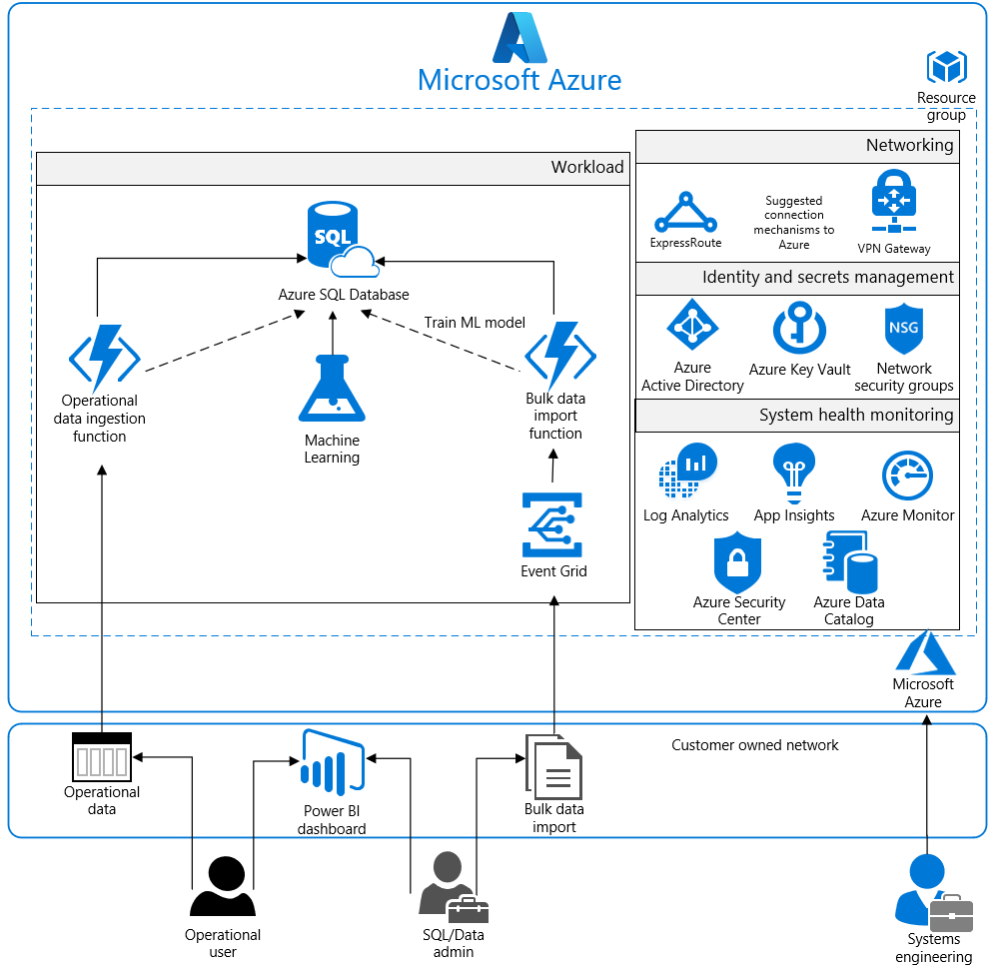
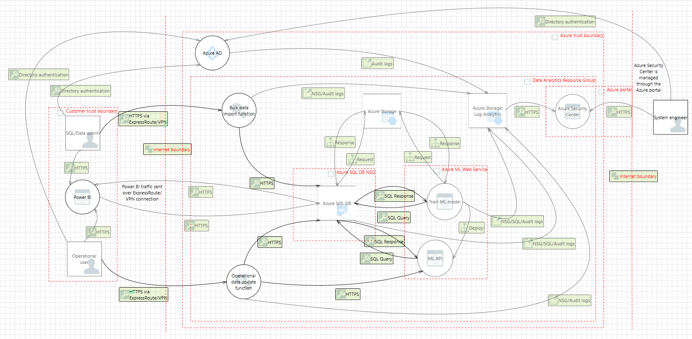

# Azure Security and Compliance Blueprint - Data Analytics for NIST SP 800-171

## Overview
[NIST Special Publication 800-171](https://nvlpubs.nist.gov/nistpubs/SpecialPublications/NIST.SP.800-171.pdf) provides guidelines for protecting the controlled unclassified information (CUI) that resides in nonfederal information systems and organizations. NIST SP 800-171 establishes 14 families of security requirements for protecting the confidentiality of CUI.

This Azure Security and Compliance Blueprint provides guidance to help customers deploy a data analytics architecture in Azure that implements a subset of NIST SP 800-171 controls. This solution demonstrates ways in which customers can meet specific security and compliance requirements. It also serves as a foundation for customers to build and configure their own data analytics solutions in Azure.

This reference architecture, associated implementation guide, and threat model are intended to serve as a foundation for customers to adapt to their specific requirements. They shouldn't be used as-is in a production environment. Deploying this architecture without modification is insufficient to completely meet the requirements of NIST SP 800-171. Customers are responsible for conducting appropriate security and compliance assessments of any solution built using this architecture. Requirements might vary based on the specifics of each customer's implementation.

## Architecture diagram and components
This solution provides an analytics platform upon which customers can build their own analytics tools. The reference architecture outlines a generic use case. Customers can use it to input data through bulk data imports by the SQL/Data Administrator. They also can use it to input data through operational data updates via an Operational User. Both workstreams incorporate Azure Functions for importing data into Azure SQL Database. Azure Functions must be configured by the customer through the Azure portal to handle the import tasks unique to the customer's analytics requirements.

Azure offers a variety of reporting and analytics services for the customer. This solution incorporates Azure Machine Learning services along with SQL Database to rapidly browse through data and deliver quicker results through smarter modeling of data. Machine Learning is a form of machine learning intended to increase query speeds by discovering new relationships between datasets. After the data is trained through several statistical functions, up to seven additional query pools (eight total including the customer server) can be synchronized with the same tabular models to spread query workload and reduce response times.

For enhanced analytics and reporting, SQL Database can be configured with column store indexes. Machine Learning and SQL Database can be scaled up or down or shut off completely in response to customer usage. All SQL traffic is encrypted with SSL through the inclusion of self-signed certificates. As a best practice, Azure recommends the use of a trusted certificate authority for enhanced security.

After data is uploaded to the SQL Database and trained by Machine Learning, it's digested by the Operational User and SQL/Data Administrator with Power BI. Power BI displays data intuitively and pulls together information across multiple datasets to draw greater insight. Power BI has a high degree of adaptability and easily integrates with SQL Database. Customers can configure it to handle a wide array of scenarios that are required by their business needs.

The entire solution is built upon Azure Storage, which customers configure from the Azure portal. Storage encrypts all data with Storage Service Encryption to maintain confidentiality of data at rest. Geographic redundant storage ensures that an adverse event at the customer's primary data center doesn't result in a loss of data. A second copy is stored in a separate location hundreds of miles away.

For enhanced security, all resources in this solution are managed as a resource group through Azure Resource Manager. Azure Active Directory role-based access control (RBAC) is used to control access to deployed resources. These resources include customer keys in Azure Key Vault. System health is monitored through Azure Security Center and Azure Monitor. Customers configure both monitoring services to capture logs and display system health in a single dashboard that's easy to use.

SQL Database is commonly managed through SQL Server Management Studio, which runs from a local machine configured to access the SQL Database via a secure VPN or ExpressRoute connection. **Microsoft recommends that you configure a VPN or ExpressRoute connection for management and data import into the resource group**.

This solution uses the following Azure services. For more information, see the [deployment architecture](#deployment-architecture) section.

- Application Insights
- Azure Active Directory
- Azure Data Catalog
- Azure Disk Encryption
- Azure Event Grid
- Azure Functions
- Azure Key Vault
- Azure Log Analytics
- Azure Machine Learning
- Azure Monitor
- Azure Security Center
- Azure SQL Database
- Azure Storage
- Azure Virtual Network
	- (1) /16 Network
	- (2) /24 Networks
	- (2) Network security groups
- Power BI Dashboard

## Deployment architecture
The following section details the deployment and implementation elements.

**Azure Event Grid**:
With [Event Grid](https://docs.microsoft.com/azure/event-grid/overview), customers can easily build applications with event-based architectures. Users select the Azure resource they want to subscribe to. Then they give the event handler or webhook an endpoint to send the event to. Customers can secure webhook endpoints by adding query parameters to the webhook URL when they create an Event Subscription. Event Grid  supports only HTTPS webhook endpoints. With Event Grid, customers can control the level of access given to different users to do various management operations. Users can list event subscriptions, create new ones, and generate keys. Event Grid uses Azure RBAC.

**Azure Functions**:
[Azure Functions](https://docs.microsoft.com/azure/azure-functions/functions-overview) is a server-less compute service that users can use to run code on-demand without having to explicitly provision or manage infrastructure. Use Azure Functions to run a script or piece of code in response to a variety of events.

**Azure Machine Learning**:
[Machine Learning](https://docs.microsoft.com/azure/machine-learning/preview/) is a data science technique that allows computers to use existing data to forecast future behaviors, outcomes, and trends.

**Azure Data Catalog**:
[Data Catalog](https://docs.microsoft.com/azure/data-catalog/data-catalog-what-is-data-catalog) makes data sources easily discoverable and understandable by the users who manage the data. Common data sources can be registered, tagged, and searched for data. The data remains in its existing location, but a copy of its metadata is added to Data Catalog. A reference to the data source location is included. The metadata is indexed to make each data source easily discoverable via search. Indexing also makes it understandable to the users who discover it.

### Virtual network
This reference architecture defines a private virtual network with an address space of 10.0.0.0/16.

**Network security groups**: [Network security groups](https://docs.microsoft.com/azure/virtual-network/virtual-networks-nsg) contain access control lists that allow or deny traffic within a Virtual Network. Network security groups can be used to secure traffic at a subnet or individual virtual machine level. The following network security groups exist:
  - A network security group for Active Directory
  - A network security group for the workload

Each of the network security groups have specific ports and protocols open so that the solution can work securely and correctly. In addition, the following configurations are enabled for each network security group:
  -	[Diagnostic logs and events](https://docs.microsoft.com/azure/virtual-network/virtual-network-nsg-manage-log) are enabled and stored in a storage account
  -	Log Analytics is connected to the [network security group's diagnostics](https://github.com/krnese/AzureDeploy/blob/master/AzureMgmt/AzureMonitor/nsgWithDiagnostics.json)

**Subnets**: Each subnet is associated with its corresponding network security group.

### Data in transit
Azure encrypts all communications to and from Azure datacenters by default. All transactions to Storage through the Azure portal occur via HTTPS.

### Data at rest

The architecture protects data at rest through encryption, database auditing, and other measures.

**Azure Storage**:
To meet encrypted data at rest requirements, all [Storage](https://azure.microsoft.com/services/storage/) uses [Storage Service Encryption](https://docs.microsoft.com/azure/storage/storage-service-encryption). This helps protect and safeguard data in support of organizational security commitments and compliance requirements defined by NIST SP 800-171.

**Azure Disk Encryption**:
[Azure Disk Encryption](https://docs.microsoft.com/azure/security/azure-security-disk-encryption) leverages the BitLocker feature of Windows to provide volume encryption for data disks. The solution integrates with Azure Key Vault to help control and manage the disk-encryption keys.

**Azure SQL Database**:
The Azure SQL Database instance uses the following database security measures:
-	[AD authentication and authorization](https://docs.microsoft.com/azure/sql-database/sql-database-aad-authentication) enables identity management of database users and other Microsoft services in one central location.
-	[SQL database auditing](https://docs.microsoft.com/azure/sql-database/sql-database-auditing-get-started) tracks database events and writes them to an audit log in an Azure storage account.
-	Azure SQL Database is configured to use [transparent data encryption](https://docs.microsoft.com/sql/relational-databases/security/encryption/transparent-data-encryption-azure-sql), which performs real-time encryption and decryption of the database, associated backups, and transaction log files to protect information at rest. Transparent data encryption provides assurance that stored  data has not been subject to unauthorized access.
-	[Firewall rules](https://docs.microsoft.com/azure/sql-database/sql-database-firewall-configure) prevent all access to database servers until proper permissions are granted. The firewall grants access to databases based on the originating IP address of each request.
-	[SQL Threat Detection](https://docs.microsoft.com/azure/sql-database/sql-database-threat-detection-get-started) enables the detection and response to potential threats as they occur by providing security alerts for suspicious database activities, potential vulnerabilities, SQL injection attacks, and anomalous database access patterns.
-	[Encrypted Columns](https://docs.microsoft.com/azure/sql-database/sql-database-always-encrypted-azure-key-vault) ensure that sensitive  data never appears as plaintext inside the database system. After enabling data encryption, only client applications or application servers with access to the keys can access plaintext data.
- [SQL Database dynamic data masking](https://docs.microsoft.com/azure/sql-database/sql-database-dynamic-data-masking-get-started) limits sensitive  data exposure by masking the data to non-privileged users or applications. Dynamic data masking can automatically discover potentially sensitive data and suggest the appropriate masks to be applied. This helps with reducing access such that sensitive data does not exit the database via unauthorized access. Customers are responsible for adjusting dynamic data masking settings to adhere to their database schema.

### Identity management
The following technologies provide capabilities to manage access to data in the Azure environment:
-	[Azure Active Directory](https://azure.microsoft.com/services/active-directory/) is Microsoft's multi-tenant cloud-based directory and identity management service. All users for this solution are created in Azure Active Directory, including users accessing Azure SQL Database.
-	Authentication to the application is performed using Azure Active Directory. For more information, see [Integrating applications with Azure Active Directory](https://docs.microsoft.com/azure/active-directory/develop/active-directory-integrating-applications). Additionally, the database column encryption uses Azure Active Directory to authenticate the application to Azure SQL Database. For more information, see how to [protect sensitive data in SQL Database](https://docs.microsoft.com/azure/sql-database/sql-database-always-encrypted-azure-key-vault).
-	[Azure role-based access control](https://docs.microsoft.com/azure/active-directory/role-based-access-control-configure) enables administrators to define fine-grained access permissions to grant only the amount of access that users need to perform their jobs. Instead of giving every user unrestricted permissions for Azure resources, administrators can allow only certain actions for accessing  data. Subscription access is limited to the subscription administrator.
- [Azure Active Directory Privileged Identity Management](https://docs.microsoft.com/azure/active-directory/active-directory-privileged-identity-management-getting-started) enables customers to minimize the number of users who have access to certain information such as  data.  Administrators can use Azure Active Directory Privileged Identity Management to discover, restrict, and monitor privileged identities and their access to resources. This functionality can also be used to enforce on-demand, just-in-time administrative access when needed.
-	[Azure Active Directory Identity Protection](https://docs.microsoft.com/azure/active-directory/active-directory-identityprotection) detects potential vulnerabilities affecting an organization’s identities, configures automated responses to detected suspicious actions related to an organization’s identities, and investigates suspicious incidents to take appropriate action to resolve them.

### Security
**Secrets management**:
The solution uses [Azure Key Vault](https://azure.microsoft.com/services/key-vault/) for the management of keys and secrets. Azure Key Vault helps safeguard cryptographic keys and secrets used by cloud applications and services. The following Azure Key Vault capabilities help customers protect data:
- Advanced access policies are configured on a need basis.
- Key Vault access policies are defined with minimum required permissions to keys and secrets.
- All keys and secrets in Key Vault have expiration dates.
- All keys in Key Vault are protected by specialized hardware security modules. The key type is an hardware security modules protected 2048-bit RSA key.
- All users and identities are granted minimum required permissions using role-based access control.
- Diagnostics logs for Key Vault are enabled with a retention period of at least 365 days.
- Permitted cryptographic operations for keys are restricted to the ones required.

**Azure Security Center**: With [Azure Security Center](https://docs.microsoft.com/azure/security-center/security-center-intro), customers can centrally apply and manage security policies across workloads, limit exposure to threats, and detect and respond to attacks. Additionally, Azure Security Center accesses existing configurations of Azure services to provide configuration and service recommendations to help improve security posture and protect data.

Azure Security Center uses a variety of detection capabilities to alert customers of potential attacks targeting their environments. These alerts contain valuable information about what triggered the alert, the resources targeted, and the source of the attack. Azure Security Center has a set of [predefined security alerts](https://docs.microsoft.com/azure/security-center/security-center-alerts-type), which are triggered when a threat, or suspicious activity takes place. [Custom alert rules](https://docs.microsoft.com/azure/security-center/security-center-custom-alert) in Azure Security Center allow customers to define new security alerts based on data that is already collected from their environment.

Azure Security Center provides prioritized security alerts and incidents, making it simpler for customers to discover and address potential security issues. A [threat intelligence report](https://docs.microsoft.com/azure/security-center/security-center-threat-report) is generated for each detected threat to assist incident response teams in investigating and remediating threats.

### Logging and auditing

Azure services extensively log system and user activity, as well as system health:
- **Activity logs**: [Activity logs](https://docs.microsoft.com/azure/monitoring-and-diagnostics/monitoring-overview-activity-logs) provide insight into operations performed on resources in a subscription. Activity logs can help determine an operation's initiator, time of occurrence, and status.
- **Diagnostic logs**: [Diagnostic logs](https://docs.microsoft.com/azure/monitoring-and-diagnostics/monitoring-overview-of-diagnostic-logs) include all logs emitted by every resource. These logs include Windows event system logs, Azure Storage logs, Key Vault audit logs, and Application Gateway access and firewall logs. All diagnostic logs write to a centralized and encrypted Azure storage account for archival. The retention is user-configurable, up to 730 days, to meet organization-specific retention requirements.

**Log Analytics**: These logs are consolidated in [Log Analytics](https://azure.microsoft.com/services/log-analytics/) for processing, storing, and dashboard reporting. Once collected, the data is organized into separate tables for each data type within Operations Management Suite workspaces, which allows all data to be analyzed together regardless of its original source. Furthermore, Azure Security Center integrates with Log Analytics allowing customers to use Log Analytics queries to access their security event data and combine it with data from other services.

The following Log Analytics [management solutions](https://docs.microsoft.com/azure/log-analytics/log-analytics-add-solutions) are included as a part of this architecture:
-	[Active Directory Assessment](https://docs.microsoft.com/azure/log-analytics/log-analytics-ad-assessment): The Active Directory Health Check solution assesses the risk and health of server environments on a regular interval and provides a prioritized list of recommendations specific to the deployed server infrastructure.
- [SQL Assessment](https://docs.microsoft.com/azure/log-analytics/log-analytics-sql-assessment): The SQL Health Check solution assesses the risk and health of server environments on a regular interval and provides customers with a prioritized list of recommendations specific to the deployed server infrastructure.
- [Agent Health](https://docs.microsoft.com/azure/operations-management-suite/oms-solution-agenthealth): The Agent Health solution reports how many agents are deployed and their geographic distribution, as well as how many agents which are unresponsive and the number of agents which are submitting operational data.
-	[Activity Log Analytics](https://docs.microsoft.com/azure/log-analytics/log-analytics-activity): The Activity Log Analytics solution assists with analysis of the Azure activity logs across all Azure subscriptions for a customer.

**Azure Automation**: [Azure Automation](https://docs.microsoft.com/azure/automation/automation-hybrid-runbook-worker) stores, runs, and manages runbooks. In this solution, runbooks help collect logs from Azure SQL Database. The Automation [Change Tracking](https://docs.microsoft.com/azure/automation/automation-change-tracking) solution enables customers to easily identify changes in the environment.

**Azure Monitor**:
[Azure Monitor](https://docs.microsoft.com/azure/monitoring-and-diagnostics/) helps users track performance, maintain security, and identify trends by enabling organizations to audit, create alerts, and archive data, including tracking API calls in their Azure resources.

**Application Insights**:
[Application Insights](https://docs.microsoft.com/azure/application-insights/) is an extensible Application Performance Management service for web developers on multiple platforms. It detects performance anomalies and includes powerful analytics tools to help diagnose issues and to understand what users do with the app. It's designed to help users continuously improve performance and usability.

## Threat model

The data flow diagram for this reference architecture is available for [download](https://aka.ms/nist171-analytics-tm) or can be found below. This model can help customers understand the points of potential risk in the system infrastructure when making modifications.

## Compliance documentation
The [Azure Security and Compliance Blueprint - NIST SP 800-171 Customer Responsibility Matrix](https://aka.ms/nist171-crm) lists all security controls required by NIST SP 800-171. This matrix details whether the implementation of each control is the responsibility of Microsoft, the customer, or shared between the two.

The [Azure Security and Compliance Blueprint - NIST SP 800-171 Data Analytics Control Implementation Matrix](https://aka.ms/nist171-analytics-cim) provides information on which NIST SP 800-171 controls are addressed by the data analytics architecture, including detailed descriptions of how the implementation meets the requirements of each covered control.

## Guidance and recommendations
### VPN and ExpressRoute
A secure VPN tunnel or [ExpressRoute](https://docs.microsoft.com/azure/expressroute/expressroute-introduction) needs to be configured to securely establish a connection to the resources deployed as a part of this data analytics reference architecture. By appropriately setting up a VPN or ExpressRoute, customers can add a layer of protection for data in transit.

By implementing a secure VPN tunnel with Azure, a virtual private connection between an on-premises network and an Azure Virtual Network can be created. This connection takes place over the Internet and allows customers to securely “tunnel” information inside an encrypted link between the customer's network and Azure. Site-to-site VPN is a secure, mature technology that has been deployed by enterprises of all sizes for decades. The [IPsec tunnel mode](https://docs.microsoft.com/previous-versions/windows/it-pro/windows-server-2003/cc786385(v=ws.10)) is used in this option as an encryption mechanism.

Because traffic within the VPN tunnel does traverse the Internet with a site-to-site VPN, Microsoft offers another, even more secure connection option. Azure ExpressRoute is a dedicated WAN link between Azure and an on-premises location or an Exchange hosting provider. As ExpressRoute connections do not go over the Internet, these connections offer more reliability, faster speeds, lower latencies, and higher security than typical connections over the Internet. Furthermore, because this is a direct connection of customer's telecommunication provider, the data does not travel over the Internet and therefore is not exposed to it.

Best practices for implementing a secure hybrid network that extends an on-premises network to Azure are [available](https://docs.microsoft.com/azure/architecture/reference-architectures/dmz/secure-vnet-hybrid).

### Extract-Transform-Load process
[PolyBase](https://docs.microsoft.com/sql/relational-databases/polybase/polybase-guide) can load data into Azure SQL Database without the need for a separate extract, transform, load or import tool. PolyBase allows access to data through T-SQL queries. Microsoft's business intelligence and analysis stack, as well as third-party tools compatible with SQL Server, can be used with PolyBase.

### Azure Active Directory setup
[Azure Active Directory](https://docs.microsoft.com/azure/active-directory/active-directory-whatis) is essential to managing the deployment and provisioning access to personnel interacting with the environment. An existing Windows Server Active Directory can be integrated with Azure Active Directory in [four clicks](https://docs.microsoft.com/azure/active-directory/connect/active-directory-aadconnect-get-started-express). Customers can also tie the deployed Active Directory infrastructure (domain controllers) to an existing Azure Active Directory by making the deployed Active Directory infrastructure a subdomain of an Azure Active Directory forest.

## Disclaimer

 - This document is for informational purposes only. MICROSOFT MAKES NO WARRANTIES, EXPRESS, IMPLIED, OR STATUTORY, AS TO THE INFORMATION IN THIS DOCUMENT. This document is provided "as-is." Information and views expressed in this document, including URL and other Internet website references, may change without notice. Customers reading this document bear the risk of using it.
 - This document does not provide customers with any legal rights to any intellectual property in any Microsoft product or solutions.
 - Customers may copy and use this document for internal reference purposes.
 - Certain recommendations in this document may result in increased data, network, or compute resource usage in Azure, and may increase a customer's Azure license or subscription costs.
 - This architecture is intended to serve as a foundation for customers to adjust to their specific requirements and should not be used as-is in a production environment.
 - This document is developed as a reference and should not be used to define all means by which a customer can meet specific compliance requirements and regulations. Customers should seek legal support from their organization on approved customer implementations.
