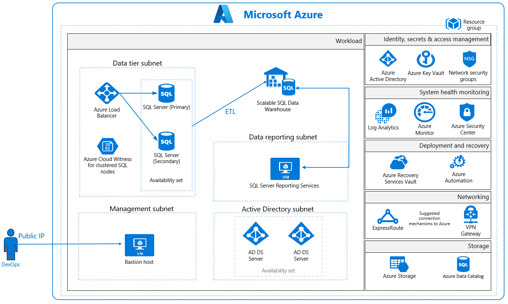
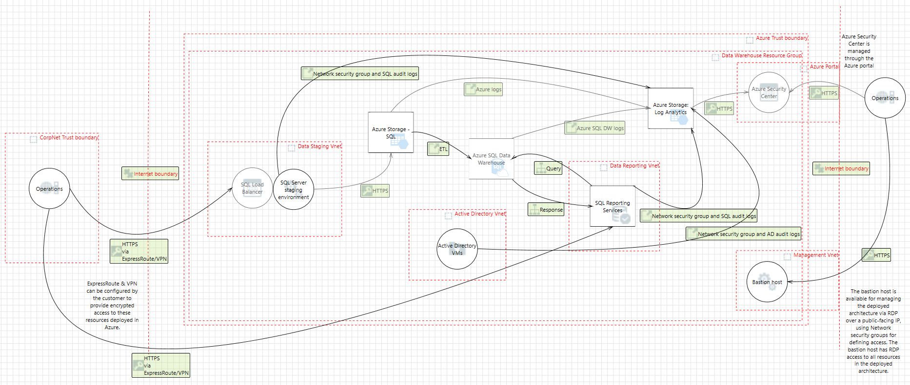

# Azure Security and Compliance Blueprint - Data Warehouse for NIST SP 800-171

## Overview
[NIST Special Publication 800-171](https://nvlpubs.nist.gov/nistpubs/SpecialPublications/NIST.SP.800-171.pdf) provides guidelines for protecting the controlled unclassified information (CUI) that resides in nonfederal information systems and organizations. NIST SP 800-171 establishes 14 families of security requirements for protecting the confidentiality of CUI.

This Azure Security and Compliance Blueprint provides guidance to help customers deploy a data warehouse architecture in Azure that implements a subset of NIST SP 800-171 controls. This solution demonstrates ways in which customers can meet specific security and compliance requirements. It also serves as a foundation for customers to build and configure their own data warehouse solutions in Azure.

This reference architecture, associated implementation guide, and threat model are intended to serve as a foundation for customers to adapt to their specific requirements. They shouldn't be used as-is in a production environment. Customers are responsible for conducting appropriate security and compliance assessments of any solution built using this architecture. Requirements might vary based on the specifics of each customer's implementation.

## Architecture diagram and components
This solution provides a reference architecture that implements a high-performance and secure cloud data warehouse. There are two separate data tiers in this architecture. One tier is where data is imported, stored, and staged within a clustered SQL environment. Another tier is for the SQL data warehouse. With this tier, the data is loaded by using an extract-transform-load (ETL) tool (for example, [PolyBase](https://docs.microsoft.com/azure/sql-data-warehouse/load-data-from-azure-blob-storage-using-polybase) T-SQL queries) for processing. After data is stored in SQL Data Warehouse, analytics can run at a massive scale.

Azure offers a variety of reporting and analytics services for the customer. This solution includes SQL Server Reporting Services for quick creation of reports from the SQL data warehouse. All SQL traffic is encrypted with SSL through the inclusion of self-signed certificates. As a best practice, we recommend the use of a trusted certificate authority for enhanced security.

Azure SQL Data Warehouse stores data in relational tables with columnar storage. This format significantly reduces data storage costs while it improves query performance. Depending on usage requirements, SQL Data Warehouse compute resources can be scaled up or down or shut off completely if no active processes require compute resources.

A SQL Server load balancer manages SQL traffic to ensure high performance. All virtual machines (VMs) in this reference architecture deploy in an availability set with SQL Server instances configured in an Always On availability group. This configuration provides high-availability and disaster-recovery capabilities.

This data warehouse reference architecture also includes an Active Directory tier for management of resources within the architecture. The Active Directory subnet enables easy adoption under a larger Active Directory forest structure. This way, the environment can operate continuously, even when access to the larger forest is unavailable. All VMs are domain joined to the Active Directory tier. They use Active Directory group policies to enforce security and compliance configurations at the operating system level.

The solution uses Azure Storage accounts, which customers can configure to use Storage Service Encryption to maintain confidentiality of data at rest. Azure stores three copies of data within a customer's selected data center for resiliency. Geo-redundant storage ensures that data is replicated to a secondary data center hundreds of miles away and again stored as three copies within that data center. This arrangement prevents an adverse event at the customer's primary data center from resulting in a loss of data.

For enhanced security, all resources in this solution are managed as a resource group through Azure Resource Manager. Azure Active Directory (Azure AD) role-based access control (RBAC) is used to control access to deployed resources. These resources include customer keys in Azure Key Vault. System health is monitored through Azure Security Center and Azure Monitor. Customers configure both monitoring services to capture logs. System health is displayed in a single dashboard that's easy to use.

A VM serves as a management bastion host. It provides a secure connection for administrators to access deployed resources. The data loads into the staging area through this management bastion host. *We recommend that you configure a VPN or Azure ExpressRoute connection for management and data import into the reference architecture subnet.*

This solution uses the following Azure services. For more information, see the [deployment architecture](#deployment-architecture) section.

- Availability sets
    - Active Directory domain controllers
    - SQL Server cluster nodes and witness
- Azure Active Directory
- Azure Data Catalog
- Azure Key Vault
- Azure Monitor
- Azure Security Center
- Azure Load Balancer
- Azure Storage
- Azure Log Analytics
- Azure Virtual Machines
    - (1) Bastion host
    - (2) Active Directory domain controller
    - (2) SQL Server cluster node
    - (1) SQL Server witness
- Azure Virtual Network
    - (1) /16 network
    - (4) /24 networks
    - (4) Network security groups
- Recovery Services vault
- SQL Data Warehouse
- SQL Server Reporting Services

## Deployment architecture
The following section details the deployment and implementation elements.

**Azure SQL Data Warehouse**: [SQL Data Warehouse](https://docs.microsoft.com/azure/sql-data-warehouse/sql-data-warehouse-overview-what-is) is an enterprise data warehouse that takes advantage of massively parallel processing to quickly run complex queries across petabytes of data. Users can use simple PolyBase T-SQL queries to import big data into the SQL data warehouse and use the power of massively parallel processing to run high-performance analytics.

**SQL Server Reporting Services**: [SQL Server Reporting Services](https://docs.microsoft.com/sql/reporting-services/report-data/sql-azure-connection-type-ssrs) provides quick creation of reports with tables, charts, maps, gauges, matrixes, and more for SQL Data Warehouse.

**Azure Data Catalog**: [Data Catalog](https://docs.microsoft.com/azure/data-catalog/data-catalog-what-is-data-catalog) makes data sources easy to discover and understand by the users who manage the data. Common data sources can be registered, tagged, and searched for data. The data remains in its existing location, but a copy of its metadata is added to Data Catalog. A reference to the data source location is included. The metadata is indexed to make each data source easy to discover via search. Indexing also makes it understandable to the users who discover it.

**Bastion host**: The bastion host is the single point of entry that users can use to access the deployed resources in this environment. The bastion host provides a secure connection to deployed resources by allowing only remote traffic from public IP addresses on a safe list. To permit remote desktop traffic, the source of the traffic must be defined in the network security group.

This solution creates a VM as a domain-joined bastion host with the following configurations:
-	[Antimalware extension](https://docs.microsoft.com/azure/security/azure-security-antimalware).
-	[Azure Diagnostics extension](https://docs.microsoft.com/azure/virtual-machines/virtual-machines-windows-extensions-diagnostics-template).
-	[Azure Disk Encryption](https://docs.microsoft.com/azure/security/azure-security-disk-encryption) using Key Vault.
-	An [auto-shutdown policy](https://azure.microsoft.com/blog/announcing-auto-shutdown-for-vms-using-azure-resource-manager/) to reduce consumption of VM resources when not in use.
-	[Windows Defender Credential Guard](https://docs.microsoft.com/windows/access-protection/credential-guard/credential-guard) is enabled so that credentials and other secrets run in a protected environment that's isolated from the running operating system.

### Virtual network
This reference architecture defines a private virtual network with an address space of 10.0.0.0/16.

**Network security groups**: [Network security groups](https://docs.microsoft.com/azure/virtual-network/virtual-networks-nsg) (NSGs) contain access control lists that allow or deny traffic within a virtual network. NSGs can be used to secure traffic at a subnet or individual VM level. The following NSGs exist:
  -	An NSG for the data tier (SQL Server clusters, SQL Server witness, and SQL load balancer)
  -	An NSG for the management bastion host
  -	An NSG for Active Directory
  - An NSG for SQL Server Reporting Services

Each of the NSGs has specific ports and protocols open so that the solution can work securely and correctly. In addition, the following configurations are enabled for each NSG:
  -	[Diagnostic logs and events](https://docs.microsoft.com/azure/virtual-network/virtual-network-nsg-manage-log) are enabled and stored in a storage account.
  - Log Analytics is connected to the [NSG's diagnostics](https://github.com/krnese/AzureDeploy/blob/master/AzureMgmt/AzureMonitor/nsgWithDiagnostics.json).

**Subnets**: Each subnet is associated with its corresponding NSG.

### Data at rest
The architecture protects data at rest through multiple measures. These measures include encryption and database auditing.

**Azure Storage**:
To meet requirements for encrypted data at rest, all [Storage](https://azure.microsoft.com/services/storage/) uses [Storage Service Encryption](https://docs.microsoft.com/azure/storage/storage-service-encryption). This feature helps protect and safeguard data in support of organizational security commitments and compliance requirements.

**Azure Disk Encryption**:
[Disk Encryption](https://docs.microsoft.com/azure/security/azure-security-disk-encryption) uses the BitLocker feature of Windows to provide volume encryption for operating system and data disks. The solution integrates with Key Vault to help control and manage the disk-encryption keys.

**Azure SQL Database**:
The SQL Database instance uses the following database security measures:
-	[Active Directory authentication and authorization](https://docs.microsoft.com/azure/sql-database/sql-database-aad-authentication) enables identity management of database users and other Microsoft services in one central location.
-	[SQL Database auditing](https://docs.microsoft.com/azure/sql-database/sql-database-auditing-get-started) tracks database events and writes them to an audit log in an Azure storage account.
-	SQL Database is configured to use [transparent data encryption](https://docs.microsoft.com/sql/relational-databases/security/encryption/transparent-data-encryption-azure-sql). It performs real-time encryption and decryption of the database, associated backups, and transaction log files to protect information at rest. Transparent data encryption provides assurance that stored data hasn't been subject to unauthorized access.
-	[Firewall rules](https://docs.microsoft.com/azure/sql-database/sql-database-firewall-configure) prevent all access to database servers until proper permissions are granted. The firewall grants access to databases based on the originating IP address of each request.
-	[SQL Threat Detection](https://docs.microsoft.com/azure/sql-database/sql-database-threat-detection-get-started) enables the detection and response to potential threats as they occur. It provides security alerts for suspicious database activities, potential vulnerabilities, SQL injection attacks, and anomalous database access patterns.
-	[Encrypted columns](https://docs.microsoft.com/azure/sql-database/sql-database-always-encrypted-azure-key-vault) ensure that sensitive data never appears as plain text inside the database system. After data encryption is enabled, only client applications or app servers with access to the keys can access plain-text data.
- [Extended properties](https://docs.microsoft.com/sql/relational-databases/system-stored-procedures/sp-addextendedproperty-transact-sql) can be used to discontinue the processing of data subjects. Users can add custom properties to database objects. They also can tag data as "Discontinued" to support application logic to prevent the processing of associated financial data.
- [Row-Level Security](https://docs.microsoft.com/sql/relational-databases/security/row-level-security) enables users to define policies to restrict access to data to discontinue processing.
- [SQL Database dynamic data masking](https://docs.microsoft.com/azure/sql-database/sql-database-dynamic-data-masking-get-started) limits sensitive data exposure by masking the data to nonprivileged users or applications. It can automatically discover potentially sensitive data and suggest the appropriate masks to be applied. Dynamic data masking helps to reduce access so that sensitive data doesn't exit the database via unauthorized access. *Customers are responsible for adjusting settings to adhere to their database schema.*

### Identity management
The following technologies provide capabilities to manage access to data in the Azure environment:
-	[Azure AD](https://azure.microsoft.com/services/active-directory/) is the Microsoft multitenant cloud-based directory and identity management service. All users for this solution are created in Azure AD and include the users who access the SQL database.
-	Authentication to the application is performed by using Azure AD. For more information, see how to [integrate applications with Azure AD](https://docs.microsoft.com/azure/active-directory/develop/active-directory-integrating-applications). The database column encryption also uses Azure AD to authenticate the application to SQL Database. For more information, see how to [protect sensitive data in SQL Database](https://docs.microsoft.com/azure/sql-database/sql-database-always-encrypted-azure-key-vault).
-	[Azure RBAC](https://docs.microsoft.com/azure/active-directory/role-based-access-control-configure) can be used by administrators to define fine-grained access permissions. With it, they can grant only the amount of access that users need to perform their jobs. Instead of giving every user unrestricted access for Azure resources, administrators can allow only certain actions for accessing resources and data. Subscription access is limited to the subscription administrator.
- [Azure Active Directory Privileged Identity Management](https://docs.microsoft.com/azure/active-directory/active-directory-privileged-identity-management-getting-started) can be used by customers to minimize the number of users who have access to certain information, such as data. Administrators can use Azure AD Privileged Identity Management to discover, restrict, and monitor privileged identities and their access to resources. This functionality also can be used to enforce on-demand, just-in-time administrative access when needed.
- [Azure Active Directory Identity Protection](https://docs.microsoft.com/azure/active-directory/active-directory-identityprotection) detects potential vulnerabilities that affect an organization’s identities. It configures automated responses to detected suspicious actions related to an organization’s identities. It also investigates suspicious incidents to take appropriate action to resolve them.

### Security
**Secrets management**:
The solution uses [Azure Key Vault](https://azure.microsoft.com/services/key-vault/) for the management of keys and secrets. Key Vault helps safeguard cryptographic keys and secrets used by cloud applications and services. The following Key Vault capabilities help customers protect data:
- Advanced access policies are configured on a need basis.
- Key Vault access policies are defined with minimum required permissions to keys and secrets.
- All keys and secrets in Key Vault have expiration dates.
- All keys in Key Vault are protected by specialized hardware security modules. The key type is a hardware security-module-protected 2048-bit RSA key.
- All users and identities are granted minimum required permissions by using RBAC.
- Diagnostics logs for Key Vault are enabled with a retention period of at least 365 days.
- Permitted cryptographic operations for keys are restricted to the ones required.

**Patch management**: Windows VMs deployed as part of this reference architecture are configured by default to receive automatic updates from Windows Update Service. This solution also includes the [Azure Automation](https://docs.microsoft.com/azure/automation/automation-intro) service through which updated deployments can be created to patch VMs when needed.

**Malware protection**: [Microsoft Antimalware](https://docs.microsoft.com/azure/security/azure-security-antimalware) for VMs provides real-time protection capability that helps identify and remove viruses, spyware, and other malicious software. Customers can configure alerts that generate when known malicious or unwanted software attempts to install or run on protected VMs.

**Azure Security Center**: With [Security Center](https://docs.microsoft.com/azure/security-center/security-center-intro), customers can centrally apply and manage security policies across workloads, limit exposure to threats, and detect and respond to attacks. Security Center also accesses existing configurations of Azure services to provide configuration and service recommendations to help improve security posture and protect data.

Security Center uses a variety of detection capabilities to alert customers of potential attacks that target their environments. These alerts contain valuable information about what triggered the alert, the resources targeted, and the source of the attack. Security Center has a set of [predefined security alerts](https://docs.microsoft.com/azure/security-center/security-center-alerts-type) that are triggered when a threat or suspicious activity takes place. Customers can use [custom alert rules](https://docs.microsoft.com/azure/security-center/security-center-custom-alert) to define new security alerts based on data that's already collected from their environment.

Security Center provides prioritized security alerts and incidents. Security Center makes it simpler for customers to discover and address potential security issues. A [threat intelligence report](https://docs.microsoft.com/azure/security-center/security-center-threat-report) is generated for each detected threat. Incident response teams can use the reports when they investigate and remediate threats.

This reference architecture also uses the [vulnerability assessment](https://docs.microsoft.com/azure/security-center/security-center-vulnerability-assessment-recommendations) capability in Security Center. After it's configured, a partner agent (for example, Qualys) reports vulnerability data to the partner’s management platform. In turn, the partner's management platform provides vulnerability and health monitoring data back to Security Center. Customers can use this information to quickly identify vulnerable VMs.

### Business continuity
**High availability**: Server workloads are grouped in an [availability set](https://docs.microsoft.com/azure/virtual-machines/virtual-machines-windows-manage-availability?toc=%2fazure%2fvirtual-machines%2fwindows%2ftoc.json) to help ensure high availability of VMs in Azure. At least one VM is available during a planned or unplanned maintenance event, which meets the 99.95% Azure SLA.

**Recovery Services vault**: The [Recovery Services vault](https://docs.microsoft.com/azure/backup/backup-azure-recovery-services-vault-overview) houses backup data and protects all configurations of VMs in this architecture. With a Recovery Services vault, customers can restore files and folders from an IaaS VM without restoring the entire VM. This process speeds up restore times.

### Logging and auditing

Azure services extensively log system and user activity, as well as system health:
- **Activity logs**: [Activity logs](https://docs.microsoft.com/azure/monitoring-and-diagnostics/monitoring-overview-activity-logs) provide insight into operations performed on resources in a subscription. Activity logs can help determine an operation's initiator, time of occurrence, and status.
- **Diagnostic logs**: [Diagnostic logs](https://docs.microsoft.com/azure/monitoring-and-diagnostics/monitoring-overview-of-diagnostic-logs) include all logs emitted by every resource. These logs include Windows event system logs, Storage logs, Key Vault audit logs, and Azure Application Gateway access and firewall logs. All diagnostic logs write to a centralized and encrypted Azure storage account for archival. Users can configure the retention period, up to 730 days, to meet their specific requirements.

**Log Analytics**: These logs are consolidated in [Log Analytics](https://azure.microsoft.com/services/log-analytics/) for processing, storing, and dashboard reporting. After data is collected, it's organized into separate tables for each data type within Operations Management Suite workspaces. In this way, all data can be analyzed together, regardless of its original source. Security Center integrates with Log Analytics. Customers can use Log Analytics queries to access their security event data and combine it with data from other services.

The following Log Analytics [management solutions](https://docs.microsoft.com/azure/log-analytics/log-analytics-add-solutions) are included as a part of this architecture:
-	[Active Directory assessment](https://docs.microsoft.com/azure/log-analytics/log-analytics-ad-assessment): The Active Directory Health Check solution assesses the risk and health of server environments on a regular interval. It provides a prioritized list of recommendations specific to the deployed server infrastructure.
- [SQL assessment](https://docs.microsoft.com/azure/log-analytics/log-analytics-sql-assessment): The SQL Health Check solution assesses the risk and health of server environments on a regular interval. It provides customers with a prioritized list of recommendations specific to the deployed server infrastructure.
- [Agent Health](https://docs.microsoft.com/azure/operations-management-suite/oms-solution-agenthealth): The Agent Health solution reports how many agents are deployed and their geographic distribution. It also reports how many agents are unresponsive and the number of agents that submit operational data.
-	[Activity Log Analytics](https://docs.microsoft.com/azure/log-analytics/log-analytics-activity): The Activity Log Analytics solution assists with analysis of the Azure activity logs across all Azure subscriptions for a customer.

**Azure Automation**: [Automation](https://docs.microsoft.com/azure/automation/automation-hybrid-runbook-worker) stores, runs, and manages runbooks. In this solution, runbooks help collect logs from SQL Database. Customers can use the Automation [Change Tracking](https://docs.microsoft.com/azure/automation/automation-change-tracking) solution to easily identify changes in the environment.

**Azure Monitor**:
[Monitor](https://docs.microsoft.com/azure/monitoring-and-diagnostics/) helps users track performance, maintain security, and identify trends. Organizations can use it to audit, create alerts, and archive data. They also can track API calls in their Azure resources.

## Threat model

The data flow diagram for this reference architecture is available for [download](https://aka.ms/nist171-dw-tm) or can be found here. This model can help customers understand the points of potential risk in the system infrastructure when they make modifications.

## Compliance documentation
The [Azure Security and Compliance Blueprint – NIST SP 800-171 Customer Responsibility Matrix](https://aka.ms/nist171-crm) lists all security controls required by NIST SP 800-171. This matrix details whether the implementation of each control is the responsibility of Microsoft, the customer, or shared between the two.

The [Azure Security and Compliance Blueprint - NIST SP 800-171 Data Warehouse Control Implementation Matrix](https://aka.ms/nist171-dw-cim) provides information on which NIST SP 800-171 controls are covered by the data warehouse architecture. It includes detailed descriptions of how the implementation meets the requirements of each covered control.

## Guidance and recommendations

### VPN and ExpressRoute
A secure VPN tunnel or [ExpressRoute](https://docs.microsoft.com/azure/expressroute/expressroute-introduction) must be configured to securely establish a connection to the resources deployed as a part of this data warehouse reference architecture. By appropriately setting up a VPN or ExpressRoute, customers can add a layer of protection for data in transit.

By implementing a secure VPN tunnel with Azure, a virtual private connection between an on-premises network and an Azure virtual network can be created. This connection takes place over the Internet. Customers can use this connection to securely “tunnel” information inside an encrypted link between the customer's network and Azure. Site-to-site VPN is a secure, mature technology that has been deployed by enterprises of all sizes for decades. The [IPsec tunnel mode](https://docs.microsoft.com/previous-versions/windows/it-pro/windows-server-2003/cc786385(v=ws.10)) is used in this option as an encryption mechanism.

Because traffic within the VPN tunnel traverses the Internet with a site-to-site VPN, Microsoft offers another even more secure connection option. ExpressRoute is a dedicated WAN link between Azure and an on-premises location or an Exchange hosting provider. ExpressRoute connections connect directly to the customer's telecommunication provider. As a result, the data doesn't travel over the Internet and isn't exposed to it. These connections offer more reliability, faster speeds, lower latencies, and higher security than typical connections.

Best practices for implementing a secure hybrid network that extends an on-premises network to Azure are [available](https://docs.microsoft.com/azure/architecture/reference-architectures/dmz/secure-vnet-hybrid).

### Extract-Transform-Load process
[PolyBase](https://docs.microsoft.com/sql/relational-databases/polybase/polybase-guide) can load data into SQL Data Warehouse without the need for a separate ETL or import tool. PolyBase allows access to data through T-SQL queries. The Microsoft business intelligence and analysis stack and third-party tools that are compatible with SQL Server can be used with PolyBase.

### Azure AD setup
[Azure AD](https://docs.microsoft.com/azure/active-directory/active-directory-whatis) is essential to managing the deployment and provisioning access to personnel interacting with the environment. On-premises Active Directory can be integrated with Azure AD in [four clicks](https://docs.microsoft.com/azure/active-directory/connect/active-directory-aadconnect-get-started-express). Customers also can tie the deployed Active Directory infrastructure (domain controllers) to Azure AD. To do this, make the deployed Active Directory infrastructure a subdomain of an Azure AD forest.

### Optional services
Azure offers a variety of services to assist with the storage and staging of formatted and unformatted data. The following services can be added to this reference architecture based on customer requirements:
-	[Azure Data Factory](https://docs.microsoft.com/azure/data-factory/introduction) is a managed cloud service that's built for complex hybrid ETL, extract-load-transform, and data integration projects. Data Factory has capabilities to help trace and locate data. Visualization and monitoring tools identify when data arrived and where it came from. Customers can create and schedule data-driven workflows, called pipelines, that ingest data from disparate data stores. They can use the pipelines to ingest data from internal and external sources. Customers can then process and transform the data for output into data stores, such as SQL Data Warehouse.
- Customers can stage unstructured data in [Azure Data Lake Store](https://docs.microsoft.com/azure/data-lake-store/data-lake-store-overview) to capture data of any size, type, and ingestion speed in one place for operational and exploratory analytics. Azure Data Lake has capabilities that enable the extraction and conversion of data. Data Lake Store is compatible with most open source components in the Hadoop ecosystem. It also integrates nicely with other Azure services, such as SQL Data Warehouse.

## Disclaimer

 - This document is for informational purposes only. MICROSOFT MAKES NO WARRANTIES, EXPRESS, IMPLIED, OR STATUTORY, AS TO THE INFORMATION IN THIS DOCUMENT. This document is provided "as-is." Information and views expressed in this document, including URL and other Internet website references, may change without notice. Customers reading this document bear the risk of using it.
 - This document does not provide customers with any legal rights to any intellectual property in any Microsoft product or solutions.
 - Customers may copy and use this document for internal reference purposes.
 - Certain recommendations in this document may result in increased data, network, or compute resource usage in Azure, and may increase a customer's Azure license or subscription costs.
 - This architecture is intended to serve as a foundation for customers to adjust to their specific requirements and should not be used as-is in a production environment.
 - This document is developed as a reference and should not be used to define all means by which a customer can meet specific compliance requirements and regulations. Customers should seek legal support from their organization on approved customer implementations.
