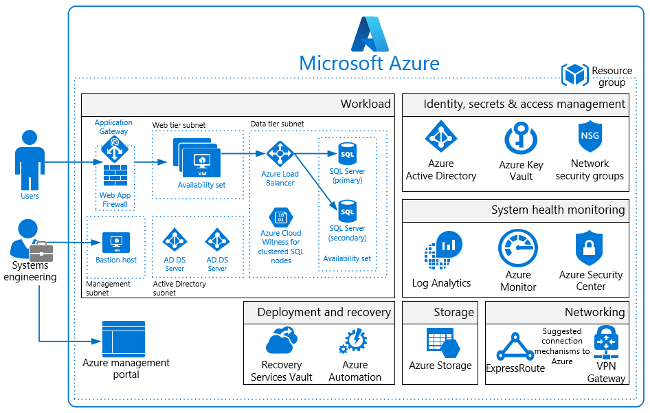
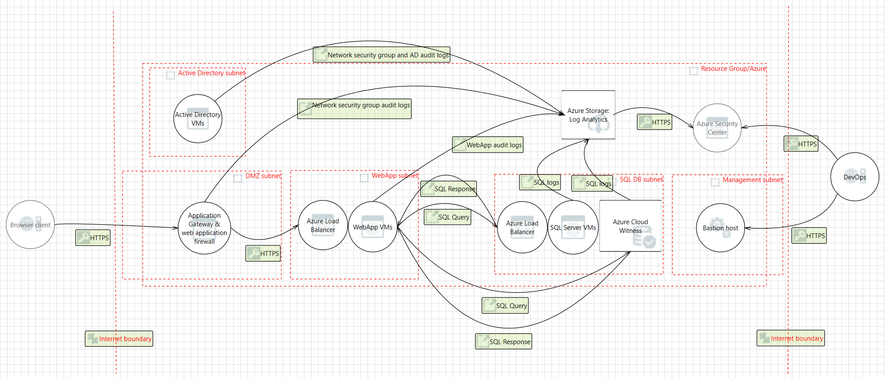

# Azure Security and Compliance Blueprint - IaaS Web Application for NIST SP 800-171

## Overview
[NIST Special Publication 800-171](https://nvlpubs.nist.gov/nistpubs/SpecialPublications/NIST.SP.800-171.pdf) provides guidelines for protecting the controlled unclassified information (CUI) that resides in nonfederal information systems and organizations. NIST SP 800-171 establishes 14 families of security requirements for protecting the confidentiality of CUI.

This Azure Security and Compliance Blueprint provides guidance to help customers deploy a web application architecture in Azure that implements a subset of NIST SP 800-171 controls. This solution demonstrates ways in which customers can meet specific security and compliance requirements. It also serves as a foundation for customers to build and configure their own web applications in Azure.

This reference architecture, associated implementation guide, and threat model are intended to serve as a foundation for customers to adapt to their specific requirements. They shouldn't be used as-is in a production environment. Deploying this architecture without modification is insufficient to completely meet the requirements of NIST SP 800-171. Customers are responsible for conducting appropriate security and compliance assessments of any solution built using this architecture. Requirements might vary based on the specifics of each customer's implementation.

## Architecture diagram and components
This Azure Security and Compliance Blueprint deploys a reference architecture for an IaaS web application with a SQL Server back end. The architecture includes a web tier, data tier, Active Directory infrastructure, Azure Application Gateway, and Azure Load Balancer. Virtual machines (VMs) deployed to the web and data tiers are configured in an availability set. SQL Server instances are configured in an Always On availability group for high availability. VMs are domain joined. Active Directory group policies enforce security and compliance configurations at the operating system level.

The entire solution is built upon Azure Storage, which customers configure from the Azure portal. Storage encrypts all data with Storage Service Encryption to maintain confidentiality of data at rest. Geo-redundant storage ensures that an adverse event at the customer's primary data center doesn't result in a loss of data. A second copy is stored in a separate location hundreds of miles away.

For enhanced security, all resources in this solution are managed as a resource group through Azure Resource Manager. Azure Active Directory (Azure AD) role-based access control (RBAC) is used to control access to deployed resources and keys in Azure Key Vault. System health is monitored through Azure Monitor. Customers configure both monitoring services to capture logs. System health is displayed in a single dashboard that's easy to use.

A management bastion host provides a secure connection for administrators to access deployed resources. *Microsoft recommends that you configure a VPN or Azure ExpressRoute connection for management and data import into the reference architecture subnet.*

This solution uses the following Azure services. For more information, see the [deployment architecture](#deployment-architecture) section.

- Azure Virtual Machines
	- (1) Management/bastion (Windows Server 2016 Datacenter)
	- (2) Active Directory domain controller (Windows Server 2016 Datacenter)
	- (2) SQL Server cluster node (SQL Server 2017 on Windows Server 2016)
	- (2) Web/IIS (Windows Server 2016 Datacenter)
- Azure Virtual Network
	- (1) /16 network
	- (5) /24 networks
	- (5) Network security groups
- Availability sets
	- (1) Active Directory domain controllers
	- (1) SQL cluster nodes
	- (1) Web/IIS
- Azure Application Gateway
	- (1) Web application firewall
		- Firewall mode: prevention
		- Rule set: OWASP 3.0
		- Listener port: 443
- Azure Active Directory
- Azure Key Vault
- Azure Load Balancer
- Azure Monitor
- Azure Resource Manager
- Azure Security Center
- Azure Storage
- Azure Log Analytics
- Azure Automation
- Cloud Witness
- Recovery Services vault

## Deployment architecture
The following section details the deployment and implementation elements.

**Bastion host**: The bastion host is the single point of entry that users can use to access the deployed resources in this environment. The bastion host provides a secure connection to deployed resources by allowing only remote traffic from public IP addresses on a safe list. To permit remote desktop traffic, the source of the traffic must be defined in the network security group (NSG).

This solution creates a VM as a domain-joined bastion host with the following configurations:
-	[Antimalware extension](https://docs.microsoft.com/azure/security/azure-security-antimalware).
-	[Azure Diagnostics extension](https://docs.microsoft.com/azure/virtual-machines/virtual-machines-windows-extensions-diagnostics-template).
-	[Azure Disk Encryption](https://docs.microsoft.com/azure/security/azure-security-disk-encryption) using Key Vault.
-	An [auto-shutdown policy](https://azure.microsoft.com/blog/announcing-auto-shutdown-for-vms-using-azure-resource-manager/) to reduce consumption of VM resources when not in use.
-	[Windows Defender Credential Guard](https://docs.microsoft.com/windows/access-protection/credential-guard/credential-guard) is enabled so that credentials and other secrets run in a protected environment that's isolated from the running operating system.

### Virtual network
The architecture defines a private virtual network with an address space of 10.200.0.0/16.

**Network security groups**: This solution deploys resources in an architecture with separate subnets for web, database, Active Directory, and management inside a virtual network. Subnets are logically separated by NSG rules applied to the individual subnets. The rules restrict traffic between subnets to only that necessary for system and management functionality.

See the configuration for [NSGs](https://github.com/Azure/fedramp-iaas-webapp/blob/master/nestedtemplates/virtualNetworkNSG.json) deployed with this solution. Organizations can configure NSGs by editing the previous file by using [this documentation](https://docs.microsoft.com/azure/virtual-network/virtual-networks-nsg) as a guide.

Each of the subnets has a dedicated NSG:
- One NSG for Application Gateway (LBNSG)
- One NSG for bastion host (MGTNSG)
- One NSG for primary and backup domain controllers (ADNSG)
- One NSG for SQL Servers and Cloud Witness (SQLNSG)
- One NSG for web tier (WEBNSG)

### Data in transit
Azure encrypts all communications to and from Azure data centers by default. Additionally, all transactions to Storage through the Azure portal occur via HTTPS.

### Data at rest
The architecture protects data at rest through multiple measures. These measures include encryption and database auditing.

**Azure Storage**: To meet requirements for encrypted data at rest, all [Storage](https://azure.microsoft.com/services/storage/) uses [Storage Service Encryption](https://docs.microsoft.com/azure/storage/storage-service-encryption). This feature helps protect and safeguard data in support of organizational security commitments and compliance requirements defined by the NIST SP 800-171.

**Azure Disk Encryption**: Disk Encryption is used to encrypted Windows IaaS VM disks. [Disk Encryption](https://docs.microsoft.com/azure/security/azure-security-disk-encryption) uses the BitLocker feature of Windows to provide volume encryption for operating system and data disks. The solution is integrated with Key Vault to help control and manage the disk-encryption keys.

**SQL Server**: The SQL Server instance uses the following database security measures:
-	[SQL Server auditing](https://docs.microsoft.com/sql/relational-databases/security/auditing/sql-server-audit-database-engine?view=sql-server-2017) tracks database events and writes them to audit logs.
-	[Transparent data encryption](https://docs.microsoft.com/sql/relational-databases/security/encryption/transparent-data-encryption?view=sql-server-2017) performs real-time encryption and decryption of the database, associated backups, and transaction log files to protect information at rest. Transparent data encryption provides assurance that stored data hasn't been subject to unauthorized access.
-	[Firewall rules](https://docs.microsoft.com/azure/sql-database/sql-database-firewall-configure) prevent all access to database servers until proper permissions are granted. The firewall grants access to databases based on the originating IP address of each request.
-	[Encrypted columns](https://docs.microsoft.com/sql/relational-databases/security/encryption/always-encrypted-wizard?view=sql-server-2017) ensure that sensitive data never appears as plain text inside the database system. After data encryption is enabled, only client applications or application servers with access to the keys can access plain-text data.
- [Dynamic data masking](https://docs.microsoft.com/sql/relational-databases/security/dynamic-data-masking?view=sql-server-2017) limits sensitive data exposure by masking the data to nonprivileged users or applications. It can automatically discover potentially sensitive data and suggest the appropriate masks to be applied. Dynamic data masking helps to reduce access so that sensitive data doesn't exit the database via unauthorized access. *Customers are responsible for adjusting settings to adhere to their database schema.*

### Identity management
The following technologies provide capabilities to manage access to data in the Azure environment:
-	[Azure AD](https://azure.microsoft.com/services/active-directory/) is Microsoft's multitenant cloud-based directory and identity management service. All users for this solution are created in Azure AD and include the users who access the SQL Server instance.
-	Authentication to the application is performed by using Azure AD. For more information, see how to [integrate applications with Azure AD](https://docs.microsoft.com/azure/active-directory/develop/active-directory-integrating-applications).
-	[Azure RBAC](https://docs.microsoft.com/azure/active-directory/role-based-access-control-configure) can be used by administrators to define fine-grained access permissions to grant only the amount of access that users need to perform their jobs. Instead of giving every user unrestricted permissions for Azure resources, administrators can allow only certain actions for accessing data. Subscription access is limited to the subscription administrator.
- [Azure Active Directory Privileged Identity Management](https://docs.microsoft.com/azure/active-directory/active-directory-privileged-identity-management-getting-started) can be used by customers to minimize the number of users who have access to certain resources. Administrators can use Azure AD Privileged Identity Management to discover, restrict, and monitor privileged identities and their access to resources. This functionality also can be used to enforce on-demand, just-in-time administrative access when needed.
- [Azure Active Directory Identity Protection](https://docs.microsoft.com/azure/active-directory/active-directory-identityprotection) detects potential vulnerabilities that affect an organization’s identities. It configures automated responses to detected suspicious actions related to an organization’s identities. It also investigates suspicious incidents to take appropriate action to resolve them.

### Security
**Secrets management**:
The solution uses [Key Vault](https://azure.microsoft.com/services/key-vault/) for the management of keys and secrets. Key Vault helps safeguard cryptographic keys and secrets used by cloud applications and services. The following Key Vault capabilities help customers protect data:
- Advanced access policies are configured on a need basis.
- Key Vault access policies are defined with minimum required permissions to keys and secrets.
- All keys and secrets in Key Vault have expiration dates.
- All keys in Key Vault are protected by specialized hardware security modules. The key type is a hardware security-module-protected 2048-bit RSA key.
- All users and identities are granted minimum required permissions by using RBAC.
- Diagnostics logs for Key Vault are enabled with a retention period of at least 365 days.
- Permitted cryptographic operations for keys are restricted to the ones required.
- The solution is integrated with Key Vault to manage IaaS VM disk-encryption keys and secrets.

**Patch management**: Windows VMs deployed as part of this reference architecture are configured by default to receive automatic updates from Windows Update Service. This solution also includes the [Azure Automation](https://docs.microsoft.com/azure/automation/automation-intro) service through which updated deployments can be created to patch VMs when needed.

**Malware protection**: [Microsoft Antimalware](https://docs.microsoft.com/azure/security/azure-security-antimalware) for VMs provides real-time protection capability that helps identify and remove viruses, spyware, and other malicious software. Customers can configure alerts that generate when known malicious or unwanted software attempts to install or run on protected VMs.

**Azure Security Center**: With [Security Center](https://docs.microsoft.com/azure/security-center/security-center-intro), customers can centrally apply and manage security policies across workloads, limit exposure to threats, and detect and respond to attacks. Security Center also accesses existing configurations of Azure services to provide configuration and service recommendations to help improve security posture and protect data.

Security Center uses a variety of detection capabilities to alert customers of potential attacks that target their environments. These alerts contain valuable information about what triggered the alert, the resources targeted, and the source of the attack. Security Center has a set of [predefined security alerts](https://docs.microsoft.com/azure/security-center/security-center-alerts-type) that are triggered when a threat, or suspicious activity takes place. Customers can use [custom alert rules](https://docs.microsoft.com/azure/security-center/security-center-custom-alert) to define new security alerts based on data that's already collected from their environment.

Security Center provides prioritized security alerts and incidents. Security Center makes it simpler for customers to discover and address potential security issues. A [threat intelligence report](https://docs.microsoft.com/azure/security-center/security-center-threat-report) is generated for each detected threat. Incident response teams can use the reports when they investigate and remediate threats.

This reference architecture uses the [vulnerability assessment](https://docs.microsoft.com/azure/security-center/security-center-vulnerability-assessment-recommendations) capability in Security Center. After it's configured, a partner agent (for example, Qualys) reports vulnerability data to the partner’s management platform. In turn, the partner's management platform provides vulnerability and health monitoring data back to Security Center. Customers can use this information to quickly identify vulnerable VMs.

**Azure Application Gateway**:
The architecture reduces the risk of security vulnerabilities by using an application gateway with a web application firewall configured and the OWASP rule set enabled. Additional capabilities include:

- [End-to-end-SSL](https://docs.microsoft.com/azure/application-gateway/application-gateway-end-to-end-ssl-powershell).
- Enable [SSL offload](https://docs.microsoft.com/azure/application-gateway/application-gateway-ssl-portal).
- Disable [TLS v1.0 and v1.1](https://docs.microsoft.com/azure/application-gateway/application-gateway-end-to-end-ssl-powershell).
- [Web application firewall](https://docs.microsoft.com/azure/application-gateway/application-gateway-web-application-firewall-overview) (prevention mode).
- [Prevention mode](https://docs.microsoft.com/azure/application-gateway/application-gateway-web-application-firewall-portal) with OWASP 3.0 rule set.
- Enable [diagnostics logging](https://docs.microsoft.com/azure/application-gateway/application-gateway-diagnostics).
- [Custom health probes](https://docs.microsoft.com/azure/application-gateway/application-gateway-create-gateway-portal).
- [Security Center](https://azure.microsoft.com/services/security-center) and [Azure Advisor](https://docs.microsoft.com/azure/advisor/advisor-security-recommendations) provide additional protection and notifications. Security Center also provides a reputation system.

### Business continuity

**High availability**: The solution deploys all VMs in an [availability set](https://docs.microsoft.com/azure/virtual-machines/windows/tutorial-availability-sets). Availability sets ensure that the VMs are distributed across multiple isolated hardware clusters to improve availability. At least one VM is available during a planned or unplanned maintenance event, which meets the 99.95% Azure SLA.

**Recovery Services vault**: The [Recovery Services Vault](https://docs.microsoft.com/azure/backup/backup-azure-recovery-services-vault-overview) houses backup data and protects all configurations of Azure Virtual Machines in this architecture. With a Recovery Services vault, customers can restore files and folders from an IaaS VM without restoring the entire VM. This process speeds up restore times.

**Cloud Witness**: [Cloud Witness](https://docs.microsoft.com/windows-server/failover-clustering/whats-new-in-failover-clustering#BKMK_CloudWitness) is a type of failover cluster quorum witness in Windows Server 2016 that uses Azure as the arbitration point. Cloud Witness, like any other quorum witness, gets a vote and can participate in the quorum calculations. It uses the standard publicly available Azure Blob storage. This arrangement eliminates the extra maintenance overhead of VMs hosted in a public cloud.

### Logging and auditing

Azure services extensively log system and user activity, as well as system health:
- **Activity logs**: [Activity logs](https://docs.microsoft.com/azure/monitoring-and-diagnostics/monitoring-overview-activity-logs) provide insight into operations performed on resources in a subscription. Activity logs can help determine an operation's initiator, time of occurrence, and status.
- **Diagnostic logs**: [Diagnostic logs](https://docs.microsoft.com/azure/monitoring-and-diagnostics/monitoring-overview-of-diagnostic-logs) include all logs emitted by every resource. These logs include Windows event system logs, Storage logs, Key Vault audit logs, and Application Gateway access and firewall logs. All diagnostic logs write to a centralized and encrypted Azure storage account for archival. Users can configure the retention period, up to 730 days, to meet their specific requirements.

**Log Analytics**: These logs are consolidated in [Log Analytics](https://azure.microsoft.com/services/log-analytics/) for processing, storing, and dashboard reporting. After data is collected, it's organized into separate tables for each data type within Operations Management Suite workspaces. In this way, all data can be analyzed together, regardless of its original source. Security Center integrates with Log Analytics. Customers can use Log Analytics queries to access their security event data and combine it with data from other services.

The following Log Analytics [management solutions](https://docs.microsoft.com/azure/log-analytics/log-analytics-add-solutions) are included as a part of this architecture:
-	[Active Directory assessment](https://docs.microsoft.com/azure/log-analytics/log-analytics-ad-assessment): The Active Directory Health Check solution assesses the risk and health of server environments on a regular interval. It provides a prioritized list of recommendations specific to the deployed server infrastructure.
- [SQL assessment](https://docs.microsoft.com/azure/log-analytics/log-analytics-sql-assessment): The SQL Health Check solution assesses the risk and health of server environments on a regular interval. It provides customers with a prioritized list of recommendations specific to the deployed server infrastructure.
- [Agent Health](https://docs.microsoft.com/azure/operations-management-suite/oms-solution-agenthealth): The Agent Health solution reports how many agents are deployed and their geographic distribution. It also reports how many agents are unresponsive and the number of agents that submit operational data.
-	[Activity Log Analytics](https://docs.microsoft.com/azure/log-analytics/log-analytics-activity): The Activity Log Analytics solution assists with analysis of the Azure activity logs across all Azure subscriptions for a customer.

**Azure Automation**: [Automation](https://docs.microsoft.com/azure/automation/automation-hybrid-runbook-worker) stores, runs, and manages runbooks. In this solution, runbooks help collect logs from SQL Server. Customers can use the Automation [Change Tracking](https://docs.microsoft.com/azure/automation/automation-change-tracking) solution to easily identify changes in the environment.

**Azure Monitor**:
[Monitor](https://docs.microsoft.com/azure/monitoring-and-diagnostics/) helps users track performance, maintain security, and identify trends. Organizations can use it to audit, create alerts, and archive data. They also can track API calls in their Azure resources.

## Threat model

The data flow diagram for this reference architecture is available for [download](https://aka.ms/nist171-iaaswa-tm) or can be found here. This model can help customers understand the points of potential risk in the system infrastructure when they make modifications.

## Compliance documentation

The [Azure Security and Compliance Blueprint - NIST SP 800-171 Customer Responsibility Matrix](https://aka.ms/nist171-crm) lists all security controls required by NIST SP 800-171. This matrix details whether the implementation of each control is the responsibility of Microsoft, the customer, or shared between the two.

The [Azure Security and Compliance Blueprint - NIST SP 800-171 IaaS Web Application Control Implementation Matrix](https://aka.ms/nist171-iaaswa-cim) provides information on which NIST SP 800-171 controls are addressed by the IaaS web application architecture. It includes detailed descriptions of how the implementation meets the requirements of each covered control.

## Guidance and recommendations
### VPN and ExpressRoute
A secure VPN tunnel or [ExpressRoute](https://docs.microsoft.com/azure/expressroute/expressroute-introduction) must be configured to securely establish a connection to the resources deployed as a part of this IaaS web application reference architecture. By appropriately setting up a VPN or ExpressRoute, customers can add a layer of protection for data in transit.

By implementing a secure VPN tunnel with Azure, a virtual private connection between an on-premises network and an Azure Virtual Network can be created. This connection takes place over the Internet. Customers can use this connection to securely “tunnel” information inside an encrypted link between the customer's network and Azure. Site-to-site VPN is a secure, mature technology that has been deployed by enterprises of all sizes for decades. The [IPsec tunnel mode](https://docs.microsoft.com/previous-versions/windows/it-pro/windows-server-2003/cc786385(v=ws.10)) is used in this option as an encryption mechanism.

Because traffic within the VPN tunnel traverses the Internet with a site-to-site VPN, Microsoft offers another even more secure connection option. ExpressRoute is a dedicated WAN link between Azure and an on-premises location or an Exchange hosting provider. ExpressRoute connections connect directly to the customer's telecommunication provider. As a result, the data doesn't travel over the Internet and isn't exposed to it. These connections offer more reliability, faster speeds, lower latencies, and higher security than typical connections. 

Best practices for implementing a secure hybrid network that extends an on-premises network to Azure are [available](https://docs.microsoft.com/azure/architecture/reference-architectures/dmz/secure-vnet-hybrid).

## Disclaimer

- This document is for informational purposes only. MICROSOFT MAKES NO WARRANTIES, EXPRESS, IMPLIED, OR STATUTORY, AS TO THE INFORMATION IN THIS DOCUMENT. This document is provided "as-is." Information and views expressed in this document, including URL and other Internet website references, may change without notice. Customers reading this document bear the risk of using it. 
- This document does not provide customers with any legal rights to any intellectual property in any Microsoft product or solutions. 
- Customers may copy and use this document for internal reference purposes. 
- Certain recommendations in this document may result in increased data, network, or compute resource usage in Azure, and may increase a customer's Azure license or subscription costs. 
- This architecture is intended to serve as a foundation for customers to adjust to their specific requirements and should not be used as-is in a production environment.
- This document is developed as a reference and should not be used to define all means by which a customer can meet specific compliance requirements and regulations. Customers should seek legal support from their organization on approved customer implementations.
