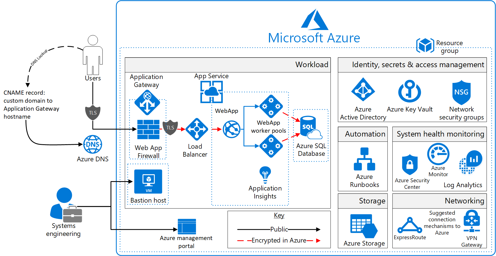

# Azure Security and Compliance Blueprint - PaaS Web Application for NIST Special Publication 800-171

## Overview
[NIST Special Publication 800-171](https://nvlpubs.nist.gov/nistpubs/SpecialPublications/NIST.SP.800-171.pdf) provides guidelines for protecting the controlled unclassified information (CUI) that resides in nonfederal information systems and organizations. NIST SP 800-171 establishes 14 families of security requirements for protecting the confidentiality of CUI.

This Azure Security and Compliance Blueprint provides guidance to help customers deploy a platform as a service (PaaS) web application in Azure that implements a subset of NIST SP 800-171 controls. This solution demonstrates ways in which customers can meet specific security and compliance requirements. It also serves as a foundation for customers to build and configure their own web application in Azure.

This reference architecture, associated implementation guide, and threat model are intended to serve as a foundation for customers to adapt to their specific requirements. They shouldn't be used as-is in a production environment. Deploying this architecture without modification is insufficient to completely meet the requirements of NIST SP 800-171. Customers are responsible for conducting appropriate security and compliance assessments of any solution built using this architecture. Requirements might vary based on the specifics of each customer's implementation.

## Architecture diagram and components

This Azure Security and Compliance Blueprint provides a reference architecture for a PaaS web application with an Azure SQL Database back end. The web application is hosted in an isolated App Service environment, which is a private, dedicated environment in an Azure data center. The environment load balances traffic for the web application across virtual machines (VMs) managed by Azure. This architecture also includes network security groups (NSGs), an Azure application gateway, Azure DNS, and Azure Load Balancer.

For enhanced analytics and reporting, Azure SQL databases can be configured with columnstore indexes. Azure SQL databases can be scaled up or down or shut off completely in response to customer usage. All SQL traffic is encrypted with SSL through the inclusion of self-signed certificates. As a best practice, Azure recommends the use of a trusted certificate authority for enhanced security.

The solution uses Azure Storage accounts, which customers can configure to use Storage Service Encryption to maintain confidentiality of data at rest. Azure stores three copies of data within a customer's selected data center for resiliency. Geo-redundant storage ensures that data is replicated to a secondary data center hundreds of miles away and stored again as three copies within that data center. This arrangement prevents an adverse event at the customer's primary data center from resulting in a loss of data.

For enhanced security, all resources in this solution are managed as a resource group through Azure Resource Manager. Azure Active Directory (Azure AD) role-based access control (RBAC) is used to control access to deployed resources. These resources include customer keys in Azure Key Vault. System health is monitored through Azure Monitor. Customers configure this monitoring service to capture logs. System health is displayed in a single dashboard that's easy to use.

SQL Database is commonly managed through SQL Server Management Studio. It runs from a local machine that's configured to access the SQL database via a secure VPN or Azure ExpressRoute connection.

Application Insights provides real-time application performance management and analytics through Azure Log Analytics. *Microsoft recommends that you configure a VPN or ExpressRoute connection for management and data import into the reference architecture subnet.*

This solution uses the following Azure services. For more information, see the [deployment architecture](#deployment-architecture) section.

- Azure Virtual Machines
	- (1) Management/bastion (Windows Server 2016 Datacenter)
- Azure Virtual Network
	- (1) /16 network
	- (4) /24 networks
	- (4) Network security groups
- Azure Application Gateway
	- Web application firewall
		- Firewall mode: prevention
		- Rule set: OWASP
		- Listener port: 443
- Application Insights
- Azure Active Directory
- App Service Environment v2
- Azure Automation
- Azure DNS
- Azure Key Vault
- Azure Load Balancer
- Azure Monitor
- Azure Resource Manager
- Azure Security Center
- Azure SQL Database
- Azure Storage
- Azure Log Analytics
- Azure Automation
- Azure Web Apps

## Deployment architecture
The following section details the deployment and implementation elements.

**Azure Resource Manager**:
[Resource Manager](https://docs.microsoft.com/azure/azure-resource-manager/resource-group-overview) can be used by customers to work with the resources in the solution as a group. Customers can deploy, update, or delete all the resources for the solution in a single, coordinated operation. Customers use a template for deployment. The template can work for different environments, such as testing, staging, and production. Resource Manager provides security, auditing, and tagging features to help customers manage their resources after deployment.

**Bastion host**: The bastion host is the single point of entry that users can use to access the deployed resources in this environment. The bastion host provides a secure connection to deployed resources by allowing only remote traffic from public IP addresses on a safe list. To permit remote desktop traffic, the source of the traffic must be defined in the NSG.

This solution creates a VM as a domain-joined bastion host with the following configurations:
-	[Antimalware extension](https://docs.microsoft.com/azure/security/azure-security-antimalware).
-	[Azure Diagnostics extension](https://docs.microsoft.com/azure/virtual-machines/virtual-machines-windows-extensions-diagnostics-template).
-	[Azure Disk Encryption](https://docs.microsoft.com/azure/security/azure-security-disk-encryption) using Key Vault.
-	An [auto-shutdown policy](https://azure.microsoft.com/blog/announcing-auto-shutdown-for-vms-using-azure-resource-manager/) to reduce consumption of VM resources when not in use.
-	[Windows Defender Credential Guard](https://docs.microsoft.com/windows/access-protection/credential-guard/credential-guard) is enabled so that credentials and other secrets run in a protected environment that is isolated from the running operating system.

**Web Apps**:
[Web Apps](https://docs.microsoft.com/azure/app-service/) is an Azure App Service feature. Customers can use it to build and host web applications in the programming language of their choice without managing infrastructure. It offers auto-scaling and high availability. It supports Windows and Linux and enables automated deployments from GitHub, Azure DevOps, or any Git repo.

**App Service Environment**:
[App Service Environment](https://docs.microsoft.com/azure/app-service/environment/intro) is an App Service feature. It provides a fully isolated and dedicated environment for securely running App Service applications at a high scale.

The App Service environment is isolated to run only a single application. It's always deployed into a virtual network. Because of the isolation feature, the reference architecture has complete tenant isolation, and it's removed from Azure’s multitenant environment. Customers have fine-grained control over both inbound and outbound application network traffic. Applications can establish high-speed secure connections over virtual networks to on-premises corporate resources. Customers can “auto-scale” with App Service Environment based on load metrics, available budget, or a defined schedule.

Use of App Service Environment for this architecture provides the following controls and configurations:

- Host inside a secured Azure virtual network and network security rules.
- Self-signed internal load balancer certificate for HTTPS communication. As a best practice, Microsoft recommends the use of a trusted certificate authority for enhanced security.
- [Internal load balancing mode](https://docs.microsoft.com/azure/app-service-web/app-service-environment-with-internal-load-balancer) (mode 3).
- Disable [TLS 1.0](https://docs.microsoft.com/azure/app-service-web/app-service-app-service-environment-custom-settings).
- Change [TLS cipher](https://docs.microsoft.com/azure/app-service-web/app-service-app-service-environment-custom-settings).
- Control [inbound traffic N/W ports](https://docs.microsoft.com/azure/app-service-web/app-service-app-service-environment-control-inbound-traffic).
- [Web application firewall – restrict data](https://docs.microsoft.com/azure/app-service-web/app-service-app-service-environment-web-application-firewall).
- Allow [Azure SQL Database traffic](https://docs.microsoft.com/azure/app-service-web/app-service-app-service-environment-network-architecture-overview).

### Virtual network
The architecture defines a private virtual network with an address space of 10.200.0.0/16.

**Network security groups**: [NSGs](https://docs.microsoft.com/azure/virtual-network/virtual-networks-nsg) contain access control lists that allow or deny traffic within a virtual network. NSGs can be used to secure traffic at a subnet or individual VM level. The following NSGs exist:
- One NSG for Application Gateway
- One NSG for App Service Environment
- One NSG for SQL Database
- One NSG for bastion host

Each of the NSGs has specific ports and protocols open so that the solution can work securely and correctly. In addition, the following configurations are enabled for each NSG:
  -	[Diagnostic logs and events](https://docs.microsoft.com/azure/virtual-network/virtual-network-nsg-manage-log) are enabled and stored in a storage account.
  -	Log Analytics is connected to the [NSG's diagnostics](https://github.com/krnese/AzureDeploy/blob/master/AzureMgmt/AzureMonitor/nsgWithDiagnostics.json).

**Subnets**: Each subnet is associated with its corresponding NSG.

**Azure DNS**:
The Domain Name System (DNS) is responsible for translating (or resolving) a website or service name to its IP address. [Azure DNS](https://docs.microsoft.com/azure/dns/dns-overview) is a hosting service for DNS domains that provides name resolution by using Azure infrastructure. By hosting domains in Azure, users can manage DNS records by using the same credentials, APIs, tools, and billing as other Azure services. Azure DNS also supports private DNS domains.

**Azure Load Balancer**:
[Load Balancer](https://docs.microsoft.com/azure/load-balancer/load-balancer-overview) can be used by customers to scale their applications and create high availability for services. Load Balancer supports inbound and outbound scenarios. It provides low latency and high throughput and scales up to millions of flows for all TCP and UDP applications.

### Data in transit
Azure encrypts all communications to and from Azure data centers by default. All transactions to Azure Storage through the Azure portal occur via HTTPS.

### Data at rest

The architecture protects data at rest through encryption, database auditing, and other measures.

**Azure Storage**:
To meet requirements for encrypted data at rest, all [Storage](https://azure.microsoft.com/services/storage/) uses [Storage Service Encryption](https://docs.microsoft.com/azure/storage/storage-service-encryption). This feature helps protect and safeguard data in support of organizational security commitments and compliance requirements defined by NIST SP 800-171.

**Azure Disk Encryption**:
[Disk Encryption](https://docs.microsoft.com/azure/security/azure-security-disk-encryption) uses the BitLocker feature of Windows to provide volume encryption for data disks. The solution integrates with Key Vault to help control and manage the disk-encryption keys.

**Azure SQL Database**:
The SQL Database instance uses the following database security measures:
-	[Active Directory authentication and authorization](https://docs.microsoft.com/azure/sql-database/sql-database-AAD-authentication) enables identity management of database users and other Microsoft services in one central location.
-	[SQL database auditing](https://docs.microsoft.com/azure/sql-database/sql-database-auditing-get-started) tracks database events and writes them to an audit log in an Azure storage account.
-	SQL Database is configured to use [transparent data encryption](https://docs.microsoft.com/sql/relational-databases/security/encryption/transparent-data-encryption-azure-sql). It performs real-time encryption and decryption of the database, associated backups, and transaction log files to protect information at rest. Transparent data encryption provides assurance that stored data hasn't been subject to unauthorized access.
-	[Firewall rules](https://docs.microsoft.com/azure/sql-database/sql-database-firewall-configure) prevent all access to database servers until proper permissions are granted. The firewall grants access to databases based on the originating IP address of each request.
-	[SQL Threat Detection](https://docs.microsoft.com/azure/sql-database/sql-database-threat-detection-get-started) enables the detection and response to potential threats as they occur. It provides security alerts for suspicious database activities, potential vulnerabilities, SQL injection attacks, and anomalous database access patterns.
-	[Encrypted columns](https://docs.microsoft.com/azure/sql-database/sql-database-always-encrypted-azure-key-vault) ensure that sensitive data never appears as plain text inside the database system. After data encryption is enabled, only client applications or application servers with access to the keys can access plain-text data.
- [Dynamic data masking](https://docs.microsoft.com/azure/sql-database/sql-database-dynamic-data-masking-get-started) limits sensitive data exposure by masking the data to nonprivileged users or applications. It can automatically discover potentially sensitive data and suggest the appropriate masks to be applied. Dynamic data masking helps to reduce access so that sensitive data doesn't exit the database via unauthorized access. *Customers are responsible for adjusting settings to adhere to their database schema.*

### Identity management
The following technologies provide capabilities to manage access to data in the Azure environment:
-	[Azure AD](https://azure.microsoft.com/services/active-directory/) is Microsoft's multitenant cloud-based directory and identity management service. All users for this solution are created in Azure AD and include users who access the SQL database.
-	Authentication to the application is performed by using Azure AD. For more information, see how to [integrate applications with Azure AD](https://docs.microsoft.com/azure/active-directory/develop/active-directory-integrating-applications). The database column encryption also uses Azure AD to authenticate the application to SQL Database. For more information, see how to [protect sensitive data in SQL Database](https://docs.microsoft.com/azure/sql-database/sql-database-always-encrypted-azure-key-vault).
-	[Azure RBAC](https://docs.microsoft.com/azure/active-directory/role-based-access-control-configure) can be used by administrators to define fine-grained access permissions. With it, they can grant only the amount of access that users need to perform their jobs. Instead of giving every user unrestricted access for Azure resources, administrators can allow only certain actions for accessing resources and data. Subscription access is limited to the subscription administrator.
- [Azure Active Directory Privileged Identity Management](https://docs.microsoft.com/azure/active-directory/active-directory-privileged-identity-management-getting-started) can be used by customers to minimize the number of users who have access to certain information. Administrators can use Azure AD Privileged Identity Management to discover, restrict, and monitor privileged identities and their access to resources. This functionality also can be used to enforce on-demand, just-in-time administrative access when needed.
- [Azure Active Directory Identity Protection](https://docs.microsoft.com/azure/active-directory/active-directory-identityprotection) detects potential vulnerabilities that affect an organization’s identities. It configures automated responses to detected suspicious actions related to an organization’s identities. It also investigates suspicious incidents to take appropriate action to resolve them.

### Security
**Secrets management**:
The solution uses [Key Vault](https://azure.microsoft.com/services/key-vault/) for the management of keys and secrets. Key Vault helps safeguard cryptographic keys and secrets used by cloud applications and services. The following Key Vault capabilities help customers protect data:
- Advanced access policies are configured on a need basis.
- Key Vault access policies are defined with minimum required permissions to keys and secrets.
- All keys and secrets in Key Vault have expiration dates.
- All keys in Key Vault are protected by specialized hardware security modules. The key type is a hardware security-module-protected 2048-bit RSA key.
- All users and identities are granted minimum required permissions by using RBAC.
- Diagnostics logs for Key Vault are enabled with a retention period of at least 365 days.
- Permitted cryptographic operations for keys are restricted to the ones required.

**Azure Security Center**: With [Security Center](https://docs.microsoft.com/azure/security-center/security-center-intro), customers can centrally apply and manage security policies across workloads, limit exposure to threats, and detect and respond to attacks. Security Center also accesses existing configurations of Azure services to provide configuration and service recommendations to help improve security posture and protect data.

Security Center uses a variety of detection capabilities to alert customers of potential attacks that target their environments. These alerts contain valuable information about what triggered the alert, the resources targeted, and the source of the attack. Security Center has a set of [predefined security alerts](https://docs.microsoft.com/azure/security-center/security-center-alerts-type) that are triggered when a threat or suspicious activity takes place. Customers can use [custom alert rules](https://docs.microsoft.com/azure/security-center/security-center-custom-alert) to define new security alerts based on data that's already collected from their environment.

Security Center provides prioritized security alerts and incidents. Security Center makes it simpler for customers to discover and address potential security issues. A [threat intelligence report](https://docs.microsoft.com/azure/security-center/security-center-threat-report) is generated for each detected threat. Incident response teams can use the reports when they investigate and remediate threats.

**Azure Application Gateway**:
The architecture reduces the risk of security vulnerabilities by using an application gateway with a web application firewall configured and the OWASP rule set enabled. Additional capabilities include:

- [End-to-end-SSL](https://docs.microsoft.com/azure/application-gateway/application-gateway-end-to-end-ssl-powershell).
- Enable [SSL offload](https://docs.microsoft.com/azure/application-gateway/application-gateway-ssl-portal).
- Disable [TLS v1.0 and v1.1](https://docs.microsoft.com/azure/application-gateway/application-gateway-end-to-end-ssl-powershell).
- [Web application firewall](https://docs.microsoft.com/azure/application-gateway/application-gateway-web-application-firewall-overview) (prevention mode).
- [Prevention mode](https://docs.microsoft.com/azure/application-gateway/application-gateway-web-application-firewall-portal) with OWASP 3.0 rule set.
- Enable [diagnostics logging](https://docs.microsoft.com/azure/application-gateway/application-gateway-diagnostics).
- [Custom health probes](https://docs.microsoft.com/azure/application-gateway/application-gateway-create-gateway-portal).
- [Security Center](https://azure.microsoft.com/services/security-center) and [Azure Advisor](https://docs.microsoft.com/azure/advisor/advisor-security-recommendations) provide additional protection and notifications. Security Center also provides a reputation system.

### Logging and auditing

Azure services extensively log system and user activity, as well as system health:
- **Activity logs**: [Activity logs](https://docs.microsoft.com/azure/monitoring-and-diagnostics/monitoring-overview-activity-logs) provide insight into operations performed on resources in a subscription. Activity logs can help determine an operation's initiator, time of occurrence, and status.
- **Diagnostic logs**: [Diagnostic logs](https://docs.microsoft.com/azure/monitoring-and-diagnostics/monitoring-overview-of-diagnostic-logs) include all logs emitted by every resource. These logs include Windows event system logs, Storage logs, Key Vault audit logs, and Application Gateway access and firewall logs. All diagnostic logs write to a centralized and encrypted Azure storage account for archival. Users can configure the retention period, up to 730 days, to meet their specific requirements.

**Azure Log Analytics**: Logs are consolidated in [Log Analytics](https://azure.microsoft.com/services/log-analytics/) for processing, storing, and dashboard reporting. After the data is collected, it's organized into separate tables for each data type within Operations Management Suite workspaces. In this way, all data can be analyzed together, regardless of its original source. Security Center integrates with Log Analytics. Customers can use Log Analytics queries to access their security event data and combine it with data from other services.

The following Log Analytics [management solutions](https://docs.microsoft.com/azure/log-analytics/log-analytics-add-solutions) are included as a part of this architecture:
-	[Active Directory assessment](https://docs.microsoft.com/azure/log-analytics/log-analytics-ad-assessment): The Active Directory Health Check solution assesses the risk and health of server environments on a regular interval. It provides a prioritized list of recommendations specific to the deployed server infrastructure.
- [SQL assessment](https://docs.microsoft.com/azure/log-analytics/log-analytics-sql-assessment): The SQL Health Check solution assesses the risk and health of server environments on a regular interval. It provides customers with a prioritized list of recommendations specific to the deployed server infrastructure.
- [Agent Health](https://docs.microsoft.com/azure/operations-management-suite/oms-solution-agenthealth): The Agent Health solution reports how many agents are deployed and their geographic distribution. It also reports how many agents are unresponsive and the number of agents that submit operational data.
-	[Activity Log Analytics](https://docs.microsoft.com/azure/log-analytics/log-analytics-activity): The Activity Log Analytics solution assists with analysis of the Azure activity logs across all Azure subscriptions for a customer.

**Azure Automation**: [Automation](https://docs.microsoft.com/azure/automation/automation-hybrid-runbook-worker) stores, runs, and manages runbooks. In this solution, runbooks help collect logs from SQL Database. Customers can use the Automation [Change Tracking](https://docs.microsoft.com/azure/automation/automation-change-tracking) solution to easily identify changes in the environment.

**Azure Monitor**:
[Monitor](https://docs.microsoft.com/azure/monitoring-and-diagnostics/) helps users track performance, maintain security, and identify trends. Organizations can use it to audit, create alerts, and archive data. They also can track API calls in their Azure resources.

**Application Insights**: [Application Insights](https://docs.microsoft.com/azure/application-insights/app-insights-overview) is an extensible application performance management service for web developers on multiple platforms. Application Insights detects performance anomalies. Customers can use it to monitor the live web application. Application Insights includes powerful analytics tools to help customers diagnose issues and understand what users do with their app. It&#39;s designed to help customers continuously improve performance and usability.

## Threat model

The data flow diagram for this reference architecture is available for [download](https://aka.ms/nist171-paaswa-tm) or can be found here. This model can help customers understand the points of potential risk in the system infrastructure when they make modifications.

## Compliance documentation
The [Azure Security and Compliance Blueprint - NIST SP 800-171 Customer Responsibility Matrix](https://aka.ms/nist171-crm) lists all security controls required by NIST SP 800-171. This matrix details whether the implementation of each control is the responsibility of Microsoft, the customer, or shared between the two.

The [Azure Security and Compliance Blueprint - NIST SP 800-171 PaaS Web Application Control Implementation Matrix](https://aka.ms/nist171-paaswa-cim) provides information on which NIST SP 800-171 controls are addressed by the PaaS web application architecture. It includes detailed descriptions of how the implementation meets the requirements of each covered control.

## Guidance and recommendations
### VPN and ExpressRoute
A secure VPN tunnel or [ExpressRoute](https://docs.microsoft.com/azure/expressroute/expressroute-introduction) must be configured to securely establish a connection to the resources deployed as a part of this PaaS web application reference architecture. By appropriately setting up a VPN or ExpressRoute, customers can add a layer of protection for data in transit.

By implementing a secure VPN tunnel with Azure, a virtual private connection between an on-premises network and an Azure virtual network can be created. This connection takes place over the Internet and allows customers to securely “tunnel” information inside an encrypted link between the customer's network and Azure. Site-to-site VPN is a secure, mature technology that has been deployed by enterprises of all sizes for decades. The [IPsec tunnel mode](https://docs.microsoft.com/previous-versions/windows/it-pro/windows-server-2003/cc786385(v=ws.10)) is used in this option as an encryption mechanism.

Because traffic within the VPN tunnel traverses the Internet with a site-to-site VPN, Microsoft offers another even more secure connection option. ExpressRoute is a dedicated WAN link between Azure and an on-premises location or an Exchange hosting provider. ExpressRoute connections connect directly to a customer's telecommunication provider. As a result, the data doesn't travel over the Internet and isn't exposed to it. These connections offer more reliability, faster speeds, lower latencies, and higher security than typical connections.

Best practices for implementing a secure hybrid network that extends an on-premises network to Azure are [available](https://docs.microsoft.com/azure/architecture/reference-architectures/dmz/secure-vnet-hybrid).

## Disclaimer

 - This document is for informational purposes only. MICROSOFT MAKES NO WARRANTIES, EXPRESS, IMPLIED, OR STATUTORY, AS TO THE INFORMATION IN THIS DOCUMENT. This document is provided "as-is." Information and views expressed in this document, including URL and other Internet website references, may change without notice. Customers reading this document bear the risk of using it.
 - This document does not provide customers with any legal rights to any intellectual property in any Microsoft product or solutions.
 - Customers may copy and use this document for internal reference purposes.
 - Certain recommendations in this document may result in increased data, network, or compute resource usage in Azure, and may increase a customer's Azure license or subscription costs.
 - This architecture is intended to serve as a foundation for customers to adjust to their specific requirements and should not be used as-is in a production environment.
 - This document is developed as a reference and should not be used to define all means by which a customer can meet specific compliance requirements and regulations. Customers should seek legal support from their organization on approved customer implementations.
