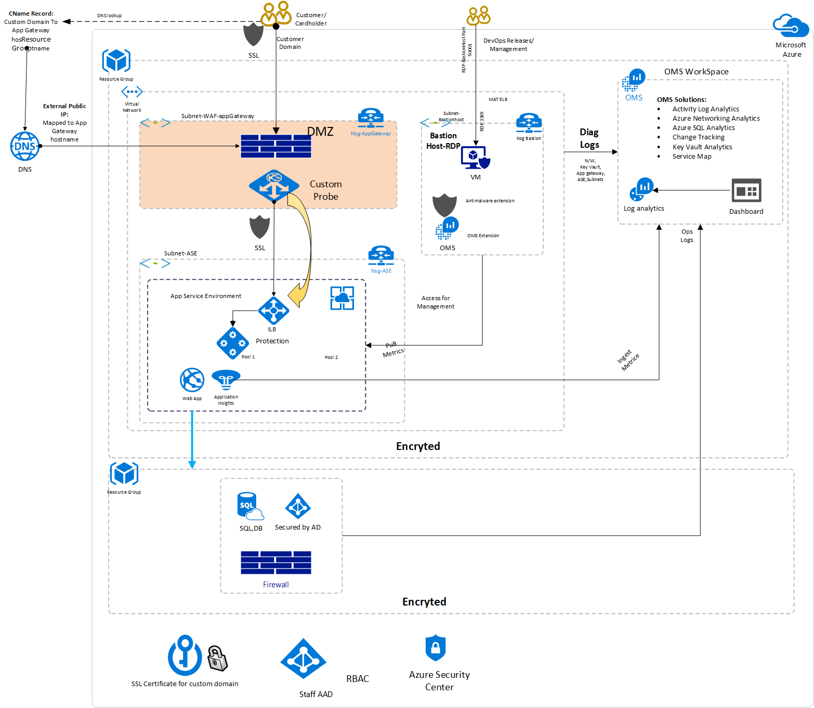

# Azure Security and Compliance Blueprint: PaaS Web Application for PCI DSS

This Azure Security and Compliance Blueprint Automation provides guidance for the deployment of a Payment Card Industry Data Security Standards (PCI DSS 3.2) compliant platform as a service (PaaS) environment suitable for the collection, storage, and retrieval of cardholder data. This solution automates deployment and configuration of Azure resources for a common reference architecture, demonstrating ways in which customers can meet specific security and compliance requirements and serves as a foundation for customers to build and configure their own solutions on Azure. The solution implements a subset of requirements from PCI DSS 3.2. For more information about PCI DSS 3.2 requirements and this solution, see the [compliance documentation](#compliance-documentation) section.

This Azure Security and Compliance Blueprint Automation automatically deploys a PaaS web application reference architecture with pre-configured security controls to help customers achieve compliance with PCI DSS 3.2 requirements. The solution consists of Azure Resource Manager templates and PowerShell scripts that guide resource deployment and configuration.

This architecture is intended to serve as a foundation for customers to adjust to their specific requirements and should not be used as-is in a production environment. Deploying an application into this environment without modification is not sufficient to completely meet the requirements of PCI DSS 3.2. Please note the following:

- This architecture provides a baseline to help customers use Azure in a PCI DSS 3.2 compliant manner.
- Customers are responsible for conducting appropriate security and compliance assessment of any solution built using this architecture, as requirements may vary based on the specifics of each customer's implementation.

Achieving PCI DSS-compliance requires that an accredited Qualified Security Assessor (QSA) certify a production customer solution. Customers are responsible for conducting appropriate security and compliance assessments of any solution built using this architecture, as requirements may vary based on the specifics of each customer's implementation.

In developing and deploying this app, you'll learn how to:

- Create an Azure Key Vault instance, store and retrieve secrets from it.
- Deploy the App service environment to configure the Frontend firewall.
- Run an Alpine Linux container on Azure Web Apps for Linux and enable managed identities for Azure resources.
- Create and configure an Azure Application Gateway instance with a firewall v2 that uses [OWASP Top 10 Ruleset](https://coreruleset.org/).
- Enable encryption of data in transit and at rest and in use by using Azure services.
- Enable 3 tier firewall for database and Web app
- Enable the Azure subscription, Resources policy
- Enable Azure Blueprint for PCI compliances

## Architecture diagram and components
This Azure Security and Compliance Blueprint Automation deploys a reference architecture for a PaaS web application with an Azure SQL Database backend. The web application is hosted in an isolated Azure App Service Environment, which is a private, dedicated environment in an Azure datacenter. The environment load balances traffic for the web application across virtual machines managed by Azure. This architecture also includes network security groups, an Application Gateway, Azure DNS, and Load Balancer.

For enhanced analytics and reporting, Azure SQL databases can be configured with column store indexes. Azure SQL databases can be scaled up or down or shut off completely in response to customer usage. All SQL traffic is encrypted with SSL through the inclusion of self-signed certificates. As a best practice, Azure recommends the use of a trusted certificate authority for enhanced security.

The solution uses Azure Storage accounts, which customers can configure to use Storage Service Encryption to maintain confidentiality of data at rest. Azure stores three copies of data within a customer's selected datacenter for resiliency. Geographic redundant storage ensures that data is replicated to a secondary datacenter hundreds of miles away and stored again as three copies within that datacenter, preventing an adverse event at the customer's primary data center from resulting in a loss of data.

For enhanced security, all resources in this solution are managed as a resource group through Azure Resource Manager. Azure Active Directory role-based access control is used for controlling access to deployed resources, including their keys in Azure Key Vault. System health is monitored through Azure Monitor. Customers configure both monitoring services to capture logs and display system health in a single, easily navigable dashboard.

Azure SQL Database is commonly managed through SQL Server Management Studio, which runs from a local machine configured to access the Azure SQL Database via a secure VPN or ExpressRoute connection.

Furthermore, Application Insights provides real time application performance management and analytics through Azure Monitor logs. Microsoft recommends configuring a VPN or ExpressRoute connection for management and data import into the reference architecture subnet.

This solution uses the following Azure services. Details of the deployment architecture are in the [deployment architecture](#deployment-architecture) section.

- App Service Environment v2
- Application Gateway V2

   - (1) web application firewall 2
   - Firewall mode: prevention
   - Rule set: OWASP 3.0
   - HTTPS Only

- Application Insights
- Azure Active Directory
- Azure DNS
- Azure Key Vault
- Azure Load Balancer
- Azure Monitor
- Azure Resource Manager
- Azure Security Center
- Azure SQL Database
- Azure Storage
- Azure Virtual Network

   - (1) /16 Network
   - (4) /24 Networks
   - (4) Network Security Groups

- Azure Web App
- Azure Blueprints
- Azure Policy

## Deployment architecture

The following section details the deployment and implementation elements.

Azure Resource Manager: [Azure Resource Manager](https://docs.microsoft.com/azure/azure-resource-manager/resource-group-overview) enables customers to work with the resources in the solution as a group. Customers can deploy, update, or delete all the resources for the solution in a single, coordinated operation. Customers use a template for deployment and that template can work for different environments such as testing, staging, and production. Resource Manager provides security, auditing, and tagging features to help customers manage their resources after deployment.

Bastion host: The bastion host is the single point of entry that allows users to access the deployed resources in this environment. The bastion host provides a secure connection to deployed resources by only allowing remote traffic from public IP addresses on a safe list. To permit remote desktop (RDP) traffic, the source of the traffic needs to be defined in the network security group.

This solution creates a virtual machine as a domain-joined bastion host with the following configurations:

- [Antimalware extension](https://docs.microsoft.com/azure/security/fundamentals/antimalware)
- [Azure Diagnostics extension](https://docs.microsoft.com/azure/virtual-machines/extensions/diagnostics-template)
- [Azure Disk Encryption](https://docs.microsoft.com/azure/security/azure-security-disk-encryption-overview) using Azure Key Vault
- An [auto-shutdown policy](https://azure.microsoft.com/blog/announcing-auto-shutdown-for-vms-using-azure-resource-manager/) to reduce consumption of virtual machine resources when not in use
- [Windows Defender Credential Guard](https://docs.microsoft.com/windows/security/identity-protection/credential-guard/credential-guard) enabled so that credentials and other secrets run in a protected environment that is isolated from the running operating system

App Service Environment v2: The Azure App Service Environment is an App Service feature that provides a fully isolated and dedicated environment for securely running App Service applications at a high scale. This isolation feature is required to meet PCI compliance requirements.

App Service Environments are isolated to only run a single customer's applications and are always deployed into a virtual network. This isolation feature enables the reference architecture to have complete tenant isolation, removing it from Azure’s multi-tenant environment prohibiting those multi-tenants from enumerating the deployed App Service Environment resources. Customers have fine-grained control over both inbound and outbound application network traffic, and applications can establish high-speed secure connections over virtual networks to on-premises corporate resources. Customers can “auto-scale” with App Service Environment based on load metrics, available budget, or a defined schedule.

Utilize App Service Environments for the following controls/configurations:

- Host inside a secured Azure Virtual Network and network security rules
- Self-signed ILB certificate for HTTPS communication
- [Internal Load Balancing mode](https://docs.microsoft.com/azure/app-service/environment/app-service-environment-with-internal-load-balancer)
- Disable [TLS 1.0 and 1.1](https://docs.microsoft.com/azure/app-service/environment/app-service-app-service-environment-custom-settings)
- Enable [TLS 2.0](https://docs.microsoft.com/azure/app-service/environment/app-service-app-service-environment-custom-settings)
- Change [TLS Cipher](https://docs.microsoft.com/azure/app-service/environment/app-service-app-service-environment-custom-settings)
- Control [inbound traffic N/W ports](https://docs.microsoft.com/azure/app-service/environment/app-service-app-service-environment-control-inbound-traffic)
- [Web application firewall – restrict data](https://docs.microsoft.com/azure/app-service/environment/app-service-app-service-environment-web-application-firewall)
- Allow [Azure SQL Database traffic](https://docs.microsoft.com/azure/app-service/environment/app-service-app-service-environment-network-architecture-overview)

Azure Web App: Azure App Service enables customers to build and host web applications in the programming language of their choice without managing infrastructure. It offers auto-scaling and high availability, supports both Windows and Linux, and enables automated deployments from GitHub, Azure DevOps, or any Git repo.

### Virtual Network
The architecture defines a private Virtual Network with an address space of 10.200.0.0/16.

Network security groups: [Network security groups](https://docs.microsoft.com/azure/virtual-network/virtual-network-vnet-plan-design-arm) contain Access Control Lists (ACLs) that allow or deny traffic within a Virtual Network. Network security groups can be used to secure traffic at a subnet or individual VM level. The following Network security groups exist:

- 1 Network security group for Application Gateway
- 1 Network security group for App Service Environment
- 1 Network security group for Azure SQL Database
- 1 network Security Group for bastion host

Each of the Network security groups have specific ports and protocols open so that the solution can work securely and correctly. In addition, the following configurations are enabled for each Network security group:

- [Diagnostic logs and events](https://docs.microsoft.com/azure/virtual-network/virtual-network-nsg-manage-log) are enabled and stored in a storage account
- Azure Monitor logs is connected to the [Network security group's diagnostics](https://github.com/krnese/AzureDeploy/blob/master/AzureMgmt/AzureMonitor/nsgWithDiagnostics.json)

Subnets: Each subnet is associated with its corresponding Network security group.

Azure DNS: The Domain Name System, or DNS, is responsible for translating (or resolving) a website or service name to its IP address. [Azure DNS](https://docs.microsoft.com/azure/dns/dns-overview) is a hosting service for DNS domains that provides name resolution using Azure infrastructure. By hosting domains in Azure, users can manage DNS records using the same credentials, APIs, tools, and billing as other Azure services. Azure DNS also supports private DNS domains.

Azure Load Balancer: [Azure Load Balancer](https://docs.microsoft.com/azure/load-balancer/load-balancer-overview) allows customers to scale their applications and create high availability for services. Load Balancer supports inbound as well as outbound scenarios, and provides low latency, high throughput, and scales up to millions of flows for all TCP and UDP applications.

- Use Azure Application Gateway, an HTTP web traffic load balancer. Application Gateway supports end-to-end SSL encryption and SSL termination at the gateway. Web servers can then be unburdened from encryption and decryption overhead and traffic flowing unencrypted to the back-end servers.

### Protect data
To help protect data in the cloud, you need to account for the possible states in which your data can occur, and what controls are available for that state. Best practices for Azure data security and encryption relate to the following data states:

At rest: This includes all information storage objects, containers, and types that exist statically on physical media, whether magnetic or optical disk.

In transit: When data is being transferred between components, locations, or programs, it’s in transit. Examples are transfer over the network, across a service bus (from on-premises to cloud and vice-versa, including hybrid connections such as ExpressRoute), or during an input/output process.

Azure Storage: To meet encrypted data at rest requirements, all [Azure Storage](https://azure.microsoft.com/services/storage/) uses Azure Key Vault to maintain control of keys that access and encrypt the data. This helps protect and safeguard cardholder data in support of organizational security commitments and compliance requirements defined by PCI DSS 3.2.

Azure Disk Encryption: [Azure Disk Encryption](https://docs.microsoft.com/azure/security/azure-security-disk-encryption-overview) leverages the BitLocker feature of Windows to provide volume encryption for data disks. The solution integrates with Azure Key Vault to help control and manage the disk-encryption keys.

Azure SQL Database: The Azure SQL Database instance uses the following database security measures:

- [Active Directory authentication and authorization](https://docs.microsoft.com/azure/sql-database/sql-database-aad-authentication) enables identity management of database users and other Microsoft services in one central location.
- [SQL database auditing](https://docs.microsoft.com/azure/sql-database/sql-database-auditing) tracks database events and writes them to an audit log in an Azure storage account.
- Azure SQL Database is configured to use [transparent data encryption](https://docs.microsoft.com/azure/sql-database/transparent-data-encryption-azure-sql), which performs real-time encryption and decryption of the database, associated backups, and transaction log files to protect information at rest. Transparent data encryption provides assurance that stored data has not been subject to unauthorized access.
- [Firewall rules](https://docs.microsoft.com/azure/sql-database/sql-database-firewall-configure) prevent all access to database servers until proper permissions are granted. The firewall grants access to databases based on the originating IP address of each request.
- [SQL Threat Detection](https://docs.microsoft.com/azure/sql-database/sql-database-threat-detection) enables the detection and response to potential threats as they occur by providing security alerts for suspicious database activities, potential vulnerabilities, SQL injection attacks, and anomalous database access patterns.
- [Encrypted Columns](https://docs.microsoft.com/azure/sql-database/sql-database-always-encrypted-azure-key-vault) ensure that sensitive data never appears as plaintext inside the database system. After enabling data encryption, only client applications or application servers with access to the keys can access plaintext data.
- [SQL Database dynamic data masking](https://docs.microsoft.com/azure/sql-database/sql-database-dynamic-data-masking-get-started) limits sensitive data exposure by masking the data to non-privileged users or applications. Dynamic data masking can automatically discover potentially sensitive data and suggest the appropriate masks to be applied. This helps to identify and reduce access to data such that it does not exit the database via unauthorized access. Customers are responsible for adjusting dynamic data masking settings to adhere to their database schema.

### Identity management
The following technologies provide capabilities to manage access to cardholder data in the Azure environment:

- [Azure Active Directory](https://azure.microsoft.com/services/active-directory/) is Microsoft's multi-tenant cloud-based directory and identity management service. All users for this solution are created in Azure Active Directory, including users accessing the Azure SQL Database.
- Authentication to the application is performed using Azure Active Directory. For more information, see [Integrating applications with Azure Active Directory](https://docs.microsoft.com/azure/active-directory/develop/quickstart-register-app). Additionally, the database column encryption uses Azure Active Directory to authenticate the application to Azure SQL Database. For more information, see [how to protect sensitive data in Azure SQL Database](https://docs.microsoft.com/azure/sql-database/sql-database-always-encrypted-azure-key-vault).
- [Azure role-based access control](https://docs.microsoft.com/azure/role-based-access-control/role-assignments-portal) enables administrators to define fine-grained access permissions to grant only the amount of access that users need to perform their jobs. Instead of giving every user unrestricted permission for Azure resources, administrators can allow only certain actions for accessing cardholder data. Subscription access is limited to the subscription administrator.
- [Azure Active Directory Privileged Identity Management](https://docs.microsoft.com/azure/active-directory/privileged-identity-management/pim-getting-started) enables customers to minimize the number of users who have access to certain information such as cardholder data. Administrators can use Azure Active Directory Privileged Identity Management to discover, restrict, and monitor privileged identities and their access to resources. This functionality can also be used to enforce on-demand, just-in-time administrative access when needed.
- [Azure Active Directory Identity Protection](https://docs.microsoft.com/azure/active-directory/identity-protection/overview) detects potential vulnerabilities affecting an organization's identities, configures automated responses to detected suspicious actions related to an organization's identities, and investigates suspicious incidents to take appropriate action to resolve them.

### Security
Secrets management: The solution uses [Azure Key Vault](https://azure.microsoft.com/services/key-vault/) for the management of keys and secrets. Azure Key Vault helps safeguard cryptographic keys and secrets used by cloud applications and services. The following Azure Key Vault capabilities help customers protect and access such data:

- Advanced access policies are configured on a need basis.
- Key Vault access policies are defined with minimum required permissions to keys and secrets.
- All keys and secrets in Key Vault have expiration dates.
- All keys in Key Vault are protected by specialized hardware security modules. The key type is an HSM Protected 2048-bit RSA Key.
- With Key Vault, you can encrypt keys and secrets (such as authentication keys, storage account keys, data encryption keys, .PFX files, and passwords) by using keys that are protected by hardware security modules (HSMs)
- Use RBAC to assign permissions to users, groups, and applications at a certain scope.
- Use Key Vault to manage your TLS certificates with auto-renewal.
- Diagnostics logs for Key Vault are enabled with a retention period of at least 365 days.
- Permitted cryptographic operations for keys are restricted to the ones required.

Azure Security Center: With [Azure Security Center](https://docs.microsoft.com/azure/security-center/security-center-intro), customers can centrally apply and manage security policies across workloads, limit exposure to threats, and detect and respond to attacks. Additionally, Azure Security Center accesses existing configurations of Azure services to provide configuration and service recommendations to help improve security posture and protect data.

Azure Security Center uses a variety of detection capabilities to alert customers of potential attacks targeting their environments. These alerts contain valuable information about what triggered the alert, the resources targeted, and the source of the attack. Azure Security Center has a set of [predefined security alerts](https://docs.microsoft.com/azure/security-center/security-center-alerts-type), which are triggered when a threat, or suspicious activity takes place. [Custom alert rules](https://docs.microsoft.com/azure/security-center/security-center-custom-alert) in Azure Security Center allow customers to define new security alerts based on data that is already collected from their environment.

Azure Security Center provides prioritized security alerts and incidents, making it simpler for customers to discover and address potential security issues. A [threat intelligence report](https://docs.microsoft.com/azure/security-center/security-center-threat-report) is generated for each detected threat to assist incident response teams in investigating and remediating threats.

Azure Application Gateway: The architecture reduces the risk of security vulnerabilities using an Azure Application Gateway with a web application firewall configured, and the OWASP ruleset enabled. Additional capabilities include:

- [End-to-end-SSL](https://docs.microsoft.com/azure/application-gateway/application-gateway-end-to-end-ssl-powershell)
- Disable [TLS v1.0 and v1.1](https://docs.microsoft.com/azure/application-gateway/application-gateway-end-to-end-ssl-powershell)
- Enable TLSv1.2
- [Web application firewall](https://docs.microsoft.com/azure/application-gateway/waf-overview) (prevention mode)
- [Prevention mode](https://docs.microsoft.com/azure/application-gateway/application-gateway-web-application-firewall-portal) with OWASP 3.0 ruleset
- Enable [diagnostics logging](https://docs.microsoft.com/azure/application-gateway/application-gateway-diagnostics)
- [Custom health probes](https://docs.microsoft.com/azure/application-gateway/quick-create-portal)
- [Azure Security Center](https://azure.microsoft.com/services/security-center/) and [Azure Advisor](https://docs.microsoft.com/azure/advisor/advisor-security-recommendations) provide additional protection and notifications. Azure Security Center also provides a reputation system.

### Logging and auditing
Azure services extensively log system and user activity, as well as system health:

- Activity logs: [Activity logs](https://docs.microsoft.com/azure/azure-monitor/platform/activity-logs-overview) provide insight into operations performed on resources in a subscription. Activity logs can help determine an operation's initiator, time of occurrence, and status.
- Diagnostic logs: [Diagnostic logs](https://docs.microsoft.com/azure/azure-monitor/platform/diagnostic-logs-overview) include all logs emitted by every resource. These logs include Windows event system logs, Azure Storage logs, Key Vault audit logs, and Application Gateway access and firewall logs. All diagnostic logs write to a centralized and encrypted Azure storage account for archival. The retention is user-configurable, up to 730 days, to meet organization-specific retention requirements.

Azure Monitor logs: These logs are consolidated in [Azure Monitor logs](https://azure.microsoft.com/services/monitor/) for processing, storing, and dashboard reporting. Once collected, the data is organized into separate tables for each data type within Log Analytics workspaces, which allows all data to be analyzed together regardless of its original source. Furthermore, Azure Security Center integrates with Azure Monitor logs allowing customers to use Kusto queries to access their security event data and combine it with data from other services.

The following Azure [monitoring solutions](https://docs.microsoft.com/azure/azure-monitor/insights/ad-assessment) are included as a part of this architecture:

- [Active Directory Assessment](https://docs.microsoft.com/azure/azure-monitor/insights/ad-assessment): The Active Directory Health Check solution assesses the risk and health of server environments on a regular interval and provides a prioritized list of recommendations specific to the deployed server infrastructure.
- [SQL Assessment](https://docs.microsoft.com/azure/azure-monitor/insights/sql-assessment): The SQL Health Check solution assesses the risk and health of server environments on a regular interval and provides customers with a prioritized list of recommendations specific to the deployed server infrastructure.
- [Agent Health](https://docs.microsoft.com/azure/azure-monitor/insights/solution-agenthealth): The Agent Health solution reports how many agents are deployed and their geographic distribution, as well as how many agents which are unresponsive and the number of agents which are submitting operational data.
- [Activity Log Analytics](https://docs.microsoft.com/azure/azure-monitor/platform/activity-log-collect): The Activity Log Analytics solution assists with analysis of the Azure activity logs across all Azure subscriptions for a customer.

Azure Monitor: [Azure Monitor](https://docs.microsoft.com/azure/azure-monitor/) helps users track performance, maintain security, and identify trends by enabling organizations to audit, create alerts, and archive data, including tracking API calls in their Azure resources.

Application Insights: [Application Insights](https://docs.microsoft.com/azure/azure-monitor/app/app-insights-overview) is an extensible Application Performance Management service for web developers on multiple platforms. Application Insights detects performance anomalies and customers can use it to monitor the live web application. It includes powerful analytics tools to help customers diagnose issues and to understand what users actually do with their app. It's designed to help customers continuously improve performance and usability.

### Azure Key Vault

- Data stored in Key Vault includes:

   - Application insight key
   - Data Storage Access key
   - Connection string
   - Data table name
   - User Credentials

- Advanced access policies are configured on a need basis
- Key Vault access policies are defined with minimum required permissions to keys and secrets
- All keys and secrets in Key Vault have expiration dates
- All keys in Key Vault are protected by HSM [Key Type = HSM Protected 2048-bit RSA Key]
- All users/identities are granted minimum required permissions using Role Based Access Control (RBAC)
- Applications do not share a Key Vault unless they trust each other and they need access to the same secrets at runtime
- Diagnostics logs for Key Vault are enabled with a retention period of at least 365 days.
- Permitted cryptographic operations for keys are restricted to the ones required

## Threat model
The data flow diagram for this reference architecture is available for download or can be found below. This model can help customers understand the points of potential risk in the system infrastructure when making modifications.

There are many ways to deploy apps on Azure, including:

- Azure Resource Manager templates
- PowerShell
- Azure CLI
- Azure portal
- Azure DevOps

## Compliance documentation

The Azure Security and Compliance Blueprint – PCI DSS Customer Responsibility Matrix lists controller and processor responsibilities for all PCI DSS 3.2 requirements.

The Azure Security and Compliance Blueprint – PCI DSS PaaS Web Application Implementation Matrix provides information on which PCI DSS 3.2 requirements are addressed by the PaaS web application architecture, including detailed descriptions of how the implementation meets the requirements of each covered article.

## Deploy this solution
This Azure Security and Compliance Blueprint Automation is comprised of JSON configuration files and PowerShell scripts that are handled by Azure Resource Manager's API service to deploy resources within Azure. Detailed deployment instructions are available on [GitHub](https://github.com/Azure-Samples/pci-paas-webapp-ase-sqldb-appgateway-keyvault-oms-AzureRM.git).

### Quickstart

1.	Clone or download the [GitHub repository](https://github.com/Azure-Samples/pci-paas-webapp-ase-sqldb-appgateway-keyvault-oms-AzureRM.git) to your local workstation.
2.	Review 0-Setup-AdministrativeAccountAndPermission.md and run the provided commands.
3.	Deploy a test solution with Contoso sample data or pilot an initial production environment.

   - 1A-ContosoWebStoreDemoAzureResources.ps1 - This script deploys Azure resources for a demonstration of a webstore using Contoso sample data.
   - 1-DeployAndConfigureAzureResources.ps1 - This script deploys the Azure resources needed for supporting a production environment for a customer-owned web application. This environment should be further customized by the customer based on organizational requirements.

## Guidance and recommendations
### VPN and ExpressRoute
A secure VPN tunnel or ExpressRoute needs to be configured to securely establish a connection to the resources deployed as a part of this PaaS web application reference architecture. By appropriately setting up a VPN or ExpressRoute, customers can add a layer of protection for data in transit.

By implementing a secure VPN tunnel with Azure, a virtual private connection between an on-premises network and an Azure Virtual Network can be created. This connection takes place over the Internet and allows customers to securely "tunnel" information inside an encrypted link between the customer's network and Azure. Site-to-Site VPN is a secure, mature technology that has been deployed by enterprises of all sizes for decades. The IPsec tunnel mode is used in this option as an encryption mechanism.

Because traffic within the VPN tunnel does traverse the Internet with a site-to-site VPN, Microsoft offers another, even more secure connection option. Azure ExpressRoute is a dedicated WAN link between Azure and an on-premises location or an Exchange hosting provider. As ExpressRoute connections do not go over the Internet, these connections offer more reliability, faster speeds, lower latencies, and higher security than typical connections over the Internet. Furthermore, because this is a direct connection of customer's telecommunication provider, the data does not travel over the Internet and therefore is not exposed to it.

## Next steps
The following articles can help you design, develop, and deploy secure applications.

- [Design](secure-design.md)
- [Develop](secure-develop.md)
- [Deploy](secure-deploy.md)
